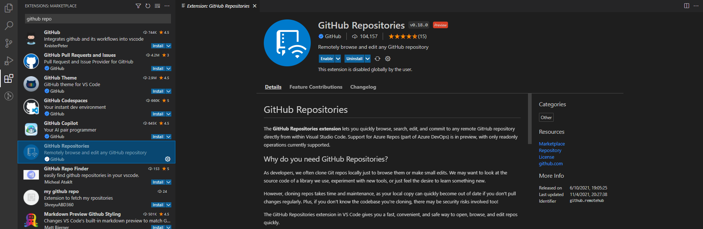
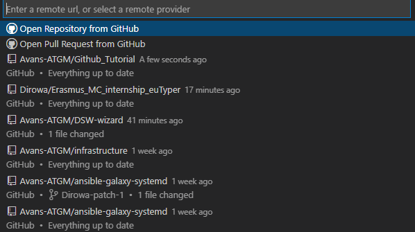
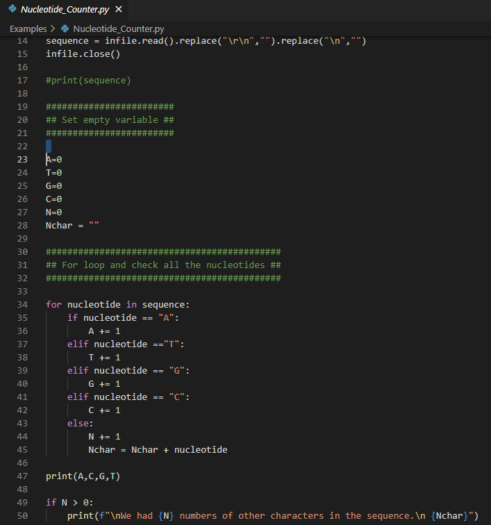
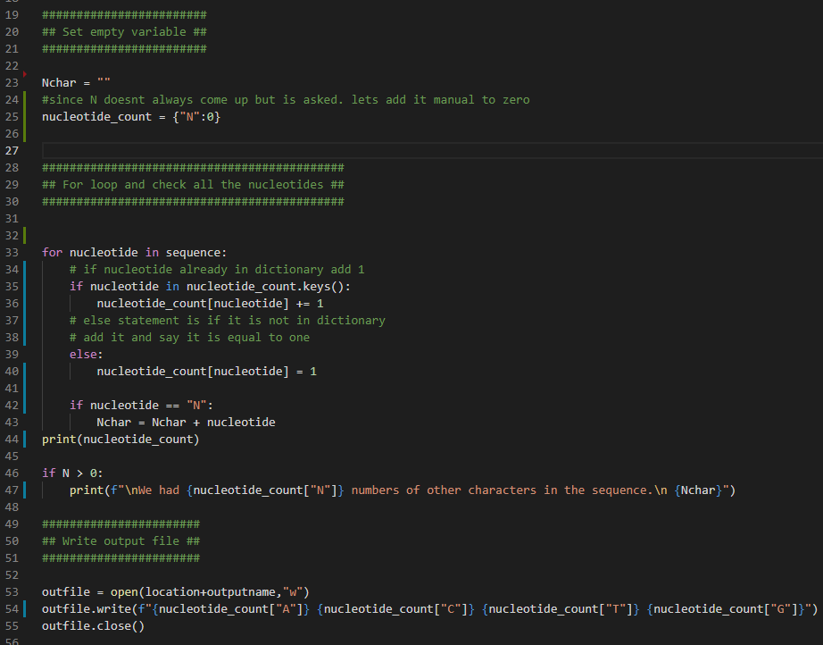
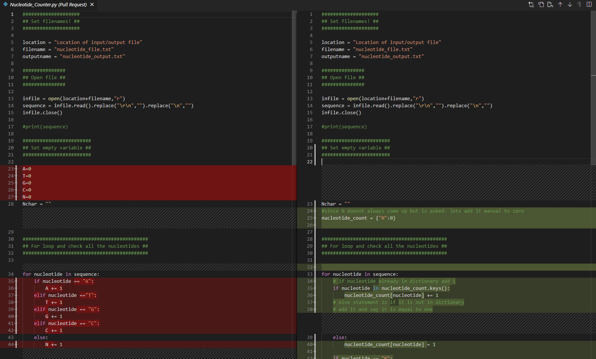

# Welcome to part 3 of the tutorial

<br>

### Introduction
everybody likes some quality of life to make work a little better. For working with Github alot is the internet webpage not optimal. Luckly are there various tools to help us, one of these tools is Visual Code Studio (VCS).

VCS is a source-code editor made by Microsoft and can run on Windos, Linux and macOS. It features debugging, syntax highlighting, snippets, coderefractoring and is even embedded in git. Thereby are there alot of extensions available online to customise VCS to your needs. In this tutorial the installation to creating and using git will be explained.

# Contents

- Installations
- Extensions
- Overview
- accesing a github
- forking, pulling, clone and commiting
- Creating Python codes


## Installation

Like the most softwares, can it be easily installed by using internet. click [here](https://code.visualstudio.com/) for a link to download VCS.


<br>


### Extensions

Before we start we a total tutorial about how VCS works. Lets install a few extensions.
Extensions are little software packages who can install new features of make some quality of life changes.

The extension button is located on the left bar with the following button . 

Search for the following extensions
- Github Pull Requests and Issues
- Github Repositories
- Python



There are many more extensions out there so dont be scared to go some shopping for features you would look handy.
For example there are also features which makes writing in markdown easier or even spellcheck it for you.<br><br><br>

## Overview of VCS

Visual code study contains alot of awesome features but can be quite overwhelming in the start. Luckly we already installed some extensions for quality of life.
But now is the real work.


- Explorer. In this  tab are all files of the current github repository. This is currently still empty. but not for long!
- Search, a search function for in your github repository
- Source controll. If you edited and saved a file from a github, is here your change to make an pull request or to commit it directly
.<br> pull request = sending the owner a nice message about what you would like to change
- run and debug, is for running files, for exammple hello_world.py
- extensions, a place where you can go shopping for new plugins
- Remote exporer. an overview of previous githubs where you have been
- github, here is the real magic. Every github repository you own or are admin for will be sended to this. when a person makes a pull or fork request you will get an automated message here. 

On the top bar of VCS are various functions. Files to generate files. Edit to easily edits files. It also possible to openup an terminal and run various codes

On the bottom of the windo is the workspace and branch you are working in.


but enough talking, lets get into some action<br><br><br>


## Getting access to a github repository

Remember the repository you made. lets open it up.
click on the green box in the left under box .

This will open a small terminal above and click on "open remote repository".

 
 In this window you fill in the URL of the github repository you created earlier.


Every time you have added a github repository. you dont have to search the url again. when clicking the remote repository you will find a overview off all repository you have worked in. you also see if you need to update a repository locally in VCS. In this is it also possible to look up pull requests and access pulled repositories. When you have done this. is it possible to view and edit all files in the explorer tab.




## Creating a branch to work on

- open the repository of this github tutorial
````
https://github.com/Avans-ATGM/Github_Tutorial
````
- Create a new branch to work in and give it a usefull name.<br>
A new branch can be opend by clicking on this button below  <br> and click on ``` + Create new branch ``` <br>
since we are testing, lets call it 
````
test_[your_username]
````

So now we have a copy from the mainbranch. in this we can code and give adjustment. <br> After we edited or created some new files we can merge it back into main by creating a pull request
<br>
In the Examples directory is the file "Nucleotide_Counter.py"  lets improve that one.

Here we see a for loop to count all the nucleotides. Since we are pretty good Python coders we can improve it. 

Lets make it a dictionary loop to reduce the number of lines.<br> It should look like something like this.



Safe all your work locally by clicking on file and then safe, or close the window and a message will pop up. <br><br>

## Opening a pull request

We have edited the python code to be more efficient and lesser lines. 
Lets make a pull request to merge it back to the main branch.

- click on the Source controll tab.
- click on commit to safe all changes to your current branch.
- click on create pull request. <br> 

The following window should pop up.<br>
in this window is it possible to define to what branch your branch should be merged with.<br>
Remember to give the pull request a meaningfull name (fixing typo's in github_tutorial.md) in the description can you give a more detailed explaination about what and why you changed codes.


## Reviewing a pull request
So you have created your first pull request. but that doesnt mean that all changes are directly onto the main branch. Commonly do other Github maintainers of the page review your new branch. Even in VCS can you get an message that someone created a pull request for an Github repository you own or are admin of.<br> This can be incredible usefull when working together on a group project.

You can find these in the Github tab and gives the following overview.


Once The pull request is openend you can see which files are added, removed or changed. For example this is the python code we adjusted.




Inside the code is it also possible for reviewers to comment on a line of your code. In this certain questions or unclearity can be asked. The command can be made to hover with your cursor on a line number. If this occours you will also get a email notification that this has occourd. Or even in Visual Code Studio can you also see the comments and even the response of reviewers

 <br><br>

 <br><br>

In this phase of reviewing is it commonly that codes will still be adjusted or questions be asked before it is approved for reviewing.

When you click on Description you see the total overview of the pull request. It is also possible to ask for certain reviewers

 <br><br>


