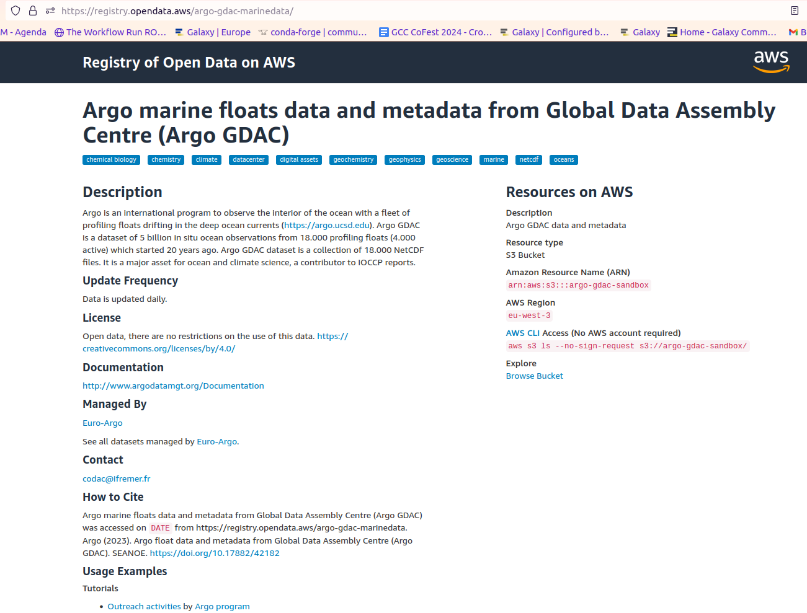
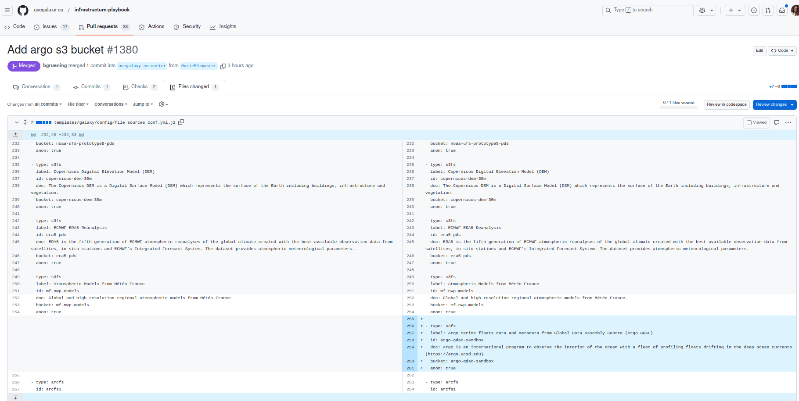

This tutorial demonstrates how to implement an S3 bucket as a Galaxy file-source within Galaxy. We will add here the public Argo data Amazon S3 bucket.
Argo is an international program that observes the interior of the ocean with a fleet of profiling floats drifting in the deep ocean currents (https://argo.ucsd.edu). It started 20 years ago and is a dataset of 5 billion in situ ocean observations from 18.000 profiling floats (4.000 active). The Argo GDAC dataset is a collection of 18.000 NetCDF files. It is a major asset for ocean and climate science and a contributor to IOCCP reports.


> <agenda-title></agenda-title>
>
> In this tutorial, we will cover:
>
> 1. TOC
> {:toc}
>
{: .agenda}

# Find the information you need
> <hands-on-title>Find an S3 bucket</hands-on-title>
> Go on [Amazon Sustainability Data Initiative](https://exchange.aboutamazon.com/data-initiative). 
>
> There you can visit the [catalog of data](https://registry.opendata.aws/collab/asdi/), and by searching for Argo you can directly get to the [Argo registry](https://registry.opendata.aws/argo-gdac-marinedata/).
>
> On this last page you'll find all the information you'll need to add the S3 bucket to Galaxy 
> 
{: .hands_on}


# Add the S3 bucket 

> <hands-on-title>Add on Galaxy</hands-on-title>
>    - If not already done clone the Galaxy Europe [Infrastructure-playbook repo](https://github.com/usegalaxy-eu/infrastructure-playbook/tree/master)
>    - Create a branch on your fork
>    - Go to the file **file_sources_conf.yml.j2** in **templates/galaxy/config/**
>
> There you can edit the file and add your S3 bucket by adding a Argo specific section, like in the following:
> ```
> - type: s3fs
>   label: Argo marine floats data and metadata from Global Data Assembly Centre (Argo GDAC)
>   id: argo-gdac-sandbox
>   doc: Argo is an international program to observe the interior of the ocean with a fleet of profiling floats drifting in the deep ocean currents (https://argo.ucsd.edu). 
>   bucket: argo-gdac-sandbox
>   anon: true
> ```
> 
>
> Finally, commit your changes and write a nice message for the admin when you open your Pull Request.
{: .hands_on}

# Conclusion 
Here you are all set and once your Pull Request is merged you'll soon be able to see your bucket in **upload data**, **Choose remote files**, and then search for your bucket label !

