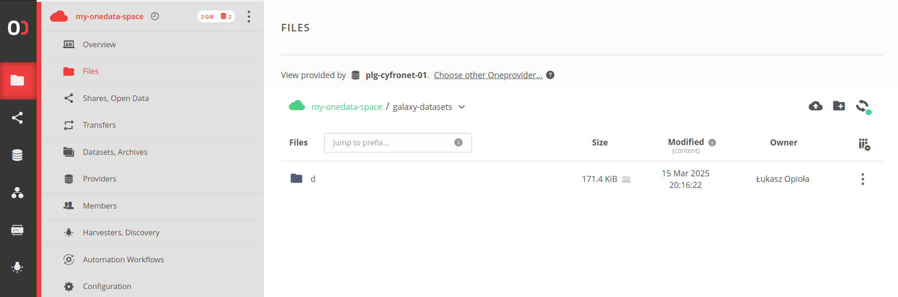

> <agenda-title></agenda-title>
>
> 1. TOC
> {:toc}
>
{: .agenda}


# Prerequisites

It's recommended that you have basic knowledge about Onedata and access 
to a Onedata ecosystem, so that you can test the configuration. If needed, follow 
[this tutorial]()
first!


# Introduction

This tutorial will walk you through the configuration of four different types of Onedata 
connectors:

1. [Predefined Remote File Source](#predefined-remote-file-source) — provides all
   users with access to a predefined Onedata Space (e.g., for shared training
   datasets) without requiring individual configuration.

2. [BYOD (Remote File Source) templates](#byod-remote-file-source-templates) —
   similar to the Predefined Remote File Source, but uses templates and vault for secure
   credential storage, allowing users to configure multiple Onedata connections
   with their own credentials.

3. [Object Store — global Storage Location](#object-store---global-storage-location) — 
   configures Onedata as Galaxy's global storage backend (common for all users),
   where all datasets are stored in a specified Onedata Space.

4. [BYOS (Storage Location) templates](#byos-storage-location-templates) —
   enables users to configure their own Onedata Spaces as storage locations for
   their Galaxy datasets.


# Using Ansible?

The guides below pertain to files in the 
[Galaxy project codebase](https://github.com/galaxyproject/galaxy).
If you are using Ansible to manage your Galaxy deployment (which is the
recommended way for production instances), you will find tips at the end
of every subsection, showing how to achieve the same results with Ansible.

In case you are using jinja templates, make sure all of them are listed in
the `galaxy_config_templates` section for group_vars of each of the hosts.


# Common Configuration

Before configuring Onedata connectors, there are a few common elements that need
to be set up:

## Dependencies

For Remote File Sources (predefined and BYOD templates), install the
`fs.onedatarestfs` library (preferably adding it to the Python's requirements
file). Take a look at `lib/galaxy/dependencies/conditional-requirements.txt` for
the newest version:
```
fs.onedatarestfs>=21.2.5.2  # type: onedata, depends on onedatafilerestclient
```

For Object Store configuration, only `onedatafilerestclient` is required. However, 
if you're already installing `fs.onedatarestfs` for Remote File Sources, you don't 
need to add it separately as it's included as a dependency.

If you're only using Object Store functionality, you can add just:
```
onedatafilerestclient>=21.2.5.2
```

> <tip-title>Using Ansible</tip-title>
> Skip this step — conditional requirements should be collected automatically.
{: .tip}

## Vault Configuration

For BYOD and BYOS templates, you need to configure a vault to securely store user credentials:

1. Create `config/vault_conf.yml`:
```yaml
type: database
path_prefix: /galaxy
# Encryption keys must be valid fernet keys
# Generate them using Python:
# from cryptography.fernet import Fernet
# Fernet.generate_key().decode('utf-8')
encryption_keys:
  - KpVfbD7WfsNMxEnAEasql9aqSc1eCqR-S-tJCDyzcw8=
  - s1DDUEjZtFy2xknGIW2AiAE6EiZG5xSD0m_GzXi43G0=
  - qyb7f45l4XdkcuC5y06RlWtaENcPtUgHYekoQJBK1zM=
  # Do NOT use the keys above! Don't be lazy and generate your own.
```

The first key is used for encryption, while additional keys allow for key rotation. 

> <tip-title>Using Ansible</tip-title>
> Put the config in `templates/galaxy/config/vault_conf.yml.j2`, 
> like it has been done 
> [in this example](https://github.com/usegalaxy-eu/infrastructure-playbook/blob/master/templates/galaxy/config/vault_conf.yml.j2).
>
> A `galaxy_vault_encryption_keys` var must be defined for the proper host in
> your playbook. For obvious reasons, it cannot be committed to your repository.
> For reference, take a look at [this PR](https://github.com/usegalaxy-eu/infrastructure-playbook/pull/1159).
{: .tip}

2. Enable it in `config/galaxy.yml`:
```yaml
galaxy:
  vault_config_file: vault_conf.yml
```

> <tip-title>Using Ansible</tip-title>
> Use the group vars file at `group_vars/gxconfig.yml`. 
> See [an example](https://github.com/usegalaxy-eu/infrastructure-playbook/blob/master/group_vars/gxconfig.yml).
{: .tip}

For more details about vault configuration, see the [Galaxy Vault documentation](https://docs.galaxyproject.org/en/latest/admin/special_topics/vault.html).


# Predefined Remote File Source

While the [BYOD (Remote File Source) templates](#byod-remote-file-source-templates) 
allow users to configure their own Onedata access credentials, you can also set
up a predefined Onedata File Source that will be available to all users with
common configuration.

This approach is particularly useful when you want to provide access to shared
resources, such as public training datasets, without requiring user's access to
a Onedata ecosystem.

> <warning-title>Note the security of the credentials!</warning-title>
> This setup is perfect if you have a public Onedata access token that
> [can safely be shared](https://onedata.org/#/home/documentation/topic/stable/tokens-safe-publishing). If the token is not publicly shareable, use a vault to
> store it. Whatever the setup, always set the file source as `writable: false`,
> otherwise the users will be able to write (export) to the remote.
{: .warning}

Example configuration in `config/file_sources_conf.yml`:

```yaml
- type: onedata
  id: gtn_public_onedata
  label: GTN training data
  doc: Training data from the Galaxy Training Network (powered by Onedata)
  # The access token is public and can be shared
  access_token: "MDAxY2xvY2F00aW9uIGRhdGFodWIuZWdpLmV1CjAwNmJpZGVudGlmaWVyIDIvbm1kL3Vzci00yNmI4ZTZiMDlkNDdjNGFkN2E3NTU00YzgzOGE3MjgyY2NoNTNhNS9hY3QvMGJiZmY1NWU4NDRiMWJjZGEwNmFlODViM2JmYmRhNjRjaDU00YjYKMDAxNmNpZCBkYXRhLnJlYWRvbmx5CjAwNDljaWQgZGF00YS5wYXRoID00gTHpaa1pUTTROMkl4WmpjMllXVmpOMlU00WWpreU5XWmtNV00ZpT1RKbU1ETXlZMmhoWTJReAowMDJmc2lnbmF00dXJlIIQvnXp01Oey02LnaNwEkFJAyArzhHN8SlXSYFsBbSkqdqCg"
  onezone_domain: "datahub.egi.eu"
  writable: false
```

> <tip-title>Using Ansible</tip-title>
> Put the config in `templates/galaxy/config/file_sources_conf.yml.j2`, 
> like it has been done 
> [in this example](https://github.com/usegalaxy-eu/infrastructure-playbook/blob/master/templates/galaxy/config/file_sources_conf.yml.j2).
{: .tip}

Note that you don't need to configure `user_preferences_extra_conf.yml` in this case, as all access parameters are specified directly in the File Sources configuration.


## Testing

Follow the Onedata 
[import]()
guide.


# BYOD (Remote File Source) templates

BYOD (Bring Your Own Data) allows users to configure their own Onedata File
Sources using templates. This feature requires a vault for secure credential
storage, but users can create multiple File Sources with different
configurations, possibly connecting to different Onedata ecosystems.

1. Configure the vault as described in the [Vault Configuration section](#vault-configuration).

2. Enable the Onedata template by creating or modifying `config/file_source_templates.yml`:

   ```yaml
   - include: ./lib/galaxy/files/templates/examples/onedata.yml
   ```

   > <tip-title>Using Ansible</tip-title>
   > Put the config in `templates/galaxy/config/file_source_templates.yml.j2`, 
   > like it has been done 
   > [in this example](https://github.com/usegalaxy-eu/infrastructure-playbook/blob/master/templates/galaxy/config/file_source_templates.yml.j2).
   {: .tip}

3. Ensure there is the main Galaxy config file (`config/galaxy.yml`) and it includes the
   config file above:
   ```yaml
   galaxy:
     ...
     file_source_templates_config_file: file_source_templates.yml
   ```

   > <tip-title>Using Ansible</tip-title>
   > Use the group vars file at `group_vars/gxconfig.yml`. 
   > See 
   > [an example](https://github.com/usegalaxy-eu/infrastructure-playbook/blob/master/group_vars/gxconfig.yml).
   {: .tip}

This template defines a form that users will see when creating their own Onedata File Source. 
It collects the same configuration parameters that administrators specify when setting up 
a [Predefined Remote File Source](#predefined-remote-file-source) (like Onezone domain, access token, 
etc.), but allows users to provide their own values.

For required dependencies, see the [Dependencies section](#dependencies) in Common Configuration.


## Testing

Follow the Onedata 
[import]()
and
[export]()
guides.


# Object Store - global Storage Location

Galaxy supports various object store backends for storing datasets. While the [Object Store tutorial]() provides a comprehensive overview of the feature, this section focuses specifically on configuring Onedata as a global object store, available to all users.

To use Onedata as an object store:

1. Make sure there is a `config/object_store_conf.yml` configuration file with Onedata
   section. The relevant snippet can be found in config
   [samples](https://github.com/galaxyproject/galaxy/blob/dev/lib/galaxy/config/sample/object_store_conf.sample.yml).
   At the time of writing this tutorial, the config looks like the following:

   ```yaml
   type: onedata
   auth:
     access_token: MDAxY2xvY2F00aW9uIGRhdGFodWIuZWdpLmV1CjAw...
   connection:
     onezone_domain: datahub.egi.eu
     disable_tls_certificate_validation: false
   space:
     name: my-onedata-space
     galaxy_root_dir: ./galaxy-data
   cache:
     path: database/object_store_cache_onedata
     size: 1000
     cache_updated_data: true
   extra_dirs:
     - type: job_work
       path: database/job_working_directory_onedata
   ```
   
   Overwrite the following parameters with your values:
   - **access_token**: an access token suitable for data access (**write-enabled** and allowing calls to the Oneprovider REST API).
   - **onezone_domain**: the domain of the Onezone service (e.g., datahub.egi.eu).
   - **name**: the name of the Onedata Space where the Galaxy data will be stored.
   - **path**: the relative directory path in the Space under which the Galaxy data will be stored (optional, defaults to Space root).

   > <tip-title>Using Ansible</tip-title>
   > Put the config in `templates/galaxy/config/object_store_conf.yml.j2`.
   {: .tip}
   
2. Ensure there is the main Galaxy config file (`config/galaxy.yml`) and it includes the config:

   ```yaml
   galaxy:
     ...
     object_store_config_file: object_store_conf.yml
   ```
   
   > <tip-title>Using Ansible</tip-title>
   > Use the group vars file at `group_vars/gxconfig.yml`. 
   > See 
   > [an example](https://github.com/usegalaxy-eu/infrastructure-playbook/blob/master/group_vars/gxconfig.yml).
   {: .tip}

> <warning-title>Switching object store types</warning-title>
> If you're switching from another object store type, you'll need to handle the migration of existing datasets. This process is not covered in this tutorial and should be carefully planned for production instances.
{: .warning}

For required dependencies, see the [Dependencies section](#dependencies) 
in Common Configuration.

For more details about object store configuration options and best practices, see the 
[Object Store tutorial]().


## Testing

Upload some new data to Galaxy, or run a workflow to produce results. Then
navigate to your Onedata account (e.g. [https://datahub.egi.eu](https://datahub.egi.eu))
and open the Space (and the path) that you have put down in the config. You
should see the Galaxy data:




# BYOS (Storage Location) templates

BYOS (Bring Your Own Storage) allows users to configure their own Onedata Storage Locations using templates. Similar to [BYOD](#byod-remote-file-source-templates), this feature requires a vault for secure credential storage.

1. Configure the vault as described in the [Vault Configuration section](#vault-configuration).

2. Enable the Onedata template by creating or modifying `config/object_store_templates.yml`:

   ```yaml
   - include: ./lib/galaxy/objectstore/templates/examples/onedata.yml
   ```

   > <tip-title>Using Ansible</tip-title>
   > Put the config in `templates/galaxy/config/object_store_templates.yml.j2`, 
   > like it has been done 
   > [in this example](https://github.com/usegalaxy-eu/infrastructure-playbook/blob/master/templates/galaxy/config/object_store_templates.yml.j2).
   {: .tip}

3. Ensure there is the main Galaxy config file (`config/galaxy.yml`) and it includes the
   config file above:
   ```yaml
   galaxy:
     ...
     object_store_templates_config_file: object_store_templates.yml
   ```

   > <tip-title>Using Ansible</tip-title>
   > Use the group vars file at `group_vars/gxconfig.yml`. 
   > See 
   > [an example](https://github.com/usegalaxy-eu/infrastructure-playbook/blob/master/group_vars/gxconfig.yml).
   {: .tip}

This template provides users with a form to configure their Onedata Storage Location, collecting information such as:
- Onezone domain and access token
- Space name and path for storing datasets
- Cache and performance settings

For required dependencies, see the [Dependencies section](#dependencies) 
in Common Configuration.


## Testing

Follow the Onedata 
[user-owned storage]()
guide.
