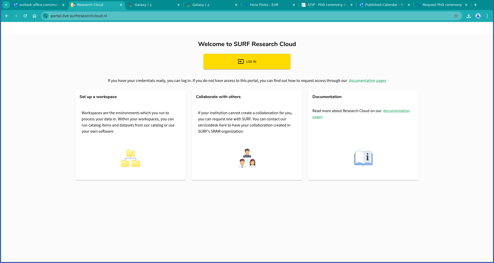
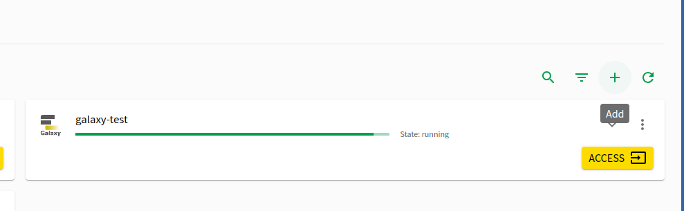
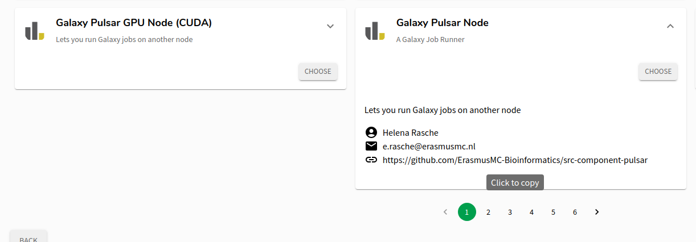
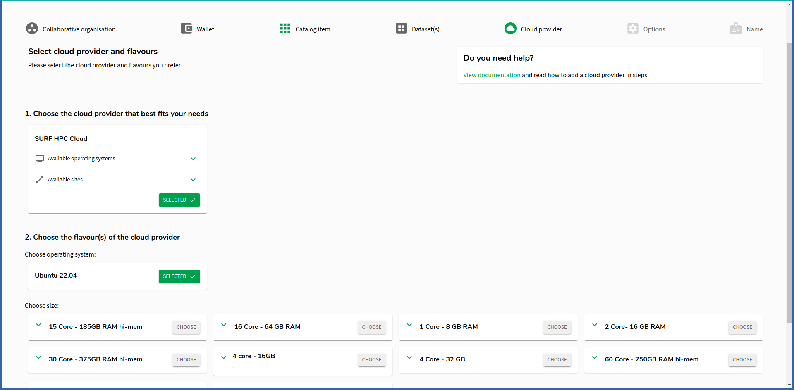
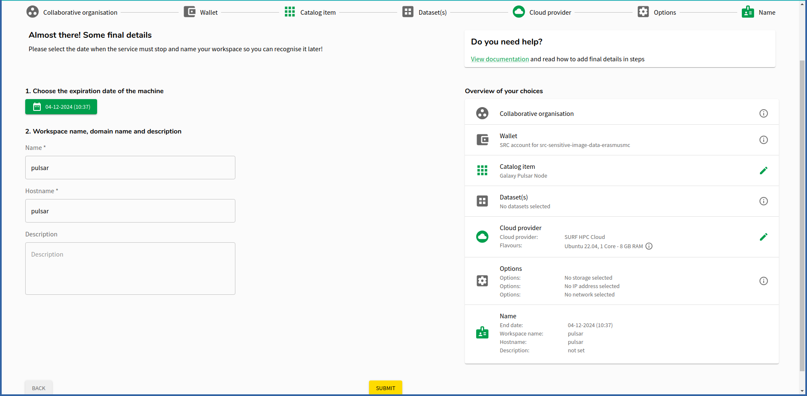
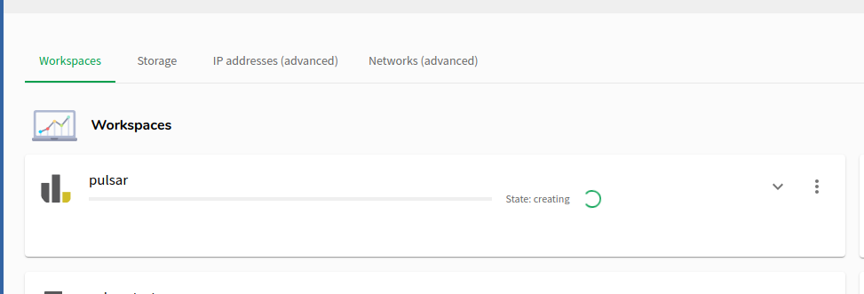
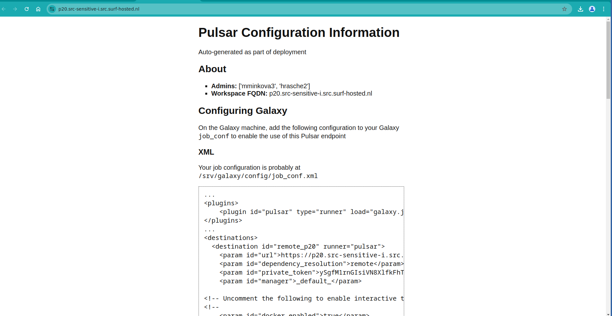
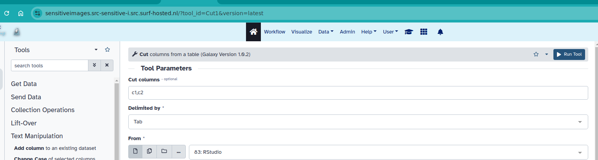

Using Pulsar via the {SRC} allows researchers to start Pulsar instances on-demand to expand their computational resources and even access GPUs to help and analyze their data in a secure environment following the {GDPR}.

The instance provides secure authentication, where users must have a SURF Research account prior to this tutorial, have set the {SRAM} authentication method, and connect an SSH key to their accounts. In case you are not familiar with {SRC} and need help in setting up your accounts, please follow the instructions on the [SURF Knowledge Base](https://servicedesk.surf.nl/wiki/display/WIKI/SURF+Research+Cloud)

Pulsar instances can be started and stopped on demand, depending on personal cases and requirements. Inside the SRC members should have access to all publicly available catalog items. If you are not able to create a catalog item, please [contact SURF servicedesk](mailto:servicedesk@surf.nl).

> <agenda-title></agenda-title>
>
> 1. TOC
> {:toc}
>
{: .agenda}

# Prerequisites

This tutorial assumes you are member of a {CO} in {SRAM} that has access to {SRC} and a wallet with budget in SRC with enough sources to create Galaxy and Pulsar catalog items. (For more information please refer to the [SURF Knowledge Base](https://servicedesk.surf.nl/wiki/display/WIKI/Budgets%2C+wallets%2C+contracts).

You should have previous experience working with data inside Galaxy.

> <tip-title>SSH Access Required</tip-title>
> SSH access is required to reconfigure your Galaxy instance. Please make sure you set an SSH key in your SRAM account if you are planning to use Galaxy in SRC for this tutorial.
{: .tip}

> <hands-on-title>Log In to SRC</hands-on-title>
> 1. Log in to [SURF Research Cloud](https://portal.live.surfresearchcloud.nl/)
>
>    
{: .hands_on}

# Launching Pulsar in SRC

> <hands-on-title>Launching Pulsar</hands-on-title>
> 1. In the **Workspaces Tab** on the bottom half of the screen, you'll find a **Plus Button** at right to add a new workspace
>
>    
>
> 2. Clicking that will let you choose any of the *Catalog Items* from SRC. They've got a wide selection but we're only interested in the two Pulsar Catalog Items
>
>    
>
>    > <warning-title>GPUs are Expensive</warning-title>
>    > The GPU nodes are *expensive*. In fact it
>    > was the motivating reason for building this catalog item: to enable you to
>    > launch a node, run some computations, and shut it down, saving you money.
>    {: .warning}
>
> 3. Creating a "workspace" from a catalog item (a template) is easy, most of the options are fixed for you, you just need to choose the size of the item. Pick an appropriate size for whatever computations you need to do.
>
>    
>
> 6. Pick a name, it can be anything, it does not matter. Check the expiration date to ensure it is just enough time for your computation and no more. 
>
>    > <tip-title>Expiration Date</tip-title>
>    > The standard life-time of the VM is 5 days. If you need it for longer, this option can be changed once the machine is running.
>    > Note, that once the machine is expired and deleted it cannot be restored! Plan accordingly and migrate your data in time to prevent data loss!
>    >
>    > This is an incredibly useful feature as it saves you from forgetting to destroy a VM. Especially for GPU nodes it can help you ensure that they disappear after your computation is complete.
>    {:.tip}
>
>    
>
> 7. Click submit when you are happy with the configuration.
>
{: .hands_on}

Once done, the workspace will be created for you. You'll need to wait ~5 minutes usually. Go for a beverage ☕️



## Using Pulsar on SRC

> <hands-on-title>Access the Information Page</hands-on-title>
> 
> 1. Once the workspace is up, you'll see an **Access** link:
> 
>    
> 
> 2. Click that will show you a Pulsar information page. This page is running on your pulsar node itself, and is restricted to ensure only authorised members can access the contents. It includes some configuration you will need to copy to your Galaxy node in order to make use of the Pulsar node.
> 
>    
{: .hands_on}

This information page should have more than enough information to connect this Pulsar instance to your Galaxy server. You will need to reference information from this page in the following steps:

> <hands-on-title>Configuring Galaxy to use SRC Pulsar</hands-on-title>
> 1. Collect the requirements for accessing the Galaxy machine. You will need:
> 
>    - your username from the first step
>    - your SSH key that is associated with your SRAM account
> 
> 2. SSH into your *Galaxy* machine (not pulsar!).
> 
>    ```
>    ssh -i path/to/your/sram-ssh-key username@galaxy.src-winter-school.src.surf-hosted.nl
>    ```
> 
> 3. You will need to `sudo su` to do anything useful. Do that now.
> 4. `cd /srv/galaxy/` to move into the directory Galaxy configuration is stored.
> 5. The configuration is discussed fully in the Pulsar information, but it will be briefly covered here as well. Generally there are a few steps that must be followed:
>
>    - A runner must be registered
>    - A destination/environment must be added with the pulsar details
>    - Some tools should be redirected to this Pulsar
>
>    Here is an example of what those changes *might* look like in your Galaxy node.  In this example our pulsar node was called `p20` but that will be different for you.
> 
>     
>
>
>    ```diff
>     runners:
>       local:
>         load: galaxy.jobs.runners.local:LocalJobRunner
>         workers: 4
>       condor:
>         load: galaxy.jobs.runners.condor:CondorJobRunner
>    +  pulsar:
>    +    load: galaxy.jobs.runners.pulsar:PulsarRESTJobRunner
>
>     execution:
>       default: docker_dispatch
>       environments:
>         local_destination:
>           runner: local
>         # ... probably some more environments here.
>
>    +    remote_p20:
>    +       runner: pulsar
>    +       url: https://p20.src-sensitive-i.src.surf-hosted.nl
>    +       private_token: ySgfM1rnGIsiVN8Xlfk
>    +       dependency_resolution: remote
>    +       manager: _default_
>    +       # Uncomment the following to enable interactive tools:
>    +       docker_enabled: true
>    +       docker_set_user: null
>    +       docker_memory: "8G"
>    +       singularity_enabled: false
>    +       tmp_dir: true
>    +       outputs_to_working_directory: false
>    +       container_resolvers:
>    +       - type: explicit
>    +       require_container: True
>    +       container_monitor_command: /mnt/pulsar/venv/bin/galaxy-container-monitor
>    +       container_monitor_result: callback
>    +       container_monitor_get_ip_method: command:echo p20.src-sensitive-i.src.surf-hosted.nl
>
>
>     tools:
>     - class: local # these special tools that aren't parameterized for remote execution - expression tools, upload, etc
>       environment: local_env
>     - id: Cut1
>       environment: condor_1x1
>    +- id: interactive_tool_jupyter_notebook
>    +  environment: remote_p20
>    +- id: interactive_tool_rstudio
>    +  environment: remote_p20
>    ```
{: .hands_on}

With the above, the minimal configuration is done, the Galaxy server will be aware of the Pulsar node, and two tools will be sent there: the Jupyter and RStudio Interactive Tools.

While you will simply copy-paste the runner and environment, you will need to identify yourself which tools should go to this Pulsar node.
You can find the tool ID from the dropdown at the top right, just to the left of "Execute" at the top:



> <tip-title>An Easy Configuration Option: Send Every Job to Pulsar</tip-title>
> 
> If you are running jobs for a limited period of time, you might consider making this pulsar node the default destination. Remember to use the `remote_...` name of your pulsar node, based on what you copied. Not `remote_p20`.
> 
> ```diff
>  execution:
> -  default: docker_dispatch
> +  default: remote_p20
>    environments:
>      local_destination:
>        runner: local
> ```
{: .tip}

With that, you're done, and for the length of time your node is running, your chosen tools (or everything) will be executed on that Pulsar node with more memory and CPU than the Galaxy host, and maybe a GPU as well!

Congratulations on launching Pulsar in SRC! 🌌
