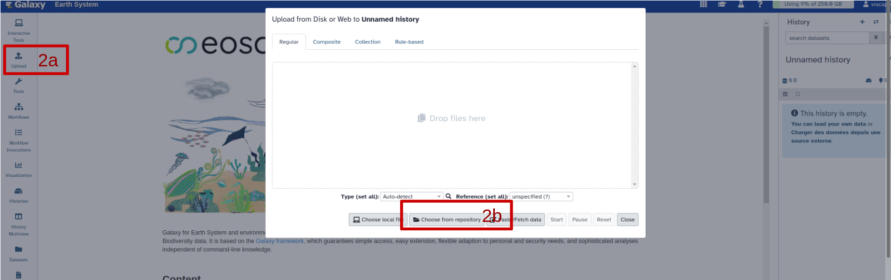
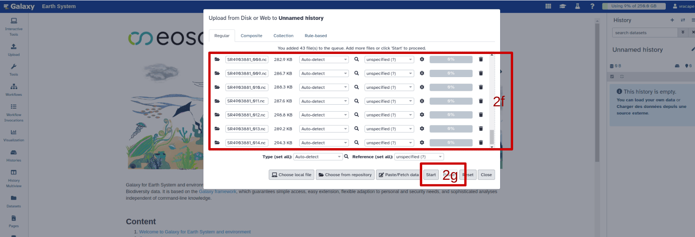
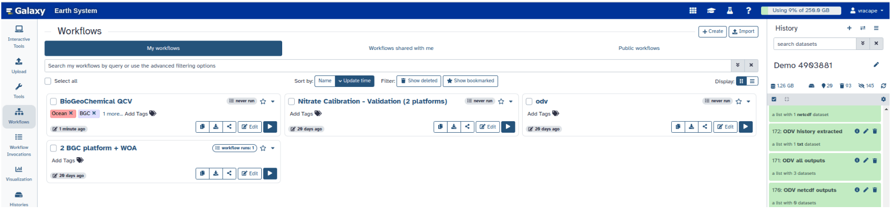
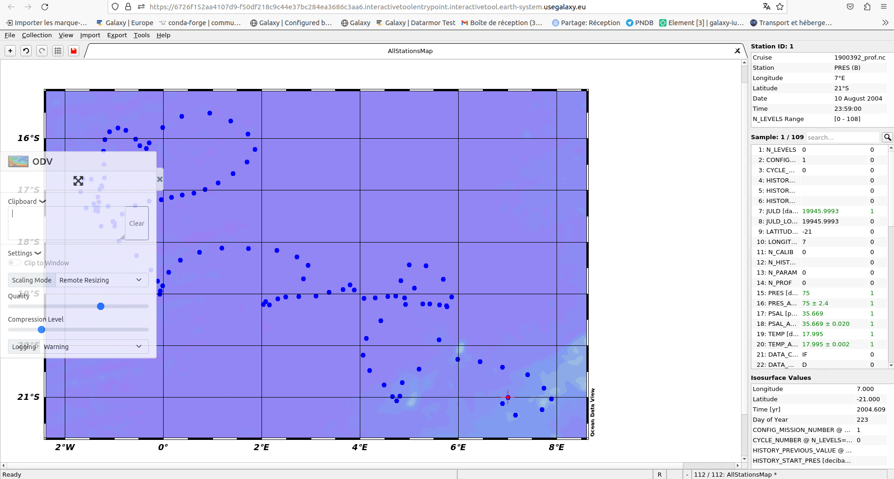
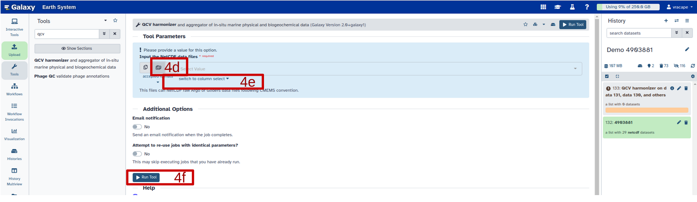
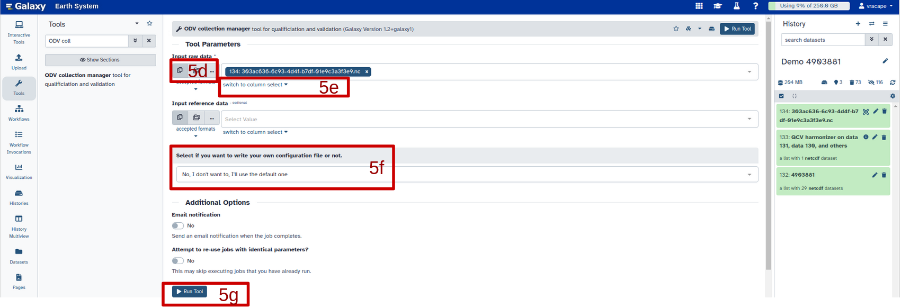
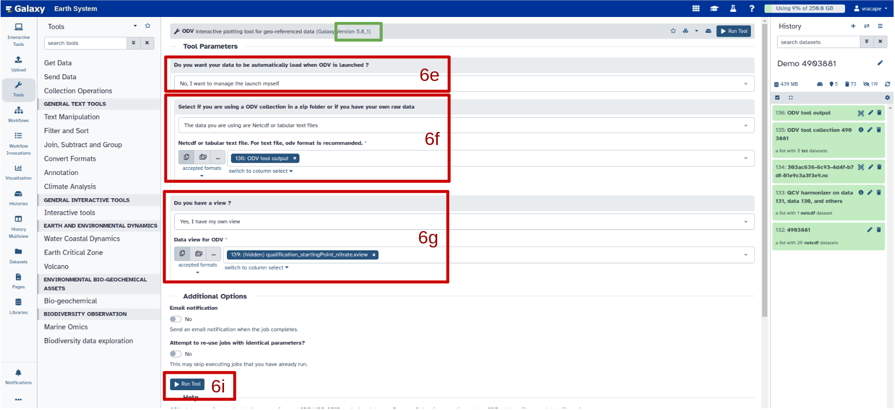
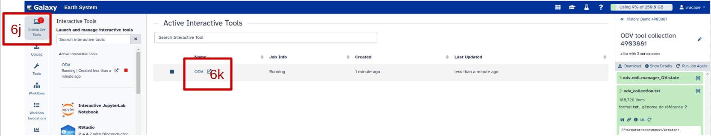
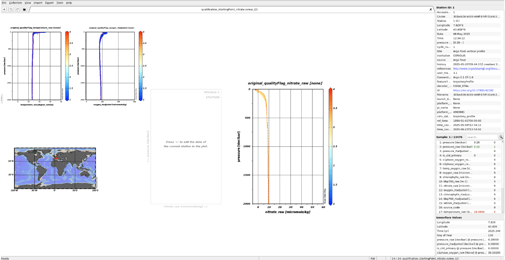
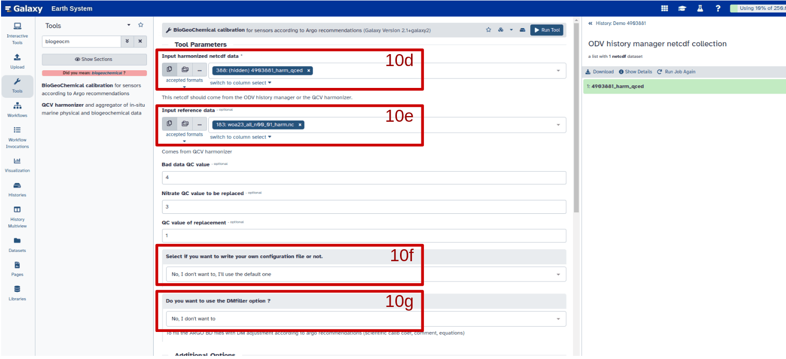

This tutorial explains how to qualify and calibrate the nitrate sensor mounted on the argo float 4903881 by building its own Galaxy workflow. This tutorial is accompanied by screenshots to help guide you. If you have any difficulties, or suggestions for improvement, please contact us (link to the contact page). For your information, timing for running tools depends on the number of files, their size and/or the number of people working on Galaxy.

> <warning-title>Do not change file name</warning-title>
> DO NOT change file names to ensure that any changes you make with ODV will be carried over. However, it is possible to change the name of galaxy collections to make them easier to find.
{: .warning}

> <agenda-title></agenda-title>
>
> In this tutorial, we will cover:
>
> 1. TOC
> {:toc}
>
{: .agenda}

> <details-title>Short introduction on how Galaxy works</details-title>
>
> You can come back to where you left off the tutorial anytime by clicking .
>
> > <hands-on-title>Log in to Galaxy</hands-on-title>
> > 1. Open your favorite browser (Chrome, Safari or Firefox as your browser, not Internet Explorer!)
> > 2. Browse to your [Galaxy instance](https://earth-system.usegalaxy.eu/)
> > 3. On the top panel go to **Login or Register**
> >
> {: .hands_on}
>
> The Galaxy homepage is divided into three panels:
> * Tools on the left
> * Viewing panel in the middle
> * History of analysis and files on the right
>
> 
>
> The first time you use Galaxy, there will be no files in your history panel.
{: .details}

# Manage your data 

> <hands-on-title>Get data</hands-on-title>
> Upload the argo data files (meta, core and BGC) of the float 4903881 from the S3 service. 
> - 2a. Click on “Upload” on the vertical panel on the left. A pop-up is launched
> - 2b. Click on “Choose from repository” at the bottom of the popup
>
> 
>
> - 2c. Search “argo” in the top search bar. “Argo marine floats data and metadata from Global Data Assembly Centre (Argo GDAC)” appears in the label column just below
> - 2d. Select it then “pub/dac/coriolis/4903881” then tick “4903881_meta.nc” + “profiles/”
> - 2e. Click on “Select” on the bottom right of the pop-up. the list of the file to download is displayed
> - 2f. Remove the Synthetic files (not useful for qualification & calibration actions)  by clicking on the corresponding garbage can on the right
> - 2g. Click on “start” on the bottom of the pop-up. Once the download is complete (green color), files are stored in your history on the right.
>
> 
{: .hands_on}

> <hands-on-title>Organize your data</hands-on-title>
> Create a dataset list/collection of the argo float 4903881 by clicking on
> - 3a. “Select item” 
> - 3b.  “Select all” (appears just after 3a and at the same level on the right)
> - 3c.  “All ## selected”
> - 3d.  “Auto build list” >> a pop-up is launched
> - 3e.  Enter the name of the data collection : 4903881
> - 3f.   turn off “Remove the file extension”
> - 3g.  Click on “Build” on the bottom right of the pop-up
>
> 
> 
>
> Once the collection is ready, everything is green in the history panel. It is possible to limit the history to useful files or collections by clicking on the eyes above the files list in the history.
{: .hands_on}



> <hands-on-title> Run a predefined workflow </hands-on-title>
> 4a. Click on “Workflows” on the vertical panel on the left. A pop-up is launched
> 4b. Search “Argo-Glider Nitrate QCV” in the top search bar for run the workflow of one float
> 
> 
> 
> # Workflow human in the loop
> 
> Now you've got your workflow running, however this workflow is composed of both interactive and non interactive tools. Thus, for the interactive tools we need you !
> 
> > <tip-title>Copy pasting between computer and ODV</tip-title>
> > You can expand the ODV left panel (where there are 3 dots, vertically) to access the "clipboard" menu and paste the content you want to paste on an ODV form. From there you can copy-paste everything from one side to the other. Then, click outside of this panel to collapse it.
> >
> > 
> {: .tip}
> 
> > <tip-title>ODV - Disconnected</tip-title>
> > If at one point your ODV interface becomes grey with a red panel on the top "X ODV - Disconnected", do NOT panic ;) you just need to reload your tab (circular arrow top left)
> {: .tip}
{: .hands_on}

  
# Follow the steps one by one 

## Harmonize, aggregate, and convert the data 

> <hands-on-title>Harmonize and aggregate the data</hands-on-title>
> Running “QCV harmonizer” (link toward tool explanation) for creating the working file
> - 4a. Click on “Tool” just below “Upload” on the vertical panel on the left. A new vertical panel appears. 
> - 4b. Search “QCV harmonizer” in the top search bar
> - 4c. Select the tool. Its configuration page appears on the center
> -  with the following parameters:
>    - *"Input the NetCDF data files"*: 
> 	- 4d. Select “Dataset collection” 
> 	- 4e. Select "Switch to column select” then the `4903881` dataset collection (the collection move from the left to the the right column) OR click on “Selected value” above and add 4903881 dataset collection
> - 4f. Run the tool by clicking on the corresponding button below. At the end of the process, tool delivers an harmonized file, ###_harm.nc (since version 3.0 of the tool), ready for analysis.
>
> 
{: .hands_on}

> <hands-on-title>Convert the data</hands-on-title>
> Running “ODV collection manager” for creating Ocean Data View (ODV) spreadsheet collection and qualifying the dataset.
> - 5a. Click on “Tool” just below “Upload” on the vertical panel on the left. A new vertical panel appears. 
> - 5b. Search “ODV collection manager” in the top search bar
> - 5c. Select the tool. Its configuration page appears on the center
> -  with the following parameters:
>    -  *"Input raw data"*:
> 	- 5d. Select “Multiple Datasets”
> 	- 5e. If the dataset is not yet selected, select "Switch to column select” then the `4903881` dataset collection (the collection move from the left to the the right column) OR click on “Selected value” above and add `4903881` dataset harmonized collection.
>
> > <details-tilte>Multiple datasets<details-title/>
> > Multiple datasets could be selected for merging them in a unique ODV collection and working on multiple platforms at the same time.
> .{: .details}
>
> - 5f. (optional) : It is possible to change the default configuration by selecting to do so:
>    -  *“Select if you want to write your own configuration file or not.”*: `Yes, I to write my own configuration file`
>       - *"Enter operator name"*: `operator name` (optional)
>       -  *"Enter QC convention for the ODV collection output (default: ARGO)"*: `QC convention  for the output file` (default : ARGO QC flag scale, https://archimer.ifremer.fr/doc/00228/33951/32470.pdf - reference table 2)
>       - *"Enter subsetting (default: 1)"*: `1` (optionnal)
>	- *"Enter plt (default: 0 for QV, 1 for demo)"*: `0` (optionnal)
>	These last 2 configuration inputs are here in case a reference file is added to the collection such as WOA for comparison. WOA should be harmonized with the “QCV harmonizer” tool beforehand. 
> - 5g. Run the tool by clicking on the corresponding button below. At the end of the process, the tool delivers an ODV spreadsheet collection, named “odv_collection.txt” and an ODV view, named “qualification_startingPoint_nitrate.xview”, ready for launching the ODV interactive tool. Both files are available in the history panel under the galaxy collection “ODV tool collection”. The odv_collection.txt is available more quickly in history with the name “ODV tool output” as well. “ODV tool collection” also includes YYYY-MM-DDTHHMM_galaxy_odv-coll-manager_QV.log explaining all actions performed by this one. 
>
> 
>
{: .hands_on}

## Qualification and calibration

> <hands-on-title>Qualify the dataset with the ODV interactive tool. </hands-on-title>
> For more information on using ODV, please refer to the ODV user `<guide https://odv.awi.de/fileadmin/user_upload/odv/docs/ODV_guide.pdf>`
>
> - 6a. Click on “Tools” just below “Upload” on the vertical panel on the left. A new vertical panel appears. 
> - 6b. Search “ODV”interactive tool in the top search bar
> - 6c. Select the  . Its configuration page appears on the center
> - 6d. Before selecting the ODV collection, change the version of tool by selecting v5.8_1 with the 3 cubes available on the left in the first grey headband on the top of the central panel
>
> 
>
> -  with the following parameters:
>    - 6e.  *"Do you want your data to be automatically load when ODV is launched ?"*: `Yes, I want my data to be loaded directly` (This is useful to open directly the collection and with a specific xview if this last one is available.)
>    - 6f.  *"Select if you are using a ODV collection in a zip folder or if you have your own raw data"*: `The data you are using are Netcdf or tabular text file`
>    	-  *"Netcdf or tabular text file. For text file, odv format is recommanded."*:  `ODV tool output`
>    - 6g.  *"Do you have a view ?"*: `Yes, I have my own view”`
>    - 6h.  *"Data view for ODV"*: `qualification_startingPoint_nitrate.xview` 
>      For that, click on “ODV tool collection” in the history panel and “drag and drop” the xview in the Data view selected area.
>    - 6i. Run the tool
> 
> 
>
> - 6j. When the ODV interactive tool is ready, a red dot with the number “1” appears on the “Interactive tool” button in the vertical panel on the left. Click it. A new vertical panel appears. 
> - 6k. Launch the ODV interactive tool by clicking the “expended” symbol (when it appears) close to the ODV name. ODV opens in a new window automatically with the selected view (lien vers une explication de la vue).
>
>
> 
> 
> 
>
> 
>
> > <tip-title>ODV - Disconnected</tip-title>
> > If at one point your ODV interface becomes grey with a red panel on the top "X ODV - Disconnected", do NOT panic ;) you just need to reload your tab (circular arrow top left)
> {: .tip}
> 
> > <tip-title>Copy pasting between computer and ODV</tip-title>
> > You can expand the ODV left panel (where there are 3 dots, vertically) to access the "clipboard" menu and paste the content you want to paste on an ODV form. From there you can copy-paste everything from one side to the other. Then, click outside of this panel to collapse it.
> > 
> > 
> {: .tip}
> 
> 
> If you missed “step 6e”, ODV opens with its home page. To import data set, click on the top left : 
>   - file > New  
>   - The “Create New collection” popup window opens;  Give a name to your collection > OK
>   - The “Creating collection” popup window opens; Select “Use .txt, .odv, .var or other file as template” > OK 
>   - The “Select template file” popup window opens; Change “Files of Types” by selected “All Files(*)”. 
>   - Select “working/Documents/ODV/galaxy/data/ODV tool output” > open 
>   - The “Meta variables” popup window opens. Select all meta variable (ctrl a) > OK	
>   - The “Data variables” popup window opens. Select all data variable (ctrl a) > OK		
>   - The “collection properties” popup window opens; Change, if you want, “Data Field”, and “Data type”. Be sure that “Primary Variable” is “pressure [decibar] > Ok
>   - ODV collection is created with the right template and opens on an empty global map.
>   - Click on the top left  : Import> ODV spreadsheet
>   - The “Select spreadsheet file(s)” popup window opens; Change “Files of Types” by selected “All Files(*)” and Select working “/Documents/ODV/galaxy/data/ODV tool output”
>   - The “Meta variable association” popup window opens. all meta variable are already selected > OK
>   - The “Data variable association” popup window opens. all data variable are already selected > OK
>   - Data set is now imported into the new collection
>
> - 6l. Qualify the dataset if necessary. Go to the `<ODV user guide https://odv.awi.de/fileadmin/user_upload/odv/docs/ODV_guide.pdf>` for ODV description or follow the link to video.
{: .hands_on}

> <hands-on-title>Export history once qualification is finished</hands-on-title>
> WARNING : Be sure that all filters or zoom windows are relaxed.
>
> 7a. To export history information, click on the top left : 
>   - Export > History
>   - the “Export station history” opens; Select “working/Documents/ODV/galaxy/outputs
>   - Change the name of the history if you want > Save > OK > OK
>   - close ODV : File > exit
>
> 7b. Once the ODV interactive tool closed, 2 useful outputs are available (green) in the history panel
>   - “ODV history extracted” with the history txt files.
>   - “ODV all outputs” (including ODV collection and history if you want working locally, i.e. on your computer,  or again on this collection)
{: .hands_on}

> <hands-on-title>(optional) Running “ODV history manager”</hands-on-title>
> For reporting you QC flags changes into harmonized dataset before calibrating the nitrate sensor
> - 8a. Click on “Tools” just below “Upload” on the vertical panel on the left. A new vertical panel appears. 
> - 8b. Search “ODV history manager” in the top search bar
> - 8c. Select the tool. Its configuration page appears on the center
> -  with the following parameters:
> - 8d. In “Tool Parameters” section, select for each input “Multiple Datasets” : 
>    -  *"Input netcdf data*" : Select the harmonized NetCDF file(s) created by step 4.
>    -  *"Input history text file"* : history txt file extracted from ODV after changes
>    -  *"Input odv file"* : the ODV spreadsheet txt collection created by step 5
> - 8f. (optional) : It is possible to change the default configuration:
>    -  *"Select if you want to write your own configuration file or not."*: `Yes, I to write my own configuration file`
>    	-  *"Enter QC convention for the ODV collection output (default: ARGO)"*: `QC convention  for the output file` (default : ARGO QC flag scale, https://archimer.ifremer.fr/doc/00228/33951/32470.pdf - reference table 2)
>    	-  *"Enter the ODV convention regarding the changes performed on the odv collection."*: `ODV convention to be reported “EDITFLAGS” (QC changes) “EDITDATA” (Data changes)`, both are selected by default.
> - 8g. Run the tool by clicking on the corresponding button below. At the end of the process, the tool delivers an extended NetCDF files, names “###_qced.nc”  and a csv file summaring reporting in the NetCDF file, names “###_history”, ready for running “Biogechemical Calibration” tool. Both files are available in the history panel under the galaxy collection “ODV history manager netcdf collection” and “ODV history manager csv collection” respectively. “ODV history manager log files collection” includes YYYY-MM-DDTHHMM_galaxy_odv-history-manager_history.log detailing the status of each QC reports and action performed by this one. 
{: .hands_on}

> <hands-on-title>(optional) Choose Reference dataset</hands-on-title>
> The nitrate calibration needs a potential reference data set such as the nitrate WOA annual climatology. For that, upload the nitrate WOA annual climatology with NetCDF format (https://www.ncei.noaa.gov/thredds-ocean/catalog/woa23/DATA/nitrate/netcdf/all/1.00/catalog.html?dataset=woa23/DATA/nitrate/netcdf/all/1.00/woa23_all_n00_01.nc) directly from your computer.
> - 9a. Click on “Upload” on the vertical panel on the left. A pop-up is launched
> - 9b. Click on “Choose local file” at the bottom of the popup
> - 9c. Select the dataset and click on “start”
> - 9d. Once the dataset ready, repeat step 4 for getting the harmonized dataset ready for calibration
{: .hands_on}

> <hands-on-title>Run “Biogeochemical calibration”</hands-on-title>
> Run “Biogeochemical calibration” for calibrating the nitrate sensor
> - 10a. Click on “Tools” just below “Upload” on the vertical panel on the left. A new vertical panel appears. 
> - 10b. Search “Biogeochemical calibration” in the top search bar
> - 10c. Select the tool. Its configuration page appears on the center
> -  with the following parameters:
> - 10d. In “Tool Parameters” section, select for each input “Multiple Datasets” : 
>       -  *"Input  harmonized netcdf data"*: `4903881 harmonized NetCDF file(s)` with QC report created by step 8, named ###_qced.nc. The selection is easier by clicking on the 3 dots “Browse or Upload datasets”
>       -  *"Input reference data"* (optional): `WOA harmonized data` created by step 9 if you want to estimate the reference nitrate from climatology
> - 10e. (optional) - Change the QC configuration if : 
>       - you work with platforms that do not follow the argo flag scale convention
>       - you want to fix adjusted value at QC flag 2 (potentially good) 
>
> 
>
> - 10f. (optional) By default, the tool estimates Nitrate from canyonB by estimating reference pressure automatically and the correction as a linear regression. BUT, you can add many calibration methods to be tested as you want by changing `No, I don’t want to, I’ll use the default one` below the 2nd grey headband on the central panel by  `Yes, I want to write my own configuration file`. Then: 
>   - Click on the “Insert Configurations” button to add calibration methods as many time as needed
>       - for reproducing the default one change the following item `Enter multiple linear regression` by `Single linear regression`
>       - for adding a new method fully automatics with canyon B - don’t change default item value
>       - for adding a new method using your own choices, changes each item by your selection : 
>           -  *"Bypass"*: `The user defines P` 
>		- *"Enter P_value"*: `1000` dbar
>           -  *"Enter multiple linear regression"*: `N` corresponds to the number of breakpoints.
>           -  *"Reference method"* :  `Climatology`
>	    -  *"Reference"*: `WOA`
>           -  *"Resolution"*: `Annual`
>           (be sure you have added WOA harmonized climatology in “Tool parameters/input reference data” section)
>
> Now more than one calibration method are ready to be tested.
>
> 
>
> - 10g. (optional for argo floats) The tool gives the possibility to fill directly original argo nc files with DM information (coefficient, equation, comment, dm operator …) using DM filler tools from C. Schmechtig. For that, do the following:
>   -  *“Do you want to use DMfiller option”*: `Yes, I want to use it`
>   -  *“Input original raw netcdf data”*: `dataset collection 4903881` built at the beginning of the work (step 3). This collection includes indeed all original argo nc files useful to report DM information
>   -  *“Input csv files”*: `csv file` created by step 8 and the “odv history manager” tool.
>   - for the next sections, report all information that are mandatories regarding the:
>   	- institution managing your argo data set
>       - BGC contact point 
>       - BGC DM operator for this action
> If one of the last information are missing or not compatible with the information already available in the nc files (as contact point), the tool does not add DM information in the original files. 
> - 10h. Click on Run tool
> For each calibration method, tool delivers : 
>   - BGC calibration netcdf collection
>   - BGC calibration figure collection
>   - (optional if DM filler is used) BGC calibration tar.gz collection
> with the following label : 
> 	"input harmonized netcdf data file name"_C"number of calibration"-nitrate
> For each calibration, tool delivers the following figures : 
>   - ##_Zvar_ref_detailed.png and ##_Zvar_ref_results.png showing the referenced level estimated by the tool and why. Both figures are done even if the user bypass this section.
>   - ##_Raw-Ref_Analysis_ref#01_LinearModel.png an ##_Raw-Ref_Analysis_ref#01_Rsquared.png (if necessary) showing the multi linear regression results
> If DM filler option is tick, tar.gz includes all BDfiles to be sent back to DAC after choosing the best calibration coefficients.
> 
{: .hands_on}

> <hands-on-title>Calibration validation with ODV visualization</hands-on-title>
> For the validation step, run again : 
>   - step 5 by adding all the netcdf files available in “BGC calibration netcdf collection”for creating the odv collection
>   - step 6 for the visualization
{: .hands_on}

# Conclusion

# Extra information

Coming up soon even more tutorials on and other Earth-System related trainings. Keep an  open if you are interested!

