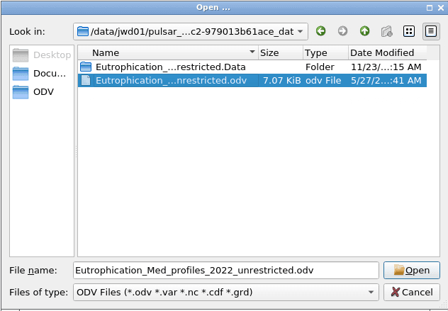
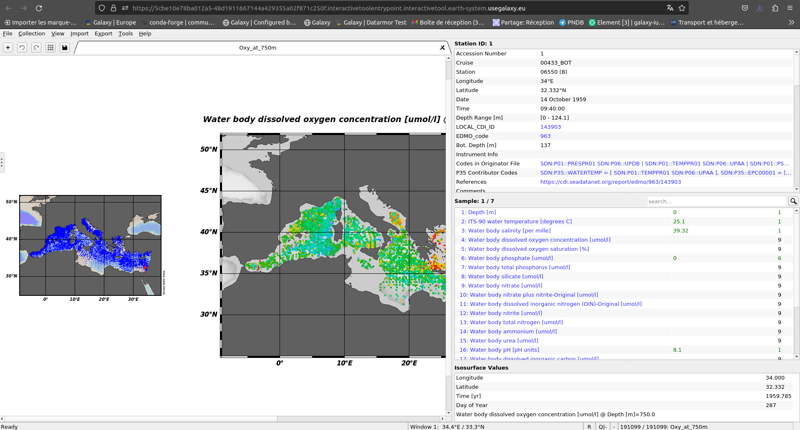
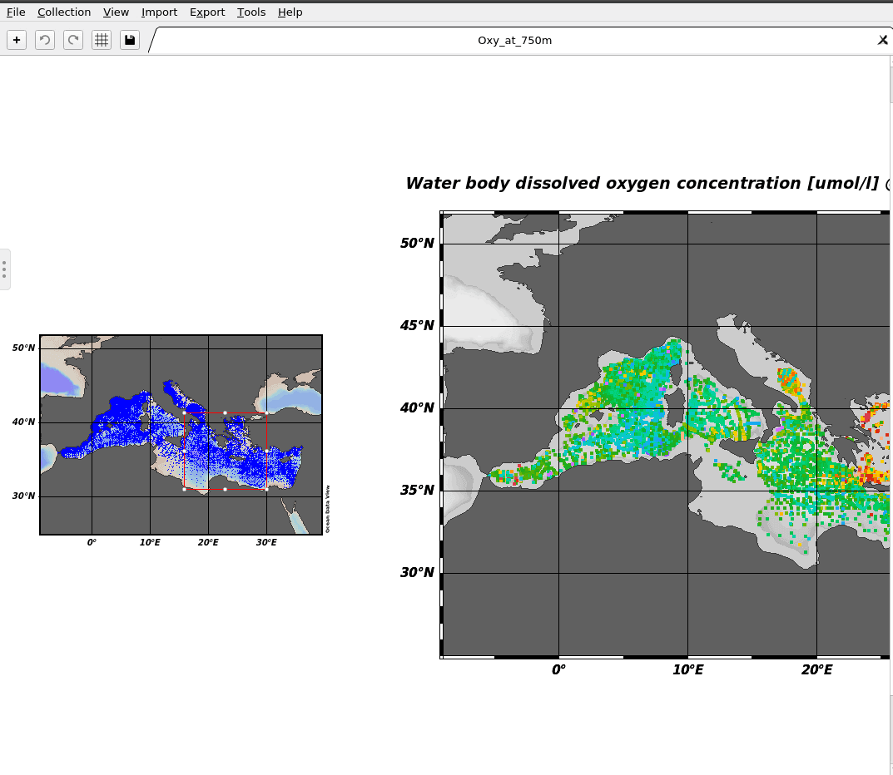
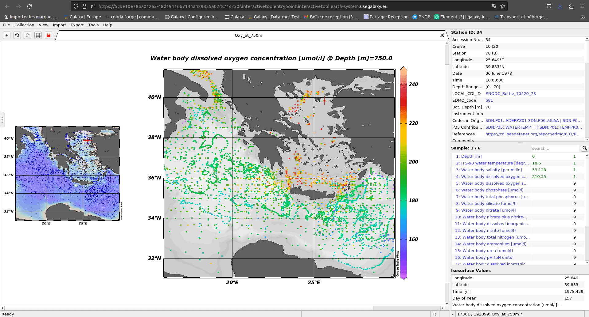
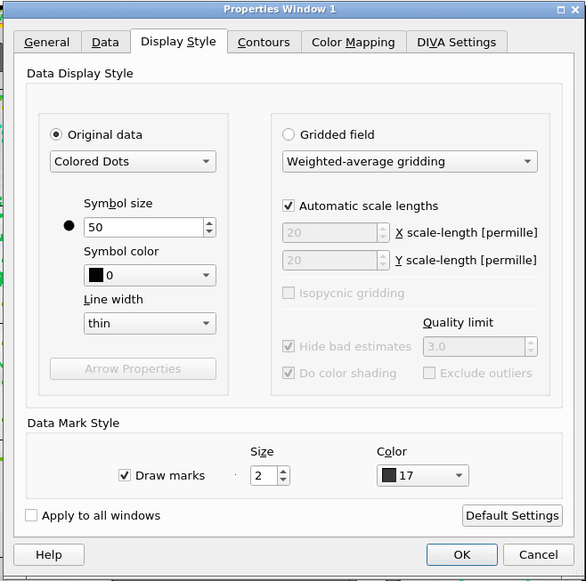
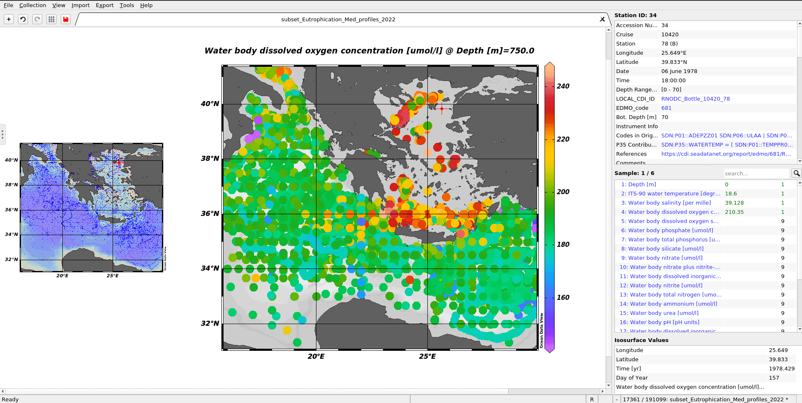
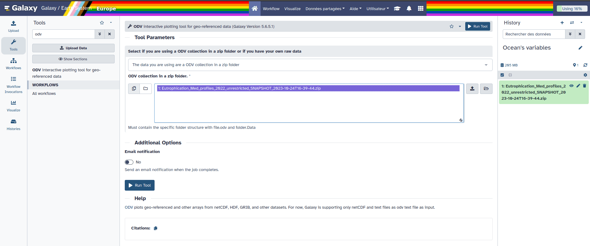
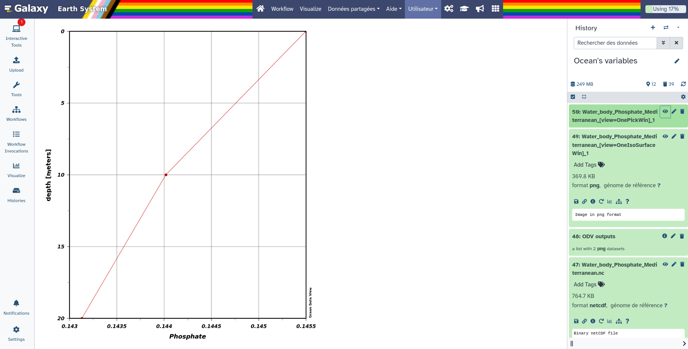

This tutorial explains how to qualify and calibrate the nitrate sensor mounted on the argo float 4903881 by building its own Galaxy workflow. This tutorial is accompanied by screenshots to help guide you. If you have any difficulties, or suggestions for improvement, please contact us (link to the contact page). For your information, timing for running tools depends on the number of files, their size and/or the number of people working on Galaxy.

> <agenda-title></agenda-title>
>
> In this tutorial, we will cover:
>
> 1. TOC
> {:toc}
>
{: .agenda}



# Manage your data

> <hands-on-title>Prepare your history</hands-on-title>
> 1. Create a new history for this tutorial and give it a name (for example “Ocean's variables”) for you to find it again later if needed.
>
>    
>
> 2. Import an ODV collection as a zip folder.
>
>    Use this link `https://github.com/fair-ease/Data-for-Galaxy-/raw/main/Eutrophication_Med_profiles_2022_unrestricted_SNAPSHOT_2023-10-24T16-39-44.zip` in the folowing instructions.
>    And **Name** it **Eutrophication_Med_profiles_2022_unrestricted_SNAPSHOT_2023-10-24T16-39-44.zip**
>
>    
>
> 3. Get the Bathymetry
> First you need to download a bathymetry file you can use this link <https://dox.ulg.ac.be/index.php/s/U0pqyXhcQrXjEUX/download> with the folowing Hands-on box where you can name this dataset **bathymetry.nc**
>
> 
>
> Check that the file is in netcdf !
>
> 
>
{: .hands_on}

# Import and launch the workflow
> <hands-on-title>Import the workflow</hands-on-title>
>   - Click on Workflow on the top menu bar of Galaxy. You will see a list of all your workflows.
>   - Option 1: use the URL
>   	- Click on  Import at the top-right of the screen
>   	- Paste the URL of the workflow into the box labelled “Archived Workflow URL” `https://earth-system.usegalaxy.eu/u/marie.josse/w/oceans-var-v2`
>   - Option 2: use the workflow name
>   	- Click on **Public workflows** at the top-right of the screen
>       - Search for **Ocean's variables 2.0**
>       - In the workflow preview box click on  Import
>   - Click the Import workflow button
{: .hands_on}

> <hands-on-title>Run the workflow</hands-on-title>
>    - Click on Workflow on the top menu bar of Galaxy. You will see a list of all your workflows.
>    - Click on the  (Run workflow) button next to your workflow
>    - /!\ Select **Yes** for **Workflow semi automatic**
>    - Configure the workflow as needed with the 2 datasets you uploaded right before (**Eutrophication_Med_profiles_2022_unrestricted_SNAPSHOT_2023-10-24T16-39-44.zip** and **gebco_30sec_8.nc**
>    - Click the Run Workflow button at the top-right of the screen
>    - You may have to refresh your history to see the queued jobs
{: .hands_on}

# Workflow human in the loop

Now you've got your workflow running, however this workflow is composed of both interactive and non interactive tools. Thus, for the interactive tools we need you !

## Ocean Data view: Managing an interactive tool
ODV is now integrated in Galaxy as an interactive tool. This kind of tool works differently than classical tools as it allows the user to interact interactively with your data.
This kind of tool is used to give access to Jupyter Notebooks, RStudio or R Shiny apps for example.

To use ODV, you need to use the , you can specify input datasets from your history you want to use in ODV,
then press the **execute** button to launch an ODV instance. When the graphical user interface of ODV is ready to be used, a URL will be displayed at the top of the
Galaxy center panel. If you don't see it, you can see and access it through the "Active InteractiveTools" space of the "User" menu or you can click on  on
the tool in the history.

Once you finish your work on ODV, if you want to retrieve data and/or the entire project, you need to save files in ODV/galaxy/outputs, then quit ODV properly through
the "Project" Menu tab.

To get in the interactive tool do the folowing



### Visualise your Data

> <tip-title>Copy pasting between computer and ODV</tip-title>
> You can expand the ODV left panel (where there are 3 dots, vertically) to access the "clipboard" menu and paste the content you want to paste on an ODV form. From there you can copy-paste everything from one side to the other. Then, click outside of this panel to collapse it.
>
> 
{: .tip}

> <tip-title>ODV - Disconnected</tip-title>
> If at one point your ODV interface becomes grey with a red panel on the top "X ODV - Disconnected", do NOT panic ;) you just need to reload your tab (circular arrow top left)
{: .tip}

> <hands-on-title>Loading data</hands-on-title>
>
> 1. Click on close of the pop-up screen for the check for Updates
> 2. Go the top left and click on **File**, then on **Open...**
> 3. On the pop-up screen on the left panel select **ODV**, then the folder **galaxy**, then **data**.
> You should see a folder open it (double clicking)
> 4. Select the file with a .odv extension
> 	
> 5. Click on **Open** in the bottom right
>
> There your data should be opening an you can now visualise them!
{: .hands_on}

> <question-title></question-title>
>
> 1. What are the longitude and latitude of the red dot?
>
> > <solution-title></solution-title>
> >
> > 1. On the to right window you can read Longitude 34°E and Latitude 32.332°N.
> >
> {: .solution}
>
{: .question}

### Subset Data

> <hands-on-title>Create a subset</hands-on-title>
> 1. On the left smaller map right click and select **Zoom**
> 2. Then move your cursor on the map you should see a red rectangle moving along
> 3. Reduce the rectangular to have the selection you want on the map. It can be something similar to the following image (no need to be exactly the same)
>	
> 4. Once you're happy with your selection click on **Enter** on your keyboard.
>	
>
> Here you have created a a subset of your data.
{: .hands_on}

> <tip-title>Change your visualisation properties</tip-title>
> 1. Go to the central map
> 2. Click right and select **Properties...**
> 3. For example, make your data dots bigger in "Display Style" increase the number below "Symbol Size" to 50, and click **OK**
> 
>
> You can now see bigger dots representing your data.
> 
>
> If you already saved it once you just have to click left on the save icon (top left) when it's red.
{: .tip}

Now, if you have finished with your analysis you can exit ODV. To do so you need to do it properly.

> <hands-on-title>Exit ODV and go back on Galaxy</hands-on-title>
> 1. On the top left click on **File** select **Exit**
> 2. If you want to save the other window also click on **Yes**. Here we don't need it so click **No**.
>
> You can now go back to your Galaxy instance.
{: .hands_on}

# Follow the steps one by one 
> <details-title>Short introduction on how Galaxy works</details-title>
>
> You can come back to where you left off the tutorial anytime by clicking .
>
> > <hands-on-title>Log in to Galaxy</hands-on-title>
> > 1. Open your favorite browser (Chrome, Safari or Firefox as your browser, not Internet Explorer!)
> > 2. Browse to your [Galaxy instance](https://earth-system.usegalaxy.eu/)
> > 3. On the top panel go to **Login or Register**
> >
> >
> {: .hands_on}
>
> The Galaxy homepage is divided into three panels:
> * Tools on the left
> * Viewing panel in the middle
> * History of analysis and files on the right
>
> 
>
> The first time you use Galaxy, there will be no files in your history panel.
{: .details}

> <hands-on-title>Get data</hands-on-title>
> Upload the argo data files (meta, core and BGC) of the float 4903881 from the S3 service. 
> - 2a. Click on “Upload” on the vertical panel on the left. A pop-up is launched
> - 2b. Click on “Choose from repository” at the bottom of the popup
>
> 
>
> - 2c. Search “argo” in the top search bar. “Argo marine floats data and metadata from Global Data Assembly Centre (Argo GDAC)” appears in the label column just below
> - 2d. Select it then “pub/dac/coriolis/4903881” then tick “4903881_meta.nc” + “profiles/”
> - 2e. Click on “Select” on the bottom right of the pop-up. the list of the file to download is displayed
> - 2f. Remove the Synthetic files (not useful for qualification & calibration actions)  by clicking on the corresponding garbage can on the right
> - 2g. Click on “start” on the bottom of the pop-up. Once the download is complete (green color), files are stored in your history on the right.
>
> 
{: .hands_on}

> <hands-on-title>Organize your data</hands-on-title>
> Create a dataset list/collection of the argo float 4903881 by clicking on
> - 3a. “Select item” 
> - 3b.  “Select all” (appears just after 3a and at the same level on the right)
> - 3c.  “All ## selected”
> - 3d.  “Auto build list” >> a pop-up is launched
> - 3e.  Enter the name of the data collection : 4903881
> - 3f.   turn off “Remove the file extension”
> - 3g.  Click on “Build” on the bottom right of the pop-up
>
> 
>
> 
>
> Once the collection is ready, everything is green in the history panel. It is possible to limit the history to useful files or collections by clicking on the eyes above the files list in the history.
{: .hands_on}

> <hands-on-title>Harmonize and aggregate the data</hands-on-title>
> Running “QCV harmonizer” (link toward tool explanation) for creating the working file
> - 4a. Click on “Tool” just below “Upload” on the vertical panel on the left. A new vertical panel appears. 
> - 4b. Search “QCV harmonizer” in the top search bar
> - 4c. Select the tool. Its configuration page appears on the center
> - 4d. Select “Dataset collection”
> - 4e. Select "Switch to column select” then the 4903881 dataset collection (the collection move from the left to the the right column) OR click on “Selected value” above and add 4903881 dataset collection
> - 4f. Run the tool by clicking on the corresponding button below. At the end of the process, tool delivers an harmonized file, ###_harm.nc (since version 3.0 of the tool), ready for analysis.
>
> 
{: .hands_on}

> <hands-on-title>Convert the data</hands-on-title>
> Running “ODV collection manager” for creating Ocean Data View (ODV) spreadsheet collection and qualifying the dataset.
> - 5a. Click on “Tool” just below “Upload” on the vertical panel on the left. A new vertical panel appears. 
> - 5b. Search “ODV collection manager” in the top search bar
> - 5c. Select the tool. Its configuration page appears on the center
> - 5d. Select “Multiple Datasets”
> - 5e. If the dataset is not yet selected, select "Switch to column select” then the 4903881 dataset collection (the collection move from the left to the the right column) OR click on “Selected value” above and add 4903881 dataset harmonized collection. FYI : multiple datasets could be selected for merging them in a unique ODV collection and working on multiple platforms in the same time
> - 5f. Run the tool by clicking on the corresponding button below. At the end of the process, tool delivers an harmonized file, ###_harm.nc (since version 3.0 of the tool), ready for analysis.
> 
> For running 2 or more platforms :
> - Repeat step 2 to step 4, if you want to add another argo float or glider in this analysis

{: .hands_on}

> <hands-on-title>Deploy your own ODV instance</hands-on-title>
>
> 1. Create a new history for this tutorial and give it a name (for example “Ocean's variables”) for you to find it again later if needed.
>
>    
>
> 2. Import an ODV collection as a zip folder.
>
>    Use this link `https://github.com/fair-ease/Data-for-Galaxy-/raw/main/Eutrophication_Med_profiles_2022_unrestricted_SNAPSHOT_2023-10-24T16-39-44.zip` in the folowing instructions.
>    And **Name** it **Eutrophication_Med_profiles_2022_unrestricted_SNAPSHOT_2023-10-24T16-39-44.zip**
>
>    
>
>
> 4.  with the following parameters:
>    - *"Select if you are using an ODV collection in a zip folder or if you have your own raw data"*: `The data you are using are an ODV collection in a zip folder`
>    - *"ODV collection in a zip folder."*: `Eutrophication_Med_profiles_2022_unrestricted_SNAPSHOT_2023-10-24T16-39-44.zip`
>
>	
>
> 4. Click on **Run Tool**
>
> 
>
{: .hands_on}

# Ocean Data View
## Visualise your Data

> <tip-title>Copy pasting between computer and ODV</tip-title>
> You can expand the ODV left panel (where there are 3 dots, vertically) to access the "clipboard" menu and paste the content you want to paste on an ODV form. From there you can copy-paste everything from one side to the other. Then, click outside of this panel to collapse it.
>
> 
{: .tip}

> <tip-title>ODV - Disconnected</tip-title>
> If at one point your ODV interface becomes grey with a red panel on the top "X ODV - Disconnected", do NOT panic ;) you just need to reload your tab (circular arrow top left)
{: .tip}

# Conclusion

Great you now know how to extract ocean variables from an ODV collection and use these extracted data in DIVAnd.
From there you can grid the phosphate variable on the subset extracted create a netcdf file and visualise it on ODV again.
We finished with the last results visible on the galaxy instance in the output **ODV all outputs** :

# Extra information

Coming up soon even more tutorials on and other Earth-System related trainings. Keep an  open if you are interested!
