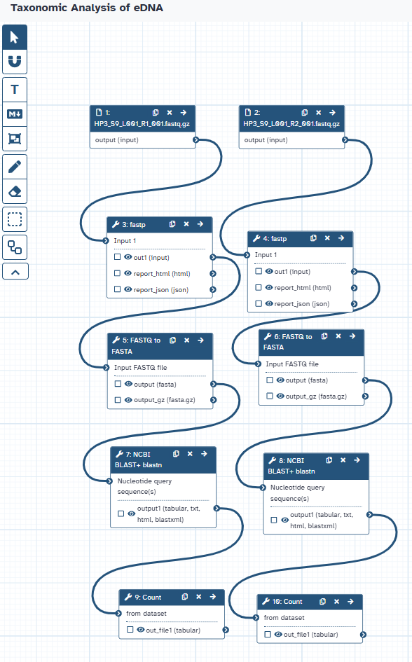
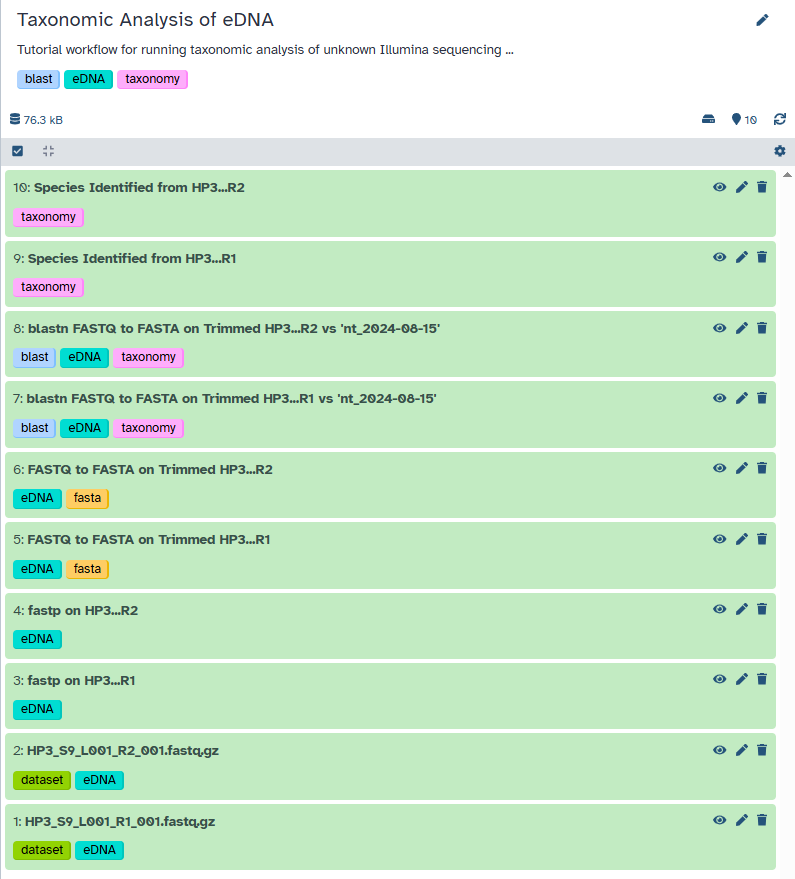
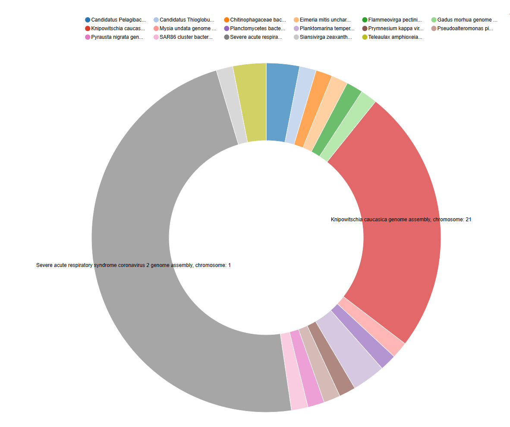
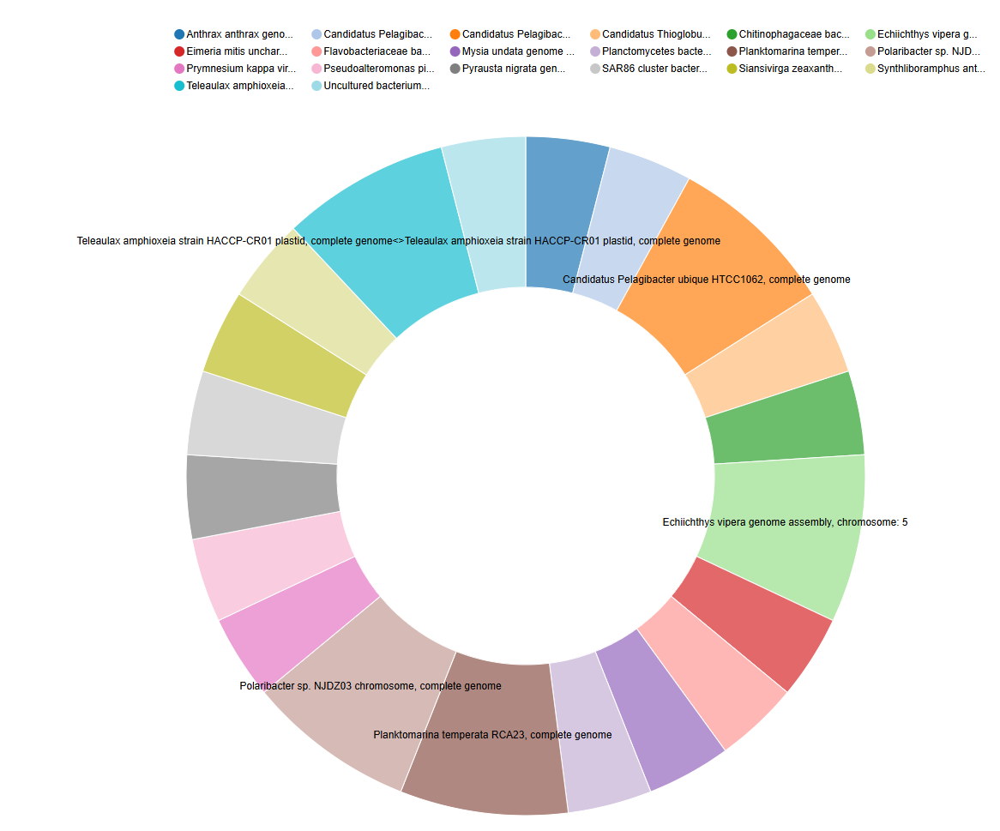

Environmental DNA (eDNA) analysis has emerged as a powerful tool in ecological and conservation research. It involves the extraction and analysis of DNA shed by organisms into their surrounding environment without the need to directly observe or capture the species. This non-invasive approach allows us to gain valuable insights into biodiversity, species distribution, and community composition in a wide range of ecosystems, including marine environments, from which the eDNA in this tutorial originates.

This tutorial will guide you through a basic workflow for the taxonomic analysis of unknown eDNA sequence data. We will start with raw sequence reads and go through the steps of quality control, sequence alignment against a reference database, and the extraction of potential taxonomic information.

In this tutorial, we will address the following biological question:

- Can we assign taxonomic information to unknown DNA sequences from environmental samples?

By the end of this tutorial, you will be able to:

- Upload raw sequencing data to the Galaxy platform.
- Apply read trimming tools to improve the quality of eDNA sequence data.
- Convert sequence data between FASTQ and FASTA formats.
- Perform a BLASTN search against a nucleotide database to identify potential taxonomic matches.
- Extract potential genus and species names from the BLAST output table.

While this tutorial focuses on eDNA, the fundamental steps of sequence quality control and identification are applicable to many other types of biological sequence data.

> <agenda-title>Taxonomic Analysis of eDNA Workflow</agenda-title>
>
> In this tutorial, we will cover:
>
> 1. TOC
> {:toc}
>
{: .agenda}

# Uploading the eDNA Sequence Data

In this section, you will learn how to bring your raw sequencing data into the Galaxy platform. Galaxy is a powerful, web-based platform that provides access to a wide range of bioinformatics tools and computational resources, all within an accessible interface. Think of it as your workbench for biological data analysis.

Let's briefly discuss what kind of data we'll be working with. Environmental DNA (eDNA) sequencing typically generates a large number of short DNA sequences, often called "reads." These reads represent fragments of genetic material present in the environmental sample (in our case, from a marine environment). Our goal is to take these raw, unannotated reads and, through a series of bioinformatics steps, identify the organisms they might have originated from.

The first step in any Galaxy-based analysis is getting your data into the platform. Galaxy offers several ways to upload data, including importing files either from a web link (if the data is hosted on Zenodo), from a shared data library within your Galaxy instance, or your local device.

## Get data

> <hands-on-title> Data Upload </hands-on-title>
>
> 1. **Create a new history** for this tutorial.
>    - Give it a meaningful name, such as "eDNA Taxonomic Analysis."
>
>    
>
> 2. **Import the files** for this tutorial from Zenodo:
>
>    ```
>    https://zenodo.org/records/15367390/files/HP3_S9_L001_R1_001.fastq.gz
>    https://zenodo.org/records/15367390/files/HP3_S9_L001_R2_001.fastq.gz
>    ```
>
>    
>
> 3. **Rename the datasets** once they are uploaded into your history. Click on the pencil icon next to each dataset name in the history panel (on the right side of the Galaxy interface) and give them informative names.
> 4. **Check that the datatype** for each of your renamed datasets, ensure the datatype is set to `fastqsanger` or `fastqsanger.gz`. To check or change the datatype, click on the pencil icon next to the dataset name, then look for the "Datatypes" field. If it's incorrect, select the appropriate datatype from the dropdown menu and click "Save".
>
>    
>
> 5. **(Optional) Add tags to your datasets.** Tags are keywords that can help you organize and search your history. For each dataset, click the add tags line and enter your desired tag(s) in the field.
>
>    
>
{: .hands_on}

#  Data Quality Control

After successfully uploading our raw eDNA sequence reads into Galaxy, the next step is to assess and improve the quality of the data. Raw sequencing data can contain errors introduced during the sequencing process, such as incorrect base calls. These errors can negatively impact analyses, including taxonomic identification, so performing quality control is essential to obtain reliable results.

The goal of quality control is to identify and remove (trim) low-quality reads or portions of reads. This involves evaluating various metrics, such as the Phred quality scores, the presence of adapter sequences, and the overall length distribution of the reads.

By performing quality control, we aim to:

  * **Improve the accuracy of downstream analyses:** High-quality data leads to more reliable taxonomic assignments.
  * **Reduce computational resources:** Removing low-quality data can decrease the size of the dataset and speed up subsequent steps.
  * **Increase the sensitivity of analysis:** By removing noise, we can potentially identify less abundant organisms.

In the following hands-on step, we will use the `fastp` tool, a fast and comprehensive preprocessor for FASTQ files, to perform quality control on our eDNA sequence data.

> <details-title> More about Sequencing Errors and Quality Scores </details-title>
>
> Sequencing technologies are not perfect and can introduce errors. These errors are often base substitutions, insertions, or deletions. The Phred quality score (Q) is a widely used metric to represent the probability of a base being called incorrectly. It is calculated using the formula:
>
> $$Q = -10 \log_{10}(P)$$
>
> where (P) is the probability of an incorrect base call.
>
> Adapter sequences are short, synthetic DNA molecules added to the ends of DNA fragments during library preparation. These adapters facilitate the sequencing process but are not part of the original environmental DNA. It's crucial to remove them as their presence can lead to incorrect alignments and taxonomic assignments.
>
{: .details}

## Concurrent Quality Control Steps with **fastp**

> <hands-on-title> Quality Control with fastp </hands-on-title>
>
> 1.   for HP3 R1 (Default Parameters):
>
>       - *"Single-end or paired reads"*: `Single-end`
>           -  *"Input 1"*: `output` (Input dataset for HP3 R1)
>
>
> 2.   for HP3 R2 (Default Parameters):
>
>       - *"Single-end or paired reads"*: `Single-end`
>           -  *"Input 1"*: `output` (Input dataset for HP3 R2)
>
>  > <comment-title> Running `fastp` </comment-title>
>  >
>  > In this step, we are running `fastp` on both the HP3 R1 and HP3 R2 files using its default parameter settings. We are applying `fastp` to the datasets that were uploaded in the previous step:
>  > * `HP3_S9_L001_R1_001.fastq.gz`
>  > * `HP3_S9_L001_R2_001.fastq.gz`
>  >
>  > **Important:** Galaxy will provide default names for the output files. For better organization and recognition between the results for HP3 R1 and HP3 R2, **it is recommended to rename the outputs** in your Galaxy history. For example, you could rename the reports to `fastp report on HP3_R1` and `fastp report on HP3_R2`, and the filtered reads to `fastp output HP3_R1` and `fastp output HP3_R2`.
>  > **Expected Outputs (for each input dataset):**
>  > * `fastp on data X: JSON report`
>  > * `fastp on data X: HTML report`
>  > * `fastp on data X: Read 1 output` (FASTQ format containing the quality-filtered sequences from your input)
>  >
>  > While we are using the default settings here, it's important to remember that these might not always be optimal for all types of data, as different datasets can have varying quality issues or adapter contamination. Running it in single-end mode treats each input file independently, for simplicity of the tutorial. Depending on your datasets, or what information you are trying to gather, the Trimmomatic tool is useful for handling pair-ended sequences.
>  {: .comment}
>
{: .hands_on}


> <question-title> Considering Default Parameters </question-title>
>
> 1.  Are the default parameters of a quality control tool like `fastp` always the most appropriate choice for every sequencing dataset? Why or why not?
>
> > <solution-title> Solution </solution-title>
> >
> > 1.  No, default parameters might not always be optimal. Sequencing data can vary in quality, adapter contamination levels, and other characteristics depending on the library prep and platform. It is often necessary to adjust parameters to suit the specific needs of your data for appropriate levels of quality control.
> >
> {: .solution}
>
{: .question}

#  FASTQ to FASTA Conversion

## Converting `fastp` Outputs to FASTA Format

> <hands-on-title> Task description </hands-on-title>
>
> 1.   for HP3 R1:
>
>       -  *"Input FASTQ file"*: `fastp output HP3_R1` (the renamed filtered reads output of **fastp**  for HP3 R1)
>       - *"Discard sequences with unknown (N) bases"*: `Yes`
>       - *"Rename sequence names in output file (reduces file size)"*: `Yes`
>       - *"Compress output FASTA"*: `No`
>
> 2.   for HP3 R2:
>
>       -  *"Input FASTQ file"*: `fastp output HP3_R2` (the renamed filtered reads output of **fastp**  for HP3 R2)
>       - *"Discard sequences with unknown (N) bases"*: `Yes`
>       - *"Rename sequence names in output file (reduces file size)"*: `Yes`
>       - *"Compress output FASTA"*: `No`
>
>  > <comment-title> Converting to FASTA for NCBI BLAST+ blastn </comment-title>
>  >
>  > In this step, we are converting the quality-controlled FASTQ files into FASTA format with the following options: discarding any sequences that contain unknown ('N') bases and renaming the sequence identifiers to reduce file size. The FASTA format, which contains only the sequence information, is a required input format for **NCBI BLAST+ blastn**, which will be used in the subsequent section for sequence similarity searching and potential taxonomic identification.
>  {: .comment}
>
{: .hands_on}

> <question-title> Understanding FASTQ to FASTA Conversion </question-title>
>
> 1.  What is the purpose of converting sequencing data from FASTQ format to FASTA format?
>
> > <solution-title> Solution </solution-title>
> >
> > 1.  The purpose of converting from FASTQ to FASTA is to obtain a file containing only the nucleotide sequences.
> >
> {: .solution}
>
{: .question}

#  Sequence Alignment for Taxonomic Identification using BLAST

## Performing the BLASTn Search with **NCBI BLAST+ blastn**

> <hands-on-title> Performing the BLASTn Search </hands-on-title>
>
> 1.  Execute the  with the following parameters:
>
> **For HP3 R1:**
>
>   -  *"Nucleotide query sequence(s)"*: `output` (output of **FASTQ to FASTA**  for HP3 R1)
>   - *"Subject database/sequences"*: `Locally installed BLAST database`
>   - *"Nucleotide BLAST database"*: `NCBI NT (15 Aug 2024)`
>   - *"Type of BLAST"*: `blastn - Traditional BLASTN requiring an exact match of 11, for somewhat similar sequences`
>   - *"Set expectation value cutoff"*: `0.0001`
>   - *"Output format"*: `Tabular (extended 25 columns)`
>   - *"Advanced Options"*: `Show Advanced Options`
>       - *"Maximum hits to consider/show"*: `1`
>       - *"Restrict search of database to a given set of ID's"*: `No restriction, search the entire database`
>
> **For HP3 R2:**
>
>   - Repeat the **NCBI BLAST+ blastn** tool for your other FASTA file (e.g., HP3 R2) using the exact same parameters.
>
>  > <comment-title> Understanding BLAST Parameters and Database </comment-title>
>  >
>  > In this step, we are using BLASTn to search your eDNA sequences against the **NCBI NT database as it was on August 15, 2024**. This is a comprehensive collection of nucleotide sequences. The parameters are set to find relatively similar sequences and output the results in a detailed tabular format, keeping only the top hit for each query. **Choosing a specific database is crucial because different databases contain different sets of sequences, which can significantly affect the outcome of the search.**
>  {: .comment}
>
{: .hands_on}

> <question-title> Interpreting BLAST Database Choice </question-title>
>
> 1.  Why is it important to specify the database (like NCBI NT) when performing a BLAST search?
>
> > <solution-title> Answer </solution-title>
> >
> > 1.  Specifying the database ensures that your sequences are compared against a defined and relevant collection of sequences. Different databases have different content and scope, which can significantly impact the results and the taxonomic assignments you might obtain. Knowing the database also helps in understanding the context and limitations of your search.
> >
> {: .solution}
>
{: .question}

#  Extracting Taxonomic Information from the BLAST table

## Counting Potential Taxa using **Count**

The BLAST output (in tabular format with extended 25 columns) contains a wealth of information for each aligned sequence. Importantly, **column 25** of this output typically provides the **"subject scientific name"**, which often includes the genus and species identification of the top hit in the database. In this step, we will use the `Count` tool in Galaxy to extract these scientific names and determine how many times each unique name appears in our BLAST results for each of your input files (HP3 R1 and HP3 R2). This will give us a preliminary overview of the potential taxa present in your eDNA samples based on the top BLAST hits.

> <hands-on-title> Counting Top Taxonomic Assignments </hands-on-title>
>
> 1.  Execute the  with the following parameters:
>
> **For HP3 R1 BLAST Results:**
>
>   -  *"from dataset"*: `output` (output of **NCBI BLAST+ blastn**  for HP3 R1)
>   -  *"Count occurrences of values in column(s)"*: `c['25']`
>
> **For HP3 R2 BLAST Results:**
>
>   - Repeat the  tool with the following parameters:
>     -  *"from dataset"*: `output` (output of **NCBI BLAST+ blastn**  for HP3 R2)
>     -  *"Count occurrences of values in column(s)"*: `c['25']`
>
>  > <comment-title> Interpreting the Count Output </comment-title>
>  >
>  > The output of the **Count** tool will be a table showing each unique scientific name found in the 25th column of your BLAST output and the number of times it appeared. Since we set BLAST to only report the top hit for each eDNA sequence, this count represents the frequency of the most likely taxonomic assignment for those sequences.
>  > This output can be used for visualization such as a pie chart.
>  {: .comment}
>
{: .hands_on}

> <question-title> Understanding Top Hit Counting </question-title>
>
> 1.  Why are we using the `Count` tool on the 25th column of the BLAST output? What information does this column typically contain?
> 2.  What does the number of times a specific scientific name appears in the `Count` output roughly indicate in this analysis?
>
> > <solution-title> Answers </solution-title>
> >
> > 1.  We are using the `Count` tool on the 25th column because this column in the extended tabular BLAST output format typically contains the "subject scientific name" of the top hit from the database.
> > 2.  The number of times a scientific name appears roughly indicates how many of your original eDNA sequences had that specific organism as their best match in the database.
> >
> {: .solution}
>
{: .question}


# Conclusion

In this tutorial, you've successfully completed a basic bioinformatics workflow for the taxonomic analysis of environmental DNA (eDNA) sequences, starting with raw sequencing reads and progressed through several key steps including:




* **Data Upload:** how to import sequence data into the Galaxy environment
* **Quality Control:** utilizing the `fastp` tool to assess and improve the quality of your reads by trimming potentially erroneous sequences
* **FASTQ to FASTA Conversion:** converting quality-controlled reads from FASTQ to FASTA format
* **Sequence Alignment with BLAST:** performning a BLASTN search against the NCBI NT nucleotide database to find similar sequences and  potential taxonomic identities of your eDNA sequences
* **Extracting Taxonomic Information:** applying the `Count` tool to extract and quantify the top unique taxonomic assignments from the BLAST output and can be used for further analysis and visualization




By completing these steps, you have addressed the initial biological question of: **Can we assign taxonomic information to unknown DNA sequences from environmental samples?** This tutorial has demonstrated that, through the utilization of bioinformatics tools like BLAST, we can gain insights into the potential origins of DNA sequences source from non-invassive environmental samples.

You have also gained experience with several key bioinformatics techniques crucial for various types of DNA analysis: data quality control, sequence format conversion, sequence alignment, and basic data extraction. These skills have broad applications in biological research.

This tutorial can serve as a valuable starting point for further exploration into the fascinating field of environmental DNA analysis.

## Acknowledgments
I would like to thank both Dr. Gorden Ober and Dr. Jessica Kaufman for thier assitance and guidance during the course of the project that inspired this tutorial, as well as for their asssitance in sample collection and operation of the Illumina sequencer respectively.
