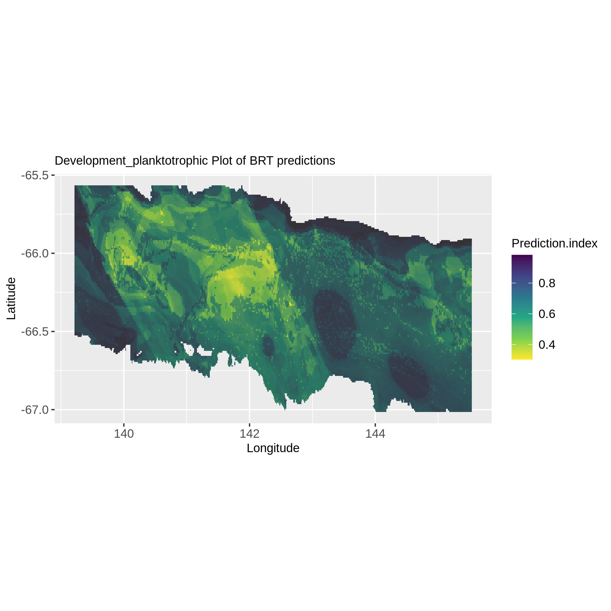
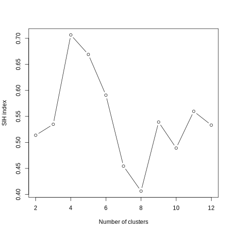
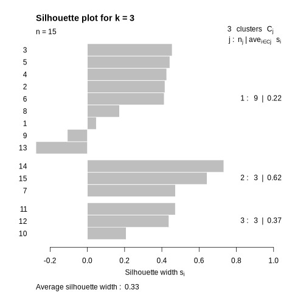
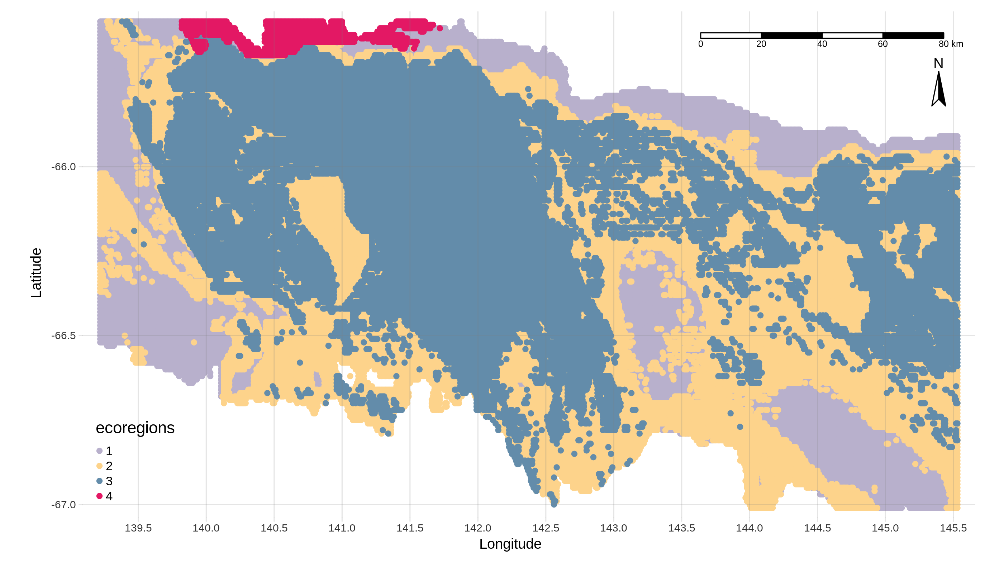

This tutorial is designed to guide you through the Ecoregionalization Galaxy workflow, demonstrating how to create a life traits ecoregionalization map from occurrences and environmental data using a boosted regression tree model for predictions.

The workflow, consisting of six tools, is intended for processing occurrence data, which should include latitude, longitude, species presence and scientific name or life traits (if life traits are absent they will be deduced automatically with scientific names). The tutorial will provide a detailed explanation of inputs, workflow steps, and outputs. This tutorial gives a practical example, highlighting a use case centered on the Kerguelen plateau and Echonoids species.

The primary goal of this workflow is to generate life traits distribution maps and identify ecoregions within the study area. The project’s objective is to offer accessible, reproducible, and transparent IT solutions for processing and analyzing life traits occurrence data. 

Note: if you're data already contains life traits, use  instead, the process is the same with taxa and life traits. You can also use this one skipping the two "WoRMS" dedicated steps.

This workflow is therefore composed of 6 tools:
 - WormsMeasurments
 - GeoNearestNeighbor
 - BRT prediction tool
 - TaxaSeeker
 - ClaraGuess
 - EcoMap

And in this tutorial we will be using 2 more tools to format data before running the ecoregionalization workflow:
 - Advanced cut
 - Filter


Let’s delve into the tutorial, outlining each step and tool to manage the creation of ecoregionalization maps.


> <agenda-title></agenda-title>
>
> In this tutorial, we will cover:
>
> 1. TOC
> {:toc}
{: .agenda}

# Before starting

This part will present the type of data you need to run the life traits ecoregionalization workflow. This data will be downloaded in the next part of the tutorial.

## Environmental data

To run this workflow, you will first need environmental data. This workflow accepts several types of environmental parameters like temperature or soil type. However, there is a mandatory file format, the tabular format (.tsv or .tabular), and each pixel of the study area must be described in this file by associating latitude and longitude with environmental parameters.

In the use case presented in this tutorial, seventeen abiotic and physical parameters of the Dumont D’Urville sea region are used. They were taken from oceanographic models and in situ measurements Hemery et al. 2011. The physical oceanographic parameters are mean temperature and its standard deviation, mean salinity and its standard deviation, mean current magnitude and its standard deviation, maximum current bearing, maximum current magnitude and sea ice production. Bathymetric parameters are depth, slope, and rugosity. Finally, the seabed substrate composition was characterized by percentages of biogenic carbonate, biogenic silica, gravel, sand, and mud.

Here an example of environmental file input:

| long   | lat    | Carbo | Grav  | … |
|--------|--------|-------|-------|---|
| 139.22 | -65.57 | 0.88  | 28.59 | … |
| 139.25 | -65.63 | 0.88  | 28.61 | … |
| …      | …      | …     | …     | … |

## Occurrence data

The second data file you will need to run this workflow is an occurrences data file. As defined above, occurrences data are showing the presence of a species or life trait at a particular location. This data file also needs to be in tabular format (.tsv or tabular) and need to be constructed as following:
 - latitude and longitude columns
 - scientific name column
You're occurrence data shouldn't contain absence of a species, if so, you have to filter the absence. If you're occurrences contain abundance data, it won't be taken into account.

Here an example of occurrences data file input:
| lat   | long  | Planktotrophic | Lecitotrophic | Size |
|-------|-------|----------------|---------------|------|
| -65,9 | 142,3 | 1              | 0             | 3    |
| -66,3 | 141,3 | 0              | 1             | 2    |
| …     | …     | …              | …             | …    |

For this tutorial, occurrences data from the Kerguelen plateau will be downloaded from the GBIF. These data were collected as part of the PROTEKER program (Protecting the biodiversity of the Kerguelen Plateau) led by the Institut Paul-Émile Victor (IPEV, program 1044) between 2013 and 2015. Prior to their publication in the PANGAEA database and archiving in scientific repositories, these data originated from standardized sampling campaigns conducted around the Kerguelen Islands. The dataset includes occurrence records and associated environmental measurements such as temperature, salinity, and substrate type. Sampling focused on benthic macrofauna in shallow coastal habitats. Only occurrences identified to at least the genus level and sampled by scuba diving or grab sampling were retained for this tutorial. The original dataset is published under open license and fully documented in Eléaume *et al.* (2017).

## Get data

> <hands-on-title> Data Upload </hands-on-title>
>
> 1. Create a new history for this tutorial and give it a name (example: “Ecoregionalization workflow”) for you to find it again later if needed.
>
>    
>
>    
>
> 2. Import occurrence data file from [GBIF](https://api.gbif.org/v1/occurrence/download/request/0012077-250515123054153.zip), environment file from [InDoRES](https://data.indores.fr/file.xhtml?persistentId=doi:10.48579/PRO/LQMHX9/CYSKQG&version=1.0#)
>
>    Occurrence data file as a zip file where you will find "occurrence.txt"
>    ```
>    https://api.gbif.org/v1/occurrence/download/request/0012077-250515123054153.zip
>    ```
>    Environemental data : "ceamarc_env.tab"
>    ```
>    https://data.indores.fr/api/access/datafile/9777
>    ```
>
>    
>
>    
>
> 3. The GBIF link allows you to download a zip file containing multiple information files about the dataset. The file that you need is the 'occurrence.txt' file that we will specifically extract on Galaxy in the following step.
>
> 4. Use   to create a data collection in your history where all GBIF archive files will be unzipped
>
> 5. Unhide the "occurence.txt" data file then modify datatype to select the "tabular" one
>
>    
>
>    
>
> 6. Rename the datasets if needed, notably "9777" by "ceamarc_env.tab".
>
>    
>
> 7. Check that the datatype of the environment file and occurrence file are tabular.
>
>    
>
{: .hands_on}

# Data formatting

The first step of this tutorial is data formatting because the GBIF species occurrence file download needs to be in a specific format to be included inside the Ecoregionalization workflow.

## Keep data columns we need with Advanced Cut

> <hands-on-title> Select the columns we need </hands-on-title>
>
> 1.  with the following parameters:
>    -  *"File to cut"*: `occurrence` (Input dataset)
>    - *"Operation"*: `Keep`
>    - *"Cut by"*: `fields`
>    - *"Delimited by"*: `Tab`
>        - *"Is there a header for the data's columns ?"*: `Yes`
>            - *"List of Fields"*: `c['98, '99', '149]`
>
>    > <comment-title> Issue with the column numbers </comment-title>
>    >
>    > It is possible the column numbers are changing in the occurence file, so don't hesitate to check the name of the column header, and if relevant, use the search functionnality to find the columns containing "latitude", "longitude" and "scientific name" informations.
>    >
>    {: .comment}
> 
> 
{: .hands_on}

## Clean scientific names for WoRMS API request

This step is used tobe sure scientific names are written in the manner WoRMS API is able to manage it (only genus and species name or genus alone).

> <hands-on-title> Clean taxons names for WoRMS API </hands-on-title>
>
> 1.  with the following parameters:
>    -  *"Select cells from"*: `output` (output of **Advanced Cut** )
>    - *"using column"*: `c3`
>    - In *"Check"*:
>        -  *"Insert Check"*
>            - *"Find Regex"*: `^([A-Z][^A-Z(]+)((?<!^).*)$`
>            - *"Replacement"*: `\1`
>    - In the second *"Check"*:
>        -  *"Insert Check"*
>            - *"Find Regex"*: ` $`
>            - *"Replacement"*: ``
>
>
{: .hands_on}


## Get life traits from WoRMS
> <hands-on-title>Life traits acquisition</hands-on-title>
>
> 1. : add life traits to the dataset by
>    - *"occurrence data"*: a `occurrence` tabular file that fills the requirements mentionned earlier
>    - *"list of measurement types"*: a list of the life traits of interest like `Development`. Make they have the same spelling as on the WoRMS and with a capital letter. 
>    - *"scientific name column name"*: look at your occurrence file, if the name of the column of scientific names is different from `scientificName` replace by the correct one.
>    - *"include attributes inherited from parent taxon"*: WoRMS doesn't have all life traits informations and some Echinoid species have very limited informations. To avoid having too many missing values you can switch to on, if you don't know, run your workflow once, check the output of the next tool and if the size of the dataset decreased too much switch to yes. Warning, you need to have an idea of how many different life trait values you're going to have, the workflow will generate one map per life trait value, the number of life trait values will impact calculation time.
>    - *"one hot encoding on the measurement types"*: make sure it's enabled.
{: .hands_on}

## Remove lines with NAs or empty values with Filter

> <hands-on-title> Remove lines with NAs </hands-on-title>
>
> 1.  with the following parameters:
>    -  *"With following condition"*: enable and paste thix expression `c1!='' and c2!='' and c3!='' and c4!='' and c1!='NA' and c2!='NA' and c3!='NA' and c4!='NA'`. It removes lines with missing value corresponding with latitude, longitude, scientificName, Development_planktotrophic, if your dataset has a special value for missing values like -9999, add ` and c1!='missingvalue' and c2!='missingvalue' )
>    - In *"Number of header lines to skip"* enter `1`
> 2. Check your output. All the lines with missing values must have been deleted.
> 3. Rename your file "corrected_occurence.tsv"
>
{: .hands_on}

# Ecoregionalization workflow

Now you have all you need to run the ecoregionalization Workflow :
 - Occurrence formatted file
 - Environment file

## Merge environment file and occurrence file with GeoNearestNeighbor

### What it does ?

This Galaxy tool allows you to merge two data tables (tabular format only) according to their latitude and longitude coordinates (in WGS84 projection), finding the closest points. This tool is used in the Ecoregionalization workflow to filter the occurence data file so it can be used on the BRT prediction tool.

### How to use it ?

> <hands-on-title> Run GeoNearestNeighbor </hands-on-title>
>
> 1.  with the following parameters:
>    - In *"Your environment file (or table 1)"*:
>        -  *"Input your environment data file (tabular format only)"*: `ceamarc_env.tsv` (Input dataset)
>        - *"Choose columns where your latitude is in your environment data file."*: `c2`
>        - *"Choose columns where your longitude is in your environment data file."*: `c1`
>    - In *"Your occurrence file (or table 2)"*:
>        -  *"Input your occurrence data file (tabular format only)"*: `corrected_occurence.tsv` (output of previous **Filter** step )
>        - *"Choose columns where your latitude is in your occurrence data file."*: `c1`
>        - *"Choose columns where your longitude is in your occurrence data file."*: `c2`
>
>    > <comment-title> Coords precision </comment-title>
>    >
>    > It is recommended that, for optimal precision, the latitude and longitude values in both files should be of the same precision level. And, for the sake of relevance, the geographical coordinates in both files should be as close as possible to apply the most accurate environmental parameters to the correct species occurrences.
>    >
>    {: .comment}
>
> 2. Check your outputs. You must have two files:
>       - Information file containing the coordinates of occurrence data, the coordinates retains from environmental data and the distances between the two.
>       - Occurrence and Environment merge file containing occurrence data and environmental data corresponding.
>
{: .hands_on}

## Clean merged table file

To use next tool, BRT, one need to have a clean merged table datafile. To do so, you can here remove the "scientificName" column, as BRT tool merged data input must only have numeric values columns.


> <hands-on-title> Run the BRT tool </hands-on-title>
>
> 1.  with the following parameters:
>    -  *"Tabular file"*: `Merged table` (Input dataset)
>    -  *"Select Columns"*: `scientificName` (output of **GeoNearestNeighbor** )
>
>
{: .hands_on}


## Predicting life traits with BRT tool prediction

This step implements a commonly used approach in ecological studies, namely species distribution modelling (SDM). This allows to characterize the distribution of each life traits by giving an indicator of probability of life trait presence for each environmental layer pixel. Here, the boosted regression trees (BRT) method was used to adjust the relationship between the presence of a single life trait and the environmental conditions under which the life trait has been detected. BRT modelling is based on an automatic learning algorithm using iterative classification trees.

### What it does ?

Two treatments are performed in this tool: the creation of the taxa distribution model and the use of this model to obtain a prediction index. The prediction index obtained from each BRT model for each pixel of the environmental layers is an approximation of the probability of detection of the presence of the taxon.

This tool gives as output a file containing the predictions of the probability of the presence of each taxon for each "environment pixel" (latitude, longitude), a visualization of these pixels for each taxon and graphs showing the percentage of model explanation for each environmental parameter. We're gonna go back to this in the following steps.

### How to use it ?

> <hands-on-title> Run the BRT tool </hands-on-title>
>
> 1.  with the following parameters:
>    -  *"Input your environment data file of your study area (tabular format only)"*: `ceamarc_env.tsv` (Input dataset)
>    -  *"Input your occurrences data file(s) containing also the environmental characteristics where the species has been observe (tabular format only)"*: `Merged table` (output of **GeoNearestNeighbor** cleaned for extra column with **Remove column** tool if relevant )
>
>      
>
>    - *"Choose column(s) where your abiotic parameter are in your environment data file."*: `c['3', '4', '5', '6', '7', '8', '9', '10', '11', '12', '13', '14', '15', '16', '17', '18', '19']`
>
>    > <warning-title>You maybe can here prepare a cup of tea ;)</warning-title>
>    >
>    > This step is a first "long" one, and you have to wait something like 18 minutes and 34 sec to obtain the result. It is maybe the good moment to have a break and go outside to admirate biodiversity around you?
>    >
>    {: .warning}
>
>
> 2. Check your outputs. You must have four outputs collections.
>
>    - Prediction files
>    - Validation files (life traits, AUC, Tree complexity, Total deviance explained)
>    - Species distribution prediction maps
>    - Partial dependence plots
>
{: .hands_on}

In the 'Prediction files' collection there must be a file containing predictions of the probability of the presence of each life trait for each "environmental pixel" (latitude, longitude) for each occurrence file you entered.

In the 'Validation files' collection there must be a file containing for each life traits the validation metrics of the associated model.

In the 'Species distribution prediction maps' collection there must be for each life traits a map representing their probability of presence at each environmental layer pixel.



In the 'Partial dependence plots' collection there should be graphs showing the percentage explanation of the model for each environmental parameter.
Here is an example:


## Collecting the list of life traits with TaxaSeeker

You may wonder "but shouldn't this tool be used only with taxon data?" it's commonly used for taxa but it works also with life traits.

### What it does ?

This tool does three things:

- It allows obtaining a summary file for each taxon indicating whether a BRT model was obtained and the number of occurrences per taxon.

- It provides a list of taxa that obtained cleaned BRT models (without "_", "_sp", etc.) to propose the list to WoRMS (World Register of Marine Species) or another taxonomic database and obtain more information about the taxa.

- It generates a list of taxa for which a BRT model was obtained, needed as input of following steps.

### How to use it ?

> <hands-on-title> Run TaxaSeeker </hands-on-title>
>
> 1.  with the following parameters:
>    -  *"Environment file (tabular format only)"*: `ceamarc_env.tsv` (Input dataset)
>    -  *"Occurences file(s) (tabular format only)"*: `Merged table` (output of **GeoNearestNeighbor** )
>    -  *"Predictions file(s)"*: `Prediction files collection` (output of **BRT tool prediction** )
>
>    
>
>    2. Check your outputs. You must have three files:
>
>    - Summary of taxa model
>    - List of taxa
>    - List of taxa clean
>
{: .hands_on}

## Determine the optimal number of cluster and build ecoregional clusters with ClaraGuess

### What it does ?
This tool applies the CLARA clustering method to identify environmental clusters based on:
- BRT model predictions (a collection of tabular files),
- environmental variables (tabular),
- a list of taxa (tabular, from TaxaSeeker).
The tool enables the determination of the optimal number of clusters for partition-based clustering (if automatic mode is selected), along with generating files used in the subsequent ecoregionalization workflow.


> <hands-on-title> Run ClaraGuess </hands-on-title>
>
> 1.  with the following parameters:
>    -  *"Environmental data (tabular)"*: `ceamarc_env.tsv` (Input dataset)
>    -  *"BRT prediction files (collection of tabular)"*: `Prediction files` (output of **BRT tool** )
>    -  *"List of taxas (from TaxaSeeker)"*: `List of taxa` (output of **TaxaSeeker** )
>    - *"k is ..."*: either the number of clusters of the model (the number of ecoregions) or if you don't how many cluster/ecoregions you want, the tool will find the more optimal number of clusters. The first time, this parameter should be set to automatic so you can see the plot of silhouette scores and determine yourself what is the best number of clusters to choose. The best number of clusters according to silhouette score isn't always equal the number of ecoregions.
>    -  *"Value of k (collection of tabular)"*: a number greater than 2
>
>    > <comment-title> Two other parameters </comment-title>
>    >
>    > The other two parameters can be left as is. If you need to change them here is a short description of what they do:
>    >
>    > The first one is metric used to calculate the dissimilarities between the observations: Manhattan (distance between two real-valued vectors), Euclidean (shortest distance between two
>    > points) and Jaccard (defined as the size of the intersection divided by the size of the union of the sample sets)
>    >
>    > The second one is the sample size that will be used to perform clustering.
>    > Indeed, the clara function is used to cluster large data using a representative sample rather than the entire data set. This will speed up the clustering process and make the calculation
>    > more efficient. A fairly high value representative of the data is recommended. It is important to note that using a too small sample size may result in loss of information compared to using the
>    > entire data set.
>    >
>    {: .comment}
>
> 2. Check your outputs. You must have three files:
>
>    - SIH index plot (See example below.)
>    - Cluster points (Contains the latitude and longitude of each "environmental pixel" and the associated cluster number. We will use it in the next step of the workflow)
>    - Cluster info (Contains all the information related to the clusters created, that is, in column: the latitude, the longitude, the corresponding cluster number and for each taxon the prediction value)
>
{: .hands_on}

The tool will produce a silhouette plot that you can see below. A silhouette graph is a representation used to visualize the silhouette index of each observation in a clustered data set. It makes it possible to
assess the quality of clusters and determine their coherence and separation. In a silhouette graph, each observation is represented by a horizontal bar whose length is proportional to its silhouette index. The longer
the bar, the better the consistency of the observation with its cluster and the separation from other clusters. As mentioned above, the silhouette index ranges from -1 to 1. Values close to 1 indicate that objects
are well grouped and separated from other clusters, while values close to -1 indicate that objects are poorly grouped and may be closer to other clusters. A value close to 0 indicates a situation where objects are
located at the border between two clusters. Here, in the graph below, there is a good distribution of the observations because the majority of the bars are above the average value of the silhouette index.





# Build a ecoregionalization map with **EcoMap**

> <hands-on-title> Run EcoMap </hands-on-title>
>
> 1.  with the following parameters:
>    -  *"Source file (File 'cluster points' from previous step)"*: `cluster assignements` (output of **ClaraGuess** )
>
> This tool simply need the previous step "cluster assignements (lat, long, cluster)" output file to generate a map representing ecoregions.
>
> 2. Check output. You must have one Map representing ecoregions.
>
{: .hands_on}

This is the output map with our seven clusters representing ecoregions that you must have obtained.



# Conclusion

Congratulations! You have successfully completed the life traits ecoregionalization workflow. Here is the end of this tutorial aiming to explain the purpose of the ecoregionalization workflow and how to use it. This workflow provides a systematic and reproducible approach to ecoregionalization, allowing researchers to identify distinct ecological regions based on species occurrences and environmental data. This tutorial shows how to use this workflow, step by step, or all in one using the Dumont D'Urville sea region use case with related datasets. It allows you to understand ecoregions construction. You learned the use of the BRT algorithm for modeling species distribution as well as the cluster construction with the k-medoid clustering algorithms (CLARA/PAM). Feel free to explore and adapt this workflow for your specific research needs. If you have any questions, or encounter issues during the workflow, refer to the provided documentation or seek assistance from the Galaxy community. Don't hesitate to contact us if you have any questions.
