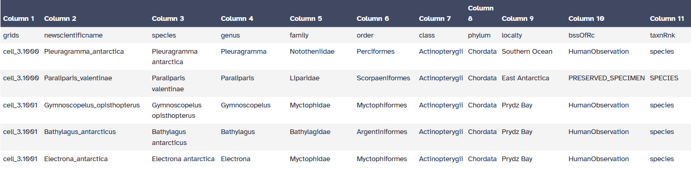

This tutorial is designed to guide you through the Phylodiversity Galaxy workflow, demonstrating how to easily compute phylodiversity and create phyloregions from phylogeny, occupency and spatial files.

The tutorial will provide a detailed explanation of inputs, workflow steps, and outputs. This tutorial gives a practical example, highlighting a use case extract from souhtern sea actinos populations.

The primary goal of this workflow is to compute phylodiversity index and identify phyloregions. The project's objective is to offer accessible, reproducible and transparents solutions for analyse phylodiversity.

This workflow is composed of four tools:

- PhylOccuMatcher
- CRSConverter
- PhyloIndex
- EstimEndem

In this tutorial, we estimate your data are correctly formated.

> <agenda-title></agenda-title>
>
> In this tutorial, we will cover:
>
> 1. TOC
> {:toc}
>
{: .agenda}

# Before starting

This part will present the type of data you need to run the ecoregionalization workflow. This data will be downloaded in the next part of the tutorial.

## phylogenic tree file
The first file needed for this workflow is the phylogenetic tree of your interested species.
In this example it'a a simplified phylogeny of the actinopterigy
This file must be at newick format.

## occupancy file
The second file is an occupancy file, each line is a species, the decimal separator must be "." and the column must be separated with "\t"(={Tabulation}). You need to have a column "grids" containing the cell of the grid you've seen your species and the name of the column with the species names must be "newscientificname".

| grids   | newscientificname   | ...     | ...   | ...   |
| ------- | ------------------- | ------- | ----- | ----- |
| ------- | ------------------- | ------- | ----- | ...   |
| ------- | ------------------- | ------- | ----- | ----- |
| ...     | ...                 | ...     | ...   | ...   |
| ------- | ------------------- | ------- | ----- | ----- |

## Shapefile
The last file is a spatial file in shapefile format. In Galaxy this type of file must be uploaded as a composite file of type shp.
This kind of file must have at least 3 file with the same name and 3 different extension : .shp, .shx end .dbf. you can have more file optionally like the .prj file.

## Get data

> <hands-on-title> Data Upload </hands-on-title>
>
> 1. Create a new history for this tutorial
> 2. Import the files from [Zenodo]({{ page.zenodo_link }}) or from
>    the shared data library (`GTN - Material` -> `{{ page.topic_name }}`
>     -> `{{ page.title }}`):
>
>    For the `tabular` and `newick` datafiles
>    ```
>    https://zenodo.org/records/15601932/files/phylogeny_test
>    https://zenodo.org/records/15601932/files/grid_test.tabular
>    ```
>
>    For the composite `shp` datafile (you here need to download locally each file to upload it from the "Composite" menu of "Upload Files" tool, selecting `shp` datatype)
>    ```
>    https://zenodo.org/records/15601932/files/shapefile.dbf
>    https://zenodo.org/records/15601932/files/shapefile.prj
>    https://zenodo.org/records/15601932/files/shapefile.shx
>    https://zenodo.org/records/15601932/files/shapefile.shp
>    ```
>
>
>    
>
>    
>
> 3. Rename the datasets
> 4. Check that the datatype of the phylogenic file is `newick` (often not automatically detected to this format but `json`),  occupancy file `tabular` and the spatial file a composite dataset of type `shapefile`
>
>    
>
> 5. A good pratice is also to add to each datafile a tag corresponding for example to the taxon, here `Actinopterygians` or other relevant information.
>
>    
>
{: .hands_on}

# Data formatting

The first step is to be sure your data are well formated. If all your file are in good format and do have the needed column as specified before, you can move forward.

An example of occupancy file:

{: style="width:50%"}

# Phylodiversity Workflow

## Match your phylogeny and occupancy with **PhylOccuMatcher**

> <hands-on-title> run PhylOccuMatcher </hands-on-title>
>
> 1.  with the following parameters:
>    -  *"Phylogeny file (Newick format)"*: `phylogeny_test` (Input dataset)
>    -  *"Occupancy data (Tabular format)"*: `grid_test.tabular` (Input dataset)
>
>
>    > <comment-title> short description </comment-title>
>    >
>    > This tool is the simpliest, you, normally, don't have anything to change and just have to run it with your file as input.
>    {: .comment}
>
{: .hands_on}

## modifying the projection with **CRSconverter**

> <hands-on-title> run CRSConverter </hands-on-title>
>
> 1.  with the following parameters:
>    -  *"shapefile"*: `composite_dataset` (Input dataset)
>
>
> > <warning-title>Pay attention to output format</warning-title>
> >
> > This tool provide multiple possible outputs formats but only the shapefile format can be used for the workflow. The other output format are graphical representation for the user to visualize. If you want it you can rerun this tool outside of the workflow withe the same input and option.
> >
> {: .warning}
>
> > <warning-title>Pay attention to the tool version</warning-title>
> >
> > For the workflow to work you need to use the CRSConverter 1.1 not the 1.0. So be cautious it's the case because if you use the 1.0 version the workflow will crash during the last step.
> >
> {: .warning}
>
> > <comment-title> short description </comment-title>
> >
> > The main interest of using this tool is to modify the projection of your shapefile. To use it you'll have to select the parameter you need in the advanced option before running this tool.
> {: .comment}
>
{: .hands_on}

## Compute phylodiversity index with **PhyloIndex**

> <hands-on-title> run PhyloIndex </hands-on-title>
>
> 1.  with the following parameters:
>    -  *"Phylogeny file (Newick format)"*: `Phylogeny with occupancy data` (output of **PhylOccuMatcher** )
>    -  *"Occupancy data (Tabular format)"*: `Matched output data` (output of **PhylOccuMatcher** )
>
>
>    > <comment-title> short description </comment-title>
>    >
>    > This tool compute phylodiversity index, It include some randomness so, for reproducibility, you'll need to select a random seed. Moreover you'll need to select the way of modeling you want by choosing between 3 propositon:
>    > -“tipshuffle”: shuffles tip labels multiple times.
>    > -“rowwise”: shuffles sites (i.e., varying richness) and keeping species occurrence frequency constant.
>    > -"colwise”: shuffles species occurrence frequency and keeping site richness constant.
>    > The default value is the tipshuffle method
>    {: .comment}
>
{: .hands_on}

## Estimate the endemism with **EstimEndem**

> <hands-on-title> run EstimEndem </hands-on-title>
>
> 1.  with the following parameters:
>    -  *"Phylogeny file (Newick format)"*: `Phylogeny with occupancy data` (output of **PhylOccuMatcher** )
>    -  *"Occupancy data (Tabular format)"*: `Matched output data` (output of **PhylOccuMatcher** )
>    -  *"input_shapefile"*: `shapefile` (output of **CRSconverter** )
>
>
>    > <comment-title> short description </comment-title>
>    >
>    > The output of this tool is a shapefile with the clusterisation done in function of the endemism. You'll have to choose a number of cluster you want and the clustering method you want.
>    {: .comment}
>    > <comment-title> More tips and info </comment-title>
>    >
>    > If you have no idea how many cluster you want, the tool start with an estimation of how many clusters are optimal between 0 to 30. So you can firstly run the tool with default value and go check the standard output to check the recommanded number. However keep in mind that this estimation is purely statistics and don't always have biologic reasons.
>    {: .comment}
>
{: .hands_on}

# Conclusion

Congratulation for successfully completed the Phylodiversity workflow. Here is the end of this quick tutorial. Don't hesitate to contact us if you have any questions or if you have ideas for improvment of this workflow.
