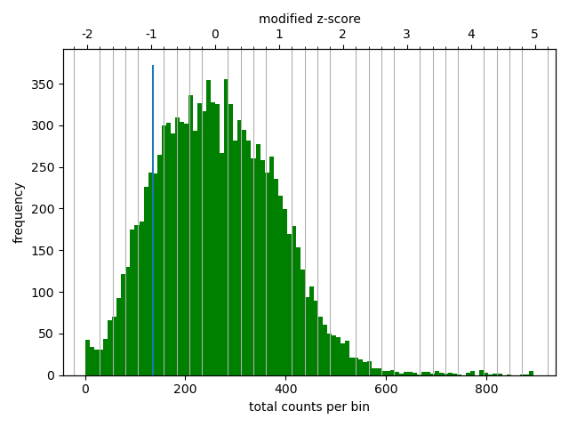
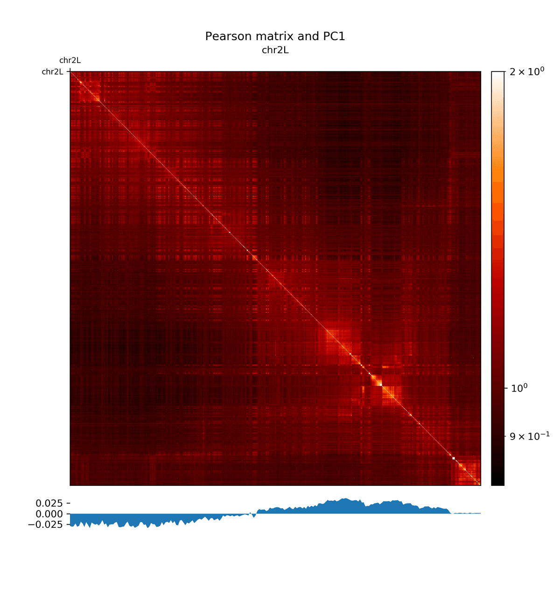
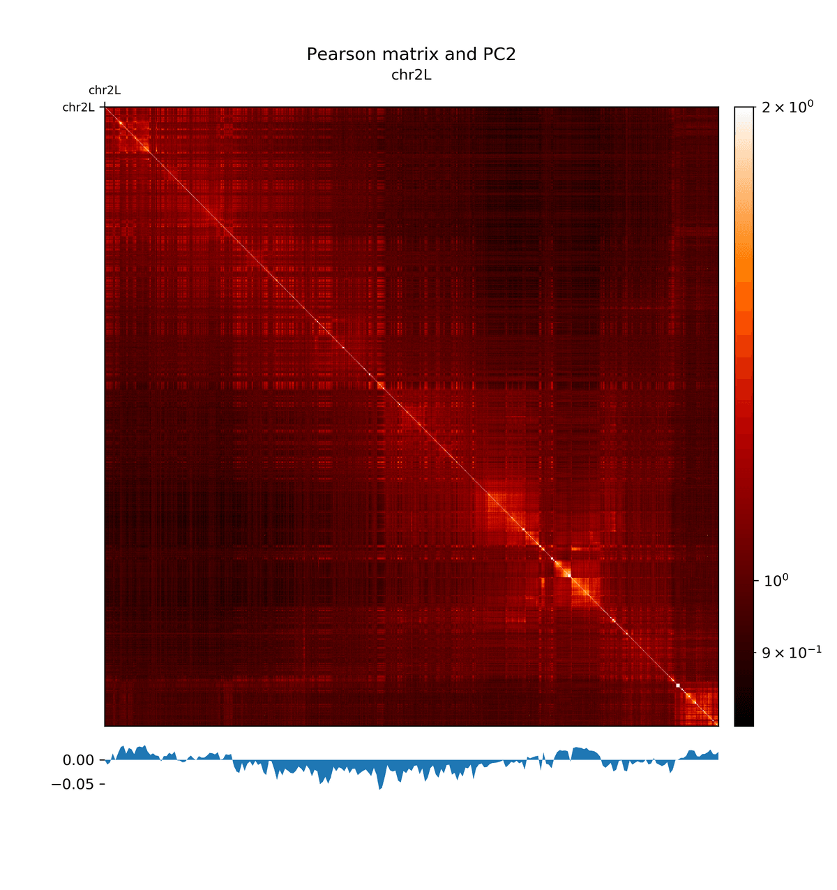
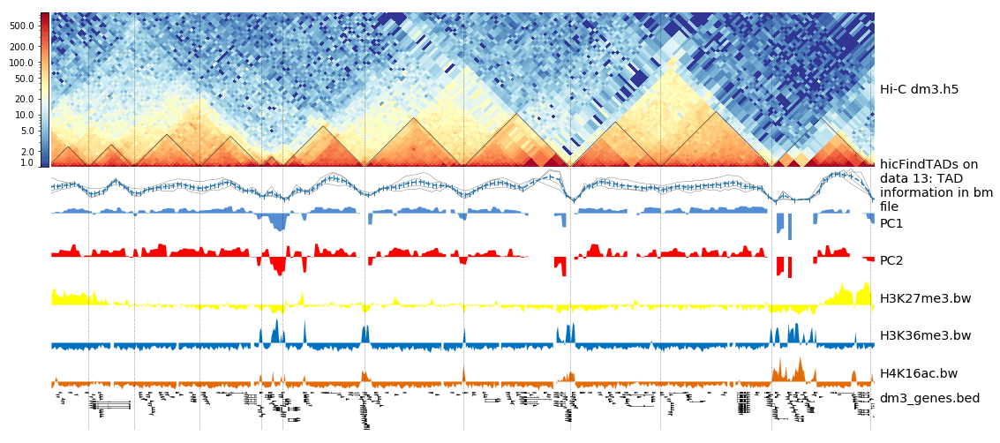
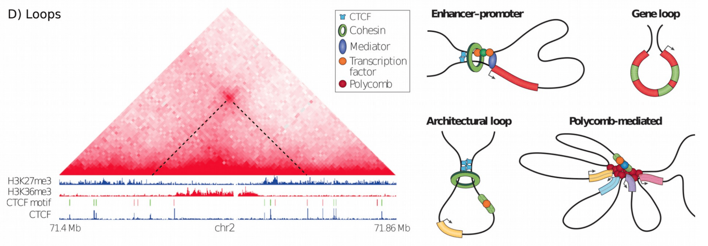
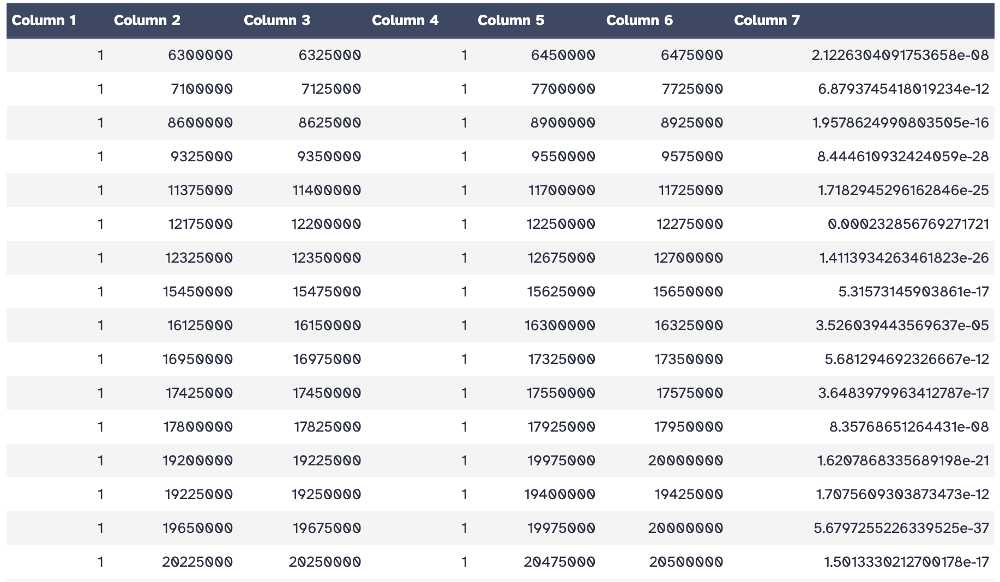

In this HiCExplorer tutorial we will generate and plot a Hi-C contact matrix.
For this the following steps are necessary to be performed:

1. Map the Hi-C reads to the reference genome
2. Creation of a Hi-C matrix
3. Plotting the Hi-C matrix
4. Correction of Hi-C matrix
5. TAD Calling
6. A/B compartments computation
7. pyGenomeTracks visualization
8. Loop detection

After a corrected Hi-C matrix is created other tools can be used to visualise it, call TADS or compare it with other matrices.

> <agenda-title></agenda-title>
>
> In this tutorial, we will deal with:
>
> 1. TOC
> {:toc}
>
{: .agenda}

# Data upload

> <hands-on-title>Data upload</hands-on-title>
>
> 1. Create a new history
>
>    
>
> 2. Import from [Zenodo](https://doi.org/10.5281/zenodo.16416373).
>
>    ```
>    https://zenodo.org/records/16416373/files/HiC_S2_1p_10min_lowU_R1.fastq.gz
>    https://zenodo.org/records/16416373/files/HiC_S2_1p_10min_lowU_R2.fastq.gz
>    ```
>
>    
>
> 3. **Rename**  the data set to something meaningful
>    - e.g. `HiC_S2_1p_10min_lowU_R1` and `HiC_S2_1p_10min_lowU_R2`.
>    - By default, when data is imported via its link, Galaxy names it with its URL.
>
>    
>
> > <comment-title>Get data from public sources</comment-title>
> > HiCExplorer needs as input the forward and reverse strand of a pair end read which are mapped independently. A usual start point for a typical analysis is the given GSE number of a publication, e.g. GSE63525 for Rao 2014. To get the actual data, go to [NCBI](https://www.ncbi.nlm.nih.gov/geo/) and search for the [GSE number](https://www.ncbi.nlm.nih.gov/geo/query/acc.cgi?acc=GSE63525). In the section 'Samples' the GSM numbers of all samples are given. Select the correct one for you, and go to the [European Nucleotide Archive](https://www.ebi.ac.uk/ena) and enter the GSM number. Select a matching result e.g. [SRX764936](https://www.ebi.ac.uk/ena/data/view/SRX764936) and download the data given in the row 'FASTQ files (FTP)' the forward and reverse strand.
> > It is important to have the forward and reverse strand individual as a FASTQ file and to map it individually, HiCExplorer can not work with interleaved files.
> {: .comment}
>
{: .hands_on}

# Reads mapping

Mates have to be mapped individually to avoid mapper specific heuristics designed for standard paired-end libraries.

We have used the HiCExplorer successfully with `bwa`, `bowtie2` and `hisat2`. In this tutorial we will be using `Bowtie2` tool. It is important to remember to:
- use local mapping, in contrast to end-to-end. A fraction of Hi-C reads are chimeric and will not map end-to-end thus, local mapping is important to increase the number of mapped reads
- tune the aligner parameters to penalize deletions and insertions. This is important to avoid aligned reads with gaps if they happen to be chimeric.
- If bowtie2 or hisat2 are used, `--reorder` option and as a file format `bam_native` needs to be used. Regular `bam` files are sorted by Galaxy and can not be used as an input for HiCExplorer.

> <hands-on-title>Mapping reads</hands-on-title>
>
> 1. : Run `Bowtie2` on both strands `HiC_S2_1p_10min_lowU_R1` and `HiC_S2_1p_10min_lowU_R2` with:
>    - *"Is this single or paired library"*: `Single-end`
>    - *Set multiple data sets*
>    - *"FASTQ file"*: `HiC_S2_1p_10min_lowU_R1`and `HiC_S2_1p_10min_lowU_R2`
>    - *"Will you select a reference genome from your history or use a built-in index?"*: `Use a built-in index`
>    - *"Select a reference genome"*: `dm3`
>    - *"Do you want to tweak SAM/BAM Options?"*: `Yes`
>       - *"Reorder output to reflect order of the input file"*: `Yes`
>
> 2. **Rename**  the output of the tool according to the corresponding files: `R1.bam` and `R2.bam`
>
{: .hands_on}

# Creating a Hi-C matrix

Once the reads have been mapped the Hi-C matrix can be built.

For this step we will use [`hicBuildMatrix`](http://hicexplorer.readthedocs.io/en/latest/content/tools/hicBuildMatrix.html#hicbuildmatrix) tool, which builds the matrix of read counts over the bins in the genome, considering the sites around the given restriction site.

For versions `3.6` and later, `hicBuildMatrix` requires an input BED file that specifies the locations of all restriction cuts. We must first identify restriction enzyme sites use the tool `hicFindRestSite`, which requires a `fasta` file containing the genome of organism we are studying. We will import the `dm3_genome.fasta` genome file from Zenodo.

> <hands-on-title>Import from Zenodo</hands-on-title>
>
> 1. Import the reference genome
>    ```
>    https://zenodo.org/records/16416373/files/dm3_genome.fasta
>    ```
>
>    
>
{: .hands_on}


> <hands-on-title>Find Restriction Sites and Build Matrix</hands-on-title>
>
> 1. :
>    - *"Fasta file for the organism genome."*: `dm3_genome.fasta`
>    - *"Restriction enzyme sequence"*: `GATC`
>
>       > <comment-title></comment-title>
>       >
>       > Our data uses the DpnII restriction enzyme, which has the *Restriction enzyme sequence*: `GATC`. The *Restriction enzyme sequence* will be specific to the restriction enzyme that your data uses (e.g. for HindIII this will be `AAGCTT`).
>       {: .comment}
>
> 2. **Rename**  the output to `Restriction Sites`.
>
> 3. : Run `hicBuildMatrix` on the `R1.bam` and `R2.bam` mapping output.
>    - *"1: Sam/Bam files to process (forward/reverse)"*: `R1.bam`
>    - *"2: Sam/Bam files to process (forward/reverse)"*: `R2.bam`
>    - *"BED file with all restriction cut places"*: `Restriction sites`
>    - *"Sequence of the restriction site"*: `GATC`
>    - *"Dangling sequence"*: `GATC`
>    - *"Bin size in bp"*: `10000`
>
>       > <comment-title></comment-title>
>       >
>       > *hicBuildMatrix* creates two files, a bam file containing only the valid Hi-C read pairs and a matrix containing the Hi-C contacts at the given resolution. The bam file is useful to check the quality of the Hi-C library on the genome browser. A good Hi-C library should contain piles of reads near the restriction fragment sites. In the QC folder a html file is saved with plots containing useful information for the quality control of the Hi-C sample like the number of valid pairs, duplicated pairs, self-ligations etc. Usually, only 25%-40% of the reads are valid and used to build the Hi-C matrix mostly because of the reads that are on repetitive regions that need to be discarded.
>       {: .comment}
>
>       > <comment-title></comment-title>
>       >
>       > Normally 25% of the total reads are selected. The output matrices have counts for the genomic regions. The extension of output matrix files is .h5.
>       > A quality report is created in e.g. `hicMatrix/R1_10kb_QC`, have a look at the report hicQC.html.
>       {: .comment}
>
> 4. **Rename**  the output to `10kb contact matrix`.
>
{: .hands_on}


> <comment-title></comment-title>
> If you do not have access to the genome for your organism (e.g. if you plan to use your Hi-C data to assist with genome assembly) then you can instead select `hicBuildMatrix` version 3.4.3.0.
>
>   > <hands-on-title>Build Hi-C Matrix</hands-on-title>
>   >
>   > 1. : Run `hicBuildMatrix` on the `R1.bam` and `R2.bam` mapping output.
>   >    - *"1: Sam/Bam files to process"*: `R1.bam`
>   >    - *"2: Sam/Bam files to process"*: `R2.bam`
>   >    - *"Choose to use a restriction cut file or a bin size"*: `Bin size`
>   >    - *"Bin size in bp"*: `10000`
>   >    - *"Sequence of the restriction site"*: `GATC`
>   {: .hands_on}
>
{: .comment}

# Plotting the Hi-C matrix

A 10 kb bin matrix is too large to plot, it's better to reduce the resolution. We usually run out of memory for a 1 kb or a 10 kb bin matrix and the time to plot it is very long (minutes instead of seconds). In order to reduce the resolution we use the tool [`hicMergeMatrixBins`](http://hicexplorer.readthedocs.io/en/latest/content/tools/hicMergeMatrixBins.html#hicmergematrixbins).

[`hicMergeMatrixBins`](http://hicexplorer.readthedocs.io/en/latest/content/tools/hicMergeMatrixBins.html#hicmergematrixbins) merges the bins into larger bins of given number (specified by –numBins). We will merge 100 bins in the original (uncorrected) matrix and then correct it. The new bin size is going to be 10.000 bp * 100 = 1.000.000 bp = 1 Mb

> <hands-on-title>Merge Matrix Bins</hands-on-title>
>
> 1. :
>    - *"Matrix to compute on"*: `10kb contact matrix`
>    - *"Number of bins to merge"*: `100`
>
> 2. **Rename**  the output to `1MB contact matrix`.
>
> 3. :
>    - *"Matrix to compute on"*: `1MB contact matrix`
>    - *"Plot title"*: `Hi-C matrix for dm3`
>    - *"Remove masked bins from the matrix"*: `Yes`
>    - *"Plot the log1p of the matrix values"*: `Yes`
>    - *"Chromosomes to include (and order to plot in)"*: `chr2L`
>    - *"+ Insert Chromosomes to include (and order to plot in):"*: `chr2R`
>    - *"+ Insert Chromosomes to include (and order to plot in):"*: `chr3L`
>    - *"+ Insert Chromosomes to include (and order to plot in):"*: `chr3R`
>    - *"+ Insert Chromosomes to include (and order to plot in):"*: `chrX`
>
>    > <tip-title>log1p</tip-title>
>    >
>    > Because of the large differences in counts found in the matrix, it is better to plot the counts using the `–log1p` option.
>    {: .tip}
>
{: .hands_on}

The resulting plot of the 1 Mb contact matrix should look like:


# Correcting the Hi-C matrix

[`hicCorrectMatrix`](http://hicexplorer.readthedocs.io/en/latest/content/tools/hicCorrectMatrix.html#hiccorrectmatrix) corrects the matrix counts in an iterative manner. For correcting the matrix, it’s important to remove the unassembled scaffolds (e.g. NT_) and keep only chromosomes, as scaffolds create problems with matrix correction. Therefore we use the chromosome names (chr2R, chr2L, chr3R, chr3L, chrX) here.

Matrix correction works in two steps: first a histogram containing the sum of contact per bin (row sum) is produced. This plot needs to be inspected to decide the best threshold for removing bins with lower number of reads. The second steps removes the low scoring bins and does the correction.

> <hands-on-title>Matrix diagnostic</hands-on-title>
>
> 1. :
>    - *"Matrix to compute on"*: `10kb contact matrix`
>    - *"Range restriction (in bp)"*: `Diagnostic plot`
>    - *"Chromosomes to include (and order to plot in)"*: `chr2L`
>    - *"+ Insert Chromosomes to include (and order to plot in):"*: `chr2R`
>    - *"+ Insert Chromosomes to include (and order to plot in):"*: `chr3L`
>    - *"+ Insert Chromosomes to include (and order to plot in):"*: `chr3R`
>    - *"+ Insert Chromosomes to include (and order to plot in):"*: `chrX`
>
{: .hands_on}

The output of the program prints a threshold suggestion that is usually accurate but is better to revise the histogram plot. The threshold is visualised in the plot as a blue vertical line.



In our case the distribution describes the counts per bin of a genomic distance. To remove all bins with a z-score threshold less / more than X means to remove all bins which have less / more counts than X of mean of their specific distribution in units of the standard deviation. Looking at the distribution, we can select the value of -1.6 (lower end) and 1.8 (upper end) to remove. This is given by the –filterThreshold option in hicCorrectMatrix set to 'correct matrix' mode.

> <hands-on-title>Matrix correction</hands-on-title>
>
> 1. :
>    - *"Matrix to compute on"*: `10kb contact matrix`
>    - *"Range restriction (in bp)"*: `Correct matrix`
>    - *"Normalize each chromosome separately"*: `Yes`
>    - *"Remove bins of low coverage"*: `-1.6`
>    - *"Remove bins of large coverage"*: `1.8`
>    - *"Chromosomes to include (and order to plot in)"*: `chr2L`
>    - *"+ Insert Chromosomes to include (and order to plot in):"*: `chr2R`
>    - *"+ Insert Chromosomes to include (and order to plot in):"*: `chr3L`
>    - *"+ Insert Chromosomes to include (and order to plot in):"*: `chr3R`
>    - *"+ Insert Chromosomes to include (and order to plot in):"*: `chrX`
>
> 2. **Rename**  the corrected matrix to `10kb corrected contact matrix`.
>
{: .hands_on}

It can happen that the correction stops with:

```
ERROR:iterative correction:*Error* matrix correction produced extremely large values.
This is often caused by bins of low counts. Use a more stringent filtering of bins.
```

This can be solved by a more stringent z-score values for the filter threshold or by a look at the plotted matrix. For example, chromosomes with 0 reads in its bins can be excluded from the correction by not defining it for the set of chromosomes that should be corrected (parameter 'Include chromosomes').

## Plotting the corrected Hi-C matrix

We can now plot chromosome 2L with the corrected matrix.

> <hands-on-title>Plotting the corrected Hi-C matrix</hands-on-title>
>
> 1. :
>    - *"Matrix to compute on"*: `10kb corrected contact matrix`
>    - *"Plot title"*: `Hi-C matrix for dm3`
>    - *"Plot per chromosome"*: `No`
>    - *"Plot only this region"*: `chr2L`
>    - *"Plot the log1p of the matrix values"*: `True`
>
{: .hands_on}


## Load new data

The steps so far would have led to long run times if real data would have been used. We therefore prepared a new matrix for you, `corrected contact matrix dm3 large`. Please import it into your history from Zenodo.


> <hands-on-title>Import from Zenodo</hands-on-title>
>
> 1. Import the following file into your history:
>    ```
>    https://zenodo.org/records/16416373/files/corrected_contact_matrix_dm3_large.h5
>    ```
>
{: .hands_on}

# TAD calling

“The partitioning of chromosomes into topologically associating domains (TADs) is an emerging concept that is reshaping our understanding of gene regulation in the context of physical organization of the genome” ().

TAD calling works in two steps: First HiCExplorer computes a TAD-separation score based on a z-score matrix for all bins. Then those bins having a local minimum of the TAD-separation score are evaluated with respect to the surrounding bins to assign a p-value. Then a cutoff is applied to select the bins more likely to be TAD boundaries.

[hicFindTADs](http://hicexplorer.readthedocs.io/en/latest/content/tools/hicFindTADs.html#hicfindtads) tries to identify sensible parameters but those can be change to identify more stringent set of boundaries.

> <hands-on-title>Finding TADs</hands-on-title>
>
> 1. :
>    - *"Matrix to compute on"*: `corrected_contact_matrix_dm3_large.h5`
>    - *"Minimum window length (in bp) to be considered to the left and to the right of each Hi-C bin."*: `30000`
>    - *"Maximum window length (in bp) to be considered to the left and to the right of each Hi-C bin."*: `100000`
>    - *"Step size when moving from minDepth to maxDepth"*: `10000`
>    - *"Multiple Testing Corrections"*: `False discovery rate`
>    - *"q-value"*: `0.05`
>    - *"Minimum threshold of the difference between the TAD-separation score of a putative boundary and the mean of the TAD-sep. score of surrounding bins."*: `0.001`
>
> 2. **Rename**  the TAD boundary positions to `Boundary positions`.
> 3. **Rename**  the multi-scale TAD scores matrix to `Matrix with multi-scale TAD scores`.
> 4. **Rename**  the TAD domains to `TAD domains`.
> 5. **Rename**  the boundary information to `Boundary information plus score`.
> 6. **Rename**  the TAD information in bm file to `TAD information in bm file`.
>
{: .hands_on}

As an output we get the boundaries, domains and scores separated files. We will use in the plot later only the TAD-score file.

# A/B compartments computation

> <hands-on-title>Computing A / B compartments</hands-on-title>
>
> 1. :
>    - *"Matrix to compute on"*: `corrected_contact_matrix_dm3_large.h5 `
>    - *"Output file format"*: `bigwig`
>    - *"Return internally used Pearson matrix"*: `Yes`
>
> 2. **Rename**  the Pearson matrix to `Pearson matrix`.
>
{: .hands_on}

> <hands-on-title>Plotting the pearson matrix and PCA track</hands-on-title>
>
> 1. :
>    - *"Matrix to compute on"*: `Pearson matrix`
>    - *"Plot title"*: `Pearson matrix and PC1`
>    - *"Chromosomes to include"*: `chr2L`
>    - *"Color map to use for the heatmap"*: `gist_heat`
>    - *"Plot the log1p of the matrix values (log(Hi-C contacts+1))"*: `Yes`
>    - *"Datatype of eigenvector file"*: `bigwig`
>    - *"Eigenvector file"*: `pca1`
>
> 2. :
>    - *"Matrix to compute on"*: `Pearson matrix`
>    - *"Plot title"*: `Pearson matrix and PC2`
>    - *"Chromosomes to include"*: `chr2L`
>    - *"Color map to use for the heatmap"*: `gist_heat`
>    - *"Plot the log1p of the matrix values (log(Hi-C contacts+1))"*: `Yes`
>    - *"Datatype of eigenvector file"*: `bigwig`
>    - *"Eigenvector file"*: `pca2`
>
{: .hands_on}







The first principal component correlates with the chromosome arms, while the second component correlates with A/B compartments.

# Integrating Hi-C and other data

We can plot the TADs for a given chromosomal region. For this we will use [`pyGenomeTracks`](http://hicexplorer.readthedocs.io/en/latest/content/tools/hicPlotTADs.html). For the next step we need additional data tracks. Please import `dm3_genes.bed`, `H3K27me3.bw`, `H3K36me3.bw` and `H4K16ac.bw` to your history from Zenodo.

> <hands-on-title>Import from Zenodo</hands-on-title>
>
> 1. Import the following files into Galaxy:
>    ```
>    https://zenodo.org/records/16416373/files/dm3_genes.bed
>    https://zenodo.org/records/16416373/files/H3K27me3.bw
>    https://zenodo.org/records/16416373/files/H3K36me3.bw
>    https://zenodo.org/records/16416373/files/H4K16ac.bw
>    ```
>
{: .hands_on}

> <hands-on-title>Update `dm3_genes.bed` database</hands-on-title>
>
> If the database for `dm3_genes.bed` is not "dm3" (i.e. `database "?"` or a different database is listed), then the database must be updated to "dm3".
>
> 
>
{: .hands_on}


> <hands-on-title>Plotting TADs</hands-on-title>
>
> 1. :
>    - *"Region of the genome to plot"*: `chr2L:14500000-16500000`
>    - *"Choose style of the track"*: `TAD visualization (triangle)`
>         - *"Plot title"*: `HiC dm3 chr2L:14500000-16500000`
>         - *"Matricies to plot"*: `corrected_contact_matrix_dm3_large.h5`
>         - *"Depth"*: `750000`
>         - *"Height"*: `4`
>         - *"Boundaries file"*: `TAD domains`
>
>    - *"+Insert Include tracks in your plot"*
>        - *"Choose style of the track"*: `Bedgraph matrix track/TAD score`
>        - *"Plot title"*: `TAD separation score`
>        - *"Track file(s) bedgraph format"*: `TAD information in bm file`
>        - *"Height"*: `4`
>        - *"type of plotting"*: `lines: each column in the bedgraph will be a line and a mean line will be added`
>
>    - *"+Insert Include tracks in your plot"*
>        - *"Choose style of the track"*: `Bigwig track`
>        - *"Plot title"*: `PC1`
>        - *"Track file bigwig format"*: `pca1`
>        - *"Height"*: `1.5`
>        - *"Color of track"* to a color of your choice
>
>    - *"+Insert Include tracks in your plot"*
>        - *"Choose style of the track"*: `Bigwig track`
>        - *"Plot title"*: `PC2`
>        - *"Track file bigwig format"*: `pca2`
>        - *"Height"*: `1.5`
>        - *"Color of track"* to a color of your choice
>
>    - *"+Insert Include tracks in your plot"*
>        - *"Choose style of the track"*: `Bigwig track`
>        - *"Plot title"*: `H3K36me3`
>        - *"Track file(s) bigwig format"*: `H3K36me3.bw`
>        - *"Height"*: `1.5`
>        - *"Color of track"* to a color of your choice
>
>    - *"+Insert Include tracks in your plot"*
>        - *"Choose style of the track"*: `Bigwig track`
>        - *"Plot title"*: `H3K27me3`
>        - *"Track file(s) bigwig format"*: `H3K27me3.bw`
>        - *"Height"*: `1.5`
>        - *"Color of track"* to a color of your choice
>
>    - *"+Insert Include tracks in your plot"*
>        - *"Choose style of the track"*: `Bigwig track`
>        - *"Plot title"*: `H4K16ac`
>        - *"Track file(s) bigwig format"*: `H4K16ac.bw`
>        - *"Height"*: `1.5`
>        - *"Color of track"* to a color of your choice
>
>    - *"+Insert Include tracks in your plot"*
>        - *"Choose style of the track"*: `Gene track / Bed track`
>        - *"Plot title"*: `dm3 genes`
>        - *"Track file(s) bed or gtf format"*: `dm3_genes.bed`
>        - *"Height"*: `3`
>        - *"Configure other bed parameters"*:
>        	- *"Maximum number of gene rows"*: `15`
>        - *"Color of track"* to a color of your choice
>
>    - *"+Insert Include tracks in your plot"*
>        - *"Choose style of the track"*: `Vlines track`
>        - *"Track file bed format"*: `TAD domains`
>
{: .hands_on}

The resulting image should look like this one:


# Loop detection

In Hi-C data, the term `loop` refers to a 3D structure which represents enhancer-promoter, gene, architectural or polycomb-mediated interactions. These interactions have the characteristics to be enriched in a single region compared to the local background. These loops are also called long-range interactions with an expected maximum distance of 2 MB (see ).




To compute loops, we will use a published Hi-C sequencing dataset from the human cell line GM12878, mapped to hg19 and of 25 kb resolution (). The original Hi-C data is from  (GSE63525). We can import this dataset from Zenodo.

We use a new file because to detect loop structures the read coverage is required to be in the millions per chromosome; this was not the case for the previous used drosophila dataset.


> <hands-on-title>Import via URL</hands-on-title>
>
> 1. Import the following file to Galaxy
>    ```
>    https://zenodo.org/records/16416373/files/GM12878_25kb_cooler_coarsen.cool
>    ```
{: .hands_on}


> <hands-on-title>Matrix information</hands-on-title>
>
> 1. :
>    - *"Select"* `Multiple datasets`
>    - *"Matrix to compute on"*: `corrected_contact_matrix_dm3_large.h5 ` and `GM12878_25kb_cooler_coarsen.cool`
>
{: .hands_on}

We can view the result of `hicInfo` and see that the new imported file has 900 million non-zero elements, while the drosophila Hi-C interaction matrix has around 12 million non-zero elements.

We next run `hicDetectLoops` to find loops. In this tutorial we will only look for loops in chromosome 1 to reduce the required computational resources and computing time.

> <hands-on-title>Computing loops</hands-on-title>
>
> 1. :
>    - *"Matrix to compute on"*: `GM12878_25kb_cooler_coarsen.cool`
>    - *"Peak width"*: `6`
>    - *"Window size"*: `10`
>    - *"P-value preselection"*: `0.02`
>    - *"P-value"*: `0.02`
>    - *"Chromosomes to include"*: `1`
>
{: .hands_on}


The detection of the loops is based on a pre-selection of interactions, a p-value given a continuous negative binomial distribution over all interactions of a relative distance is computed. All interactions are filtered with a threshold (`p-value preselection`) to retrieve loop candidates. In a second step, the selected peak candidate is compared against its background using a Wilcoxon rank-sum test.

As an output we get a loop file containing the positions of both anchor points of the loop and the p-value of the used statistical test.



> <hands-on-title>Plotting detected loops</hands-on-title>
>
> 1. :
>    - *"Matrix to compute on"*: `GM12878_25kb_cooler_coarsen.cool`
>    - *"Plot title"*: `Loops`
>    - *"Plot only this region"*: `1:18000000-22000000`
>    - *"Plot the log1p of the matrix values"*: `Yes`
>    - *"Plot Loops"*: `Yes`
>       - *"Add detected loops"*: `Computed loops`
>    - *"DPI for image"*: `300`
>
{: .hands_on}


# Conclusion

In this tutorial we used HiCExplorer to analyze drosophila melanogaster cells. We mapped chimeric reads and created a contact matrix, to reduce noise this contact matrix was normalized. We showed how to visualise a contact matrix and how we can investigate topological associating domains and relate them to additional data like gene tracks. Moreover, we used a human Hi-C interaction matrix to compute loop structures.


To improve your learned skills, there is an additional [`hicexplorer` tutorial](http://hicexplorer.readthedocs.io/en/latest/content/example_usage.html) based on mouse stem cells.
