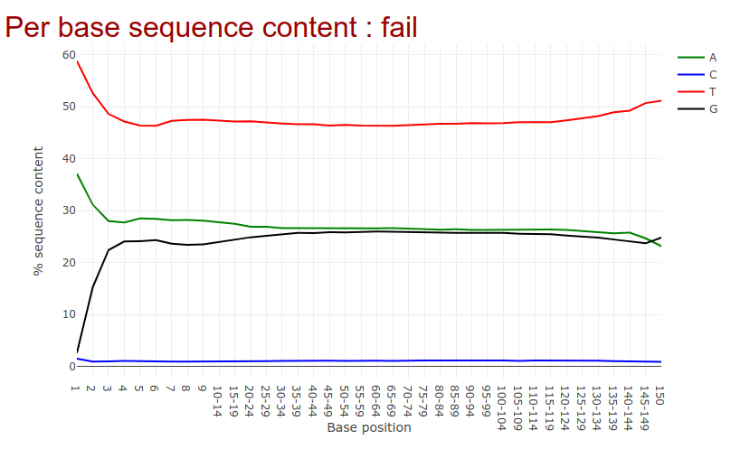
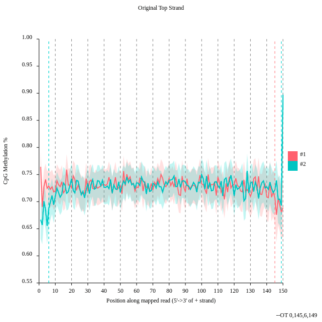
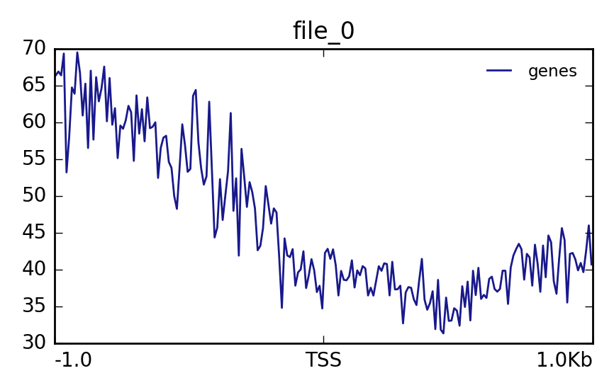
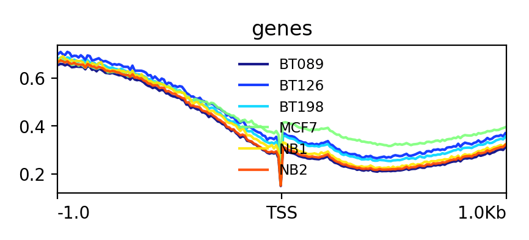

We will use a small subset of the original data. If we would do the computation on the orginal data the computation time for a tutorial is too long. To show you all necessary steps for Methyl-Seq we decided to use a subset of the data set. In a second step we use precomputed data from the study to show you different levels of methylation. We will consider samples from normal breast cells (NB), fibroadenoma (noncancerous breast tumor, BT089), two invasive ductal carcinomas (BT126, BT198) and a breast adenocarcinoma cell line (MCF7).

This tutorial is based off of . The data we use in this tutorial is available at [Zenodo](https://zenodo.org/record/557099).


> <agenda-title></agenda-title>
>
> In this tutorial, we will deal with:
>
> 1. TOC
> {:toc}
>
{: .agenda}


# Data upload

We will start by loading the example dataset which will be used for the tutorial into Galaxy


> <hands-on-title>Get the data into Galaxy</hands-on-title>
>
>
> 1. Create a new history
>
>    
>
> 2. Import the two example datasets from Zenodo or the shared data library:
>
>    ```
>    https://zenodo.org/record/557099/files/subset_1.fastq
>    https://zenodo.org/record/557099/files/subset_2.fastq
>    ```
>
>    
>
>    
>
{: .hands_on}


# Quality Control

The first step in any analysis should always be quality control. We will use the [Falco](https://falco.readthedocs.io/en/latest/) tool to asses the quality of our reads and determine if we need to perform any data cleaning before proceeding with our analysis. Falco is an efficiency optimized rewrite of [FastQC](https://www.bioinformatics.babraham.ac.uk/projects/fastqc/)

> <hands-on-title>Quality Control</hands-on-title>
>
> 1.  with the following parameters:
>    -  *"Raw read data from your current history"*:  `subset_1.fastq.gz` and `subset_2.fastq.gz`
>
>    
>
> 2. Go to the web page result page and have a closer look at 'Per base sequence content'
>
>    
>
>    > <question-title></question-title>
>    >
>    > 1. Note the GC distribution and percentage of "T" and "C". Why is this so weird?
>    > 2. Is everything as expected?
>    >
>    > > <solution-title></solution-title>
>    > > 1. The attentive audience of the theory part knows: Every C-meth stays a C and every normal C becomes a T during the bisulfite conversion.
>    > > 2. Yes it is. Always be careful and have the specific characteristics of your data in mind during the interpretation of Falco results.
>    > {: .solution }
>    {: .question}
>
{: .hands_on}


# Alignment

> <hands-on-title>Mapping with bwameth</hands-on-title>
>
> We will now map the imported dataset against a reference genome.
>
> 1.  with the following parameters:
>    - *"Select a genome reference from your history or a built-in index?"*: `Use a built-in index`
>        - *"Select a reference genome"*: `Human (hg38full)`
>    - *"Is this library mate-paired"*: `Paired-end`
>        - *"First read in pair"*: `subset_1.fastq`
>        - *"Second read in pair"*: `subset_2.fastq`
>
>    > <comment-title>Long compute times</comment-title>
>    > Please notice that mapping can take some time. If you want to skip this, we provide for you a precomputed alignment. Import `https://zenodo.org/records/557099/files/aligned_subset.bam` to your history.
>    {: .comment}
>
>    > <question-title></question-title>
>    >
>    > Why we need other alignment tools for bisulfite sequencing data?
>    >
>    > > <solution-title></solution-title>
>    > > You may have noticed that all the C's are C-meth's and a T can be a T or a C. A mapper for methylation data needs to find out what is what.
>    > {: .solution }
>    {: .question}
>
{: .hands_on}


# Methylation bias and metric extraction

> <hands-on-title>Methylation bias</hands-on-title>
>
> In this step we will have a look at the distribution of the methylation and will look at a possible bias.
>
> 1.  with the following parameters:
>    - *"Load reference genome from"*: `Local cache`
>        - *"Using reference genome"*: `Human (hg38)`
>    - *"Sorted BAM file"*: output of **bwameth** 
>    - *"What do you want to do?"*: `Determine the position-dependent methylation bias in the dataset, producing diagnostic SVG images (mbias)`
>    - In *"Advanced options"*
>        - *"Keep singletons"*:  `Yes`
>        - *"Keep discordant alignmetns"*:  `Yes`
>
>    
>
>    > <question-title></question-title>
>    >
>    > 1. Consider the `original top strand` output. Is there a methylation bias?
>    > 2. If we would trim, what would be the start and the end positions?
>    >
>    > > <solution-title></solution-title>
>    > > 1. The distribution of the methylation is more or less equal. Only at the start and the end we could trim a bit but a +- 5% variation is acceptable.
>    > > 2. To trim the reads we would include for the first strand only the positions 0 to 145, for the second 6 to 149.
>    > {: .solution }
>    {: .question}
>
>
{: .hands_on}


> <hands-on-title>Methylation extraction with MethylDackel</hands-on-title>
>
>
> We will extract the methylation on the resulting BAM file of the alignment step. We need this to create a methylation level plot in the next step.
>
> 1.  with the following parameters:
>    - *"Load reference genome from"*: `Local cache`
>        - *"Using reference genome"*: `Human (hg38)`
>    - *"Sorted BAM file"*: output of **bwameth** 
>    - *"What do you want to do?"*: `Extract methylation metrics from an alignment file in BAM/CRAM format (extract)`
>    - *"Merge per-Cytosine metrics"*:  `Yes`
>    - *"Output options"*: `CpG methylation fractions (--fraction)`
>
{: .hands_on}


# Visualization

> <hands-on-title></hands-on-title>
>
> In this step we want to visualize the methylation level around all TSS of our data. When located at gene promoters, DNA methylation is usually a repressive mark.
>
> 1.  with the following parameters:
>    - *"Convert"*: `fraction CpG` (result of **MethylDackel** )
>
>      > <tip-title>Database edit</tip-title>
>      >
>      > It can happen that you can not select the correct input file. In this case you have to add meta information about the used genome to the file.
>      > * Click on the pencil of the correct history item.
>      > * Change `Database/Build:` to the genome you used.
>      > * In our case the correct genome is `Human Dec. 2013 (GRCh38/hg38) (hg38)`.
>      {: .tip}
>
> 2. Import the BED file with CpG islands from [Zenodo](https://zenodo.org/record/557099) into the history
>
>    ```
>    https://zenodo.org/records/557099/files/CpGIslands.bed
>    ```
>
> 3.  with the following parameters:
>    - *"Regions to plot"*: `CpGIslands.bed`
>    - *"Sample order matters"*: `No`
>    - *"Score file"*: Output of **Wig/BedGraph-to-bigWig** 
>    - *"computeMatrix has two main output options"*: `reference-point`
>
> 4.  with the following parameters:
>    - *"Matrix file from the computeMatrix tool"*: `Matrix` (output of **computeMatrix** )
>
> The output should look like this:
>
> 
>
> Lets see how the methylation looks for a few provided files:
>
> 1. Import the BED file with CpG islands from [Zenodo](https://zenodo.org/record/557099) into the history
>
>    ```
>    https://zenodo.org/records/557099/files/NB1_CpG.meth.bedGraph
>    ```
>
> 2.  with the following parameters:
>    - *"Convert"*: `NB1_CpG.meth.bedGraph`
>
>    > <question-title></question-title>
>    >
>    > The execution fails. Do you have an idea why?
>    >
>    > > <solution-title></solution-title>
>    > > A conversion to bigWig would fail right now. If it turned green, the file size should be 0 bytes. Probably dataset info box shows some error message like `hashMustFindVal: '1' not found`. The reason is the source of the reference genome which was used. There is ensembl and UCSC as sources which differ in naming the chromosomes. Ensembl is using just numbers e.g. 1 for chromosome one. UCSC is using chr1 for the same. Be careful with this especially if you have data from different sources. We need to convert this.
>    > {: .solution }
>    {: .question}
>
>    > <comment-title>UCSC - Ensembl convert</comment-title>
>    >
>    >
>    > Download the file containing mapping between Ensembl and UCS chromosome convention of hg38
>    >
>    > ```
>    > https://raw.githubusercontent.com/dpryan79/ChromosomeMappings/master/GRCh38_ensembl2UCSC.txt
>    > ```
>    >
>    >  with the follwing parameters:
>    >    - *"File in which you want to replace some values"*: `NB1_CpG.meth.bedGraph`
>    >    - *"Replace information file"*: `GRCh38_ensembl2UCSC.txt`
>    >    - *"Which column should be replaced?"*: `Column: 1`
>    >    - *"Skip this many starting lines"*: `1`
>    >    - *"Delimited by"*: `Tab`
>    {: .comment}
>
> 4. To save compute time we prepared the converted files for you. Import the following files. Create a collection list and label it `all_coverage_files`. Strip the file extension from the name. For example, rename from `NB1_CpG.meth_ucsc.bedGraph`to `NB1_CpG`.
>
>    ```
>    https://zenodo.org/records/557099/files/NB1_CpG.meth_ucsc.bedGraph
>    https://zenodo.org/records/557099/files/NB2_CpG.meth_ucsc.bedGraph
>    https://zenodo.org/records/557099/files/BT089_CpG.meth_ucsc.bedGraph
>    https://zenodo.org/records/557099/files/BT126_CpG.meth_ucsc.bedGraph
>    https://zenodo.org/records/557099/files/BT198_CpG.meth_ucsc.bedGraph
>    https://zenodo.org/records/557099/files/MCF7_CpG.meth_ucsc.bedgraph
>    ```
>
>    
>
> 5. Change the datatype to `bedgraph` and set the database to `hg38`
>
>    
>
>    
>
> 6.  with the following parameters:
>    -  *"Convert"*: `all_coverage_files`
>
> 7.  with the following parameters:
>    - *"Regions to plot"*: `CpGIslands.bed`
>    - *"Sample order matters"*: `No`
>    - *"Score file"*: Output of previous **Wig/BedGraph-to-bigWig** 
>    - *"computeMatrix has two main output options"*: `reference-point`
>
> 8.  with the following parameters:
>    - *"Matrix file from the computeMatrix tool"*: `Matrix` (output of previous **computeMatrix** )
>    - *"Show advanced options"*: `Yes`
>       - *"Make one plot per group of regions"*:  `Yes`
>
> The output should look like this:
>
> 
>
{: .hands_on}

# Metilene

> <hands-on-title>Metilene</hands-on-title>
>
> With metilene it is possible to detect differentially methylated regions (DMRs) which is a necessary prerequisite for characterizing different epigenetic states.
>
>
> 1. Import the following files from [Zenodo](https://zenodo.org/record/557099) into yout history
>
>    ```
>    https://zenodo.org/records/557099/files/NB1_CpG.meth.bedGraph
>    https://zenodo.org/records/557099/files/NB2_CpG.meth.bedGraph
>    https://zenodo.org/records/557099/files/BT198_CpG.meth.bedGraph
>    ```
>
> 2.  with the following parameters:
>    - *"Input group 1"*: `NB1_CpG.meth.bedGraph` and `NB2_CpG.meth.bedGraph`
>    - *"Input group 2"*: `BT198_CpG.meth.bedGraph`
>    - *"BED file containing regions of interest"*: `CpGIslands.bed`
>
>    > <question-title></question-title>
>    >
>    > Have a look at the produced pdf document. What is the data showing?
>    >
>    > > <solution-title></solution-title>
>    > > It shows the distribution of DMR differences, DMR length in nucleotides and number CpGs, DMR differences vs. q-values, mean methylation group 1 vs. mean methylation group 2 and DMR length in nucleotides vs. length in CpGs
>    > {: .solution }
>    {: .question}
>
>
{: .hands_on}
