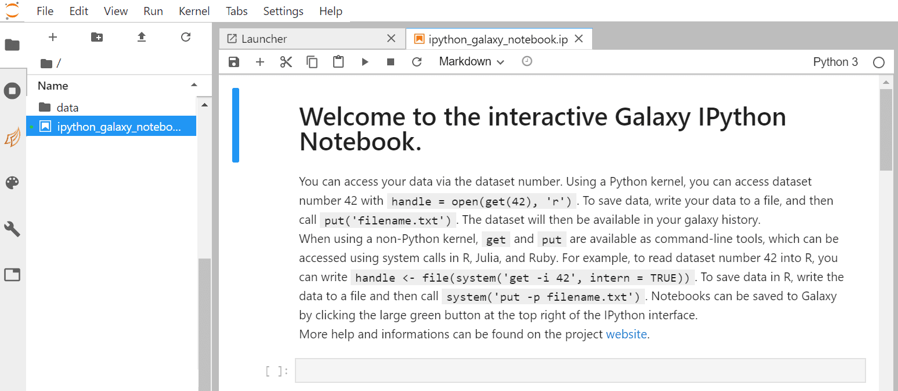
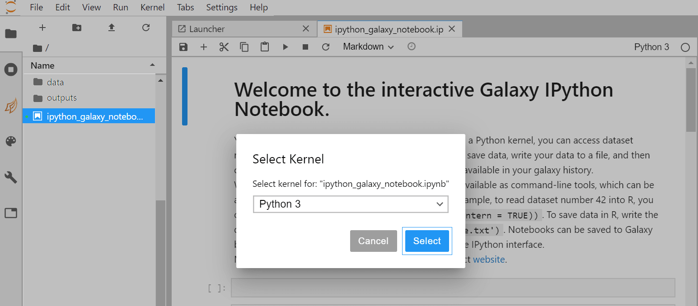
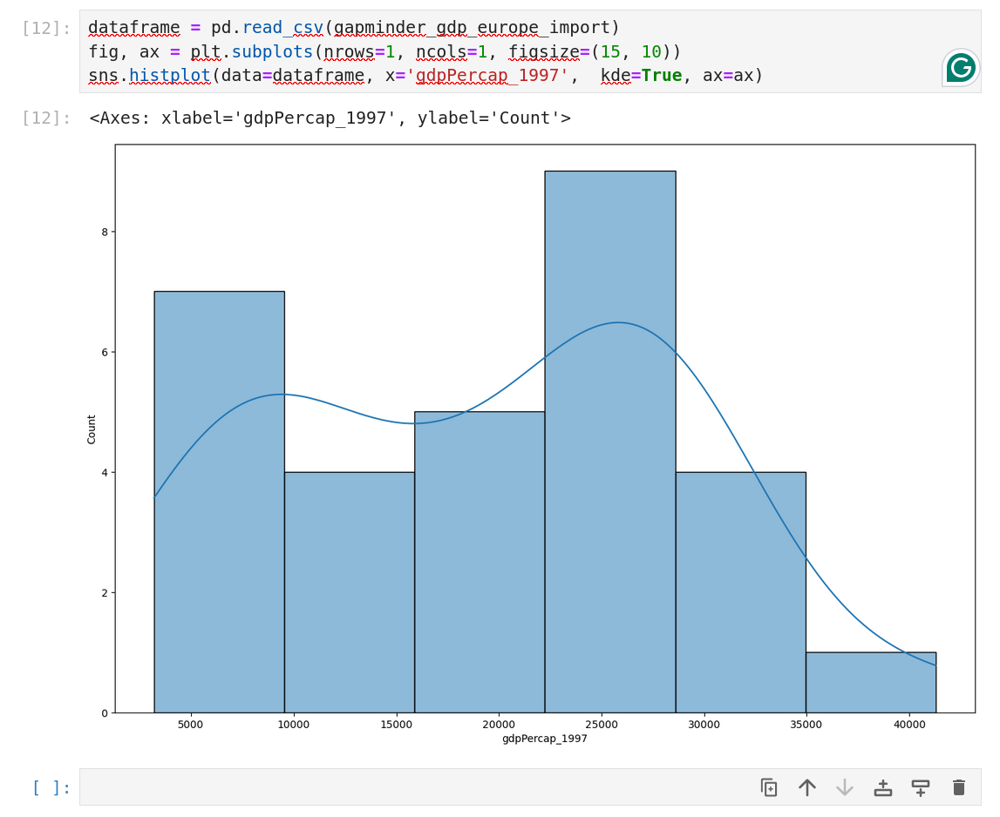

[JupyterLab](https://jupyterlab.readthedocs.io/en/stable) is an [Integrated Development Environment (IDE)](https://en.wikipedia.org/wiki/Integrated_development_environment).
Like most IDEs, it provides a graphical interface for R/Python, making it more user-friendly, and providing dozens of useful features.
We will introduce additional benefits of using JupyterLab as you cover the lessons.



> <agenda-title></agenda-title>
>
> In this tutorial, we will cover:
>
> 1. TOC
> {:toc}
>
{: .agenda}

# JupyterLab

Opening up your :



You should now be looking at a page with the JupyterLab interface:


As shown on the figure above, JupyterLab interface is made of 3 main areas:
- The menu bar at the top
- The left side bar with in particular the **File Browser**
- The main work area in the central panel

## Start your first notebook

Now that we are ready to start exploring JupyterLab, we will want to keep a record of the commands we are using. To do this we can start a Notebook.

> <hands-on-title>Start a notebook</hands-on-title>
>
> 1. On the left side bar, in the **File Browser**: 
>    - Double-click on the file called **ipython_galaxy_notebook.ipynb**. 
>    - Then select the default **This will open the **Python [conda env:base]** Kernel
>    - This will open a default notebook in the main work area.
> 2. If **ipython_galaxy_notebook.ipynb** does not exist (for instance on *Try JupyterLab*), click on **+** (top left) to start **The launcher**. Then click on the **Python** icon in the **Notebook** section to create a new blank notebook.
{: .hands_on}

A new notebook appears in the centre panel. Before we go any further, you should learn to save your script.

> <hands-on-title>Save a Python notebook</hands-on-title>
>
> 1. There are several options to save your file:
>    - Click the **File** menu and select **Save Notebook As...**.
>    - Click the  icon (**Save the notebook contents and create checkpoint**) in the bar above the file tab line in the script editor.
>    - Click the **File** menu and select **Save Notebook**.
>    - Type <kbd>CTRL</kbd>+<kbd>S</kbd> (<kbd>CMD</kbd>+<kbd>S</kbd> on OSX).
>
> 2. There are several options on how to (re-)name your file:
>    - After clicking on the option **Save Notebook As**, a window opens, where the file can be (re-)named.
>    - Right click on the current file name (`ipython_galaxy_notebook.ipynb` or `Untitled.ipynb`) in the bar above the first line in the script editor and select **Rename Notebook** in the opened selection window.
>    - Alternatively, right click on the file name you would like to change on the left side in the folder menu. A window will open where you can select **Rename**.
{: .hands_on}

The new script `ipython_galaxy_notebook.ipynb` should appear in the **File Browser*** in the left panel. By convention, Jupyter notebooks end with the file extension `.ipynb` independently of the programming language (R, Python, Octave, Julia, etc.).



> <comment-title>Note: supported programming languages</comment-title>
>
> Depending on your JupyterLab instance, the list of supported programming languages may vary.
> On [Live.useGalaxy.eu](https://live.usegalaxy.eu), the following programming languages are currently supported:
> - Python 3
> - Julia
> - R
> - Octave
> - Ansible
> - Bash
> - SciJava
{: .comment}

By default, a **Python notebook** is started. Don't worry if you are not familiar with *Python* programming language, it is not necessary for this tutorial. The same functionalities applies for any available programming languages.

> <comment-title>Note: switching to another programming language</comment-title>
>
> Once you have created a Notebook, you can switch to another available programming language (**Switch Kernel**).
> 1. On the top right of your running Notebook, click on **Python 3**. A new window pops up:
> 
> 2. In this new window, click on **Python 3** to select an available programming language (R, octave, Julia, etc.).
> 3. Click on **Select** to activate your selection. The pop-up window closes and you are ready to use your notebook with the selected programming language.
>    Alternatively, you can also:
> 1. Click on **+** (top left menu) to start the **Launcher**. The list of available programming language is given in the **Notebook** section.
> 2. Click on icon of your choice in the **Notebook** section.
> 3. A new notebook is created with the programming language of your choice.
{: .comment}

In the next step, we will create some visualizations. To visualize data, programming languages offer specific libraries. Before we use these libraries, we first need to ensure that these dependencies are installed.

> <hands-on-title>Install dependencies using Conda</hands-on-title>
>
> 1. To open a console to install the dependencies, open the launcher window by clicking on the plus sign in the top-left corner. Within this window, click on `Python [conda env:python-kernel-3.12]` iin the Console section.
> 2. After the console opens, you can enter the following lines into the cell at the bottom:
>    ```python
>    conda install -c conda-forge numpy matplotlib
>    ```
>
> 3. <kbd>Shift+Return</kbd> to run the cell or click on the run cell button.
>
{: .hands_on}

As the dependencies are installed within one Kernel the notebook needs to run on the same Kernel.

> <hands-on-title>Select Dernel</hands-on-title>
>
> 1. First restart the Kernel, by clicking on **Kernel** in the upper menu and select **Restart Kernel...**
> 2. Next switch back to the your ipython notebook (e.g. **ipython_galaxy_notebook.ipynb**). You can find it next to the console tab on top of the right window.
>
> 3. Below the taps you will find **Python env** button (e.g. `Python[conda env:base]`). If you click on this one you can select a Kernel. Please select the Kernel, which was update in the previous step (`Python [conda env:python-kernel-3.12]`).  
>
{: .hands_on}

Now that the dependencies are installed and the Kernel is restarted, we can import the libraries. 

> <hands-on-title>Import Python libraries</hands-on-title>
>
> 1. Click on a cell of your notebook to edit it (verify that it is defined as a "Code" cell)
> 2. Enter the following lines:
>    ```python
>    import numpy as np
>    import matplotlib.pyplot as plt
>    ```
>
> 3. <kbd>Shift+Return</kbd> to run the cell or click on the run cell button.
>
{: .hands_on}

## Graph Display in JupyterLab with Python

In this tutorial we are going to simply plot a simple graph using generated data.

> <hands-on-title>Draw a simple plot</hands-on-title>
>
> 1. Generate a simple dataset
>   
>    ```python
>    x = np.linspace(0, 2, 100)
>    y = x**2
>    ```
>
> 2. Create your figure with the command:
>
>    ```python
>    fig, ax = plt.subplots( nrows=1, ncols=1 ,figsize=(15, 10) )
>    ```
>
>    - `nrows=1, ncols=1` means you will have one plot in your figure (one row and one column)
>    - `figsize` parameter determine the size of the figure
> 3. Draw the plot with the command
>
>    ```python
>    plt.plot(x, y);
>    ```
>
>    
{: .hands_on}

# Interaction between JupyterLab and Galaxy

## Import / export Data

You can import data from Galaxy history using the `get(12)` command, with the number of your dataset in the history (If you are working on a collection, unhide datasets to see their numbers).

If you want to save a file you generated in your notebook, use the `put("file_name")` command. That is what we are going to do with our distribution plot.

> <hands-on-title>Save an Jupyter generated image into a Galaxy History</hands-on-title>
>
> 1. Create an image file with the figure you just draw with the command `fig.savefig('simpleplot.png')`
> 2. Export your image into your history with the command  `put('simpleplot.png')`
>
{: .hands_on}


## Save the Notebook in your history

Once you are done with you analysis or anytime during the editing process, you can save the notebook into your history using the `put("ipython_galaxy_notebook.ipynb")`. If you create additional notebooks with different names, make sure you save them all before you quit JupyterLab.

This will create a new notebook `.pynb` file in your history every time you click on this icon.

> <hands-on-title>Closing JupyterLab</hands-on-title>
>
> 1. In the Galaxy interface click on  **Interactive Tools** button on the left side.
>
> 2. Tick  the box of your Jupyter Interactive Tool, and click **Stop**.
>
{: .hands_on}
