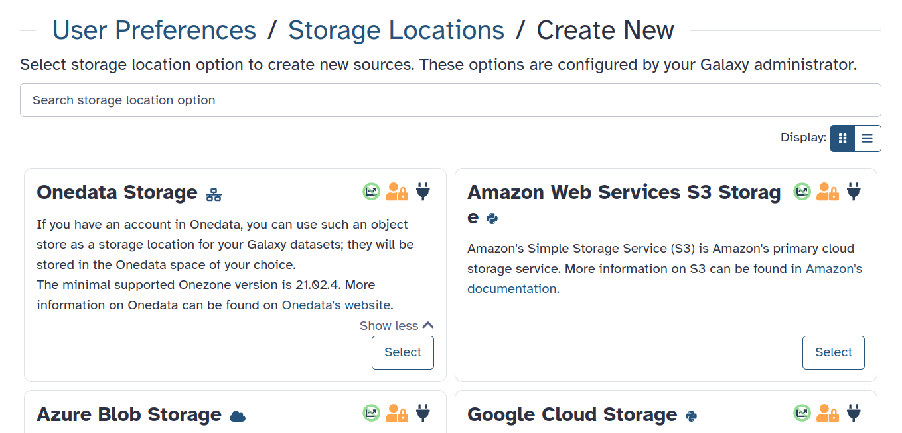
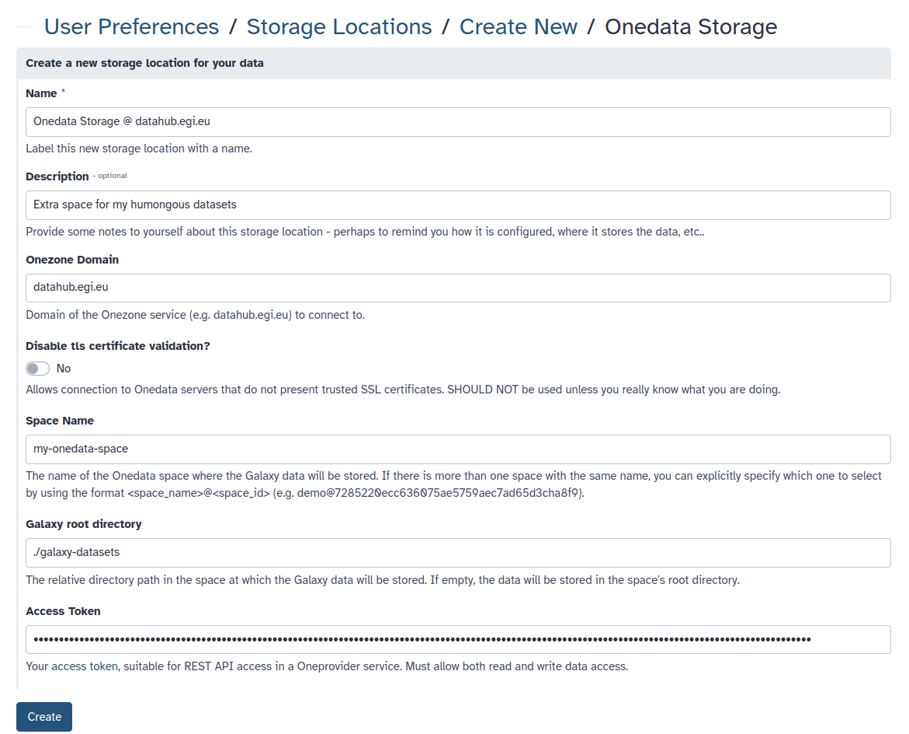
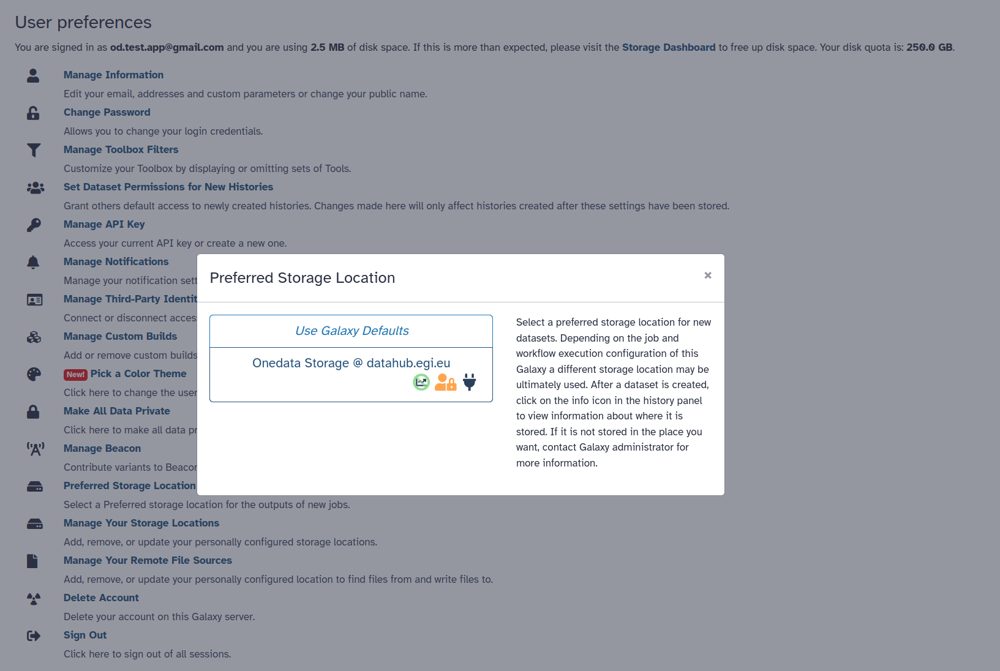

FIXME Is there a better location for this tutorial than data upload?

> <agenda-title></agenda-title>
>
> 1. TOC
> {:toc}
>
{: .agenda}

# Prerequisites

1. This tutorial assumes that you have basic knowledge about Onedata and access 
   to a Onedata ecosystem. If needed, follow 
   [this tutorial]()
   first!
2. To use Onedata as user-owned storage, you need the **domain** of the
   **Onezone service**, a **Space** name, and a suitable **access token**. The
   relevant guide on how to get them can be found 
   [here](). 
3. The Galaxy server must be properly configured by the admins for the Onedata
   Storage Location (BYOS) templates to be available. 
   [Here]() is the corresponding tutorial.

# Introduction

Your account in Onedata can be used to store your Galaxy datasets, effectively
extending your quota. Onedata then serves as a so-called **Storage Location**,
acting as an **Object Store** for the Galaxy server. Below hands-on tutorial
will help you configure and use a Onedata Storage Location.

> <tip-title>Disambiguation</tip-title>
> While Onedata can be used for both, a **Storage Location** is not the same as
> a **Remote File Source**. In this tutorial, you will be setting up a
> Onedata-based **Storage Location**, which allows storing your Galaxy datasets
> directly in a Onedata space in a transparent way. If you are looking to use a
> Remote File Source, refer to 
> [this tutorial]().
{: .tip}

# Configuration

Follow these steps:

1. Log in to your Galaxy account.
2. Go to the **Manage Your Storage Locations** section of the **Preferences** menu.
3. Click **Create** in the top right corner to create a new Storage Location.
   
4. Choose the **Onedata Storage** template. If there is no such template, the 
   Galaxy server is not configured to support it. Consider contacting its admins.
5. Fill in the information, following the hints visible on the form.
   
6. Click **Create** to finalize.

You have now configured a new Storage Location, but you still need to tell
Galaxy your preferences so that it is effectively used among different available
options:

1. Go to the **Preferred Storage Location** section of the **Preferences** menu.
2. Choose the newly added Storage Location:
   

# See it in action

Upload some new data to Galaxy, or run a workflow to produce results. Then
navigate to your Onedata account (e.g. [https://datahub.egi.eu](https://datahub.egi.eu))
and open the Space (and the path) that you have put down in the config. You
should see the newly created Galaxy datasets:

FIXME screenshot with a populated space (Onedata UI).
