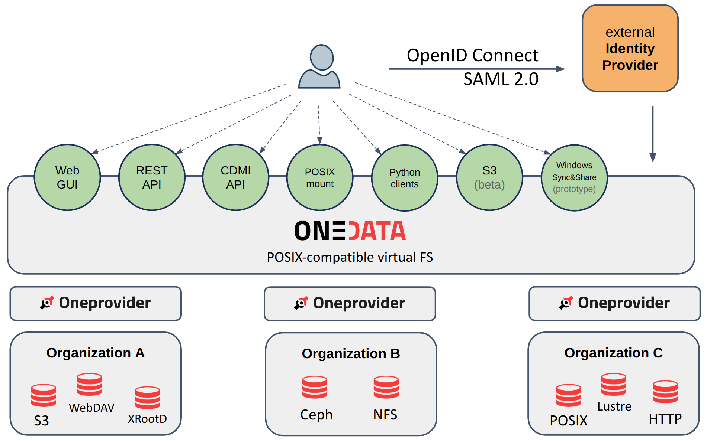
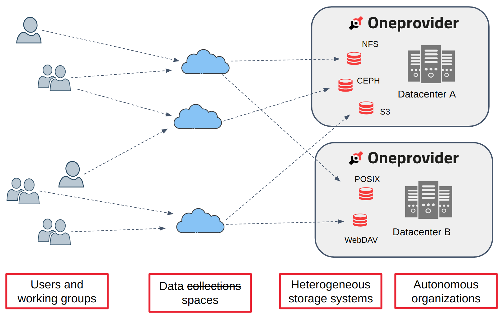

FIXME: how to improve the images so that they display nicely?

> <agenda-title></agenda-title>
>
> 1. TOC
> {:toc}
>
{: .agenda}

# Introduction to Onedata

Onedata ([https://onedata.org](https://onedata.org)) is a data management platform that
provides easy and unified access to globally distributed storage resources, supporting a
wide range of use cases from personal data management to data-intensive scientific
computations. It is an [open-source project](https://github.com/onedata), started in 2013,
and implemented by the team from the Cyfronet Computing Center in Krakow, Poland. 

Onedata creates a virtual file system layer spanning geographically dispersed computing
centers and data providers that host heterogeneous storage resources. The virtual file
system is POSIX-compatible and based on a classic structure of directories and files. The
virtualized data can be access using multiple interfaces: Web GUI, REST API, CDMI API,
fuse-based POSIX mount, Pythonic libraries, or S3. Regardless of the interface, the user
gets the same, unified view of all his data.



Onedata uses the concept of **Spaces** for data organization. A **Space** is a logical
data volume that appears as a monolithic file system from the user’s PoV. Still, it
virtualizes the physical data stored on distributed storage systems of different data
providers. Spaces facilitate collaborative data sharing between users and groups across
organizational domains — using the Onedata interfaces, users can manage and access the
data together in a unified namespace, while it is physically distributed. 



Similarly to the Galaxy project, The Onedata software can be used to build different
ecosystems. Each Onedata ecosystem constitutes an independent data management platform, 
made up of multiple data centers. One of the flagship examples is 
[EGI DataHub](https://datahub.egi.eu), a Europe-wide ecosystem bringing together 17
data sites (as of 03-2025) and catering for many scientific projects around Europe.

For more information about Onedata, see the 
[Documentation](https://onedata.org/#/home/documentation) and 
[API reference](https://onedata.org/#/home/api).


# Onedata & Galaxy integration

Thanks to the efforts undertaken in the
[EuroScienceGateway](https://galaxyproject.org/projects/esg/) project, Galaxy
now offers integration with Onedata. It can be used as 
a **remote source for data import/export** (a.k.a. Files Source Plugin) and as 
a **storage backend for Galaxy datasets** (an Object Store). 
The integration includes **BYOS** (Bring Your Own Storage) and 
**BYOD** (Bring Your Own Data) templates.

Minimal requirements:
- **Galaxy**: version **24.2**
- **Onedata**: version **21.02.5** (but it's recommended to use at least **21.02.8**)

It is possible to connect multiple Onedata accounts in different Onedata
ecosystems to the same Galaxy account.


# Accessing Onedata services

FIXME you need access to a Onezone service. Your organization may already
have a Onedata ecosystem, e.g. https://datahub.egi.eu.

FIXME link to onedata-documentation: https://onedata.org/#/home/documentation/21.02/user-guide/quickstart.html
FIXME rework the above documentation to use demo.onedata.org, where you can log in
and automatically get access to the Sandbox space.
FIXME add to the quickstart a short guide how to create a directory in Sandbox
and set ACLs to only allow yourself in.

FIXME link here the tutorial onedata-dev-instance as the last option, for devs.
  remember to set the disable TLS option everywhere!

FIXME choosing a Onedata Space. You can choose the Sandbox, or maybe you already have
a Onedata space.

## Access tokens

FIXME link to onedata documentation as much as possible. Need instructions
to get a token suitable for Oneprovider REST API access. Comment that the
token should not be readonly, unless your want a readonly Remote File Source.


# Troubleshooting

In case you are getting errors when interacting with a Onedata 
remote source or storage location, go through the below checklist:

1. Make sure the Onezone domain is correct — open it in your Web browser to double-check.
2. Log in to the Onezone service and check if there is any service outage or 
   disrupted data providers — if so, you must wait for these problems to be solved. If not,
   you should assume the problem lies in the configuration of the Galaxy server or your
   user preferences.
3. Make sure the token you provided is suitable for REST API access in a Oneprovider
   service. Consult the [access tokens](#access-tokens) section for a guide. 
4. Make sure the token allows access to at least one Onedata Space in at least
   one provider. Caveats (contextual confinements) may be limiting the
   access token scope.
5. If you are familiar with command-line, you may perform basic diagnostics on the
   token like this:
   ```bash
   curl -d '{"token": "'$TOKEN'"}' -H 'Content-type: application/json' \                                                                              130 ↵
        https://$ONEZONE_DOMAIN/api/v3/onezone/tokens/infer_access_token_scope | jq
   ```
   ```json
   {
     "validUntil": null,
     "dataAccessScope": {
       "spaces": {
         "d67622d2a0999be9b9b1e6e18c14c697chbfa6": {
           "supports": {
             "42a2fb7993b8331aa107ff819101b0f1chb73a": {
               "readonly": false
             }
           },
           "name": "space-alpha"
         },
       "readonly": false,
       "providers": {
         "42a2fb7993b8331aa107ff819101b0f1chb73a": {
           "version": "21.02.8",
           "online": true,
           "name": "My provider",
           "domain": "my-provider.example.com"
         }
       }
     }
   }
   ```
   If there is at least one entry both in `spaces` and `providers`, and at least one of
   the providers is online, the token is viable. If not, you should see point 2) or
   consider creating a token with fewer confinements.
6. If you are a Dev/Admin, check the Galaxy logs for hints.

FIXME link to this troubleshooting from different tutorials.


# Related tutorials

Learn more how to make use of the Galaxy & Onedata integration:

| Audience         | Topic                                                                                                                                            |
| ---------------  | -------------------                                                                                                                              |
| User             | [Importing (uploading) data from Onedata]()                                  |
| User             | [Exporting to Onedata remote]()                                  |
| User             | [Onedata user-owned storage]()                                            |
| Admin            | [Configuring the Onedata integration (remotes, Object Store, BYOS, BYOD)]() |
| Developer        | [Setting up a dev Onedata instance]()                                          |
