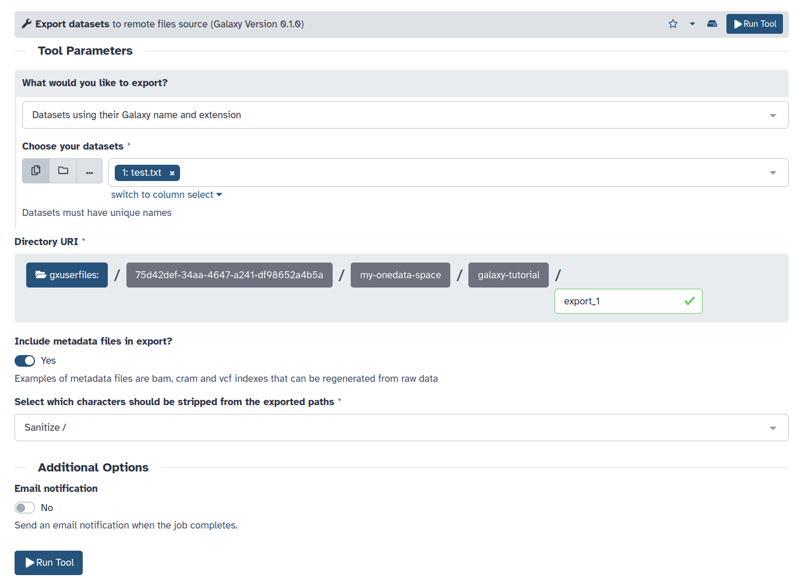

# Prerequisites

1. This tutorial assumes that you have basic knowledge about Onedata and access 
   to a Onedata ecosystem. If needed, follow 
   [this tutorial]()
   first!
2. To use Onedata as a remote file source for data export, you need the
   **domain** of the **Onezone service** and a suitable **access token**. The
   relevant guide on how to get them can be found 
   [here](). 
3. The Galaxy server must be properly configured by the admins for the Onedata
   remote and/or Onedata BYOD templates to be available. 
   [Here]() is the corresponding tutorial.

# Introduction

Onedata Remote File Source can be configured as writable. In such a case, you
can export your Galaxy datasets to a Onedata space.

# Configuration

Follow the same steps as in the 
[Importing (uploading) data from Onedata]()
tutorial to configure a Onedata Remote File Source.

Make sure that the Remote File Source is writable. In case of you own,
it's as simple as checking the toggle in the configuration. In case of
generic remotes, it's in the hands of admins to mark the Onedata remote
as writable.

# Exporting datasets

Follow these steps:

1. Find the **Export datasets to remote files source** tool in the toolbox.
2. Choose the dataset to be exported and choose your Onedata Remote File Source
   in the **Directory URI** section.
   
3. Adjust the configuration if needed.
4. Run the tool.
5. Check your Onedata account to find the exported dataset at the specified path.

# Troubleshooting

In case of errors:

1. Check the section **Use distributed compute resources** in the
   **Manage Information** section of the **Preferences** menu. It's
   possible that the specific Pulsar endpoint is unable to run the
   job. Try using the default settings.
2. Avoid whitespace characters (spaces, tabs) in the **Directory URI**,
   as they are known to cause problems.