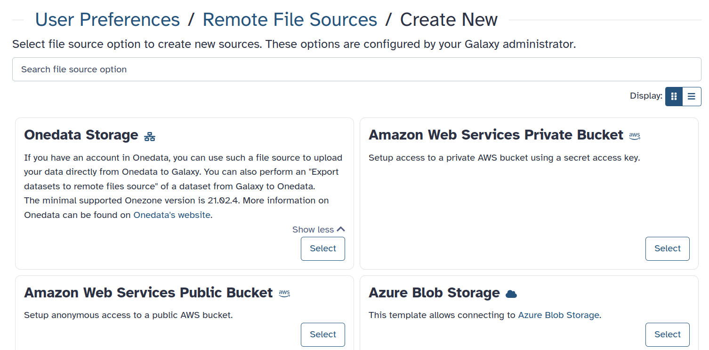
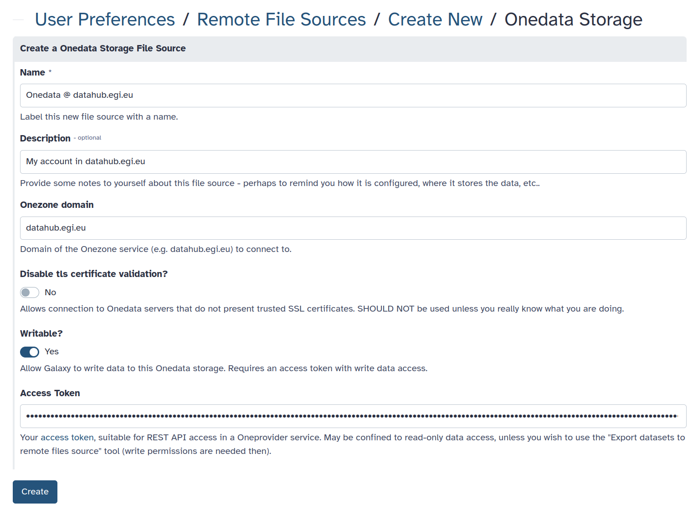
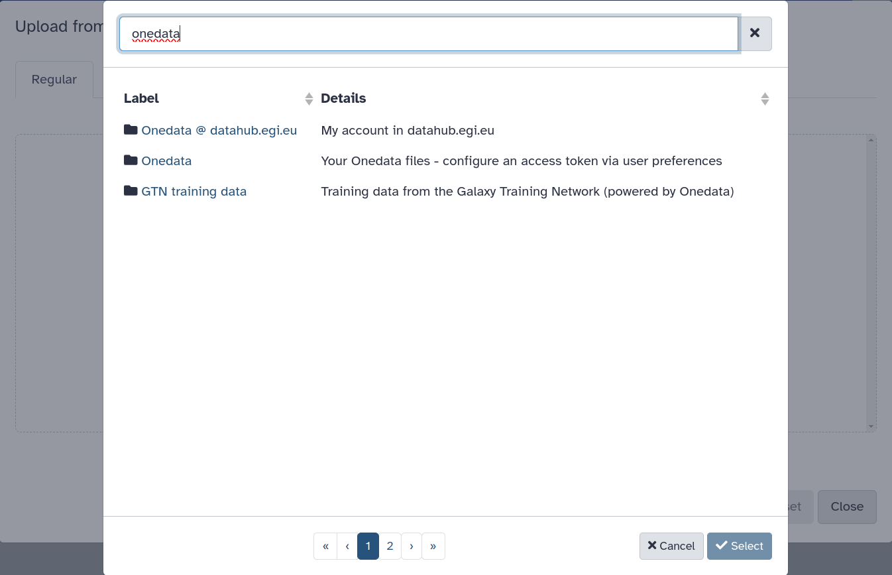
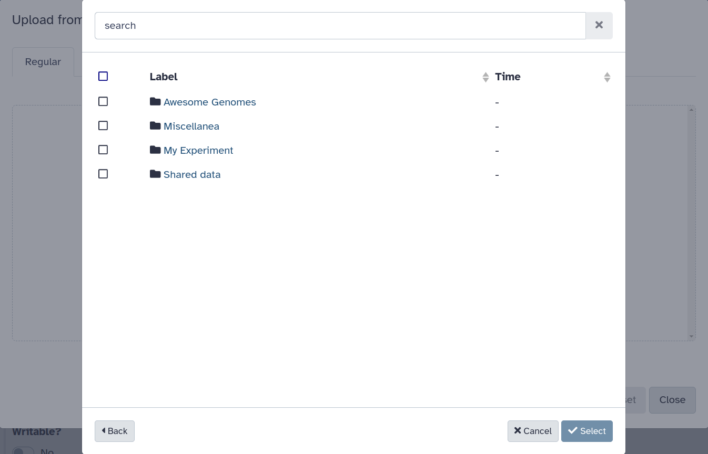
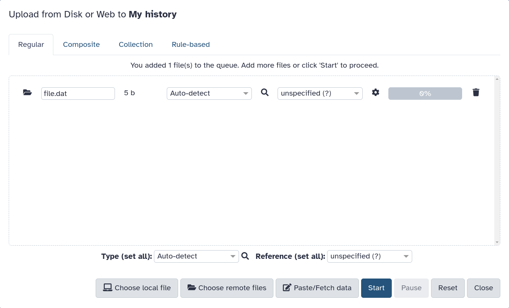

<!-- FIXME consider using {: .hands-on} sections -->
<!-- FIXME image showing the Onedata/Galaxy UIs -->

> <agenda-title></agenda-title>
>
> 1. TOC
> {:toc}
>
{: .agenda}

# Prerequisites

1. This tutorial assumes that you have basic knowledge about Onedata and access 
   to a Onedata ecosystem. If needed, follow 
   [this tutorial]()
   first!
2. To use Onedata as a remote file source for data import, you need the
   **domain** of the **Onezone service** and a suitable **access token**. The
   relevant guide on how to get them can be found 
   [here](). 
3. The Galaxy server must be properly configured by the admins for the Onedata
   remote and/or Onedata BYOD templates to be available. 
   [Here]() is the corresponding tutorial.

# Introduction

You may import the data stored in Onedata into Galaxy (also referred to as data
upload). There are two ways how to do that; either use the Bring Your Own Data
feature to configure your own **Remote File Sources** (recommended), or use the
ones configured by Galaxy admins (if applicable). Below hands-on tutorials cover
both scenarios.

> <tip-title>Disambiguation</tip-title>
> While Onedata can be used for both, a **Remote File Source** is not the same
> as a **Storage Location**. In this tutorial, you will be setting up a
> Onedata-based **Remote File Source**, which allows importing (uploading) data
> to Galaxy and exporting it from Galaxy. If you are looking to use a Storage
> Location, refer to 
> [this tutorial]().
{: .tip}

# Configuration

## Configure your own Onedata Remote File Source

Follow these steps:

1. Log in to your Galaxy account.
2. Go to the **Manage Your Remote File Sources** section of the **Preferences** menu.
3. Click **Create** in the top right corner to create a new Remote File Source.
   
4. Choose the **Onedata Storage** template. If there is no such template, the 
   Galaxy server is not configured to support it. Consider contacting its admins.
5. Fill in the information. If you wish to perform exports to this remote, check
   the **Writable?** toggle and make sure that your Onedata access token is write-enabled.
   
6. Click **Create** and it's done! You can now [use the Onedata remote](#importing-data).

## Configure a generic Onedata remote

This option may be viable if it's not possible to configure your own 
[Onedata Remote File Source](#configure-your-own-onedata-remote-file-source),
but requires that a generic remote is available on your Galaxy server.

Follow these steps:
1. Log in to your Galaxy account.
2. Go to the **Manage information** section of the **Preferences** menu.
3. Find the section called **"Your Onedata account"** and fill in the information:
   .
   If there is no such section, the Galaxy server is not configured to support it. 
   Consider contacting its admins.
4. Done! You can now [use the Onedata remote](#importing-uploading-data).

# Importing (uploading) data

Uploading data to Galaxy from Onedata:

1. Navigate to the **Upload** menu, use the **Choose remote files** action, and find the 
   **Onedata** remote. There may be more than one if you configured it so: 
   
2. At the top level of the file browser, you will see all the Onedata spaces that are
   accessible with the access token that was put down in preferences. You can browse
   through them and select the files that should be imported to Galaxy.
   
3. After selecting the files, confirm with **Select**.
4. In the main upload menu, if you are happy with the queued files, click **Start**.
   
5. You may have to wait a bit until your uploads are processed.

## Using the preconfigured remotes

You may also use Onedata-based remotes that were predefined by Galaxy admins for
public use (if applicable on your Galaxy instance). Note the **GTN training data**
on the [screenshot](#importing-uploading-data).

Since the GTN training data comes with a public access token, you may also configure
it as your own or generic Remote File Source. Use the following credentials:

* **Onezone domain**: `datahub.egi.eu`
* **Access token**: `MDAxY2xvY2F00aW9uIGRhdGFodWIuZWdpLmV1CjAwNmJpZGVudGlmaWVyIDIvbm1kL3Vzci00yNmI4ZTZiMDlkNDdjNGFkN2E3NTU00YzgzOGE3MjgyY2NoNTNhNS9hY3QvMGJiZmY1NWU4NDRiMWJjZGEwNmFlODViM2JmYmRhNjRjaDU00YjYKMDAxNmNpZCBkYXRhLnJlYWRvbmx5CjAwNDljaWQgZGF00YS5wYXRoID00gTHpaa1pUTTROMkl4WmpjMllXVmpOMlU00WWpreU5XWmtNV00ZpT1RKbU1ETXlZMmhoWTJReAowMDJmc2lnbmF00dXJlIIQvnXp01Oey02LnaNwEkFJAyArzhHN8SlXSYFsBbSkqdqCg`

This token is read-only, so make sure to mark the remote as not writable.

# Related topics

The Onedata Remote file source can also be used for data export — see the 
[tutorial]().
