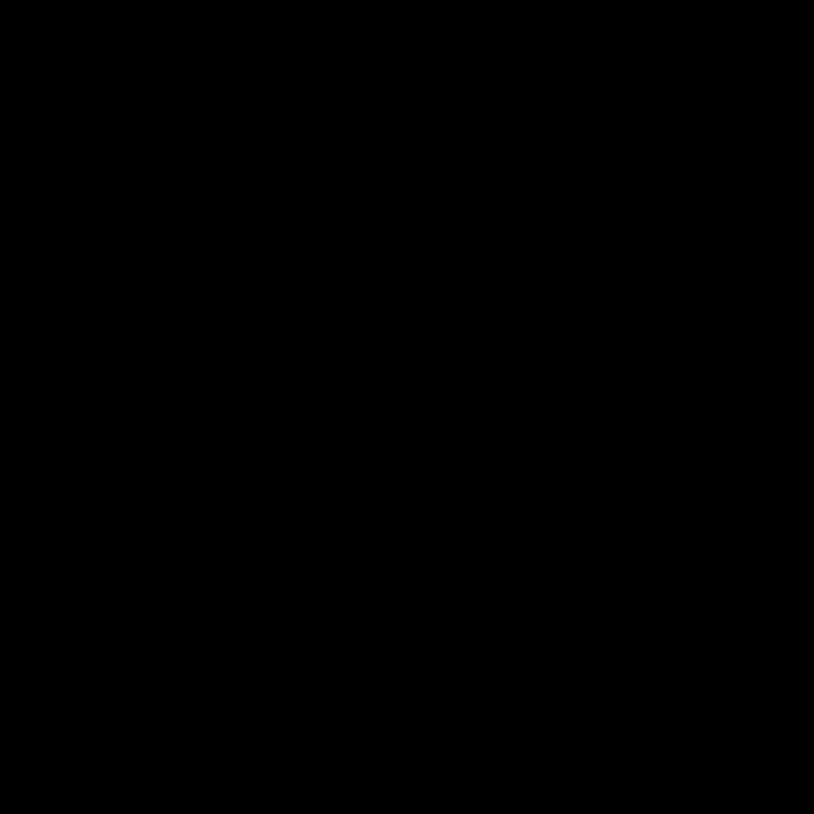
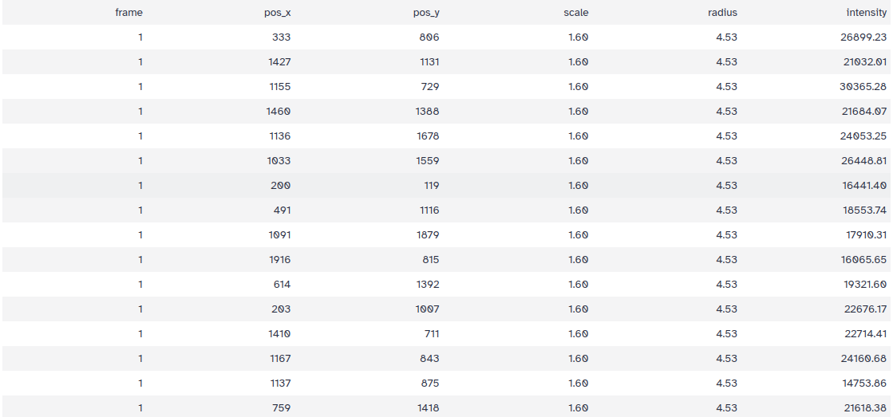
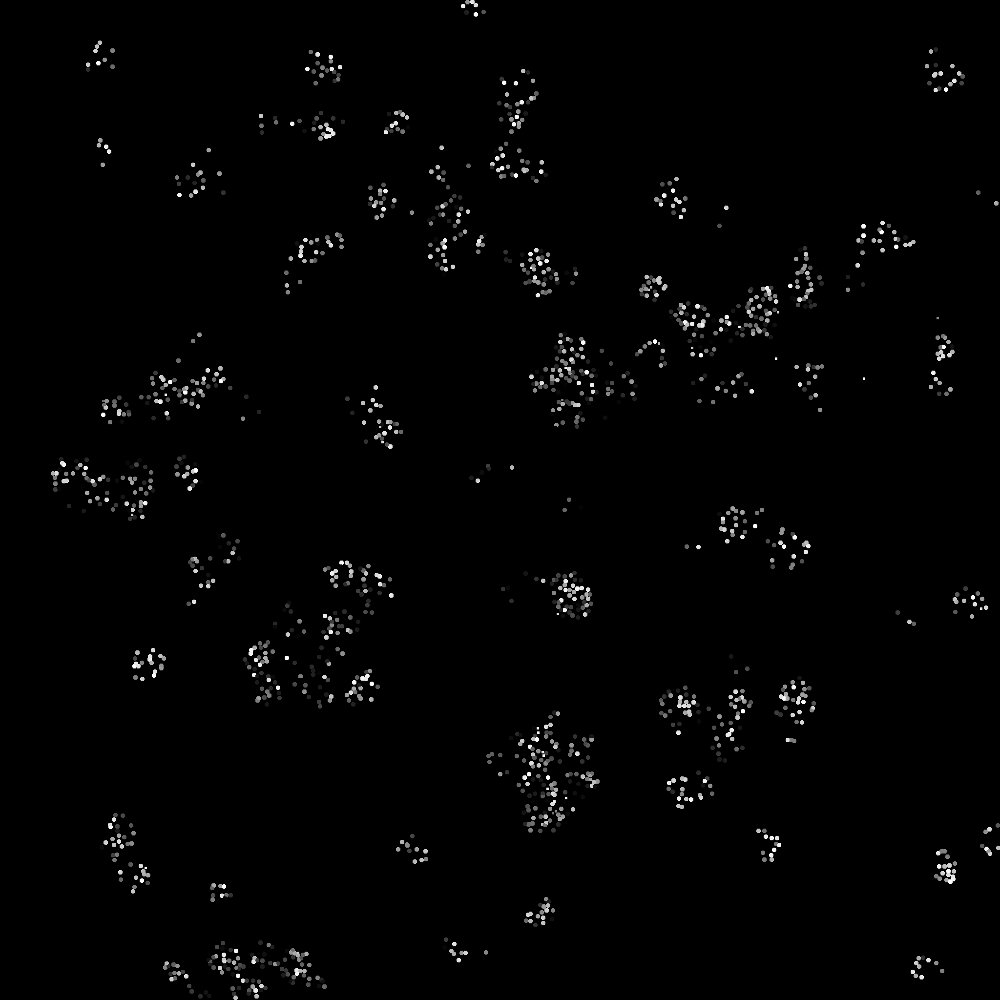
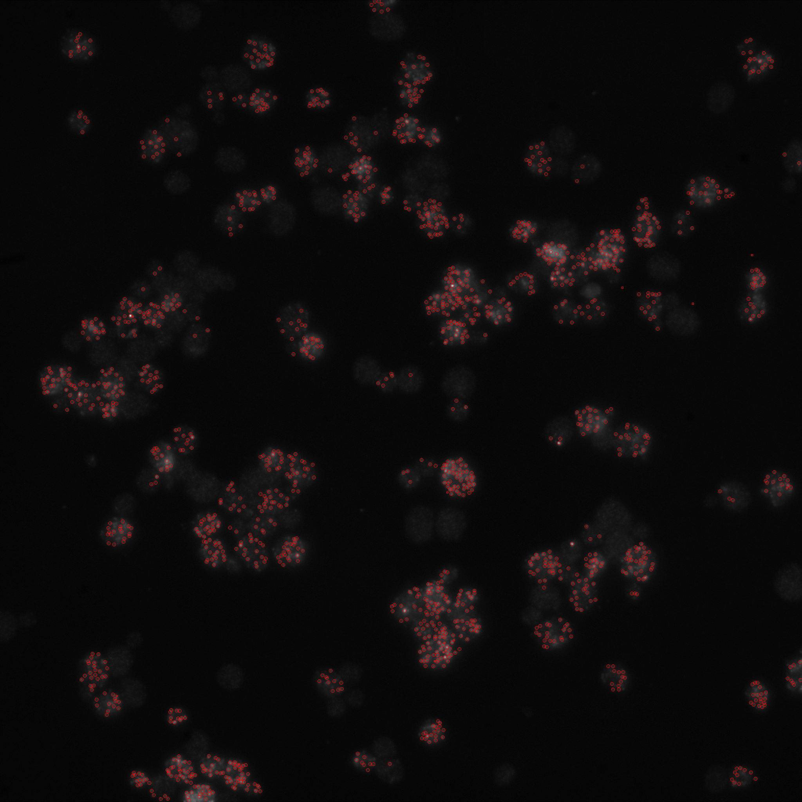
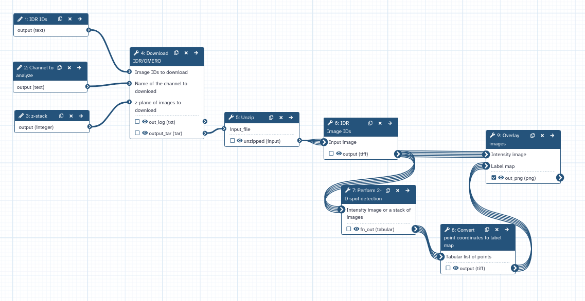

The objective is to detect multiple bright spots in an image using a basic computer vision and image processing 
technique for identification and localization of regions 
of high intensity within an image. 
These spots often correspond to features of interest, such as fluorescent markers 
in biological imaging.
Such an approach can be beneficial in 
single-cell/single-molecule imaging experiments, such as RNA single-molecule
fluorescence in situ hybridization (smFISH), as these experiments can resolve the 
spatial and temporal distribution of individual RNA molecules with high resolution. 

In this tutorial, we will try to identify RNA molecules in yeast cell lines. However,
such an approach can be re-used for the identification of any fluorescence spots in biological 
images!

> <agenda-title></agenda-title>
>
> In this tutorial, we will deal with:
>
> 1. TOC
> {:toc}
>
{: .agenda}

# Get data from IDR

The testing dataset for this tutorial can be obtained from the [Image Data Repository (IDR)](https://idr.openmicroscopy.org/). 
This dataset was published by [Li et al. (2019) in Scientific Data](https://www.nature.com/articles/s41597-019-0106-6).

In this publication, the authors used  smFISH to quantify the kinetic expression of STL1 and CTT1 mRNAs in single Saccharomyces cerevisiae
cells upon NaCl osmotic stress.

Let's fetch this **FAIR** dataset using a Galaxy Tool! We will download the channel 5-TMR 
and selected the 10th z-stack for analysis.

> <hands-on-title>Download images from the IDR</hands-on-title>
>
> 1. If you are logged in, create a new history for this tutorial.
>
>    
> 2. **IDR Download**  with the following parameters:
>    - *"How would you like to specify the IDs of images to download?"*: `As text (comma-separated list of IDs or a valid IDR link)`
>    -  *"Image IDs to download"*: `4496770`
>    -  *"Which Images do you want to download": `Exported TIFF (single channel, single stack)`
>    -  *"Name of the channel to download"*: `5-TMR`
>    -  *"z-plane of images to download"*: `10`
>    -  *"Image frame to download"*: `0`
>    -  *"Limit the download to a selected region of the image?"*: `No, download the entire image plane`
>    -  *"Skip failed retrievals?"*: `No`
>    -  *"Download images in a tarball?"*: `No`
> 3. Rename  the generated file to `RNA_input`.
{: .hands_on}

# Improve image contrast 

When inspecting the image visually, we get the impression that the image is entirely black:

{: width="75%"}

It's not the best quality for a first visual inspection!

As described in the [Galaxy Imaging Introduction Tutorial](), the original image is 16-bit and the intensity values are spread
over a very small fraction of the range of intensity values that can be represented using 16 bits.

Therefore, for improved visibility the intensity histogram of the image can be normalized first.

We will normalize the histogram to improve the contrast. 
We do this using a [Contrast Limited Adaptive Histogram Equalization (CLAHE)](https://en.wikipedia.org/wiki/Adaptive_histogram_equalization) approach.

> <hands-on-title>Normalize Histogram</hands-on-title>
>
> 1.  with the following parameters to normalize the histogram of the image:
>    -  *"Input image"*: `RNA_input.tif` file
>    - *"Histogram equalization algorithm"*: `CLAHE`
> 2. Rename  the generated file to `RNA_input_normalized`.
> 3. Click on the **visualise icon**  of the file to visually inspect the image using the **Tiff Viewer** visualization plugin.
{: .hands_on}

Your image should now look a bit brighter:

{: width="75%"}

We can now clearly make out the presence of many RNA spots!

# RNA spots detection

We can now try to detect blobs and measure their intensity... Let's run a specific tool for this!

> <hands-on-title>Perform 2-D spot detection</hands-on-title>
>
> 1.  with the following parameters to detect the 2D spots:
>    -  *"Intensity image or a stack of images"*: `RNA_input_normalized.tif` file
>    - *"Starting time point (1 for the first frame of the stack) "*: `1`
>    - *"Ending time point (0 for the last frame of the stack)"*: `0`
>    - *"Detection filter"*: `Laplacian of Gaussian`
>    - *"Minimum scale"*: `1`
>    - *"Maximum scale"*: `2`
>    - *"Minimum filter response (absolute)"*: `0.25`
>    - *"Minimum filter response (relative)"*: `0`
>    - *"Image boundary"*: `10`
> 2. Rename  the generated file to `RNA_spot_detected`.
{: .hands_on}

The tool produces a TSV file containing all detections, with the following columns:

- **frame**: The frame of the image stack
- **pos_x**: The horizontal coordinate of the detection
- **pos_y**: The vertical coordinate of the detection
- **scale**: The scale at which the detection was found
- **radius**: The radius of the detected spot
- **intensity**: The mean intensity of the spot

The TSV output will have 1649 lines, meaning 1649 spots detected!

# Convert spots coordinates to labels
Let's try now to visualize our results! The first step is to create a label map from the TSV file...
This can be nicely done by converting the point coordinates to a label map and we have a tool for it!

Please notice that the width and height of the image are necessary inputs to corretly overlay
the label map in the next step! 
You can get these info by running the "Show image info" tool on the original image!

> <hands-on-title>Create the label map from the points coordinates</hands-on-title>
>
> 1.  with the following parameters to detect the 2D spots:
>    -  *"Tabular list of points"*: `RNA_spot_detected.tsv` file
>    - *"Width of output image"*: `2048`
>    - *"Height of output image "*: `2048`
>    - *"Tabular list of points has header"*: `Yes`
>    - *"Swap X and Y coordinates"*: `No`
>    - *"Produce binary image"*: `No`
> 2. Rename  the generated file to `RNA_labels`.
> 3. Click on the **visualise icon**  of the file to visually inspect the image using the **Tiff Viewer** visualization plugin.
{: .hands_on}

A label image will be created... If you want to visualize the labels, you can run again the normalize histogram
step:

{: width="75%"}

but this is not necessary for the next and final step: overlay the label to the original image!

# Overlay labels to the original image

Results can be overlayed with the original image.

> <hands-on-title>Segment image</hands-on-title>
>
> 1.  with the following parameters to convert the image to PNG:
>    - *"Type of the overlay"*: `Segmentation contours over image`
>    -  *"Intensity image"*: `RNA_input_normalized.tif` file
>    -  *"Label map"*: `RNA_labels.tif` file (output of )
>    - *"Contour thickness"*: `1`
>    - *"Contour color"*: `red`
>    - *"Show labels"*: `No`
>    - *"Label color"*: `yellow`
{: .hands_on}

Final result should look like this:

{: width="75%"}

# Create 2D spot detection workflow

The full workflow can now be created! 

Since you are probably going to
run it on several images fetched from IDR we suggest changing the 
setting of the IDR Download tool by downloading imaging in a tarball:

> <hands-on-title>Create the workflow for 2D spot detection</hands-on-title>
>
>    - Name it "2D_spot_detection".
>    - Change *"Download images in a tarball?"*: `Yes` in the **IDR Download**  tool
>    - Include the 
>    - Connect the output of  **4: Download IDR/OMERO** to the "input_file"
>   input of  **5: Unzip**.
>    - Connect the output of  **4: Unzip** to the "Input Image"
>   input of  **6: Perform histogram equalization**.
> 1. Edit the workflow you just created:
>    - Select "Input dataset" from the list of tools. The step  **1: Input Dataset** appears.
>    - Select "Text Input" from the list of tools. The step  **2: Text Input** appears.
>    - Select "Integer Input" from the list of tools. The step  **3: Integer Input** appears.
>    - Change the "Label" of  **1: Input Dataset** to `IDR IDs`.
>    - Change the "Label" of  **2: Text Input** to `Channel selection`.
>    - Change the "Label" of  **3: Integer Input** to `z-stack selection`.
>    - Connect the output of  **1: Input Dataset** to the "Image IDs to download" input of  **4: Download IDR/OMERO**.
>    - Connect the output of  **2: Text Input** to the "Name of the channel to download" input of  **4: Download IDR/OMERO**.
>    - Connect the output of  **3: Integer Input** to the "z-plane of images to download" input of  **4: Download IDR/OMERO**.
>    - Mark the results of  **7: Perform 2-D spot detection** and  **9: Overlay images** as the primary outputs of the workflow (by clicking on the checkboxes of the outputs).
{: .hands_on}

The final workflow should look like this:

# Conclusion

In this exercise, you imported images into Galaxy from IDR, 
detect RNA single molecules using the 2D spot detection tool 
and visualize them on the original intensity image.
Finally, you created a reusable workflow which can be used on a tarball of IDR images.
