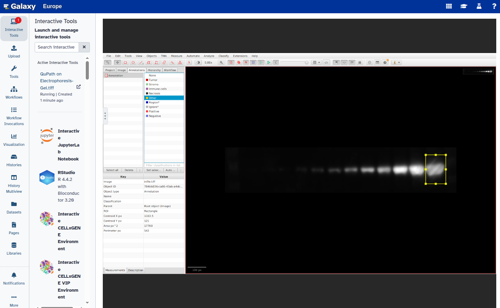
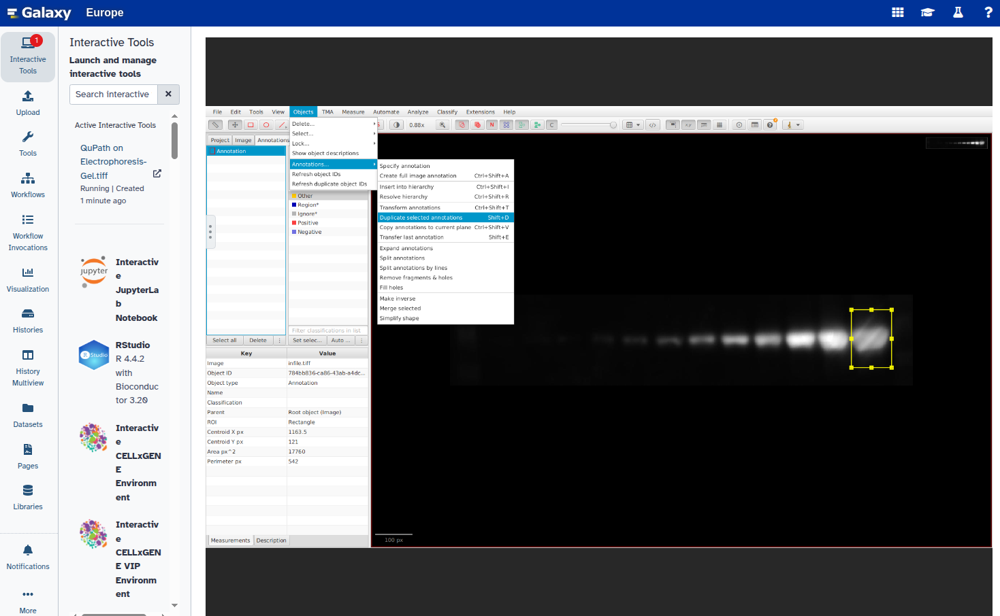
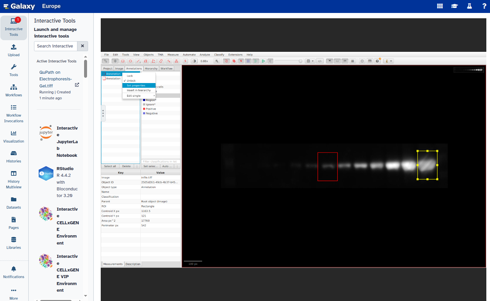
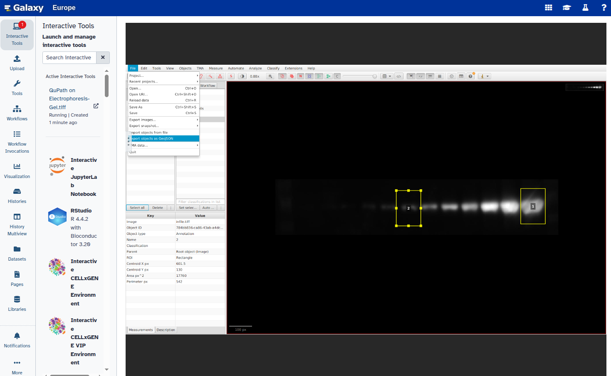

The objective is to detect and quantify bands in an electrophoresis gel image using computer vision and image processing techniques.
This involves identifying regions of interest (bands) and measuring their optical density or pixel intensity. These spots often correspond to features of interest, such as estimate product yield, compare amplification efficiency between samples, molecular weight or to assess expression level or other biochemical properties.These bands often correspond to DNA, RNA, or protein fragments of interest, separated by size or charge during electrophoresis. Accurate quantification is critical for applications such as gene expression analysis, PCR product validation, kinetics of enzyme assay and protein purity assessment.
In this tutorial, we will try to quantify the  bonds on electrophoresis gel image. At the first step the specific bands was selected as ROI and labeled with QuPath. Then the labeled ROI was quantified and plotted to analysis the intensity.

> <agenda-title></agenda-title>
>
> In this tutorial, we will deal with:
>
> 1. TOC
> {:toc}
>
{: .agenda}

# Upload the image

The testing dataset for this tutorial can be obtained from the [Image.png](https://github.com/galaxyproject/training-material/tree/main/topics/imaging/images/). 
>    
This image was uploaded by [Kenji Ohgane et. al. (2019) in Protocols.io](https://www.protocols.io/view/quantification-of-gel-bands-by-an-image-j-macro-ba-bp2l6n4bkgqe/v1).

In this protocol, the authors used  image J to quantify the gel bands by an Image JMacro, Band/Peack quantification tool. 
Let's upload this **Image** using a Galaxy Tool! We will upload the PNG file

> <hands-on-title>Download images from the training-material</hands-on-title>
>
> 1. If you are logged in, create a new history for this tutorial.
>
>    
> 2. **Image Download** 
> 3. Rename  the generated file to `Electrophoresis-Gel`.
{: .hands_on}

## Upload the image

Upload the image that you downloaded:

> <hands-on-title>Upload the image</hands-on-title>
>
> 1. Click ** Upload Data** at the top of the tool panel.
> 2. Select ** Choose local files**.
> 3. Select the downloaded image.
> 4. Press **Start**.
> 5. Close the window.

## Rename the uploaded image

To rename an uploaded image in your history:

> <hands-on-title>Rename the dataset</hands-on-title>
>
> 1. Locate the uploaded image in your **History** panel.
> 2. Click on the  **pencil icon** (edit attributes) next to the dataset name.
> 3. In the dialog box, enter a new name (e.g., `Electrophoresis-Gel.jpg`) in the **Name** field.
> 4. Click **Save** to apply the changes.

## Convert the image format

Electrophoresis images are typically saved in JPG format. In this step, we'll convert the image to TIFF format, which is required for proper processing in subsequent analysis steps.

> **Note:** If your image is already in TIFF format, you can safely skip this step.

> <hands-on-title>Convert the image format</hands-on-title>
> 1.  with the following parameters:
>    -  *"Image to convert"*: Select your uploaded `Electrophoresis-Gel.jpg` file
>    - *"Output format"*: Select `TIFF` from the dropdown menu
> 2.  **Rename** the output file to `Electrophoresis-Gel.tiff` for consistency.

> <comment-title>Why TIFF format?</comment-title>
> The TIFF format is required for the following reasons:
> - Preserves all image data without quality loss (unlike JPG compression)
> - Maintains higher bit-depth for accurate analysis
> - Is the accepted format for all downstream image processing steps in this workflow
> - Supports metadata storage for scientific reproducibility

## Get the image information

The image width and height are necessary parameters for further processing steps. In this step, we'll retrieve the image metadata.

> <hands-on-title>Obtain image information</hands-on-title>
> 1.  with the following parameters:
>    -  *"Image Input"*: Select your uploaded `Electrophoresis-Gel.tiff` file

## Get the image information

In this step, the image is split along a specific axis, yielding a collection of images. This operation converts a multi-channel image into a collection of single-channel images, which are required for subsequent processing steps.

> <hands-on-title>Split image into single channels</hands-on-title>
> 1.  with the following parameters:
>    -  *"Image to split"*: Select your uploaded `Electrophoresis-Gel.tiff` file
>    - *"Axis to split along"*: Select `C-axis (split the channels of an image or image sequence)` from the dropdown menu
`
## Prepare the ROI file with QuPath

In this step, you will select regions of interest (ROIs) on your image and export them as a GeoJSON file using QuPath's interactive tool.

> <hands-on-title>Select ROIs and export GeoJSON file</hands-on-title>
> 
> 1. Set image type to "Other":
>    
> 
> 2. Select the rectangle tool from the toolbar:
>    
> 
> 3. Draw a rectangle around your first band of interest:
>    
> 
> 4. Open the Annotations panel:
>    
> 
> 5. Double-click the rectangle annotation and set its type to "Other":
>    
> 
> 6. Duplicate the annotation:
>    - Select "Object" → "Annotations" from the toolbar
>    - Choose "Duplicate selected annotations"
>    
> 
> 7. Verify the second rectangle appears in the Annotations panel:
>    
> 
> 8. Select the second rectangle from the Annotations panel:
>    
> 
> 9. Double click and drag the the duplicate rectangle to your second band of interest:
>    
> 
> 10. Repeat steps 6-9 for additional bands as needed
> 
> 11. Set parameters for each annotation:
>     - Select the first rectangle, right-click and choose "Set parameters"
>     - Name it "1"
>     
>     
> 
> 12. Repeat for the second rectangle, naming it "2":
>     
>     
> 
> 13. Verify both rectangles are labeled:
>     
> 
> 14. Select all labeled annotations:
>     
> 
> 15. Export as GeoJSON:
>     - Click "File" → "Export objects as GeoJSON"
>     - Choose "Export as FeatureCollection"
>     - Click "Save"
>     
>     
>     
> 
> 16. Exit QuPath:
>     - Select "File" → "Quit"
>     - Optionally save the image if prompted
>     
>     
> 
> 17. The QuPath outputs collection file will appear in your Galaxy history within 2-3 minutes.

## Extract the GeoJSON File

QuPath outputs results as a collection. We need to extract the GeoJSON file for proper processing in subsequent analysis steps.

> <hands-on-title>Extract the GeoJSON File</hands-on-title>
> 1.  with the following parameters:
>    -  *"Input Collection"*: Select your `QuPath outputs` collection
>    - *"Which part of the Collection?"*: Select the GeoJSON file
> 2.  **Rename** the extracted file to `Bands.geojson` for consistent naming in your workflow.

## Convert Points to a Label Map

In this step, we convert the GeoJSON file containing your band coordinates into a labeled TIFF image map.

> <hands-on-title>Convert Coordinates to Label Map</hands-on-title>
> 1.  with the following parameters:
>    -  *"List of points in tabular or GeoJSON format"*: Select your `Bands.geojson` file
>    - *"Width of output image"*: `1278`(Enter the height value from your  history (result of **Show image info** tool)
>    - *"Height of output image"*: `250`(Enter the height value from your  history (result of **Show image info** tool)
>    - *"Tabular list of points has header"*: `Yes`

## Extract Image Features

In the final step, we quantify each band's intensity measurements.

> <hands-on-title>Extract Band Intensity Features</hands-on-title>
> 1.  with the following parameters:
>    -  *"Label map"*: Select your `Convert coordinates to label map` dataset (output from the previous step)
>    - *"Use the intensity image to compute additional features"*: `Use intensity image`
>    -  *"Intensity image"*: Select your `1.tiff` dataset 
>    - *"Select features to compute"*: `Select features`
>      - ✔️ Check "Label from the label map"
>      - ✔️ Check "Mean Intensity (requires original image)"

## Visualization

You can visualize the tabular output using any of Galaxy's visualization tools according to your analysis needs.

# Conclusion

In this exercise, you:
1. Imported an electrophoresis gel image into Galaxy
2. Selected regions of interest (ROIs) using QuPath
3. Labeled and exported ROIs as a GeoJSON file
4. Quantified each ROI's intensity as tabular data
5. Created a reusable workflow for electrophoresis gel band quantification and analysis
