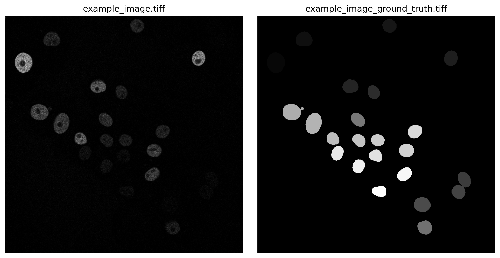
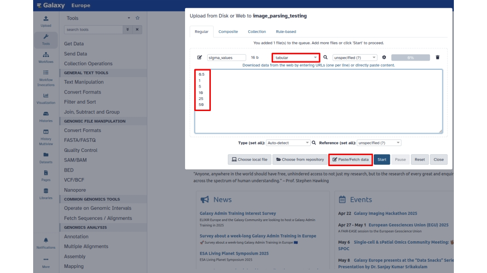
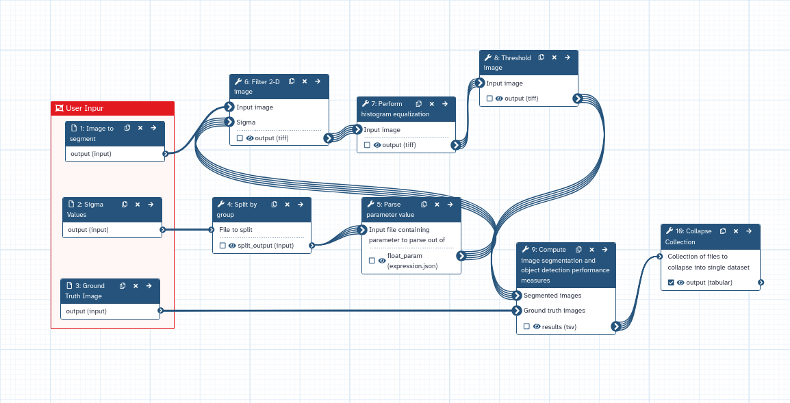
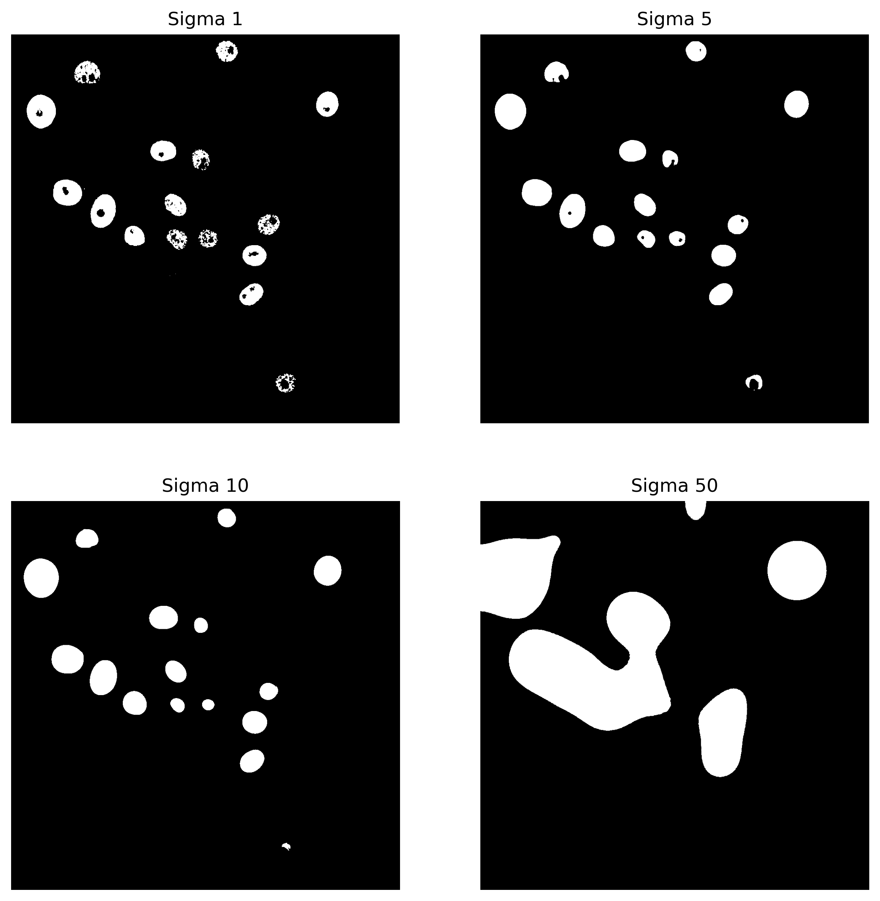
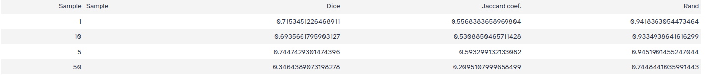

Parameter tuning is super important in image analysis. 
When you're doing image analysis — like segmentation, quantification, or feature extraction — the settings you choose make a big difference in how accurate your results are. 
But biological images can vary strongly in terms of quality, contrast, and structure. 
So you can't just use the same settings for every image. 

That's where parameter tuning comes in. 
By adjusting these settings carefully, researchers can make sure their tools are capturing the right biological info without adding noise or messing up the images. 
This helps make sure their work is repeatable and reliable, which is key for getting accurate scientific results. 
Basically, it's all about finding the perfect balance to get the most useful and accurate data possible.

In this tutorial, we will show how to perform parameter tuning for segmentation. In particular, we will fine-tune a parameter of Gaussian filters for nuclei segmentation by
quantitatively comparing ground-truth segmentation with the ones processed in Galaxy. As a dataset,
we will use GFP-GOWT1 mouse stem cell images, which were acquired from .
The training dataset contains a collection of images plus their ground truth (). The images are
publicly available at the [ISBI Cell Tracking Challenge](https://celltrackingchallenge.net/2d-datasets/) repository.

{: width="50%"}

So, let's proceed!

## Get the image data

> <hands-on-title>Data Upload</hands-on-title>
>
> 1. Create a new history for this tutorial.
>
> 2. Download the following image and import it into your Galaxy history.
>    - [`example_image.tiff`](workflows/test-data/example_image.tiff)
>    - [`example_image_ground_truth.tiff`](workflows/test-data/example_image_ground_truth.tiff)
>    
>    If you are importing the image via URL:
>
>    
>
>    If you are importing the image from the shared data library:
>
>    
>
> 3. Rename the datasets appropriately if needed (e.g. `"original_image"`, `"ground_truth"`)
>
> 4. Confirm the datatypes are correct (`tiff` for both images)
>
>    
> 
>    
{: .hands_on}

## Define a series of values to test

The parameter of Gaussian filters that you are going to tune in this tutorial is *sigma*, that is the size of the filters. You can now input a series of sigma values you want to test. Values need to be imported as a tabular file as
shown in the figure:

Next, copy and paste or manually add the desired values. Additionally, change the file format to `tabular`. Then, rename the file to `sigma_values` and click `Start`.
The dataset will appear now in your history.

You now have everything you need to build the parameter tuning workflow!

## Evaluate nuclei segmentation - Full workflow

> <hands-on-title>Create a workflow to evaluate nuclei segmentation</hands-on-title>
>
> 1. Create a new workflow in the workflow editor.
>
>    
>
> 
> 2. Add three  **Input dataset**:
> -  **1: Input Dataset**,  **2: Input Dataset** and  **3: Input Dataset** will appear in your workflow. 
> Change the "Label" of these inputs to *Dataset to perform segmentation*, *Input ground truth* and *Sigma values to test*
> 2. Add  
> 3. Add  from the list of tools with the following recommended parameters:
>   - **Select type of parameter to parse**: ***Float***
> 4. Add  from the list of tools with the following recommended parameters: 
>    - **Filter Type**: ***Gaussian*** 
>    - **Sigma**: Click the **"Add Connection to Module"** symbol
> 5. Add  from the list of tools with the following recommended parameters:
>    - **Histogram equalization algorithm**: ***CLAHE***
> 6. Add  from the list of tools with the following recommended parameters:
>    - **Thresholding method** : ***Globally Adaptive/Otsu***
>    - **Offset**: 0.0
> 7. Add  from the list of tools with the following recommended parameters:
>    - **Unzip**: ***No***
>    - **Segmentation is uniquely labeled**: ***No***
>    - **Ground truth is uniquely labeled**: ***No***
>    - Performance measure(s):
>      - ***Region-based / Dice***
>      - ***Region-based / Jaccard Coefficent***
>      - ***Region-based / Rand Index***
> 8. Add  from the list of tools with the following recommended parameters:
>    - **Prepend File name**: ***Yes***
>    - **Where to add dataset name**: ***Same line and only once per dataset***
> 9. Connect the following inputs:
>     - Connect the output of  **3: Sigma values to test** to the  *"File to split"*
>     input of  **4: Split by group**.
>     - Connect the output of  **4: Split by group** to the  *"Object ID"*
>     input of  **5: Input file containing parameter to parse out of**. 
>     - Connect the output of  **5: Input file containing parameter to parse out of** to the  *"Sigma"*
>     input of  **6: Filter 2-D image**. 
>     - Connect the output of  **2: Dataset to perform segmentation** to the  *"Input Image"*
>     input of  **6: Filter 2-D image**. 
>     - Connect the output of  **6: Filter 2-D image** to the  *"Input Image"*
>     input of  **7: Perform histogram equalization**. 
>     - Connect the output of  **7: Perform histogram equalization** to the  *"Input Image"*
>     input of  **8: Threshold image**. 
>     - Connect the output of  **8: Threshold image** to the  *"Segmented images"*
>     input of  **9: Compute image segmentation and object detection performance measures**. 
>     - Connect the output of  **2: Input Ground Truth** to the  *"Ground truth images"*
>     input of  **9: Compute image segmentation and object detection performance measures**. 
>     - Connect the output of  **9: Compute image segmentation and object detection performance measures** to the  *"Collection of files to collapse into single dataset"*
>     input of  **10: Collapse Collection**.
{: .hands_on}

This is how the workflow should look like!

In this workflow, the  tool is passing *sigma* values one by one to the workflow downstream. In this way, a collection
of datasets is created for each sigma value and each one is processed individually.
Such strategy can be adapted for any parameter of the workflow and, in general, for any tool.

Coming back to the results, here are the results from segmentation with four different sigmas...

{: width="50%"}

...and below we can see the output of the analysis:

We are comparing three different performance measures region-based segmentation [Dice](https://en.wikipedia.org/wiki/Dice-S%C3%B8rensen_coefficient), 
[Jaccard](https://en.wikipedia.org/wiki/Jaccard_index) and [Rand](https://en.wikipedia.org/wiki/Rand_index).
All three indexes measure the agreement of the predicted segmentation image foreground and
the ground truth image foreground

Overall, the results suggest that as the *sigma* value increases too much,
the coefficient values decrease. Lower *sigma* values result in segmentations 
that more closely match the ground truth, with the highest Dice coefficient of 
0.74 achieved at a *sigma* value of 5.

## Conclusions

In this tutorial, we demonstrate how to test different *sigma* values to 
evaluate segmentation with a ground truth image. 

Overall, the  tool 
can be easily reused for testing other parameters and applied to different workflows.