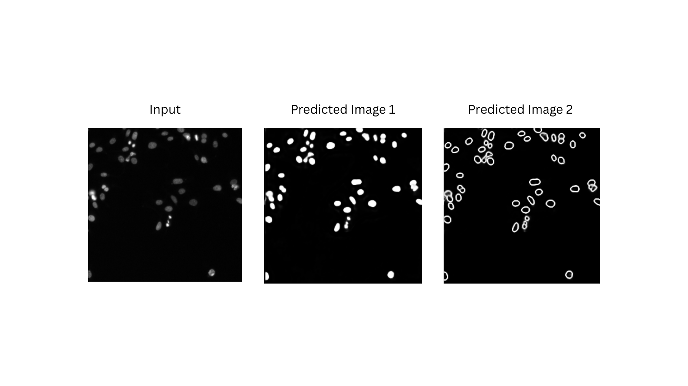

# Introduction

Deep learning models are increasingly used in bioimage analysis to perform processing steps such as segmentation, classification, and restoration tasks (e.g., ). The [BioImage.IO](https://bioimage.io/#/) platform () provides a standardized way to share and discover pre-trained models, making them accessible across tools and platforms.

Each model in BioImage.IO is tailored for a specific biological task — for example, segmenting nuclei, detecting mitochondria, or identifying neuronal structures — and trained on specific imaging modalities such as electron or fluorescence microscopy (e.g., , ).

This tutorial will guide you through the process of applying one of these BioImage.IO models to an input image using Galaxy (). You will learn how to upload and configure the model, set the correct input parameters, and interpret the output files.

⚠️ Currently, only the following 11 PyTorch-based BioImage.IO models are compatible with the Galaxy tool *“Process image using a BioImage.IO model with PyTorch”*:

- PlatynereisEMnucleiSegmentationBoundaryModel.pt
- PlatynereisEMcellsSegmentationBoundaryModel.pt
- livecellsegmentationboundarymodel.pt
- HyLFM-Net-stat.pt
- 3DUNetArabidopsisApicalStemCells.pt
- CovidIFCellSegmentationBoundaryModel.pt
- nucleisegmentationboundarymodel.pt
- HPANucleusSegmentation.pt
- NeuronSegmentationInEM.pt
- HPACellSegmentationModel.pt
- MitochondriaEMSegmentationBoundaryModel.pt

## Available BioImage.IO models in Galaxy

| Model name | Task | Imaging modality | Sample / species | Link |
|------------|------|------------------|------------------|------|
| PlatynereisEMnucleiSegmentationBoundaryModel | Nuclei segmentation | Electron microscopy | Platynereis | [View model](https://bioimage.io/#/?id=platynereisemnucleisegmentationboundarymodel) |
| PlatynereisEMcellsSegmentationBoundaryModel | Cell segmentation | Electron microscopy | Platynereis | [View model](https://bioimage.io/#/?id=platynereisemcellssegmentationboundarymodel) |
| livecellsegmentationboundarymodel | Live cell segmentation | Phase-contrast Microscopy | Various cell types | [View model](https://bioimage.io/#/?id=livecellsegmentationboundarymodel) |
| HyLFM-Net-stat | Light field reconstruction | Light field and Fluorescence light microscopy | Zebrafish | [View model](https://bioimage.io/#/?id=hylfm-net-stat) |
| 3DUNetArabidopsisApicalStemCells | Stem cell segmentation | Confocal / light sheet | Arabidopsis root | [View model](https://bioimage.io/#/?id=3dunetarabidopsisapicalstemcells) |
| CovidIFCellSegmentationBoundaryModel | Cell segmentation | Fluorescence light microscopy | Infected human cells | [View model](https://bioimage.io/#/?id=covidifcellsegmentationboundarymodel) |
| nucleisegmentationboundarymodel | Nucleus segmentation | Fluorescence light microscopy| Generic / various | [View model](https://bioimage.io/#/?id=nucleisegmentationboundarymodel) |
| HPANucleusSegmentation | Nucleus segmentation | Immunofluorescence | Human Protein Atlas | [View model](https://bioimage.io/#/?id=hpanucleussegmentation) |
| NeuronSegmentationInEM | Neuron segmentation | Electron microscopy | Brain tissue | [View model](https://bioimage.io/#/?id=neuronsegmentationinem) |
| HPACellSegmentationModel | Cell segmentation | Immunofluorescence | Human Protein Atlas | [View model](https://bioimage.io/#/?id=hpacellsegmentationmodel) |
| MitochondriaEMSegmentationBoundaryModel | Mitochondria segmentation | Electron microscopy | Human | [View model](https://bioimage.io/#/?id=mitochondriaemsegmentationboundarymodel) |

## Model-specific example

This example illustrates the type of information that is both useful for understanding the model’s biological context and necessary for using the Galaxy tool — specifically, the input axes and input size parameters.

<strong>🧬 NucleiSegmentationBoundaryModel</strong>

This model segments nuclei in fluorescence microscopy images. It predicts boundary maps and foreground probabilities for nucleus segmentation, primarily in images stained with DAPI. The outputs are designed to be post-processed with methods such as Multicut or Watershed to achieve instance-level segmentation.

- **Imaging modality**: Fluorescence microscopy  
- **Task**: Nucleus segmentation (boundary-aware)  
- **Input axes**: `bcyx`  
- **Input size**: `256,256,1,1`  
- **Model link**: [View on BioImage.IO](https://bioimage.io/#/r/ilastik/stardist_dsb_training_data)  
- **Citation**: [10.5281/zenodo.5764893](https://doi.org/10.5281/zenodo.5764893)

> <tip-title> Where to find this information on BioImage.IO </tip-title>
>
> You can find similar details for other models directly on [BioImage.IO](https://bioimage.io) by viewing each model’s card. Look under the “inputs” section of the RDF file to find the required `axes` and `input size` values. These parameters are essential for running the model correctly in Galaxy.
>
{: .tip}

> <agenda-title></agenda-title>
>
> In this tutorial, we will cover:
>
> 1. TOC
> {:toc}
>
{: .agenda}

## Get data

> <hands-on-title> Data Upload </hands-on-title>
>
> 1. Create a new history for this tutorial
>
> 2. Download the following image and import it into your Galaxy history.  
>    For the purpose of this tutorial, we will use one image to test only one of the 11 available models:
>
>    - [`test_image_nuclei.tif`](../../images/process-image-bioimageio/input_nucleisegboundarymodel.png)
>
>    If you are importing the image via URL:
>    
>
>    If you are importing the image from the shared data library:
>    
>
> 3. Rename the datasets appropriately if needed (e.g. `"BioImage.IO model"`, `"Test image"`)
>
> 4. Confirm the datatypes are correct (`pt` for the model, `tiff` or `png` for the image)
>
>    
>
> 5. Import the BioImage.IO model from the Galaxy file repository:
>
>    - Click on **Upload Data**
>    - Go to the **Choose remote files** tab
>    - Navigate to: `ML models` → `bioimaging-models`
>    - Select the desired model file (for this tutorial, choose `nucleisegmentationboundarymodel.pt`)
>    - Click **Import** to add it to your history
>
>    If you are importing the model from the shared data library:
>    
{: .hands_on}

## Run the model on your image

> <hands-on-title> Run BioImage.IO model </hands-on-title>
>
> 1.  with the following parameters:
>    -  *"BioImage.IO model"*: `nucleisegmentationboundarymodel.pt`
>    -  *"Input image"*: `input_nucleisegboundarymodel.png`
>    -  *"Size of the input image"*: `256,256,1,1`
>    -  *"Axes of the input image"*: `bcyx`
>
>    > <comment-title>Axes and size</comment-title>
>    >
>    > You must enter the input size and axes that match the model. This information is provided in the model's RDF file on BioImage.IO.
>    {: .comment}
>
{: .hands_on}

The model will process the input image and generate two outputs:
- A predicted image (`.tif`)
- A predicted tensor matrix (`.npy`)

Below is an example output from the **🧬 NucleiSegmentationBoundaryModel:**

> <question-title> Check your understanding </question-title>
>
> 1. Why do the image axes matter when using a model?
> 2. What happens if the image size does not match the model input?
>
> > <solution-title>Solutions</solution-title>
> >
> > 1. Because deep learning models are trained on specific image shapes and dimensions; mismatches will cause errors or wrong results.
> > 2. The model will fail to run or produce invalid output.
> >
{: .solution}
{: .question}

# Conclusion

In this tutorial, you learned how to run a BioImage.IO model on a biological image using Galaxy. By uploading a compatible model and image, setting the appropriate size and axes, and running the tool, you obtained both a predicted image and a tensor matrix representing the model output.

This provides a fast, reproducible way to apply deep learning models in the context of bioimage analysis — all within Galaxy.
