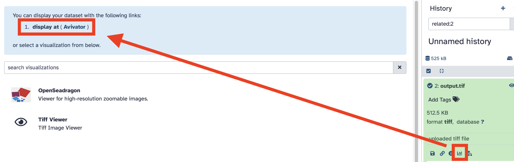
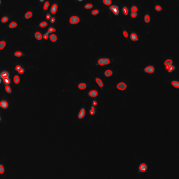

Deep learning models are increasingly used in bioimage analysis to perform processing steps such as segmentation, classification, and restoration tasks (e.g., ). The [BioImage Model Zoo, (BioImage.IO)](https://bioimage.io/#/)() is a repository that provides access to pre-trained AI models, sharing a common metadata model that allows their reuse in different tools and platforms.

Each model in BioImage.IO is tailored for a specific biological task — for example, segmenting nuclei, detecting mitochondria, or identifying neuronal structures — and trained on specific imaging modalities such as electron or fluorescence microscopy (e.g., , ).

This tutorial will guide you through the process of applying one of these BioImage.IO models to an input image using Galaxy (). You will learn how to upload and configure the model, set the correct input parameters, and interpret the output files.

> <agenda-title></agenda-title>
>
> In this tutorial, we will cover:
>
> 1. TOC
> {:toc}
>
{: .agenda}

# Available BioImage.IO models in Galaxy

As of the version , only the PyTorch-based BioImage.IO models listed in the table below are compatible with the Galaxy tool:

| Model name | Task | Imaging modality | Sample / species | Link |
|------------|------|------------------|------------------|------|
| 🪴 PlatynereisEMnucleiSegmentationBoundaryModel | Nuclei segmentation | Electron microscopy | Platynereis | [View model](https://bioimage.io/#/?id=10.5281%2Fzenodo.6028097) |
| 🪴 PlatynereisEMcellsSegmentationBoundaryModel | Cell segmentation | Electron microscopy | Platynereis | [View model](https://bioimage.io/#/?id=10.5281%2Fzenodo.6028280) |
| 🦠 LiveCellSegmentationBoundaryModel | Live cell segmentation | Phase-contrast Microscopy | Various cell types | [View model](https://bioimage.io/#/?id=10.5281%2Fzenodo.5869899) |
| 🔬 HyLFM-Net-stat | Light field reconstruction | Light field and Fluorescence light microscopy | Zebrafish | [View model](https://bioimage.io/#/?tags=HyLFM-Net-stat&id=ambitious-sloth) |
| 🪴 3DUNetArabidopsisApicalStemCells | Stem cell segmentation | Confocal / light sheet | Arabidopsis root | [View model](https://bioimage.io/#/?id=emotional-cricket) |
| 🧬 CovidIFCellSegmentationBoundaryModel | Cell segmentation | Fluorescence light microscopy | Infected human cells | [View model](https://bioimage.io/#/?tags=Covid&id=10.5281%2Fzenodo.5847355) |
| 🧬 NucleiSegmentationBoundaryModel| Nucleus segmentation | Fluorescence light microscopy| Generic / various | [View model](https://bioimage.io/#/?id=10.5281%2Fzenodo.5764892) |
| 🧬 HPANucleusSegmentation | Nucleus segmentation | Immunofluorescence | Human Protein Atlas | [View model](https://bioimage.io/#/?tags=HPA&id=10.5281%2Fzenodo.6200999) |
| 🧠 NeuronSegmentationInEM (Membrane prediction) | Neuron segmentation | Electron microscopy | Brain tissue | [View model](https://bioimage.io/#/?id=10.5281%2Fzenodo.5874741) |
| 🧫 HPACellSegmentationModel | Cell segmentation | Immunofluorescence | Human Protein Atlas | [View model](https://bioimage.io/#/?tags=hpa&id=10.5281%2Fzenodo.6200635) |
| 🧪 MitochondriaEMSegmentationBoundaryModel | Mitochondria segmentation | Electron microscopy | Human | [View model](https://bioimage.io/#/?id=10.5281%2Fzenodo.5874841) |

# Example: Segmentation

Here we illustrate the type of information that is both useful for understanding the model's biological context and necessary for using the Galaxy tool — specifically, the input axes and input size parameters.

As an example, we consider the following model: **🧬 NucleiSegmentationBoundaryModel**

This model segments nuclei in fluorescence microscopy images. It predicts *boundary maps* and *foreground probabilities* for nucleus segmentation, primarily in images stained with DAPI. The outputs are designed to be post-processed with methods such as Multicut or Watershed to achieve instance-level segmentation (object-based segmentation).

- **Imaging modality**: Fluorescence microscopy
- **Task**: Nucleus segmentation (boundary-aware)
- **Model link**: [View on BioImage.IO](https://bioimage.io/#/r/ilastik/stardist_dsb_training_data)
- **Citation**: [10.5281/zenodo.5764893](https://doi.org/10.5281/zenodo.5764893)

> <tip-title> Where to find this information on BioImage.IO </tip-title>
>
> You can find similar details for other models directly on [BioImage.IO](https://bioimage.io) by viewing each model's card. Look under the “inputs” section of the RDF file to find the required `axes` and `input size` values. These parameters are essential for running the model correctly in Galaxy.
>
{: .tip}

## Get the data

> <hands-on-title> Data Upload </hands-on-title>
>
> 1. Create a new history for this tutorial.
>
> 2. Download the following image and import it into your Galaxy history.
>    For the purpose of this tutorial, we will use one image to test only one of the 11 available models:
>
>    - [`test_image_nuclei.png`](../../images/process-image-bioimageio/input_nucleisegboundarymodel.png)
>
>    If you are importing the image via URL:
>
>    
>
>    If you are importing the image from the shared data library:
>
>    
>
> 3. Rename the datasets appropriately if needed (e.g. `"BioImage.IO model"`, `"Test image"`)
>
> 4. Confirm the datatypes are correct (`pt` for the model, `tiff` or `png` for the image)
>
>    
>
> 5. Import the BioImage.IO model from the Galaxy file repository:
>
>    - Click on **Upload Data**
>    - Go to the **Choose from repository** tab
>    - Navigate to: `ML models` → `bioimaging-models`
>    - Select the desired model file (for this tutorial, choose `nucleisegmentationboundarymodel.pt`)
>    - Click **Import** to add it to your history
>
>    If you are importing the model from the shared data library:
>
>    
>
{: .hands_on}

## Run the model on your image

> <hands-on-title> Run BioImage.IO model </hands-on-title>
>
> 1.  with the following parameters:
>    -  *"BioImage.IO model"*: `nucleisegmentationboundarymodel.pt`
>    -  *"Input image"*: `test_image_nuclei.png`
>    -  *"Size of the input image"*: `256,256,1,1`
>    -  *"Axes of the input image"*: `Four axes (e.g., bcyx, byxc)`
>
>    > <comment-title>Axes and size</comment-title>
>    >
>    > The  *"Size of the input image"* and the  *"Axes of the input image"* are crucial to transform the input image into the format that the BioImage.IO model requires. The correct values are provided in the RDF file that comes with the chosen model on [BioImage.IO](https://bioimage.io).
>    {: .comment}
>
{: .hands_on}

The model will process the input image and generate two outputs:
- Two predicted images (written in one TIFF file)
- A predicted tensor matrix (`.npy`)

[Figure 1](#figure-1) below is a visualization of the two predicted images generated by the **🧬 NucleiSegmentationBoundaryModel**. Predicted Image 1 are the *foreground probabilities* and Predicted Image 2 are the *boundary map*.

 to 1 (white) with gray values in between.")

> <tip-title> Visualising the output images</tip-title>
>
> Galaxy provides a basic preview using its `.tiff` visualization tool. However, BioImage.IO models sometimes produce tiff files with several predicted images residing in the same tiff file.
>
> To properly explore the results, it is recommended to click on the **visualize** icon in the output file, this will give you the option to display the dataset using the **Avivator tool**.
> 
>
> An alternative is to download the file and open it locally using image analysis tools such as **Fiji/ImageJ**, **napari**, or **QuPath**.
>
{: .tip}

> <question-title> Check your understanding </question-title>
>
> 1. Why do the image axes matter when using a model?
> 2. What happens if the image size does not match the model input?
> 3. What are TIFF and NPY formats?
> 4. How can you interpret the output of the model, and what does it tell you about your input image?
>
> > <solution-title></solution-title>
> >
> > 1. Because deep learning models are trained on specific image shapes and dimensions; mismatches will cause errors or wrong results.
> > 2. The model will fail to run or produce invalid output.
> > 3. **TIFF (.tif)** is a standard format for storing image data, commonly used in microscopy and bioimaging. It can be easily viewed and interpreted visually.
> >    **NPY (.npy)** is a binary format used by NumPy to store arrays. In this case, it contains the raw prediction tensor produced by the model, which can be useful for further analysis or visualization with Python tools.
> > 4. The model generates a **predicted image** that highlights or segments specific structures (e.g. nuclei, cells, mitochondria) based on what it learned during training. By comparing the output image to the input, users can see which regions were detected or classified, helping to extract biological meaning from the raw data.
> >
>{: .solution}
{: .question}

## Post-processing of the model output

There are two challenges when it comes to using the model output for subsequent analysis. First, the model produces a single output file with two images (boundary maps and foreground probabilities), so for subsequent analysis we need to extract the corresponding information from that file. Second, neither of the two images produced by the model directly corresponds to segmentation results. Albeit the extracted image (Predicted Image 1) looks like a binary image with intensity 0 for the image background and intensity 1 for the image foreground, it is not. For example, there are fine contours of intensity values subtly below 1 between closely clustered cell nuclei. Thus, to obtain segmentation results, we first need to threshold the foreground probabilities (values ranging between 0 and 1) to determine the image foreground (as a binary image without any values between 0 and 1).

However, directly thresholding the foreground probabilities is going to lose information when it comes to closely clustered cell nuclei, where the crucial information is stored in the boundary map. To cope with that, we will extract both images (the *foreground probabilities* and the *boundary map*) from the output file, combine their information into a single image, and then perform thresholding.

> <hands-on-title>Extract the segmentation results from the model output</hands-on-title>
>
> 1.  with the following parameters:
>    -  *"Input Image"*: the output from "Run BioImage.IO model"
>    -  *"Axis to split along"*: `Q-axis (other or unknown axis)`
>    -  *"Squeeze result images"*
>
>    This produces a dataset collection with two items (the two images). Next, we need to extract the first dataset (Predicted Image 1) from this collection.
>
> 2.  with the following parameters:
>    -  *"Input List"*: the output from the previous step
>    -  *"How should a dataset be selected"*: `Select by index`
>    -  *"Element index"*: `0`
>
>    This will yield the file `1.tiff` in your history (Predicted Image 1).
>
> 2.  with the following parameters:
>    -  *"Input List"*: the output from the previous step
>    -  *"How should a dataset be selected"*: `Select by index`
>    -  *"Element index"*: `1`
>
>    This will yield the file `2.tiff` in your history (Predicted Image 2).
>
>    Next, we will combine the information from the two images into a single image.
>
> 3. 
>    -  *"Expression"*: `foreground - boundaries`
>    -  *"Input images"*:
>      -  *"Image"*: `1.tiff`
>      -  *"Variable for representation of the image within the expression"*: `foreground`
>    -  *"Input images"*:
>      -  *"Image"*: `2.tiff`
>      -  *"Variable for representation of the image within the expression"*: `boundaries`
>
>    > <question-title></question-title>
>    >
>    > What is the motivation for combining the information from the two images with this arithmetic expression?
>    >
>    > > <solution-title></solution-title>
>    > >
>    > > Each pixel of the `foreground` image (Predicted Image 1) corresponds to the probability of that pixel being part of a foreground object. We have also seen that the `boundaries` image (Predicted Image 2) uses white (intensity value 1) to encode pixels which likely correspond to boundaries of cell nuclei, and lower intensity values for others. Thus, we can interpret the `boundaries` image as *boundary probabilities*, in the sense that each pixel of that image corresponds to the probability of that pixel being part of an object boundary (i.e. the boundary of a nucleus). By considering the expression `foreground - boundaries`, we essentially consider the probability of each pixel being part of the image foreground, *plus* the probability of that point being *not* part of an object boundary.
>    > >
>    > > Thus, in the resulting image, the intensity of each pixel pixel can be interpreted as the probability of that pixel being part of the *interior* of a foreground object. This better preserves information about the individual cell nuclei in the image, which is especially crucial for closely clustered cell nuclei, as opposed to considering the *foregorund probabilities* solely.
>    > >
>    > > This interpretation also gives rise to the choice of `0.6` as the threshold value for in the next step (see below). Naturally, we would choose `0.5` to determine the image regions for which the probability is higher than 50% that the image pixels correspond to the interior of foreground objects (cell nuclei), but to improve the separation of closely clustered cell nuclei, it is a good practice to choose a threshold that is somewhat higher.
>    > >
>    > {: .solution }
>    {: .question}
>
> 4. 
>    -  *"Input image"*: the output of the  tool
>    -  *"Thresholding method"*: `Manual`
>    -  *"Threshold value"*: `0.6`
>
{: .hands_on}

Finally, you could follow the ["Hands On: Segment image" from the "Introduction to Image Analysis using Galaxy" tutorial]() to create a segmentation overlay (e.g., see [Figure 3](#figure-3) below) or to perform cell counting.

# Conclusion

In this tutorial, you learned how to run a BioImage.IO model on a biological image using Galaxy. By uploading a compatible model and image, setting the appropriate size and axes, and running the tool, you obtained both a predicted image and a tensor matrix representing the model output.

This provides a fast, reproducible way to apply deep learning models in the context of bioimage analysis — all within Galaxy.
