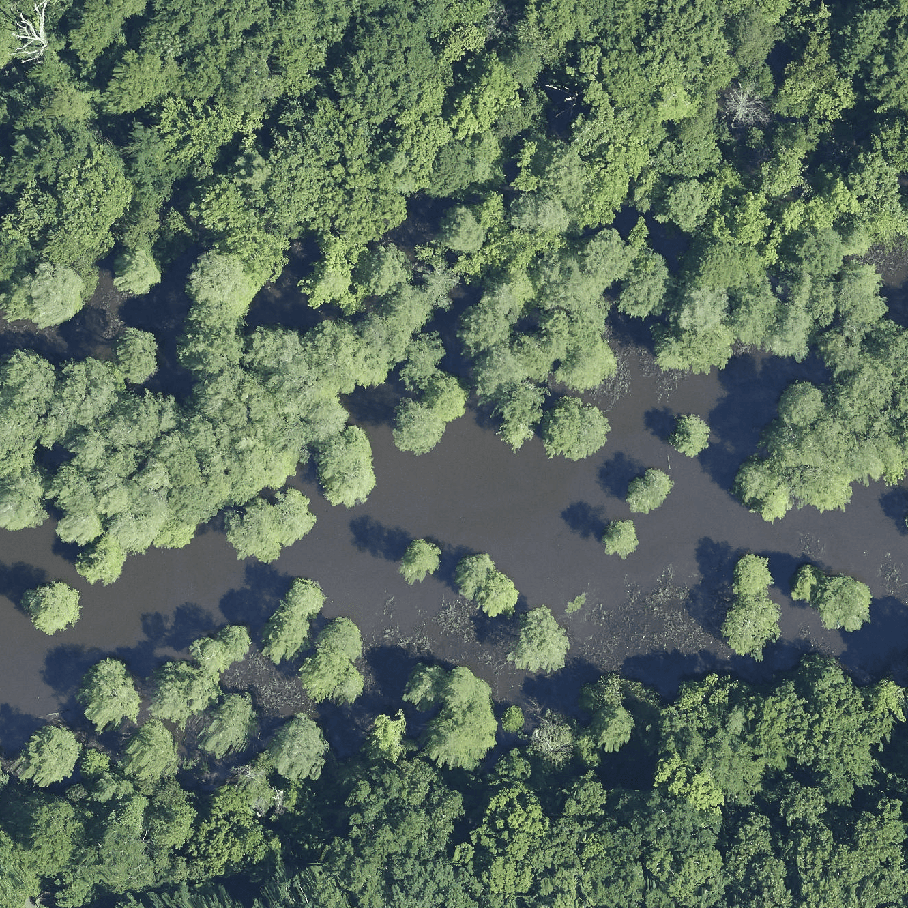
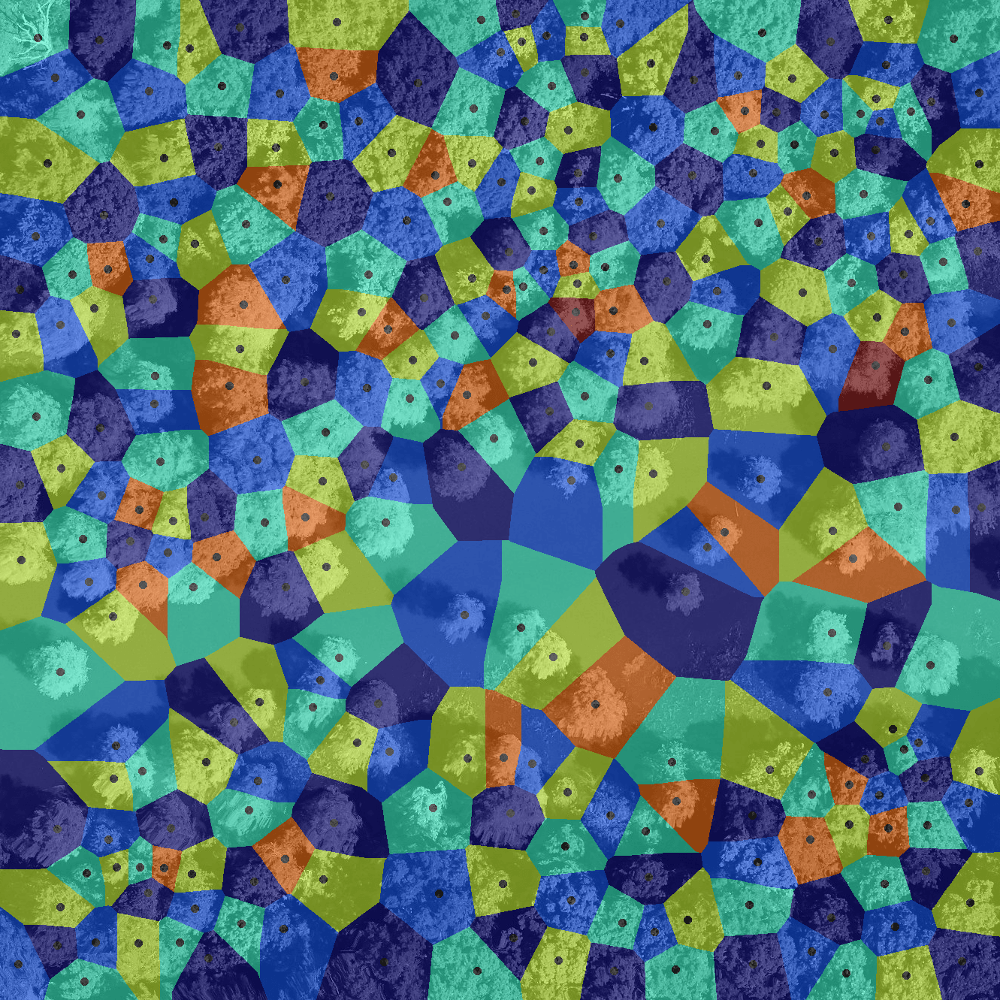
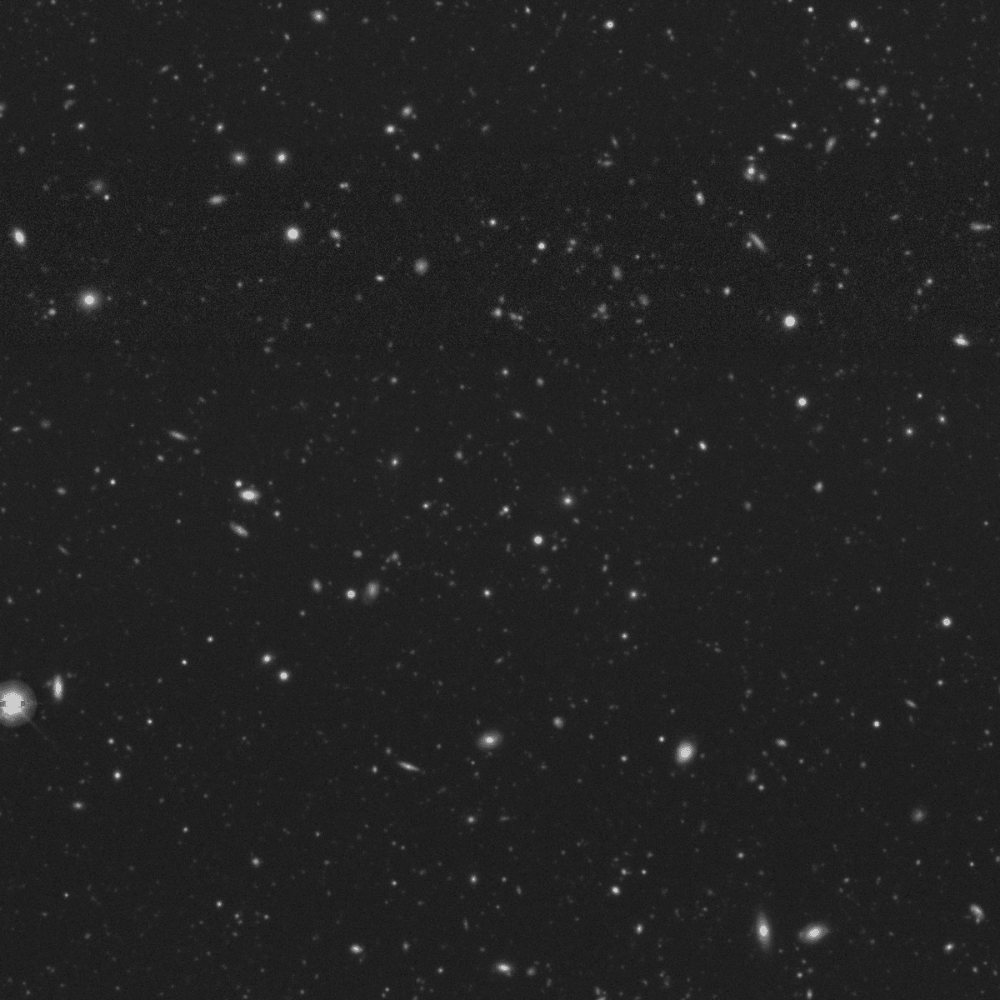

Voronoi segmentation is a technique used to divide an image or space into regions
based on the proximity to a set of defined points, called seeds or sites. Each 
region, known as a Voronoi cell, contains all locations that are closer to its 
seed than to any other. This approach is especially useful when analyzing spatial 
relationships, as it reveals how different areas relate in terms of distance and 
distribution. Voronoi segmentation is widely applicable for tasks where it's 
important to understand the proximity or neighborhood structure of points, such 
as organizing space, studying clustering patterns, or identifying regions of 
influence around each point in various types of data.


### Application to bioimage analysis

In bioimage analysis, Voronoi segmentation is a valuable tool for studying the 
spatial organization of cells, tissues, or other biological structures within an 
image. By dividing an image into regions around each identified cell or structure, 
Voronoi segmentation enables researchers to analyze how different cell types are 
distributed, measure distances between cells, and examine clustering patterns. This 
can provide insights into cellular interactions, tissue organization, and functional 
relationships within biological samples, such as identifying the proximity of immune 
cells to tumor cells or mapping neuron distributions within brain tissue.


These images are from . 


### Application to Earth Observation

In Earth observation, Voronoi segmentation is used to analyze spatial patterns and distributions in satellite or aerial images. By creating regions based on proximity to specific points, such as cities, vegetation clusters, or monitoring stations, Voronoi segmentation helps in studying how features are organized across a landscape. This method is particularly useful for mapping resource distribution, analyzing urban growth, monitoring vegetation patterns, or assessing land use changes. For instance, it can help divide an area into regions of influence around weather stations or identify how different land cover types interact spatially, aiding in environmental monitoring and planning.





These images are from .


### Application to Astronomy

In astronomy and large-scale sky surveys, a key objective is to identify individual celestial bodies—such as stars and galaxies—in sky images to enable detailed scientific analysis. Image segmentation is therefore a critical first step. In our case, Voronoi segmentation is used to divide the image into regions corresponding to individual objects or clusters. This method has the potential to separate overlapping or closely spaced sources, allowing for accurate analysis. Once segmented, these structures can be examined morphologically, and their luminosities can be measured with precision.




Thes original image is published by [Legacy Surveys / D. Lang (Perimeter Institute)](https://www.legacysurvey.org/acknowledgment/) and can be downloaded from the [official website](https://www.legacysurvey.org/viewer/jpeg-cutout?ra=53.16216667&dec=-27.79149167&layer=ls-dr10&pixscale=0.262&size=1200). The Legacy Surveys are described in .

> <agenda-title></agenda-title>
>
> In this tutorial, we will cover:
>
> 1. TOC
> {:toc}
>
{: .agenda}


## Data requirements 
Two images are required for Voronoi segmentation: A source image and a matching seed image containing objects from the source image annotated as white spots on a black background. 
The seed image can be prepared manually or using an automatic tool. 
To see how a seed image can be generated from a source image through smoothing and thresholding, see the [Imaging introduction tutorial]().
For this tutorial, we have already prepared a seed image, which you can download from Zenodo in the next step. 
The Zenodo dataset contains two different pairs of seeds and images: one image of cells from the field of bioimaging and one image of tree crowns from the field of earth observation. 
Depending on your interest, you may choose which dataset to follow the tutorial with. 

In principle, this tutorial can be followed with any type of data provided that you have an (image, seeds) pair that satisfies the following requirements: 

**Seeds:** 
- White seeds on a black background.
- Format: .tiff

**Image:** 
- Preferrably lighter objects on a darker background for the mask to work well.
- Format: .tiff stored in [planar, not interleaved format](http://avitevet.com/uncategorized/when-to-use-it-interleaved-vs-planar-image-data-storage/). 

> <comment-title> Checking the metadata of an image </comment-title>
> Tip: You can use the tool  to extract metadata from your image. The image metadata should have "SizeC = 3". It should not say "SizeC = 3 (effectively 1)", because that means that your image is stored in interleaved, not planar format.
{: .comment}


## Getting data from Zenodo
> <hands-on-title> Data Upload </hands-on-title>
>
> 1. Create a new history for this tutorial. When you log in for the first time, an empty, unnamed history is created by default. You can simply rename it.
> 
>    
> 
> 2. Import  the following dataset from [Zenodo](https://zenodo.org/records/15172302). 
> 
>    ```
>    https://zenodo.org/records/15281843/files/images_and_seeds.zip
>    https://zenodo.org/records/15424465/files/image_and_seed.zip
>    ```
> 
>    - **Important:** Choose the type of data as `zip`.
> 
>    The upload might take a few minutes. 
> 
>    
>
> 3.  the image with the following parameters:
>    -  *"input_file"*: `images_and_seeds.zip`
>    - *"Extract single file"*: `Single file`
>    - *"Filepath"*: Choose which data you want to use: 
>        - Cells: `images_and_seeds/cell_image-B2--W00026--P00001--Z00000--T00000--dapi.tiff`
>        - Trees: `images_and_seeds/tree_image_2019_DELA_5_423000_3601000.tiff`
>        - Galaxies: `sky_image_IMAGE.png`
>    
> 4. Rename  the resulting file as `image`.
>
> 5. Check that the datatype is correct.
>
>    
>
> 6.  the seed with the following parameters:
>    -  *"input_file"*: `images_and_seeds.zip`
>    - *"Extract single file"*: `Single file`
>    - *"Filepath"*: Choose the seed image corresponding to the image you chose in the last step. 
>        - Cells: `images_and_seeds/cell_seeds-B2--W00026--P00001--Z00000--T00000--dapi.tiff`
>        - Trees: `images_and_seeds/tree_seeds_2019_DELA_5_423000_3601000.tiff`
>        - Galaxies: `sky_image_SEED.png`
>
> 7. Rename  the resulting file as `seeds`.
{: .hands_on}


## Generate an object mask from pixel intensity
In case there should be empty regions without cells in the image, we wish to constrain the single Voronoi regions to roughly the area where a cell is. 
Therefore, we first smooth the image to reduce the influence of noise, and then apply a threshold on the smoothed image to get a binary mask. 
> <comment-title> Mask vs seeds </comment-title>
> The process used to create a mask can also be used to make seeds, as in the 
> [Imaging introduction tutorial](). 
{: .comment}

> <hands-on-title> Task description </hands-on-title>
> The image has three channels (red, green, blue). To generate a mask, we have to select a channel, for instance channel `0`. 
> 1.  with the following parameters:
>    -  *"Input Image"*: `image`
>    - *"Extract series"*: `All series`
>    - *"Extract timepoint"*: `All timepoints`
>    - *"Extract channel"*: `Extract channel`
>        - *"Channel id"* `0`
>    - *"Extract z-slice"*: `All z-slices`
>    - *"Extract range"*: `All images`
>    - *"Extract crop"*: `Full image`
>    - *"Tile image"*: `No tiling`
>    - *"Pyramid image"*: `No Pyramid`
> 
> 2. Rename the output to `single channel image`
> 
> 
> 3.  with the following parameters:
>    -  *"Input Image"*: `single channel image`
>    - *"Filter type"*: `Gaussian`
>        - *"Sigma"*: `3`
> 
> 4. Rename the output to `smoothed image`.
> 
>
> 5.  with the following parameters:
>    -  *"Input Image"*: `smoothed image`
>    - *"Thresholding method"*: `Manual`
>        - *"Threshold value"*: `3.0`. Note: This threshold value works well for the cell image, where the background has a very low intensity. For images with a brighter background, the threshold value will need to be adjusted.
> 
> 6. Rename the output to `mask`.
> 
{: .hands_on}

> <comment-title> How many channels does my image have? </comment-title>
> Note: If providing your own image, you can check how many channels your image has with the  tool.
> The number of channels is listed as, e.g., `SizeC = 3` for the cell image or `SizeC = 3 (effectively 1)` for the tree image.
{: .comment}

> <comment-title> The value of "Sigma" and the "Threshold value" </comment-title>
> Note: Generating a robust mask is harder for images with more noise. 
> Since the tree image has more noise than the cell image, you may have to adjust the value of *"Sigma"* to achieve better results.
> You may also have to adjust the *"Threshold value"* in the last step.
{: .comment}


> <question-title></question-title>
>
> What is the purpose of the smoothing step? 
>
> > <solution-title></solution-title>
> >
> > The purpose of smoothing is to reduce noise. 
> > For seed generation, noise might lead to false seeds where there is no object. 
> > Smoothing also promotes connectedness within an object, where noise might make an object appear as two separate objects. 
> > For mask generation, the same principles apply.
> >
> {: .solution}
>
{: .question}


## Perform Voronoi segmentation based on the seeds 
> <hands-on-title> Task description </hands-on-title>
> We need to assign a unique label to each object in the seed image:
> 1.  with the following parameters:
>    -  *"Binary Image"*: `seeds`
>    - *"Mode"*: `Connected component analysis`
> 
> 2. Rename the output to `label map`.
>
> 1. . We use the label map to perform Voronoi segmentation. 
>    -  *"Input Image"*: `label map`
> 
> 2. Rename the output to `tessellation`.
>
{: .hands_on}

> <question-title></question-title>
>
> How does the size of the seeds influence the Voronoi segmentation? 
>
> > <solution-title></solution-title>
> >
> > A Voronoi segmentation partition a plane into regions based on [proximity to each member of a given set of objects](https://en.wikipedia.org/wiki/Voronoi_diagram). The algorithm is the same irregardless of whether the seeds are single points or objects with a spatial extent, but the size of the seeds will certainly alter the segmentation in some way. 
> >
> {: .solution}
>
{: .question}

## Apply the mask and visualize the segmentation
A Voronoi tessellation segments an image into non-overlapping segments that cover the entire image. 
This makes sure that segments do not overlap, but empty spaces between objects will be counted as part of the segment belonging to the nearest item. 
A more accurate segmentation can be achieved by using the mask to reduce the size of the Voronoi segments. 
This can be achieved with the following operation. 
> <hands-on-title> Task description </hands-on-title>
> Combine the tessellation with the seeds and the mask to generate a segmentation that limits the expanse of each segment: 
> 1.  with the following parameters:
>    - *"Expression"*: `tessellation * (mask / 255) * (1 - seeds / 255)`
>    - In *"Input images"*:
>        -  *"Insert Input images"*
>            -  *"Input Image"*: `tessellation`
>            - *"Variable for representation of the image within the expression"*: `tessellation`
>        -  *"Insert Input images"*
>            -  *"Input Image"*: `seeds`
>            - *"Variable for representation of the image within the expression"*: `seeds`
>        -  *"Insert Input images"*
>            -  *"Input Image"*: `mask`
>            - *"Variable for representation of the image within the expression"*: `mask`
>
> 2. Rename the output to `masked segmentation`.
>
> 3. . 
>    -  *"Input Image"*: `masked segmentation`
>    - *"Radius of the neighborhood"*: `10` (works well for the cell image; may need adjustment for the tree image)
>    - *"Background label"*: `0`
> 
> 4. Rename the output to `colorized label map`
>
> 5.  with: 
>    -  *"Input Image"*: `single channel image`
>    - *"Number of channels"*: `3`
> 
> 6. Rename the output to `multi channel image`
> 
> 7.  with the following parameters to overlay the Voronoi segmentation on the original image:  
>    - *"Type of the overlay"*: `Linear blending`
>    -  *"Image 1"*: `multi channel image`
>    -  *"Image 2"*: `colorized label map`
>    - *"Weight for blending"*: `0.5`
>
{: .hands_on}


## Count objects and extract image features
> <hands-on-title> Task description </hands-on-title>
> 1. . 
>    -  *"Input Image"*: `tessellation`
>
> 1.  with the following parameters:
>    -  *"Label map"*: `tessellation`
>    - *"Use the intensity image to compute additional features"*: `Use intensity image`
>        -  *"Intensity Image"*: `single channel image`
>    - *"Select features to compute"*: `Select features`
>    - *"Available features"*:
>        -  `Label from the label map`
>        -  `Max Intensity`
>        -  `Mean Intensity`
>        -  `Minimum Intensity`
>        -  `Area`
>        -  `Major axis length`
>        -  `Minor axis length`
>
{: .hands_on}


In this last step, we compute the max, min and mean intensity for each image segment, as well as the area and the major and minor axis lengths. 
Depending on the use case, the distribution of these extracted features could reveal different subgroups in the data. 
In this way, the features could be used in to categorize different types of trees, cells, or other items. 
We will now use a scatter plot to explore the data. 


## Visualize segment features with a scatter plot 
> <hands-on-title>Plot feature extraction results</hands-on-title>
> 1. Click on the **Visualize**  icon of the  **Extract image features** output.
> 2. Run **Scatter plot (NVD3)** with the following parameters:
>    - *"Provide a title"*: `Segment features`
>    - *"X-Axis label"*: `Major axis length`
>    - *"Y-Axis label"*: `Minor axis length`
>    - *"Column of data point labels"*: `Column 1`
>    - *"Values for x-axis"*: `Column 6`
>    - *"Values for y-axis"*: `Column 7`
>
>    > <question-title></question-title>
>    >
>    > Plot the major axis lengths together with the minor axis lengths. What do you observe?
>    >
>    > > <solution-title></solution-title>
>    > > The major and minor axis lengths appear to be positively correlated, which is not surprising. It means that segments with a major axis that is longer than others typically have a longer minor axis too. 
>    > {: .solution }
>    {: .question}
{: .hands_on}


# Conclusion
This pipeline performs Voronoi segmentation and can be applied to datasets from any field as long as the input data satisfies the input data criteria. 
The steps in this tutorial are also available on Galaxy as a published workflow called [Voronoi segmentation](https://usegalaxy.eu/published/workflow?id=23030421cd9fcfb2). 
