<!--

ALL IMAGES USED IN THIS TUTORIAL ARE AVIALABLE IN EDITABLE FORM HERE:

https://drive.google.com/drive/folders/0B7a9KfygumZFYWxIZlJqSkJwc2c?resourcekey=0-C7W_lazWNzjkKiplb9y01A&usp=sharing

-->

In this tutorial, we will look at practical aspects of manipulation of next-generation sequencing data. We will start with the FASTQ format produced by most sequencing machines and will finish with a table of variants present in four human samples we will analyze.

# The Story

To make this tutorial as realistic as possible we wanted to use an example from the real world. We will start with four sequencing datasets (fastq files) representing four individuals positive for malaria---a life-threatening disease caused by *Plasmodium* parasites---transmitted to humans through the bites of infected female *Anopheles* mosquitoes.

Our goal is to understand whether the malaria parasite ([*Plasmodium falciparum*](https://brc-analytics.dev.clevercanary.com/data/organisms/5833)) infecting these individuals is resistant to [Pyrimethamine](https://en.wikipedia.org/wiki/Pyrimethamine)---an antimalarial drug. Resistance to Pyrimethamine is conferred by a mutation in `PF3D7_0417200` (*dhfr*) gene (). Given sequencing data from four individuals we will determine which one of them in infected with a *Plasmodium falciparum* carrying mutations in this gene.

An outline of our analysis looks like this:

 and reverse reads (blue). Before analysis begins these files are combined into a <i>Collection</i>. This allows processing all of them at once. The data is mapped against a reference genome of <i>P. falciparum</i>. This produces a series of BAM files. The BAM files are further passed through a variant caller. This produces VCF files. VCF files are then converted to tabular format and concatenated to create one final dataset. This dataset contains the answer the our question: which of the individual carries drug resistant mutations.").

# From reads to variants

In this tutorial we will use data from four infected individuals sequenced within the [MalariaGen](https://www.malariagen.net/data_package/open-dataset-plasmodium-falciparum-v70/) effort. We use the following four samples:

| Accession | Location |
|------------|------------|
| [ERR636434](https://www.ncbi.nlm.nih.gov/sra/?term=ERR636434) | Ivory coast |
| [ERR636028](https://www.ncbi.nlm.nih.gov/sra/?term=ERR636028) | Ivory coast |
| [ERR042232](https://www.ncbi.nlm.nih.gov/sra/?term=ERR042232) | Colombia |
| [ERR042228](https://www.ncbi.nlm.nih.gov/sra/?term=ERR042228) | Colombia |

These accessions correspond to datasets stored in the [Sequence Read Archive](https://www.ncbi.nlm.nih.gov/sra) at NCBI.

Let's do that 🚀

## Upload data into Galaxy

For this tutorial we down-sampled the data (made datasets smaller) to make sure that you can go through it quickly. We deposited these fastq datasets in a Zenodo library. Let's upload these datasets into Galaxy!

> <details-title>What is fastq data?</details-title>
>
> [FASTQ](https://en.wikipedia.org/wiki/FASTQ_format) is not a very well defined format. In the beginning various manufacturers of sequencing instruments were free to interpret FASTQ as they saw fit, resulting in a multitude of FASTQ flavors. This variation stemmed primarily from different ways of encoding quality values as described [on the Wikipedia article for FASTQ](https://en.wikipedia.org/wiki/FASTQ_format) (below you will find an explanation of quality scores and their meaning). Today, the FASTQ Sanger version () of the format is considered to be the standard form of FASTQ. Galaxy is using FASTQ Sanger as the only legitimate input for downstream processing tools and provides a number of utilities for converting FASTQ files () into this form (see **FASTQ Quality Control** section of Galaxy tools which is available on some usegalaxy.* instances).
>
> The FASTQ format looks like this:
>
> ```
> @M02286:19:000000000-AA549:1:1101:12677:1273 1:N:0:23
> CCTACGGGTGGCAGCAGTGAGGAATATTGGTCAATGGACGGAAGTCTGAACCAGCCAAGTAGCGTGCAG
> +
> ABC8C,:@F:CE8,B-,C,-6-9-C,CE9-CC--C-<-C++,,+;CE<,,CD,CEFC,@E9<FCFCF?9
> @M02286:19:000000000-AA549:1:1101:15048:1299 1:N:0:23
> CCTACGGGTGGCTGCAGTGAGGAATATTGGACAATGGTCGGAAGACTGATCCAGCCATGCCGCGTGCAG
> +
> ABC@CC77CFCEG;F9<F89<9--C,CE,--C-6C-,CE:++7:,CF<,CEF,CFGGD8FFCFCFEGCF
> @M02286:19:000000000-AA549:1:1101:11116:1322 1:N:0:23
> CCTACGGGAGGCAGCAGTAGGGAATCTTCGGCAATGGACGGAAGTCTGACCGAGCAACGCCGCGTGAGT
> +
> AAC<CCF+@@>CC,C9,F9C9@9-CFFFE@7@:+CC8-C@:7,@EFE,6CF:+8F7EFEEF@EGGGEEE
> ```
>
> Each sequencing read is represented by four lines:
>
> 1. `@` followed by read ID and optional information about sequencing run
> 2. sequenced bases
> 3. `+` (optionally followed by the read ID and some additional info)
> 4. Quality scores for each base of the sequence encoded as [ASCII symbols](https://en.wikipedia.org/wiki/ASCII)
>
> **Paired end data**
>
> It is common to prepare pair-end and mate-pair sequencing libraries. This is highly beneficial for a number of applications discussed in subsequent topics. For now, let's just briefly discuss what these are and how they manifest themselves in FASTQ form.
>
> 
> In paired end sequencing (left) the actual ends of rather short DNA molecules (less than 1kb) are determined, while for mate pair sequencing (right) the ends of long molecules are joined and prepared in special sequencing libraries. In these mate pair protocols, the ends of long, size-selected molecules are connected with an internal adapter sequence (i.e. linker, yellow) in a circularization reaction. The circular molecule is then processed using restriction enzymes or fragmentation. Fragments are enriched for the linker and outer library adapters are added around the two combined molecule ends. The internal adapter can then be used as a second priming site for an additional sequencing reaction in the same orientation or sequencing can be performed from the second adapter, from the reverse strand (From Ph.D. dissertation by <a href="https://ul.qucosa.de/api/qucosa%3A11231/attachment/ATT-0/">Martin Kircher</a>
>
> Thus in both cases (paired-end and mate-pair) a single physical piece of DNA (or RNA in the case of RNA-seq) is sequenced from two ends and so generates two reads. These can be represented as separate files (two FASTQ files with first and second reads) or a single file were reads for each end are interleaved. Here are examples:
>
> *Two single files*
>
> File 1
>
> ```
> @M02286:19:000000000-AA549:1:1101:12677:1273 1:N:0:23
> CCTACGGGTGGCAGCAGTGAGGAATATTGGTCAATGGACGGAAGTCT
> +
> ABC8C,:@F:CE8,B-,C,-6-9-C,CE9-CC--C-<-C++,,+;CE
> @M02286:19:000000000-AA549:1:1101:15048:1299 1:N:0:23
> CCTACGGGTGGCTGCAGTGAGGAATATTGGACAATGGTCGGAAGACT
> +
> ABC@CC77CFCEG;F9<F89<9--C,CE,--C-6C-,CE:++7:,CF
> ```
>
> File 2
>
> ```
> @M02286:19:000000000-AA549:1:1101:12677:1273 2:N:0:23
> CACTACCCGTGTATCTAATCCTGTTTGATACCCGCACCTTCGAGCTTA
> +
> --8A,CCE+,,;,<CC,,<CE@,CFD,,C,CFF+@+@CCEF,,,B+C,
> @M02286:19:000000000-AA549:1:1101:15048:1299 2:N:0:23
> CACTACCGGGGTATCTAATCCTGTTCGCTCCCCACGCTTTCGTCCATC
> +
> -6AC,EE@::CF7CFF<<FFGGDFFF,@FGGGG?F7FEGGGDEFF>FF
> ```
>
> > <comment-title>Read order is important</comment-title>
> > Note that read IDs are **identical** in two files and they are listed in **the same** order. In some cases read IDs in the first and second file may be appended with `/1` and `/2` tags, respectively (however, this is not guaranteed).
> {: .comment}
>
>
> *Interleaved file*
>
> ```
> @1/1
> AGGGATGTGTTAGGGTTAGGGTTAGGGTTAGGGTTAGGGTTAGGGTTA
> +
> EGGEGGGDFGEEEAEECGDEGGFEEGEFGBEEDDECFEFDD@CDD<ED
> @1/2
> CCTAACCCTAACCCTAACCCTAACCCTAACCCTAACCCTAACCCTAAC
> +
> GHHHDFDFGFGEGFBGEGGEGEGGGHGFGHFHFHHHHHHHEF?EFEFF
> @2/1
> AGGGATGTGTTAGGGTTAGGGTTAGGGTTAGGGTTAGGGTTAGGGTTA
> +
> HHHHHHEGFHEEFEEHEEHHGGEGGGGEFGFGGGGHHHHFBEEEEEFG
> @2/2
> CCTAACCCTAACCCTAACCCTAACCCTAACCCTAACCCTAACCCTAAC
> +
> HHHHHHHHHHHHGHHHHHHGHHHHHHHHHHHFHHHFHHHHHHHHHHH
> ```
>
> In this tutorial paired-end data represented as two different files.
>
{: .details}

> <hands-on-title>Upload accessions into Galaxy</hands-on-title>
>
> 1. Go to your Galaxy instance of choice such as one of the [UseGalaxy.* instances](https://galaxyproject.org/usegalaxy/) or any other.
> 1. Click *Upload Data* button:
> 
> 1. In the dialog box that would appear click "*Paste/Fetch*" button
> 
> 1. Paste the following accessions into the box (red box in the image below):
> ```
> https://zenodo.org/records/15354240/files/ERR042228_F.fq.gz
> https://zenodo.org/records/15354240/files/ERR042228_R.fq.gz
> https://zenodo.org/records/15354240/files/ERR042232_F.fq.gz
> https://zenodo.org/records/15354240/files/ERR042232_R.fq.gz
> https://zenodo.org/records/15354240/files/ERR636028_F.fq.gz
> https://zenodo.org/records/15354240/files/ERR636028_R.fq.gz
> https://zenodo.org/records/15354240/files/ERR636434_F.fq.gz
> https://zenodo.org/records/15354240/files/ERR636434_R.fq.gz
> ```
> 1. Change datatype to `fastqsanger.gz` (green box in the image below)
> 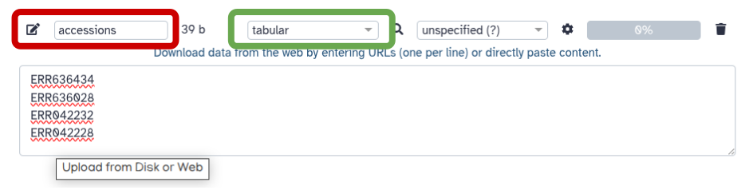
> 1. Click *Start* button
> 1. Close dialog by pressing **Close** button
> This will create eight datasets in your history on the right side of the interface:
> 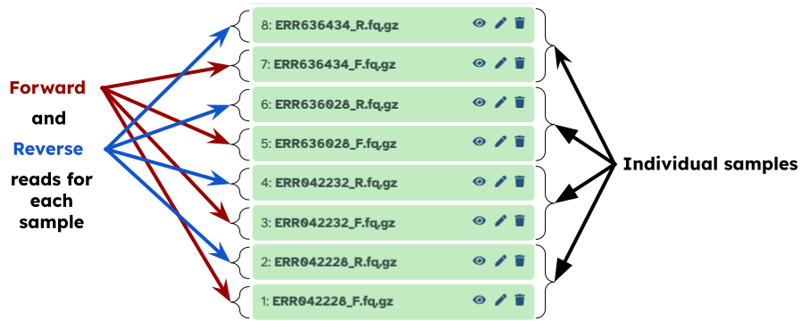
> There are eight datasets because each sample has *forward* and *reverse* read files associated with it, so 4 &#215; 2 = 8
>
{: .hands_on}

## Bundle data into *Collection*

We are going to perform exactly the same analysis on all four samples. So it does not make sense to repeat the same operation eight times (imagine if you had a hundred or a thousand datasets). So before we go any further we will bundle the datasets we have in the history into a *Collection*. *Collections* in Galaxy are logical groupings of datasets that reflect the semantic relationships between them in the experiment / analysis. In this case, we will create a *paired collection* that will have two "levels"  (For more information on Collections see the [Collections tutorial]():

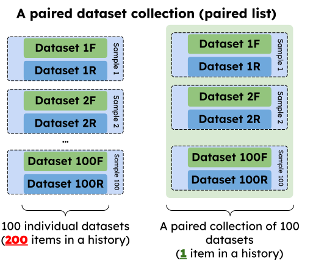

> <hands-on-title>Creating a paired-collection</hands-on-title>
>
> To create a paired collection follow the steps shown in the video below (the video is 52 seconds long 😁):
>
> <iframe width="560" height="315" src="https://www.youtube.com/embed/An4e7wr-FbU?si=iFN9BoNYy2p34LD9" title="YouTube video player" frameborder="0" allow="accelerometer; autoplay; clipboard-write; encrypted-media; gyroscope; picture-in-picture; web-share" referrerpolicy="strict-origin-when-cross-origin" allowfullscreen></iframe>
>
> Explore the collections by first **clicking** on the collection name in the history panel. This takes you inside the collection and shows you the datasets in it.  You can then navigate back to the outer level and, finally, full history.
>
{: .hands_on}

<!-- The above embedding uses iframe because include _includes/youtube.html does not work from within hands-on section -->

## Assessing the quality of the data with **fastp** and **multiqc**

Raw fastq data is often contaminated with fragments of sequencing adapters used in library preparation and contain low quality reads or reads with low quality portions.  can automatically detect widely used sequencing adapters and remove them as well as prune low quality segments from reads. So, let's pass our data through **fastp**:

> <hands-on-title>Running <b>fastp</b></hands-on-title>
>
> Run  with the following parameters:
>    - "*Single-end or paired reads*": `Paired collection` (<font color="red">red outline</font>).
>    - "*Select paired collection(s)*": Collection we created in the previous step (<font color="red">red arrow</font>).
>
> 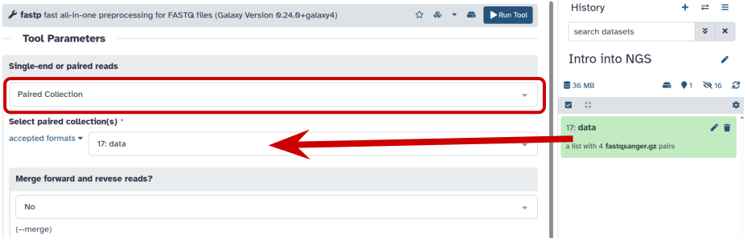
>
> Fastp modifies files by removing standard Illumina adapters and applies a number of quality filters generating "Cleaned up data" shown above) as well as HTML and JSON reports as three collections:
>
> 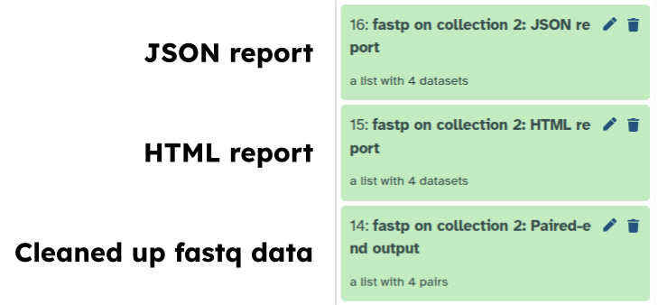
>
{: .hands_on}

You can click on individual HTML reports to get an idea about the quality of the data and degree of "cleanup". However, clicking on each dataset individually can become problematic if the number of datasets is large (you don't want to click on hundred datasets, do you?). We can visualize the QC data provided by **fastp** for **ALL** samples by feeding its JSON output to :

> <hands-on-title>Running <b>multiqc</b> on <b>fastp</b> JSON data</hands-on-title>
>
> Run  with the following parameters:
>
>    - "*Which tool was used to generate logs?*": `fastp` (<font color="red">red outline</font>).
>    - "*Output of fastp*": JSON output generated by **fastp** at the previous step (<font color="red">red arrow</font>).
>
> 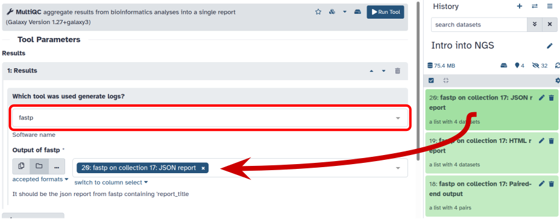
>
> `multiqc` will produce two outputs, but the one you care about has a work "Webpage" in it:
>
> 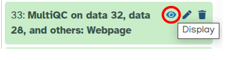
>
> Click on the  (eye) icon and you will the QC report.
>
{: .hands_on}

Figure below shows one of the plots produced by `multiqc`---distribution of quality values across positions for forward reads after processing.

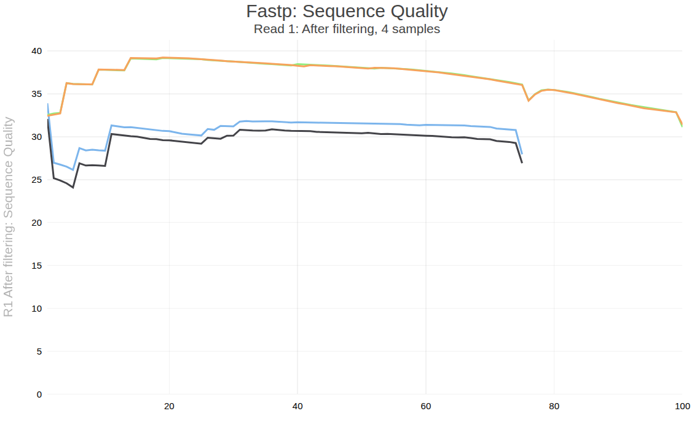

> <details-title>What are base qualities? What is good and what is bad?</details-title>
>
> **What are base qualities?**
>
> As we've seen above, FASTQ datasets contain two types of information:
>
> - *sequence of the read*
> - *base qualities* for each nucleotide in the read.
>
> The base qualities allow us to judge how trustworthy each base in a sequencing read is. The following excerpt from an excellent [tutorial](https://web.archive.org/web/20240422192254/https://chagall.med.cornell.edu/RNASEQcourse/Intro2RNAseq.pdf) by Friederike D&uuml;ndar, Luce Skrabanek, Paul Zumbo explains what base qualities are:
>
> > <comment-title>From "Introduction to differential gene expression analysis using RNA-seq"</comment-title>
> > Illumina sequencing is based on identifying the individual nucleotides by the fluorescence signal emitted upon their incorporation into the growing sequencing read. Once the fluorescence intensities are extracted and translated into the four letter code. The deduction of nucleotide sequences from the images acquired during sequencing is commonly referred to as base calling.
> ><br><br>
> > Due to the imperfect nature of the sequencing process and limitations of the optical instruments, base calling will always have inherent uncertainty. This is the reason why FASTQ files store the DNA sequence of each read together with a position-specific quality score that represents the error probability, i.e., how likely it is that an individual base call may be incorrect. The score is called [Phred score](http://www.phrap.com/phred/), $$Q$$, which is proportional to the probability $$p$$ that a base call is incorrect, where $$Q = −10lg(p)$$. For example, a Phred score of 10 corresponds to one error in every ten base calls ($$Q = −10lg(0.1)$$), or 90% accuracy; a Phred score of 20 corresponds to one error in every 100 base calls, or 99% accuracy. A higher Phred score thus reflects higher confidence in the reported base.
> ><br><br>
> > To assign each base a unique score identifier (instead of numbers of varying character length), Phred scores are typically represented as ASCII characters. At http://ascii-code.com/ you can see which characters are assigned to what number.
> ><br><br>
> > For raw reads, the range of scores will depend on the sequencing technology and the base caller used (Illumina, for example, used a tool called Bustard, or, more recently, RTA). Unfortunately, Illumina has been anything but consistent in how they calculated and ASCII-encoded the Phred score (see below)! In addition, Illumina now allows Phred scores for base calls with as high as 45, while 41 used to be the maximum score until the HiSeq X. This may cause issues with downstream sapplications that expect an upper limit of 41.
> {: .comment}
>
> 
>
> Base call quality scores are represented with the Phred range. Different Illumina (formerly Solexa) versions
> used different scores and ASCII offsets. Starting with Illumina format 1.8, the score now represents the standard
> Sanger/Phred format that is also used by other sequencing platforms and the sequencing archives.
>
> 
>
>The ASCII interpretation and ranges of the different Phred score notations used by Illumina and the original Sanger interpretation. Although the Sanger format allows a theoretical score of 93, raw sequencing reads typically do not exceed a Phred score of 60. In fact, most Illumina-based sequencing will result in maximum scores of 41 to 45 (image from Wikipedia)
>
> **What is good and what is bad?**
>
> One of the first steps in the analysis of NGS data is seeing how good the data actually is. [FastqQC](https://www.bioinformatics.babraham.ac.uk/projects/fastqc/) is the most famous tool allowing you to assess the quality of FASTQ datasets (and deciding whether to blame or not to blame whoever has done sequencing for you). [Falco](https://github.com/smithlabcode/falco) is an alternative tool for quality control. Falco is a improved implementation of FastQC for high throughput sequence quality control.
>
> 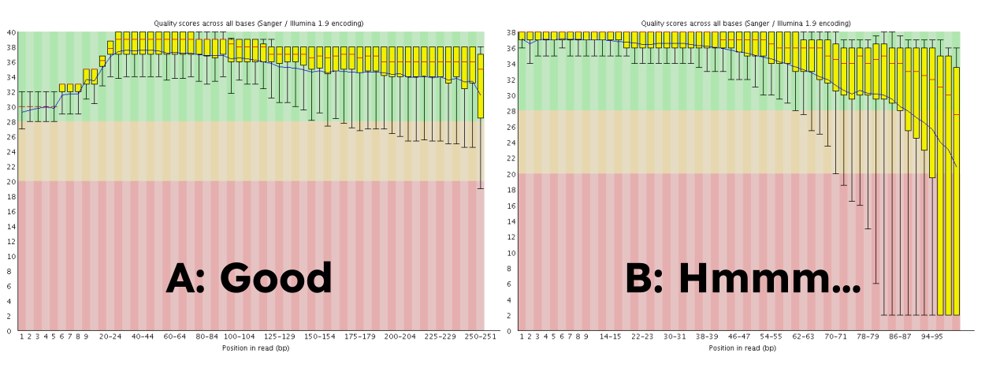
> Here, you can see **FastQC** base quality reports (the tools gives you many other types of data) for two datasets: <b>A</b> and <b>B</b>. The A dataset has long reads (250 bp) and very good quality profile with no qualities dropping below phred score of 30. The B dataset is significantly worse with ends of the reads dipping below phred score of 20. The B reads may need to be trimmed for further processing. **Falco** will generate almost the same reports about the quality of the reads.")
{: .details}

## Mapping reads

We can proceed with mapping reads. Galaxy has a number of mappers including **bowtie**, **bwa-mem**, and **bwa-mem2**. For this analysis we will use ---the latest version of this popular and "battle-tested" tool.

### Upload reference genome

The key question when mapping reads against a genome is whether the index for this genome---a datastructure **bwa-mem2** uses to quickly find matches---is already installed on Galaxy or not. Let's assume that it is **NOT** present in Galaxy. In this case you will need to upload the genome. In this case we will use reference genome of 3D7 strain *P. faciparum*.

> <hands-on-title>Uploading the genome for <i>P. falciparum</i></hands-on-title>
>
> To download the genome paste the following URL into the  tool:
>
> ```
> https://zenodo.org/records/15354240/files/GCF_000002765.6.fa.gz
> ```
> The only difference is that here with example we've see above is that you need to set datatype (green box) to `fasta.gz`:
> 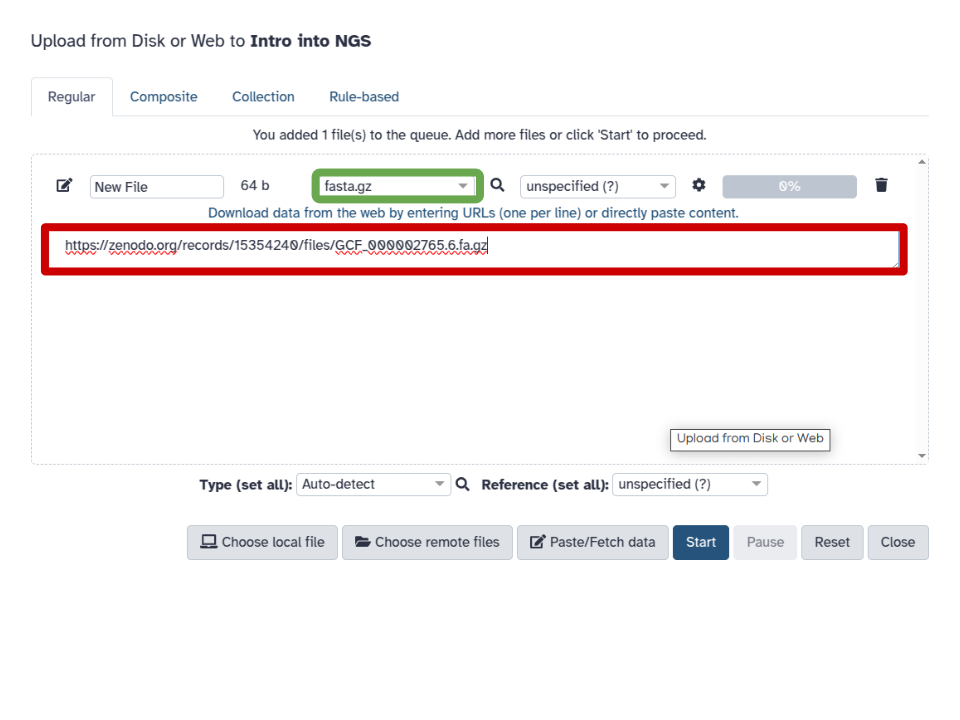
>
{: .hands_on}

### Map the reads

Now we can map the reads against the uploaded genome:

> <hands-on-title>Map sequencing reads with <b>bwa-mem</b></hands-on-title>
>
> Run  with the parameters shown in the image below:
>
>    - "*Will you select a reference genome from your history or use a built-in index?*": `Use a reference genome from history and build index if necessary` (<font color="red">red outline</font>).
>    - "*Use the following dataset as the reference*": Choose the reference we uploaded at the previous step (<font color="red">red arrow</font>).
>    - "*Single or Paired-end reads*": `Paired collection` (<font color="green">green outline</font>).
>    - "*Select a paired collection*": Select the collection of fastq datasets produced by **fastp** (<font color="green">green arrow</font>).
>
> 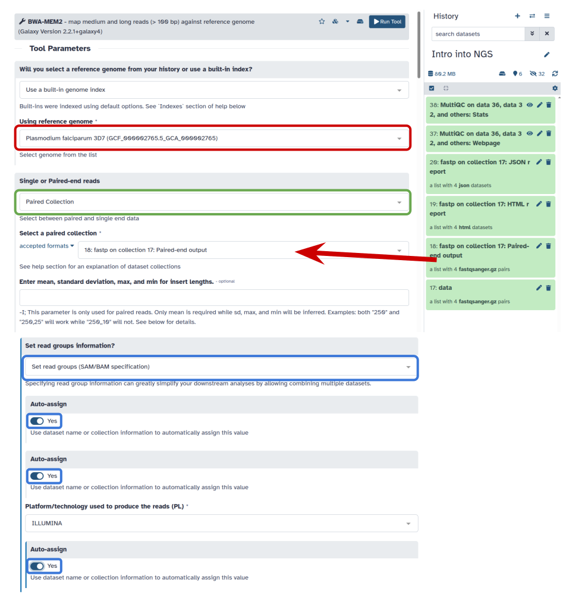
>
{: .hands_on}

**bwa-mem2** produces four BAM outputs which we will process further and will use to call variants.

> <details-title>What are BAM files?</details-title>
>
> **SAM/BAM data**
>
> The [SAM/BAM](https://samtools.github.io/hts-specs/SAMv1.pdf) format is an accepted standard for storing aligned reads (it can also store unaligned reads and some mappers such as  are accepting unaligned BAM as input). The binary form of the format (BAM) is compact and can be rapidly searched (if indexed). In Galaxy, BAM datasets are always indexed (accompanies by a .bai file) and sorted in coordinate order. In the following discussion, we once again rely on [tutorial](https://web.archive.org/web/20240422192254/https://chagall.med.cornell.edu/RNASEQcourse/Intro2RNAseq.pdf) by Friederike D&uuml;ndar, Luce Skrabanek, and Paul Zumbo.
>
> The Sequence Alignment/Map (SAM) format is, in fact, a generic nucleotide alignment format that describes the alignment of sequencing reads (or query sequences) to a reference. The human readable, TAB delimited SAM files can be compressed into the Binary Alignment/Map format. These BAM files are bigger than simply gzipped SAM files, because they have been optimized for fast random access rather than size reduction. Position-sorted BAM files can be indexed so that all reads aligning to a locus can be efficiently retrieved without loading the entire file into memory.
>
> As shown below, SAM files typically contain a short header section and a very long alignment section where each row represents a single read alignment. The following sections will explain the SAM format in a bit more detail. For the most comprehensive and updated information go to [SAM/BAM and related specifications GitHub repository.](https://github.com/samtools/hts-specs)
>
> 
> Each line of the optional header section starts with <tt>@</tt>, followed by the appropriate abbreviation (e.g., SQ for sequence dictionary which lists all chromosomes names (SN) and their lengths (LN)). The vast majority of lines within a SAM file typically correspond to read alignments where each read is described by the 11 mandatory entries (black font) and a variable number of optional fields (grey font). From <a href="https://web.archive.org/web/20240422192254/https://chagall.med.cornell.edu/RNASEQcourse/Intro2RNAseq.pdf">a tutorial</a> by Friederike D&uuml;ndar, Luce Skrabanek, and Paul Zumbo."
>
> **SAM Header**
>
> The header section includes information about how the alignment was generated and stored. All lines in the header section are tab-delimited and begin with the “@” character, followed by tag:value pairs, where tag is a two-letter string that defines the content and the format of value. For example, the “@SQ” line in the header section contains the information about the names and lengths of the **reference** sequences to which the reads were aligned. For a hypothetical organism with three chromosomes of length 1,000 bp, the SAM header should contain the following three lines:
>
> ```
> @SQ SN:chr1 LN:1000
> @SQ SN:chr2 LN:1000
> @SQ SN:chr3 LN:1000
> ```
>
> **SAM alignment section**
>
> The optional header section is followed by the alignment section where each line corresponds to one sequenced read. For each read, there are 11 mandatory fields that always appear in the same order:
>
> ```
> <QNAME> <FLAG> <RNAME> <POS> <MAPQ> <CIGAR> <MRNM> <MPOS> <ISIZE> <SEQ> <QUAL>
> ```
>
> If the corresponding information is unavailable or irrelevant, field values can be ‘0’ or ‘*’ (depending on the field, see below), but they cannot be missing! After the 11 mandatory fields, a variable number of optional fields can be present. Here is an example of one single line of a real-life SAM file (you may need to scroll sideways):
>
> ```
> ERR458493 .552967 16 chrI 140 255 12 M61232N37M2S * 0 0 CCACTCGTTCACCAGGGCCGGCGGGCTGATCACTTTATCGTGCATCTTGGC BB?HHJJIGHHJIGIIJJIJGIJIJJIIIGHBJJJJJJHHHHFFDDDA1+B NH:i:1 HI:i:1 AS:i:41 nM:i:2
> ```
>
> The following table explains the format and content of each field. The `FLAG`, `CIGAR`, and the optional fields (marked with pale blue background) are explained in more detail below. The number of optional fields can vary widely between different SAM files and even between reads within in the same file. The field types marked in blue are explained in more detail in the text below.
>
> 
>
> **`FLAG` field**
>
> The FLAG field encodes various pieces of information about the individual read, which is particularly important for Paired-Enmd (PE) reads. It contains an integer that is generated from a sequence of bits (0, 1). This way, answers to multiple binary (Yes/No) questions can be compactly stored as a series of bits, where each of the single bits can be addressed and assigned separately.
>
> The following table gives an overview of the different properties that can be encoded in the FLAG field. The developers of the SAM format and samtools tend to use the hexadecimal encoding as a means to refer to the different bits in their documentation. The value of the FLAG field in a given SAM file, however, will always be the decimal representation of the sum of the underlying binary values (as shown in Table below, row 2).
>
> 
> The <tt>FLAG</tt> field of SAM files stores information about the respective read alignment in one single decimal number. The decimal number is the sum of all the answers to the Yes/No questions associated with each binary bit. The hexadecimal representation is used to refer to the individual bits (questions). A bit is set if the corresponding state is true. For example, if a read is paired, <tt>0x1</tt> will be set, returning the decimal value of 1. Therefore, all <tt>FLAG</tt> values associated with paired reads must be uneven decimal numbers. Conversely, if the <tt>0x1</tt> bit is unset (= read is not paired), no assumptions can be made about <tt>0x2</tt>, <tt>0x8</tt>, <tt>0x20</tt>, <tt>0x40</tt> and <tt>0x80</tt> because they refer to paired reads. From <a href="https://web.archive.org/web/20240422192254/https://chagall.med.cornell.edu/RNASEQcourse/Intro2RNAseq.pdf">a tutorial</a> by Friederike D&uuml;ndar, Luce Skrabanek, and Paul Zumbo."
>
> In a run with single reads, the flags you most commonly see are:
>
> - 0: This read has been mapped to the forward strand. (None of the bit-wise flags have been set.)
> - 4: The read is unmapped (`0x4` is set).
> - 16: The read is mapped to the reverse strand (`0x10` is set)
>
> (`0x100`, `0x200` and `0x400` are not used by most aligners/mappers, but could, in principle be set for single reads.) Some common `FLAG` values that you may see in a PE experiment include:
>
>
> |**69** (= 1 + 4 + 64) | The read is paired, is the first read in the pair, and is unmapped.|
> |**77** (= 1 + 4 + 8 + 64) | The read is paired, is the first read in the pair, both are unmapped.|
> |**83** (= 1 + 2 + 16 + 64) | The read is paired, mapped in a proper pair, is the first read in the pair, and it is mapped to the reverse strand.|
> |**99** (= 1 + 2 + 32 + 64) | The read is paired, mapped in a proper pair, is the first read in the pair, and its mate is mapped to the reverse strand.|
> |**133** (= 1 + 4 + 128) | The read is paired, is the second read in the pair, and it is unmapped.|
> |**137** (= 1 + 8 + 128) | The read is paired, is the second read in the pair, and it is mapped while its mate is not.|
> |**141** (= 1 + 4 + 8 + 128) | The read is paired, is the second read in the pair, but both are unmapped.|
> |**147** (= 1 + 2 + 16 + 128) | The read is paired, mapped in a proper pair, is the second read in the pair, and mapped to the reverse strand.|
> |**163** (= 1 + 2 + 32 + 128) | The read is paired, mapped in a proper pair, is the second read in the pair, and its mate is mapped to the reverse strand.|
>
>
> **`CIGAR` string**
>
> `CIGAR` stands for *Concise Idiosyncratic Gapped Alignment Report*. This sixth field of a SAM file
> contains a so-called CIGAR string indicating which operations were necessary to map the read to the reference sequence at that particular locus.
>
> The following operations are defined in CIGAR format (also see figure below):
>
> - **M** - Alignment (can be a sequence match or mismatch!)
> - **I** - Insertion in the read compared to the reference
> - **D** - Deletion in the read compared to the reference
> - **N** - Skipped region from the reference. For mRNA-to-genome alignments, an N operation represents an intron. For other types of alignments, the interpretation of N is not defined.
> - **S** - Soft clipping (clipped sequences are present in read); S may only have H operations between them and the ends of the string
> - **H** - Hard clipping (clipped sequences are NOT present in the alignment record); can only be present as the first and/or last operation
> - **P** - Padding (silent deletion from padded reference)
> - **=** - Sequence match (not widely used)
> - **X** - Sequence mismatch (not widely used)
>
> The sum of lengths of the **M**, **I**, **S**, **=**, **X** operations must equal the length of the read. Here are some examples:
>
> 
> From <a href="https://web.archive.org/web/20240422192254/https://chagall.med.cornell.edu/RNASEQcourse/Intro2RNAseq.pdf">a tutorial</a> by Friederike D&uuml;ndar, Luce Skrabanek, and Paul Zumbo.")
>
> **Optional fields**
>
> Following the eleven mandatory SAM file fields, the optional fields are presented as key-value
> pairs in the format of `<TAG>:<TYPE>:<VALUE>`, where `TYPE` is one of:
>
> - `A` - Character
> - `i` - Integer
> - `f` - Float number
> - `Z` - String
> - `H` - Hex string
>
> The information stored in these optional fields will vary widely depending on the mapper and new tags can be added freely. In addition, reads within the same SAM file may have different numbers of optional fields, depending on the program that generated the SAM file. Commonly used optional tags include:
>
> - `AS:i` - Alignment score
> - `BC:Z` - Barcode sequence
> - `HI:i` - Match is i-th hit to the read
> - `NH:i` - Number of reported alignments for the query sequence
> - `NM:i` - Edit distance of the query to the reference
> - `MD:Z` - String that contains the exact positions of mismatches (should complement the CIGAR string)
> - `RG:Z` - Read group (should match the entry after ID if @RG is present in the header.
>
> Thus, for example, we can use the NM:i:0 tag to select only those reads which map perfectly to the reference (i.e., have no mismatches). While the optional fields listed above are fairly standardized, tags that begin with `X`, `Y`, and `Z` are reserved for particularly free usage and will never be part of the official SAM file format specifications. `XS`, for example, is used by TopHat (an RNA-seq analysis tool we will discuss later) to encode the strand information (e.g., `XS:A:+`) while Bowtie2 and BWA use `XS:i:` for reads with multiple alignments to store the alignment score for the next-best-scoring alignment (e.g., `XS:i:30`).
>
> **Read Groups**
>
> One of the key features of SAM/BAM format is the ability to label individual reads with readgroup tags. This allows pooling results of multiple experiments into a single BAM dataset. This significantly simplifies downstream logistics: instead of dealing with multiple datasets one can handle just one. Many downstream analysis tools such as variant callers are designed to recognize readgroup data and output results on per-readgroup basis.
>
> One of the best descriptions of BAM readgroups is on [GATK support site](https://gatkforums.broadinstitute.org):
>
> 
>
> GATK forum also provides the following example:
>
> 
>
> **Manipulating SAM/BAM datasets**
>
> We support four major toolsets for processing of SAM/BAM datasets:
>
>  * [DeepTools](https://deeptools.readthedocs.io) - a suite of user-friendly tools for the visualization, quality control and normalization of data from deep-sequencing DNA sequencing experiments.
>  * [SAMtools](http://www.htslib.org/) - various utilities for manipulating alignments in the SAM/BAM format, including sorting, merging, indexing and generating alignments in a per-position format.
>  * [BEDtools](https://bedtools.readthedocs.io/en/latest/) - a toolkit originally written for BED format was expanded for analysis of BAM and VCF datasets.
>  * [Picard](https://broadinstitute.github.io/picard/) - a set of Java tools for manipulating high-throughput sequencing data (HTS) data and formats.
{: .details}

### Remove duplicates

In many cases there could be artifacts that can be detected in mapped reads. One of such artifacts are duplicate reads.

> <details-title>What are read duplicates?</details-title>
>
> **PCR duplicates**
>
> Preparation of sequencing libraries (at least at the time of writing) for technologies such as Illumina (used in this example) involves PCR amplification. It is required to generate sufficient number of sequencing templates so that a reliable detection can be performed by base callers. Yet, PCR has its biases, which are especially profound in cases of multitemplate PCR used for construction of sequencing libraries ().
>
> 
> Analyzing molecules aligning with the same outer coordinates, a mapping quality of at least 30 and a length of at least 30 nucleotide, resulted in an average coverage of 12.9 per PCR duplicate and an empirical coverage distribution similar to an exponential/power law distribution (left upper panel). This indicates that many molecules are only observed for deeper sequencing while other molecules are available at higher frequencies. Analyzing length (left middle panel) and GC content (left lower panel) patterns as well as the combination (right panel) shows higher PCR duplicate counts for a GC content between 30% to 70% as well as for shorter molecules compared to longer molecules. This effect may be due to an amplification bias from the polymerase or the cluster generation process necessary for Illumina sequencing. (From Ph.D. dissertation by <a href=\"https://ul.qucosa.de/api/qucosa%3A11231/attachment/ATT-0/\">Martin Kircher</a>)."
>
> Duplicates can be identified based on their outer alignment coordinates or using sequence-based clustering. One of the common ways for identification of duplicate reads is the `MarkDuplicates` utility from [Picard](https://broadinstitute.github.io/picard/command-line-overview.html) package, which we will use later in this tutorial.
>
> **Sampling coincidence duplicates**
>
> However, one has to be careful when removing duplicates in cases when the sequencing targets are small (e.g., sequencing of bacterial, viral, or organellar genomes as well as amplicons). This is because when sequencing target is small reads will have the same coordinates by chance and not because of PCR amplification issues. The figure below illustrates the fine balance between estimates allele frequency, coverage, and variation in insert size (from ()):
>
> 
>The Variant Allele Frequency (VAF) bias determined by coverage and insert size variance. Reads are paired-end and read length is 76. The insert size distribution is modeled as a Gaussian distribution with mean at 200 and standard deviation shown on the X-axis. The true VAF is 0.05. The darkness at each position indicates the magnitude of the bias in the VAF ().")
{: .details}

Removing duplicates is particularly important for identification of sequence variants as they can affect their frequencies. It is performed with the  tool:

> <hands-on-title>Remove duplicates</hands-on-title>
>
> Run  with the following parameters:
>    -  *"Select SAM/BAM dataset or dataset collection"*: `bam_output` (output of ) as shown with the <font color="red">red arrow</font>.
>    - *"If true do not write duplicates to the output file instead of writing them with appropriate flags set"*: `Yes` as shown with <font color="green">green arrow</font>.
>
> 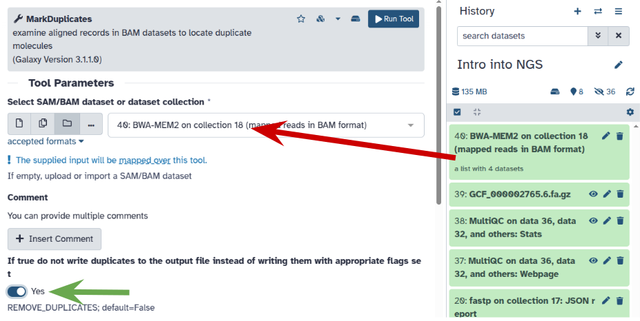
{: .hands_on}

## Calling variants

Now we are ready to proceed with variant calling. For this purpose we will a tool called **lofreq**. One thing to keep in mind in our case is that the samples are from human blood. In humans *Plasmodium* parasites exist in **haploid** state (only zygote is diploid and this stage happens in mosquito). **lofreq** is specifically designed for calling variants in this scenario.

### Realign reads

One of the key issues with accurate identification of sequence variants is normalizing indels (insertions and deletions).

> <details-title>What is the problem with indels?</details-title>
>
>Left aligning of indels (a variant of re-aligning) is extremely important for obtaining accurate variant calls. For illustrating how left-aligning works, we expanded on an example provided by Tan et al. [2015](https://pubmed.ncbi.nlm.nih.gov/25701572/). Suppose you have a reference sequence and a sequencing read:
>
>
>```
>Reference GGGCACACACAGGG
>Read      GGGCACACAGGG
>```
>
>If you look carefully you will see that the read is simply missing a `CA` repeat. But it is not apparent to a mapper, so some of possible alignments and corresponding variant calls include:
>
>```
>Alignment                 Variant Call
>
>GGGCACACACAGGG            Ref: CAC
>GGGCAC--ACAGGG            Alt: C
>
>GGGCACACACAGGG            Ref: ACA
>GGGCA--CACAGGG            Alt: A
>
>GGGCACACACAGGG            Ref: GCA
>GGG--CACACAGGG            Alt: G
>```
>
>While we cannot know which of these arrangements is correct, left-aligning guarantees consistency.
>
{: .details}

 is a part of **lofreq** package. It corrects misalignment around insertions and deletions:

> <hands-on-title>Realign reads around indels</hands-on-title>
>
> Run  with the following parameters:
>    -  *"Reads to realign"*: output of  as shown with the <font color="red">red arrow</font>.
>    - *"Choose the source for the reference genome"*: `History`
>        -  *"Reference"*: set this to the [previously uploaded reference genome](#upload-reference-genome) (<font color="green">green outline and arrow</font>).
>
> 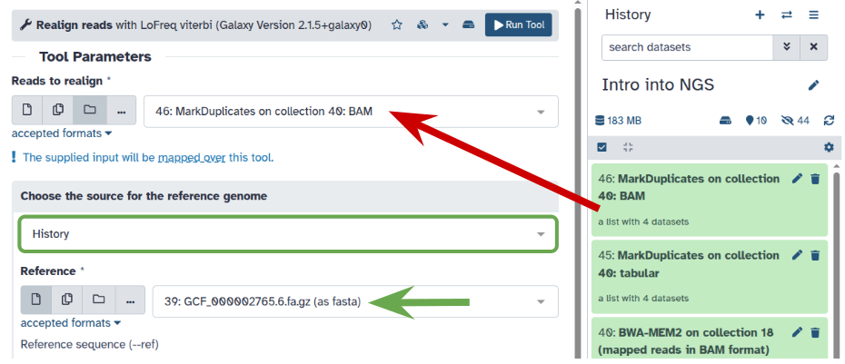
>
{: .hands_on}

### Call Variants using lofreq **Call variants**

We are now ready to actually call variants:

> <hands-on-title>Call variants</hands-on-title>
>
> Run  with the following parameters:
>    -  *"Input reads in BAM format"*: Output of  (<font color="red">red arrow</font>)
>    - *"Choose the source for the reference genome"*: `History` (<font color="green">green outline</font>).
>        -  *"Reference"*: set this to the [previously uploaded reference genome](#upload-reference-genome) (<font color="green">green outline and arrow</font>).
>    - *"Types of variants to call"*: `SNVs and indels` (<font color="blue">blue outline and arrow</font>).
>    - *"Variant calling parameters"*: `Configure settings` (<font color="orange">orange outline</font>).
>        - In *"Coverage"*:
>            - *"Minimal coverage"*: `10` (<font color="orange">orange arrow</font>).
>        - In *"Base-calling quality"*:
>            - *"Minimum baseQ"*: `20` (<font color="orange">orange arrow</font>).
>            - *"Minimum baseQ for alternate bases"*: `20`  (<font color="orange">orange arrow</font>).
>        - In *"Mapping "quality*":
>            - *"Minimum mapping quality"*: `20` (<font color="orange">orange arrow</font>).
>
> 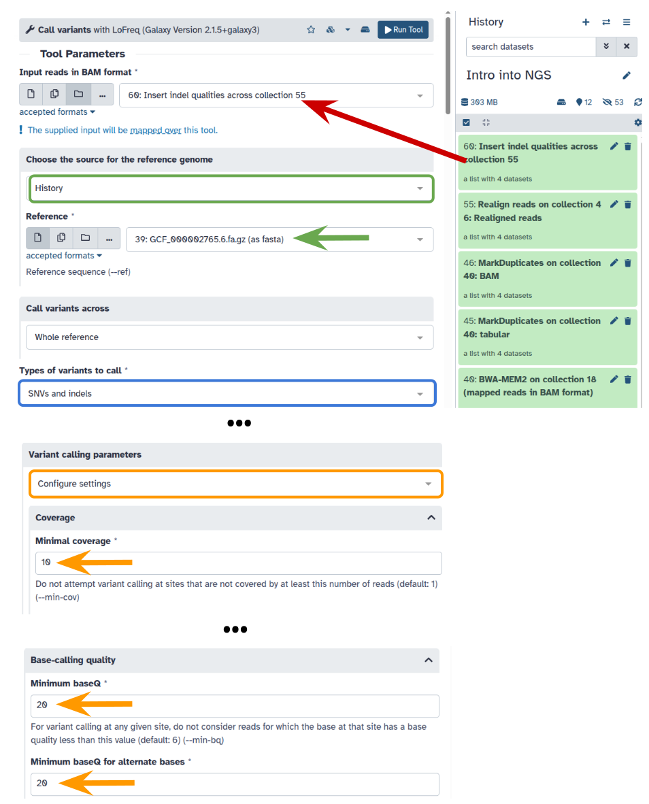
{: .hands_on}

The output of this step is a collection of [VCF](https://en.wikipedia.org/wiki/Variant_Call_Format) files containing information on all variants found between the reads and the reference genome.

## Annotating variants

### Preparing  database

We will now annotate the variants we called in the previous step with the effect they may have on the *Plasmodium* phenotype. In order to do this we need to create a database that can be used by . This process requires a reference genome (which we already uploaded and a list of genes present in this genome---a file we have not uploaded yet.

> <hands-on-title>Uploading gene annotations for <i>P. falciparum</i></hands-on-title>
>
> To download gene annotations paste the following URL into the  tool as was shown previously in this tutorial already twice (for fastq files and for reference genome).
>
> ```
> https://zenodo.org/records/15354240/files/GCF_000002765.6_GCA_000002765.ncbiRefSeq.gtf.gz
> ```
> Set datatype (<font color="green">green</font> box) to `gtf.gz`:
>
> 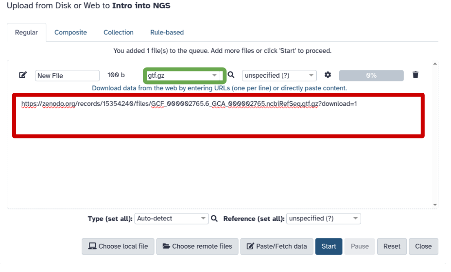
>
{: .hands_on}

Now we can run :

> <hands-on-title>Prepare snpEff database with <b>SnpEff Build</b></hands-on-title>
>
> Run  with the following parameters:
>
>    - *"Name for the database"*: `Pf` (<font color="red">red arrow</font>).
>    - *"Input annotations are in"*: `GTF` (<font color="green">green arrow</font>).
>    - *"GTF dataset to build database from"*: Select the GTF file uploaded at the previous step (<font color="blue">blue arrow</font>).
>    - *"Choose the source for the reference genome"*: `History` (<font color="orange">orange outline</font>).
>    - *"Genome in FASTA format"*: Choose reference genome uploaded earlier (<font color="orange">orange arrow</font>).
>
> 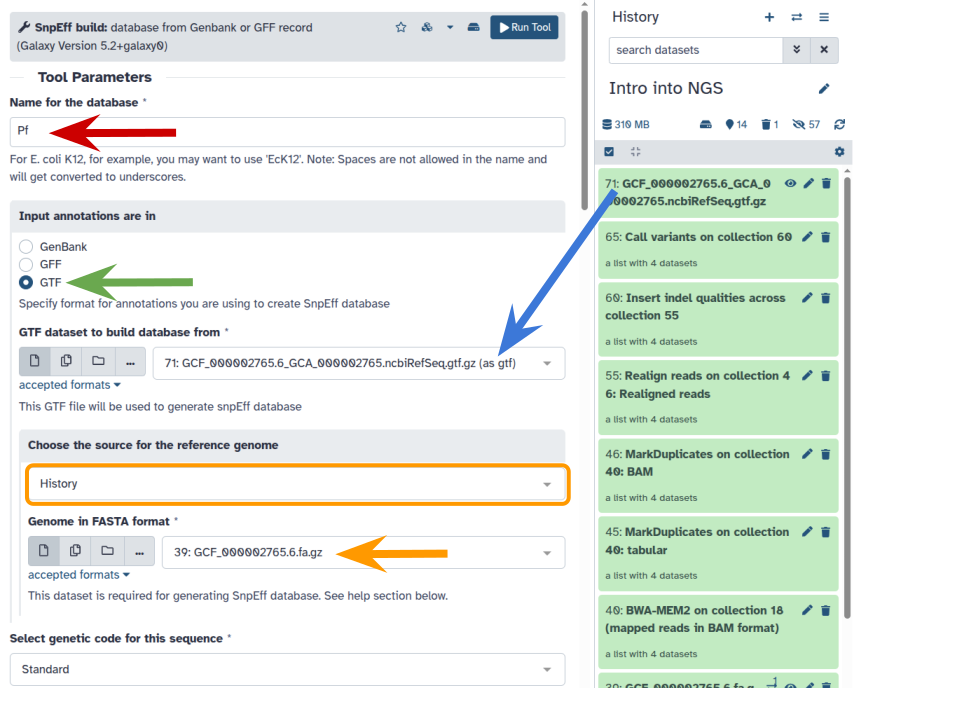
>
{: .hands_on}

### Annotate variant effects with **SnpEff eff**

We are now ready to annotate variants with  (here "eff" stands for effect):

> <hands-on-title>Annotate variant effects</hands-on-title>
>
> Run  with the following parameters:
>    -  *"Sequence changes (SNPs, MNPs, InDels)"*: Output of  we've run previously <font color="red">red arrow</font>)
>    - *"Genome source"*: `Custom snpEff database in your history` <font color="green">green outline</font>)
>      - "*SnpEff5.2 Genome Data*": set to the SnpEff database we built in the previous step <font color="green">green arrow</font>)
>
>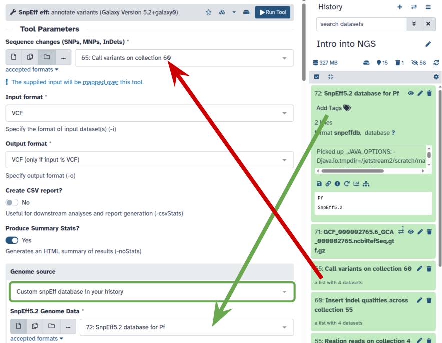
>
{: .hands_on}

### Create table of variants using **SnpSift Extract Fields**

Previous step generated a set of annotated VCF files. These can be visualized in a genome browser, but we will go a different way. We will convert them into tab-delimited files that can be easily processed.

> <hands-on-title>Create table of variants</hands-on-title>
>
> Run  with the following parameters:
>    -  *"Variant input file in VCF format"*: Output of  from previous step (<font color="red">red arrow</font>)
>    - *"Fields to extract"*: Copy the following string into a box highlighted with (<font color="green">green outline</font>):
>
> ```
>CHROM POS REF ALT QUAL DP AF SB DP4 ANN[*].EFFECT ANN[*].IMPACT ANN[*].GENE ANN[*].AA_POS ANN[*].HGVS_C ANN[*].HGVS_P
> ```
>
>    - *"One effect per line"*: `Yes` (<font color="blue">blue arrow</font>)
>
> 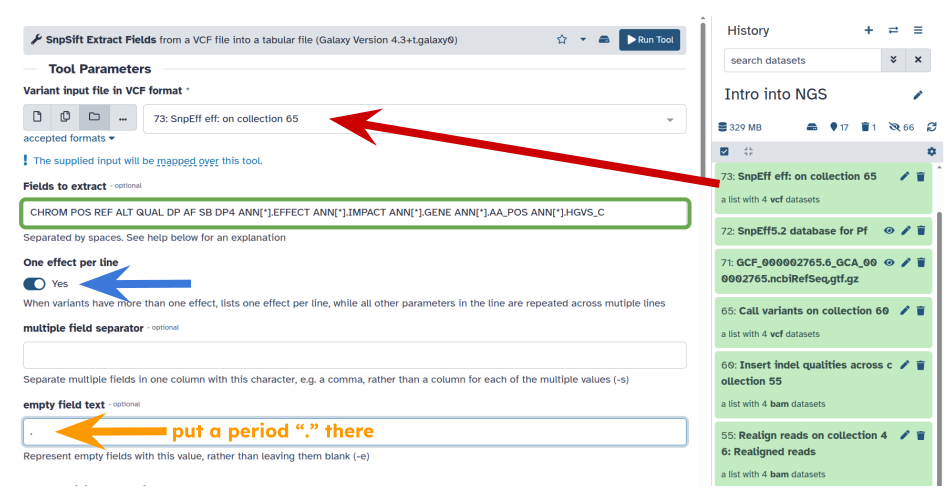
>
{: .hands_on}

Let's explain which fields we are extracting:

| # | Field | Meaning |
|---|----------|-------------|
| 1 | `CHROM` | Name of the chromosome |
| 2 | `POS` | Position within that chromosome |
| 3 | `REF` | Reference allele (the one present in the *reference* |
| 4 | `ALT` | Alternative allele (the one observed in the reads) |
| 5 | `QUAL` | Variant quality computed by **lowfreq** |
| 6 | `DP` | Read depth (the number of reads covering this position) |
| 7 | `AF` | Alternative allele frequency |
| 8 | `SB` | Strand bias P-value from Fisher's exact test calculated by lofreq |
| 9 | `DP4` | Depth for Forward Ref Counts, Reverse Ref Counts, Forward Alt Counts, Reverse Alt Counts |
| 10 | `ANN[*].EFFECT` | Expected effect of the variant on the protein |
| 11 | `ANN[*].IMPACT` | Expected impact of the phenotype |
| 12 | `ANN[*].GENE` | Name of the gene containing the variant |
| 13 | `ANN[*].AA_POS `| Amino acid position within the gene affected by this variant |
| 14 | `ANN[*].HGVS_C` | Nucleotide change in nucleotide coordinates relative to the start of the coding region |
| 15 | `ANN[*].HGVS_P` | Amino acid change in amino acid coordinates relative to the start of the protein |

### Collapse data into a single dataset

We now extracted meaningful fields from VCF datasets. But they still exist as a collection. To move towards secondary analysis we need to **collapse** this collection into a single dataset. "Collapsing" simply concatenates the content of collection elements and attaches sample IDs, so that we know which line in the concatenated file corresponds to which sample:

 is pre-pended with the element's name such as 1, 2, 3, and 4.")

For more information about collapsing collections, please watch the following YouTube video:



> <hands-on-title>Collapse a collection</hands-on-title>
>
> Run  with the following parameters:
>    -  *"Collection of files to collapse into single dataset"*: Output of  from the previous step (<font color="red">red arrow</font>).
>    - "*Keep one header line*": `Yes` (<font color="green">green arrow</font>)
>    - "*Prepend File name*": `Yes` (<font color="blue">blue arrow</font>)
>    - "*Where to add dataset name*": `Same line and each line in dataset` (<font color="orange">orange outline</font>)
>
> 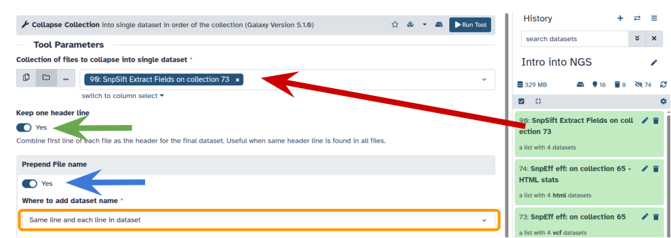
>
{: .hands_on}

You can see that this tool takes lines from all collection elements (in this tutorial we have two), add element name as the first column, and pastes everything together. So, if we have a collection as an input:

> <code-in-title>A collection with two items (<b>15</b> columns)</code-in-title>
> A collection element named `ERR042228.fq`
>
>```
>NC_004318.2   676399   C    T     1344.0   45   0.977778   0   0,0,23,22   missense_variant    MODERATE PF3D7_0415200   914     c.2740G>A    p.Glu914Lys
>NC_004318.2   676631   C    T     2000.0   60   0.966667   0   0,0,32,27   synonymous_variant  LOW      PF3D7_0415200   836     c.2508G>A    p.Lys836Lys
>```
>
>A collection element named `ERR042232.fq`:
>
>```
>NC_004318.2   671152   G    A     1324.0   42   0.952381   0   0,1,20,21   synonymous_variant  LOW      PF3D7_0415100   90      c.270G>A   p.Gln90Gln
>NC_004318.2   671641   A    T     1300.0   43   0.906977   0   0,0,16,27   missense_variant    MODERATE PF3D7_0415100   253     c.759A>T   p.Glu253Asp
>```
{: .code-in}

We will have a single dataset as the output:

> <code-out-title>A single dataset (<b>16</b> columns)</code-out-title>
>
>then the  will produce this:
>
>```
>ERR042228.fq NC_004318.2   676399   C    T     1344.0   45   0.977778   0   0,0,23,22   missense_variant    MODERATE PF3D7_0415200   914     c.2740G>A    p.Glu914Lys
>ERR042228.fq NC_004318.2   676631   C    T     2000.0   60   0.966667   0   0,0,32,27   synonymous_variant  LOW      PF3D7_0415200   836     c.2508G>A    p.Lys836Lys
>ERR042232.fq NC_004318.2   671152   G    A     1324.0   42   0.952381   0   0,1,20,21   synonymous_variant  LOW      PF3D7_0415100   90      c.270G>A   p.Gln90Gln
>ERR042232.fq NC_004318.2   671641   A    T     1300.0   43   0.906977   0   0,0,16,27   missense_variant    MODERATE PF3D7_0415100   253     c.759A>T   p.Glu253Asp
>```
{: .code-out}

you can see that this added the first column with dataset ID taken from collection element name!

## Anything interesting?

These data are now ready for downstream analysis. () showed that *P.faciparum* strains that have an amino acid change at residue 108 of the *dhfr* gene have increased resistance to pyrimethamine. In *P. faciparum* 3D7 (we uploaded genome of this particular strain earlier in this tutorial) this gene is also called [PF3D7_0417200](https://www.ncbi.nlm.nih.gov/gene/9221804). So let's look for `PF3D7_0417200` in our results. For this we use a tool called :

> <hands-on-title>Filter SNPs with gene of interest</hands-on-title>
>
> Run  with the following parameters:
>    - "Filter"*: Output of  from the previous step (<font color="red">red arrow</font>).
>    - "*With following condition*": (<font color="green">green arrow</font>):
>```
>c13=='PF3D7_0417200'
>```
>    - "*Number of header lines to skip*": `1` (<font color="blue">blue outline</font>).
>
> 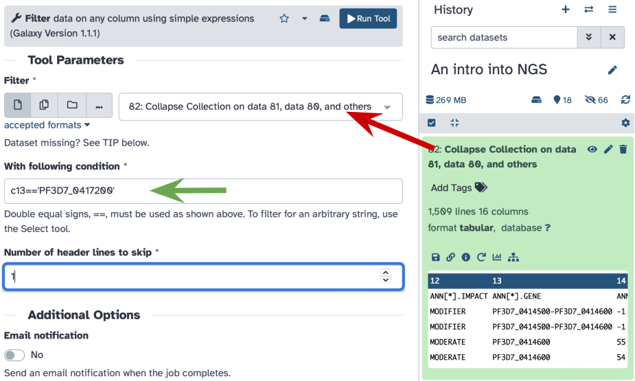
>
{: .hands_on}

The output will look like this:

| Sample       | CHROM       |    POS | REF   | ALT   |   QUAL |   DP |       AF |   SB | DP4         | ANN[*].EFFECT    | ANN[*].IMPACT   | ANN[*].GENE   |   ANN[*].AA_POS | ANN[*].HGVS_C   | ANN[*].HGVS_P   |
|:-------------|:------------|-------:|:------|:------|-------:|-----:|---------:|-----:|:------------|:-----------------|:----------------|:--------------|----------------:|:----------------|:----------------|
| <font color="red">ERR042228.fq</font> | NC_004318.2 | 748410 | G     | A     |   2335 |   70 | 0.957143 |    0 | 0,0,30,40   | missense_variant | MODERATE        | PF3D7_0417200 |             108 | c.323G>A        | <font color="red"><b>p.Ser108Asn</b></font>     |
| ERR636028.fq | NC_004318.2 | 748239 | A     | T     |   6941 |  194 | 0.984536 |    0 | 0,0,117,77  | missense_variant | MODERATE        | PF3D7_0417200 |              51 | c.152A>T        | p.Asn51Ile      |
| ERR636028.fq | NC_004318.2 | 748262 | T     | C     |   7627 |  211 | 0.981043 |    0 | 0,0,117,93  | missense_variant | MODERATE        | PF3D7_0417200 |              59 | c.175T>C        | p.Cys59Arg      |
| <font color="red">ERR636028.fq</font> | NC_004318.2 | 748410 | G     | A     |   8292 |  233 | 0.991416 |    0 | 0,0,112,121 | missense_variant | MODERATE        | PF3D7_0417200 |             108 | c.323G>A        | <font color="red"><b>p.Ser108Asn</b></font>     |
| ERR636434.fq | NC_004318.2 | 748262 | T     | C     |     67 |  214 | 0.018692 |    0 | 113,97,2,2  | missense_variant | MODERATE        | PF3D7_0417200 |              59 | c.175T>C        | p.Cys59Arg      |


Here you can see that while three samples in out dataset contain mutations in *dhfr* (`PF3D7_0417200`) gene only two---ERR042228 and ERR636028---have amino acid replacements at position 108. They are highlighted in red. If you scroll all the way to the right you will that these are Serine to Asparagine changes. This these two individuals are likely resistant to pyrimethamine treatment.

# Conclusion

Now you know how to perform a fairly sophisticated variant analysis. Large scale malaria (or any other pathogen) efforts surveying hundreds of thousands of individuals are done in an exactly the same manner: sequence, map, call variants. Try it on your own data!


