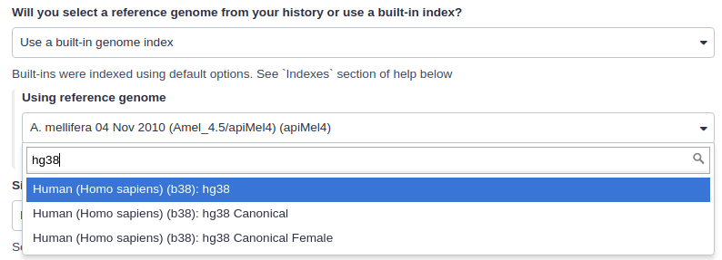
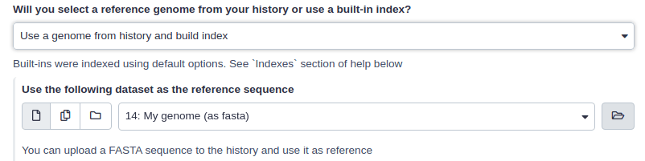
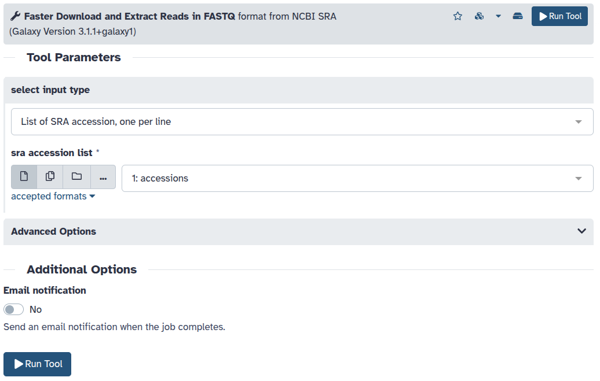
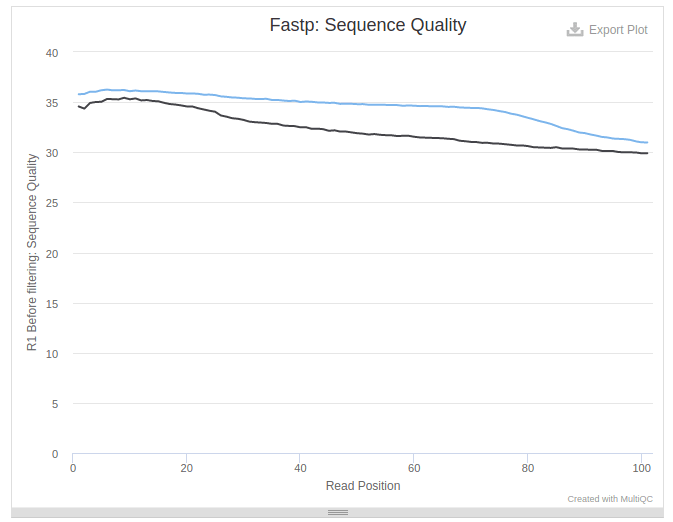
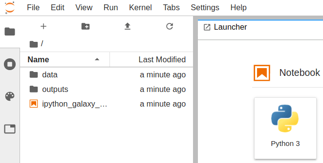
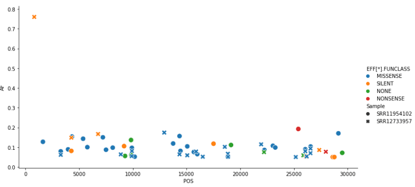

In this section, we will look at practical aspects of manipulation of next-generation sequencing data. We will start with the FASTQ format produced by most sequencing machines and will finish with the SAM/BAM format representing mapped reads.

# The Story

To make this tutorial as realistic as possible we wanted to use an example from real world. We will start with four sequencing datasets (fastq files) representing four individuals positive for malaria---a life-threatening disease caused by *Plasmodium* parasites, transmitted to humans through the bites of infected female *Anopheles* mosquitoes. 

Our goal is to understand whether the malaria parasite ([*Plasmodium falciparum*](https://brc-analytics.dev.clevercanary.com/data/organisms/5833)) infecting these individuals is resistant to [Pyrimethamine](https://en.wikipedia.org/wiki/Pyrimethamine)---an antimalaria drug. Resistance to Pyrimethamine is conferred by a mutation in `PF3D7_0417200` (*dhfr*) gene (). An outline of our analysis looks like this:

, to mapping (converting them to BAM format), and downstream processing such as variant calling (which proiduces VCF datasets). Finally data is aggregated and merged to create the final result").

<!--

## Introduction: Data and Methods

### FASTQ manipulation and quality control

[FASTQ](https://en.wikipedia.org/wiki/FASTQ_format) is not a very well defined format. In the beginning various manufacturers of sequencing instruments were free to interpret FASTQ as they saw fit, resulting in a multitude of FASTQ flavors. This variation stemmed primarily from different ways of encoding quality values as described [on the Wikipedia article for FASTQ](https://en.wikipedia.org/wiki/FASTQ_format) (below you will find an explanation of quality scores and their meaning). Today, the FASTQ Sanger version () of the format is considered to be the standard form of FASTQ. Galaxy is using FASTQ Sanger as the only legitimate input for downstream processing tools and provides a number of utilities for converting FASTQ files () into this form (see **FASTQ Quality Control** section of Galaxy tools whic is available on some usegalaxy.* instances).

The FASTQ format looks like this:


```

@M02286:19:000000000-AA549:1:1101:12677:1273 1:N:0:23
CCTACGGGTGGCAGCAGTGAGGAATATTGGTCAATGGACGGAAGTCTGAACCAGCCAAGTAGCGTGCAG
+
ABC8C,:@F:CE8,B-,C,-6-9-C,CE9-CC--C-<-C++,,+;CE<,,CD,CEFC,@E9<FCFCF?9
@M02286:19:000000000-AA549:1:1101:15048:1299 1:N:0:23
CCTACGGGTGGCTGCAGTGAGGAATATTGGACAATGGTCGGAAGACTGATCCAGCCATGCCGCGTGCAG
+
ABC@CC77CFCEG;F9<F89<9--C,CE,--C-6C-,CE:++7:,CF<,CEF,CFGGD8FFCFCFEGCF
@M02286:19:000000000-AA549:1:1101:11116:1322 1:N:0:23
CCTACGGGAGGCAGCAGTAGGGAATCTTCGGCAATGGACGGAAGTCTGACCGAGCAACGCCGCGTGAGT
+
AAC<CCF+@@>CC,C9,F9C9@9-CFFFE@7@:+CC8-C@:7,@EFE,6CF:+8F7EFEEF@EGGGEEE

```

Each sequencing read is represented by four lines:

1. `@` followed by read ID and optional information about sequencing run
2. sequenced bases
3. `+` (optionally followed by the read ID and some additional info)
4. Quality scores for each base of the sequence encoded as [ASCII symbols](https://en.wikipedia.org/wiki/ASCII)

## Paired end data

It is common to prepare pair-end and mate-pair sequencing libraries. This is highly beneficial for a number of applications discussed in subsequent topics. For now, let's just briefly discuss what these are and how they manifest themselves in FASTQ form.

 the actual ends of rather short DNA molecules (less than 1kb) are determined, while for mate pair sequencing (right) the ends of long molecules are joined and prepared in special sequencing libraries. In these mate pair protocols, the ends of long, size-selected molecules are connected with an internal adapter sequence (i.e. linker, yellow) in a circularization reaction. The circular molecule is then processed using restriction enzymes or fragmentation. Fragments are enriched for the linker and outer library adapters are added around the two combined molecule ends. The internal adapter can then be used as a second priming site for an additional sequencing reaction in the same orientation or sequencing can be performed from the second adapter, from the reverse strand (From Ph.D. dissertation by <a href="https://ul.qucosa.de/api/qucosa%3A11231/attachment/ATT-0/">Martin Kircher</a>).")


Thus in both cases (paired-end and mate-pair) a single physical piece of DNA (or RNA in the case of RNA-seq) is sequenced from two ends and so generates two reads. These can be represented as separate files (two FASTQ files with first and second reads) or a single file were reads for each end are interleaved. Here are examples:

#### Two single files

File 1

```
 @M02286:19:000000000-AA549:1:1101:12677:1273 1:N:0:23
 CCTACGGGTGGCAGCAGTGAGGAATATTGGTCAATGGACGGAAGTCT
 +
 ABC8C,:@F:CE8,B-,C,-6-9-C,CE9-CC--C-<-C++,,+;CE
 @M02286:19:000000000-AA549:1:1101:15048:1299 1:N:0:23
 CCTACGGGTGGCTGCAGTGAGGAATATTGGACAATGGTCGGAAGACT
 +
 ABC@CC77CFCEG;F9<F89<9--C,CE,--C-6C-,CE:++7:,CF
```

File 2

```
@M02286:19:000000000-AA549:1:1101:12677:1273 2:N:0:23
CACTACCCGTGTATCTAATCCTGTTTGATACCCGCACCTTCGAGCTTA
+
--8A,CCE+,,;,<CC,,<CE@,CFD,,C,CFF+@+@CCEF,,,B+C,
@M02286:19:000000000-AA549:1:1101:15048:1299 2:N:0:23
CACTACCGGGGTATCTAATCCTGTTCGCTCCCCACGCTTTCGTCCATC
+
-6AC,EE@::CF7CFF<<FFGGDFFF,@FGGGG?F7FEGGGDEFF>FF
```

> <comment-title>Read order is important</comment-title>
> Note that read IDs are **identical** in two files and they are listed in **the same** order. In some cases read IDs in the first and second file may be appended with `/1` and `/2` tags, respectively (however, this is not guaranteed).
{: .comment}

#### Interleaved file

```
@1/1
AGGGATGTGTTAGGGTTAGGGTTAGGGTTAGGGTTAGGGTTAGGGTTA
+
EGGEGGGDFGEEEAEECGDEGGFEEGEFGBEEDDECFEFDD@CDD<ED
@1/2
CCTAACCCTAACCCTAACCCTAACCCTAACCCTAACCCTAACCCTAAC
+
GHHHDFDFGFGEGFBGEGGEGEGGGHGFGHFHFHHHHHHHEF?EFEFF
@2/1
AGGGATGTGTTAGGGTTAGGGTTAGGGTTAGGGTTAGGGTTAGGGTTA
+
HHHHHHEGFHEEFEEHEEHHGGEGGGGEFGFGGGGHHHHFBEEEEEFG
@2/2
CCTAACCCTAACCCTAACCCTAACCCTAACCCTAACCCTAACCCTAAC
+
HHHHHHHHHHHHHGHHHHHHGHHHHHHHHHHHFHHHFHHHHHHHHHHH
```

Here, the first and the second reads are identified with `/1` and `/2` tags.

> <comment-title>FASTQ format is a loose standard</comment-title>
> FASTQ format is not strictly defined and its variations will always cause headache for you. See [this page](https://www.ncbi.nlm.nih.gov/sra/docs/submitformats/) for more information.
{: .comment}

### What are base qualities?

As we've seen above, FASTQ datasets contain two types of information:

- *sequence of the read*
- *base qualities* for each nucleotide in the read.

The base qualities allow us to judge how trustworthy each base in a sequencing read is. The following excerpt from an excellent [tutorial](https://web.archive.org/web/20240422192254/https://chagall.med.cornell.edu/RNASEQcourse/Intro2RNAseq.pdf) by Friederike D&uuml;ndar, Luce Skrabanek, Paul Zumbo explains what base qualities are:

> <comment-title>From "Introduction to differential gene expression analysis using RNA-seq"</comment-title>
> Illumina sequencing is based on identifying the individual nucleotides by the fluorescence signal emitted upon their incorporation into the growing sequencing read. Once the fluorescence intensities are extracted and translated into the four letter code. The deduction of nucleotide sequences from the images acquired during sequencing is commonly referred to as base calling.
><br><br>
> Due to the imperfect nature of the sequencing process and limitations of the optical instruments, base calling will always have inherent uncertainty. This is the reason why FASTQ files store the DNA sequence of each read together with a position-specific quality score that represents the error probability, i.e., how likely it is that an individual base call may be incorrect. The score is called [Phred score](http://www.phrap.com/phred/), $$Q$$, which is proportional to the probability $$p$$ that a base call is incorrect, where $$Q = −10lg(p)$$. For example, a Phred score of 10 corresponds to one error in every ten base calls ($$Q = −10lg(0.1)$$), or 90% accuracy; a Phred score of 20 corresponds to one error in every 100 base calls, or 99% accuracy. A higher Phred score thus reflects higher confidence in the reported base.
><br><br>
> To assign each base a unique score identifier (instead of numbers of varying character length), Phred scores are typically represented as ASCII characters. At http://ascii-code.com/ you can see which characters are assigned to what number.
><br><br>
> For raw reads, the range of scores will depend on the sequencing technology and the base caller used (Illumina, for example, used a tool called Bustard, or, more recently, RTA). Unfortunately, Illumina has been anything but consistent in how they calculated and ASCII-encoded the Phred score (see below)! In addition, Illumina now allows Phred scores for base calls with as high as 45, while 41 used to be the maximum score until the HiSeq X. This may cause issues with downstream sapplications that expect an upper limit of 41.
{: .comment}


Base call quality scores are represented with the Phred range. Different Illumina (formerly Solexa) versions
used different scores and ASCII offsets. Starting with Illumina format 1.8, the score now represents the standard
Sanger/Phred format that is also used by other sequencing platforms and the sequencing archives.

")

### Assessing data quality

One of the first steps in the analysis of NGS data is seeing how good the data actually is. [FastqQC](https://www.bioinformatics.babraham.ac.uk/projects/fastqc/) is the most famous tool allowing you to assess the quality of FASTQ datasets (and deciding whether to blame or not to blame whoever has done sequencing for you). [Falco](https://github.com/smithlabcode/falco) is an alternative tool for quality control. Falco is a improved implementation of FastQC for high throughput sequence quality control.

 for two datasets: <b>A</b> and <b>B</b>. The A dataset has long reads (250 bp) and very good quality profile with no qualities dropping below phred score of 30. The B dataset is significantly worse with ends of the reads dipping below phred score of 20. The B reads may need to be trimmed for further processing. <tt>Falco</tt> will generate almost the same reports about the quality of the reads.")


The image above can be found at https://docs.google.com/drawings/d/1OPkHZQ7flhmHeE6RCO2ZQTQY3GfnJfr7flbeU5Mx-Po/edit?usp=sharing

## Mapping your data

Mapping of NGS reads against reference sequences is one of the key steps of the analysis. Now it is time to see how this is done in practice. Below is a list of key publications highlighting mainstream mapping tools:

- 2009 Bowtie 1 - ()
- 2012 Bowtie 2 - ()
- 2009 BWA - ()
- 2010 BWA - ()
- 2013 BWA-MEM - ()

For a more recent review, please read ().


### Mapping against a pre-computed genome index

Mappers usually compare reads against a reference sequence that has been transformed into a highly accessible data structure called genome index (or sometimes transcriptome index). Such indexes should be generated before mapping begins. Galaxy instances typically store indexes for a number of publicly available genome builds. Later in this tutorial, we are going to use a tool called . The screenshots in thie tutorial are from this tool, however, other tools that perform reference-based reads mapping have a similar input requirements.

|                     |
|<small>Mapping against a pre-computed index in Galaxy.</small>|

For example, the image above shows indexes for `hg38` version of the human genome. You can see that there are actually three choices: (1) `hg38`, (2) `hg38 canonical` and (3) `hg38 canonical female`. The `hg38` contains all chromosomes as well as all unplaced contigs. The `hg38 canonical` does not contain unplaced sequences and only consists of chromosomes 1 through 22, X, Y, and mitochondria. The
`hg38 canonical female` contains everything from the canonical set with the exception of chromosome Y.

### What if pre-computed index does not exist?

If Galaxy does not have a genome you need to map against, you can upload your genome sequence as a FASTA or FASTA.gz file and use it in the mapper directly as shown below (**Will you select a reference genome from your history or use a built-in index?** is set to `Use a genome from history and build index`).

|  |
|<small>Mapping against a pre-computed index in Galaxy </small>|

In this case tutorial, will first create an index from this dataset and then run mapping analysis against it.


### SAM/BAM data

The [SAM/BAM](https://samtools.github.io/hts-specs/SAMv1.pdf) format is an accepted standard for storing aligned reads (it can also store unaligned reads and some mappers such as  are accepting unaligned BAM as input). The binary form of the format (BAM) is compact and can be rapidly searched (if indexed). In Galaxy, BAM datasets are always indexed (accompanies by a .bai file) and sorted in coordinate order. In the following discussion, we once again rely on [tutorial](https://web.archive.org/web/20240422192254/https://chagall.med.cornell.edu/RNASEQcourse/Intro2RNAseq.pdf) by Friederike D&uuml;ndar, Luce Skrabanek, and Paul Zumbo.

The Sequence Alignment/Map (SAM) format is, in fact, a generic nucleotide alignment format that describes the alignment of sequencing reads (or query sequences) to a reference. The human readable, TAB delimited SAM files can be compressed into the Binary Alignment/Map format. These BAM files are bigger than simply gzipped SAM files, because they have been optimized for fast random access rather than size reduction. Position-sorted BAM files can be indexed so that all reads aligning to a locus can be efficiently retrieved without loading the entire file into memory.

As shown below, SAM files typically contain a short header section and a very long alignment section where each row represents a single read alignment. The following sections will explain the SAM format in a bit more detail. For the most comprehensive and updated information go to [SAM/BAM and related specifications GitHub repository.](https://github.com/samtools/hts-specs)

 and their lengths (LN)). The vast majority of lines within a SAM file typically correspond to read alignments where each read is described by the 11 mandatory entries (black font) and a variable number of optional fields (grey font). From <a href="https://web.archive.org/web/20240422192254/https://chagall.med.cornell.edu/RNASEQcourse/Intro2RNAseq.pdf">a tutorial</a> by Friederike D&uuml;ndar, Luce Skrabanek, and Paul Zumbo.")

#### SAM Header

The header section includes information about how the alignment was generated and stored. All lines in the header section are tab-delimited and begin with the “@” character, followed by tag:value pairs, where tag is a two-letter string that defines the content and the format of value. For example, the “@SQ” line in the header section contains the information about the names and lengths of the **reference** sequences to which the reads were aligned. For a hypothetical organism with three chromosomes of length 1,000 bp, the SAM header should contain the following three lines:

```
@SQ SN:chr1 LN:1000
@SQ SN:chr2 LN:1000
@SQ SN:chr3 LN:1000
```

#### SAM alignment section

The optional header section is followed by the alignment section where each line corresponds to one sequenced read. For each read, there are 11 mandatory fields that always appear in the same order:

```
<QNAME> <FLAG> <RNAME> <POS> <MAPQ> <CIGAR> <MRNM> <MPOS> <ISIZE> <SEQ> <QUAL>
```

If the corresponding information is unavailable or irrelevant, field values can be ‘0’ or ‘*’ (depending on the field, see below), but they cannot be missing! After the 11 mandatory fields, a variable number of optional fields can be present. Here is an example of one single line of a real-life SAM file (you may need to scroll sideways):

```
ERR458493 .552967 16 chrI 140 255 12 M61232N37M2S * 0 0 CCACTCGTTCACCAGGGCCGGCGGGCTGATCACTTTATCGTGCATCTTGGC BB?HHJJIGHHJIGIIJJIJGIJIJJIIIGHBJJJJJJHHHHFFDDDA1+B NH:i:1 HI:i:1 AS:i:41 nM:i:2
```

The following table explains the format and content of each field. The `FLAG`, `CIGAR`, and the optional fields (marked with pale blue background) are explained in more detail below. The number of optional fields can vary widely between different SAM files and even between reads within in the same file. The field types marked in blue are explained in more detail in the text below.


### `FLAG` field

The FLAG field encodes various pieces of information about the individual read, which is particularly important for Paired-Enmd (PE) reads. It contains an integer that is generated from a sequence of bits (0, 1). This way, answers to multiple binary (Yes/No) questions can be compactly stored as a series of bits, where each of the single bits can be addressed and assigned separately.

The following table gives an overview of the different properties that can be encoded in the FLAG field. The developers of the SAM format and samtools tend to use the hexadecimal encoding as a means to refer to the different bits in their documentation. The value of the FLAG field in a given SAM file, however, will always be the decimal representation of the sum of the underlying binary values (as shown in Table below, row 2).

. A bit is set if the corresponding state is true. For example, if a read is paired, <tt>0x1</tt> will be set, returning the decimal value of 1. Therefore, all <tt>FLAG</tt> values associated with paired reads must be uneven decimal numbers. Conversely, if the <tt>0x1</tt> bit is unset (= read is not paired), no assumptions can be made about <tt>0x2</tt>, <tt>0x8</tt>, <tt>0x20</tt>, <tt>0x40</tt> and <tt>0x80</tt> because they refer to paired reads. From <a href="https://web.archive.org/web/20240422192254/https://chagall.med.cornell.edu/RNASEQcourse/Intro2RNAseq.pdf">a tutorial</a> by Friederike D&uuml;ndar, Luce Skrabanek, and Paul Zumbo.")

In a run with single reads, the flags you most commonly see are:

- 0: This read has been mapped to the forward strand. (None of the bit-wise flags have been set.)
- 4: The read is unmapped (`0x4` is set).
- 16: The read is mapped to the reverse strand (`0x10` is set)

(`0x100`, `0x200` and `0x400` are not used by most aligners/mappers, but could, in principle be set for single reads.) Some common `FLAG` values that you may see in a PE experiment include:


|**69** (= 1 + 4 + 64) | The read is paired, is the first read in the pair, and is unmapped.|
|**77** (= 1 + 4 + 8 + 64) | The read is paired, is the first read in the pair, both are unmapped.|
|**83** (= 1 + 2 + 16 + 64) | The read is paired, mapped in a proper pair, is the first read in the pair, and it is mapped to the reverse strand.|
|**99** (= 1 + 2 + 32 + 64) | The read is paired, mapped in a proper pair, is the first read in the pair, and its mate is mapped to the reverse strand.|
|**133** (= 1 + 4 + 128) | The read is paired, is the second read in the pair, and it is unmapped.|
|**137** (= 1 + 8 + 128) | The read is paired, is the second read in the pair, and it is mapped while its mate is not.|
|**141** (= 1 + 4 + 8 + 128) | The read is paired, is the second read in the pair, but both are unmapped.|
|**147** (= 1 + 2 + 16 + 128) | The read is paired, mapped in a proper pair, is the second read in the pair, and mapped to the reverse strand.|
|**163** (= 1 + 2 + 32 + 128) | The read is paired, mapped in a proper pair, is the second read in the pair, and its mate is mapped to the reverse strand.|

A useful website for quickly translating the FLAG integers into plain English explanations like the ones shown above is: https://broadinstitute.github.io/picard/explain-flags.html

### `CIGAR` string

`CIGAR` stands for *Concise Idiosyncratic Gapped Alignment Report*. This sixth field of a SAM file
contains a so-called CIGAR string indicating which operations were necessary to map the read to the reference sequence at that particular locus.

The following operations are defined in CIGAR format (also see figure below):

- **M** - Alignment (can be a sequence match or mismatch!)
- **I** - Insertion in the read compared to the reference
- **D** - Deletion in the read compared to the reference
- **N** - Skipped region from the reference. For mRNA-to-genome alignments, an N operation represents an intron. For other types of alignments, the interpretation of N is not defined.
- **S** - Soft clipping (clipped sequences are present in read); S may only have H operations between them and the ends of the string
- **H** - Hard clipping (clipped sequences are NOT present in the alignment record); can only be present as the first and/or last operation
- **P** - Padding (silent deletion from padded reference)
- **=** - Sequence match (not widely used)
- **X** - Sequence mismatch (not widely used)

The sum of lengths of the **M**, **I**, **S**, **=**, **X** operations must equal the length of the read. Here are some examples:


### Optional fields

Following the eleven mandatory SAM file fields, the optional fields are presented as key-value
pairs in the format of `<TAG>:<TYPE>:<VALUE>`, where `TYPE` is one of:

- `A` - Character
- `i` - Integer
- `f` - Float number
- `Z` - String
- `H` - Hex string

The information stored in these optional fields will vary widely depending on the mapper and new tags can be added freely. In addition, reads within the same SAM file may have different numbers of optional fields, depending on the program that generated the SAM file. Commonly used optional tags include:

- `AS:i` - Alignment score
- `BC:Z` - Barcode sequence
- `HI:i` - Match is i-th hit to the read
- `NH:i` - Number of reported alignments for the query sequence
- `NM:i` - Edit distance of the query to the reference
- `MD:Z` - String that contains the exact positions of mismatches (should complement the CIGAR string)
- `RG:Z` - Read group (should match the entry after ID if @RG is present in the header.

Thus, for example, we can use the NM:i:0 tag to select only those reads which map perfectly to the reference (i.e., have no mismatches). While the optional fields listed above are fairly standardized, tags that begin with `X`, `Y`, and `Z` are reserved for particularly free usage and will never be part of the official SAM file format specifications. `XS`, for example, is used by TopHat (an RNA-seq analysis tool we will discuss later) to encode the strand information (e.g., `XS:A:+`) while Bowtie2 and BWA use `XS:i:` for reads with multiple alignments to store the alignment score for the next-best-scoring alignment (e.g., `XS:i:30`).

### Read Groups

One of the key features of SAM/BAM format is the ability to label individual reads with readgroup tags. This allows pooling results of multiple experiments into a single BAM dataset. This significantly simplifies downstream logistics: instead of dealing with multiple datasets one can handle just one. Many downstream analysis tools such as variant callers are designed to recognize readgroup data and output results on per-readgroup basis.

One of the best descriptions of BAM readgroups is on [GATK support site](https://gatkforums.broadinstitute.org/discussion/1317/collected-faqs-about-bam-files). We have gratefully stolen two tables describing the most important readgroup tags - `ID`, `SM`, `LB`, and `PL` - from GATK forum and provide them here:


GATK forum also provides the following example:


### Manipulating SAM/BAM datasets

We support four major toolsets for processing of SAM/BAM datasets:

 * [DeepTools](https://deeptools.readthedocs.io) - a suite of user-friendly tools for the visualization, quality control and normalization of data from deep-sequencing DNA sequencing experiments.
 * [SAMtools](http://www.htslib.org/) - various utilities for manipulating alignments in the SAM/BAM format, including sorting, merging, indexing and generating alignments in a per-position format.
 * [BEDtools](https://bedtools.readthedocs.io/en/latest/) - a toolkit originally written for BED format was expanded for analysis of BAM and VCF datasets.
 * [Picard](https://broadinstitute.github.io/picard/) - a set of Java tools for manipulating high-throughput sequencing data (HTS) data and formats.

## The challenge of read duplicates

### PCR duplicates

Preparation of sequencing libraries (at least at the time of writing) for technologies such as Illumina (used in this example) involves PCR amplification. It is required to generate sufficient number of sequencing templates so that a reliable detection can be performed by base callers. Yet, PCR has its biases, which are especially profound in cases of multitemplate PCR used for construction of sequencing libraries ().

. This indicates that many molecules are only observed for deeper sequencing while other molecules are available at higher frequencies. Analyzing length (left middle panel) and GC content (left lower panel) patterns as well as the combination (right panel) shows higher PCR duplicate counts for a GC content between 30% to 70% as well as for shorter molecules compared to longer molecules. This effect may be due to an amplification bias from the polymerase or the cluster generation process necessary for Illumina sequencing. (From Ph.D. dissertation by <a href="https://ul.qucosa.de/api/qucosa%3A11231/attachment/ATT-0/">Martin Kircher</a>)."

Duplicates can be identified based on their outer alignment coordinates or using sequence-based clustering. One of the common ways for identification of duplicate reads is the `MarkDuplicates` utility from [Picard](https://broadinstitute.github.io/picard/command-line-overview.html) package, which we will use later in this tutorial.

### Sampling coincidence duplicates

However, one has to be careful when removing duplicates in cases when the sequencing targets are small (e.g., sequencing of bacterial, viral, or organellar genomes as well as amplicons). This is because when sequencing target is small reads will have the same coordinates by chance and not because of PCR amplification issues. The figure below illustrates the fine balance between estimates allele frequency, coverage, and variation in insert size (from ()):

 bias determined by coverage and insert size variance. Reads are paired-end and read length is 76. The insert size distribution is modeled as a Gaussian distribution with mean at 200 and standard deviation shown on the X-axis. The true VAF is 0.05. The darkness at each position indicates the magnitude of the bias in the VAF ().")


```

https://zenodo.org/records/15354240/files/ERR042228_F.fq.gz
https://zenodo.org/records/15354240/files/ERR042228_R.fq.gz
https://zenodo.org/records/15354240/files/ERR042232_F.fq.gz
https://zenodo.org/records/15354240/files/ERR042232_R.fq.gz
https://zenodo.org/records/15354240/files/ERR636028_F.fq.gz
https://zenodo.org/records/15354240/files/ERR636028_R.fq.gz
https://zenodo.org/records/15354240/files/ERR636434_F.fq.gz
https://zenodo.org/records/15354240/files/ERR636434_R.fq.gz

```


# Getting NGS data to Galaxy

You can upload data in Galaxy using one of these ways:

## From your computer

This works well for small files because web browser do not work well with for big files:




## From NCBI short read archive

Finally, datasets can be uploaded directly from NCBI's Short Read Archive (SRA):



> <comment-title></comment-title>
>
> We will use this last approach, getting data from NCBI SRA, in this tutorial.
>
{: .comment}

-->

# From reads to variants

In this tutorial we will use data from four infected individuals sequenced within the [MalariaGen](https://www.malariagen.net/data_package/open-dataset-plasmodium-falciparum-v70/) effort. These correspond to the following samples:

| Accession | Location |
|------------|------------|
| [ERR636434](https://www.ncbi.nlm.nih.gov/sra/?term=ERR636434) | Ivory coast |
| [ERR636028](https://www.ncbi.nlm.nih.gov/sra/?term=ERR636028) | Ivory coast |
| [ERR042232](https://www.ncbi.nlm.nih.gov/sra/?term=ERR042232) | Colombia |
| [ERR042228](https://www.ncbi.nlm.nih.gov/sra/?term=ERR042228) | Colombia |

The accessions correspond to datasets stored in the [Sequence Read Archive](https://www.ncbi.nlm.nih.gov/sra) at NCBI. Our goal to test whether malaria parasite infecting these individual is resistant to pyrimethamine drug treatment or not. In order to reach this conclusion we need:

1. Upload the data
2. Assess the quality of the reads
3. Map reads against a suitable reference genome for *Plasmodium falsiparum*
4. Filter mapped reads and remove duplicates
5. Call variants
6. Find variants falling within a gene conferring the resistance against pyrimethamine.

Let's do that 🚀

## Upload data into Galaxy

For this tutorial we downsampled the data (made datasets smaller) to make sure that you can go through it quickly. To upload the data in Galaxy follow these steps:

First, let's create a list of accession to be downloaded as a dataset in Galaxy's history:

> <hands-on-title>Upload accessions into Galaxy</hands-on-title>
>
> 1. Go to your Galaxy instance of choice such as one of the [UseGalaxy.* instances](https://galaxyproject.org/usegalaxy/) or any other.
> 1. Click *Upload Data* button:
> 
> 1. In the dialog box that would appear click "*Paste/Fetch*" button
> 
> 1. Paste the following accessions into the box (red box in the image below):
> ```
> https://zenodo.org/records/15354240/files/ERR042228_F.fq.gz
> https://zenodo.org/records/15354240/files/ERR042228_R.fq.gz
> https://zenodo.org/records/15354240/files/ERR042232_F.fq.gz
> https://zenodo.org/records/15354240/files/ERR042232_R.fq.gz
> https://zenodo.org/records/15354240/files/ERR636028_F.fq.gz
> https://zenodo.org/records/15354240/files/ERR636028_R.fq.gz
> https://zenodo.org/records/15354240/files/ERR636434_F.fq.gz
> https://zenodo.org/records/15354240/files/ERR636434_R.fq.gz
> ```
> 1. Change datatype to `fastqsanger.gz` (green box in the image below) 
> 
> 1. Click *Start* button
> 1. Close dialog by pressing **Close** button
> This will create eight datasets in your history on the right side of the interface:
> 
> 
{: .hands_on}

## Bundle data into *Collection*

We are going to perform exatly the same analysis on all eight datasets. So it does not make sence to repeat the same operation eight times (imagine if you had a hundred or a thousand datasets). So before we go any further we will 


You can think of the dataset we just uploaded as "manifest". You can upload any number of dataset from four, as is here, to thousands. However in you upload large numbers of datasets from SRA it is better to use a dedicated [accession download workflow](https://iwc.galaxyproject.org/workflow/parallel-accession-download-main/). It is more robust when dealing with large number of samples. Now let's tell Galaxy to upload actual data corresponding to these uploads:

> <hands-on-title>Get data from SRA</hands-on-title>
>
> Run  with the following parameters:
>
> 
>  
{: .hands_on}

This step will generate four history items:

1. Pair-end data
1. Single-end data
1. Other data
1. Fasterq-dump

The first three items are actually *collections* of datasets. *Collections* in Galaxy are logical groupings of datasets that reflect the semantic relationships between them in the experiment / analysis. In this case, the tool creates separate collections for paired-end reads, single reads, and *other*. (For more information on Collections see the [Collections tutorial]().

Explore the collections by first **clicking** on the collection name in the history panel. This takes you inside the collection and shows you the datasets in it.  You can then navigate back to the outer level of your history.

Once  finishes transferring data (all boxes are green), we are ready to analyze it.

## Assessing the quality of the data with `fastp` and `multiqc`

Removing sequencing adapters improves alignments and variant calling.  can automatically detect widely used sequencing adapters.

> <hands-on-title>Running `fastp`</hands-on-title>
>
> Run  with the following parameters:
> 
>  
>
> Fastp modifies files by removing standard Illumina adapters and applies a number of quality filters generating "Cleaned up data" shown above) as well as HTML and JSON reports as three collections: 
>
>  
>
{: .hands_on}

<!-- 
Original editable versions of the above images are here:

https://docs.google.com/drawings/d/1l4qF5NKITpJVJKL8mzoLpnvRWaeZpgLyM5Ygi_j-GFc/edit?usp=sharing and
https://docs.google.com/drawings/d/1cKDe3i5pPXyGoLXkVsTxVyKz_BF-8ETVDzU5qVe6g1s/edit?usp=sharing

-->

You can click on individual HTML reports to get an idea about the quality of the data and degree of "cleanup". However, clicking on each dataset individually can become problematic if the number of datasets is large (you don't want to click on hundred datasets, for example). We can visualize the QC data provided by `fastp` by feeding its JSON output to `multiqc`.

> <hands-on-title>Running `multiqc` on `fastp` JSON data</hands-on-title>
>
> Run  with the following parameters:
> 
>  
>
> `multiqc` will produce two outputs, but the one you care about has a work "Webpage" in it:
>
>  
>
> Click on the  (eye) icon and you will the QC report.
>
{: .hands_on}


ffff


## Alignment with  **Map with BWA-MEM**

 is a widely used sequence aligner for short-read sequencing datasets such as those we are analysing in this tutorial.

> <hands-on-title>Map sequencing reads to reference genome</hands-on-title>
>
> Run  with the following parameters:
>    - *"Will you select a reference genome from your history or use a built-in index?"*: `Use a genome from history and build index`
>        -  *"Use the following dataset as the reference sequence"*: `output` (SARS-CoV-2 Genome)
>    - *"Single or Paired-end reads"*: `Paired Collection`
>        - *"Select a paired collection"*: `output_paired_collection` (output of )
>    - *"Set read groups information?"*: `Do not set`
>    - *"Select analysis mode"*: `1.Simple Illumina mode`
>
{: .hands_on}

## Remove duplicates with **MarkDuplicates**

 removes duplicate sequences originating from library preparation artifacts and sequencing artifacts. It is important to remove these artefactual sequences to avoid artificial overrepresentation of single molecule.

> <hands-on-title>Remove duplicates</hands-on-title>
>
> Run  with the following parameters:
>    -  *"Select SAM/BAM dataset or dataset collection"*: `bam_output` (output of )
>    - *"If true do not write duplicates to the output file instead of writing them with appropriate flags set"*: `Yes`
>
{: .hands_on}

## Generate alignment statistics with **Samtools stats**

After the duplicate marking step above we can generate statistic about the alignment we have generated.

> <hands-on-title>Generate alignment statistics</hands-on-title>
>
> 1.  with the following parameters:
>    -  *"BAM file"*: output of 
>    - *"Set coverage distribution"*: `No`
>    - *"Output"*: `One single summary file`
>    - *"Filter by SAM flags"*: `Do not filter`
>    - *"Use a reference sequence"*: `No`
>    - *"Filter by regions"*: `No`
{: .hands_on}

## **Realign reads** with lofreq viterbi

 corrects misalignments around insertions and deletions. This is required in order to accurately detect variants.

> <hands-on-title>Realign reads around indels</hands-on-title>
>
> Run  with the following parameters:
>    -  *"Reads to realign"*: output of 
>    - *"Choose the source for the reference genome"*: `History`
>        -  *"Reference"*: `SARS-CoV-2 Genome`
>    - In *"Advanced options"*:
>        - *"How to handle base qualities of 2?"*: `Keep unchanged`
{: .hands_on}

## Add indel qualities with lofreq **Insert indel qualities**

This step adds indel qualities into our alignment file. This is necessary in order to call variants using **Call variants** with l.

> <hands-on-title>Add indel qualities</hands-on-title>
>
> Run  with the following parameters:
>    -  *"Reads"*: Output of 
>    - *"Indel calculation approach"*: `Dindel`
>        - *"Choose the source for the reference genome"*: `History`
>            -  *"Reference"*: `SARS-CoV-2 Genome`
>
{: .hands_on}

## Call Variants using lofreq **Call variants**

We are now ready to call variants.

> <hands-on-title>Call variants</hands-on-title>
>
> Run  with the following parameters:
>    -  *"Input reads in BAM format"*: Output of 
>    - *"Choose the source for the reference genome"*: `History`
>        -  *"Reference"*: `SARS-CoV-2 Genome`
>    - *"Call variants across"*: `Whole reference`
>    - *"Types of variants to call"*: `SNVs and indels`
>    - *"Variant calling parameters"*: `Configure settings`
>        - In *"Coverage"*:
>            - *"Minimal coverage"*: `10`
>        - In *"Base-calling quality"*:
>            - *"Minimum baseQ"*: `20`
>            - *"Minimum baseQ for alternate bases"*: `20`
>        - In *"Mapping quality"*:
>            - *"Minimum mapping quality"*: `20`
>    - *"Variant filter parameters"*: `Preset filtering on QUAL score + coverage + strand bias (lofreq call default)`
{: .hands_on}

The output of this step is a collection of VCF files that can be visualized in a genome browser.

## Annotate variant effects with **SnpEff eff: annotate variants for SARS-CoV-2**

We will now annotate the variants we called in the previous step with the effect they have on the SARS-CoV-2 genome.

> <hands-on-title>Annotate variant effects</hands-on-title>
>
> Run  with the following parameters:
>    -  *"Sequence changes (SNPs, MNPs, InDels)"*: Output of 
>    - *"Output format"*: `VCF` (only if input is VCF)
>    - *"Create CSV report, useful for downstream analysis (-csvStats)"*: `Yes`
>    - *"Annotation options"*: ``
>    - *"Filter output"*: ``
>    - *"Filter out specific Effects"*: `No`
>
{: .hands_on}

The output of this step is a VCF file with added variant effects.

## Create table of variants using **SnpSift Extract Fields**

We will now select various effects from the VCF and create a tabular file that is easier to understand for humans.

> <hands-on-title>Create table of variants</hands-on-title>
>
> Run  with the following parameters:
>    -  *"Variant input file in VCF format"*: Output of 
>    - *"Fields to extract"*: `CHROM POS REF ALT QUAL DP AF SB DP4 EFF[*].IMPACT EFF[*].FUNCLASS EFF[*].EFFECT EFF[*].GENE EFF[*].CODON`
>    - *"One effect per line"*: `Yes`
>    - *"empty field text"*: `.`
>
{: .hands_on}

Interesting variants include the C to T variant at position 14408 (14408C/T) in SRR11772204, 28144T/C in SRR11597145 and 25563G/T in SRR11667145.

## Summarize data with **MultiQC**

We will now summarize our analysis with  , which generates a beautiful report for our data.

> <hands-on-title>Summarize data</hands-on-title>
>
> Run  with the following parameters:
>    - In *"Results"*:
>        - *"Insert Results"*
>            - *"Which tool was used generate logs?"*: `fastp`
>                - *"Output of fastp"*: `report_json` (output of **fastp**)
>        - *"Insert Results"*
>            - *"Which tool was used generate logs?"*: `Picard`
>                - In *"Picard output"*:
>                    - *"Insert Picard output"*
>                        - *"Type of Picard output?"*: `Markdups`
>                        - *"Picard output"*: `metrics_file` (output of **MarkDuplicates**)
{: .hands_on}

The above state allows us to judge the quality of the data. In this particular case data is not bad as quality values never drop below 30:




## Collapse data into a single dataset

We now extracted meaningful fields from VCF datasets. But they still exist as a collection. To move towards secondary analysis we need to **collapse** this collection into a single dataset. For more information about collapsing collections, please watch the following YouTube video:



> <hands-on-title>Collapse a collection</hands-on-title>
>
> Run  with the following parameters:
>    -  *"Collection of files to collapse into single dataset"*: Output of 
>    - "*Keep one header line*": `Yes`
>    - "*Prepend File name*": `Yes`
>    - "*Where to add dataset name*": `Same line and each line in dataset`
{: .hands_on}

You can see that this tool takes lines from all collection elements (in this tutorial we have two), add element name as the first column, and pastes everything together. So, if we have a collection as an input:

> <code-in-title>A collection with two items</code-in-title>
> A collection element named `SRR11954102`
>
>```
>NC_045512.2  84 PASS  C T  960.0  28  1.0       0 0,0,15,13 MODIFIER  NONE  INTERGENIC
>NC_045512.2 241 PASS  C T 2394.0  69  0.971014  0 0,0,39,29 MODIFIER  NONE  INTERGENIC
>```
>
>A collection element named `SRR12733957`:
>
>```
>NC_045512.2 241 PASS  C T 1954.0  63  0.888889  0 0,0,42,21 MODIFIER  NONE  INTERGENIC
>NC_045512.2 823 PASS  C T 1199.0  50  0.76      3 5,6,13,26 LOW       LOW   LOW
>```
{: .code-in}

We will have a single dataset as the output:

> <code-out-title>A single dataset</code-out-title>
>
>then the  will produce this:
>
>```
>SRR11954102 NC_045512.2  84 PASS  C T  960.0  28  1.0       0 0,0,15,13 MODIFIER  NONE  INTERGENIC
>SRR11954102 NC_045512.2 241 PASS  C T 2394.0  69  0.971014  0 0,0,39,29 MODIFIER  NONE  INTERGENIC
>SRR12733957 NC_045512.2 241 PASS  C T 1954.0  63  0.888889  0 0,0,42,21 MODIFIER  NONE  INTERGENIC
>SRR12733957 NC_045512.2 823 PASS  C T 1199.0  50  0.76      3 5,6,13,26 LOW       LOW   LOW
>```
{: .code-out}

you can see that added a column with dataset ID taken from collection element name.

## Anything interesting?

These data are now ready for downstream analysis. One of the interesting things about these data is that it contains some of the mutations identified in the [B.1.1.7](https://cov-lineages.org/global_report_B.1.1.7.html) lineage. For example, dataset `SRR12733957` contains a nonsense mutation (change for legitimate codon specifying an amino acid to a stop codon) in ORF8a:

```
SRR12733957 NC_045512.2 27972 PASS  C T 56.0  39  0.076923  0 7,29,0,3  HIGH  NONSENSE  STOP_GAINED ORF8  Caa/Taa
```

This is interesting because these datasets were collected well before B.1.1.7 became widely spread. Can you find more mutations here in these data?


<!--

# Let's do it: A peek at secondary analysis in Galaxy

After a dataset is converted into an intermediary result (such as variant table generated during the previous step) by primary analysis, this intermediary data needs to be processed further to produce biological insight. IN Galaxy this can be done by starting a Jupyter notebook directly on history datasets. Here is a short demo.

> <warning-title>Jupyter is in Beta</warning-title>
> Jupyter notebook functionality in Galaxy is currently in Beta. It means that we are still working on it and its implementation is constantly changing. Be aware of this fact.
{: .warning}

> <hands-on-title>Analyze data in Jupyter from Galaxy</hands-on-title>
>
> 1. Open  **Interactive Jupyter Notebook** from section **Interactive Tools**
> 1. *"Do you already have a notebook?"*: `Start with a fresh notebook`
> 1. *"Include data into the environment"*: Select history dataset containing the output of the collection collapse step
> 1. Click `Run Tool`
> 1. It will create a dataset in the history that will be permanently yellow (running)
> 1. You will see the following banner:
>
>    
>
> 1. Click on `User menu`. You may need to wait a bit (go get coffee quickly). In the end you will a `Jupyter Interactive Tool` link. Click on it.
> 1. This will open a new tab with a fully functional Jupyter environment:
> 
> 1. Start a new notebook by clicking on Python 3 image. This will start a fresh notebook.
> 1. Type `!ls data/` in the first cell and you will see a file from Galaxy history.
> 1. Upgrade [Pandas](https://pandas.pydata.org/) and [Seaborn](https://seaborn.pydata.org/index.html): `!pip install -U pandas seaborn`
> 1. Read data into a dataframe:
>
>    ```
>    import pandas as pd
>    df = pd.read_csv('data/Collapsed_collection',sep='\t')
>    # Drop duplicates is required to get rid of SnpEff artifacts
>    df = df.drop_duplicates(ignore_index=True)
>    ```
>     Note that your file may be named differently! Use it exact name instead of `Collapsed_collection` above.
>
> 1. Filter variants with intermediate frequencies between 20% and 80%:
>
>    ```
>    df = df[ (df['AF']>=0.05) & (df['AF']<=0.8) ]
>    ```
>
> 1. Plot relationship between variant position and alternative allele frequency:
>
>    ```
>    import seaborn as sns
>    %matplotlib inline
>    sns.relplot(x='POS',y='AF',hue='EFF[*].FUNCLASS',data=df,height=5,aspect=2,s=100,style='Sample')
>    ```
>
>    This plot shows how variants are distributed across the SARS-CoV-2 genome:
>    
> 1. Play with it!
{: .hands_on}


# Let's do it: A peek at secondary analysis in Google Colab

We can also import data directly into Google Colab:

> <hands-on-title>Analyze data in Google Colab</hands-on-title>
>
> 1. Expand history dataset containing the output of the collection collapse step
> 1. Right click on  (disk) icon and copy link to clipboard
> 1. Go to https://colab.research.google.com/ and create a new notebook
> 1. Type `!wget <link>` where you must replace `<link>` with the URL you copied into clipboard at the previous step
> 1. This will copy this dataset into your Colaboratory environment
> 1. See the dataset file by typing `!ls` in the Colab cell
> 1. You will see a file with a name that looks something like this: `'display?to_ext=tabular'`
> 1. Rename it into something palatable:
>```
>!mv 'display?to_ext=tabular' data.tsv`
>```
> 1. Read data into a [Pandas](https://pandas.pydata.org/) dataframe:
> ```
> import pandas as pd
> df = pd.read_csv('data.tsv',sep='\t')
> # Drop duplicates is required to get rid of SnpEff artifacts
> df = df.drop_duplicates(ignore_index=True)
>```
> 1. Filter variants with intermediate frequencies between 20% and 80%:
>```
>df = df[ (df['AF']>=0.05) & (df['AF']<=0.8) ]
>```
> 1. Plot relationship between variant position and alternative allele frequency:
>```
>import seaborn as sns
>sns.relplot(x='POS',y='AF',hue='EFF[*].FUNCLASS',data=df,height=5,aspect=2,s=100,style='Sample')
>```
> This plot shows how variants are distributed across the SARS-CoV-2 genome:
> 
> 1. Play with it!
{: .hands_on}

-->

# Conclusion


Congratulations, you now know how to import sequence data from the SRA and how to run an example analysis on these datasets.