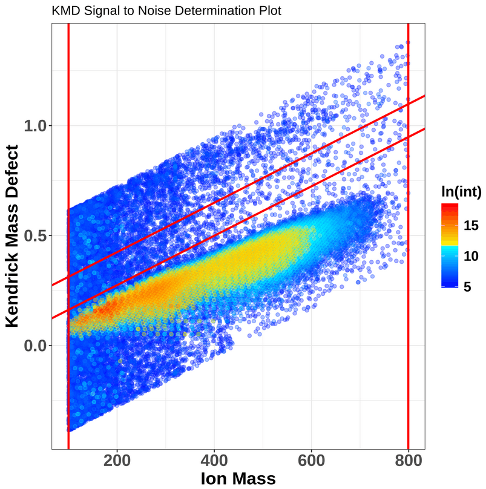

This training covers the multi-element molecular formula (MF) assignment using the MFAssignR tool. It was originally developed by  and contains several functions including noise assessment, isotope filtering, internal mass recalibration and formula assignment. 

MFAssignR workflow is composed of several steps:

1. Run KMDNoise() to determine the noise level for the data.
2. Check effectiveness of S/N threshold using SNplot().
3. Use IsoFiltR() to identify potential 13C and 34S isotope masses.
4. Using the S/N threshold, and the two data frames output from IsoFiltR(), run MFAssignCHO() to assign MF with C, H, and O to assess the mass accuracy.
5. Use RecalList() to generate a list of the potential recalibrant series.
6. After choosing recalibrant series, use Recal() to recalibrate the mass lists.
7. Assign MF to the recalibrated mass list using MFAssign().
8. Check the output plots from MFAssign() to evaluate the quality of the assignments.

Let's dive now into the individual steps and explain all the inputs, parameter settings and outputs.

> <agenda-title></agenda-title>
>
> In this tutorial, we will cover:
>
> 1. TOC
> {:toc}
>
{: .agenda}

# Data import

At the very beginning, we need to import the dataset we will be using. MFAssignR requires an input data, which have as the first column mass, in the second column there is intensity and optionally, the third column can contain retention time. In our case, we will start with a raw mass list, which was measured in a negative ESI mode.

> <hands-on-title> Upload data </hands-on-title>
>
> 1. Create a new history for this tutorial and give it a name.
>
>    
>
> 2. Import the files from [Zenodo]({{ https://zenodo.org/records/13768009 }}):
>
>    ```
>    https://zenodo.org/api/records/13768009/files/mfassignr_input.txt/content
>    ```
>
>    
>
>    
>
> 3. Set the format of the dataset to 'tabular'. 
>
>    
>
> 4. We can now view our dataset, and ensure, that it has a correct input format.
>
>
{: .hands_on}

# Noise assessment

Having our input data in the workspace, we can now start with the analysis!

The first step is the noise assessment, which allows us to avoid both false positives (if noise is underestimated) and false negatives (if noise is overestimated). For this purpose, we will be using two functions: **MFAssignR HistNoise** and **MFAssignR KMDNoise** and we can additionally visualize the result using the **MFAssignR SNplot** function. The main goal is to find a signal-to-noise (S/N) threshold, which we will use later on. 

## MFAssignR HistNoise

We will firstly assess the noise using the HistNoise function. This function attempts to find a point where noise peaks give way to analyte signal using a histogram of the natural log intensities in the measured raw mass spectrum. 

> <hands-on-title> Run MFAssignR HistNoise </hands-on-title>
>
> 1.  with the following parameters:
>
> -   *"Input data"*: `mfassignr_input.txt` (Input dataset)
> -  *"SNthreshold"*: `0`
> -  *"Binwidth of histogram"*: `0.01`
>
>
>    > <warning-title>Important!</warning-title>
>    >
>    > Always run the HistNoise on the raw data itself and not on already denoised data, in that case it will not work.
>    {: .warning}
>
{: .hands_on}

On the output, we can see we got a **noise level** and a **histogram**, where by red a noise is depicted in red, and signal is depicted in blue. HistNoise can fail to separate the distributions if the analyte signal tapers into the noise. In that case, it is better to use the KMDNoise function.

> <question-title></question-title>
>
> 1. What is the noise level estimated by HistNoise function?
>
> > <solution-title></solution-title>
> >
> > 1. Using our model data, the estimated noise is 317.3483.
> >
> {: .solution}
>
{: .question}

## MFAssignR KMDNoise

When the KMD (Kendrick Mass Defect) is calculated for all peaks in the mass spectrum, there will be clear separation of more intense analyte peaks, and low intense noise peaks. To isolate the noise region, we can use the KMD limits of chemically feasible molecular formulas in conjunction with the calculation of slope of a KMD plot using a linear equation y = 0,1132x + b, where y is the KMD value, x the measured ion mass and b an y-intercept. To provide more accurate assessment, two lines are with different y-intercepts are selected (we will set this lower and upper y-limit below). Once the noise region is isolated, a noise level will be estimated as average intensity of peaks within that region.

When running the function, we can stick with the default values: upper limit for the y intercept is set to 0.2, so that it does not interact with any potentially double-charged peaks, lower limit of the y-intercept value is set to 0.05 to ensure no analyte peaks are incorporated into the noise estimation. Both upper and lower x intercept limits are optional and will be set to minimum and maximum mass in the spectrum if not specified. 

> <hands-on-title> Run MFAssignR KMDNoise </hands-on-title>
>
> 1.  with the following parameters:
>
>-  *"Input data"*: `mfassignr_input.txt` (Input dataset)
>-  *"upper limit for the y intercept"*: `0.2`
>-  *"lower limit for the y intercept"*: `0.05`
>   
>
{: .hands_on}

The function outputs a **KMD plot**, where the noise area is separated in between red lines, and a **noise estimate**. The noise estimate we can then multiply with a user-defined signal-to-noise ratio, typically 3-10 in order to remove low intensity m/z values.



> <question-title></question-title>
>
> 1. What is the noise level estimated by KMDNoise function?
>
> > <solution-title></solution-title>
> >
> > 1. Using our model data, the estimated noise is 346.0706.
> >
> >
> {: .solution}
>
{: .question}

## MFAssignR SNplot

We can now check the effectiveness of the S/N threshold using SNplot, which plots the mass spectrum with the masses below and above the chosen threshold, where the noise is indicated by red.

The *cut* parameter can be computed as estimated noise level * user defined S/N threshold, so if we got 346.0706 as a noise level from KMDnoise, we can multiply it by 6, which gives us 2076.
*Mass* parameter defines a centerpoint to look at the mass spectrum.
*Parameter window.x* sets the +/- range around the mass centerpoint, default is 0.5
*Parameter window.y* sets the y-axis for the plot, when cut is multiplied by this value.

> <hands-on-title> Plot the SNplot </hands-on-title>
>
> 1.  with the following parameters:
>    -  *"Input data"*: `mfassignr_input.txt` (Input dataset)
>    - *"cut"*: `2076.0`
>    - *"mass"*: `301.0`
>    - *"window.x"*: `50.0`
>
{: .hands_on}


Based on the SNplot, we can see that the noise - indicated in red - is effectively separated by the horizontal line, meaning we can further use the 346 value as the S/N threshold.


## Sub-step with **MFAssignR IsoFiltR**

> <hands-on-title> Task description </hands-on-title>
>
> 1.  with the following parameters:
>    -  *"Input Peak Data"*: `output` (Input dataset)
>    - *"Signal-to-Noise Ratio"*: `346.0`
>
>    ***TODO***: *Check parameter descriptions*
>
>    ***TODO***: *Consider adding a comment or tip box*
>
>    > <comment-title> short description </comment-title>
>    >
>    > A comment about the tool or something else. This box can also be in the main text
>    {: .comment}
>
{: .hands_on}

***TODO***: *Consider adding a question to test the learners understanding of the previous exercise*

> <question-title></question-title>
>
> 1. Question1?
> 2. Question2?
>
> > <solution-title></solution-title>
> >
> > 1. Answer for question1
> > 2. Answer for question2
> >
> {: .solution}
>
{: .question}

## Sub-step with **MFAssignR MFAssignCHO**

> <hands-on-title> Task description </hands-on-title>
>
> 1.  with the following parameters:
>    -  *"Data frame of monoisotopic masses"*: `mono_out` (output of **MFAssignR IsoFiltR** )
>    -  *"Data frame of isotopic masses"*: `iso_out` (output of **MFAssignR IsoFiltR** )
>    - *"Ion mode"*: `negative`
>    - *"Estimated noise"*: `346.0`
>    - *"Lower limit of molecular mass to be assigned"*: `50.0`
>
>    ***TODO***: *Check parameter descriptions*
>
>    ***TODO***: *Consider adding a comment or tip box*
>
>    > <comment-title> short description </comment-title>
>    >
>    > A comment about the tool or something else. This box can also be in the main text
>    {: .comment}
>
{: .hands_on}

***TODO***: *Consider adding a question to test the learners understanding of the previous exercise*

> <question-title></question-title>
>
> 1. Question1?
> 2. Question2?
>
> > <solution-title></solution-title>
> >
> > 1. Answer for question1
> > 2. Answer for question2
> >
> {: .solution}
>
{: .question}

## Sub-step with **MFAssignR RecalList**

> <hands-on-title> Task description </hands-on-title>
>
> 1.  with the following parameters:
>    -  *"Input data"*: `Unambig` (output of **MFAssignR MFAssignCHO** )
>
>    ***TODO***: *Check parameter descriptions*
>
>    ***TODO***: *Consider adding a comment or tip box*
>
>    > <comment-title> short description </comment-title>
>    >
>    > A comment about the tool or something else. This box can also be in the main text
>    {: .comment}
>
{: .hands_on}

***TODO***: *Consider adding a question to test the learners understanding of the previous exercise*

> <question-title></question-title>
>
> 1. Question1?
> 2. Question2?
>
> > <solution-title></solution-title>
> >
> > 1. Answer for question1
> > 2. Answer for question2
> >
> {: .solution}
>
{: .question}

## Sub-step with **MFAssignR FindRecalSeries**

> <hands-on-title> Task description </hands-on-title>
>
> 1.  with the following parameters:
>    -  *"Input data"*: `recal_series` (output of **MFAssignR RecalList** )
>
>    ***TODO***: *Check parameter descriptions*
>
>    ***TODO***: *Consider adding a comment or tip box*
>
>    > <comment-title> short description </comment-title>
>    >
>    > A comment about the tool or something else. This box can also be in the main text
>    {: .comment}
>
{: .hands_on}

***TODO***: *Consider adding a question to test the learners understanding of the previous exercise*

> <question-title></question-title>
>
> 1. Question1?
> 2. Question2?
>
> > <solution-title></solution-title>
> >
> > 1. Answer for question1
> > 2. Answer for question2
> >
> {: .solution}
>
{: .question}

## Sub-step with **MFAssignR Recal**

> <hands-on-title> Task description </hands-on-title>
>
> 1.  with the following parameters:
>    -  *"Input data (Output from MFAssign)"*: `Unambig` (output of **MFAssignR MFAssignCHO** )
>    -  *"Calibration series (Output from RecalList)"*: `final_series` (output of **MFAssignR FindRecalSeries** )
>    -  *"Peaks dataframe (Mono from IsoFiltR)"*: `mono_out` (output of **MFAssignR IsoFiltR** )
>    -  *"Isopeaks dataframe (Iso from IsoFiltR)"*: `iso_out` (output of **MFAssignR IsoFiltR** )
>    - *"Ion mode"*: `negative`
>    - *"Estimated noise"*: `346.0`
>    - *"Mass windows used for the segmented recalibration"*: `50.0`
>
>    ***TODO***: *Check parameter descriptions*
>
>    ***TODO***: *Consider adding a comment or tip box*
>
>    > <comment-title> short description </comment-title>
>    >
>    > A comment about the tool or something else. This box can also be in the main text
>    {: .comment}
>
{: .hands_on}

***TODO***: *Consider adding a question to test the learners understanding of the previous exercise*

> <question-title></question-title>
>
> 1. Question1?
> 2. Question2?
>
> > <solution-title></solution-title>
> >
> > 1. Answer for question1
> > 2. Answer for question2
> >
> {: .solution}
>
{: .question}

## Sub-step with **MFAssignR MFAssign**

> <hands-on-title> Task description </hands-on-title>
>
> 1.  with the following parameters:
>    -  *"Data frame of monoisotopic masses"*: `Mono` (output of **MFAssignR Recal** )
>    -  *"Data frame of isotopic masses"*: `Iso` (output of **MFAssignR Recal** )
>    - *"Ion mode"*: `negative`
>    - *"Estimated noise"*: `346.0`
>    - *"Lower limit of molecular mass to be assigned"*: `50.0`
>
>    ***TODO***: *Check parameter descriptions*
>
>    ***TODO***: *Consider adding a comment or tip box*
>
>    > <comment-title> short description </comment-title>
>    >
>    > A comment about the tool or something else. This box can also be in the main text
>    {: .comment}
>
{: .hands_on}

***TODO***: *Consider adding a question to test the learners understanding of the previous exercise*

> <question-title></question-title>
>
> 1. Question1?
> 2. Question2?
>
> > <solution-title></solution-title>
> >
> > 1. Answer for question1
> > 2. Answer for question2
> >
> {: .solution}
>
{: .question}


## Re-arrange

To create the template, each step of the workflow had its own subsection.

***TODO***: *Re-arrange the generated subsections into sections or other subsections.
Consider merging some hands-on boxes to have a meaningful flow of the analyses*

# Conclusion

Sum up the tutorial and the key takeaways here. We encourage adding an overview image of the
pipeline used.