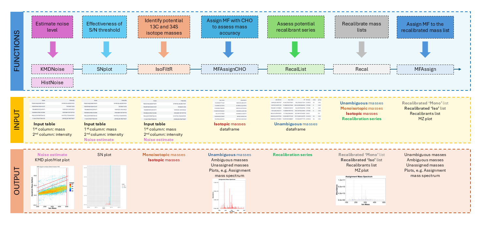
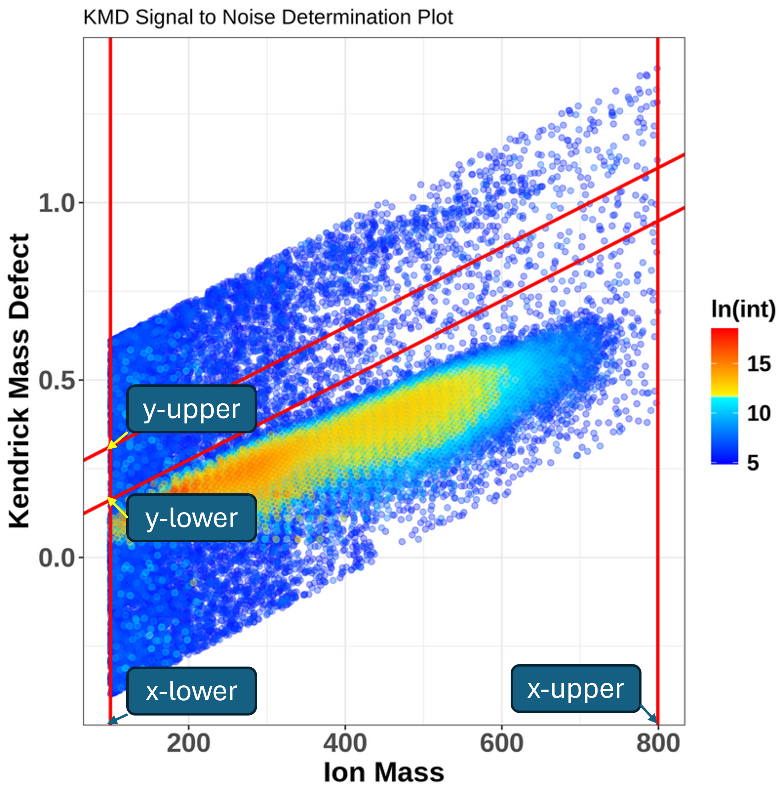
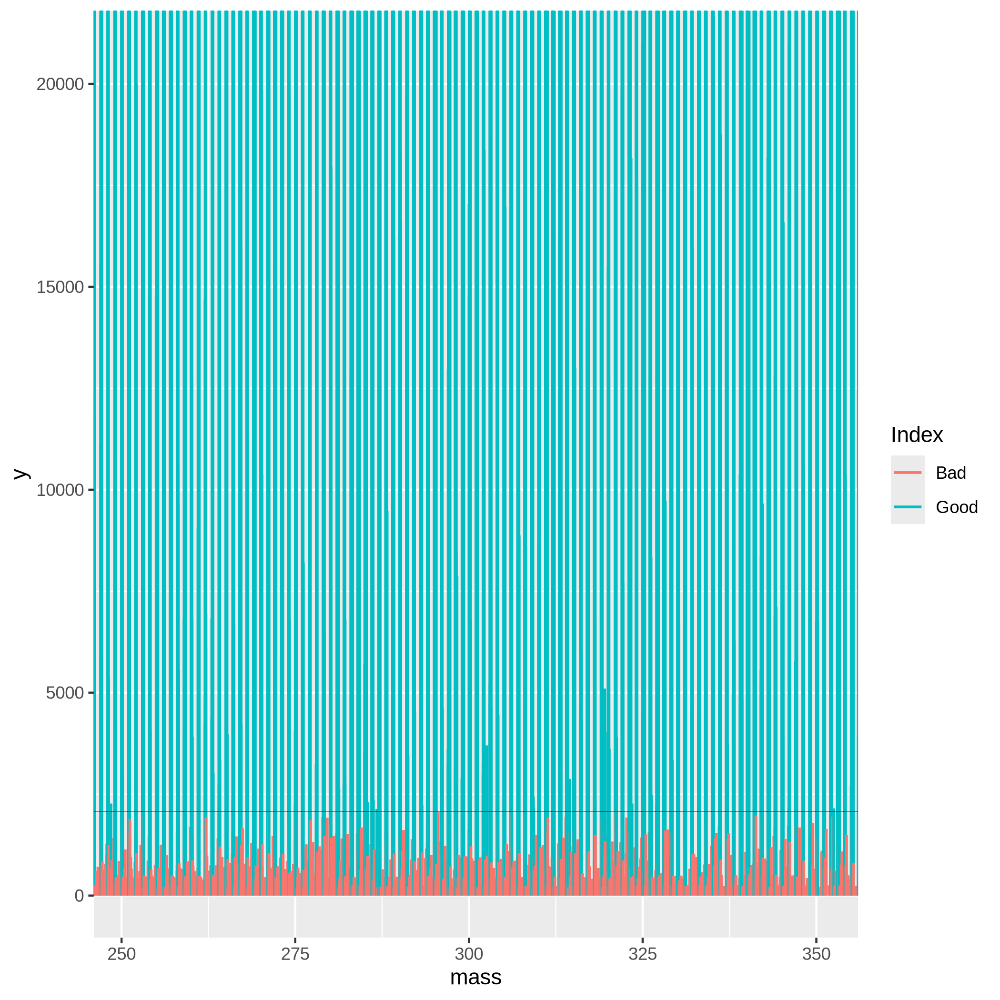
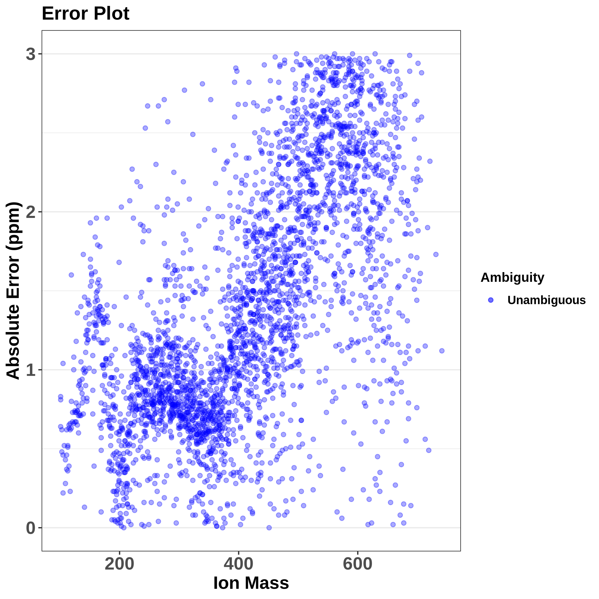
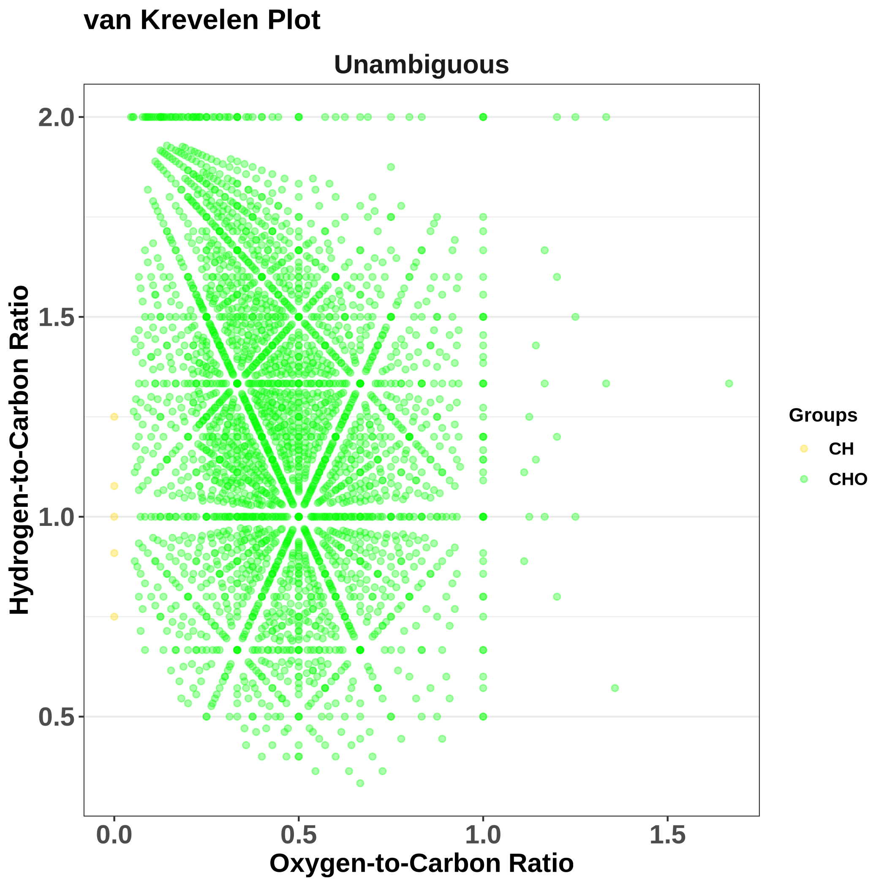
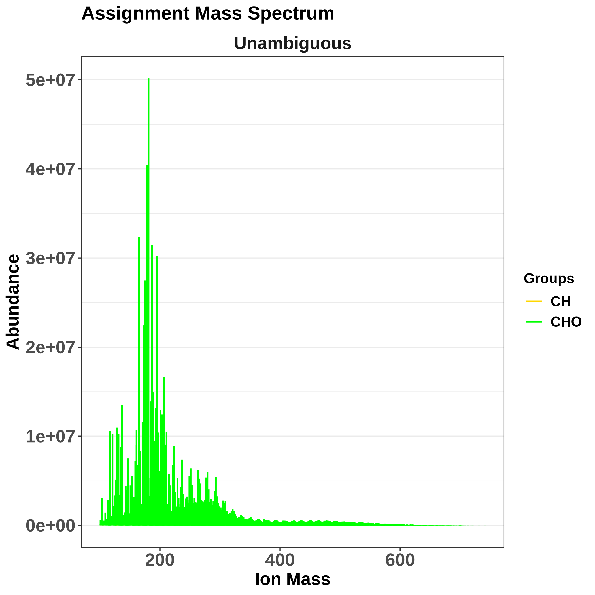
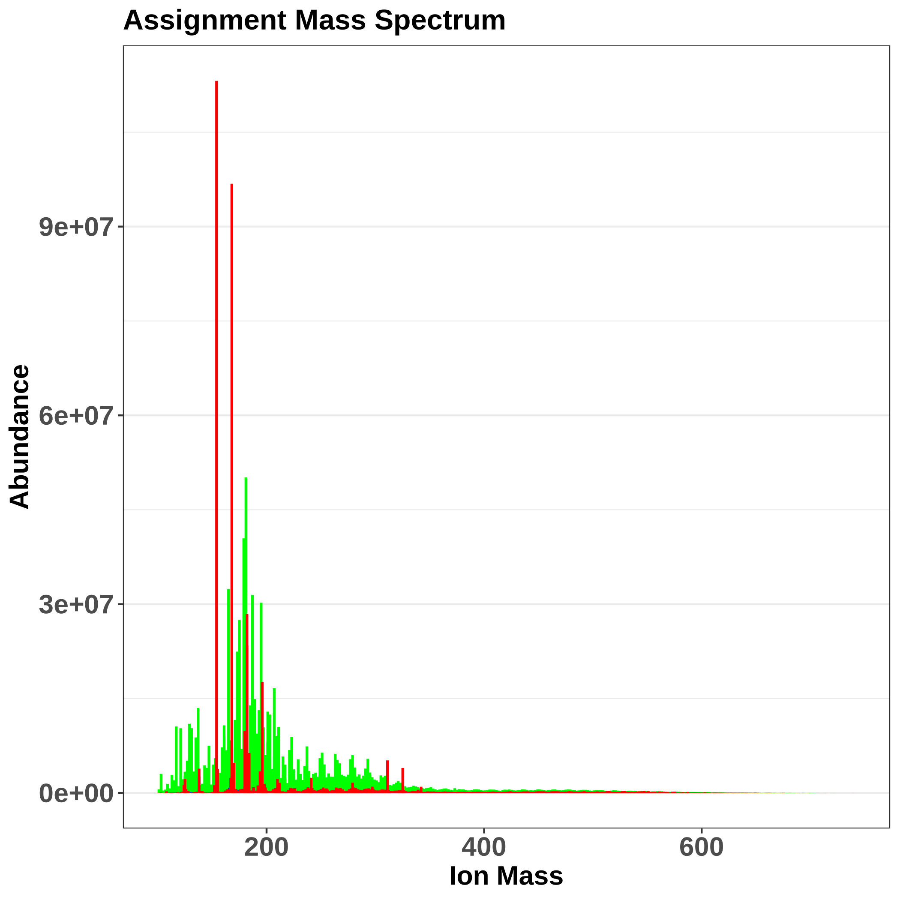

This training covers the multi-element molecular formula (MF) assignment using the MFAssignR tool. It was originally developed by  for the analysis of untargeted mass spectrometry data coming from complex environmental mixtures. The package contains several functions including noise assessment, isotope filtering, internal mass recalibration, and formula assignment. 

The **MFAssignR workflow** is composed of several steps:

1. Run **KMDNoise** to determine the noise level for the data.
2. Check the effectiveness of the S/N threshold using **SNplot**.
3. Use **IsoFiltR** to identify potential 13C and 34S isotope masses.
4. Using the signal-to-noise (S/N) threshold, and the two data frames output from IsoFiltR(), run **MFAssignCHO** to assign MF with C, H, and O to assess the mass accuracy.
5. Use **RecalList** to generate a list of the potential recalibrant series.
6. Use **FindRecalSeries** to find the most suitable recalibrant series.
7. After choosing recalibrant series, use **Recal** to recalibrate the mass lists.
8. Assign MF to the recalibrated mass list using **MFAssign**.
9. Check the output plots from MFAssign() to evaluate the quality of the assignments.

We can illustrate the workflow also on the following scheme:


Let's dive now into the individual steps and explain all the inputs, parameter settings, and outputs.

> <agenda-title></agenda-title>
>
> In this tutorial, we will cover:
>
> 1. TOC
> {:toc}
>
{: .agenda}

# Data import

At the very beginning, we need to import the dataset we will be using. MFAssignR requires on input a table in a **tabular format**, where:

- the first column is the mass to charge ratio (m/z),
- the second column is intensity,
- the optional third column is retention time.

In our case, we will use the model data from the MFAssignR package, which contains the negative ions from acetonitrile extract of wildfire-influenced atmospheric organic aerosol, collected at the Pacific Northwest National Laboratory (PNNL). The detection m/z range of the instrument was 100-800 and the ions were analyzed by electrospray ionization (ESI) on Orbitrap Elite MS and recorded as Xcalibur.raw files. In the MFAssignR package, this dataset is named Raw_Neg_ML in .rds format, which we saved as a tabular file and we will use this file as our input.

> <hands-on-title> Upload data </hands-on-title>
>
> 1. Create a new history for this tutorial and give it a name.
>
>    
>
> 2. Import the files from [Zenodo]({{ page.zenodo_link }}):
>
>    ```
>    https://zenodo.org/records/13768009/files/mfassignr_input.txt
>    ```
>
>    
>
>    
>
> 3. Set the format of the dataset to 'tabular'. 
>
>    
>
> 4. We can now view our dataset, and ensure, that it has a correct input format.
>
>
{: .hands_on}

# Noise assessment

Having our input data in the workspace, we can now start with the analysis!

The first step is the noise assessment, which allows us to avoid both false positives (if noise is underestimated) and false negatives (if noise is overestimated). For this purpose, we will be using the **KMDNoise** function, and visualize the result using **SNplot** function. MFAssignR provides an additional function, **HistNoise**, but often the data distribution prerequisites are not fulfilled and especially when the analyte signal tapers into the noise, HistNoise fails to separate the distributions. Therefore, using KMDNoise is strongly preferred.

## KMDNoise

KMDNoise function takes advantage of the calculation of **Kendrick Mass Defect (KMD)**.

> <details-title>Kendrick Mass Defect</details-title>
>
>The **Kendrick mass (KM)** serves to simplify classification and
>identification of repeating units in molecules, typically 
>homologous CH2 series, which differ only by the number of base 
>units (-CH2 groups in this case). It sets the mass of the molecular fragment to 
>integer value in atomic mass units (amu).
>
>The KM of a compound can be therefore calculated as the known m/z (given the ionization) of the compound multiplied by a ratio (rounded
>(CH2_mass)/exact(CH2_mass)), which is (14/14.01565) = 0.9988834.
>
>$$\text{KM} = \text{m/z} \times \frac{\text{14.00000}}{\text{14.01565}}$$
>
>
>The **Kendrick Mass Defect (KMD)** is then defined as the difference 
>between rounded KM values and KM.
>$$\text{KMD} = \text{nominal KM} - {\text{KM}}$$
>
>Homologous series, meaning compounds differing only in the number of 
>repeating units (e.g. alkylation series), will always have the same KMD.
>
> 
{: .details}


When the KMD is calculated for all peaks in the mass spectrum, there will be a clear separation of more intense analyte peaks and low-intense noise peaks. To isolate the noise region, we can use the KMD limits of chemically feasible molecular formulas in conjunction with the calculation of the slope of a KMD plot using a linear equation $$y = 0.1132x + b$$, where *y* is the KMD value, *0,1132* was an empirically derived integer, *x* the measured ion mass and *b* an y-intercept. To provide a more accurate assessment, two lines with different y-intercepts are selected (we will set this lower and upper y-limit below). Once the noise region is isolated, a noise level will be estimated as the average intensity of peaks within that region.



When running the function, we can stick with the default values: the upper limit for the y-intercept is set to 0.2, so that it does not interact with any potentially double-charged peaks, the lower limit of the y-intercept value is set to 0.05 to ensure no analyte peaks are incorporated into the noise estimation. Both upper and lower x-intercept limits are optional and will be set to minimum and maximum mass in the data if not specified. 

> <hands-on-title> Noise assessment using KMDNoise </hands-on-title>
>
> 1.  with the following parameters:
>    -  *"Input data"*: `mfassignr_input.txt` (Input dataset)
>    -  *"upper limit for the y intercept"*: `0.2`
>    -  *"lower limit for the y intercept"*: `0.05`
>   
>
{: .hands_on}

The function outputs a **KMD plot**, where the noise area is separated between red lines and a **noise estimate**. The noise estimate we can then multiply with a multiplier, typically a value between 3 and 10 in order to remove low-intensity m/z values. Multiplication with 10 means we will be very stringent, the signal-to-noise ratio will be high and close to the limit of quantitation (LOQ), whereas multiplication with 3 means the signal-to-noise ratio will be low and we are close to the limit of detection (LOD). The optimal is therefore to start with e.g. 6 and check the results using SNplot, as we will do further.

> <question-title></question-title>
>
> 1. What is the noise level estimated by KMDNoise function?
>
> > <solution-title></solution-title>
> >
> > 1. Using our model data, the estimated noise is **346.0706**.
> >
> >
> {: .solution}
>
{: .question}

## SNplot

We can now check the effectiveness of the S/N threshold using **SNplot**, which plots the mass spectrum with the masses below and above the chosen threshold, where the noise is indicated by red.

The `cut` parameter can be computed as an estimated noise level * multiplier, so if we get 346.0706 as a noise level from KMDnoise, we can multiply it by 6, which gives us 2076.

- `Mass` - parameter defines a centerpoint to look at the mass spectrum.
- `Parameter window.x` - sets the +/- range around the mass centerpoint, default is 0.5.
- `Parameter window.y` - is used for setting the limit of the y-axis in the plot. Parameter window.y multiplied the `cut` parameter value, and the multiplication result is used as the y-axis limit. The default is 10.

> <hands-on-title> Plot the SNplot </hands-on-title>
>
> 1.  with the following parameters:
>    -  *"Input data"*: `mfassignr_input.txt` (Input dataset)
>    - *"SN ratio"*: `6.0`
>    - *"Estimated noise"* `346.0706`
>    - *"mass"*: `301.0`
>    - *"window.x"*: `50.0`
>    - *"window.y"*: `10.0`
{: .hands_on}



Based on the SNplot, we can see that the noise - indicated in red - forms a uniform background and is effectively separated by the horizontal line (indicating the S/N threshold), meaning we can further use the multiplication of 346 and 6. If the noise was higher than the S/N threshold, it would mean we need to increase the value of the multiplier.


# Isotope filtering

The next step is the identification of probable isotopic ion masses containing 1-2 13C or 34S from monoisotopic masses in order to prevent incorrect interpretation of the molecular composition. For this, we will use the **IsoFiltR** function.

Isotope filtering has 4 steps:

1. Firstly, the mass list is transformed to pairs of ions, which have a mass difference of 1.003355 Da for 13C and 1.995797 Da for 34S with some flexibility for a user-defined error tolerance (by default 5 ppm).
2. For specific isotopes, KMD values are calculated using the mass difference between 12C and 13C (1.003355 Da) and the mass difference between 32S and 34S (1.995797 Da).
3. Isotope pairs are further refined using *Resolution Enhanced KMD* adapted from , in which the Kendrick base is adjusted by an experimentally derived integer (For 34S, the integer is 12 (determined by trial and error) and for 13C the integer is 21 based on ) in order to obtain a desired separation.
4. Finally, abundance ratios are evaluated, where the abundance ratio for 13C should be < 0.6 and the abundance ratio for 34S should be < 0.3.

After performing isotopic filtering, two tables are outputted, one containing the isotopic masses and one containing the monoisotopic masses and all masses that did not have a matching isotopic mass. In complex mixtures, a mass can be classified as both monoisotopic and isotopic; in those cases, it is included in both output tables and classified after the MF assignment.

We will change only the S/N ratio parameter and estimated noise (based on the KMDNoise function), otherwise, we can follow with the default settings.

> <hands-on-title> Isotope filtering using IsoFiltR </hands-on-title>
>
> 1.  with the following parameters:
>    -  *"Input Peak Data"*: `mfassignr-input.txt` (Input dataset)
>    - *"SN ratio"*: `6.0`
>    - *"Estimated noise"* `346.0706`
>
>
{: .hands_on}

# Preliminary molecular formula assignment

Once we have denoised the data and have identified the potential 13C and 34S masses, we can start with the preliminary MF assignment, using the **MFAssignCHO** function. This function assigns MF only with C, H, and O elements to assess the mass accuracy, and therefore it's much quicker than the main MFAssign function. It is based on the CHOFIT algorithm developed by .

Firstly, the initial formula assignment with the CHOFIT algorithm is performed along with the quality checks. Then, KMD and z* values are calculated for all masses with the CH2 Kendrick base, and masses are sorted into CH2 homologous series. Subsequently, 1-3 members of each CH2 homologous series below the user-defined threshold are selected and assigned a MF. The ambiguous MFs are returned within the _Unassigned_ list, whereas the unambiguous MF are further re-assigned using CH2, O, H2, H2O, and CH2O extensions. 

Let's use the MFAssignCHO function. On the input, we will need the output of the IsoFiltR function, a data frame of monoisotopic masses, and also (optionally) the data frame containing isotopic masses. Furthermore, we select in which ion mode we measured the data (positive or negative) and we set the signal-to-noise threshold - based on the noise estimate we obtained from the **KMDNoise** or **HistNoise** functions multiplied by the multiplier. Finally, based on the acquisition range, we set the lowMW and highMW, and also the allowed ppm error. Other parameters we can leave in default settings, although in the 'Advanced' tab, many additional parameters can be set by user, including amounts of elements, ratios (e.g. minimum allowed O/C ratio) and many others. 

On the output, there are two dataframes, `Ambiguous` and `Unambigous` provided.

> <hands-on-title> Preliminary MF assignment with MFAssignCHO </hands-on-title>
>
>
> 1.  with the following parameters:
>    -  *"Data frame of monoisotopic masses"*: `mono_out` (output of **MFAssignR IsoFiltR** )
>    -  *"Data frame of isotopic masses"*: `iso_out` (output of **MFAssignR IsoFiltR** )
>    - *"ppm_err"*: `3`
>    - *"Ion mode"*: `negative`
>    - *"SN ratio"*: `6`
>    - *"Estimated noise"*: `346.0706`
>    - *"Lower limit of molecular mass to be assigned"*: `50.0`
>    - *"Upper limit of molecular mass to be assigned"*: `1000.0`
>
>
{: .hands_on}

On the output, we get several data frames: unambiguous assignments, ambiguous assignments, and a data frame containing unassigned masses. Additionally, several plots are available, such as MSAssign showing a mass spectrum highlighting assigned and unassigned masses, errorMZ showing the relationship between absolute error (in ppm) and ion mass, van Krevelen plot, and a mass spectrum colored by molecular group.


This plot shows us the absolute error, which increases with the increasing mass as expected. Actually, it is good to see a trend here, meaning there is a systematic error that will be corrected during recalibration, a problem would be if there was a random error that we can't correct.



> <details-title>Van Krevelen plot</details-title>
>The Van Krevelen plot was originally introduced in 1950  to illustrate 
>the coal formation processes. It typically depicts the atomic ratios of hydrogen-to-carbon (H/C) 
>ratio on the y-axis and oxygen-to-carbon (O/C) on the x-axis. Certain molecules occupy different regions of
>the van Krevelen plot, e.g. alkanes usually have high H/C and low O/C ratios, aromatic compounds have
>lower H/C ratios and carbohydrates usually have high O/C and moderate H/C ratios.
>
{: .details}

Van Krevelen plot visualizes the chemical composition of complex chemical mixtures and it characterizes the data quality and how the data is distributed. Compounds with similar structures and functional groups will cluster together on the plot.


The MSgroups plot shows the abundance distribution of unambiguous molecular formula assignments. 


Assignment mass spectrum then shows what was assigned: green are the assigned compounds, red are unassigned ones (eventually, if applicable, isotopes are in blue). It is useful to check whether there are any gaps around a particular m/z, which would mean there is a problem with the assignment.

# Recalibration
The next step is recalibration, which ensures that we will have an accurate mass list before formula assignment and any systemic bias is removed. In MFAssignR, recalibration was adapted from  and .

There are three consecutive functions, **RecalList**, **FindRecalSeries** and **Recal**, which we will use. 

## RecalList

Firstly, we will generate a table containing potential recalibrant CH2 homologous series using the RecalList function. 
As in input, we will use the `Unambig` data frame which we generated in the MFAssignCHO function:

> <hands-on-title> Finding recalibrant series </hands-on-title>
>
> 1.  with the following parameters:
>    -  *"Input data"*: `Unambig` (output of **MFAssignR MFAssignCHO** )
>
>
{: .hands_on}

> <question-title></question-title>
>
> 1. How many series were returned?
>
> > <solution-title></solution-title>
> >
> > 1. When we click on the results ('Recalibration series by MFAssignR RecalList on data 10'), we can
> >see there are 226 lines (1 being the column names), meaning 225 series which we can select from for the recalibration.
> >
> {: .solution}
>
{: .question}

On the output, we get a data frame containing CH2 homologous series that contain more than 3 members. Let's dive more into what metrics are available:

- **Series** - reports the homologous series according to class, adduct, and DBE. The format is "class_adduct_DBE", for example, a homologous series with class = "O6, adduct of Na+, and DBE = 4" would be "O6_Na_4".
- **Number Observed** - reports the number of members of each homologous series.
- **Series Index** - represents the order of the series when ordered by length of homologous series.
- **Mass Range** - reports the minimum and maximum mass for the compounds within a homologous series.
- **Tall Peak** - reports the mass of the most abundant peak in each series.
- **Abundance Score** - reports the percentage difference between the mean abundance of a homologous series and the median abundance within the mass range the "Tall Peak" falls in (for example m/z 200-300). A higher score is generally better.
- **Peak Score** - This column compares the intensity of the tallest peak in a given series to the second tallest peak. This comparison is calculated by $$\text{log10} \times \frac{\text{Max Peak Intensity}}{\text{Second Peak Intensity}}$$ The closer to 0 this value is the better, in general.
- **Peak Distance** - This column shows the number of CH2 units between the tallest and second tallest peak in each series. In general, the value should be as close to 1 as possible.
- **Series Score** - This column compares the number of actual observations in each series to the theoretical maximum number based on the CH2 homologous series. The closer to one this value is, the better.

## FindRecalSeries

Which are the best series for recalibration? Combined, these series should cover the full mass spectral range to provide the best overall recalibration. The best series to choose are generally long and combined have a "Tall Peak” at least every 100 m/z.

Currently, it is up to the user to choose the most suitable recalibrant series that will be used for the recalibration in the Recal step. It is possible to choose up to 10 series and they should indeed span over the whole range of m/z - often an error is thrown to add more series in case there are gaps, or the chosen series would have a good score but would be way too alike. Therefore, we provide the **FindRecalSeries** function, which attempts to select the best series which fulfill the abovementioned criteria.

We will only provide the `Recalibration series` dataframe from RecalList function, and the best series will be chosen automatically. Although a list of more than 10 series might be provided on the output, only first 10 best series will be used by the Recal function in the next step.

> <hands-on-title> Selecting most suitable series </hands-on-title>
>
> 1.  with the following parameters:
>    -  *"Input data"*: `recal_series` (output of **MFAssignR RecalList** )
>
{: .hands_on}

## Recal

The Recal function is used for the internal mass recalibration. It takes the output from MFAssignCHO and outputs from IsoFiltrR, the `Mono` and `Iso` data frames. Finally, it takes the series for recalibration, either chosen by the user or selected by the FindRecalSeries function. 

A common error points to increasing the `MzRange` parameter, which sets the recalibration segment length and has a default value of 30 - sometimes it is needed to increase it to even values as 80. Other parameters can be left to their defaults.

> <hands-on-title> Internal mass recalibration </hands-on-title>
>
> 1.  with the following parameters:
>    -  *"Input data (Output from MFAssign)"*: `Unambig` (output of **MFAssignR MFAssignCHO** )
>    -  *"Calibration series (Output from RecalList)"*: `Final recalibration series` (output of **MFAssignR FindRecalSeries** )
>    -  *"Peaks dataframe (Mono from IsoFiltR)"*: `Monoisotopic masses` (output of **MFAssignR IsoFiltR** )
>    -  *"Isopeaks dataframe (Iso from IsoFiltR)"*: `iso_out` (output of **MFAssignR IsoFiltR** )
>    - *"Ion mode"*: `negative`
>    - *"SN ratio"*: `6`
>    - *"Estimated noise"*: `346.0706`
>    - *"Mass windows used for the segmented recalibration"*: `50.0`
>
>
{: .hands_on}

# Molecular formula assignment

The last step of the workflow is the actual assignment of molecular formulas with 12C, 1H, and 16O and a variety of heteroatoms and isotopes, including 2H, 13C, 14N, 15N, 31P, 32S, 34S, 35Cl, 37Cl, 19F, 79Br, 81Br, and 126I. It can also assign Na+ adducts, common in positive ion mode. We have already described the principles of the MFAssignCHO function, which works the very same way as MFAssign (only being limited to C, H, and O elements), so let's directly use the MFAssign function for the formula assignment. 

> <hands-on-title> MF assignment using MFAssign </hands-on-title>
>
> 1.  with the following parameters:
>    -  *"Data frame of monoisotopic masses"*: `Mono` (output of **MFAssignR Recal** )
>    -  *"Data frame of isotopic masses"*: `Iso` (output of **MFAssignR Recal** )
>    - *"ppm_err*: `3`
>    - *"Ion mode"*: `negative`
>    - *"SN ratio"*: `6`
>    - *"Estimated noise"*: `346.0706`
>    - *"Lower limit of molecular mass to be assigned"*: `50.0`
>    - *"Upper limit of molecular mass to be assigned"*: `1000.0`
>
{: .hands_on}

Finally, we obtain assigned formulas on rearranged data. Similarly to the MFAssignCHO function, data frames of unassigned masses, ambiguous assignments and unambiguous assignments are provided, as well as quality check plots. 


# Conclusion

In this tutorial, we showed how can we assign molecular formulas using the MFAssignR package. We learned  several key steps, including noise estimation, isotope filtering, recalibration, and finally the formula assignment. We described how parameters of individual functions are used and how they should be adjusted if needed. 


