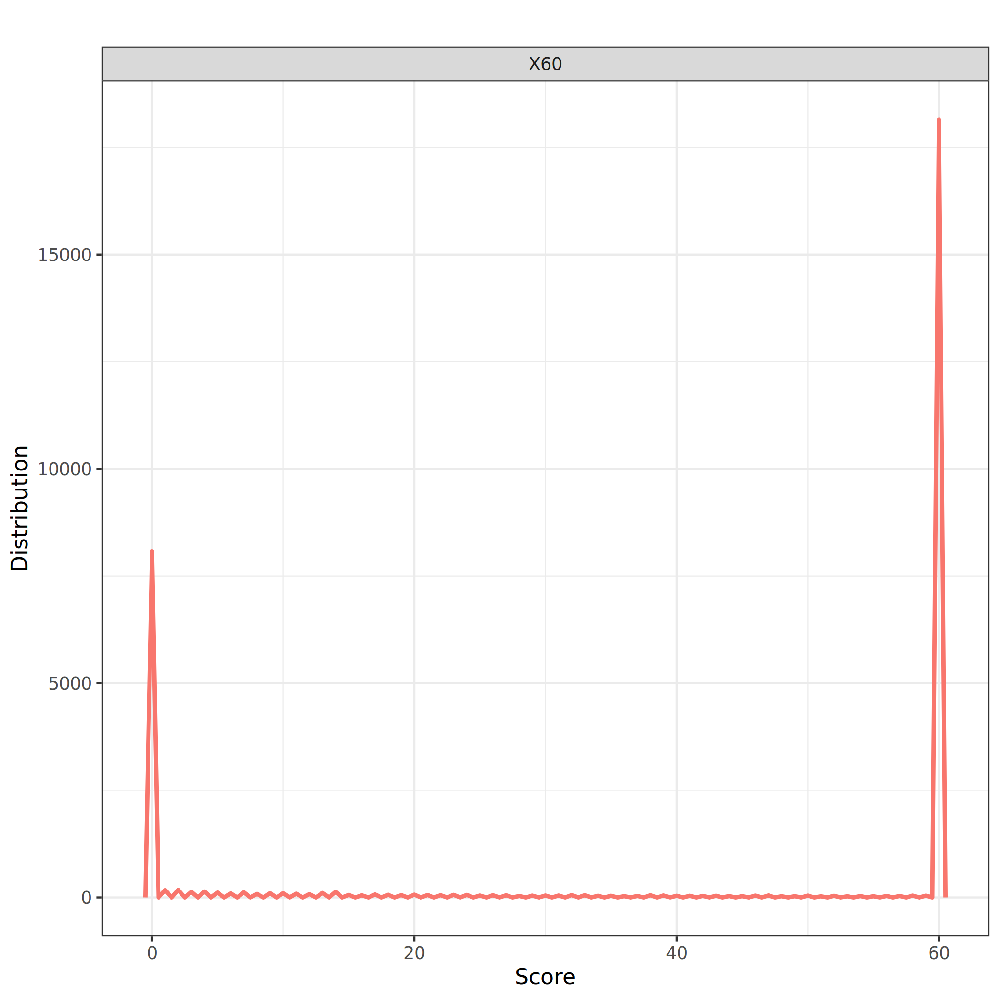
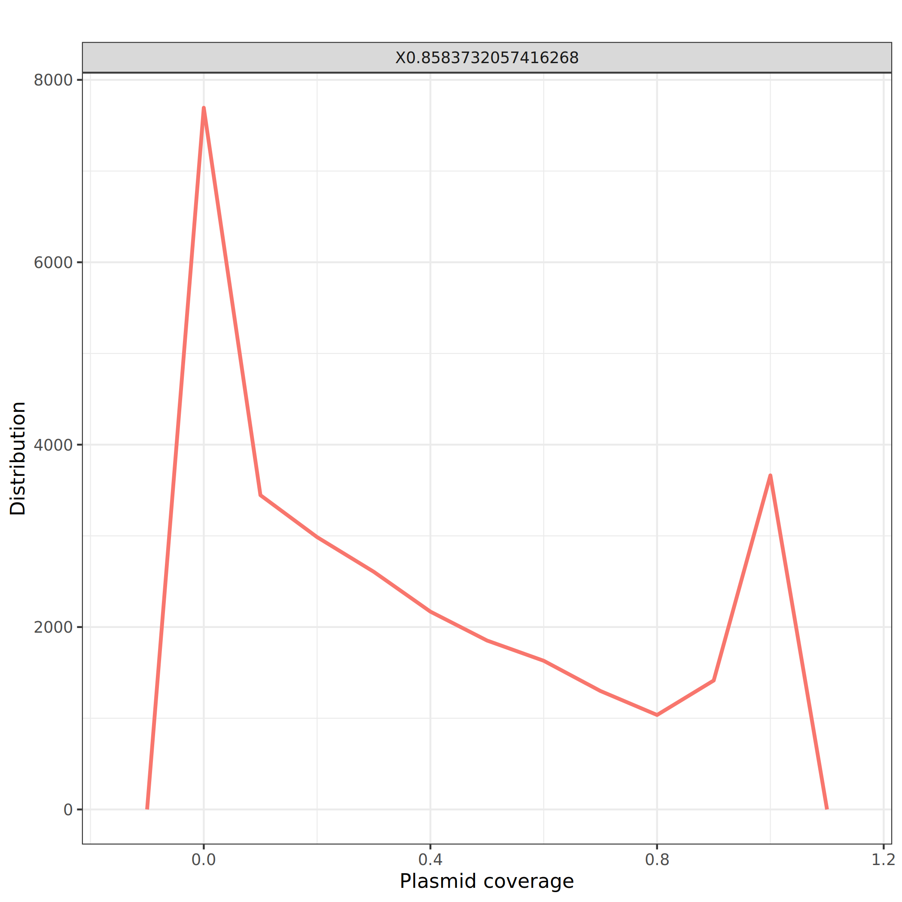
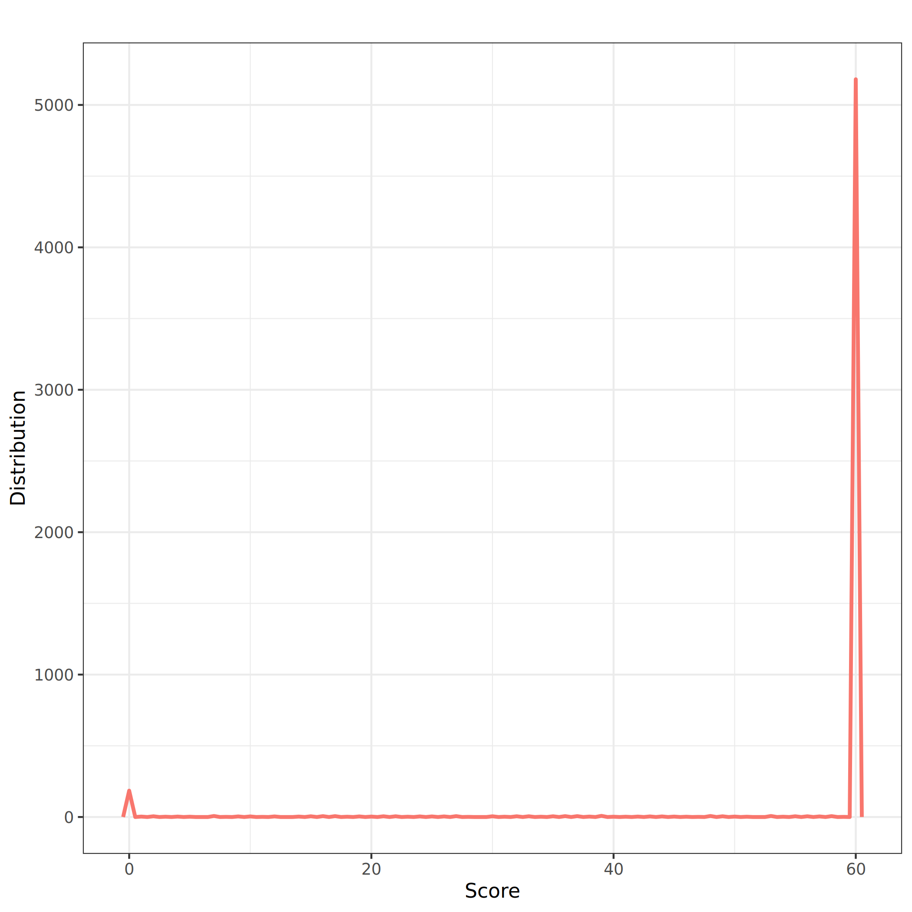

Identifying and annotating mobile genetic elements (MGE) in metagenomic data can be tricky. To facilitate the process, we can use existing and custom annotated mobile genetic element database.

The *metaplasmidome* refers to the collection of all plasmids present within a given environment, typically identified through metagenomic sequencing. Plasmids are extrachromosomal genetic elements that often carry genes associated with antibiotic resistance, virulence, or metabolic functions, making them crucial for microbial adaptability. In the context of metagenomics, plasmids are identified alongside chromosomal DNA.

A common step in metaplasmidome analysis is searching sequencing reads against known plasmid databases to detect plasmid sequences within a metagenome, allowing researchers to map the diversity and abundance of plasmids in various environments. 

In this tutorial, we use a metaplasmidome database built from public air metagenomes and query it with assembled air metagenome data. A similar approach can be used for other mobile genetic elements.

> <details-title>How was built the air metaplasmidome database?</details-title>
>
> The air metaplasmidome is available from Zenodo () and was built from metagenomic data selected in Web of Science (Clarivate) on October 2022 using keywords: `txid655179[Organism:noexp] AND metagenome [Filter]; AIR Metagenome; Air microbiome; Troposphere; Aerosol; Atmosphere`. Data were manually curated to remove sequencing originated from metabarcoding data (i.e., 16S). The assembled data supplied by MetaSUB consortium () when available was used for air metagenome in the built environments. 
>
> Plasmid contents were predicted using the assembled data. Metagenomes sequencing by Illumina (paired-illumina reads) were assembled by using MEGAHIT 1.2.9 with metalarge option () after cleaning data with bbduk2 (qtrim=rl trimq=28 minlen=25 maq=20 ktrim=r k=25 mink=11 and a list of adaptators to remove) from [bbtools suite](https://jgi.doe.gov/data-and-tools/software-tools/bbtools/)  
>
> Plasmids were predicted for each assembling by using PlasSuite scripts describing in-depth in Hilpert et al.   and available on [GitHub](https://github.com/meb-team/PlasSuite/). Briefly, contigs were analyzed using both reference-based and reference-free approaches. The databases employed included those for chromosomes (archaea and bacteria) and plasmids from NCBI, as well as the MOB-suite tool (), SILVA () and phylogenetic markers harbored by chromosomes (). Two reference-free methods were applied to contigs that were not affiliated with chromosomes (discarded) or plasmids (retained in the first step): PlasFlow () and PlasClass (). Viruses were removed by using [viralVerify](https://github.com/ablab/viralVerify) () that provides in parallel provide plasmid/non-plasmid classification.
> 
> Eukaryotes contaminants were removed by aligning the sequences against NT databases and human chromosomes (GRCh38) with minimap2 with -x asm5 option (). Contigs mapping with an identity of 95% and a coverage of 80% were removed.  the final plasmidome set was clustered by mmseqs () with 80% of coverage and 90% of identity (--min-seq-id 0.90 -c 0.8 --cov-mode 1 --cluster-mode 2 --alignment-mode 3 --kmer-per-seq-scale 0.2). 
{: .details}


> <agenda-title></agenda-title>
>
> In this tutorial, we will cover:
>
> 1. TOC
> {:toc}
>
{: .agenda}

# Galaxy and data preparation

Any analysis should get its own Galaxy history. So let's start by creating a new history and import the data (plasmidome database and query metagenomes) into it.

> <hands-on-title>Prepare Galaxy and data</hands-on-title>
>
> 1. Create a new history for this tutorial
>
>    
>
> 2. Rename the history
>
>    
>
> 3. Import the metaplasmidome reference database from [Zenodo]({{ page.zenodo_link }}) or from
>    the shared data library
>
>    ```
>    https://zenodo.org/records/14501567/files/air_metaplasmidome.fasta.gz
>    ```
>
>    
>
>    
>
> 4. Rename `Air plasmidome database`
>
>    
>
> 5. Import the reads to query against the reference database from [Zenodo]({{ page.zenodo_link }}) or from
>    the shared data library
>
>    ```
>    https://zenodo.org/records/14501567/files/air_metagenome_assemblies.fasta.gz
>    ```
>
> 6. Rename `Air metagenomes`
{: .hands_on}


> <question-title></question-title>
>
> 1. How many reads are in the query dataset?
> 2. How many plasmid sequences are in the metaplasmidome database?
>
> > <solution-title></solution-title>
> >
> > 1. 16,637 sequences
> > 2. 674,495 sequences
> {: .solution}
{: .question}


# Read mapping against the metaplasmidome database

> <hands-on-title>Map reads against metaplasmidome database</hands-on-title>
>
> 1.  with the following parameters:
>    - *"Will you select a reference genome from your history or use a built-in index?"*: `Use a genome from history and build index`
>        -  *"Use the following dataset as the reference sequence"*: `metaplasmidome database`
>    - *"Single or Paired-end reads"*: `Single`
>        -  *"Select fastq dataset"*: `query`
>        - *"Select a profile of preset options"*: `Long assembly to reference mapping (-k19 -w19 -A1 -B19 -O39,81 -E3,1 -s200 -z200 --min-occ-floor=100). Typically, the alignment will not extend to regions with 5% or higher sequence divergence. Only use this preset if the average divergence is far below 5%. (asm5)`
>    - In *"Set advanced output options"*:
>        - *"Select an output format"*: `PAF`
>
{: .hands_on}

PAF is the default output format of minimap2. It is TAB-delimited with each line consisting of the following predefined fields:
1. Query sequence name
2. Query sequence length
3. Query start coordinate (0-based)
4. Query end coordinate (0-based)
5. `+` if query/target on the same strand and `-` if opposite
6. Target sequence name
7. Target sequence length
8. Target start coordinate on the original strand
9. Target end coordinate on the original strand
10.	Number of matching bases in the mapping
11.	Number bases, including gaps, in the mapping
12.	Mapping quality

> <question-title></question-title>
>
> 1. How many lines are in the file?
> 2. Can a query sequence be found several times in the target?
> 3. Are all alignments of good quality?
>
> > <solution-title></solution-title>
> >
> > 1. 29,796 lines
> > 2. There are 16,637 query sequences. Several query sequences are found several times in the file: SRR17300492_75807 is found 16 times. It means they have been mapped to several locations or sequences in the target.
> > 3. The first alignment (SRR17300492_75807 mapping on SRR17300667-707) has a score of 60, the highest Phred score. The third alignment has a score of 0, so not good.
> >
> {: .solution}
>
{: .question}

# Exploration of the mapping results

Let's look at the distribution of the mapping score (column 12)

> <hands-on-title>Plot score distribution</hands-on-title>
>
> 1. Change datatype to tabular
>
>    
> 
> 2.  with:
>    - *"Cut columns"*: `c12`
>    - *"Delimited by"*: `tab`
>    -  *"From"*: Output of **Map with minimap2** 
>
> 2.  with the following parameters:
>    - *"Input should have column headers - these will be the columns that are plotted * "*: Output of **Cut** 
>    - *"Label for x axis"*: `Score`
>    - *"Label for y axis"*: `Distribution`
>    - In *"Advanced Options"*:
>      - *"Legend options"*: `Hide legend`
>
{: .hands_on}



> <question-title></question-title>
>
> Are all alignments of good quality?
>
> > <solution-title></solution-title>
> >
> > There is a pic at 60 but many alignments have a score below 40.
> >
> {: .solution}
>
{: .question}

We should remove alignments with a score below 40. Before that, let's look at the plasmid coverage. We first need to compute it, i.e. the ratio between the number of matching bases in the mapping (Column 10) and plasmid length (target sequence length - Column 7).

> <hands-on-title>Compute plasmid coverage</hands-on-title>
> 1.  with:
>    - *"Cut columns"*: `c1-c12`
>    - *"Delimited by"*: `tab`
>    -  *"From"*: Output of **Map with minimap2** 
>
> 2.  with the following parameters:
>    - *"Input file"*: Output of **Cut** 
>    - In *"Expressions"*:
>      - *"Add expression"*: `float(c10)/float(c7)`
>
> 3. Rename `Mapping stats + plasmid coverage`
{: .hands_on}

A new column has been added (column 13) with the plasmid coverage. Let's now plot its distribution.

> <hands-on-title>Plot plasmid coverage distribution</hands-on-title>
> 1.  with:
>    - *"Cut columns"*: `c13`
>    - *"Delimited by"*: `tab`
>    -  *"From"*: `Mapping stats + plasmid coverage`
>
> 2.  with the following parameters:
>    - *"Input should have column headers - these will be the columns that are plotted * "*: Output of **Cut** 
>    - *"Label for x axis"*: `Plasmid coverage`
>    - *"Label for y axis"*: `Distribution`
>    - *"Bin width for plotting"*: `0.1`
>    - In *"Advanced Options"*:
>      - *"Legend options"*: `Hide legend`
>
{: .hands_on}



> <question-title></question-title>
>
> 1. What is the distribution of the plasmid coverage?
> 2. What could be a good threshold to filter?
>
> > <solution-title></solution-title>
> >
> > 1. There are 2 peaks: one around 0 (i.e. no plasmid coverage) that slowly decreases until 0.8 and a pic at 1 (full plasmid coverage)
> > 2. 0.8 seems to be a breaking point and could be a good value to filter.
> >
> {: .solution}
>
{: .question}

# Filtering

We will now filter the alignment to keep only the ones with a plasmid coverage (column 13) of at least 0.8, i.e. a read mapping to a plasmid covering at least 80% of the plasmid.

> <hands-on-title>Filter alignments based on plasmid coverage</hands-on-title>
>
> 1.  with the following parameters:
>    -  *"Filter"*: `Mapping stats + plasmid coverage`
>    - *"With following condition"*: `c13>=0.8`
>
> 2. Rename `Alignments with plasmid coverage >= 0.8`
{: .hands_on}

> <question-title></question-title>
>
> 1. How many lines have been kept?
> 2. Which percentage of lines does that correspond to?
> 3. What does the distribution of the mapping score look like for these alignments?
> 4. Is there any extra filter we should do on the data?
>
> > <solution-title></solution-title>
> >
> > 1. 5,577 (over the 29,796)
> > 2. 18.73%
> > 3. To plot the distribution of the mapping score for filtered alignments, we need to run the series of tools as done earlier:
> >    
> >    1.  with:
> >        - *"Cut columns"*: `c12`
> >        - *"Delimited by"*: `tab`
> >        -  *"From"*: `Alignments with plasmid coverage >= 0.8`
> >
> >     2.  with the following parameters:
> >        - *"Input should have column headers - these will be the columns that are plotted * "*: Output of **Cut** 
> >        - *"Label for x axis"*: `Score`
> >        - *"Label for y axis"*: `Distribution`
> >        - In *"Advanced Options"*:
> >          - *"Legend options"*: `Hide legend`
> >    
> >     
> >
> >     Most of the alignments are of good quality (pic at 60). There is also a pic at 0, meaning that some alignments are of bad quality
> >    
> > 4. It might be good to add a filter on the score.
> {: .solution}
>
{: .question}

After filtering on the plasmid coverage, we also add a filter on the score to be sure that we keep only the best alignments (i.e. a score - column 12 - of at least 40).

> <hands-on-title>Filter alignments based on score</hands-on-title>
>
> 1.  with the following parameters:
>    -  *"Filter"*: `Alignments with plasmid coverage >= 0.8`
>    - *"With following condition"*: `c12>=40`
>
> 2. Rename `Alignments with plasmid coverage >= 0.8 and score >= 40`
{: .hands_on}

> <question-title></question-title>
>
> 1. How many lines have been kept?
> 2. Which percentage of lines does that correspond to?
>
> > <solution-title></solution-title>
> >
> > 1. 5,249 (over the 5,577)
> > 2. 94.12%
> {: .solution}
>
{: .question}

# Extract sequences mapping to plasmids

Let's now extract the sequences mapping to plasmids (coverage higher than 80%).

First, we need to extract the names of the reads (in `air metagenomes`) mapping to plasmids in the metaplasmidome database. For that, we need to extract column 1 (query names, i.e. names of reads in `Air metagenomes`) and 6 (reference names, i.e. names of sequences in `Air plasmidome database`).

> <hands-on-title>Get sequences matching to plasmids</hands-on-title>
>
> 1.  with the following parameters:
>    - *"Cut columns"*: `c1,c6`
>    -  *"From"*: `Alignments with plasmid coverage >= 0.8 and score >= 40`
>
> 2. Rename to `Names for alignments with plasmid coverage >= 0.8 and score >= 40`
>
> 2.  with the following parameters:
>    -  *"Sort Dataset"*: output of **Cut** 
>    - *"on column"*: `c2`
{: .hands_on}

Second, we need to convert the `Air metagenomes` FASTA file to a tabular so we can join it with `Names for alignments with plasmid coverage >= 0.8 and score >= 40`

> <hands-on-title>Get query sequence as a table</hands-on-title>
>
> 1.  with the following parameters:
>    -  *"Fasta file"*: `Air metagenomes`
>
> 2. Rename to `Air metagenome as table`
{: .hands_on}

Let's now join the 2 datasets on the names of the reads in `air metagenomes` so column 1 in `Names for alignments with plasmid coverage >= 0.8 and score >= 40` and column 1 in `Air metagenome as table`.

> <hands-on-title>Get sequences matching to plasmids</hands-on-title>
>
> 1.  with the following parameters:
>    -  *"Join"*: output of **Sort** 
>    - *"using column"*: `Column: 1`
>    -  *"with"*: output of **Convert FASTA to Tabular** 
>    - *"and column"*: `Column: 1`
>    - *"Fill empty columns"*: `No`
>
{: .hands_on}

We have now a table with 4 columns: names of the reads in `air metagenomes`, names of sequences in the reference database, names of the reads in `air metagenomes`, sequence of reads in `air metagenomes`. We will now create 2 outputs:
- A table with metaplasmidome database sequence name, metagenomic sequence names and the metagenomic sequences
- A FASTA file with metagenomic sequences

## Create the table with air metagenomes identified as plasmids

Let's remove the duplicated column (column 3) and reorganize the columns

> <hands-on-title>Keep non duplicated columns</hands-on-title>
>
> 1.  with the following parameters:
>    - *"Cut columns"*: `c2,c1,c4`
>    -  *"From"*: output of **Join two Datasets** 
{: .hands_on}

Let's now add column names to the generated table.

> <hands-on-title>Add column names</hands-on-title>
>
> 1.  with the following parameters:
>    - *"List of Column headers"*: `Metaplasmidome database sequence name,Metagenomic sequence name,Metagenomic sequence`
>    -  *"Data File (tab-delimted)"*: output of **Replace Text** 
>
>
> 3. Rename the output to `Air metagenomes identified as plasmids`
{: .hands_on}

## Create the FASTA file with air metagenomes identified as plasmids

We can now generate a FASTA file with the identified sequences.

From the output of **Join two Datasets** , let's keep only metagenomic sequence names and the metagenomic sequences and remove duplicated sequences

> <hands-on-title>Keep unique metagenomic sequences</hands-on-title>
>
> 1.  with the following parameters:
>    - *"Cut columns"*: `c1,c4`
>    -  *"From"*: output of **Join two Datasets** 
> 2.  with the following parameters:
>    -  *"Sort Dataset"*: output of **Cut** 
>    - *"on column"*: `Column: 1`
>    - *"with flavor"*: `Alphabetical sort`
> 3.  with the following parameters:
>    -  *"File to scan for unique values"*: output of **Sort** 
{: .hands_on}

> <question-title></question-title>
>
> How many lines have been kept?
>
> > <solution-title></solution-title>
> >
> > 4,055 (over 5,249)
> >
> {: .solution}
>
{: .question}

We have now a table with unique metagenomic sequences. Let's transform it into a FASTA file.

> <hands-on-title>Convert to a FASTA file</hands-on-title>
>
> 1.  with the following parameters:
>    -  *"Tab-delimited file"*: output of **Unique occurrences of each record** 
>    - *"Title column(s)"*: `Column: 1`
>    - *"Sequence column"*: `Column: 2`
>
> 2. Rename the output to `Air metagenome sequences identified as plasmids`
{: .hands_on}

# Annotate features on the identified plasmids
 
Let's now annotate features on the identified plasmids. For that, we will use the annotation of the air metaplasmidome sequences that have been done with Prokka (citation) and assume that the annotations are similar for the identified plasmids.

We will import the GFF generated by Prokka.

> <hands-on-title>Import the GFF with metaplasmidome reference database annotation</hands-on-title>
>
> 1. Import the metaplasmidome reference database annotation from [Zenodo]({{ page.zenodo_link }}) or from the shared data library
>
>    ```
>    https://zenodo.org/records/14501567/files/air_metaplasmidome_annotations.gff
>    ```
>
> 2. Inspect it.
{: .hands_on}

This file is a GFF: it describes genes and other features of DNA, RNA and protein sequences. It is a tab-delimited file with 9 fields per line:

1. **seqid**: The name of the sequence where the feature is located. 
2. **source**: The algorithm or procedure that generated the feature. 
3. **type**: The feature type name, like "gene" or "exon". 
4. **start**: Genomic start of the feature, with a 1-base offset. 
5. **end**: Genomic end of the feature, with a 1-base offset. 
6. **score**: Numeric value that generally indicates the confidence of the source in the annotated feature. 
7. **strand**: Single character that indicates the strand of the feature.
8. **phase**: Phase of CDS features.
9. **attributes**: A list of tag-value pairs separated by a semicolon with additional information about the feature. 

The **seqid** corresponds here to the ID of the sequences in the metaplasmidome reference database. So to filter, we need to compare `Metaplasmidome database sequence name` in `Air metagenomes identified as plasmids`
to **seqid** by joining the 2 datasets on column 1.

The file has with ~85 Million lines but many are comments (lines starting with `##`).

> <question-title></question-title>
>
> How many features are in the GFF file?
>
> > <solution-title></solution-title>
> >
> > 2,951,015 features
> >
> > To get this number, we run  with the following parameters:
> >  -  *"GFF Dataset to Filter"*: imported GFF
> >
> {: .solution}
>
{: .question}

Let's now filter the GFF to keep only information related to the sequences matching to plasmids. 
For that, we join the GFF on the SeqID column (column 1) with the `Air metagenomes identified as plasmids` file on the ` Metaplasmidome database sequence name` (Column 1)

> <hands-on-title>Extract information about the sequences matching to plasmids</hands-on-title>
>
> 1.  with the following parameters:
>    -  *"Join"*: imported GFF
>    - *"using column"*: `Column: 1`
>    -  *"with"*: `Air metagenomes identified as plasmids`
>    - *"and column"*: `Column: 1`
>    - *"Fill empty columns"*: `No`
>
> 2. Inspect the generated file
{: .hands_on}

> <question-title></question-title>
>
> 1. How many lines have been kept?
> 2. Why is there more lines than in the `Air metagenomes identified as plasmids` file?
> 2. What are the columns? 
> 3. Which columns should we keep if we want to keep the Metagenomic sequence name, the feature and the attributes?
>
> > <solution-title></solution-title>
> >
> > 1. 26k+ lines
> > 2. Some sequences (e.g. SRR17300493-2380) have several lines: several features (CDS, rRNA, etc) annotated on it
> > 3. The 9 columns of the GFF file + the 3 columns of the `Air metagenomes identified as plasmids` file
> > 4. Columns to keep:
> >    1. Metagenomic sequence name (Column 11)
> >    2. Feature (Column 3)
> >    3. Attributes (Column 9)
> {: .solution}
>
{: .question}

Let's now cut the columns.

> <hands-on-title>Cut and filter </hands-on-title>
>
> 1.  with the following parameters:
>    - *"Cut columns"*: `c11,c3,c9`
>    -  *"From"*: output of **Join two Datasets** 
>
> 2. Inspect the generated file
{: .hands_on}

> <question-title></question-title>
>
> What are the different identified features?
>
> > <solution-title></solution-title>
> >
> > Using  to group and count on 2nd column, we find 26,329 CDS and 307 tRNA.
> >
> {: .solution}
>
{: .question}

## Extract the CDS

Let's filter to keep only the CDS and extract the gene names.

> <hands-on-title>Keep CDS</hands-on-title>
>
> 1.  with the following parameters:
>    -  *"Filter"*: output of **Cut** 
>    - *"With following condition"*: `c2=='CDS'`
>
> 2. Inspect the generated file
{: .hands_on}

We have now a file with 26,329 lines. The 2nd column is not useful so we will remove it. Column 3 (**atributes** in GFF) lists tag-value pairs separated by a semicolon with additional information about the feature.
The first lines seems to be hypothetical proteins. If we scroll down, we can find some annotated genes (with `gene` keyword).

It would be good to create a tabular file with:
1. Metagenomic sequence name
2. Gene ID
3. Gene name
4. Gene product

As not all genes are annotated (with `gene` keyword), we first need to split the file between hypothetical proteins and annotated genes and process the two generated files independently.

> <hands-on-title>Keep CDS</hands-on-title>
>
> 1.  with the following parameters:
>    - *"Cut columns"*: `c1,c3`
>    -  *"From"*: output of **Filter** 
>
> 2.  with the following parameters:
>    -  *"Input file"*: output of last **Cut** 
>    - *"Does file contain header? "*: `No`
>    - In *Filter by keywords*:
>      - *"Column number on which to apply the filter"*: `c2`
>      - In `Enter keywords`:
>        - `copy/paste`
>        - *"Copy/paste keywords to find (keep or discard)"*: `gene=`
>
> 2. Inspect the generated files
{: .hands_on}

> <question-title></question-title>
>
> 1. How many lines have been kept (non-hypothetical proteins) and how many have been discarded (hypothetical proteins)?
> 2. Which information do we have for the 2nd identified gene?
>
> > <solution-title></solution-title>
> >
> > 1. There are:
> > - 25,001 hypothetical proteins CDS (lines in the discarded lines file)
> > - 1,329 annotated CDS (lines in the other file)
> > 
> > 2. For the 2nd gene, the column 3 is `ID=BAFOEJEB_01977;eC_number=1.8.5.7;Name=yqjG_1;dbxref=COG:COG0435;gene=yqjG_1;inference=ab initio prediction:Prodigal:2.6,similar to AA sequence:UniProtKB:P42620;locus_tag=BAFOEJEB_01977;product=Glutathionyl-hydroquinone reductase YqjG`, which mean:
> >    - Gene name is `yqjG_1`
> >    - The product is `Glutathionyl-hydroquinone reductase YqjG`
> >
> {: .solution}
>
{: .question}

Let's extract gene ID, gene name and the product in different columns from the annotated gene output and add a header to the file.

> <hands-on-title>Prepare the annotated CDS file</hands-on-title>
>
> 1. Change annotated CDS output of **Filter by keywords**  datatype to tabular
>
>    
>
> 2.  with the following parameters:
>    -  *"File to process"*: output of **Filter by keywords** 
>    - In *Replacement*:
>      - *"in column"*: `Column: 2`
>      - *"Find pattern"*: `ID=([^;]*);.*;gene=([^;]*).*;product=([^;]*).*`
>      - *"Replace with"*: `\\1\t\\2\t\\3`
>
> 3.  with the following parameters:
>    - *"List of Column headers"*: `Metagenomic sequence name,Gene ID,Gene name,Gene product`
>    -  *"Data File (tab-delimited)"*: output of **Replace Text** 
>
{: .hands_on}

Let's now prepare the hypothetical protein CDS file

> <hands-on-title>Prepare the hypothetical CDS gene file</hands-on-title>
>
> 1. Change hypothetical CDS gene output of **Filter by keywords**  datatype to tabular
>
> 2.  with the following parameters:
>    -  *"File to process"*: output of **Filter by keywords** 
>    - In *Replacement*:
>      - *"in column"*: `Column: 2`
>      - *"Find pattern"*: `ID=([^;]*);.*`
>      - *"Replace with"*: `\\1\t\t`
>
{: .hands_on}

We can now merge both files.

> <hands-on-title>Concatenate the annotated and hypothetical protein gene files</hands-on-title>
>
> 1.  with the following parameters:
>    -  *"Concatenate Dataset"*: output of **Add Header** 
>    - In *Dataset*:
>      -  *"Select"*: output of last **Replace Text** 
>
> 2. Rename `CDS in metagenomes identified as plasmids`
{: .hands_on}

## Add KO and PFAM annotation

Let's expand annotation with **[KO](https://www.genome.jp/kegg/ko.html) (KEGG Orthology)** (), a database of molecular functions
represented in terms of functional orthologs, and **[PFAM](http://pfam.xfam.org/)** (), a large collection of protein families. The files are 

> <hands-on-title>Import KO and PFAM annotations</hands-on-title>
>
> 1. Import the KO and PFAM annotations from [Zenodo]({{ page.zenodo_link }}) or from the shared data library
>
>    ```
>    https://zenodo.org/records/14501567/files/KOsignificatifNR.tsv
>    https://zenodo.org/records/14501567/files/pfamsignificatifNR.tsv
>    ```
>
> 2. Inspect both files
{: .hands_on}

Both are tabular files with several columns including the gene ID, KO/PFAM ID, and some extra annotation.
Let's now join the files with `Annotated genes in air metagenomes sequences identified as plasmids` to extend the annotations using gene ID.

> <hands-on-title>Join with KO and PFAM annotation files</hands-on-title>
>
> 1.  with the following parameters:
>    -  *"Join"*: `Annotated genes in air metagenomes sequences identified as plasmids`
>    - *"using column"*: `Column: 2`
>    -  *"with"*: imported KO file
>    - *"and column"*: `Column: 2`
>    - *"Keep lines of first input that do not join with second input"*: `Yes`
>
> 2. Inspect the generated file
>
> 3.  with the following parameters:
>    - *"Cut columns"*: `c1-c4,c7,c11`
>    -  *"From"*: output of **Join** 
>
> 4.  with the following parameters:
>    -  *"Join"*: output of **Cut** 
>    - *"using column"*: `Column: 2`
>    -  *"with"*: imported PFAM file
>    - *"and column"*: `Column: 1`
>    - *"Keep lines of first input that do not join with second input"*: `Yes`
>
> 5. Inspect the generated file
>
> 6.  with the following parameters:
>    - *"Cut columns"*: `c1-c6,c9,c10,c25`
>    -  *"From"*: output of **Join** 
>
> 7.  with the following parameters:
>    -  *"Text file"*: output of **Cut** 
>    - *"Operation"*: `Keep everything from lines on`
>    - *"Number of lines"*: `2`
>
> 8.  with the following parameters:
>    - *"List of Column headers"*: `Metagenomic sequence name,Gene ID,Gene name,Gene product,KO ID,KO annotation,PFAM name,PFAM ID,PFAM annotation`
>    -  *"Data File (tab-delimited)"*: output of **Cut** 
>
> 9. Rename `CDS in metagenomes identified as plasmids + KO + PFAM`
{: .hands_on}

Let's look at the KO and PFAM statistics.

> <question-title></question-title>
>
> 1. How many genes have been extended with KO information?
> 2. How many different KO are found?
> 5. Which KO is the most found?
> 3. How many genes have been extended with PFAM information?
> 4. How many different PFAM are found?
> 5. Which PFAM is the most found?
>
> > <solution-title></solution-title>
> >
> > 1. Using  with `c5!='.'`, we find that 426 CDS (1.62%) have been extended with KO information.
> > 2. 277 KO ( to group and count on 5th column)
> > 3. K14572 (Ribosome biogenesis in eukaryotes) is found 9 times ( by descending order on the **Group data by a column** output on column 2)
> > 3. 4,817 CDS (18.29%) have been extended with PFAM information ( with `c8!='.'` on `CDS + KO + PFAM`)
> > 4. 410 PFAM ( to group and count on 8th column)
> > 5. PF00961.22 (Cytochrome c oxidase subunit 1) is found 89 times ( by descending order)
> >
> {: .solution}
>
{: .question}

Let's extract an overview of the annotations per metagenomic sequence by grouping on the 1st column and counting the number of distinct values on gene ID, gene name, KO ID, PFAM ID.

> <hands-on-title>Annotation per metagenomic sequences</hands-on-title>
>
> 1.  with the following parameters:
>    -  *"Select data"*: `CDS + KO + PFAM`
>    - *"Group by column"*: `Column: 1`
>    - In *"Operation"*:
>       - In *"1: Operation"*:
>         - *"Type"*: `Count distinct`
>         - *"On column"*: `Column: 2`
>       - In *"2: Operation"*:
>         - *"Type"*: `Count distinct`
>         - *"On column"*: `Column: 3`
>       - In *"3: Operation"*:
>         - *"Type"*: `Count distinct`
>         - *"On column"*: `Column: 5`
>       - In *"4: Operation"*:
>         - *"Type"*: `Count distinct`
>         - *"On column"*: `Column: 8`
> 
> 2.  with the following parameters:
>    -  *"Text file"*: output of **Cut** 
>    - *"Operation"*: `Keep everything from lines on`
>    - *"Number of lines"*: `2`
>
> 3.  with the following parameters:
>    - *"List of Column headers"*: `Metagenomic sequence name,Number of CDS,Number of annotated CDS,Number of associated KO,Number of associated PFAM`
>    -  *"Data File (tab-delimited)"*: output of **Select last** 
>
> 4. Rename `CDS annotation overview per metagenomic sequences`
{: .hands_on}

# Conclusion

