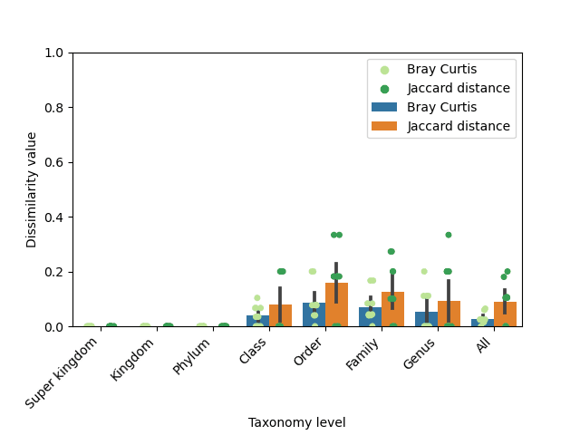

Amplicon sequencing is a powerful research method designed to explore and reveal the taxonomic composition of diverse microbial communities. By focusing on specific genetic regions, researchers can gain insights into the structure and function of these communities. Typically, ribosomal ribonucleic acid (rRNA) or ribosomal deoxyribonucleic acid (rDNA) is sequenced, with particular attention given to key marker genes. For bacteria and archaea, the 16S rRNA gene is commonly targeted; for eukaryotes, the 18S rRNA gene is used, while fungi are often studied through internal transcribed spacers (ITS) regions. These marker genes provide the genetic signatures necessary for identifying and categorizing the various organisms present within a sample.<br>

In this tutorial, we will dive into the MGnify amplicon pipeline v5.0 on Galaxy, a sophisticated toolset for microbial analysis. This pipeline is a ported version of the same well-established amplicon pipeline used by MGnify, a leading metagenomics platform dedicated to the analysis and archiving of microbiome sequences. MGnify has seen significant adoption and growth in recent years (); as of the time of writing, over 500k analyses have been conducted using this pipeline for amplicon data alone (). One of the key advantages of this workflow is that it does not require users to know their target region in advance—it automatically processes all amplicons for ITS, SSU, and LSU, and can even handle mixed amplicon datasets. This workflow does not currently generate ASVs (Amplicon Sequence Variants). If ASV-level resolution is required, we recommend reading the [DADA2 tutorial]() or utilizing .

. The figure illustrates the workflow of the MGnify amplicon pipeline, beginning with quality control to filter low-quality reads. The processed reads then proceed to the rRNA-prediction step, where SSU and LSU regions are classified and their taxonomic abundance is visualized. Following this, the pipeline handles the ITS regions, classifying them and visualizing their taxonomic abundance using pie charts. Each stage is clearly outlined, showcasing how data moves through the pipeline and is analyzed to provide comprehensive insights into microbial communities."){: style="width:45%; align-self:center"}

Our journey through this tutorial will provide a comprehensive understanding of the different sub-workflows that make up the pipeline and how each contributes to the overall analysis process. We will explore how these workflows are executed within the Galaxy platform. Additionally, we will explore which databases and tools are integrated into the pipeline, giving us a clearer picture of the resources that power these analyses. By the end of this tutorial you will have the knowledge to apply the MGnify amplicon pipeline effectively in your own research.<br>

Before diving into the tutorial, it is strongly recommended to review the Introduction to Microbiome Analysis slides or watch the corresponding video, which are linked in the requirements section above, especially if you are new to this field. These slides will provide essential background knowledge and help you better understand the concepts covered in this tutorial.

> <warning-title>Slight discrepancy between runs</warning-title>
> The outputs generated by this workflow may vary slightly between runs due to the non-deterministic behavior of the MAPseq version used. While this variation does not always occur, certain processing steps involve elements of randomness that can lead to minor differences in the results on different executions.
>
> 
>
{: .warning}

> <agenda-title></agenda-title>
>
> In this tutorial, we will deal with:
>
> 1. TOC
> {:toc}
>
{: .agenda}

In this tutorial, we'll cover four different versions:
1. Executing the amplicon workflow using ENA data (default)
2. Executing the amplicon workflow using own reads, which requires some minor adjustments
2. Executing each subworkflow individually using ENA data
2. Executing each subworkflow individually using own reads




# Import datasets

Let's begin with creating a history and giving it a suitable name.

> <hands-on-title>Create history</hands-on-title>
>
> 1. Create a new history
>
>    
>
> 2. Rename the created history
>
>    
>
{: .hands_on}


<div class="Executing-the-full-workflow-using-ENA-data" markdown="1">

> <hands-on-title>Downloading datasets</hands-on-title>
> 1. Click on  **Upload Data** at the top of left panel
>    - Select  **Paste/Fetch Data** at the bottom
>    - Copy  and paste the following URLs into the text box:
>    - Click on **Start**
>
>      ```
>      https://zenodo.org/records/13710235/files/ribo.claninfo
>      https://zenodo.org/records/13710235/files/accessions.csv
>      ```
>
>    - **Close** the window
>    - **Note**: The file `ribo.claninfo` is required for the workflow to run properly. `ribo.claninfo` provides classification information for the rRNA models in ribo.cm, grouping them into so called clans.
{: .hands_on}

</div>


<div class="Executing-subworkflows-using-ENA-data" markdown="1">

> <hands-on-title>Downloading datasets</hands-on-title>
> 1. Click on  **Upload Data** at the top of left panel
>    - Select  **Paste/Fetch Data** at the bottom
>    - Copy  and paste the following URLs into the text box:
>    - Click on **Start**
>
>      ```
>      https://zenodo.org/records/13710235/files/ribo.claninfo
>      https://zenodo.org/records/13710235/files/accessions.csv
>      ```
>
>    - **Close** the window
>    - **Note**: The file `ribo.claninfo` is required for the workflow to run properly. `ribo.claninfo` provides classification information for the rRNA models in ribo.cm, grouping them into so called clans.
>
> 2.  using the parameters:
>    -  *"select input type"*: `A list of ENA accession IDs, one per row`
>    -  *"Accession"*: `accessions.csv`
{: .hands_on}

</div>

<div class="Executing-subworkflows-using-own-data" markdown="1">

> <hands-on-title>Downloading datasets</hands-on-title>
>
> 1. Click on  **Upload Data** at the top of left panel
>    - Select  **Paste/Fetch Data** at the bottom
>    - Copy  and paste the following URLs into the text box:
>    - Click on **Start**
>
>      ```
>      https://zenodo.org/records/13710235/files/ribo.claninfo
>      ```
>
>   - **Close** the window
>   - **Note**: The file `ribo.claninfo` is required for the workflow to run properly. `ribo.claninfo` provides classification information for the rRNA models in ribo.cm, grouping them into so called clans.
>
{: .hands_on}

</div>


<div class="Executing-the-full-workflow-using-own-data" markdown="1">

> <hands-on-title>Downloading datasets</hands-on-title>
> 1. Click on  **Upload Data** at the top of left panel
>    - Select  **Paste/Fetch Data** at the bottom
>    - Copy  and paste the following URLs into the text box:
>    - Click on **Start**
>
>      ```
>      https://zenodo.org/records/13710235/files/ribo.claninfo
>      ```
>
>   - **Close** the window
>   - **Note**: The file `ribo.claninfo` is required for the workflow to run properly. `ribo.claninfo` provides classification information for the rRNA models in ribo.cm, grouping them into so called clans.
{: .hands_on}

</div>


<div class="Executing-the-full-workflow-using-own-data" markdown="1">
# Upload own data files

> <hands-on-title>Upload own data file</hands-on-title>
>
> 1. Upload the reads in `fastqsanger` or `fastqsanger.gz` format
>
>    
>
> 2. Create a collection out of the single-end datasets
>
>    
>
> 3. Create a paired-end end collection for the paired-end datasets
>
>    
>
{: .hands_on}

</div>

# Workflow Selection Guidance
Before running the rRNA or ITS sub-workflows, it's important to know the nature of your amplicon data:
- If your sequencing targets 16S or 18S rRNA genes, use the rRNA-prediction workflow.
- If your sequencing targets fungal ITS regions, use the ITS workflow.
- You do not need to run both workflows unless your dataset includes both types of sequences.

# Quality control
Quality control (QC) is a crucial first step in any metagenomic analysis pipeline. It ensures that sequencing reads are free from contaminants, low-quality bases, and adapter sequences, which can negatively impact downstream analyses. In the MGnify v5.0 pipeline, QC involves trimming, filtering, and assessing read quality using tools like Trimmomatic, SeqPrep, and FastQC. This process guarantees that only high-quality data progresses, providing reliable results for subsequent steps like taxonomic classification and diversity analysis.<br>
The quality control phase in this amplicon pipeline is split into two sub-workflows: one dedicated to paired-end reads and another for single-end reads.
In addition to quality-controlled single- and paired-end reads, both subworkflows also generate a MultiQC report that summarizes quality metrics across all input files. To help you interpret the MultiQC report, we recommend reviewing the Quality Control tutorial linked in the requirements section.

## Single-end reads
The quality control sub-workflow for single-end reads involves a series of tools that perform trimming, filtering, and quality assessment to ensure high-quality sequencing data. The workflow includes the following tools:
-  trims low quality sequencing regions. Using the following parameters:
    - *"SLIDING WINDOW - Number of bases to average across"*: `4`
    - *"SLIDING WINDOW - Average quality required"*: `15`
    - *"LEADING"*: `3`
    - *"TRAILING"*: `3`
    - *"MINLEN"*: `100`
    - *"Quality score encoding"*: `Phred33`
-  filters sequences shorter than 100 nucleotides in length out
-  provides advanced filtering, trimming, and data quality control, allowing for the removal of duplicate reads, low-complexity sequences, and additional quality filtering. Using the following parameters:
    - *"Is this library paired- or single-end?"*: `Single-end`
    - *"Apply filter treatments?"*: `Yes`
    - *"Filter sequences based on their length?"*: `No`
    - *"Filter sequences based on quality score?"*: `No`
    - *"Filter sequences based on their base content?"*: `Yes`
    - *"Filter sequences based on their GC percentage?"*: `No`
    - *"Filter sequences based on their number of N bases?"*: `No`
    - *"Filter sequences based on their percentage of N bases?"*: `Yes`
    - *"Maximal N percentage threshold to conserve sequences"*: `10`
    - *"Filter sequences with characters other than A, T, C, G and N?"*: `Yes`
    - *"Filter sequences based on their complexity?"*: `No`
    - *"Apply trimming treatments?"*: `No`
-  converts the quality control processed reads from FASTQ into FASTA format
-  performs comprehensive quality checks on sequencing data, providing visual summaries and detailed metrics for read quality
-  aggregates reports from multiple quality control FASTQC reports, into a single, consolidated report for easier interpretation. Using the following parameters:
    - **Which tool was used generate logs?**: `FastQC`
    - **Type of FastQC output?**: `Raw data`

<div class="Executing-subworkflows-using-ENA-data" markdown="1">
> <hands-on-title>Executing the single-end quality control sub-workflow</hands-on-title>
> 1. **Import** the [single-end quality control sub-workflow]({{ site.baseurl }}{{ page.dir }}workflows/mgnify-amplicon-pipeline-v5-quality-control-single-end.ga)
>
>    
>
> 2. **Run**  the single-end sub-workflow using the following input:
>    - **Single-end reads**: `Single-end data` collection
>
>    
>
{: .hands_on}
</div>

<div class="Executing-subworkflows-using-own-data" markdown="1">
> <hands-on-title>Executing the single-end quality control sub-workflow</hands-on-title>
> 1. **Import** the [single-end quality control sub-workflow]({{ site.baseurl }}{{ page.dir }}workflows/mgnify-amplicon-pipeline-v5-quality-control-single-end.ga)
>
>    
>
> 2. Click on  **Upload Data** at the top of left panel
> 3. Click on  **Choose local file** and select the desired single-end files in `fastqsanger` or `fastqsanger.gz` format
> 4. Click on **Start** and **Close** the window
> 5. When the upload is finished create a collection for all single-end reads files:
>
>    
>
> 5. **Run**  the single-end sub-workflow using the following input:
>    - **Single-end reads**: Single-end reads collection we just created
>
>    
>
{: .hands_on}
</div>

## Paired-end reads
The quality control sub-workflow for paired-end reads is designed to optimize the accuracy and reliability of sequencing data by addressing the unique challenges of handling paired-end sequences. The tools included are:
-  A versatile tool that performs quality filtering, trimming, adapter removal, and other preprocessing tasks specifically for paired-end reads. Using the following parameters:
    - *"Single-end or paired reads"*: `Paired`
    - *"Filter Options"*:
        - *"Quality filtering options"*:
            - *"Qualified quality phred"*: `20`
            - *"Unqualified percent limit"*: `20`
        - *"Length filtering options"*:
            - *"Length required"*: `70`
    - *"Read Modification Options"*:
        - *"Base correction by overlap analysis options"*:
            - *"Enable base correction"*: `Yes`
-  Merges the forward and reverse reads. Using the default parameters.
-  trims low quality sequencing regions. Using the following parameters:
    - *"SLIDING WINDOW - Number of bases to average across"*: `4`
    - *"SLIDING WINDOW - Average quality required"*: `15`
    - *"LEADING"*: `3`
    - *"TRAILING"*: `3`
    - *"MINLEN"*: `100`
    - *"Quality score encoding"*: `Phred33`
-  filters sequences shorter than 100 nucleotides in length out
-  provides advanced filtering, trimming, and data quality control, allowing for the removal of duplicate reads, low-complexity sequences, and additional quality filtering. Using the following parameters:
    - *"Is this library paired- or single-end?"*: `Single-end`
    - *"Apply filter treatments?"*: `Yes`
    - *"Filter sequence based on their length?"*: `No`
    - *"Filter sequences based on quality score?"*: `No`
    - *"Filter sequences based on their base content?"*: `Yes`
    - *"Filter sequences based on their GC percentage?"*: `No`
    - *"Filter sequences based on their number of N bases?"*: `No`
    - *"Filter sequences based on their percentage of N bases?"*: `Yes`
    - *"Maximal N percentage threshold to conserve sequences"*: `10`
    - *"Filter sequences with characters other than A, T, C, G and N?"*: `Yes`
    - *"Filter sequences based on their complexity?"*: `No`
    - *"Apply trimming treatments?"*: `No`
-  converts the quality control processed reads from FASTQ into FASTA format
-  performs comprehensive quality checks on sequencing data, providing visual summaries and detailed metrics for read quality
-  aggregates reports from multiple quality control FASTQC reports, into a single, consolidated report for easier interpretation. Using the following parameters:
    - *"Which tool was used generate logs?"*: `FastQC`
    - *"Type of FastQC output?"*: `Raw data`

<div class="Executing-subworkflows-using-ENA-data" markdown="1">
> <hands-on-title>Executing the paired-end quality control sub-workflow</hands-on-title>
> 1. **Import** the [paired-end quality control sub-workflow]({{ site.baseurl }}{{ page.dir }}workflows/mgnify-amplicon-pipeline-v5-quality-control-paired-end.ga)
>
>    
>
> 2. **Run**  the paired-end sub-workflow using the following input:
>    - **Paired-end reads**: `Pair-end data` collection
>
>    
>
{: .hands_on}
</div>

<div class="Executing-subworkflows-using-own-data" markdown="1">
> <hands-on-title>Executing the paired-end quality control sub-workflow</hands-on-title>
> 1. **Import** the [paired-end quality control sub-workflow]({{ site.baseurl }}{{ page.dir }}workflows/mgnify-amplicon-pipeline-v5-quality-control-paired-end.ga)
>
>    
>
> 2. Click on  **Upload Data** at the top of left panel
> 3. Click on **Choose local file** and select the desired paired-end files in `fastqsanger` or `fastqsanger.gz` format
> 4. Click on **Start** and **Close** the window
> 5. When the upload is finished create a paired collection for all paired-end reads files:
>
>    
>
> 6. **Run**  the paired-end sub-workflow using the following input:
>    - **Paired-end reads**: Paired-end reads collection, which was created in the steps above
>
>    
>
{: .hands_on}
</div>

# rRNA-prediction
The rRNA prediction sub-workflow focuses on identifying and classifying ribosomal RNA (rRNA) sequences, particularly small subunit (SSU) and large subunit (LSU) rRNAs. This workflow uses several tools for comparison against covariance models, filtering, classification, and visualization:
-  the datasets are compared against the LSU and SSU models from Rfam (v13.0). Using the following parameters:
    - *"Subject covariance models"*: `Locally installed covariance models`
    - *"Covariance models"*: `Mgnify 5.0 RFAM Models`
    - *"Calculate E-values as if the search space size is 'x' megabases (Mb)"*: `1000`
    - *"Options controlling acceleration heuristics"*: `Use HMM only, don't use a CM at all (--hmmonly)`
    - *"Omit the alignment section from the main input"*: `Yes`
-  removes overlapping reads that belong to the same clan. Using the default parameters.
-  extract sequences from a FASTA file
-  classifies matching OTUs to the reads, used in conjunction with SILVA (v132) SSU and LSU databases. Using the following parameters:
    - *"Use cached database or database from history"*: `Cached database`
    - *"Using built-in mapseq DB**. MAPseq is used in conjunction with the following databases:
        1. `MGnify LSU (v5.0.7) - silva_lsu-20200130 downloaded at 2023-09-26`
        2. `MGnify SSU (v5.0.7) - silva_ssu-20200130 downloaded at 2023-09-26`
    - *"Create OTU table"*: `Yes`
    - *"Create taxon table for Krona"*: `Yes`
    - *"Top hits"*: `80`
    - *"Top OTUs"*: `40`
    - *"Output format"*: `simple`
-  generates pie charts demonstrating the taxonomic abundance. Using the following parameters:
    - *"What is the type of your input data"*: `Tabular`
    - *"Provide a name for the basal rank"*: `Root`
-  converts the taxonomic abundance tables to JSON and HDF5 formats. Using the following parameters:
    - *"Choose the source BIOM format"*: `Tabular File`
    - *"Process metadata associated with observations when converting"*: `taxonomy`
    - *"Choose the output type"*: `BIOM`
    - *"Table Type"*: `OTU table`
    - *"BIOM format type"*:
        1. `JSON-formatted table(BIOM1)`
        2. `HDF5-formatted table(BIOM2)`

<div class="Executing-subworkflows-using-ENA-data" markdown="1">

> <hands-on-title>Executing the rRNA-prediction sub-workflow</hands-on-title>
>
> 1. **Import** the [rRNA-prediction sub-workflow]({{ site.baseurl }}{{ page.dir }}workflows/mgnify-amplicon-pipeline-v5-rrna-prediction.ga)
>
>    
>
> 2. Using  merge both quality processed single- and paired-end reads collections: `Single-end post quality control FASTA files` and `Paired-end post quality control FASTA files`
> 3. **Run**  the rRNA-prediction sub-workflow using the following inputs:
>    - **Processed sequences**: Quality processed sequences (merged collection)
>    - **Clan information file**: `ribo.claninfo`
>
>    
>
{: .hands_on}
</div>

<div class="Executing-subworkflows-using-own-data" markdown="1">
> <hands-on-title>Executing the rRNA-prediction sub-workflow</hands-on-title>
> 1. **Import** the [rRNA-prediction sub-workflow]({{ site.baseurl }}{{ page.dir }}workflows/mgnify-amplicon-pipeline-v5-rrna-prediction.ga)
>
>    
> 2. Using  merge both quality processed single- and paired-end reads collections: `Single-end post quality control FASTA files` and `Paired-end post quality control FASTA files`
> 3. **Run**  the rRNA-prediction sub-workflow using the following inputs:
>    - **Processed sequences**: Quality processed sequences (merged collection)
>    - **Clan information file**: `ribo.claninfo`
>
>    
>
{: .hands_on}
</div>

# ITS
The ITS (Internal Transcribed Spacer) workflow is designed for the identification and taxonomic classification of fungal sequences, specifically focusing on ITS regions. The sub-workflow includes several tools to mask, classify, and visualize taxonomic data:
-  masks SSU and LSU regions from a FASTA file based on intervals defined in a BED regions file. Using the default parameters.
-  classifies matching OTUs to the reads, used in conjunction with the UNITE (v8.0) and ITSoneDB (v1.138) databases. Using the following parameters:
    - *"Use cached database or database from history"*: `Cached database`
    - *"Using built-in mapseq DB**. MAPseq is used in conjunction with the following databases:
        1. `MGnify ITS ITSonedb (v5.0.7) - ITSoneDB-20200214 downloaded at 2023-09-26`
        2. `MGnify ITS UNITE (v5.0.7) - UNITE-20200214 downloaded at 2023-09-26`
    - *"Create OTU table"*: `Yes`
    - *"Create taxon table for Krona"*: `Yes`
    - *"Top hits"*: `80`
    - *"Top OTUs"*: `40`
    - *"Output format"*: `simple`
-  generates pie charts demonstrating the taxonomic abundance. Using the following parameters:
    - *"What is the type of your input data"*: `Tabular`
    - *"Provide a name for the basal rank"*: `Root`
-  converts the taxonomic abundance tables to JSON and HDF5 formats. Using the following parameters:
    - *"Choose the source BIOM format"*: `Tabular File`
    - *"Process metadata associated with observations when converting"*: `taxonomy`
    - *"Choose the output type"*: `BIOM`
    - *"Table Type"*: `OTU table`
    - *"BIOM format type"*:
        1. `JSON-formatted table(BIOM1)`
        2. `HDF5-formatted table(BIOM2)`

<div class="Executing-subworkflows-using-ENA-data" markdown="1">
> <hands-on-title>Executing the ITS sub-workflow</hands-on-title>
> 1. **Import** the [ITS sub-workflow]({{ site.baseurl }}{{ page.dir }}workflows/mgnify-amplicon-pipeline-v5-its.ga)
>
>    
>
> 2. **Run**  the ITS sub-workflow using the following inputs:
>    - *"LSU and SSU BED"*: `LSU and SSU BED regions`
>    - *"Processed sequence"*: Quality processed sequences (merged single-end and paired-end collection)
>
>    
>
{: .hands_on}
</div>

<div class="Executing-subworkflows-using-own-data" markdown="1">
> <hands-on-title>Executing the ITS sub-workflow</hands-on-title>
> 1. **Import** the [ITS sub-workflow]({{ site.baseurl }}{{ page.dir }}workflows/mgnify-amplicon-pipeline-v5-its.ga)
>
>    
>
> 2. **Run**  the ITS sub-workflow using the following inputs:
>    - *"LSU and SSU BED"*: `LSU and SSU BED regions`
>    - *"Processed sequence"*: Quality processed sequences (merged single-end and paired-end collection)
>
>    
>
{: .hands_on}
</div>

# Summary tables
The summary tables sub-workflow takes as input the taxonomic abundance tables generated from all datasets within the pipeline. It processes these tables to create two comprehensive taxonomic summary tables:
1. Full Taxonomic Summary Table: This table provides detailed taxonomic information spanning all levels, from superkingdom down to species. It offers a complete overview of the taxonomic composition across all samples, facilitating in-depth analyses of microbial communities.

2. Phylum-Level Summary Table: Focused specifically on the phylum level, this table aggregates data to provide a clear view of the phylum distribution within the datasets. This level-specific summary is particularly useful for high-level comparisons and identifying major trends within the microbial communities.

Both summary tables serve as essential inputs for downstream interpretation, helping to visualize and compare the taxonomic profiles across multiple samples (for example, see our tutorial on[Calculating α and β diversity]()).

<div class="Executing-subworkflows-using-ENA-data" markdown="1">

> <hands-on-title>Executing the summary tables sub-workflow</hands-on-title>
> 1. **Import** the [summary tables sub-workflow]({{ site.baseurl }}{{ page.dir }}workflows/mgnify-amplicon-summary-tables.ga)
>
>    
>
> 2. **Run**  the summary tables sub-workflow 4 times using the following inputs:
>    - First run:
>      - *"OTU tables"*: `LSU OTU tables (SILVA DB)`
>      - *"Taxonomic abundance summary table name"*:
>        ```
>        LSU taxonomic abundance summary table
>        ```
>      - *"Phylum level taxonomic abundance summary table name"*:
>        ```
>        LSU phylum level taxonomic abundance summary table
>        ```
>    - Second run:
>      - *"OTU tables"*: `SSU OTU tables (SILVA DB)`
>      - *"Taxonomic abundance summary table name"*:
>        ```
>        SSU taxonomic abundance summary table
>        ```
>      - *"Phylum level taxonomic abundance summary table name"*:
>        ```
>        SSU phylum level taxonomic abundance summary table
>        ```
>    - Third run:
>      - *"OTU tables"*: `ITS OTU tables (UNITE DB)`
>      - *"Taxonomic abundance summary table name"*:
>        ```
>        UNITE taxonomic abundance summary table
>        ```
>      - *"Phylum level taxonomic abundance summary table name"*:
>        ```
>        UNITE phylum level taxonomic abundance summary table
>        ```
>    - Fourth run:
>      - *"OTU tables"*: `ITS OTU tables (ITSoneDB)`
>      - *"Taxonomic abundance summary table name"*:
>        ```
>        ITSoneDB taxonomic abundance summary table
>        ```
>      - *"Phylum level taxonomic abundance summary table name"*:
>        ```
>        ITSoneDB phylum level taxonomic abundance summary table
>        ```
>
>    
>
{: .hands_on}
</div>

<div class="Executing-subworkflows-using-own-data" markdown="1">
> <hands-on-title>Executing the summary tables sub-workflow</hands-on-title>
> 1. **Import** the [summary tables sub-workflow]({{ site.baseurl }}{{ page.dir }}workflows/mgnify-amplicon-summary-tables.ga)
>
>    
>
> 2. **Run**  the summary tables sub-workflow 4 times using the following inputs:
>    - First run:
>      - *"OTU tables"*: `LSU OTU tables (SILVA DB)`
>      - *"Taxonomic abundance summary table name"*:
>        ```
>        LSU taxonomic abundance summary table
>        ```
>      - *"Phylum level taxonomic abundance summary table name"*:
>        ```
>        LSU phylum level taxonomic abundance summary table
>        ```
>    - Second run:
>      - *"OTU tables"*: `SSU OTU tables (SILVA DB)`
>      - *"Taxonomic abundance summary table name"*:
>        ```
>        SSU taxonomic abundance summary table
>        ```
>      - *"Phylum level taxonomic abundance summary table name"*:
>        ```
>        SSU phylum level taxonomic abundance summary table
>        ```
>    - Third run:
>      - *"OTU tables"*: `ITS OTU tables (UNITE DB)`
>      - *"Taxonomic abundance summary table name"*:
>        ```
>        UNITE taxonomic abundance summary table
>        ```
>      - *"Phylum level taxonomic abundance summary table name"*:
>        ```
>        UNITE phylum level taxonomic abundance summary table
>        ```
>    - Fourth run:
>      - *"OTU tables"*: `ITS OTU tables (ITSoneDB)`
>      - *"Taxonomic abundance summary table name"*:
>        ```
>        ITSoneDB taxonomic abundance summary table
>        ```
>      - *"Phylum level taxonomic abundance summary table name"*:
>        ```
>        ITSoneDB phylum level taxonomic abundance summary table
>        ```
>
>    
>
{: .hands_on}
</div>

# Complete Workflow (including all sub-workflows)
If you're working with SSU, LSU, and ITS data, it's beneficial to run the entire workflow to take full advantage of its capabilities. Even if you're unsure which of these datasets you have, executing the complete workflow ensures that all relevant analyses are applied, maximizing the insight gained from your microbial data.

<div class="Executing-the-full-workflow-using-ENA-data" markdown="1">
> <hands-on-title>Executing the complete MGnify amplicon pipeline</hands-on-title>
> 1. **Import** the [complete MGnify amplicon workflow]({{ site.baseurl }}{{ page.dir }}workflows/mgnify-amplicon-pipeline-v5-complete.ga)
>
>    
>
> 2. **Run**  the workflow using the following inputs:
>    - *"SRA accession list"*: `accessions.csv`
>    - *"Clan information file"*: `ribo.claninfo`
>
>    
>
{: .hands_on}
</div>

<div class="Executing-the-full-workflow-using-own-data" markdown="1">
> <hands-on-title>Executing the complete MGnify amplicon pipeline</hands-on-title>
> 1. **Import** the [complete MGnify amplicon workflow]({{ site.baseurl }}{{ page.dir }}workflows/mgnify-amplicon-pipeline-v5-complete.ga)
>
>    
>
> 2. Adjust workflow:
>    - Click on  **Workflows** in the left side-bar
>    - Search for *"MGnify's amplicon pipeline v5.0 - complete"* workflow
>    - Click on  **Edit**
>    - **Remove** the steps:
>      - *"1: SRA accession list"*
>      - *"22: fastq-dl"*
>      - *"23: Convert compressed file to uncompressed"
>      - *"24: Convert compressed file to uncompressed"
>      - *"25: Text reformatting"
>      - *"26: Text reformatting"
>      - *"27: Convert uncompressed file to compressed"
>      - *"28: Convert uncompressed file to compressed"
>    - Click on **Inputs** in the left side-panel and add an **Input dataset collection**
>      - Add the *"Label"*: `Single-end reads`
>      - Connect it to the *"Single-end reads"* input in step *"29: MGnify's amplicon pipeline v5.0 - Quality control SE"*
>    - Click on **Inputs** in the left side-panel and add an **Input dataset collection**
>      - Add the *"Label"*: `Paired-end reads`
>      - Change *"Collection type"* to `list:paired`
>        - Connect it to the *"Paired-end reads"* input in step *"30: MGnify's amplicon pipeline v5.0 - Quality control PE"*
>    - Click on  **Save** and then  **Run** in the right side-panel
> 3. **Run**  the workflow using the following inputs:
>    - *"Single-end reads"*: Single-end reads collection
>    - *"Paired-end reads"*: Paired-end reads collection
>    - *"Clan information file"*: Upload the clan information file, which contains details about the sequence family assignments required for accurate taxonomic classification `ribo.claninfo`
>    - *"Covariance models"*: Provide the covariance models necessary for the rRNA prediction step, enabling accurate alignment and prediction of ribosomal RNA sequences `ribo.cm`
>
>    
>
> > <tip-title>Input reformatting</tip-title>
> > To achieve results comparable to those from MGnify, it is recommended that your sequence headers follow this format: `@accession.spotID-$spotName-$readNumber`. For example: `@ERR2015153.1-M01170:20:000000000-AMCTR:1:1101:17071:1623-2`
> {: .tip}
>
{: .hands_on}
</div>

# MAPseq-to-ampvis2
The MAPseq to ampvis2 workflow transforms MAPseq OTU tables and accompanying metadata into a format compatible with ampvis2. This process restructures the MAPseq output into well-organized object files that can be directly used in ampvis2 for downstream analyses such as rank abundance plots, heatmaps, and other visualizations.

> <hands-on-title>Downloading datasets</hands-on-title>
> 1. Click on  **Upload Data** at the top of left panel
>    - Select  **Paste/Fetch Data** at the bottom
>    - Copy  and paste the following:
>      ```
>      https://zenodo.org/records/13347829/files/SRR11032273.tsv
>      https://zenodo.org/records/13347829/files/SRR11032274.tsv
>      https://zenodo.org/records/13347829/files/SRR11032275.tsv
>      https://zenodo.org/records/13347829/files/SRR11032276.tsv
>      https://zenodo.org/records/13347829/files/SRR11032277.tsv
>      https://zenodo.org/records/13347829/files/SRR11038211.tsv
>      https://zenodo.org/records/13347829/files/SRR11038212.tsv
>      https://zenodo.org/records/13347829/files/SRR11038213.tsv
>      https://zenodo.org/records/13347829/files/SRR11038214.tsv
>      https://zenodo.org/records/13347829/files/SRR11038215.tsv
>      https://zenodo.org/records/13347829/files/test_metadata_formatted.tabular
>      ```
>    - Click on **Start**
> 2. Create a collection out of the tsv files
>
>    
>
{: .hands_on}

> <hands-on-title>Executing the MAPseq-to-ampvis2 workflow</hands-on-title>
> 1. **Import** the [MAPseq-to-ampvis2 workflow]({{ site.baseurl }}{{ page.dir }}workflows/mapseq-to-ampvis2.ga)
>
>    
>
> 2. **Run**  the workflow using the following inputs:
>      - *"MAPseq outputs"*: Provide the OTU tables generated by MAPseq, which need to be reformatted for ampvis2
>      - *"Metadata"*: Contextual information associated with the data from the OTU tables
>
>    
>
{: .hands_on}

With the ampvis2 object now successfully generated, users can proceed to create a variety of informative visualizations—such as heatmaps—to explore and interpret microbial community composition, identify patterns across samples, and support further ecological or statistical analysis.

> <hands-on-title>Utilizing the ampvis2 object to generate a heatmap</hands-on-title>
>
> 1. :
>    - **Ampvis2 RDS dataset**: Choose `Ampvis2 object` from your history
>    - **The taxonomic level to aggregate the OTUs**: `Order`
>    - **How to show OTUs without taxonomic information**: `Remove OTUs without taxonomic information`
>    - Select light blue for **Start color for the heatmap**
>    - Select dark red for **End color for the heatmap**
>
{: .hands_on}

Let us now take a look at the generated heatmap.

{: style="width:75%;"}


> <question-title>i</question-title>
>
> 1. Which sample has the highest relative abundance of Lactobacillales?
> 2. Which taxonomic order is most dominant in sample SRR1038213?
>
> > <solution-title></solution-title>
> >
> > 1. Sample SRR11032276 has the highest relative abundance of Lactobacillales at 97.7%, indicating it is strongly dominated by this bacterial order.
> > 2. In sample SRR11038213, Tremellales is the most dominant order, with a relative abundance of 50%.
> >
> {: .solution}
>
{: .question}

This was a brief glimpse into the capabilities of ampvis2. We encourage you to further explore the full range of features available in Ampvis2, as well as other powerful visualization tools offered on the Galaxy platform.

# Conclusion
This tutorial provided a step-by-step guide to executing the different sub-workflows of the MGnify v5.0 amplicon pipeline on Galaxy. By following these steps, you should be able to process, analyze, and visualize your amplicon sequencing data efficiently.
