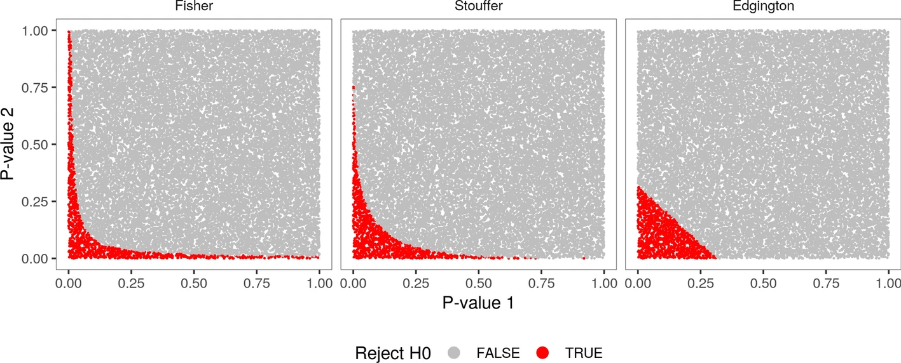

The multiGSEA package was designed to run a robust GSEA-based pathway enrichment for multiple omics layers. The enrichment is calculated for each omics layer separately and aggregated p-values are calculated afterwards to derive a composite multi-omics pathway enrichment.

Pathway definitions can be downloaded from up to eight different pathway databases by means of the graphite Bioconductor package (Sales, Calura, and Romualdi 2018). Feature mapping for transcripts and proteins is supported towards Entrez Gene IDs, Uniprot, Gene Symbol, RefSeq, and Ensembl IDs. The mapping is accomplished through the AnnotationDbi package (Pagès et al. 2019) and currently supported for 11 different model organisms including human, mouse, and rat. ID conversion of metabolite features to Comptox Dashboard IDs (DTXCID, DTXSID), CAS-numbers, Pubchem IDs (CID), HMDB, KEGG, ChEBI, Drugbank IDs, or common metabolite names is accomplished through the AnnotationHub package metabliteIDmapping. This package provides a comprehensive ID mapping for more than 1.1 million entries.

This tutorial covers a simple example workflow illustrating how the multiGSEA package works. The omics data sets that will be used throughout the example were originally provided by Quiros et al. (Quirós et al. 2017). In their publication the authors analyzed the mitochondrial response to four different toxicants, including Actinonin, Diclofenac, FCCB, and Mito-Block (MB), within the transcriptome, proteome, and metabolome layer.
In this tutorial we will solely focus on the Actinonin data set.


> <agenda-title></agenda-title>
>
> In this tutorial, we will cover:
>
> 1. TOC
> {:toc}
>
{: .agenda}

# Preparing the Data

To perform pathway enrichment with MultiGSEA, you'll need omics datasets in the file type TSV . Each individual data set contains four columns representing the feature (denoted as Symbol), the log2 fold change (logFC), the p-value (pValue), and the adjusted p-values (adj.pValue). We'll use example data provided on Zenodo.

## Get data

### Data Upload

> <hands-on-title> Getting datasets </hands-on-title>
> 1. Create a new history for this tutorial.
>
>    
>
> 2. Import the datasets from [Zenodo]({{ page.zenodo_link }})  into your Galaxy instance:
>    ```
>    https://zenodo.org/records/14216972/files/transcriptome.tsv
>    https://zenodo.org/records/14216972/files/proteome.tsv
>    https://zenodo.org/records/14216972/files/metabolome.tsv
>    ```
{: .hands_on}


# Running MultiGSEA

In this step, you'll use the MultiGSEA tool to perform GSEA-based pathway enrichment on the uploaded datasets.

> <hands-on-title> Task description </hands-on-title>
>
> 1. Run  with the following parameters
>    - *"Select transcriptomics data"*: `Enabled`
>        -  *"Transcriptomics data"*: `Transcriptomics`
>        -  *"Gene ID format in transcriptomics data"*: `SYMBOL`
>    - *"Select proteomics data"*: `Enabled`
>        -  *"Proteomics data"*: `Proteomics`
>        -  *"Gene ID format in proteomics data"*: `SYMBOL`
>    - *"Select metabolomics data"*: `Enabled`
>        -  *"Metabolomics data"*: `Metabolomics`
>        -  *"Metabolite ID format"*: `HMDB`
>    - *"Supported organisms"*: `Homo sapiens (Human)`.
>    - *"Pathway databases"*: `KEGG`
>    - *"Combine p-values method"*: `Stouffer`
>    - *"P-value correction method"*: `BH`
>
>    > <tip-title>About the parameters</tip-title>
>    > - **Pathway databases**: Databases often contain their own format in which pathway definitions are provided. So you can select a relevant database. For the tutorial we choose the preset "All available databases".
>    > - **Combine p-values method**: Choose a method (here `Stouffer` for balanced weighting). To more comprehensively measure a pathway response, multiGSEA provides different approaches to compute an aggregated p value over multiple omics layers. Because no single approach for aggregating p values performs best under all circumstances, Loughin proposed basic recommendations on which method to use depending on structure and expectation of the problem. If small p values should be emphasized, Fisher’s method should be chosen. In cases where p values should be treated equally, Stouffer’s method is preferable. If large p values should be emphasized, the user should select Edgington’s method. Figure 2 indicates the difference between those three methods.
>    >   
>    > - **P-value correction method** Type I and type II errors depend on each other and thus reducing type I errors through a p value adjustment will likely increase the chance of making a type II error and an appropriate trade-off has to be made. Choose one of the different methods for controlling false discovery rate: For the tutorial choose `BH` (Benjamini-Hochberg).
>    {: .tip}
>
{: .hands_on}


> <question-title></question-title>
>
> 1. What file format is required for the input data in MultiGSEA?
> 2. What is the purpose of the “Combine p-values method” parameter, and which method was selected in this tutorial?
> 3. Why is it important to select pathway databases (e.g., KEGG) when using MultiGSEA?
>
> > <solution-title></solution-title>
> >
> > 1. The required file format is TSV.
> > 2. The “Combine p-values method” parameter is used to aggregate p-values across omics layers. In this tutorial, the method Stouffer was selected to apply balanced weighting.
> > 3. Selecting pathway databases ensures that the analysis uses appropriate and relevant pathway definitions for enrichment.
> >
> {: .solution}
>
{: .question}


# Conclusion

In this tutorial, you explored the capabilities of MultiGSEA for performing pathway enrichment analysis across multiple omics layers, including transcriptomics, proteomics, and metabolomics data. By following the steps, you learned how to:

 - Prepare and upload the required omics datasets.
 - Configure and execute the MultiGSEA tool within Galaxy.
 -  Combine p-values from different omics layers to derive a unified perspective on pathway enrichment.
