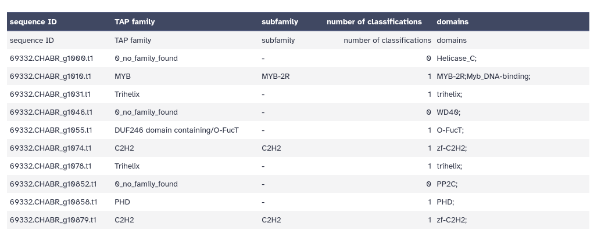
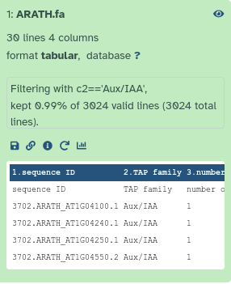
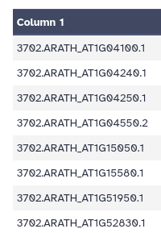
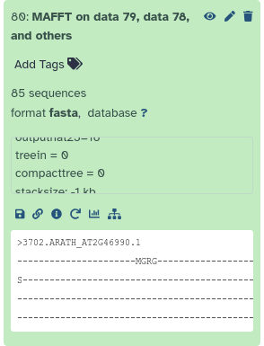
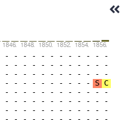
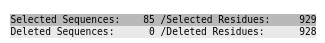
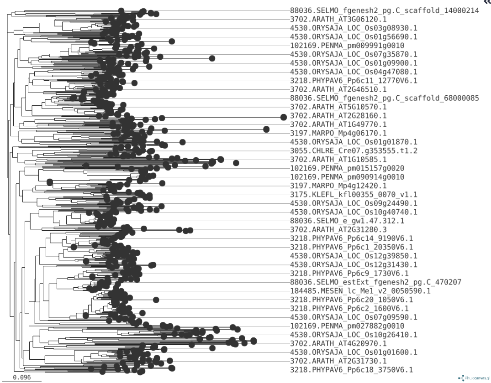
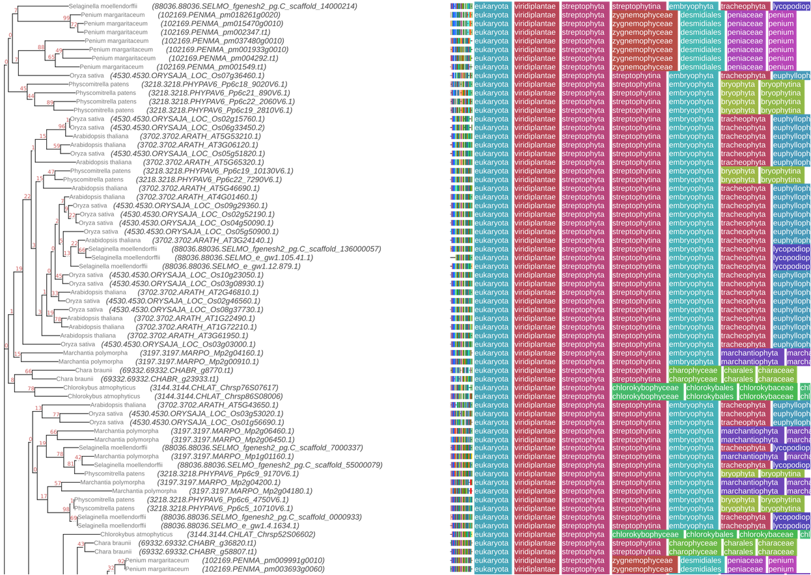

The regulated expression of genes is essential for defining morphology, functional capacity, and developmental fate of both solitary living cells as well as cells inhabiting the social environment of a multicellular organism. In this regard, the regulation of transcription, that is, the synthesis of messenger RNA from a genomic DNA template, plays a crucial role. It contributes to the control of temporal and spatial RNA and protein levels in a cell and therefore has an essential function in all living organisms. Transcription‐associated proteins (TAPs) are essential players in gene regulatory networks (GRNs) as they involved in transcriptional regulation. TAPs are broadly classified into transcription factors (TFs) and transcriptional regulators (TRs). TFs bind sequence‐specifically to regulatory elements, resulting in enhancing or repressing of transcription (; ). TRs, on the other hand, are involved in protein–protein interactions, may serve as regulators at the transcriptional core complex, as co‐activators and co‐repressors, chromatin modification or methylation. Additionally, there are proteins referred to as putative TAPs (PTs) that are thought to be involved in the regulation of transcription, but their exact function is undefined ().

TAPScan v4 () is a comprehensive tool for annotating TAPs with a special focus on species belonging to the Archaeplastida. In general, the detection of TAPs is based on the detection of highly conserved protein domains.

In this tutorial, we will illustrate the identification of TAPs in streptophyte algae and land plants using [TAPScan Classify](https://github.com/Rensing-Lab/TAPscan-classify), followed by construction of the phylogenetic tree.


> <agenda-title></agenda-title>
>
> In this tutorial, we will cover:
>
> 1. TOC
> {:toc}
>
{: .agenda}

# Get data

In this tutorial, we will use representative protein sequences obtained from the [Genome Zoo database](https://github.com/Rensing-Lab/Genome-Zoo). The selected sequences represent different lineages:

- **Streptophyte Algae:**
  - *Chara braunii* (CHABR)
  - *Penium margaritaceum* (PENMA)

- **Bryophytes & Land Plants**
  - *Marchantia polymorpha* (MARPO)
  - *Physcomitrium patens* (PHYPAV6)
  - *Oryza sativa (spp. japonica)* (ORYSAJA)
  - *Selaginella moellendorffii* (SELMO)
  - *Arabidopsis thaliana* (ARATH)


> <hands-on-title> Prepare your Analysis History </hands-on-title>
>
> 1. Create a new history for this tutorial and give it a proper name
>
>    
>
> 2. Rename the history to something descriptive.
>    - for example "TAP analysis in Streptophyte algae and Land plants"
>
>    
>
>
{: .hands_on}

Now, we need to import the data

> <hands-on-title>Import datasets</hands-on-title>
>
> 1. Import the following from [Zenodo]({{ page.zenodo_link }}) or from
>    the shared data library:
>
>    ```
>    https://zenodo.org/records/15056031/files/ARATH.fa
>    https://zenodo.org/records/15056031/files/CHABR.fa
>    https://zenodo.org/records/15056031/files/MARPO.fa
>    https://zenodo.org/records/15056031/files/PENMA.fa
>    https://zenodo.org/records/15056031/files/SELMO.fa
>    https://zenodo.org/records/15056031/files/PHYPAV6.fa
>    https://zenodo.org/records/15056031/files/ORYSAJA.fa
>    ```
>
>    
>
>    
>
> 3. Create a dataset collection with all the input files
>    - name your collection `input sequences`
>
>    
>
{: .hands_on}

If you were successful, all the input files should now be available as dataset collection in your history.

# Identification of TAPs

In order to detect TAPs from the given proteome(s), each sequence out of a species protein set is first scanned for protein domains (stored as profile Hidden Markov Models) using hmmsearch. The domains list consists of 154 profile HMMs and functions as the domain reference during the hmmsearch in background.

Afterwards, [TAPScan Classify](https://github.com/Rensing-Lab/TAPscan-classify) applies specialized rules to assign the protein sequences, scanned for 137 different TAP families, ensuring accurate family assignment using GA-thresholds and coverage values.

## Perform TAPScan Classify

Now that our dataset collection is ready, we can run [TAPScan Classify](https://github.com/Rensing-Lab/TAPscan-classify) to detect TAPs in all species.

> <hands-on-title> Detect TAPs </hands-on-title>
>
> 1.  with the following parameters:
>    -  *"Proteins in FASTA format"*: `input sequences` (the dataset collection you just made)
>
>    
>
>    > <comment-title> on parameter </comment-title>
>    >
>    > If you would like to have Output table from the HMMer Search, Please Check on the box like below:
>    > - *"Output the HMMer domain hits table?"*: `Yes`
>    {: .comment}
>
{: .hands_on}

TAPScan Classify provides the user with three different output files. Each output file is tab-separated.

- **Output 1: "Detected TAPs"** - contains the detected domains and finally assigned TAP family for each gene ID. If domains are assigned to a sequence but not all rules are fulfilled, the sequence is assigned to *“0_no_family_found”*.
- **Output 2: "Family Counts"** - is a summary of the number of members for each TAP family.
- **Output 3: "Detected TAPs Extra"** - is similar to output 1 but contains additional information.

Below is an example of the "Detected TAPs Extra" output. It has 5 columns, the Sequence IDs, followed by the classification into a TAP family, subfamily, the number of classifications, and domains.



> <question-title></question-title>
>
> 1. What is the output format of TAPScan Classify?
> 2. How many sequences belong to the “0_no_family_found” in *Arabidopsis thaliana* (ARATH) ?
> 3. What extra information does Output 3 include compared to Output 1?
>
> > <solution-title>Hints</solution-title>
> >
> > 1. This is written on the history outputs in Galaxy
> > 2. Output 2, "Counts", contains this information
> > 3. Open one of the files in output 1 (Detected TAPs) and output 3 (Detected TAPs Extra), and compare the column headers
> >
> {: .solution}
>
>
> > <solution-title></solution-title>
> >
> > 1. Tabular
> > 2. 675, You can find this number by clicking on the eye button for Galaxy dataset output 2 for ARATH.
> > 3. Output 3 contains information about subfamilies with an additional column that provides more details beyond what is included in Output 1.
> >
> {: .solution}
>
{: .question}

Now that we have the output from TAPScan Classify, we can filter the results by selecting a TAP family so that we can run phylogenetic analysis on that. To demonstrate, we chose the Aux/IAA TAP family. A brief overview of this TAP family: Aux/IAA proteins function as transcriptional repressors (TRs) in the auxin signaling pathway. They inhibit the expression of auxin-responsive genes by dimerizing with auxin response factor (ARF) transcriptional activators. This repression prevents ARFs from activating their target genes, thereby controlling auxin-regulated processes such as cell division, elongation, and differentiation ()

In order to filter the TAPScan output, we need to first filter either Output 1 or Output 3 by using the Filter tool. This will allow us to select only the entries corresponding to Aux/IAA TAP family.

> <hands-on-title> Filter the TAPScan output Based on the Column  </hands-on-title>
>
> 1.  with the following parameters:
>    -  *"Filter"*: `Detected TAPs` (Output 1 of **TAPScan Classify** )
>    - *"With following condition"*: `c2=='Aux/IAA'`
>    - *"Number of header lines to skip"*: `1`
>
>    > <comment-title> What's happening in this section? </comment-title>
>    >
>    > This step filters the TAPScan results to retain only sequences classified as belonging to the our desired (Aux/IAA) TAP family.
>    {: .comment}
>    > <question-title></question-title>
>    >
>    > How many sequences belong to the 'Aux/IAA' TAP family in *Arabidopsis thaliana* (ARATH), excluding the header line?
>    >
>    > > <solution-title></solution-title>
>    > > 29, You can find this number by expanding the Galaxy dataset output for ARATH.
>    > >
>    > > 
>    > >
>    > > you can see "30 lines, 4 columns", but one line is the header line, so 29 sequences in total
>    > {: .solution}
>    >
>    {: .question}
>
{: .hands_on}


Next, we would like to create FASTA files containing only those sequences belonging to this TAP family. In order to do that, we first need
to create a list of Sequnce IDs. This information is already in the first column of our output, so we will cut the first column to retain only the sequence IDs. Then, we will remove the header line to ensure a clean list of sequence identifiers for further analysis.


> <hands-on-title> Cut and Remove Header from Sequence IDs </hands-on-title>
>
> 1.  with the following parameters:
>    - *"Cut columns"*: `c1`
>    -  *"From"*: output of **Filter** 
>
>
> 2.  with the following parameters:
>
>    - *"Remove first\*"*: `1`
>    -  *"from"*: output of **Cut** 
>
> 3. **Examine**  the output
>    - You should have a list of only sequence IDs
>      
>
> > <question-title></question-title>
> >
> > 1. How many sequences belonged to our TAP family for *Marchantia polymorpha* (MARPO)?
> > 2. What is the average number of sequences in the Aux/IAA TAP family for the Streptophyte Algae? [ Chara braunii (CHABR) and Penium margaritaceum (PENMA)]?
> > 3. And for Bryophytes & Land Plants?
> > 4. What does this suggest?
> >
> > > <solution-title></solution-title>
> > > 1. MARPO output has 3 lines, so that means 3 of the gene sequence in Marchantia polymorpha belonged to the Aux/IAA TAP family.
> > > 2. CHABR has 2 sequences, PENMA has 3, so the average is **2.5**
> > > 3. For the Bryohpytes & Land plants we have ARATH(29) + MARPO(3) + SELMO (10) + PHYPAV6 (5) + ORYSAJA (33)  = 80, divided by 5 is average of **16 genes**
> > > 4. While our dataset is quite small, we observe a lower number of Aux/IAA proteins in streptophyte algae compared to bryophytes and land plants.
> > >    This suggests that the Aux/IAA protein family expanded as plants transitioned from aquatic to terrestrial environments, where more complex signaling mechanisms were required for growth regulation.
> > {: .solution}
> {: .question}
>
{: .hands_on}


Now that we have our list of sequence IDs belonging to the Aux/IAA TAP family, we will now extract the corresponding FASTA sequences from our input dataset. We will use these FASTA sequences to create our evolutionary tree.


## Extract the sequences for TAP families

> <hands-on-title> Extract the FASTA sequences </hands-on-title>
>
> 1.  with the following parameters:
>    -  *"FASTA sequences"*: `input sequences` (our original input dataset collection)
>    - *"Criteria for filtering on the headers"*: `List of IDs`
>        -  *"List of IDs to extract sequences for"*: output of **Remove beginning** 
>        - *"Match IDs by"*: `Default: ID is expected at the beginning: >ID `
>
>
>    > <question-title></question-title>
>    >
>    > 1. What if my IDs don't match?
>    >
>    > > <solution-title></solution-title>
>    > > 1. If your FASTA file includes additional annotations in the headers, you may need to preprocess your ID list or modify the matching criteria.
>    > {: .solution}
>    >
>    {: .question}
>
> 2. **Examine**  the output files
>    - does everything look as expected?
>    - remember, we are expecting 29 sequences for Arabidopsis thaliana (ARATH) and 3 for Marchantia polymorpha (MARPO)
>    - it is always a good idea to check the outputs of an analysis step before continuing.
{: .hands_on}


# Evolutionary Analysis

We have now identified all sequences belonging to the Aux/IAA TAP family, across multiple species. Let's perform an evolutionary analysis on this data.


## Multiple Sequence Alignment (MSA)

First, we will perform a multiple sequence alignment in order to determine the similarity between all sequences in our TAP family.


> <hands-on-title> MSA of our protein sequences </hands-on-title>
>
> 1.  with the following parameters:
>    - *"For multiple inputs generate"*: `a single MSA of all sequences from all inputs`
>      - In *"Input batch"*:
>        -  *"Insert Input batch"*
>          -  *"Sequences to align"*: the collection of FASTA files from our TAP families (output of **Filter FASTA** )
>    - *"Type of Sequences"*: Amino Acids
>    - *"Support unusual characters?"*: `Yes`
>    - *"MAFFT flavour"*: `Auto`
>    - *"Reorder output"*: `Yes`
>
>    > <question-title></question-title>
>    >
>    > 1. How many sequences do we have in total?
>    >
>    > > <solution-title></solution-title>
>    > > 1. 85 sequences. You can find this number by expanding the Galaxy dataset output from MAFFT.
>    > >    
>    > {: .solution}
>    >
>    {: .question}
>
> 2. **Examine**  the output file generated by MAFFT
>    -  you will see something similar to:
>       ```
>       >3702.ARATH_AT2G46990.1
>       -----PAVEDAEYVA---------------------------------------------
>       ---------------------------------------------------AVEEEE---
>       ------------------------------------------------------------
>       ---------------ENECNS--VGSFYVKVNMEGVPIGRKIDLMSLNGYRDLIRTLDFM
>       FNA-SILW-AE---------------------EE--------------------------
>       DMC---NEKSHVLTYADKEGDW--------------------------------------
>       ----MMVGDVPWEMFL-------------STVRRLKISRANYHY----------------
>       ------------------------------------------------------------
>       ---------------------------------------------------------
>       >3702.ARATH_AT3G62100.1
>       ----------------------MGRG-------------------------RSSSSSSIE
>       S-----------------------------------------------------------
>       -----DGVGAAEEMM---------------------------------------------
>       ---------------------------------------------------IMEEEE---
>       ------------------------------------------------------------
>       ---------------QNECNS--VGSFYVKVNMEGVPIGRKIDLLSLNGYHDLITTLDYM
>       FNA-SILW-AE---------------------EE--------------------------
>       DMC---SEKSHVLTYADKEGDW--------------------------------------
>       ----MMVGDVPWEMFL-------------SSVRRLKISRAYHY-----------------
>       ```
>
>       > <question-title> What's in an alignment? </question-title>
>       >
>       > 1. What do you see in this file?
>       > 2. What do the dashes signify?
>       >
>       > > <solution-title></solution-title>
>       > >
>       > > 1. This file contains a single alignment of all sequences. This format is similar to a FASTA file, but contains additional characters (e.g. dashes,`-`)
>       > > 2. Dashes indicate a gap in the alignment at that position for the sequence in question
>       > {: .solution}
>       >
>       {: .question}
>
{: .hands_on}

A nicer way to look at this output, is in the MSA viewer that is built into Galaxy.

> <hands-on-title> Visualise our Multiple Sequence Alignment </hands-on-title>
>
> 1. Click on the MAFFT output to **expand** it again in your history
> 2. Click on the  **Visualize** button
> 3. In the main window, pick the "Multiple Sequence Alignment" option
>    
> 4. You will see a visual representation of you MSA
>    
>
>    > <question-title> Alignment visualisation </question-title>
>    >
>    > 1. What do you see?
>    > 2. How long is the total alignment?
>    >
>    > > <solution-title></solution-title>
>    > >
>    > > 1. You see every sequence in your dataset aligned together. On the left you see the sequence IDs. You can scroll down here to see more. On the top you see the position in the alignment. You can scroll left and right here to view different parts of the alignment.
>    > >
>    > >    Where amino acids align, you will see a colored square and the letter indicating the amino acid. Where there is a gap, you will see a dash (`-`). At the top, you will also see a histogram indicating how many sequences align at that position.
>    > >
>    > >    The bottom half of the screen shows a zoomed-out version of the entire alignment.
>    > >
>    > > 2. If you scroll all the way right in the aligment viewer, you will see a total length of around 1856 amino acids. This may not be the exact
>    > >    number, but gives you a pretty good idea.
>    > >
>    > >    
>    > {: .solution}
>    >
>    {: .question}
>
{: .hands_on}


## Alignment trimming


Next, we would like to clean up this alignment by e.g. removing spurious sequences or poorly aligned regions from our multiple sequence alignment.  **TrimAl** is a tool that can do this


> <hands-on-title> Clean up our alignment </hands-on-title>
>
> 1.  with the following parameters:
>    -  *"Alignment file"*: output of **MAFFT** 
>    - *"Select trimming mode from the list"*: `custom mode`
>      - *"Gap threshold"*: 0.5
>      - *"Similarity Threshold"* 0.001
>
>    > <question-title></question-title>
>    > 1. How many sequences were removed in this trimming step?
>    >
>    > > <solution-title></solution-title>
>    > > 1. None. We still have all 85 sequences, meaning none of them were removed based on the gap threshold (0.5) or similarity threshold (0.001). However,
>    > >    TrimAl may have removed poorly aligned regions where gaps or similarity values did not meet the specified thresholds.
>    > {: .solution}
>    >
>    {: .question}
>
>
> 2. Examine  the **HTML report output from Trimal**
>    
>
>    > <question-title></question-title>
>    > 1. Did trimAl remove any poorly aligned regions from our alignment?
>    > 2. How long was the total alignment before and after trimming?
>    >
>    > > <solution-title></solution-title>
>    > > 1. At the very top of the report, we can see the number of deleted and kept sequences and residues.
>    > >    As we already determined, all of the 85 sequences were kept, but 928 residues (columns in the alignment) were removed
>    > >
>    > >    
>    > > 2. We kept 929 residues and removed 928, so the total length before trimming was 929+928=1857.
>    > {: .solution}
>    >
>    {: .question}
>
{: .hands_on}


## Tree Generation

We can now analyse this multiple sequence alignment and determine the evolutionary tree.

> <hands-on-title> Tree Generationi with Quicktree </hands-on-title>
>
> 1.  with the following parameters:
>    - *"Provide an alignment file or a distance matrix?"*: `Alignment File`
>        -  *"Alignment file"*: `Trimmed alignment` (output of **trimAl** )
>    - *"Calcuate bootstrap values with n iterations"*: `100`
>
> 2. **Examine**  the output from Quicktree
>    - You will see something like:
>      ```
>      (
>      (
>      (
>      4530.ORYSAJA_LOC_Os09g35870.1:0.24435,
>      (
>      (
>      4530.ORYSAJA_LOC_Os07g08460.1:0.19987,
>      4530.ORYSAJA_LOC_Os03g58350.1:0.19093)
>      94:0.03760,
>      (
>      4530.ORYSAJA_LOC_Os12g40900.1:0.15994,
>      4530.ORYSAJA_LOC_Os03g43410.1:0.18580)
>      97:0.04447)
>      67:0.02837)
>      19:0.00640,
>      ```
>    - This is *Newick* format, but not very informative to look at like this
>    - Newick trees are best viewed with special visualization tools, lets try one now.
>
> 3. Expand the output of Quicktree, and click on the  visualise button
>    - Click on "Phylogenetic Tree Visualization"
>    - You should see a tree like
>      
>
{: .hands_on}


> <details-title> Tree Generation Algorithms</details-title>
>
> There are different algorithms to create trees, which will produce different outputs.
> Quicktree uses the Neighbour-joining algorithm.
>
> Which algorithm is best for you, depends on your data and experiment.
>
> Another tool that gives you a bit more control over your tree generation is 
>
> If you would like to do that now, you can run IQ-tree as follows, which will generate both a Maximum-likelihood (ML) tree, as a
> Neighbour-joining (NJ) tree. These trees can be visualized with ETE-toolkit in the same way as you did for Quicktree
>
> 1.  with the following parameters:
>    - In *"General options"*:
>        -  *"Specify input alignment file in PHYLIP, FASTA, NEXUS, CLUSTAL or MSF format."*: `trimmed_output` (output of **trimAl** )
>        - *"Specify sequence type"*: `AA`
>    - In *"Modelling Parameters"*:
>        - In *"Automatic model selection"*:
>            - *"Do you want to use a custom model"*: `Yes, I want to use a custom model`
>            - *"Model"*: `MFP`
>    - In *"Tree Parameters"*:
>        - In *"Single branch tests"*:
>            - *"Specify number of replicates (>=1000) to perform SH-like approximate likelihood ratio test"*: `1000`
>    - In *"Bootstrap Parameters"*:
>        - In *"Ultrafast bootstrap parameters"*:
>            - *"Specify number of bootstrap replicates"*: `1000`
>
{: .details}


## Tree Visualisation

We already had a look at the tree using Galaxy's built-in tree viewer, but sometimes it is nicer to look at with other tools.
For example, the [Phylogenetic Tree Viewer from ETE Toolkit](https://etetoolkit.org/treeview/). You could download your tree
to your machine, and upload it to ETE toolkit, but you can also do this directly within Galaxy!

> <hands-on-title> Task description </hands-on-title>
>
> 1.  with the following parameters:
>    -  *"Newick Tree to visualise"*: output of **Quicktree** 
>    - *"Add alignment information to image?"*: `yes`
>        -  *"Multiple Alignment FASTA file"*: `Trimmed alignment` (output form **TrimAl**  )
>    - *"Resolve Taxonomic IDs?"*: Yes
>    - *"Format of the output image."*: `PNG`
>
> 2. **Examine**  the output image
>    - You should see a tree image like this:
>
>      
>
>    - As you can see, in addition to the tree itself, this also contains a visualisation of the alignments, and the taxonomy.
>
> > <question-title></question-title>
> > What do we see in this tree?
> >
> > > <solution-title></solution-title>
> > > We see that genes from the same group, such as land plants or bryophytes, cluster together, indicating their close evolutionary relationships and the potential for similar roles in auxin signaling.
> > > The branching patterns suggest that certain Aux/IAA genes from land plants and bryophytes are more closely related to each other, reflecting their shared functions in regulating growth and development under land conditions.
> > {: .solution}
> {: .question}
>
{: .hands_on}

> <details-title>Where did the taxonomy information come from?</details-title>
> Note that ETE toolkit will display this taxonomy based on your FASTA headers.
> If your sequence names start with the NCBI TaxID followed by a period, ETE
> TreeViewer will display them.
>
> For example, here are the headers in our file:
>
> ```
> >88036.SELMO_e_gw1.105.41.1
> -----------MNELLRLMPRDASIIGAIFVKLELLQL-V
> >88036.SELMO_fgenesh2_pg.C_scaffold_136000057
> GPS-KERRRKQMNELLRLMPRDASIIGAIFVKLELLQLSI
> ```
> where `88036` is the NCBI TaxID for Selaginella moellendortffii
>
{: .details}


# Conclusion

In this tutorial, utilizing the protein sequences of streptophyte algae, bryophytes, and land plants, we detected the TAP families and explored the distribution and evolutionary history of Aux/IAA proteins. Aux/IAA proteins play a critical role in the auxin signaling pathway, regulating plant growth and development, especially in response to environmental changes. Using [TAPScan Classify](https://github.com/Rensing-Lab/TAPscan-classify), we identified the presence of Aux/IAA proteins in these species and results showed lower number of Aux/IAA proteins in streptophyte algae compared to bryophytes and land plants. This suggests that the Aux/IAA protein family expanded as plants transitioned from aquatic to terrestrial environments, where more complex signaling mechanisms were required for growth regulation.

The phylogenetic tree analysis supported this finding, as genes from the same group, such as land plants or bryophytes, clustered together, indicating their close evolutionary relationships and the potential for similar roles in auxin signaling. The branching patterns suggest that certain Aux/IAA genes from land plants and bryophytes are more closely related to each other, reflecting their shared functions in regulating growth and development under land conditions.
