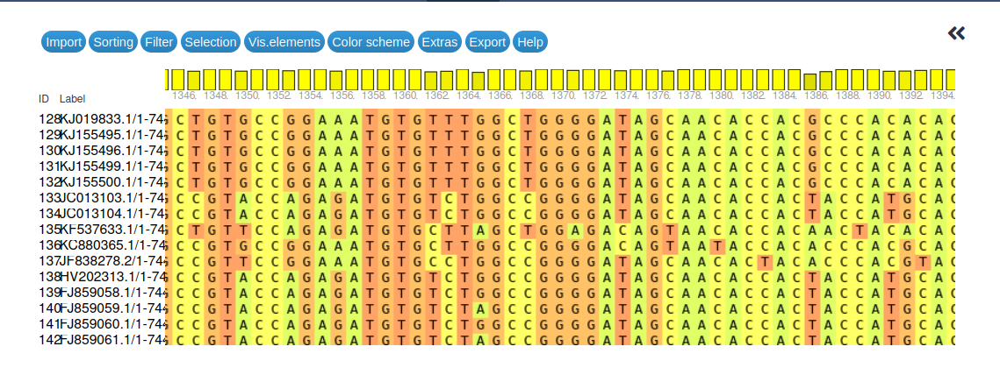

Modern molecular, DNA and RNA-based methods have seen ever increasing use, over the last decades, in the detection and analysis of viral pathogens. Most of these methods rely on PCR for amplification of viral DNA/RNA and are, thus, dependent on primers that recognize viral targets reliably and selectively. Designing such primers can be challenging if the diversity of viral genotypes that need to be recognized by the primers is high.

Quantitative real-time PCR (qPCR) is a very well established tool for detection of viral pathogens and for estimating viral load in samples. In its most widely used form in molecular diagnosis, qPCR requires two primers for amplification of a stretch of viral genetic material and an additional oligonucleotide probe that recognizes the amplified sequence and is itself used for fluorescence-based detection. Hence, in this case, three oligonucleotide sequences need to be designed that must recognize all viral genotypes of interest.

More recently, starting with the Zika virus epidemic from 2015 to 2016 and boosted by the 2020-2023 SARS-CoV-2 pandemic, tiled-amplicon sequencing has emerged as a powerful method for reconstructing full viral genomes directly from samples obtained from patients (). This method relies on multiplex PCRs to obtain amplification products (amplicons) that together cover (nearly) the complete genome of the viral pathogen. Overlap between amplicons (tiling) is required to achieve gap-free genome reconstruction and overlaping amplicons are generated in separate multiplex PCR reactions (pools) to avoid interaction of products during PCR. In this case each single amplicon is generated from two primers that, ideally, all need to be able to recognize all relevant viral genotypes and should, as far as possible not interact with other primers present in the same amplification pool. To illustrate the complexity involved, consider the example of SARS-CoV-2: [version 5.3.2](https://github.com/artic-network/primer-schemes/tree/master/nCoV-2019/V5.3.2) of the [ARTIC network](https://artic.network/)'s SARS-CoV-2 primer scheme defines 192 primers that generate 48 amplicons in each of two amplification pools and all these primers should bind efficiently to the genome sequences of all currently (first half of 2024) circulating omicron lineages (see the [v5.3.2 primer scheme announcement](https://community.artic.network/t/sars-cov-2-version-5-3-2-scheme-release/462) for the full details).

While SARS-CoV-2 is an extremely well-studied example, many other viral pathogens display a far greater sequence diversity than that of existing SARS-CoV-2 lineages making it even harder to come up with pan-specific primer sets for reliable amplification of arbitrary samples of unknown genotype. The three serotypes of poliovirus (PV-1, PV-2 and PV-3), for example, share only ~70% pairwise sequence identity with one another (compared to still ~ 99% for current SARS-CoV-2 lineages).

In this tutorial we investigate a robust bioinformatics approach that lets you design pan-specific PCR primers or entire primer schemes for viral pathogens with high sequence diversity. The design process starts from known genome sequences of viral isolates, which are supposed to represent the existing sequence diversity of the viral pathogen across its genotypes. From these sequences, we build a multiple sequence alignment, which then serves as input to the primer design tool **varVAMP**. This tool will try to identify possible primer sites that are conserved enough to work across genotypes while considering user-specified constraints like amplicon sizes for tiled-amplicon sequencing or desired qPCR probe characteristics.

> <agenda-title></agenda-title>
>
> In this tutorial, we will cover:
>
> 1. TOC
> {:toc}
>
{: .agenda}

# Data and Galaxy preparation

## Prepare a new Galaxy history
Any analysis should get its own Galaxy history. So let's start by creating a new one:

> <hands-on-title>Prepare the Galaxy history</hands-on-title>
>
> 1. Create a new history for this analysis
>
>    
>
> 2. Rename the history
>
>    
>
{: .hands_on}

## Get viral reference sequences

> <hands-on-title>Get the Polio 1 sequence alignment</hands-on-title>
>
>    1. Get the Polio 1 sequence alignment from
>
>       ```
>       https://raw.githubusercontent.com/jonas-fuchs/ViralPrimerSchemes/79db0cc128079d770f2282b68a6e28142fd77473/input_alignments/polio1.aln
>       ```
>       and upload it to your history via the link above and make sure the dataset format is set to `fasta`.
>
>       
>    2. Rename the dataset
>
>       
>
{: .hands_on}

## Transform aligned sequences into unaligned FASTA file format

For the primer design, we need a *Multiple sequence alignment*, which we can generate with **MAFFT**(). To effectively utilize MAFFT, it's crucial to provide an unaligned FASTA file as input. This raw format allows the program to flexibly align sequences based on their similarity and to adjust gaps and mismatches to optimize the alignment quality. Furthermore, the transformation of the aligned file to an unaligned file is a helpful exercise to deepen your knowledge about the variety and diversity of different tools existing on the Galaxy website.

> <hands-on-title>Degap the Polio1-genomes</hands-on-title>
>
>    1.  with the following parameter:
>       -  *"On query"*: `Polio 1 alignment` (Input Polio 1 dataset)
>       - *"Output sequence file format"*: `FASTA (m)`
>
>    2. Rename the dataset
>
>       
>
{: .hands_on}

# Designing a pan-specific primer/probe combination for qPCR

## Multiple alignment of reference sequences

First of all, we need to generate a *Multiple sequence alignment (MSA)* that we can use as input for varVAMP, the tool that designs the primers. Additionally the MSA provides knowledge about similarities and evolutionary relationships between the genome sequences. To generate an MSA, we align the previously unaligned genome datasets with **MAFFT**. MAFFT is a multiple sequence alignment program that enables the analysis of a file with several sequences with different alignment algorithms.

When multiple files are added, MAFFT will run for each of these, so it is necessary to have every sequence that you want to have aligned in one file. Therefore, there is a concatenate option in MAFFT implemented on Galaxy. For further information look in details below:

> <details-title> MAFFT - 2 Concatenate options </details-title>
>
>   Concatenating a FASTA file involves combining multiple FASTA-formatted sequences into a single file. This can be useful when you have sequences from different sources or experiments that you want to analyze together. MAFFT offers 2 different options:
>
> **Option 1:**
>
>   - Upload several FASTA files in different dataset upload sections and cross concatenate them according to the following rule, the first file from the first section is combined with the first file from the second section, etc. You can add as many dataset sections as you want.
>   - If you want to make multiple alignments of many files separately, upload them in the first dataset section and don't add a second dataset section.
>
> **Option 2:**
>
>   - Concatenate all FASTA files sequentially, regardless of whether they are in the same dataset section or in different sections. For example, if the first dataset section contains two files and the second section contains three files, the result will be a single output file with the sequences arranged in the order: 1, 2, 3, 4, 5.
>
{: .details}

> <details-title> MSA: Multiple sequence alignment with MAFFT - Methods </details-title>
>
>   MAFFT is a program that offers different methods to align sequences. These methods differ in terms of their speed and accuracy.
>
>   1. The progressive methods, including the default setting FFT-NS-2, can align high numbers of sequences in relatively short time. These methods are the fastest but also they have the lowest accuracy. Nevertheless, they serve as a good first approach.
>
>   2. Then there are iterative refinement methods, which use the WSP score to improve the accuracy of the multiple sequence alignment. These methods require more time than the progressive methods because they repeat the iterative refinement process until a maximum number of improvement cycles is reached or until there is no more relevant improvement according to the WSP score.
>
>   3. The last category includes iterative refinement methods, that use both the WSP and consistency scores. These methods provide the most accuracy but also take the most time. They are particularly useful if the sequences have low similarity.
>
>   For more information about the individual methods, visit the official [MAFFT-website](https://mafft.cbrc.jp/alignment/software/algorithms/algorithms.html).
>
{: .details}

> <hands-on-title>Generate multiple sequence alignment</hands-on-title>
>
> 1.  with the following parameters:
>    -  *"Sequences to align"*: `Polio 1 unaligned` (Input degapped Polio 1 dataset from history)
>    - *"Type of sequences"*: `auto-detect` or `Nucleic acids`
>    - *"MAFFT flavour"*: `FFT-NS-2 (fast, progressive method)`
>    - *"Output format"*: `FASTA`
>
>    > <comment-title> Different flavour, different time and accuracy </comment-title>
>    >
>    > The alignment will be quite fast with the FFT-NS-2 flavour. You can try it out with L-INS-i for example to observe the time and accuracy differences of the algorithms offered by MAFFT. It will take some time, so please don't wait for the result before continuing with the training. Once the alignment is complete, compare the first sequence file with the second to evaluate the differences between the alignment methods.
>    {: .comment}
>
> 2. Rename the dataset
>      
>    
>
{: .hands_on}

The aligned polio genome is ready for further use. Before we proceed with the primer design, let's take a closer look at our output. First, giving the output a proper name will help manage numerous data in the future. Secondly, it can be helpful to visualize the entire alignment or a specific region of interest. If you want to visualize the MSA, Galaxy offers an interactive build-in function, which we will explore in the next Hands-on box.

> <hands-on-title>Visualize the multiple sequence alignment</hands-on-title>
>
>    1. Click on the MAFFT output to expand this dataset
>    2. Click on  **Visualize**
>    3. Maximize the browser window (the visualization we are about to launch will not rescale properly if you do this later!)
>    4. Select **Multiple Sequence Alignment** as the visualization
>    5. Wait for the alignment to finish loading
>    6. You can now scroll through the alignment by dragging the scroll-bar, or move through it in windows by clicking next to it on the same line. You can also go to a specific position in the alignment directly via **Extras** -> **Jump to a column**.
>
>       You can manually check some regions of the alignment to see whether they fit the next figure.
>
{: .hands_on}



With this alignment, we prepared our input Poliovirus 1 genomes for varVAMP and are now ready to design our primers. However, before we get to the primer design section with varVAMP, we have a few simple questions for you.

> <question-title></question-title>
>
> 1. How many sequences were aligned and how long are they?
> 2. What kind of alignment method is recommended for our kind of data and why?
> 3. What does the height of the bars in the top row above the position of the bases indicate?
> 4. Are there differences in the results produced by the two MAFFT methods?
>
> > <solution-title></solution-title>
> >
> > 1. In total 241 sequences were aligned with up to 7498 bases.
> > 2. The speed-oriented methods, because there are too many sequences (>200) and it would take very long with other methods.
> > 3. The height of the bars indicates the sequence conservation at that site, with taller bars representing higher conservation.
> > 4. For our genome alignment, both MAFFT methods, FFT-NS-2 and L-INS-i, produce nearly identical results. The only difference is a slight shift at site 107. In this case, as with other highly conserved genome sequences, neither method is superior. However, FFT-NS-2 is significantly faster and fully sufficient.
> >
> {: .solution}
>
{: .question}

## One-step primer and probe design without consideration of off-target sites

Properly designed primers contribute to the specificity, efficiency, and accuracy of techniques like PCR and DNA sequencing, ultimately influencing the reliability and validity of biological research outcomes. *Variable VirusAMPlicons* (*varVAMP*) is a tool to design primers for highly diverse viruses. The input required is an alignment of your viral (full-genome) sequences.

> <details-title>varVAMP modes</details-title>
>
> For many virus genera, it is challenging to design pan-specific primers. varVAMP addresses this issue by introducing ambiguous characters into primers and minimizing mismatches at the 3' end. While the primers may not work for all sequences in your input alignment, they should recognize the vast majority.
>
>   varVAMP offers three different modes:
>
>   1. **SINGLE:** varVAMP searches for the best primers and reports non-overlapping amplicons suitable for PCR-based screening approaches.
>   2. **TILED:** Using a graph-based approach, varVAMP designs overlapping amplicons that tile the entire viral genome. These amplicons are ideal for Oxford Nanopore or Illumina-based full-genome sequencing.
>   3. **QPCR:** varVAMP searches for small amplicons with an optimized internal probe (TaqMan). It minimizes temperature differences between the primers and checks for secondary structures in the amplicons.
>
{: .details}

> <hands-on-title>Generate qPCR primer/probe set</hands-on-title>
>
> 1.  with the following parameters:
>    -  *"Multiple alignment of viral sequences"*: `Polio 1 MSA` (output of **MAFFT** )
>    - *"What kind of primers would you like to design? (varvamp mode)"*: `qPCR primers (qpcr)`
>        - *"How to set the main parameters, threshold for consensus nucleotides and max ambiguous nts per primer?"*: `Specify values for both`
>        - *"Threshold for consensus nucleotides"*: `0.93`
>        - *"Maximum number of ambiguous nucleotides per primer to be tolerated"*: `2`
>        - *"Maximum number of ambiguous nucleotides per qPCR probe to be tolerated"*: `1`
>
>       ><comment-title>Right time for a dataset collection</comment-title>
>       >
>       >In the next step, we will create a dataset collection to organize the numerous output data. This will help keep your history tidy and make it easier to distinguish between the results. Wait for the outputs of varVAMP to turn green before proceeding to the next step and creating the dataset collection.
>       {: .comment}
>
> 2. Creating a dataset collection 
>
>    
{: .hands_on}

Now we have our first varVAMP outputs and a better understanding of how the tool works. As you can see varVAMP offers a wide range of outputs. For example, it is possible to obtain the locations of the designed primers and amplicons in BED file format or as a graphical PDF. These outputs provide detailed information about the regions of interest and other potential primers. The varVAMP *"Analysis Log"* file contains information about the tool's settings and procedures and is always included with the outputs. Take some time to review the different types of outputs and get familiar with the results.

> <comment-title>Output control</comment-title>
>
> Check your output files by comparing them with the example files from the [varVAMP-qPCR-output GitHub page for Polio 1 virus](https://github.com/jonas-fuchs/ViralPrimerSchemes/tree/main/varvamp_qpcr/polio1). There you can check if you created the same primers. The primer locations can be found in the BED file "primers.bed". These primers were designed using version varVAMP:0.7.
{: .comment}

To check your results and assess your understanding of them, a few questions have been prepared for you:

> <question-title></question-title>
>
> 1. How long are the 3 different amplicons?
> 2. Why are there primers for 3 different amplicons and not just one?
> 3. Regarding the penalty score of the different amplicons, which one should be used for qPCR?
> 4. How is it possible to increase the reproducibility and decrease the computing time of further analysis of varVAMP?
>
> > <solution-title></solution-title>
> >
> > 1. The first amlicon has a length of 93 bases, the second 142 bases and the third is 77 bases long, as you can see in the file *"qPCR amplicon details"*.
> > 2. varVAMP shows all primer pairs that fulfill the specified conditions like threshold or amplicon length. In our case 3 primer pairs fulfill all conditions.
> > 3. The penalty score of the amplicons is a simple addition of the 3 penalty scores of the corresponding primers and the probe. For these applies the lower the value of the penalty score the better. Therefore regarding the penalty score the amplicon 0 starting at position 1743 has the lowest value with 6.7 and should be used. But it is also useful to have a closer look at the file *"primer details"* to compare the number of ambiguous nucleotides and the individual penalty scores especially for the probes.
> > 4. The solution lies in the per default contributed *"Analysis Log"* file. It contains the parameter configuration of your latest varVAMP run. If you save and use the values of the threshold and n_ambig for further runs, varVAMP will not start it's automatic calculation of these and thus results in lower computing time and higher reproducibility.
> {: .solution}
>
{: .question}

## Advanced approach considering off-target sites for the output
In our next step, imagine we have a sample taken from virus-infected human tissue. We want to ensure that we are not amplifing any related enterovirus genome sequences alongside our polio gene material during analysis. How can we specificlly design primers for our viral genome of interest?

With varVAMP, it is possible to use a BLAST database as an off-target reference. Using the tool *NCBI BLAST+ makeblastdb* (), we can create a BLAST database containing the whole genomes of other enteroviruses and use it as a reference. varVAMP compares the identified primers against this database, and each off-target hit is taken into account. To select the best-fitting primer scheme, varVAMP sorts the potential primers by their penalty scores and the presence of off-targets. Therefore varVAMP avoids designing primers that might target similar genome regions in other organisms. An application example could be the real-time detection of polio 1 viral genomes in a human sample for pandemic surveillance.

First of all, you need to upload the enterovirus genome data into Galaxy.

> <hands-on-title>Get the whole genome sequences of enterovirus</hands-on-title>
> 1. Get the genome sequence FASTA files from
>
>    ```
>    
>    ```
>    and upload it to Galaxy as a dataset of type `fasta`.
>
>    
>
> 2. Rename the dataset (optional)
>
>    
>
{: .hands_on}

Now that we have our data, we can begin creating an enterovirus genome database using *NCBI BLAST+ makeblastdb*. This will enable us to detect off-target hits with varVAMP in the next step.

> <hands-on-title>BLAST enterovirus genome database and primer design of Polio virus</hands-on-title>
>
> 1.  with the following parameters:
>    - *"Molecule type of input"*: `nucleotide`
>        -  **Select Input**
>            - *"Input is a"*: `Dataset in history`
>            - *"FASTA input"*: `Enterovirus genome sequences`
>    - *"Title for BLAST database"*: `Enterovirus genome db`
>
> 2. Rename the dataset
>      
>    
> 3.  with the following parameters:
>    -  *"Multiple alignment of viral sequences"*: `Polio 1 MSA`
>    - *"What kind of primers would you like to design? (varvamp mode)"*: `qPCR primers (qpcr)`
>        - *"How to set the main parameters, threshold for consensus nucleotides and max ambiguous nts per primer?"*: `Specify values for both`
>           - *"Threshold for consensus nucleotides"*: `0.93`
>        - *"Avoid amplicons with off-target primer products?"*: `Yes`
>           - *"BLAST database"*: the output of **NCBI BLAST+ makeblastdb** `Enterovirus genome db`
>
> 4. Creating a dataset collection
>
>    
{: .hands_on}

Having generated three possible primer schemes for qPCR using our current settings, how can we check whether these primers are appropriate and exclude potential off-targets?

You can have a look at the files *"qPCR amplicon details"* and *"Primer details"* to see the locations of the generated amplicons and whether they consider off-targets. Please review your output and compare it with the amplicons of the first varVAMP run.

Please try to answer the following questions.

> <question-title></question-title>
> 
> 1. Is there a difference between the primers designed whith consideration of off-target sites and those designed without it?
> 2. Does the output contain off-target amplicons?
> 3. Why didn't varVAMP design primers without off-target sites?
What does the difference mean?
> 4. What settings can be modified to generate more possible primers?
>
> > <solution-title></solution-title>
> >
> > 1. No, the primers generated without consideration of off-target sites are identical to those generated with consideration.
> > 2. Yes, all amplicons include off-targets.
> > 3. Before varVAMP can account for off-target sites, it must consider settings such as the threshold and the maximum number of ambiguous nucleotides. These settings resulted in only three amplicons, all of which contain off-targets.
> > 4. Our threshold for consensus sequences is set to 0.93, which is quite high. Lowering this threshold would generate more potential primer schemes. Alternatively, increasing the maximum number of ambiguous nucleotides is another option.
> {: .solution}
>
{: .question}

Now let's try using a lower threshold to generate a primer scheme that is not classified as an off-target amplicon through the BLAST database. Lowering the threshold will reduce specificity, but values above 0.7 are generally acceptable, depending on the specific use case. Since the default value is 0.8, let's proceed with this setting.

> <hands-on-title>Primer design of Polio 1 virus with BLAST db and lower threshold</hands-on-title>
>
> 1.  with the following parameters:
>    -  *"Multiple alignment of viral sequences"*: `Polio 1 MSA`
>    - *"What kind of primers would you like to design? (varvamp mode)"*: `qPCR primers (qpcr)`
>        - *"How to set the main parameters, threshold for consensus nucleotides and max ambiguous nts per primer?"*: `Specify values for both`
>           - *"Threshold for consensus nucleotides"*: `0.8`
>        - *"Avoid amplicons with off-target primer products?"*: `Yes`
>           - *"BLAST database"*: the output of **NCBI BLAST+ makeblastdb** `Enterovirus genome db`
>
>       > <comment-title>Threshold control</comment-title>
>       >
>       >You can try using the estimation for values like the threshold in varVAMP. On Galaxy, for the question *"How to set the main parameters, threshold for consensus nucleotides and max ambiguous nts per primer?"* select the option `Specify max ambiguous nts, estimate suitable threshold`. The tool will then automatically select a value, which you can find in the *"Analysis Log"* file after running the tool.
>       {: .comment}
>
> 2. Creating a dataset collection
>
>    
{: .hands_on}

The newly designed primer schemes can be checked again with the files *"qPCR amplicon details"* and *"Primer details"*. We have prepared some questions for you to assess your understanding:

> <question-title></question-title>
> 
> 1. What is the difference with a lower threshold? Did you get a primer scheme that excludes off-targets?
> 2. Why doesn't the amplicon collection include the amplicons that we generated with the higher threshold?
> 3. Consider other use cases for avoiding off-targets using a BLAST database.
> 4. Do you get the same primers if you allow varVAMP to estimate the threshold?
>
> > <solution-title></solution-title>
> > 1. With the lower threshold, we generated more potential primer schemes, including four that do not contain off-targets.
> > 2. The lower threshold leads to more potential amplicons that can achieve better scores than those with a higher threshold. Therefore the primers generated with the higher threshold are not considered in the varVAMP run with the lower threshold because all of them contain off-targets and have higher scores.
> > 3. For example, you can prepare primers to amplify specific viral genome sequences from samples of various origins, such as wastewater or animal blood, enabling real-time surveillance through fluorescence-based detection.
> > 4. No, because varVAMP estimates the optimal threshold to be 0.92 and we used different thresholds. As a result, 5 primer schemes have now been generated, one of which considers off-targets.
> {: .solution}
>
{: .question}

# Designing a complete pan-specific primer scheme for tiled-amplicon sequencing

To explore additional options, we will now design primers for another use case using the TILED flavour. This flavour is designed to cover the entire genome of our input data. Therefore, the resulting primers are suitable for Oxford Nanopore or Illumina-based full-genome sequencing. 

However, for many genomes, existing primer schemes are already available on GitHub, so you don't have to generate them by yourself. For example, you can explore various schemes from [quick-lab](https://github.com/quick-lab/primerschemes/tree/main/primerschemes), [pha4ge](https://github.com/pha4ge/primer-schemes/tree/main/schemes), and [ARTIC-network](https://github.com/artic-network/primer-schemes).

To focus on designing the primer scheme, we will skip the multiple sequence alignment step this time and begin with the pre-aligned Polio 1-3 sequences available as part of the [ViralPrimerScheme](https://github.com/jonas-fuchs/ViralPrimerSchemes) repository.

> <hands-on-title>Get Polio 1-3 sequence alignment</hands-on-title>
>
>    1. Get the Polio 1-3 sequence alignment from
>
>       ```
>       https://raw.githubusercontent.com/jonas-fuchs/ViralPrimerSchemes/9b54b17246abdff1b39c6cdd362fff67eb2945c3/input_alignments/polio1-3.aln
>       ```
>       and upload it to your history via the link above and make sure the dataset format is set to `fasta`.
>
>       
>    2. Rename the dataset
>
>       
>
{: .hands_on}

In this varVAMP run, we will use the TILED flavour. Similar to the qPCR primer design, you can determine the number of ambiguous nucleotides and set a threshold for consensus nucleotides. However, this time we will only specify the maximum number of ambiguous nucleotides and allow the threshold to be automatically estimated.

> <hands-on-title>Primer design with the TILED-flavour for whole genome amplification</hands-on-title>
>
> 1.  with the following parameters:
>    -  *"Multiple alignment of viral sequences"*: the `Polio 1-3 alignment` just uploaded
>    - *"What kind of primers would you like to design? (varvamp mode)"*: `Tiled primer scheme for whole-genome sequencing (tiled)`
>        - *"How to set the main parameters, threshold for consensus nucleotides and max ambiguous nts per primer?"*: `Specify max ambiguous nts, estimate suitable threshold`
>        - *"Maximum number of ambiguous nucleotides per primer to be tolerated (default: 2)"*: `2`
>
> 2. Creating a dataset collection
>
>    
>
>       > <comment-title>Dataset collection</comment-title>
>       >
>       >If you create a dataset collection at this point, you cannot include the "per-pool primer sequences", as this is already a dataset collection containing two files with the primer sequences for each pool.
>       {: .comment}
{: .hands_on}

Now you have successfully created primers for further amplification of your viral sequences.


Once again, we have prepared some questions for you to verify your results and deepen your understanding of the output:

> <question-title></question-title>
>
> 1. How many primers are used to cover the whole Polio genome?
> 2. What is encoded in the column named "score" in the file *"Amplicon locations"*.
> 3. How long are the amplicons for the tiled primer scheme and for qPCR and why do they differ in size?
> 4. What's the difference of the functionality of the 2 modi qPCR and TILED?
> 5. If you want to have a more accurate product, which options do you have to manipulate?
>
> > <solution-title></solution-title>
> >
> > 1. varVAMP creates 12 primers to amplify the whole Polio genome, if you use varVAMP version 1.2.1.
> > 2. The score indicates wheather the primer pair for this amplicon belongs to pool 1 or 2.
> > 3. For the tiled primer scheme, the amplicons are approximately 1400 bases long, while for qPCR, they are around 100 bases. The difference in length exists because the goal of the tiled primer scheme is to cover the entire genome without using too many primers that might interact. In contrast, qPCR focuses on detecting the presence of matching DNA in a sample. Therefore, the amplicons are kept shorter to speed up the amplification process.
> > 4. The qPCR mode generates small amplicons with an optimized internal probe, while the TILED mode produces overlapping amplicons designed for Oxford Nanopore or Whole Genome Sequencing.
> > 5. You can increase the length of the amplicons, the minimum required overlap and the threshold or reduce the maximum number of ambiguous nucleotides per primer.
> >
> {: .solution}
>
{: .question}

# Conclusion

Creating primers for further gene analysis is essential. varVAMP delivers a possibility to design highly divers and personally specified primers and even the option to eliminate off-targets thanks to a BLAST database. In combination with MAFFT, a strongly adjustable multiple alignment tool, it is possible to search for similar genome sequences in a sample batch and if they have viral origin, be able to do preparatory work for the amplification technique of interest. This Galaxy workflow is therefore extremely useful for applications such as the identification of related virus genomes.
