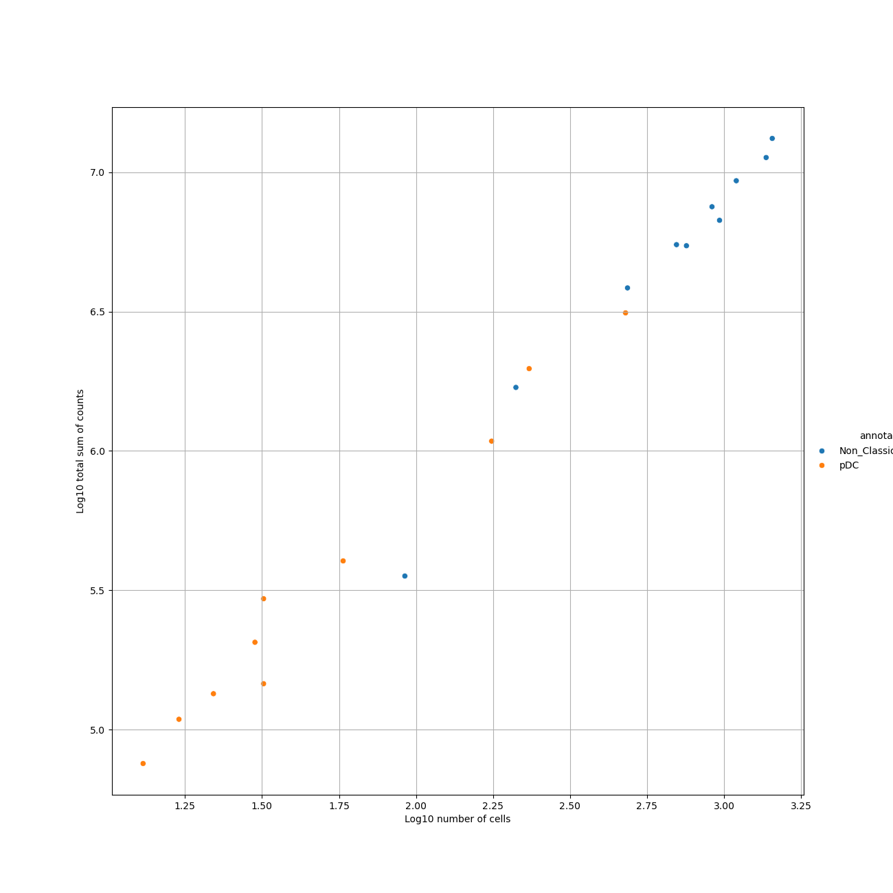
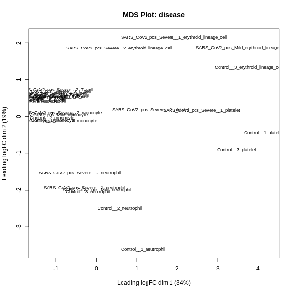
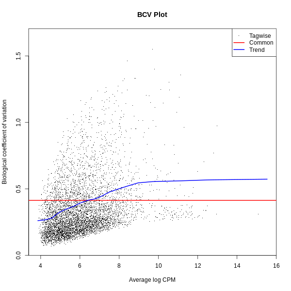
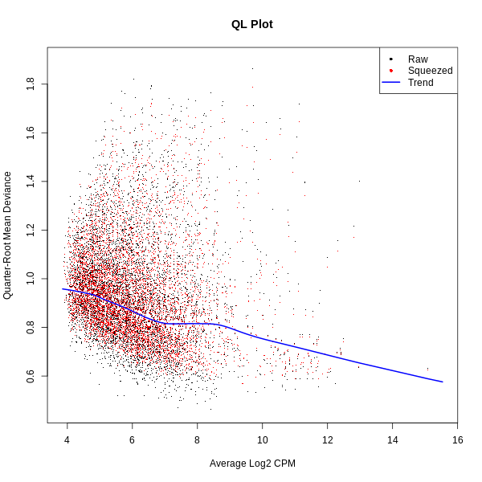
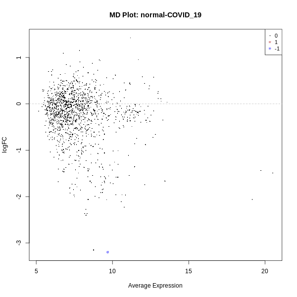
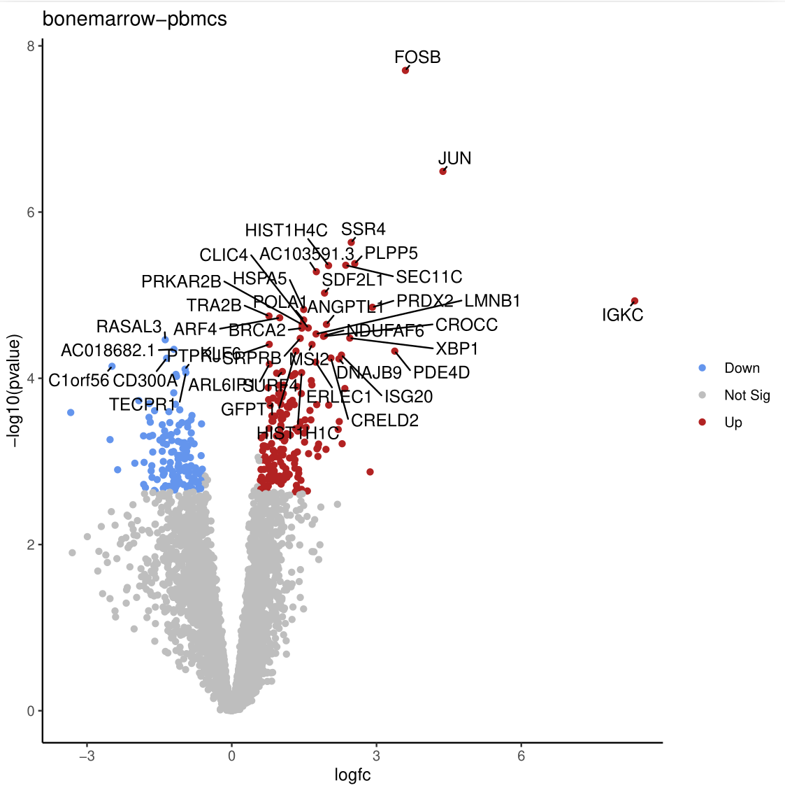

Pseudobulk analysis is a powerful technique that bridges the gap between single-cell and bulk RNA-seq data. It involves aggregating gene expression data from groups of cells within the same biological replicate, such as a mouse or patient, typically based on clustering or cell type annotations ().

A key advantage of this approach in differential expression analysis is that it avoids treating individual cells as independent samples, which can underestimate variance and lead to inflated significance or overly optimistic p-values (). This occurs because cells from the same biological replicate are inherently more similar to each other than cells from different samples. By grouping data into pseudobulk samples, the analysis aligns with the experimental design, as in bulk RNA-seq, leading to more reliable and robust statistical results ().

Beyond enhancing statistical validity, pseudobulk analysis enables the identification of cell-type-specific gene expression and functional changes across biological conditions. It balances the detailed resolution of single-cell data with the statistical power of bulk RNA-seq, providing insights into the functional transcriptomic landscape relevant to biological questions. Overall, for differential expression analysis in multi-sample single-cell experiments, pseudobulk approaches demonstrate superior performance compared to single-cell-specific DE methods (). 

In this tutorial, we will guide you through a pseudobulk analysis workflow using the **Decoupler** and **edgeR** tools available in Galaxy () (). These tools facilitate functional and differential expression analysis, and their output can be integrated with other Galaxy tools to visualize results, such as creating Volcano Plots, which we will also cover in this tutorial.

> <agenda-title>Pseudobulk Analysis Pipeline Agenda</agenda-title>
>
> 1. Introduction to Pseudobulk Analysis and Data Preprocessing
>    - Overview of pseudobulk analysis
>    - Preparing single-cell data for pseudobulk analysis
>    - Aggregating data into pseudobulk samples
>    - Inspecting Decoupler outputs
>
> 2. Differential Expression Analysis with edgeR
>    - Preparing input files for edgeR
>    - Performing differential expression analysis
>    - Understanding and interpreting the results
>
> 3. Visualization and Reporting
>    - Generating volcano plots for differentially expressed genes
>    - Summarizing and presenting functional analysis results
>      
> 4. Subsetting Samples from the Original AnnData Object
>    - Extracting AnnData Object with observations of interest 
>      
> 5. Key Takeaways and Recommendations
>    - Reviewing the pseudobulk analysis pipeline
>    - Suggestions for additional analyses and further exploration
>
{: .agenda}


# Let's Get the Data!

## Overview of the Data

Our data was extracted from the publication titled _"Elevated Calprotectin and Abnormal Myeloid Cell Subsets Discriminate Severe from Mild COVID-19"_ (). This dataset was chosen because it was utilized by the developers of the `decoupler` tool for pseudobulk aggregate analysis ().

Pseudobulk analysis is an advanced method in single-cell data analysis. For this tutorial, we assume familiarity with common single-cell data formats, such as AnnData or Seurat objects, and experience analysing single-cell data, including clustering and annotating cell types.

If you're new to these concepts, we recommend exploring our other tutorials before performing pseudobulk analysis:
- [Clustering 3K PBMCs with Scanpy](): Learn how to cluster and annotate cells in Galaxy using our single-cell tools.
- [Combining single cell datasets after pre-processing](): Understand how to combine multiple datasets into one AnnData object and add metadata from single-cell experiments.

The data object, which you will import from Zenodo into Galaxy via the provided link, has been preprocessed, analysed, and annotated. It includes the following key observations:
- **cell_type**: The type of cell identified.
- **disease**: Indicates whether the sample is a control or corresponds to a COVID-19 condition.
- **individual**: The individual donor or sample identifier.
- **sex**: The sex of the individual.

## Data Upload

> <hands-on-title> Data Upload </hands-on-title>
>
> 1. Create a new history for this tutorial and name it "Pseudobulk DE Analysis with edgeR"
> 2. Import the AnnData file from [Zenodo]({{page.zenodo_link}}):
>
>    ```
>    https://zenodo.org/records/13929549/files/Source_AnnData_file.h5ad
>    ```
>
>    
>
>    
>
> 3. Rename the dataset: "**AnnData for Pseudobulk**."
> 4. Ensure that the datatype is correct. It should be an AnnData object (`h5ad`).
>
>    
>
{: .hands_on}


# Generation of the Pseudobulk Count Matrix with Decoupler

In this step, our goal is to perform a "bioinformatic cell sorting" based on the annotated clusters of the single-cell data.

To start a pseudobulk analysis, ensure that the AnnData object you will use contains all the necessary metadata for ***"pseudobulking"***. For example, key annotations, such as cell type, condition, disease, and batch, should be present. Most importantly, the AnnData object has to include a layer with the raw counts of gene expression.

Raw counts are crucial for generating accurate pseudobulk aggregates. Since single-cell data is typically normalized after annotation, it’s important to preserve the raw counts in the AnnData object before normalization steps if you would like to perform a pseudobulk analysis later on. These raw counts are directly used by tools like **Decoupler** to generate the pseudobulk count matrix. Note that normalized count matrices should not be used with Decoupler, even if the tool appears to process them successfully.

> <tip-title> Missing Raw Counts? </tip-title>
>
> If your AnnData object lacks raw counts, you can use the **[AnnData Operations](https://toolshed.g2.bx.psu.edu/repos/ebi-gxa/anndata_ops/anndata_ops/1.9.3+galaxy0)** tool on the **[Single Cell Galaxy instance](https://singlecell.usegalaxy.eu)**. This tool allows you to copy the `.X` matrix into a new layer that you may assign a new label, for e.g., `counts` or `raw_counts`, making it available as a parameter for Decoupler.
>
> Importantly, ensure that the copying of this matrix as a raw counts layer is done carefully and correctly. To verify that your AnnData object contains the necessary raw counts layer, you can use the **[Inspect AnnData Object](https://toolshed.g2.bx.psu.edu/repos/iuc/anndata_inspect/anndata_inspect/0.10.9+galaxy0)** tool. This tool helps confirm the presence of raw counts and other essential metadata in your AnnData object before proceeding with pseudobulk analysis.
>
{: .tip}

> <hands-on-title> Decoupler Pseudobulk </hands-on-title>
>
> 1.  tool with the following parameters:
>     -  **Input AnnData file**: `AnnData for Pseudobulk` (Input dataset obtained > from Zenodo)
>     - **Produce a list of genes to filter out per contrast?**: `No`
>     - **Obs Fields to Merge**: *(Leave empty if not applicable)*
>     - **Groupby column**: `cell_type` (Column containing cell type annotations)
>     - **Sample Key column**: `individual` (Column containing individual sample identifiers)
>     - **Layer**: `counts` (Layer containing raw gene expression counts)
>     - **Factor Fields**: `disease` (Column in `adata.obs` specifying experimental factors. For edgeR, the first field should be the main contrast field, followed by  covariates.)
>     - **Use Raw**: `No`
>     - **Produce AnnData with Pseudo-bulk**: *(Optional, if yes, it will generate an h5ad output file with pseudobulks)*
>     - **Minimum Cells**: `10`
>     - **Produce plots**: `Yes`
>     - **Minimum Counts**: `10`
>     - **Minimum Total Counts**: `1000`
>     - **Minimum Counts Per Gene Per Contrast Field**: `20` (Genes with fewer counts in specific contrasts are flagged in a separate file but not excluded from the results.)
>     - **Enable Filtering by Expression**: `Yes`
>     - **Plot Samples Figsize**: `13 13`
>     - **Plot Filtering Figsize**: `13 13`
>
>    > <comment-title> Performing DEG within Clusters </comment-title>
>    >
>    > **Important!** The count matrix retrieved from this tool includes all of our samples `individual` aggregated by `cell_type`, which can be identified by the column headers. If you want to perform comparisons of conditions within clusters of each individual cell type, you will need to subset the relevant columns of the matrix and use them as your new count matrix. We will demonstrate this in the last section of this tutorial with detailed hands-on steps.
>    {: .comment}
>
{: .hands_on}

> <question-title> What are the outputs of the Decoupler tool? </question-title>
>
> 1. How many outputs does the Decoupler tool generate?
> 2. What do the outputs represent? What is the interpretation of the plots?
> 3. Which output(s) will we use in edgeR for differential expression analysis?
>
{: .question}

> <solution-title>Solutions</solution-title>
>
> 1. The Decoupler tool generates multiple outputs, including:
>    - **Pseudobulk Count Matrix** (tabular file)
>    - **Samples Metadata (Factor file)** (tabular file)
>    - **Genes Metadata** (tabular file)
>    - **Pseudobulk Plot** (PNG format)
>    - **Filter by Expression Plot** (PNG format)
>    - **Genes to Ignore by Contrast Field** (tabular file)
>    - **Pseudobulk AnnData file** (If chosen, h5ad file) 
>
> 2. The output files contain the following:
>    - **Pseudobulk Count Matrix:** Contains the raw count aggregates for each pseudobulk sample. 
>    - **Samples Metadata (Factor File):** Provides metadata annotated for each sample, including factors or annotations added to the AnnData object.
>    - **Genes Metadata:** Includes gene-related information such as gene symbols, Ensembl IDs, dispersion values, etc.
>    - **Genes to Ignore:** Lists of genes to could be excluded or should be carefully considered for specific contrasts. This file contains a contrast field and the corresponding genes written as gene symbols.
>    - **Pseudobulk Plot:** A visual representation of the pseudobulk data.
>    
>    - **Filter by Expression Plot:** Illustrates the expression filtering applied to the data.
>    
>      **Pseudobulk AnnData file:**: An AnnData file that contains the aggregated pseudobulks.  
>
> 3. The **pseudobulk count matrix** is the primary input required for analysis using **edgeR**, a tool designed for differential expression analysis. The **Samples Metadata** is another file that will serve as an input for the edgeR tool. 
>
{: .solution}


## Sanitation Steps - Part 1

The next steps will help you refine your data for easier handling. We will use standard galaxy tools, like: [Replace Text](https://toolshed.g2.bx.psu.edu/repos/bgruening/text_processing/tp_replace_in_line/9.3+galaxy1), [Remove columns](https://toolshed.g2.bx.psu.edu/repos/iuc/column_remove_by_header/column_remove_by_header/1.0) and [Text reformatting](https://toolshed.g2.bx.psu.edu/repos/bgruening/text_processing/tp_awk_tool/9.3+galaxy1). 

> <hands-on-title> Replace Text: Count Matrix</hands-on-title>
>
> 1.  with the following parameters:
>    -  *"File to process"*: `count_matrix` (output of **Decoupler pseudo-bulk** )
>    - In *"Replacement"*:
>        -  *"Insert Replacement"*
>            - *"Find pattern"*: `[ --+*^]+`
>            - *"Replace with:"*: `_`
>
{: .hands_on}


> <hands-on-title> Replace Text: Sample Metadata</hands-on-title>
>
> 1.  with the following parameters:
>    -  *"File to process"*: `samples_metadata` (output of **Decoupler pseudo-bulk** )
>    - In *"Replacement"*:
>        -  *"Insert Replacement"*
>            - *"Find pattern"*: `[ --+*^]+`
>            - *"Replace with:"*: `_`
>
{: .hands_on}

> <hands-on-title> Remove Columns: Gene Metadata </hands-on-title>
>
> 1.  with the following parameters:
>    -  *"Tabular file"*: `genes_metadata` (output of **Decoupler pseudo-bulk** )
>    - In *"Select Columns"*:
>        -  *"Insert Select Columns"*
>            - *"Header name"*: `start`
>        -  *"Insert Select Columns"*
>            - *"Header name"*: `end`
>        -  *"Insert Select Columns"*
>            - *"Header name"*: `width`
>
{: .hands_on}

> <hands-on-title> Replace Text: Creating Factor File </hands-on-title>
>
> 1.  with the following parameters:
>    -  *"File to process"*: `outfile` (output of **Replace Text: Sample Metadata Step** )
>    - In *"Replacement"*:
>        -  *"Insert Replacement"*
>            - *"in column"*: `c2`
>            - *"Find pattern"*: `^([0-9])(.+)`
>            - *"Replace with"*: `GG_\\1\\2`
>
{: .hands_on}

## Generating the Contrast File 

This file will be used as the contrast input file in the edgeR tool. 

> <hands-on-title> Creating a Contrast File for edgeR </hands-on-title>
>
> 1.  with the following parameters:
>    -  *"File to process"*: `outfile` (output generated from the **Replace Text**  step).
>    - *"AWK Program"*:
>      ```awk
>      BEGIN { print header } 
>      NR > 1 { if (!seen[$2]++) words[++count]=$2 } 
>      END { for (i=1; i<=count; i++) 
>               for (j=i+1; j<=count; j++) 
>                  print words[i]-words[j] }
>      ```
> 
>    > <comment-title> Explanation of the AWK Program </comment-title>
>    >
>    > This AWK script performs the following:
>    > - Initializes the `header` variable for the output file.
>    > - Processes the input file (`NR > 1` skips the header line).
>    > - Tracks unique elements in column 2 (`seen[$2]++`) to avoid duplicates.
>    > - Creates pairs of unique elements and calculates their difference, outputting the contrast for downstream edgeR analysis.
>    {: .comment}
>
{: .hands_on}

> <question-title> Understanding the Contrast File </question-title>
>
> 1. How does your contrast file look, and what contrast is generated by the tool?
>
> <solution-title> Explanation of the Contrast File </solution-title>
> 
> 1. The contrast file is a simple tab-delimited text file. It contains:
>    - A **header** in the first row that labels the column.
>    - The contrast, such as `normal-COVID_19`, written in the second row.
>
> When working with your own data, the contrast file will look different, as it will reflect the specific contrasts in your dataset but the **header** should be the same
> >
> {: .solution}
>
{: .question}


# Differential Expression Analysis (DE) with edgeR

The tool **edgeR** is commonly used for differential expression (DE) analysis of pseudobulk aggregates in single-cell RNA-seq studies (). It calculates gene dispersions based on the total counts for each gene and adjusts these estimates using an approach called empirical Bayes. This method improves reliability by pooling information across all genes in the dataset to stabilize dispersion estimates, particularly for genes with low counts or limited data. By "borrowing strength" from the behavior of other genes, empirical Bayes reduces the risk of overestimating or underestimating variability, ensuring more robust and accurate results (). Differential expression is then evaluated using an exact test for the negative binomial distribution, which is similar to Fisher’s exact test but modified to handle the variability typically seen in RNA-seq data (). 

In addition to exact tests, edgeR employs generalized linear models (GLMs), which allow for the analysis of more complex experimental designs. GLMs model gene counts as a function of experimental conditions (e.g., treatment groups or time points) and estimate how these conditions influence gene expression. Likelihood-based methods, such as quasi-likelihood (QL) approaches, are central to this framework. Standard likelihood methods evaluate the fit of the model to the data, while quasi-likelihood methods add an extra layer by explicitly accounting for biological and technical variability, improving the reliability of DE results. These models allow edgeR to identify subtle expression differences while controlling for overdispersion in the data ().

Several plots can be generated to assist in understanding the data and the results of the analysis, including MDS, BCV, QL, and MD plots. These visualizations provide insights into sample relationships, variability, and differential expression, and will be explained further in the tutorial. With these concepts in mind, let's now perform our DE analysis using our edgeR tool in Galaxy!

> <hands-on-title> Run a DGE Analysis with edgeR </hands-on-title>
>
> 1.  with the following parameters:
>    - *"Count Files or Matrix?"*: `Single Count Matrix`
>        -  *"Count Matrix"*: `outfile` (output of **Replace Text: Count Matrix** )
>        - *"Input factor information from file?"*: `Yes`
>            -  *"Factor File"*: `outfile` (output of **Replace Text: Creating Factor File** )
>    - *"Use Gene Annotations?"*: `Yes`
>        -  *"Gene Annotations"*: `output_tabular` (output of **Remove Columns: Gene Metadata** )
>    - *"Formula for linear model"*: `~ 0 + factor_A` or `~ 0 + factor_A + factor_B:factor_C`  
>        *(Customize this formula based on your data's contrast names and factor file. Ensure the formula matches EdgeR's syntax and uses only elements from the factor file.)*
>    - *"Input contrasts manually or through a file?"*: `file`
>        -  *"Contrasts File"*: `outfile` (output of **Text Reformatting: Creating a Contrast File for edgeR** )
>    - In *"Filter Low Counts"*:
>        - *"Filter lowly expressed genes?"*: `No`
>
>    > <comment-title> edgeR Tool Overview </comment-title>
>    >
>    > Use this tool to perform DGE analysis using edgeR. It is highly customizable, allowing you to input your count matrix, factor information, and gene annotations prepared during earlier steps. The contrast file should be generated from the previous step, **Text Reformatting: Creating a Contrast File for edgeR**. The model formula should be defined based on your dataset and must include factors that were already specified in the contrast file.
>    {: .comment}
>
{: .hands_on}


> <question-title>Understanding edgeR Outputs</question-title>
>
> 1. What are the output(s) of the edgeR tool?  
> 2. How can we interpret our output result file?  
>
> <solution-title>edgeR Outputs and Interpretation</solution-title>
>
> 1. **Output files**:
>    - **edgeR Tables**: This file includes columns with information such as:
>    - **Gene Symbol**: The identifier for each gene.
>    - **Log Fold Change (logFC)**: Represents the direction and magnitude of differential expression. Positive values indicate upregulation, and negative values indicate downregulation.
>    - **Raw p-value (PValue)**: The unadjusted statistical significance value for each gene, indicating the likelihood of observing the result under the null hypothesis.
>    - **False Discovery Rate (FDR)**: The adjusted p-value using the Benjamini-Hochberg correction method to account for multiple testing and control the expected proportion of false positives.
>    - **(Optional)**: If additional outputs, such as "normalized counts," are selected in the edgeR tool, the table will also include these counts.
>    - **edgeR Report**: This is an HTML file containing various visualizations and summaries of the analysis, such as:
>    - **MDS Plot (Multidimensional Scaling)**: Visualizes the relationships between samples based on gene expression profiles.
>    - **BCV Plot (Biological Coefficient of Variation)**: Displays the estimated dispersion for each gene.
>    - **QL Plot (Quasi-Likelihood)**: Shows the quasi-likelihood dispersions for the dataset.
>    - **MD Plot (Mean-Difference Plot)**: Compares the mean expression of genes versus their log fold change.
> 
> 2. **Interpreting the Results**:
>    - The table contains the results of the differential expression analysis.  
>    - The **first column** typically lists the gene symbols from the dataset.  
>    - The **logFC** indicates the direction and magnitude of differential expression:
>    - **Upregulated genes**: Genes with higher expression in the first group of the contrast (e.g., 'normal' group in a "normal-COVID_19" contrast).
>    - **Downregulated genes**: Genes with lower expression in the first group of the contrast (e.g., 'normal' group in a "normal-COVID_19" contrast).
>    - The **raw p-value** represents the statistical significance of the result for each gene before adjustment for multiple comparisons. Lower values indicate stronger evidence against the null hypothesis.  
>    - The **FDR** is the adjusted p-value, calculated using the Benjamini-Hochberg method, which helps control for false positives when testing many genes. Genes with an FDR below a threshold (e.g., 0.05) are considered statistically significant.
> 
> **Plot Interpretations**:
>   - **MDS Plot**: Displays relationships between samples based on gene expression profiles. Samples that cluster closely are more similar in their expression. Use this to identify whether samples separate by biological condition or to detect potential batch effects.  
>   - **BCV Plot**: Shows the dispersion for each gene, with higher values indicating greater variability. This is useful for assessing how variability is modeled in the dataset. 
>   - **QL Plot**: Highlights the quasi-likelihood dispersions, which represent variability modeled during statistical testing. Proper dispersion modeling ensures robust differential expression analysis. 
>   - **MD Plot**: Visualizes the mean expression levels against log fold change for each gene. Genes far from the center indicate stronger differential expression, with points above or below the horizontal line showing upregulated or downregulated genes, respectively.  
> 
> {: .solution}
>
{: .question}

## Sanitation Steps - Part 2

After performing the differential expression analysis with edgeR, we will clean the data to prepare it for visualization. This involves extracting collection elements, removing unnecessary columns, standardizing text, and splitting the file if needed. We will use the , , , , and 

**Extract element identifiers** will allow us to processes the **edgeR** output, which is a collection of datasets, to extract individual elements (like the first table from our collection) for further analysis. 

> <hands-on-title> Task Description </hands-on-title>
>
> 1. Use the  tool with the following parameters:
>    -  *"Dataset collection"*: `outTables` (output from the **edgeR** tool )
>
{: .hands_on}

**Remove columns** to filter out unnecessary columns from the **edgeR** output and retain only the essential ones for analysis: Gene ID (`id`), Log Fold Change (`logFC`), P-value (`PValue`), and False Discovery Rate (`FDR`).

> <hands-on-title> Remove Unnecessary Columns </hands-on-title>
>
> 1. Use the  tool with the following parameters:
>    -  *"Tabular file"*: `outTables` (output of **edgeR** )
>    - In *"Select Columns"*:
>        -  *"Insert Select Columns"*
>            - *"Header name"*: `{'id': 7, 'output_name': 'output'}`
>        -  *"Insert Select Columns"*
>            - *"Header name"*: `logFC`
>        -  *"Insert Select Columns"*
>            - *"Header name"*: `PValue`
>        -  *"Insert Select Columns"*
>            - *"Header name"*: `FDR`
>    - *"Keep named columns"*: `Yes`
>   
{: .hands_on}

**Replace text** to standardize and clean column headers or dataset identifiers by replacing unnecessary prefixes (e.g., `edgeR_`) with nothing.

> <hands-on-title> Replace Text </hands-on-title>
>
> 1. Use the  tool with the following parameters:
>    -  *"File to process"*: `output` (output of **Extract Element Identifiers** )
>    - In *"Replacement"*:
>        -  *"Insert Replacement"*
>            - *"Find pattern"*: `edgeR_`
>
{: .hands_on}

**Split file,** if the dataset is too large to process in one go, split it into smaller chunks.

> <hands-on-title> Split File </hands-on-title>
>
> 1. Use the  tool with the following parameters:
>    - *"Select the file type to split"*: `Text files`
>        -  *"Text file to split"*: `outfile` (output of **Replace Text** )
>        - *"Specify number of output files or number of records per file?"*: `Number of records per file ('chunk mode')`
>        - *"Method to allocate records to new files"*: `Maintain record order`
>
{: .hands_on}

**Parse parameter value** to extract specific parameter values (e.g., dataset names) from the split files for further dynamic inputs in downstream analysis.

> <hands-on-title> Parse Parameter Value </hands-on-title>
>
> 1. Use the  tool with the following parameters:
>    -  *"Input file containing parameter to parse out of"*: `list_output_txt` (output of **Split File** )
>
{: .hands_on}

# Volcano Plot

In this step, we will use the sanitized output from the previous steps to generate a Volcano Plot, which visualizes the relationship between statistical significance (P-value) and fold change (LogFC) for differentially expressed genes (DEGs). The input file for the Volcano Plot must include four essential columns: _FDR (adjusted P-value), P-value (raw), Log Fold Change, and Gene Symbols (Labels)._ As long as these columns are present, the Volcano Plot can be generated successfully.

> <hands-on-title> Create a Volcano Plot of the DEG </hands-on-title>
>
> 1. Use the  tool with the following parameters:
>    -  *"Specify an input file"*: `output_tabular` (output from **Remove Columns** )
>    - *"File has header?"*: `Yes`
>    - *"FDR (adjusted P value) column number"*: `c4`
>    - *"P value (raw) column number"*: `c3`
>    - *"Log Fold Change column number"*: `c2`
>    - *"Labels column number"*: `c1`
>    - *"LogFC threshold to colour"*: `0.58`
>    - *"Points to label"*: `Significant`
>        - *"Only label top most significant"*: `40`
>    - In *"Plot Options"*:
>        - *"Plot title"*: `Differential Expression Volcano Plot`
>
>    > <tip-title> What does the Volcano Plot show? </tip-title>
>    >
>    > The Volcano Plot highlights genes with statistical significance (low P-values) and large fold changes. Genes meeting the significance thresholds are typically colored and labeled for easier identification. 
>    {: .tip}
>
{: .hands_on}

## What are the results of the Volcano Plot?

Let's take a moment to interpret the Volcano Plot:

- Which genes are most significant?
- How does the fold change correlate with the P-values?
- Are there any unexpected patterns?

> <question-title> Reflect on the Volcano Plot </question-title>
>
> 1. What is the significance of genes located at the extremes of the plot (e.g., high LogFC and low P-value)? 
> 2. How many genes meet the significance threshold in this analysis?
>
> > <solution-title> Solution </solution-title>
> >
> > 1. Genes at the extremes of the Volcano plot are highly significant and exhibit strong differential expression. Consider exploring the biological significance of these genes to gain deeper insights into their roles.
> > 2. In our current analysis, we identified only one downregulated gene, MTND1P23, with a logFC of -3.1956, in normal conditions compared to COVID-19 patients.
> >
> {: .solution}
>
{: .question}

# Subsetting Samples from the Original AnnData Object

In our previous analysis, we found that only one gene, **MTND1P23**, was identified as downregulated in our contrast. This result was obtained by "bulking" **all** cell types from our dataset and performing a differential expression analysis comparing normal vs. COVID-19 samples.

Now, what if we refine our approach? For instance, instead of analysing all cell types together, what happens if we focus on a specific cluster, such as **T cells**, and perform the same comparison: normal vs. COVID-19? Would the results remain the same, or would this approach reveal additional insights?

## Extracting observations of interest as AnnData object 

> <hands-on-title> Use Manipulate AnnData Tools to extract observations </hands-on-title>
>
> 1. Use the  tool with the following parameters:
>    - *"Annotated data matrix"*: `AnnData for Pseudobulk` (Your preprocessed, analysed, and annotated AnnData object)  
>    - *"Function to manipulate the object"*: `Filter observations or variables`  
>    - *"What to filter?"*: `Observations (obs)` (For filtering cells, select Observations (obs))  
>    - *"Type of filtering?"*: `By key (column) values`  
>    - *"Key to filter"*: `cell_type` (the label that identifies cell annotations in our AnnData)  
>    - *"Type of value to filter"*: `Text`  
>    - *"Filter"*: `equal to`  
>    - *"Value"*: `T cell` (the name of the cluster of interest for subset analysis)
{: .hands_on}

After using the  tool to subset the cell type of interest, go back to the top of this tutorial to the hands-on **Pseudobulk with Decoupler** step, and you may perform once again the same steps in this smaller AnnData object that now should only include your T cells. Results from this analysis will correspond to differential expression between conditions only for T cells. 

> <question-title> T Cell Count Matrix </question-title>
>
> 1. What data is included in the new pseudobulk count matrix. How is the matrix structured, and what do the column labels represent? 
> 2. How many samples are included in the current dataset? Are all of them derived exclusively from T cells?
> 
> > <solution-title> Solution </solution-title>
> >
> > 1. The new count matrix consists of the original 2,815 rows, representing all genes with their gene labels in the first column. Additionally, it includes seven other columns corresponding to individual samples, like _Control#1Tcell_ or _SARSCoV2posSevere#1Tcell_.
> > 2. Our dataset now includes a total of seven samples: three controls and four COVID-19 positive samples.
> >
> {: .solution}
>
{: .question}

# Key Takeaways and Recommendations

## Key Takeaways
- **Pseudobulk Analysis Advantage:** Pseudobulk analysis bridges single-cell and bulk RNA-seq approaches, combining high resolution with statistical robustness.
- **Importance of Metadata:** Proper annotation and metadata inclusion (e.g., cell types, conditions) are needed for generating pseudobulk matrices.
- **Role of Decoupler:** The Decoupler tool can generate pseudobulk matrices, offering flexibility in filtering and visualization.
- **Strength of edgeR:** edgeR provides robust differential expression analysis for pseudobulk data, accounting for biological and technical variability.
- **Visualization and Interpretation:** Tools like Volcano Plots enhance interpretation by highlighting significant genes and trends in differential expression.

## Recommendations
1. **Data Preprocessing:**
   - Ensure raw counts are preserved in your AnnData object before pseudobulk analysis.
   - Verify the presence of important metadata fields to ensure meaningful grouping and contrasts.
2. **Focus on Subsets:** 
   - Analyse subsets of cell types or clusters for more granular insights. For example, pseudobulk analysis focused on specific immune cell populations can reveal subtle but important expression changes.
3. **Quality Control:**
   - Always inspect the outputs of Decoupler (e.g., pseudobulk plots and filtering summaries) to confirm data integrity and address outliers.
   - Use edgeR’s diagnostic plots (e.g., MDS, BCV) to check for batch effects or unexpected variability.
4. **Follow-Up Analysis:**
   - Consider functional analysis (e.g., GO enrichment, pathway analysis) for the differentially expressed genes to link expression changes to biological processes.
   - Use visualization tools, such as heatmaps or boxplots, to further explore expression trends in key genes.
5. **Future Applications:**
   - Pseudobulk analysis can be extended to multi-condition experiments, time-course data, or other cell-type-specific investigations.
