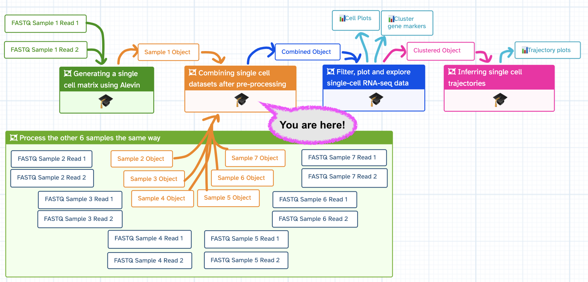
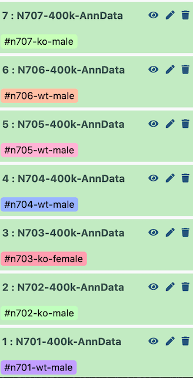

This tutorial will take you from the multiple AnnData outputs of the [previous tutorial](https://humancellatlas.usegalaxy.eu/training-material/topics/transcriptomics/tutorials/scrna-case_alevin/tutorial.html) to a single, combined  AnnData object, ready for all the fun downstream processing. We will also look at how to add in metadata (for instance, SEX or GENOTYPE) for analysis later on.

> <details-title>Where am I?</details-title>
>
> You are in one of the four tutorials associated with a Case Study, which replicates and expands on the analysis performed in a manuscript .
>
> 
>
{: .details}

> <agenda-title></agenda-title>
>
> In this tutorial, we will cover:
>
> 1. TOC
> {:toc}
>
{: .agenda}


## Get Data
The sample data is a subset of the reads from each of the seven samples in a mouse dataset of fetal growth restriction  (see the [study in Single Cell Expression Atlas](https://www.ebi.ac.uk/gxa/sc/experiments/E-MTAB-6945/results/tsne) and the [project submission](https://www.ebi.ac.uk/arrayexpress/experiments/E-MTAB-6945/)).

> <details-title>Fun facts about the dataset</details-title>
>
> We are particularly keen for learners to be able to go from raw FASTQ files all the way through analysis. We aren't handing you a curated dataset that we specially modified in order for this tutorial to work.
> - This tutorial's input dataset is the full dataset generated from the  [previous tutorial in this case study]().
> - The only difference is that in that previous tutorial, we only analysed one dataset. Our input data, however, is the result of applying that workflow to all seven datasets.
> - You can find this dataset in the [study in Single Cell Expression Atlas](https://www.ebi.ac.uk/gxa/sc/experiments/E-MTAB-6945/results/tsne) and the [project submission](https://www.ebi.ac.uk/arrayexpress/experiments/E-MTAB-6945/).
>
{: .details}


<div class="Import-History" markdown="1">

> <hands-on-title>Import History</hands-on-title>
>
> 1. Import the  *Input history* by following the link below
>
>    
>      [ {{h.label}} Input History]( {{h.history}} )
>    
>
>    
>
> If you want to import the history to another Galaxy server, check how to do it below!
>
> 
>
{: .hands_on}

</div>

<div class="Zenodo" markdown="1">

> <hands-on-title>Data upload for 7 files</hands-on-title>
>
> 1. Create a new history for this tutorial (if you're not importing the history above)
> 2. Import the different AnnData files and the experimental design table from [Zenodo](https://zenodo.org/records/10852529).
>
>    ```
>    {{ page.zenodo_link }}/files/N701-400k-AnnData.h5ad
>    {{ page.zenodo_link }}/files/N702-400k-AnnData.h5ad
>    {{ page.zenodo_link }}/files/N703-400k-AnnData.h5ad
>    {{ page.zenodo_link }}/files/N704-400k-AnnData.h5ad
>    {{ page.zenodo_link }}/files/N705-400k-AnnData.h5ad
>    {{ page.zenodo_link }}/files/N706-400k-AnnData.h5ad
>    {{ page.zenodo_link }}/files/N707-400k-AnnData.h5ad
>    {{ page.zenodo_link }}/files/Experimental_Design.tabular
>    ```
>
>    
>
> 3. Rename the datasets
> 4. Check that the AnnData files datatype is `h5ad`, otherwise you will need to change each file to `h5ad`!
>
>    
>
{: .hands_on}

</div>

 Inspect the  `Experimental Design` text file. This shows you how each `N70X` corresponds to a sample, and whether that sample was from a male or female. This will be important metadata to add to our sample, which we will add very similarly to how you added the `gene_name` and `mito` metadata previously!

# Important tips for easier analysis









# Concatenating objects

> <hands-on-title>Concatenating AnnData objects</hands-on-title>
>
> 1.  with the following parameters:
>    -  *"Annotated data matrix"*: `N701-400k`
>    - *"Function to manipulate the object"*: `Concatenate along the observations axis`
>    -  *"Annotated data matrix to add"*: `Select all the other matrix files from bottom to top, N702 to N707`
>
>    > <comment-title></comment-title>
>    > If you imported files from Zenodo instead of using the input history, yours might not be in the same order as ours. Since the files will be concatenated in the order that you click, it will be helpful if you click them in the same order, from N702 to N707. This will ensure your samples are given the same batch numbers as we got in this tutorial, which will help when we're adding in metadata later!
>    {: .comment}
>
>    > <warning-title>Don't add N701!</warning-title>
>    > You are adding files to N701, so do not add N701 to itself!
>    {: .warning}
>
>    - *"Join method"*: `Intersection of variables`
>    - *"Key to add the batch annotation to obs"*: `batch`
>    - *"Separator to join the existing index names with the batch category"*: `-`
> 2. Rename  output `Combined_Object`
{: .hands_on}

Now let's look at what we've done! You can *peek* at the AnnData object in your  history. You can also inspect the dataset for further details using a tool.

> <hands-on-title>Inspecting AnnData Objects</hands-on-title>
>
> 1.  with the following parameters:
>    -  *"Annotated data matrix"*: `Combined_object`
>    - *"What to inspect?"*: `General information about the object`
> 2.  with the following parameters:
>    -  *"Annotated data matrix"*: `Combined_object`
>    - *"What to inspect?"*: `Key-indexed observations annotation (obs)`
> 3.  with the following parameters:
>    -  *"Annotated data matrix"*: `Combined_object`
>    - *"What to inspect?"*: `Key-indexed annotation of variables/features (var)`
{: .hands_on}

Now have a look at the three  **Inspect AnnData** outputs.

> <question-title></question-title>
>
> 1. How many cells do you have now?
> 2. Where is `batch` information stored?
>
> > <solution-title></solution-title>
> >
> > 1. If you peek at your dataset, or look at the **General information**  output, you will find there are `316 cells`, as the matrix is now 316 cells (n_obs) x 35734 genes (n_var). You will also find these numbers in the **obs**  (cells) and **var**  (genes) file sizes.
> > 2. Batch information is stored under **Key-indexed observations annotation (obs)**. Different versions of the Manipulate tool might put the `batch` columns in different locations. The tool version in this tutorial puts `batch` in the `8th` column. Batch refers to the order in which the matrices were added. The files are added from the bottom of the history upwards, so be careful how you set up your histories when running this (i.e. if your first dataset is N703 and the second is N701, the `batch` will call N703 `0` and N701 `1`!)
> {: .solution}
>
{: .question}

# Adding cell metadata

I set up the example history with the earliest indices at the bottom.

{ width=400px }

Therefore, when it is all concatenated together, the `batch` appears as follows:

| Index | Batch | Genotype | Sex |
|------ |--------------------|
| N701 | 0    | wildtype    | male    |
| N702 | 1    | knockout   | male    |
| N703 | 2    | knockout   | female    |
| N704 | 3    | wildtype    | male    |
| N705 | 4    | wildtype    | male    |
| N706 | 5    | wildtype    | male    |
| N707 | 6    | knockout    | male    |

If you used Zenodo to import files, they may not have imported in order (i.e. N701 to N707, ascending). In that case, you will need to tweak the parameters of the next tools appropriately to label your batches correctly!

The two critical pieces of metadata in this experiment are **sex** and **genotype**. I will later want to color my cell plots by these parameters, so I want to add them in now!

## Sex & Genotype metadata

> <hands-on-title>Labelling sex</hands-on-title>
>
> 1.  with the following parameters:
>    -  *"File to process"*: output of **Inspect AnnData: Key-indexed observations annotation (obs)** )
>    - *"1. Replacement"*
>
>         - *"in column"*: `Column: 8` - or whichever column `batch` is in
>         - *"Find pattern"*: `0|1|3|4|5|6`
>         - *"Replace with"*: `male`
>    - **+  Insert Replacement**
>    - *"2. Replacement"*
>
>         - *"in column"*: `Column: 8`
>         - *"Find pattern"*: `2`
>         - *"Replace with"*: `female`
>    - **+  Insert Replacement**
>    - *"3. Replacement"*
>
>         - *"in column"*: `Column: 8`
>         - *"Find pattern"*: `batch`
>         - *"Replace with"*: `sex`
>
>    The output of the  **Replace Text**  tool has many columns. However, we want only the column containing the **sex** information, in order by cell barcode, to add to our AnnData later.
>
> 2.  with the following parameters:
>    - *"Cut columns"*: `c8`
>    - *"Delimited by"*: `Tab`
>    -  *"From"*: output of **Replace text** 
>
> 3. Rename  output `Sex_metadata`
{: .hands_on}

That was so fun, let's do it all again but for genotype!

> <hands-on-title>Labelling genotype</hands-on-title>
>
> 1.  with the following parameters:
>    -  *"File to process"*: output of **Inspect AnnData: Key-indexed observations annotation (obs)** 
>    - *"1. Replacement"*
>
>         - *"in column"*: `Column: 8`
>         - *"Find pattern"*: `0|3|4|5`
>         - *"Replace with"*: `wildtype`
>    - **+ Insert Replacement**
>    - *"2. Replacement"*
>
>         - *"in column"*: `Column: 8`
>         - *"Find pattern"*: `1|2|6`
>         - *"Replace with"*: `knockout`
>    - **+ Insert Replacement**
>    - *"3. Replacement"*
>
>         - *"in column"*: `Column: 8`
>         - *"Find pattern"*: `batch`
>         - *"Replace with"*: `genotype`
>
>    Now we want only the column containing the genotype information - we will ultimately add this into the cell annotation in the AnnData object.
>
> 2.  with the following parameters:
>    - *"Cut columns"*: `c8`
>    - *"Delimited by"*: `Tab`
>    -  *"From"*: output of **Replace text** 
>
> 3. Rename  output `Genotype_metadata`
{: .hands_on}

You might want to do this with all sorts of different metadata - which labs handled the samples, which days they were run, etc. Once you've created and cut all your metadata columns, we can paste them together before adding them into the AnnData object itself.

> <hands-on-title>Combining metadata columns</hands-on-title>
>
> 1.  with the following parameters:
>    -  *"Paste"*: `Genotype_metadata`
>    -  *"and"*: `Sex_metadata`
>    - *"Delimit by"*: `Tab`
> 2. Rename  output `Cell_Metadata`
{: .hands_on}

Let's add this metadata to the AnnData object!

> <hands-on-title>Adding metadata to AnnData object</hands-on-title>
>
> 1.  with the following parameters:
>    -  *"Annotated data matrix"*: `Combined_object`
>    - *"Function to manipulate the object"*: `Add new annotation(s) for observations or variables`
>    - *"What to annotate?"*: `Observations (obs)``
>    -  *"Table with new annotations"*: `Cell_Metadata`
{: .hands_on}

Woohoo! We're there! You can *peek* at your new AnnData object in your history  to see the additional **Obs** categories to make sure this worked. You should now find a `sex` and `genotype` in the **Obs** listing.

## Add batch metadata

I want to clean up this AnnData object just a bit more first. It would be a lot nicer if 'batch' meant something, rather than 'the order in which the Manipulate AnnData tool added my datasets'.

> <hands-on-title>Labelling batches</hands-on-title>
>
> 1.  with the following parameters:
>    -  *"Annotated data matrix"*: output of **Manipulate AnnData - Add new annotations** 
>    - *"Function to manipulate the object"*: `Rename categories of annotation`
>    - *"Key for observations or variables annotation"*: `batch`
>    - *"Comma-separated list of new categories"*: `N701,N702,N703,N704,N705,N706,N707`
>
> 2. Rename  output `Batched_Object`
>
{: .hands_on}

 Well done! *Peek* at your final  `Batched_Object` to see the wealth of information that has been added. You are now ready to move along to further filtering!

# Conclusion

You might find the  *Answer Key Histories* helpful to check or compare with:
  - 
      [ {{h.label}} ]( {{h.history}} )
    
<!-- Only currently want to iterate through the first history, but might want others in the future (different servers!) -->

You can also run this entire tutorial via a  *Workflow*, after performing the **Get data** step initially.
 - [Tutorial Workflow]()

<iframe title="Galaxy Workflow Embed" style="width: 100%; height: 700px; border: none;" src="https://singlecell.usegalaxy.eu/published/workflow?id=d1a1e6070c0a36ca&embed=true&buttons=true&about=false&heading=false&minimap=true&zoom_controls=true&initialX=0&initialY=-20&zoom=0.5"></iframe>

Finally, you may remember that the datasets you analysed in this tutorial were downsampled. The idential analysis can be performed on whole samples, which you can find in the example histories below.
-  Remember that *if* you are in a course, time for exploring these histories will not be factored into the schedule. Explore these outside of course time!
- 
    [ {{h.label}} ]( {{h.history}} )
  


