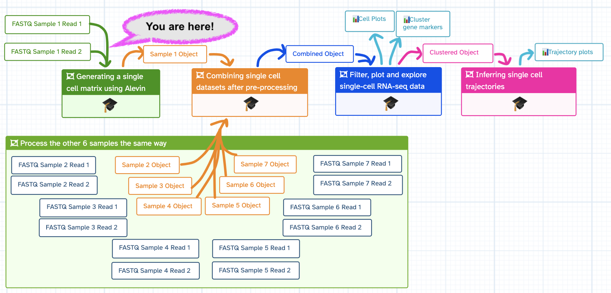
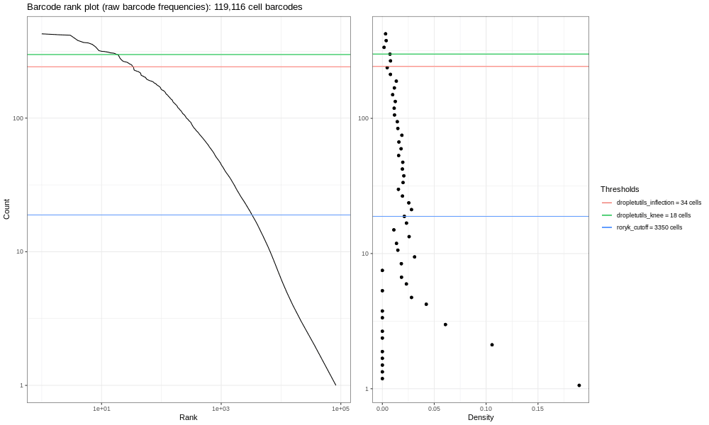
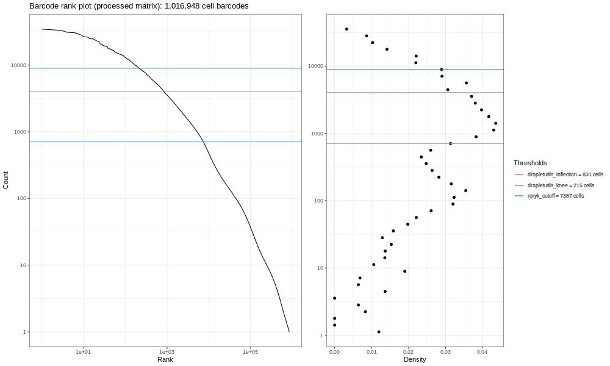
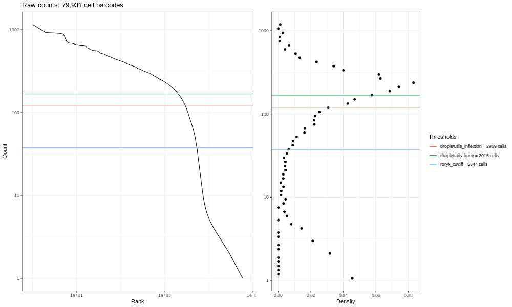

This tutorial will take you from raw FASTQ files to a cell x gene data matrix in AnnData format. What's a data matrix, and what's AnnData format? Well you'll find out! Importantly, this is the first step in processing single cell data in order to start analysing it.

> <details-title>Where am I?</details-title>
>
> You are in one of the four tutorials associated with a Case Study, which replicates and expands on the analysis performed in a manuscript .
>
> 
>
{: .details}

Currently you have a bunch of strings of `ATGGGCTT` etc. in your sequencing files, and what you need to know is how many cells you have and what genes appear in those cells. These steps are the most computationally heavy in the single cell world, as you're starting with 100s of millions of reads, each with 4 lines of text. Later on in analysis, this data becomes simple gene counts such as 'Cell A has 4 GAPDHs', which is a lot easier to store! Because of this data overload, we have downsampled the FASTQ files to speed up the analysis a bit. Saying that, you're still having to map loads of reads to the massive murine genome, so get yourself a cup of coffee and prepare to analyse!

> <warning-title>For the bench scientists and biologists!</warning-title>
> If you're not used to computing, this tutorial will *not* feel intuitive. It's lots of heavy (and necessary) computational steps with little visible reward. You will still absolutely be able to complete it, but it won't make that much sense.
>
> **That is ok!**
>
> Conceptually, the  [Filter, plot & explore]() tutorial (which comes later) is when you really get to generate fun plots and interpret them scientifically. However, you can't do that until you have pre-processed your data. Some learners like doing that tutorial first, them coming back to learn how to build their input dataset here. So:
>
> - If you're in a *Live course*, follow the path of training materials
> - If you're learning on your own, either get through these pre-processing steps with the belief that plots will get more fun later, or:
> - Try out the  [Filter, plot & explore]() tutorial *first*, then swing back and do this one.
> It's up to you!
>
{: .warning}

> <agenda-title></agenda-title>
>
> In this tutorial, we will cover:
>
> 1. TOC
> {:toc}
>
{: .agenda}

# Important tips for easier analysis









# Generating a matrix

In this section, we will show you the principles of the initial phase of single-cell RNA-seq analysis: generating expression measures in a matrix. We'll concentrate on droplet-based (rather than plate-based) methodology, since this is the process with most differences with respect to conventional approaches developed for bulk RNA-seq.

Droplet-based data consists of three components: cell barcodes, unique molecular identifiers (UMIs) and cDNA reads. To generate cell-wise quantifications we need to:

 * Process cell barcodes, working out which ones correspond to 'real' cells, which to sequencing artefacts, and possibly correct any barcodes likely to be the product of sequencing errors by comparison to more frequent sequences.
 * Map biological sequences to the reference genome or transcriptome.
 * 'De-duplicate' using the UMIs.

This used to be a complex process involving multiple algorithms, or was performed with technology-specific methods (such as 10X's 'Cellranger' tool)  but is now much simpler thanks to the advent of a few new methods. When selecting methodology for your own work you should consider:

 * [STARsolo](https://github.com/alexdobin/STAR) - a droplet-based scRNA-seq-specific variant of the popular genome alignment method STAR. Produces results very close to those of Cellranger (which itself uses STAR under the hood).
 * [Kallisto/ bustools](https://www.kallistobus.tools/) - developed by the originators of the transcriptome quantification method, Kallisto.
 * [Alevin](https://salmon.readthedocs.io/en/latest/alevin.html) - another transcriptome analysis method developed by the authors of the Salmon tool.

We're going to use Alevin  for demonstration purposes, but we do not endorse one method over another.

## Get Data

We've provided you with some example data to play with, a small subset of the reads in a mouse dataset of fetal growth restriction ()). You can also find it in the [study in Single Cell Expression Atlas](https://www.ebi.ac.uk/gxa/sc/experiments/E-MTAB-6945/results/tsne) and in [Array Express](https://www.ebi.ac.uk/arrayexpress/experiments/E-MTAB-6945/)), where we downloaded the original FASTQ files.zs This is a study using the Drop-seq chemistry, however this tutorial is almost identical to a 10x chemistry. We will point out the one tool parameter change you will need to run 10x samples. This data is not carefully curated, standard tutorial data - it's real, it's messy, it desperately needs filtering, it has background RNA running around, and most of all it will give you a chance to practice your analysis as if this data were yours.

Down-sampled reads and some associated annotation will be imported in your first step.

> <details-title>Downsampling?</details-title>
>
> The datasets take a while to run in their original size, so we've pre-selected 400,000 lines from the original file to make it run faster. How did we do this?
> - How did I downsample these FASTQ files? You can check out the  [ {{ page.downsample_histories[0].label }} ] ( {{ page.input_histories[0].history }}  ) to find out!
>
> -  If you are in a *live course*, the time to explore this **downsampling history** is not be factored into the schedule. Please instead check it out *after* your course is finished, or if you finish early!
>
{: .details}

Additionally, to map your reads, we have given you a transcriptome to align against (a FASTA) as well as the gene information for each transcript (a gtf) file.

> <details-title>Where did the FASTA and gtf come from?</details-title>
>
> In practice, you can download the latest, most accurate files for your species of interest [from Ensembl](https://www.ensembl.org/info/data/ftp/index.html).
>
{: .details}



<div class="Import-History-on-EU-server" markdown="1">

> <hands-on-title>Import History from EU server</hands-on-title>
>
> 1. Import the  *Input history* by following the link below
>
>     
>       [ {{h.label}} Input History]( {{h.history}} )
>     
>
>    
>
{: .hands_on}

</div>

<div class="Zenodo" markdown="1">

> <hands-on-title>Option 2: Import data from Zenodo</hands-on-title>
>
> 1. Create a new history for this tutorial
> 2. Import the Experimental Design table, sequencing reads 1 & 2, the GTF and fasta files from [Zenodo]({{ page.zenodo_link }})
>
>    ```
>    {{ page.zenodo_link }}/files/Experimental_Design.tabular
>    {{ page.zenodo_link }}/files/Mus_musculus.GRCm38.100.gtf.gff
>    {{ page.zenodo_link }}/files/Mus_musculus.GRCm38.cdna.all.fa.fasta
>    {{ page.zenodo_link }}/files/SLX-7632.TAAGGCGA.N701.s_1.r_1.fq-400k.fastq
>    {{ page.zenodo_link }}/files/SLX-7632.TAAGGCGA.N701.s_1.r_2.fq-400k.fastq
>    ```
>
>    
>
> 3. Rename  the datasets: Change `SLX-7632.TAAGGCGA.N701.s_1.r_1.fq-400k` to `N701-Read1` and `SLX-7632.TAAGGCGA.N701.s_1.r_2.fq-400k.fastq` to `N701-Read2`.
>
{: .hands_on}
</div>


> <question-title></question-title>
>
> Have a look at the files you now have in your history.
> 1. Which of the FASTQ files do you think contains the barcode sequences?
> 2. Given the chemistry this study should have, are the barcode/UMI reads the correct length?
> 3. What is the 'N701' referring to?
>
> > <solution-title></solution-title>
> >
> > 1. Read 1 (SLX-7632.TAAGGCGA.N701.s_1.r_1.fq-400k) contains the cell barcode and UMI because it is significantly shorter (indeed, 20 bp!) compared to the longer, r_2 transcript read. For ease, it's better to rename these files N701-Read1 and N701-Read2.
> > 2. You can see Read 1 is only 20 bp long, which for original Drop-Seq is 12 bp for cell barcode and 8 bp for UMI. This is correct! Be warned - 10x Chromium (and many technologies) change their chemistry over time, so particularly when you are accessing public data, you want to check and make sure you have your numbers correct!
> > 3. 'N701' is referring to an index read. This sample was run alongside 6 other samples, each denoted by an Illumina Nextera Index (N70X). Later, this will tell you batch information. If you look at the 'Experimental Design' file, you'll see that the N701 sample was from a male wildtype neonatal thymus.
> {: .solution}
{: .question}

Gene-level, rather than transcript-level, quantification is standard in scRNA-seq, which means that the expression level of alternatively spliced RNA molecules are combined to create gene-level values. Droplet-based scRNA-seq techniques only sample one end each transcript, so lack the full-molecule coverage that would be required to accurately quantify different transcript isoforms.

## Generate a transcript to gene map

To generate gene-level quantifications based on transcriptome quantification, Alevin and similar tools require a conversion between transcript and gene identifiers. We can derive a transcript-gene conversion from the gene annotations available in genome resources such as Ensembl. The transcripts in such a list need to match the ones we will use later to build a binary transcriptome index. If you were using spike-ins, you'd need to add these to the transcriptome and the transcript-gene mapping.

In your example data you will see the murine reference annotation as retrieved from Ensembl in GTF format. This annotation contains gene, exon, transcript and all sorts of other information on the sequences. We will use these to generate the transcript/ gene mapping by passing that information to a tool that extracts just the transcript identifiers we need.

> <question-title></question-title>
>
> Which of the 'attributes' in the last column of the GTF files contains the transcript and gene identifiers?
>
>
>   > <tip-title>Hint</tip-title>
>   >
>   > The file is organised such that the last column (headed 'Group') contains a wealth of information in the format: attribute1 "information associated with attribute 1";attribute2 "information associated with attribute 2" etc.
>   {: .tip}
>
> > <solution-title></solution-title>
> > *gene_id* and *transcript_id* are each followed by "ensembl gene_id" and "ensembl transcript_id"
> {: .solution}
{: .question}

It's now time to *parse* (computing term for separating out important information from a larger file) the GTF file using the [rtracklayer](https://bioconductor.org/packages/release/bioc/html/rtracklayer.html) package in R. This parsing will give us a conversion table with a list of transcript identifiers and their corresponding gene identifiers for counting. Additionally, because we will be generating our own binary index (more later!), we also need to input our FASTA so that it can be filtered to only contain transcriptome information found in the GTF.

> <hands-on-title>Generate a filtered FASTA and transcript-gene map</hands-on-title>
>
> 1.  with the following parameters:
>    -  *"Ensembl GTF file"*: `GTF file in the history` 
>    - *"Feature type for which to derive annotation"*: `transcript` (Your sequences are transcript sequencing, so this is your starting point)
>    - *"Field to place first in output table"*: `transcript_id` (This is accessing the column you identified above!)
>    - *"Suppress header line in output?"*:  `Yes` (The next tool (Alevin) does not expect a header)
>    - *"Comma-separated list of field names to extract from the GTF (default: use all fields)"*: `transcript_id,gene_id` (This calls the first column to be the transcript_id, and the second the gene_id. Thus, your key can turn transcripts into genes)
>    - *"Append version to transcript identifiers?"*:  `Yes` (The Ensembl FASTA files usually have these, and since we need the FASTA transcriptome and the GTF gene information to work together, we need to append these!)
>    - *"Flag mitochondrial features?"*:  `No`
>    - *"Provide a cDNA file for extracting annotations and/ or possible filtering?"*:   `Yes`
>    -  *"FASTA-format cDNA/transcript file"*: `Mus_musculus.GRCm38cdna.all.fa` (you may have renamed your differently in your  history)
>    - *"Annotation field to match with sequences"*: `transcript_id`
>    - *"Filter the cDNA file to match the annotations?"*:  `Yes`
>
> 2. Rename  the annotation table to `Map`
>
> 3. Rename  the filtered FASTA file to `Filtered_FASTA`
{: .hands_on}

## Generate a transcriptome index & quantify!

Alevin collapses the steps involved in dealing with dscRNA-seq into a single process. Such tools need to compare the sequences in your sample to a reference containing all the likely transcript sequences (a 'transcriptome'). This will contain the biological transcript sequences known for a given species, and perhaps also technical sequences such as 'spike ins' if you have those.

> <details-title>How does Alevin work?</details-title>
>
> To be able to search a transcriptome quickly, Alevin needs to convert the text (FASTA) format sequences into something it can search quickly, called an 'index'. The index is in a binary rather than human-readable format, but allows fast lookup by Alevin. Because the types of biological and technical sequences we need to include in the index can vary between experiments, and because we often want to use the most up-to-date reference sequences from Ensembl or NCBI, we can end up re-making the indices quite often. Making these indices is time-consuming! Have a look at the uncompressed FASTA to see what it starts with.
>
{: .details}

We now have:

* Barcode/ UMI reads
* cDNA reads
* transcript/ gene mapping
* filtered FASTA

We can now run Alevin! However, Alevin will inherently do some of its own filtering and thresholding. We will actually use a better tool later (*emptyDrops*) that needs to work on raw outputs. Therefore, we are going to select options to limit Alevin from filtering the outputs.

> <hands-on-title>Running Alevin</hands-on-title>
>
> 1. 
>    - *"Select a reference transcriptome from your history or use a built-in index?"*: `Use one from the history`
>       - You are going to generate the binary index using your filtered FASTA!
>        - In *"Salmon index"*:
>            -  *"Transcripts FASTA file"*: `Filtered_FASTA`
>    - *"Single or paired-end reads?"*: `Paired-end`
>        -  *"Mate pair 1"*: `N701-Read1`
>        -  *"Mate pair 2"*: `N701-Read2`
>    - *"Specify the strandedness of the reads"*: `Infer automatically (A)`
>    - *"Type of single-cell protocol"*: `DropSeq Single Cell protocol`
>    -  *"Transcript to gene map file"*: `Map`
>    - In *"Extra output files"*:
>        -  `Salmon Quant log file`
>        -  `Features used by the CB classification and their counts at each cell level (--dumpFeatures)`
>    - In *"Advanced options"*:
>        - *" Dump cell v transcripts count matrix in MTX format"*:  `Yes`
>        - *"Fraction of cellular barcodes to keep"*: `1.0` (this prevents Alevin from adding extra thresholds!)
>        - *"Minimum frequency for a barcode to be considered"*: `3` (This is normally set at about 10, but as we've downsampled these datasets, setting it to 10 would pretty much delete them!)
{: .hands_on}

> <tip-title>What if I'm running a 10x sample?</tip-title>
>
> The main parameter that needs changing for a 10X Chromium sample is the 'Protocol' parameter of Alevin. Just select the correct 10x Chemistry there instead.
{: .tip}

> <details-title>Strandedness?</details-title>
>
> The Salmon documentation on 'Fragment Library Types' and running the Alevin command is here: [salmon.readthedocs.io/en/latest/library_type.html](https://salmon.readthedocs.io/en/latest/library_type.html) and [salmon.readthedocs.io/en/latest/alevin.html](https://salmon.readthedocs.io/en/latest/alevin.html). These links will help here, although keep in mind the image there is drawn with the RNA 5' on top, whereas in this scRNA-seq protocol, the polyA is captured by its 3' tail and thus effectively the bottom or reverse strand...)
>
{: .details}

> <comment-title>Alevin file names</comment-title>
>
> You will notice that the names of the output files of Alevin are written in a certain convention, mentioning which tool was used and on which files, for example: *"Alevin on data X, data Y, and others: whitelist"*. Remember that you can always rename the files if you wish! For simplicity, when we refer to those files in the tutorial, we skip the information about tool and only use the second part of the name - in this case it would be simply *"whitelist"*.
{: .comment}

This tool will take a while to run. Alevin produces many file outputs, not all of which we'll use. You can refer to the [Alevin documentation](https://salmon.readthedocs.io/en/latest/alevin.html) if you're curious what they all are, but we're most interested in is:

* the matrix itself (*per-cell gene-count matrix (MTX)* - the count by gene and cell)
* the row (cell/ barcode) identifiers (*row index (CB-ids)*) and
* the column (gene) labels (*column headers (gene-ids)*).


> <question-title></question-title>
>
> After you've run Alevin,  look through all the different output files. Can you find:
> 1. The Mapping Rate?
> 2. How many cells are present in the matrix output?
>
> > <solution-title></solution-title>
> >
> > 1. Inspect  the file  *Salmon log file*. You can see the mapping rate is a paltry `48.3268%` (This may vary slightly with tool versions). This is not a great mapping rate. Why might this be? For early Drop-Seq samples and single-cell data in general, you might expect a slightly poorer mapping rate. 10x samples are much better these days! This is real data, not test data, after all!
> > 2. *Peek* at the file  *row index (CB-ids)* in your , and you will find it has `22,952` lines. The rows refer to the cells in the cell x gene matrix. According to this (rough) estimate, your sample has 22,952 cells in it! This entirely inaccurate, because it's currently counting background noise as cells. So we need to do some **Quality Control** (QC)!
> >
> {: .solution}
>
{: .question}

 Congratulations - you've made an expression matrix! We could almost stop here. But it's sensible to do some basic QC, and one of the things we can do is look at a barcode rank plot.

# Generating QC Plots

The question we're looking to answer here, is: "do we mostly have a single cell per droplet"? That's what experimenters are normally aiming for, but it's not entirely straightforward to get exactly one cell per droplet. Sometimes almost no cells make it into droplets, other times we have too many cells in each droplet. At a minimum, we should easily be able to distinguish droplets with cells from those without.

> <hands-on-title>Generate a raw barcode QC plot</hands-on-title>
>
> 1.  with the following parameters:
>    - *"Input MTX-format matrix?"*:  `No`
>    -  *"A two-column tab-delimited file, with barcodes in the first column and frequencies in the second"*: Output of Alevin `raw CB classification frequencies`
>    - *"Label to place in plot title"*: `Barcode rank plot (raw barcode frequencies)`
>
> 2. Rename  the image output `Barcode Plot - raw barcode frequencies`
{: .hands_on}

## Interpreting the QC plots

This is our own formulation of the barcode plot based on a [discussion](https://github.com/COMBINE-lab/salmon/issues/362#issuecomment-490160480) we had with community members. The left hand plots with the smooth lines are the main plots, showing the UMI counts for individual cell barcodes ranked from high to low. The right hand plots are density plots from the first one, and the thresholds are generated either using [dropletUtils](https://bioconductor.org/packages/release/bioc/html/DropletUtils.html) or by the method described in the discussion mentioned above.



Now, the image generated here (400k) isn't the most informative - but you are dealing with a fraction of the reads! If you run the total sample (so identical steps above, but with significantly more time!) you'd get the image below.



We expect a sharp drop-off between cell-containing droplets and ones that are empty or contain only cell debris. Then, various proposed thresholds (shown in the different coloured horizontal lines) are calculated by Alevin, to give options of where to put a cut-off line that says "Any barcodes with fewer reads per cell than this cut-off line are discarded, because these are likely background and uninformative." Ideally, this cut-off is clearly at the point where the curve bends, known as the *knee* of the curve.

Now, this data is not an ideal dataset, so for perspective, in an ideal world with a very clean 10x run, data will look a bit more like the following taken from the lung atlas (see the [study in Single Cell Expression Atlas](https://www.ebi.ac.uk/gxa/sc/experiments/E-MTAB-6653/results/tsne) and the [project submission](https://www.ebi.ac.uk/arrayexpress/experiments/E-MTAB-6653/)).



You can see the clearer 'knee' bend in this significantly larger and cleaner sample, showing the cut-off between empty droplets and cell-containing droplets.

While we could use any of these calculated thresholds to select cells, there are some more sophisticated methods also available. We will try one called *"emptyDrops"*.

# emptyDrops

In experiments with relatively simple characteristics, the 'knee detection' method works relatively well. But some populations (such as our sample!) present difficulties. For instance, sub-populations of small cells may not be distinguished from empty droplets based purely on counts by barcode. Some libraries produce multiple 'knees' for multiple sub-populations. The [emptyDrops](https://genomebiology.biomedcentral.com/articles/10.1186/s13059-019-1662-y) method has become a popular way of dealing with this. emptyDrops still retains barcodes with high counts, but also adds in barcodes that can be statistically distinguished from the ambient profiles, even if total counts are similar.

## Reformatting for emptyDrops

Alevin outputs MTX format. However, emptyDrops runs on SingleCellExperiment (SCE) format. To get there, we will perform the following steps:

 1. Swap Cells & Genes orientation
 2. Add in gene metadata (gene symbols, mitochondrial information)
 3. Convert to a SingleCellExperiment object

### Transform matrix

First, we need to 'transform' the matrix such that cells are in columns and genes are in rows.

> <hands-on-title>Transform matrix</hands-on-title>
>
> 1.  with the following parameters:
>    -  *".mtx-format matrix"*: `per-cell gene-count matrix (MTX)` (output of **Alevin** )
>    -  *"Tab-delimited genes file"*: `column headers (gene-ids)` (output of **Alevin** )
>    -  *"Tab-delimited barcodes file"*: `row index (CB-ids)` (output of **Alevin** )
>
> 2. Rename  'salmonKallistoMtxTo10x....:genes' to `Gene_table`
> 3. Rename  'salmonKallistoMtxTo10x....:barcodes' to `Barcode_table`
> 4. Rename  'salmonKallistoMtxTo10x....:matrix' to `Matrix_table`
{: .hands_on}

The output is a matrix in the correct orientation for the rest of our tools. However, our matrix is looking a bit sparse - for instance, click on `Gene_table`. I don't know about you, but I'd struggle to have a good biological discussion using only Ensembl gene_ids! What I'd really like is the more understandable 'GAPDH' or other gene acronym, as well as information on mitochondrial genes so that I can assess if my cells were stressed out or not. In order to prepare our data for emptyDrops, we're going to combine this information into an object, and it's easiest to add in that information now.

### Add in Gene metadata

> <question-title></question-title>
>
> Where can we find information about genes?
>
> > <solution-title></solution-title>
> >
> > Our old friend the GTF file!
> >
> {: .solution}
>
{: .question}

> <question-title></question-title>
>
> Which of the 'attributes' in the last column of that file contains the gene acronym?
>
> > <solution-title></solution-title>
> >
> > gene_name
> >
> {: .solution}
>
{: .question}

We're now going to re-run  the tool that extracts information from our GTF file, but extract gene information instead of transcript information.

> <hands-on-title>Generate gene information</hands-on-title>
>
> 1.  with the following parameters:
>    - *"Feature type for which to derive annotation"*: `gene`
>    - *"Field to place first in output table"*: `gene_id`
>    - *"Suppress header line in output?"*:  `Yes`
>    - *"Comma-separated list of field names to extract from the GTF (default: use all fields)"*: `gene_id,gene_name,mito`
>    - *"Append version to transcript identifiers?"*:  `Yes`
>    - *"Flag mitochondrial features?"*:  `Yes` - note, this will auto-fill a bunch of acronyms for searching in the GTF for mitochondrial associated genes. This is good!
>    - *"Filter the cDNA file to match the annotations?"*:  `No` - we don't need to, we're done with the FASTA!
>
> 2. Convert the  annotation table (TSV) output to `tabular`
>
>    
>
> 3. Rename  the tabular annotation table to `Gene_Information`
>
{: .hands_on}

Inspect  the  `Gene_Information` object in the history. You have made a new key for gene_id, with gene name and a column of mitochondrial information (false = not mitochondrial, true = mitochondrial). We need to add this information into the  salmonKallistoMtxTo10x output `Gene_table`. But we need to keep `Gene_table` in the same order, since it is referenced in the `Matrix_table` by row.

> <hands-on-title>Combine MTX Gene Table with Gene Information</hands-on-title>
>
> 1.  with the following parameters:
>    - *"Join"*: `Gene_table`
>    - *"Using column"*: `Column: 1`
>    - *"with"*: `Gene_Information`
>    - *"and column"*: `Column: 1`
>    - *"Keep lines of first input that do not join with second input"*: `Yes`
>    - *"Keep lines of first input that are incomplete"*: `Yes`
>    - *"Fill empty columns"*: `No`
>    - *"Keep the header lines"*: `No`
>
>
>    If you inspect  the object, you'll see we have joined these tables and now have quite a few gene_id repeats. Let's take those out, while keeping the order of the original 'Gene Table'.
>
>
> 2.   with the following parameters:
>    - *"Cut columns"*: `c1,c4,c5`
>    - *"Delimited by"*: `Tab`
>    - *"From"*: output of **Join two Datasets** 
>
> 3. Rename output `Annotated_Gene_Table`
{: .hands_on}

Inspect  your `Annotated_Gene_Table`. That's more like it! You now have `gene_id`, `gene_name`, and `mito` information (just without a header to label them). Now let's get back to your journey to emptyDrops and sophisticated thresholding of empty droplets!

## Convert to SCE format

The tool emptyDrops  works with a specific form of R object called a *"SingleCellExperiment"*. We need to convert our transformed MTX files into that form, using the DropletUtils Read10x tool:

> <hands-on-title>Converting to SingleCellExperiment format</hands-on-title>
>
> 1.  with the following parameters:
>    -  *"Expression matrix in sparse matrix format (.mtx)"*: `Matrix_table`
>    -  *"Gene Table"*: `Annotated_Gene_Table`
>    -  *"Barcode/cell table"*: `Barcode_table`
>    - *"Should metadata file be added?"*:  `No`
>
> 2. Rename  output: `SCE_Object`
{: .hands_on}

Fantastic! Now that our matrix is combined into an object, specifically the SingleCellExperiment format, we can now run emptyDrops! Let's get rid of those background droplets containing no cells!

## Run emptyDrops

> <hands-on-title>Emptydrops</hands-on-title>
>
> 1.  with the following parameters:
>    -  *"SingleCellExperiment rdata object"*: `SCE_Object`
>    - *"Should barcodes estimated to have no cells be removed from the output object?"*:  `Yes`
>
> 2. Rename  `serialised SingleCellExperiment` output as `Emptied_Object`
>
{: .hands_on}

> <question-title></question-title>
>
> How many cell barcodes remain after the emptyDrops treatment? Why might that be?
>
>   > <tip-title>Hint</tip-title>
>   > If you *peek* at the `Emptied_Object` in your  history, the text in that window says `38 barcodes` or something similar to that - there is an element of random in the algorithm, so yours might differ slightly. Why is this so low?? And why might the number be different?
>   > Consider...is this a complete set of data?
>   {: .tip}
>
>
> > <solution-title></solution-title>
> >
> > Remember this is a subsampled dataset. If you look carefully at the parameters of emptyDrops, you'll see it set a minimum threshold at 100 UMI. If you look at the barcode plots above for the 400k read sample, you'll see this is far too stringent for this subsampled data! To satisfy your curiosity, this minimum threshold would yield around `4332` barcodes for the total sample. Again, the number may vary slightly as the output depends on a large number of random iterations.
> >
> {: .solution}
>
{: .question}

We will nevertheless proceed with your majestic annotated expression matrix of ~38 cells, ready to go for further processing and analysis!



<div class="Scanpy" markdown="1">

The tool suite called Scanpy () uses a format called `AnnData`, which is a variant of a file format called `hdf5`. You will now convert your SCE object to an AnnData one!

# Convert to AnnData object

> <hands-on-title>Converting to AnnData format</hands-on-title>
>
> 1.  with the following parameters:
>    - *"Convert From / To"*: `SingleCellExperiment to AnnData`
>    -  *"Input object in sce,rds,rdata.sce format"*: `Emptied_Object`
>
> If the dataset does not show up in the corresponding input field or displays as 'unavailable', don't worry - try dragging the dataset from the history panel and dropping it into the input field. If this still doesn't work, then you can change the datatype to `rdata.sce`.
>
> 
>
{: .hands_on}

Last but not least, after all these data conversions, your AnnData object is missing some labelling. If you *peek* at our latest output  in your  history, and check the *vars* categories, you will find one category labelled `NA.` What is this? To find out, you can use a handy tool.

> <hands-on-title>Inspecting AnnData Objects</hands-on-title>
>
> 1.  with the following parameters:
>    -  *"Annotated data matrix"*: `output_anndata` (output of **SCEasy Converter** )
>    - *"What to inspect?"*: `Key-indexed annotation of variables/features (var)`
{: .hands_on}

If you  examine the output , you will find that this `NA.` column is a bunch of True/False outputs.

> <question-title></question-title>
>
> What are this "True/False" referring to? (Hint: Consider what gene information you have added!)
>
> > <solution-title></solution-title>
> >
> > The second time you ran the GTF2GeneList, you extracted `gene_id,gene_name,mito` information and then added that information to your datasets. The `mito` flagging outputs a True if the gene has any mitochondrial information in its GTF listing, or False if it does not. Therefore, this `NA.` should be labelled `mito`!
> >
> {: .solution}
>
{: .question}

## Flag mitochondrial genes

> <hands-on-title> Label Mito Metadata</hands-on-title>
>
> 1.  with the following parameters:
>    -  *"Annotated data matrix"*: `output_anndata` (output of **SCEasy Converter** )
>    - *"Function to manipulate the object"*: `Rename fileds in AnnData variables`
>        - *"Name of the variables field that you want to change"*: `NA.`
>        - *"New name of the filed in the variables"*: `mito`
>
> 2. Rename  output `N701-400k-AnnData`
>
{: .hands_on}

Your object is ready to for the scanpy pipeline!

</div>

<div class="Seurat" markdown="1">
<!-- intentionally empty. This comment itself isn't necessary, but we recommend adding the div. -->
</div>

# Conclusion

 Congrats! You have finished the tutorial!

We have:

 * Examined raw read data, annotations and necessary input files for quantification.
 * Run Alevin and applied emptyDrops instead of Alevin's inbuilt thresholds.
 * Deployed barcode rank plots as a way of quickly assessing the signal present in droplet datasets.
 * Converted these datasets to enable downstream analysis.

You might find the  *Answer Key Histories* helpful to check or compare with:
  - 
      [ {{h.label}} ]( {{h.history}} )
    

<!-- Only currently want to iterate through the first history, but might want others in the future (different servers!) -->

You can also run this entire tutorial via a  *Workflow*, after performing the **Get data** step initially.
 - [Tutorial Workflow]()

<iframe title="Galaxy Workflow Embed" style="width: 100%; height: 700px; border: none;" src="https://singlecell.usegalaxy.eu/published/workflow?id=9a9bbd8046da7b19&embed=true&buttons=true&about=false&heading=false&minimap=true&zoom_controls=true&initialX=0&initialY=0&zoom=0.33"></iframe>

It may be that you want to combine this object with others like it, for instance, maybe you ran 5 samples, and you are starting with 10 FASTQ files... To do this, you can run that same Workflow on all your files! In fact, that's what we do to set up the datasets for the next tutorial. You can explore applying this tutorial to all seven samples in this dataset, either in the downsampled or whole state.

-  Remember that *if* you are in a course, time for exploring these histories will not be factored into the schedule. Explore these outside of course time!

- 
    [ {{h.label}} ]( {{h.history}} )
  


