You've done all the work to make a single cell matrix, with mitochondrial genes flagge and buckets of cell metadata from all your variables of interest. Now it's time to fully process our data, to remove low quality cells, to reduce the many dimensions of the data that make it difficult to work with, and ultimately to try to define our clusters and to find our biological meaning and insights! There are many packages for analysing single cell data - Seurat , Scanpy , Monocle , Scater , and so forth. We're working with Scanpy, although Galaxy has training using other packages, which you can explore on our  [Single-cell training topic]().

> <details-title>Where am I?</details-title>
>
> You are in one of the four tutorials associated with a Case Study, which replicates and expands on the analysis performed in a manuscript .
>
> 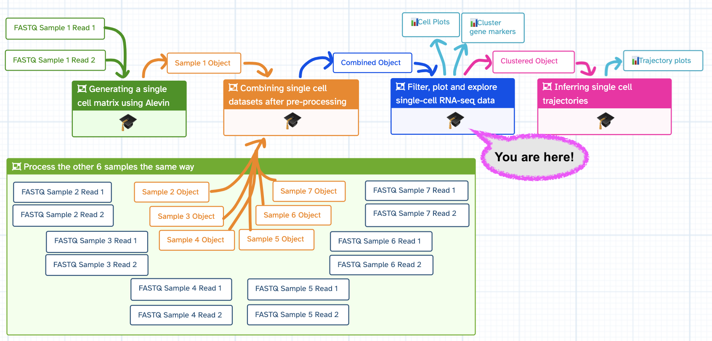
>
{: .details}

> <agenda-title></agenda-title>
>
> In this tutorial, we will cover:
>
> 1. TOC
> {:toc}
>
{: .agenda}

## Get data

We've provided you with experimental data to analyse from a mouse dataset of fetal growth restriction .

> <details-title>Fun facts about the dataset</details-title>
>
> We are particularly keen for learners to be able to go from raw FASTQ files all the way through analysis. We aren't handing you a curated dataset that we specially modified in order for this tutorial to work. Instead, this tutorial's input dataset is the full dataset generated from the  [previous tutorial in this case study]().
> - The only difference is that in that previous tutorial, we *downsampled* the datasets in so the tutorial would run faster. Our input data, however, now uses the *full dataset*, analysed exactly the same was as in the tutorial.
> - You can also find this dataset in the [study in Single Cell Expression Atlas](https://www.ebi.ac.uk/gxa/sc/experiments/E-MTAB-6945/results/tsne) and the [project submission](https://www.ebi.ac.uk/arrayexpress/experiments/E-MTAB-6945/).
>
{: .details}

{% include _includes/cyoa-choices.html option1="Import History on EU server" option2="Zenodo" option3="SCXA" default="Import History on EU server"
       text="If you're on the EU server, (if your usegalaxy has an **EU** anywhere in the URL), then the quickest way to Get the Data for this tutorial is via importing a history. Otherwise, you can also import from Zenodo - it just might take a moment longer if you're in a live course and everyone is importing the same dataset at the same time! The SCXA is specifically for learners who are focusing on *Reusing public data*, so are not beginners." %}

<div class="Import-History-on-EU-server" markdown="1">

> <hands-on-title>Import History from EU server</hands-on-title>
>
> 1. Import the  *Input history* by following the link below
>
>     
>       [ {{h.label}} Input History]( {{h.history}} )
>     
>
>    
>
{: .hands_on}

</div>

<div class="Zenodo" markdown="1">

> <hands-on-title>Import from Zenodo</hands-on-title>
>
> 1. Create a new history for this tutorial
> 2. Import the AnnData object from [Zenodo]({{ page.zenodo_link }})
>
>    ```
>    {{ page.zenodo_link }}/files/Batched_Object
>    ```
>
>    
>
> 3. **Rename**  the datasets `QC_Object`
> 4. Check that the datatype is `h5ad`
>
>    
>
{: .hands_on}

</div>

<div class="SCXA" markdown="1">

You can also pull the data from publicly available [Single Cell Expression Atlas](https://www.ebi.ac.uk/gxa/sc/home).

> <hands-on-title>Import from the EBI Single Cell Expression Atlas</hands-on-title>
>
> 1.  with the following parameters:
>    - **SC-Atlas experiment accession**: `E-MTAB-6945`
>
> 2. **Follow tutorial to reformat dataset**: This [short tutorial]() will show you how to use this tool and modify the output so that it's compatible with this tutorial and its workflow.
>
{: .hands_on}
</div>


# Important tips for easier analysis










# Quality control

You have generated an annotated AnnData object from your raw scRNA-seq fastq files. However, you have only completed a 'rough' filter of your dataset - there will still be a number of 'cells' that are actually just background from empty droplets or simply low-quality. There will also be genes that could be sequencing artifacts or that appear with such low frequency that statistical tools will fail to analyse them. This background garbage of both cells and genes not only makes it harder to distinguish real biological information from the noise, but also makes it computationally heavy to analyse. These spurious reads take a lot of computational power to analyse! First on our agenda is to filter this matrix to give us cleaner data to extract meaningful insight from, and to allow faster analysis.

## Calculate QC Metrics

To filter the object, we need to calculate some metrics for each cell and gene.

> <hands-on-title>Compute QC metrics</hands-on-title>
>
> 1.  with the following parameters:
>    -  *"Annotated data matrix"*: `Batched_Object`
>    - *"Method used for inspecting"*: `Calculate quality control metrics, using 'pp.calculate_qc_metrics'`
>      - *"Name of kind of values in X"*: `counts`
>      - *"The kind of thing the variables are"*: `genes`
>      - *"Keys for boolean columns of `.var` which identify variables you could want to control for"*: `mito`
>
> 2. Rename the generated file `QC_Object`
>
{: .hands_on}

## Inspect the AnnData Object

What has this tool calculated?

> <question-title></question-title>
>
> 1. What information is stored in your AnnData object? For example, the last tool to generate this object counted the mitochondrial associated genes in your matrix. Where is that data stored?
> 2. While you are figuring that out, how many genes and cells are in your object?
>
>    > <tip-title>Hint</tip-title>
>    > You want to use the same tool you used in the previous tutorial to examine your AnnData. Sometimes you can get the answers from *peeking* at your  AnnData object in your  history, but sometimes it's not quite that simple!
>    >
>    >    > <hands-on-title>Inspecting AnnData Objects</hands-on-title>
>    >    >
>    >    > 1.  with the following parameters:
>    >    >    -  *"Annotated data matrix"*: `QC_Object`
>    >    >    - *"What to inspect?"*: `Key-indexed observations annotation (obs)`
>    >    > 2.  with the following parameters:
>    >    >    -  *"Annotated data matrix"*: `QC_Object`
>    >    >    - *"What to inspect?"*: `Key-indexed annotation of variables/features (var)`
>    >    {: .hands_on}
>    {: .tip}
>
> > <solution-title></solution-title>
> >
> > 1. If you examine your AnnData object, you'll find a number of different quality control metrics for:
> >  - *cells*, found in the  **Key-index observations annotation (obs)** output dataset
> >     - For example, you can find both discrete and log-based metrics for `n_genes` (how many genes are counted in a given cell), and `n_counts` (how many UMIs are counted in a given cell). This distinction between counts/UMIs or genes is because you might count multiple GAPDHs in a single cell. This would be 1 gene but multiple counts, therefore your `n_counts` should be higher than `n_genes` for an individual cell.
> >     - But what about the mitochondria?? You can also find `total_counts_mito`,  `log1p_total_counts_mito`, and `pct_counts_mito`, which has been calculated for each cell.
> >  - and *genes*, found in the  **Key-index observations variables/features (var)** output dataset.
> >     - For example, you can find `n_cells_by_counts` (number of cells that gene appears in).
> >
> > 2. There are `31670 cells` and `35734 genes` in the matrix.
> > - You can *peek* at your   Anndata Object in your  history by selecting it to reveal a drop-down window that has this same information in it.
> > - The matrix is `31670 x 35734`. This is `n_obs x n_vars`, or rather, `cells x genes`.
> >
> {: .solution}
>
{: .question}

## Generate QC Plots

We want to filter our cells, but first we need to know what our data looks like. There are a number of subjective choices to make within scRNA-seq analysis, for instance we now need to make our best informed decisions about where to set our thresholds (more on that soon!). We're going to plot our data a few different ways. Different bioinformaticians might prefer to see the data in different ways, and here we are only generating some of the myriad of plots you can use. Ultimately you need to go with what makes the most sense to you.

> <hands-on-title>Making QC visualisations - Violin Plots</hands-on-title>
>
> 1.  with the following parameters:
>    -  *"Annotated data matrix"*: `QC_Object`
>    - *"Method used for plotting"*: `Generic: Violin plot, using 'pl.violin'`
>        - *"Keys for accessing variables"*: `Subset of variables in 'adata.var_names' or fields of '.obs'`
>            - *"Keys for accessing variables"*: `log1p_total_counts,log1p_n_genes_by_counts,pct_counts_mito`
>        - *"The key of the observation grouping to consider"*: `genotype`
>
> 2. **Rename**  output `Violin_log_genotype`
>
> 3.  with the following parameters:
>    -  *"Annotated data matrix"*: `QC_Object`
>    - *"Method used for plotting"*: `Generic: Violin plot, using 'pl.violin'`
>        - *"Keys for accessing variables"*: `Subset of variables in 'adata.var_names' or fields of '.obs'`
>            - *"Keys for accessing variables"*: `log1p_total_counts,log1p_n_genes_by_counts,pct_counts_mito`
>        - *"The key of the observation grouping to consider"*: `sex`
>
> 4. **Rename**  output `Violin_log_sex`
>
> 5.  with the following parameters:
>    -  *"Annotated data matrix"*: `QC_Object`
>    - *"Method used for plotting"*: `Generic: Violin plot, using 'pl.violin'`
>        - *"Keys for accessing variables"*: `Subset of variables in 'adata.var_names' or fields of '.obs'`
>            - *"Keys for accessing variables"*: `log1p_total_counts,log1p_n_genes_by_counts,pct_counts_mito`
>        - *"The key of the observation grouping to consider"*: `batch`
>
> 6. **Rename**  output `Violin_log_batch`
>
{: .hands_on}

> <hands-on-title>Making QC visualisations - Scatterplots</hands-on-title>
>
> 1.  with the following parameters:
>    -  *"Annotated data matrix"*: `QC_Object`
>    - *"Method used for plotting"*: `Generic: Scatter plot along observations or variables axes, using 'pl.scatter'`
>        - *"Plotting tool that computed coordinates"*: `Using coordinates`
>            - *"x coordinate"*: `log1p_total_counts`
>            - *"y coordinate"*: `pct_counts_mito`
>
> 2. **Rename**  output `Scatter_UMIxMito`
>
> 3.  with the following parameters:
>    -  *"Annotated data matrix"*: `QC_Object`
>    - *"Method used for plotting"*: `Generic: Scatter plot along observations or variables axes, using 'pl.scatter'`
>        - *"Plotting tool that computed coordinates"*: `Using coordinates`
>            - *"x coordinate"*: `log1p_n_genes_by_counts`
>            - *"y coordinate"*: `pct_counts_mito`
>
> 4. **Rename**  output `Scatter_GenesxMito`
>
> 5.  with the following parameters:
>    -  *"Annotated data matrix"*: `QC_Object`
>    - *"Method used for plotting"*: `Generic: Scatter plot along observations or variables axes, using 'pl.scatter'`
>        - *"Plotting tool that computed coordinates"*: `Using coordinates`
>            - *"x coordinate"*: `log1p_n_genes_by_counts`
>            - *"y coordinate"*: `log1p_total_counts`
>            - *"Color by"*: `pct_counts_mito`
>
> 6. **Rename**  output `Scatter_GenesxUMI`
>
{: .hands_on}

## Interpret the plots

That's a lot of information! Let's attack this in sections and see what questions these plots can help us answer.



> <question-title>Batch Variation</question-title>
>
> Are there differences in sequencing depth across the samples?
> 1. Which plot(s) addresses this?
> 2. How do you interpret it?
>
> > <solution-title></solution-title>
> >
> > 1. The plot `Violin_Log_Batch` will have what you're looking for!
> >     ")
> > 2. Keeping in mind that this is a log scale - which means that small differences can mean large differences - the violin plots probably look pretty similar.
> >    - `N703` and `N707` might be a bit lower on genes and counts (or UMIs), but the differences aren't catastrophic.
> >    - The `pct_counts_mito` looks pretty similar across the batches, so this also looks good.
> >    - Nothing here would cause us to eliminate a sample from our analysis, but if you see a sample looking completely different from the rest, you would need to question why that is and consider eliminating it from your experiment!
> >
> {: .solution}
>
{: .question}

> <question-title>Biological Variables</question-title>
>
> Are there differences in sequencing depth across sex? Genotype?
> 1. Which plot(s) addresses this?
> 2. How do you interpret the `sex` differences?
> 3. How do you interpret the `genotype` differences?
>
> > <solution-title></solution-title>
> >
> > 1. Similar to above, the plots `violin - sex - log` and `violin - genotype - log` will have what you're looking for!
> >      ")
> >      ")
> > 2. There isn’t a major difference in sequencing depth across sex, I would say - though you are welcome to disagree!
> >    - It is clear there are far fewer female cells, which makes sense given that only one sample was female. *Note - that was an unfortunate discovery made long after generating libraries. It's quite hard to identify the sex of a neonate in the lab! In practice, try hard to not let such a confounding factor into your data! You could consider re-running all the following analysis without that female sample, if you wish.*
> > 3. In `Violin - genotype - log`, however, we can see there is a difference. The `knockout` samples clearly have fewer genes and counts. From an experimental point of view, we can consider, does this make sense?
> >    - Would we biologically expect that those cells would be smaller or having fewer transcripts? Possibly, in this case, given that these cells were generated by growth restricted neonatal mice, and in which case we don’t need to worry about our good data, but rather keep this in mind when generating clusters, as we don’t want depth to define clusters, we want biology to!
> >    - On the other hand, it may be that those cells didn’t survive dissociation as well as the healthy ones (in which case we’d expect higher mitochondrial-associated genes, which we don’t see, so we can rule that out!).
> >    - Maybe we unluckily poorly prepared libraries for specifically those knockout samples. There are only three, so maybe those samples are under-sequenced.
> >    - So what do we do about all of this?
> >        - Ideally, we consider re-sequencing all the samples but with a higher concentration of the knockout samples in the library. Any bioinformatician will tell you that the best way to get clean data is in the lab, not the computer! Sadly, absolute best practice isn’t necessarily always a realistic option in the lab - for instance, that mouse line was long gone! - so sometimes, we have to make the best of it. There are options to try and address such discrepancy in sequencing depth. Thus, we’re going to take these samples forward and see if we can find biological insight despite the technical differences.
> >
> {: .solution}
>
{: .question}

Now that we've assessed the differences in our samples, we will look at the libraries overall to identify appropriate thresholds for our analysis.

> <question-title>Filter Thresholds: genes</question-title>
>
> What threshold should you set for `log1p_n_genes_by_counts`?
> 1. Which plot(s) addresses this?
> 2. What number would you pick?
>
> > <solution-title></solution-title>
> >
> > 1. Any plot with `log1p_n_genes_by_counts` would do here, actually! Some people prefer scatterplots to violins.
> > ")
> >
> > 2. In `Scatter - mito x genes` you can see how cells with `log1p_n_genes_by_counts` up to around, perhaps, `5.7` (around 300 genes) often have high `pct_counts_mito`.
> >   - You can plot this as just `n_counts` and see this same trend at around 300 genes, but with this data the log format is clearer so that's how we're presenting it.
> >   - You could also use the violin plots to come up with the threshold, and thus also take batch into account. It's good to look at the violins as well, because you don't want to accidentally cut out an entire sample (i.e. N703 and N707).
> >   - Some bioinformaticians would recommend filtering each sample individually, but this is difficult in larger scale and in this case (you're welcome to give it a go! You'd have to filter separately and then concatenate), it won't make a notable difference in the final interpretation.
> >
> {: .solution}
{: .question}

> <question-title>Filter Thresholds: UMIs</question-title>
>
> What threshold should you set for `log1p_total_counts`?
> 1. Which plot(s) addresses this?
> 2. What number would you pick?
>
> > <solution-title></solution-title>
> >
> > 1. As before, any plot with `log1p_total_counts` will do! Again, we'll use a scatterplot here, but you can use a violin plot if you wish!
> > ")
> >
> > 2. We can see that we will need to set a higher threshold (which makes sense, as you'd expect more UMI's per cell rather than unique genes!). Again, perhaps being a bit aggressive in our threshold, we might choose `6.3`, for instance (which amounts to around 500 counts/cell).
> >   - In an ideal world, you'll see a clear population of real cells separated from a clear population of debris. Many samples, like this one, are under-sequenced, and such separation would likely be seen after deeper sequencing!
> >
> {: .solution}
{: .question}

> <question-title>Filter Thresholds: mito</question-title>
>
> What threshold should you set for `pct_counts_mito`?
> 1. Which plot(s) addresses this?
> 2. What number would you pick?
>
> > <solution-title></solution-title>
> >
> > 1. Any plot with `pct_counts_mito` would do here, however the scatterplots are likely the easiest to interpret. We'll use the same as last time.
> > ")
> >
> > 2. We can see a clear trend wherein cells that have around 5% mito counts or higher also have far fewer total counts. These cells are low quality, will muddy our data, and are likely stressed or ruptured prior to encapsulation in a droplet. While 5% is quite a common cut-off, this is quite messy data, so just for kicks we'll go more aggressive with a `4.5%`.
> >    - In general, you must adapt all cut-offs to your data - metabolically active cells might have higher mitochondrial RNA in general, and you don't want to lose a cell population because of a cut-off.
> >
> {: .solution}
{: .question}

## Apply the thresholds

It's now time to apply these thresholds to our data! First, a reminder of how many cells and genes are in your object: `31670 cells` and `35734 genes`. Let's see how that changes each time!

> <details-title>Working in a group? Decision-time!</details-title>
> If you are working in a group, you can now divide up a decision here with one *control* and the rest varied numbers so that you can compare results throughout the tutorials.
> - Control
>      - **log1p_n_genes_by_counts** > `5.7`
>      - **log1p_total_counts** > `6.3`
>      - **pct_counts_mito** < `4.5%`
> - Everyone else: Choose your own thresholds and compare results!
{: .details}

### Genes/cell

> <hands-on-title>Filter cells by log1p_n_genes_by_counts</hands-on-title>
>
> 1.  with the following parameters:
>    -  *"Annotated data matrix"*: `QC_Object`
>    - *"Method used for filtering"*: `Filter on any column of observations or variables`
>        - *"What to filter?"*: `Observations (obs)`
>        - *"Type of filtering?"*: `By key (column) values`
>            - *"Key to filter"*: `log1p_n_genes_by_counts`
>            - *"Type of value to filter"*: `Number`
>                - *"Filter"*: `greater than`
>                - *"Value"*: `5.7`
>
> 1.  with the following parameters:
>    -  *"Annotated data matrix"*: `anndata_out` (output of **Scanpy filter** )
>    - *"Method used for filtering"*: `Filter on any column of observations or variables`
>        - *"What to filter?"*: `Observations (obs)`
>        - *"Type of filtering?"*: `By key (column) values`
>            - *"Key to filter"*: `log1p_n_genes_by_counts`
>            - *"Type of value to filter"*: `Number`
>                - *"Filter"*: `less than`
>                - *"Value"*: `20.0`
>
> 2. **Rename**  output as `Genes_Filtered_Object`
>
> 3.  with the following parameters:
>    -  *"Annotated data matrix"*: `Genes_Filtered_Object`
>    - *"Method used for plotting"*: `Generic: Violin plot, using 'pl.violin'`
>        - *"Keys for accessing variables"*: `Subset of variables in 'adata.var_names' or fields of '.obs'`
>            - *"Keys for accessing variables"*: `log1p_total_counts,log1p_n_genes_by_counts,pct_counts_mito`
>        - *"The key of the observation grouping to consider"*: `genotype`
>
> 4. **Rename**  output `Violin_log_genotype-Genes`
>
{: .hands_on}

> <question-title></question-title>
>
> 1. Interpret the violin plot
> 2. How many genes & cells do you have in your object now?
>
> > <solution-title></solution-title>
> >
> > 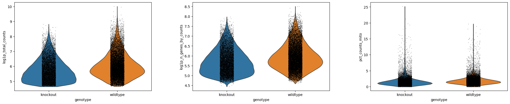
> > 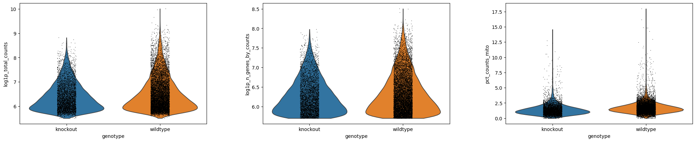
> > 1. The only part that seems to change is the `log1p_n_genes_by_counts`.  You can see a flatter bottom to the violin plot - this is the lower threshold set. Ideally, this would create a beautiful violin plot because there would be a clear population of low-gene number cells. Sadly not the case here, but still a reasonable filter.
> > 2. If you *peek* at the AnnData object in your , you will find that you now have `17,104 cells x 35,734 genes`.
> >
> {: .solution}
>
{: .question}

### UMIs/cell

> <hands-on-title>Filter cells by log1p_total_counts</hands-on-title>
>
> 1.  with the following parameters:
>    -  *"Annotated data matrix"*: `Genes_Filtered_Object`
>    - *"Method used for filtering"*: `Filter on any column of observations or variables`
>        - *"What to filter?"*: `Observations (obs)`
>        - *"Type of filtering?"*: `By key (column) values`
>            - *"Key to filter"*: `log1p_total_counts`
>            - *"Type of value to filter"*: `Number`
>                - *"Filter"*: `greater than`
>                - *"Value"*: `6.3`
>
> 1.  with the following parameters:
>    -  *"Annotated data matrix"*: `anndata_out` (output of **Scanpy filter** )
>    - *"Method used for filtering"*: `Filter on any column of observations or variables`
>        - *"What to filter?"*: `Observations (obs)`
>        - *"Type of filtering?"*: `By key (column) values`
>            - *"Key to filter"*: `log1p_total_counts`
>            - *"Type of value to filter"*: `Number`
>                - *"Filter"*: `less than`
>                - *"Value"*: `20.0`
>
> 2. **Rename**  output as `UMIs_Filtered_Object`
>
> 3.  with the following parameters:
>    -  *"Annotated data matrix"*: `UMIs_Filtered_Object`
>    - *"Method used for plotting"*: `Generic: Violin plot, using 'pl.violin'`
>        - *"Keys for accessing variables"*: `Subset of variables in 'adata.var_names' or fields of '.obs'`
>            - *"Keys for accessing variables"*: `log1p_total_counts,log1p_n_genes_by_counts,pct_counts_mito`
>        - *"The key of the observation grouping to consider"*: `genotype`
>
> 4. **Rename**  output `Violin_log_genotype-UMIs`
>
{: .hands_on}

> <question-title></question-title>
>
> 1. Interpret the violin plot
> 2. How many genes & cells do you have in your object now?
>
> > <solution-title></solution-title>
> >
> > 
> > 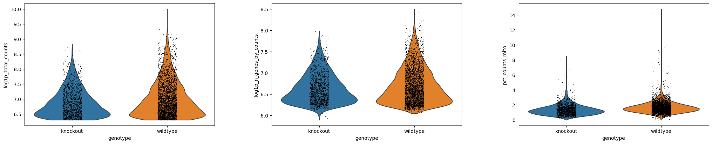
> > 1. We will focus on the `log1p_total_counts` as that shows the biggest change. Similar to above, the bottom of the violin shape has flattered due to the threshold.
> > 2. You now have `8,677 cells x 35,734 genes` in the AnnData object.
> >
> {: .solution}
>
{: .question}

### % Mito/cell

> <hands-on-title>Filter cells by pct_counts_mito</hands-on-title>
>
> 1.  with the following parameters:
>    -  *"Annotated data matrix"*: `UMIs_Filtered_Object`
>    - *"Method used for filtering"*: `Filter on any column of observations or variables`
>        - *"What to filter?"*: `Observations (obs)`
>        - *"Type of filtering?"*: `By key (column) values`
>            - *"Key to filter"*: `pct_counts_mito`
>            - *"Type of value to filter"*: `Number`
>                - *"Filter"*: `less than`
>                - *"Value"*: `4.5`
>
> 2. **Rename**  output as `Mito_Filtered_Object`
>
> 3.  with the following parameters:
>    -  *"Annotated data matrix"*: `Mito_Filtered_Object`
>    - *"Method used for plotting"*: `Generic: Violin plot, using 'pl.violin'`
>        - *"Keys for accessing variables"*: `Subset of variables in 'adata.var_names' or fields of '.obs'`
>            - *"Keys for accessing variables"*: `log1p_total_counts,log1p_n_genes_by_counts,pct_counts_mito`
>        - *"The key of the observation grouping to consider"*: `genotype`
>
> 4. **Rename**  output `Violin_log_genotype-Mito`
>
{: .hands_on}

> <question-title></question-title>
>
> 1. Interpret the violin plot
> 2. How many genes & cells do you have in your object now?
>
> > <solution-title></solution-title>
> >
> > 
> > 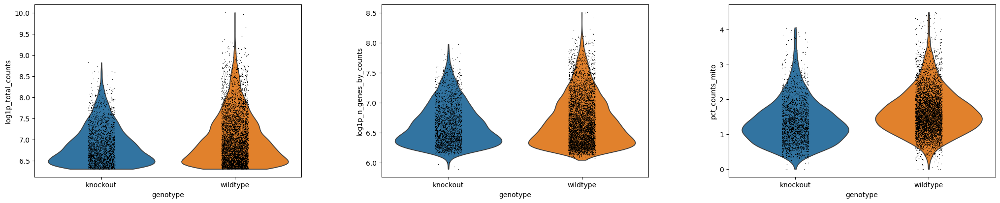
> > 1. If we carefully check the axes, we can see that the `pct_counts_mito` has shrunk.
> > 2. Your object now has `8,604 cells x 35,734 genes`.
> >
> {: .solution}
>
{: .question}

> <details-title>See every step of filtering together</details-title>
> 
> 
> 
> 
>
{: .details}

Fantastic work! However, you've now removed a whole heap of cells, and since the captured genes are sporadic (i.e. a small percentage of the overall transcriptome per cell) this means there are a number of genes in your matrix that are currently not in any of the remaining cells. Genes that do not appear in any cell, or even in only 1 or 2 cells, will make some analytical tools break and overall will not be biologically informative. So let's remove them! Note that `3` is not necessarily the best number, rather it is a fairly conservative threshold. You could go as high as 10 or more.

> <details-title>Working in a group? Decision-time!</details-title>
> If you are working in a group, you can now divide up a decision here with one *control* and the rest varied numbers so that you can compare results throughout the tutorials.
> - Variable: **n_cells**
> - Control > `3`
> - Everyone else: Choose your own thresholds and compare results! Note if you go less than 3 (or even remove this step entirely), future tools are likely to fail due to empty gene data.
{: .details}

### Cells/gene

> <hands-on-title>Filter genes</hands-on-title>
>
> 1.  with the following parameters:
>    -  *"Annotated data matrix"*: `Mito-filtered Object`
>    - *"Method used for filtering"*: `Filter on any column of observations or variables`
>        - *"Type of filtering?"*: `By key (column) values`
>            - *"Key to filter"*: `n_cells_by_counts`
>            - *"Type of value to filter"*: `Number`
>                - *"Filter"*: `greater than`
>                - *"Value"*: `3.0`
>
> 2. **Rename**  output as `Cells_Filtered_Object`
>
{: .hands_on}

In practice, you'll likely choose your thresholds then set up all these filters to run without checking plots in between each one. But it's nice to see how they work!

We can summarise the results of our filtering:

|       | Cells | Genes |
|------ |--------------------|
| Raw | 31670    | 35734    |
| Filter genes/cell | 17104    | 35734    |
| Filter UMIs/cell | 8677    | 35734    |
| Filter mito/cell | 8604   | 35734    |
| Filter cells/gene | 8604    | 15950    |

 Congratulations! You have filtered your object! Now it should be a lot faster to analyse and easier to interpret.

# Processing

So currently, you have a matrix that is 8604 cells by 15950 genes. This is still quite big data. We have two issues here - firstly, you already know there are differences in how many transcripts and genes have been counted per cell. This technical variable can obscure biological differences. Secondly, we like to plot things on x/y plots, so for instance *Gapdh* could be on one axis, and *Actin* can be on another, and you plot cells on that 2-dimensional axis based on how many of each transcript they possess. While that would be fine, adding in a 3rd dimension (or, indeed, in this case, 15950 more dimensions), is a bit trickier! So our next steps are to transform our big data object into something that is easy to analyse and easy to visualise.

> <hands-on-title>Normalisation</hands-on-title>
>
> 1.  with the following parameters:
>    -  *"Annotated data matrix"*: `Cells_Filtered_Object`
>    - *"Method used for normalization"*: `Normalize counts per cell, using 'pp.normalize_total'`
>        - *"Target sum"*: `10000.0`
>        - *"Exclude (very) highly expressed genes for the computation of the normalization factor (size factor) for each cell"*: `No`
>        - *"Name of the field in 'adata.obs' where the normalization factor is stored"*: `norm`
>
> 2.  with the following parameters:
>    -  *"Annotated data matrix"*: `anndata_out` (output of **Scanpy normalize** )
>    - *"Method used for inspecting"*: `Logarithmize the data matrix, using 'pp.log1p'`
>
> 3.  with the following parameters:
>    -  *"Annotated data matrix"*: `anndata_out` (output of **Scanpy Inspect and manipulate** )
>    - *"Function to manipulate the object"*: `Freeze the current state into the 'raw' attribute`
{: .hands_on}

Normalisation helps reduce the differences between gene and UMI counts by fitting total counts to 10,000 per cell. The subsequent log-transform (by log(count+1)) aligns the gene expression level better with a normal distribution. This is fairly standard to prepare for any future dimensionality reduction. Finally, we freeze this information in the 'raw' attribute before we further manipulate the values.

We next need to look at reducing our gene dimensions. We have loads of genes, but not all of them are different from cell to cell. For instance, housekeeping genes are defined as not changing much from cell to cell, so we could remove these from our data to simplify the dataset. We will flag genes that vary across the cells for future analysis.

> <hands-on-title>Find variable genes</hands-on-title>
>
> 1.  with the following parameters:
>    -  *"Annotated data matrix"*: `anndata` (output of **Manipulate AnnData** )
>    - *"Method used for filtering"*: `Annotate (and filter) highly variable genes, using 'pp.highly_variable_genes'`
>        - *"Choose the flavor for identifying highly variable genes"*: `Seurat`
>
{: .hands_on}

> <details-title>More details on the Highly Variable Genes</details-title>
>
> Would you like to know how *many* genes were flagged as **Highly variable genes**?
>
>
> > <hands-on-title>Find the number of variable genes</hands-on-title>
> >
> >
> > 1. Select  **Run Job Again** on the `anndata_out` (output of **Scanpy filter** ) in your  history
> >
> > 2.  with the following parameters:
> >   -  *"Annotated data matrix"*: `anndata` (output of **Manipulate AnnData** )
> >   - *"Method used for filtering"*: `Annotate (and filter) highly variable genes, using 'pp.highly_variable_genes'`
> >       - *"Choose the flavor for identifying highly variable genes"*: `Seurat`
> >       - *"Inplace subset to highly-variable genes?"*:  **Yes**
> >
> {: .hands_on}
>
>
> If you peek at the output, you will see that the number of *genes* in your AnnData object has drastically reduced to around `3216` - this dataset has *only* the highly variable genes! Some people prefer to only perform analysis on this dataset, however I have found that sometimes (for various reasons) important biological marker genes get excluded. For this reason, I personally will flag highly variable genes for use in the next analytical steps, however I keep all the genes in my AnnData object so that I can check for key ones in the future.
>
> -  For this tutorial, you **must** keep all genes in your AnnData object. Therefore, delete the output that contains *only* the highly variable genes from your  history now.
>
>
{: .details}

Next up, we're going to scale our data so that all genes have the same variance and a zero mean. This is important to set up our data for further dimensionality reduction. It also helps negate sequencing depth differences between samples, since the gene levels across the cells become comparable. Note, that the differences from scaling etc. are not the values you have at the end - i.e. if your cell has average GAPDH levels, it will not appear as a '0' when you calculate gene differences between clusters.

> <hands-on-title>Scale data</hands-on-title>
>
> 1.  with the following parameters:
>    -  *"Annotated data matrix"*: `anndata_out` (output of **Scanpy filter** )
>    - *"Method used for inspecting"*: `Scale data to unit variance and zero mean, using 'pp.scale'`
>        - *"Maximum value"*: `10.0`
>
> 3. **Rename**  output `Scaled_Object`
>
{: .hands_on}

 Congratulations! You have processed your object!

> <details-title>More details on batch correction and removing unwanted variation</details-title>
>
> At this point, you might want to remove or regress out the effects of unwanted variation on our data. A common example of this is the cell cycle, which can affect which genes are expressed and how much material is present in our cells. If you’re interested in learning how to do this, then you can move over to the  [Removing the Effects of the Cell Cycle]() tutorial now and return here to complete your analysis.
>
> -  If you are in a *live course*, the time to do this *bonus tutorial* will not be factored into the schedule. Please instead return to this *after* your course is finished, or if you finish early!
>
{: .details}

# Preparing coordinates

We still have too many dimensions. Transcript changes are not usually singular - which is to say, genes were in pathways and in groups. It would be easier to analyse our data if we could more easily group these changes.

## Principal components
Principal components are calculated from highly dimensional data to find the most spread in the dataset. Given that our object has around `3216` highly variable genes, that's 3216 dimensions. There will, however, be one line/axis/dimension that yields the most spread and variation across the cells. That will be our first principal component. We can calculate the first `x` principal components in our data to drastically reduce the number of dimensions.

> <warning-title>Check the size of your AnnData object!</warning-title>
> Your AnnData object should have far more than 3216 genes in it (if you followed our settings and tool versions, you'll have a matrix around 8604 × 15950 (cells x genes). If you followed the *More details on the Highly Variable Genes above, you may have created an object with *only* the highly variable genes. Please delete this object and do not use it! Carry forward the object with around 8604 × 15950 (cells x genes)!
{: .warning}

> <hands-on-title>Calculate Principal Components</hands-on-title>
>
> 1.  with the following parameters:
>    -  *"Annotated data matrix"*: `Scaled_Object`
>    - *"Method used"*: `Computes PCA (principal component analysis) coordinates, loadings and variance decomposition, using 'pp.pca'`
>        - *"Type of PCA?"*: `Full PCA`
>            - *"Change to use different initial states for the optimization"*: `1`
>
> 2. **Rename**  output `PCA_Object`
>
> 3.  with the following parameters:
>    -  *"Annotated data matrix"*: `PCA_Object`
>    - *"Method used for plotting"*: `PCA: Scatter plot in PCA coordinates, using 'pl.pca_variance_ratio'`
>        - *"Number of PCs to show"*: `50`
>
> 3. **Rename**  plot output `PCA_Variance_Plot`
>
{: .hands_on}

Why 50 principal components you ask? Well, we're pretty confident 50 is an over-estimate. Examine `PCA Variance`.

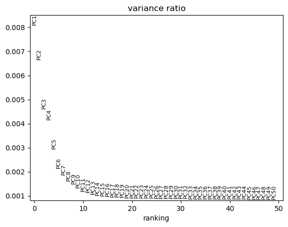

We can see that there is really not much variation explained past component 19. So we might save ourselves a great deal of time and muddied data by focusing on the top `20` PCs. (You could probably even go as low as 10!)

## Neighborhood graph

We're still looking at around 20 dimensions at this point in our analysis. We need to identify how similar a cell is to another cell, across every cell across these dimensions. For this, we will use the k-nearest neighbor (kNN) graph, to identify which cells are close together and which are not. The kNN graph plots connections between cells if their distance (when plotted in this 20 dimensional space!) is amongst the k-th smallest distances from that cell to other cells. This will be crucial for identifying clusters, and is necessary for plotting a UMAP. From [UMAP developers](https://github.com/lmcinnes/umap): "Larger neighbor values will result in more global structure being preserved at the loss of detailed local structure. In general this parameter should often be in the range 5 to 50, with a choice of 10 to 15 being a sensible default".

> <details-title>Working in a group? Decision-time!</details-title>
> If you are working in a group, you can now divide up a decision here with one *control* and the rest varied numbers so that you can compare results throughout the tutorials.
> - Control
>      - **Number of PCs to use** = `20`
>      - **Maximum number of neighbours used** = `15`
> - Everyone else: Use the PC variance plot to pick your own PC number, and choose your own neighbour maximum as well!b
{: .details}

> <hands-on-title>ComputeGraph</hands-on-title>
>
> 1.  with the following parameters:
>    -  *"Annotated data matrix"*: `PCA_Object`
>    - *"Method used for inspecting"*: `Compute a neighborhood graph of observations, using 'pp.neighbors'`
>        - *"Number of PCs to use"*: `20`
>        - *"Use the indicated representation"*: `X_pca`
>        - *"Numpy random seed"*: `1`
>
> 2. **Rename**  output `Neighbours_Object`
>
{: .hands_on}

## Dimensionality reduction for visualisation

Two major visualisations for this data are tSNE and UMAP. We must calculate the coordinates for both prior to visualisation. For tSNE, the parameter [**perplexity**](https://www.nature.com/articles/s41467-019-13056-x) can be changed to best represent the data, while for UMAP the main change would be to change the kNN graph above itself, by changing the **neighbours**.

> <details-title>Working in a group? Decision-time!</details-title>
> If you are working in a group, you can now divide up a decision here with one *control* and the rest varied numbers so that you can compare results throughout the tutorials.
> - Control
>      - **Perplexity** = `30`
> - Everyone else: Choose your own perplexity, between 5 and 50!
{: .details}

> <hands-on-title>Calculating tSNE & UMAP</hands-on-title>
>
> 1.  with the following parameters:
>    -  *"Annotated data matrix"*: `Neighbours_Object`
>    - *"Method used"*: `t-distributed stochastic neighborhood embedding (tSNE), using 'tl.tsne'`
>        - *"Number of PCs to use"*: `20`
>        - *"Use the indicated representation"*: `X_pca`
>        - *"Random state"*: `1`
>
> 2.  with the following parameters:
>    -  *"Annotated data matrix"*: `anndata_out` (output of **Scanpy cluster, embed** )
>    - *"Method used"*: `Embed the neighborhood graph using UMAP, using 'tl.umap'`
>        - *"Seed used by the random number generator"*: `1`
>
> 2. **Rename**  output `UMAP_Object`
>
{: .hands_on}

 Congratulations! You have prepared your object and created neighborhood coordinates. We can now use those to call some clusters!

# Cell clusters & gene markers

> <question-title></question-title>
>
> Let's take a step back here. What is it, exactly, that you are trying to get from your data? What do you want to visualise, and what information do you need from your data to gain insight?
>
> > <solution-title></solution-title>
> >
> > Really we need two things - firstly, we need to make sure our experiment was set up well. This is to say, our biological replicates should overlap and our variables should, ideally, show some difference. Secondly, we want insight - we want to know which cell types are in our data, which genes drive those cell types, and in this case, how they might be affected by our biological variable of growth restriction. How does this affect the developing cells, and what genes drive this? So let's add in information about cell clusters and gene markers!
> >
> {: .solution}
>
{: .question}

Finally, let's identify clusters! Unfortunately, it's not as majestic as biologists often think - the maths doesn't necessarily identify true cell clusters. Every algorithm for identifying cell clusters falls short of a biologist knowing their data, knowing what cells should be there, and proving it in the lab. Sigh. So, we're going to make the best of it as a starting point and see what happens! We will define clusters from the kNN graph, based on how many connections cells have with one another. Roughly, this will depend on a **resolution** parameter for how granular you want to be.

> <details-title>Working in a group? Decision-time!</details-title>
> Oh yes, yet another decision! Single cell analysis is sadly not straight forward.
> - Control
>      - **Resolution, high value for more and smaller clusters** = `0.5`
>      - **Clustering algorithm** = `Louvain`
> - Everyone else: Pick your own number. If it helps, this sample should have a lot of very similar cells in it. It contains developing T-cells, so you aren't expecting massive differences between cells, like you would in, say, an entire embryo, with all sorts of unrelated cell types.
> - Everyone else: Consider the newer **Leiden** clustering method. Note that in future parameters, you will likely need to specify 'leiden' rather than 'louvain', which is the default, if you choose this clustering method.
{: .details}

> <hands-on-title>FindClusters</hands-on-title>
>
> 1.  with the following parameters:
>    -  *"Annotated data matrix"*: `UMAP_Object`
>    - *"Method used"*: `Cluster cells into subgroups, using 'tl.louvain'`
>        - *"Flavor for the clustering"*: `vtraag (much more powerful than igraph)`
>            - *"Resolution"*: `0.5`
>        - *"Random state"*: `1`
>
> 2. **Rename**  output `Clustered_Object`
>
{: .hands_on}

Nearly plotting time! But one final piece is to add in SOME gene information. Let's focus on genes that distinguish the clusters.

## Find Gene Markers

> <hands-on-title>Find Gene markers for each cluster</hands-on-title>
>
> 1.  with the following parameters:
>    -  *"Annotated data matrix"*: `Clustered_Object`
>    - *"Method used for inspecting"*: `Rank genes for characterizing groups, using 'tl.rank_genes_groups'`
>        - *"Get ranked genes as a Tabular file?"*: `True`
>            - *"Column name in [.var] DataFrame that stores gene symbols."*: `Symbol`
>        - *"The key of the observations grouping to consider"*: `louvain`
>        - *"Use 'raw' attribute of input if present"*: `Yes`
>        - *"Comparison"*: `Compare each group to the union of the rest of the group`
>        - *"The number of genes that appear in the returned tables"*: `100`
>        - *"Method"*: `t-test with overestimate of variance of each group`
>
> 2. **Rename**  output table (not h5ad) `Ranked_Genes-by_cluster`
>
> 3. **Rename**   output h5ad file `DEG_Object`
{: .hands_on}

> <details-title>What about comparing across genotypes?</details-title>
>
> Given that we are also interested in differences across genotype, we can also use the find markers function to check that (or any other **Obs** metadata)... roughly.
>
> > <hands-on-title>Comparing across genotypes</hands-on-title>
> >
> > 1.  with the following parameters:  
> >    -  *"Annotated data matrix"*: `Clustered_Object`
> >    - *"Method used for inspecting"*: `Rank genes for characterizing groups, using 'tl.rank_genes_groups'`  
> >       - *"Get ranked genes as a Tabular file?"*: `True`  
> >           - *"Column name in [.var] DataFrame that stores gene symbols."*: `Symbol`  
> >       - *"The key of the observations grouping to consider"*: `genotype`  
> >       - *"Use 'raw' attribute of input if present"*: `Yes`  
> >       - *"Comparison"*: `Compare each group to the union of the rest of the group`  
> >       - *"The number of genes that appear in the returned tables"*: `100`  
> >       - *"Method"*: `t-test with overestimate of variance of each group`  
> >
> > 2. **Rename**  output table (not h5ad) `Ranked_Genes-by_Genotype`
> >
> > Do not **Rename** the output AnnData object (in fact, you can delete it!). You have the genotype marker table to enjoy, but we want to keep the cluster comparisons, rather than gene comparisons, stored in the AnnData object for later.
> >
> {: .hands_on}
>
> However, this analysis only give you a rough idea. It is more statistically accurate to convert each cluster into a *pseudobulk* sample, and analyse those. You can find more details about that in our  [pseudobulk tutorial]()
>
> -  If you are in a *live course*, the time to do this *bonus tutorial* will not be factored into the schedule. Please instead return to this *after* your course is finished, or if you finish early!
>
{: .details}

 Well done! You have cool tables of genes. It's now time for the best bit, the plotting!

# Plotting!

It's time! Let's plot it all!
But first, let's pick some known marker genes that can distinguish different cell types. I'll be honest, in practice, you'd now be spending a lot of time looking up what each gene does (thank you google!). There are burgeoning automated-annotation tools, however, so long as you have a good reference (a well annotated dataset that you'll use as the ideal). In the mean time, let's do this the old-fashioned way, and just copy a bunch of the markers in the original paper.

> <hands-on-title>Plot the cells!</hands-on-title>
>
> 1.  with the following parameters:
>    -  *"Annotated data matrix"*: `DEG_Object`
>    - *"Method used for plotting"*: `Embeddings: Scatter plot in tSNE basis, using 'pl.tsne'`
>        - *"Keys for annotations of observations/cells or variables/genes"*: `louvain,sex,batch,genotype,Il2ra,Cd8b1,Cd8a,Cd4,Itm2a,Aif1,log1p_total_counts`
>        - *"Key for field in '.var' that stores gene symbols"*: `Symbol`
>
> 2.  with the following parameters:
>    -  *"Annotated data atrix"*:  `DEG_Object`
>    - *"Method used for plotting"*: `PCA: Scatter plot in PCA coordinates, using 'pl.pca'`
>        - *"Keys for annotations of observations/cells or variables/genes"*: `louvain,sex,batch,genotype,Il2ra,Cd8b1,Cd8a,Cd4,Itm2a,Aif1,log1p_total_counts`
>        - *"Key for field in '.var' that stores gene symbols"*: `Symbol`
>
> 3.  with the following parameters:
>    -  *"Annotated data matrix"*: `DEG_Object`
>    - *"Method used for plotting"*: `Embeddings: Scatter plot in UMAP basis, using 'pl.umap'`
>        - *"Keys for annotations of observations/cells or variables/genes"*: `louvain,sex,batch,genotype,Il2ra,Cd8b1,Cd8a,Cd4,Itm2a,Aif1,log1p_total_counts`
>        - *"Key for field in '.var' that stores gene symbols"*: `Symbol`
>
{: .hands_on}

 Congratulations! You now have plots galore!

# Insights into the beyond

Now it's the fun bit! We can see where genes are expressed, and start considering and interpreting the biology of it. At this point, it's really about what information you want to get from your data - the following is only the tip of the iceberg. However, a brief exploration is good, because it may help give you ideas going forward with for your own data. Let us start interrogating our data!

> <warning-title>Your results may look different!</warning-title>
> These tools rely on machine learning, which involves randomisation. While we have used the options to 'set random seed' to 1 where we can, it's not perfect at ensuring every analysis is identical.
> - Your results may look different.
> - Your clusters may be in different orders.
>
> You will have to adjust your annotation and interpretation accordingly...which is exactly what scientists have to do!
{: .warning}

## Biological Interpretation

> <question-title>Appearance is everything</question-title>
>
> Which visualisation is the most useful for getting an overview of our data, *pca*, *tsne*, or *umap*?
>
> > <solution-title></solution-title>
> >
> > 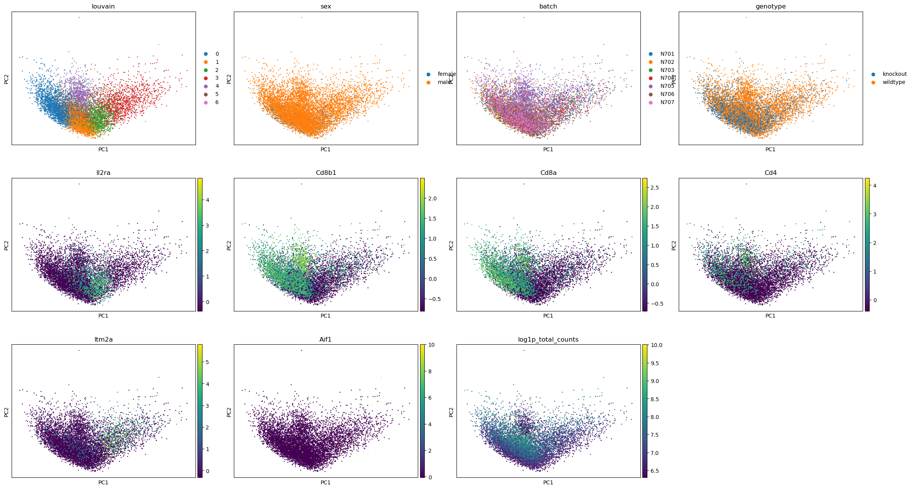
> > 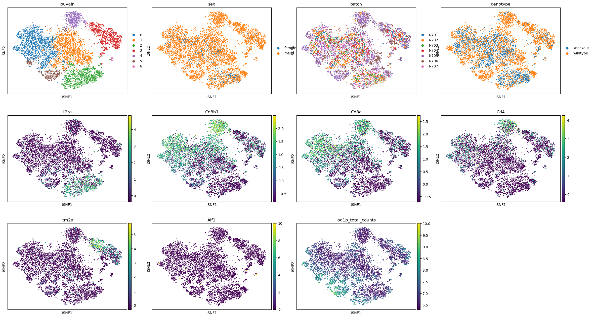
> > 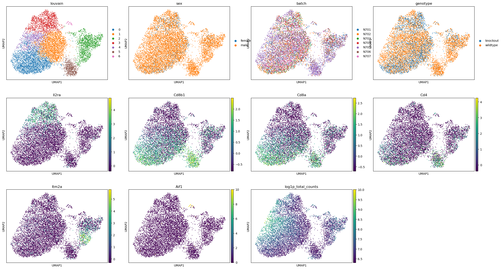
> >
> > You can see why a PCA is generally not enough to see clusters in samples - keep in mind, you're only seeing components 1 and 2! - and therefore why the tSNE and UMAP visualisation dimensionality reductions are so useful. But there is not necessarily a clear winner between tSNE and UMAP, but I think UMAP is slightly clearer with its clusters, so we'll stick with that for the rest of the analysis.
> >
> {: .solution}
>
{: .question}

Note that the cluster numbering is based on size alone - clusters 0 and 1 are not necessarily related, they are just the clusters containing the most cells. It would be nice to know what exactly these cells are. This analysis (googling all of the marker genes, both checking where the ones you know are as well as going through the marker tables you generated!) is a fun task for any individual experiment, so we're going to speed past that and nab the assessment from the original paper!

| Clusters | Marker | Cell type |
|------ |--------------------|
| 3 | Il2ra    | Double negative (early T-cell)    |
| 0,1,4 | Cd8b1, Cd8a, Cd4    | Double positive (middle T-cell)|
| 5 | Cd8b1, Cd8a, Cd4 - high | Double positive (late middle T-cell)
| 2 | Itm2a    | Mature T-cell
| 6 | Aif1    | Macrophages    |


 Remember, **your clusters may be in a different order!** Look for the expression of the marker genes in order to annotate your clusters.

> <question-title></question-title>
>
> Let's consider how you might handle a different output. I personally re-ran the same workflow from this tutorial five times and got two different results. Here's one of the other outputs I got.
> 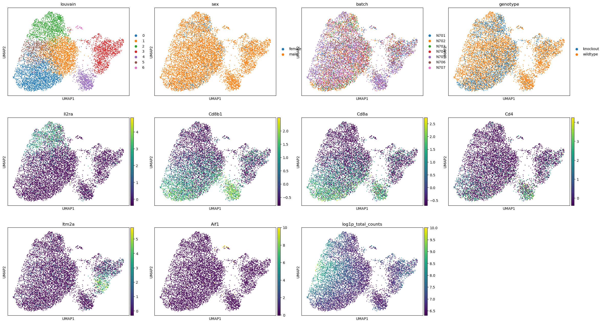
>
> 1. What is different about that plot?
> 2. How would you adjust your annotation?
>
> > <solution-title></solution-title>
> >
> > 1. While the cells are in the same places (which may not always be the case!), the clustering is different. The large Double positive (middle T-cell) cluster has more evenly divided into three clusters, which has therefore changed the ordering of cluster size.
> >
> > 2. The cluster annotation would be different:
> > | Clusters | Marker | Cell type |
> > |----------|------------------------------|----------------------------------|
> > | 2 | Il2ra    | Double negative (early T-cell)    |
> > | 0,1,5 | Cd8b1, Cd8a, Cd4    | Double positive (middle T-cell)|
> > | 4 | Cd8b1, Cd8a, Cd4 - high | Double positive (late middle T-cell)
> > | 3 | Itm2a    | Mature T-cell
> > | 6 | Aif1    | Macrophages    |
> >
> {: .solution}
{: .question}

The authors weren't interested in further annotation of the DP cells, so neither are we. Sometimes that just happens. The maths tries to call similar (ish) sized clusters, whether it is biologically relevant or not. Or, the question being asked doesn't really require such granularity of clusters.

> <details-title>Working in a group? Important!</details-title>
> If you have deviated from any of the original parameters in this tutorial, you will likely have a different number of clusters. You will, therefore, need to change the upcoming 'Annotating clusters' *"Comma-separated list of new categories"* accordingly. Best of luck!
>
{: .details}

### Annotating Clusters

To annotate the clusters, we write a list of new cluster names in order from Cluster 0 onwards. In this case, that list is: `DP-M3,DP-M1,DN,T-mat,DP-L,DP-M2,Macrophages`

> <question-title></question-title>
>
> Imagine you had that second version of an analysis shared above.
> The cluster annotation was different:
> | Clusters | Marker | Cell type |
> |----------|------------------------------|----------------------------------|
> | 3 | Il2ra    | Double negative (early T-cell)    |
> | 0,1,5 | Cd8b1, Cd8a, Cd4    | Double positive (middle T-cell)|
> | 4 | Cd8b1, Cd8a, Cd4 - high | Double positive (late middle T-cell)
> | 3 | Itm2a    | Mature T-cell
> | 6 | Aif1    | Macrophages    |
>
> 1. What would your cluster names list look like?
>
> > <solution-title></solution-title>
> >
> > 1. Given this new order, your list would be: `DP-M3,DP-M1,DN,T-mat,DP-L,DP-M2,Macrophages`
> >
> {: .solution}
{: .question}

Adjust your list according to the expression of the gene markers.

> <hands-on-title>Annotating clusters</hands-on-title>
>
> 1.  with the following parameters:
>    -  *"Annotated data matrix"*: `DEG_Object`
>    - *"Function to manipulate the object"*: `Rename categories of annotation`
>        - *"Key for observations or variables annotation"*: `louvain`
>        - *"Comma-separated list of new categories"*: `DP-M3,DP-M1,T-mat,DN,DP-M2,DP-L,Macrophages`
>        - *"Add categories to a new key?"*: `Yes`
>            - *"Key name"*: `cell_type`
>
> 2. **Rename**  output h5ad `Annotated_Object`
>
> Now, it's time to re-plot with these annotations!
>
> 3.  with the following parameters:
>    -  *"Annotated data matrix"*: `Annotated_Object`
>    - *"Method used for plotting"*: `Embeddings: Scatter plot in UMAP basis, using 'pl.umap'`
>        - *"Keys for annotations of observations/cells or variables/genes"*: `batch,Il2ra,Itm2a,sex,Cd8b1,Cd8a,Cd4,genotype,Aif1,Hba-a1,log1p_total_counts,cell_type`
>        - *"Key for field in '.var' that stores gene symbols"*: `Symbol`
>
> 4. **Rename**  output plot `Annotated_Plots`
>
{: .hands_on}

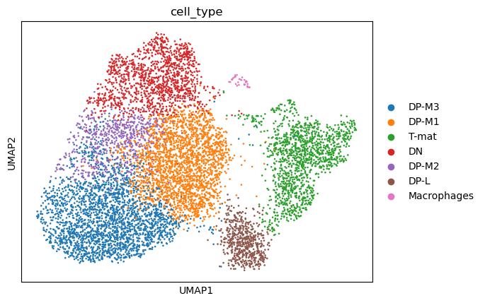

Now that we know what we're dealing with, let's examine the effect of our variable, proper science!

> <question-title>Genotype</question-title>
>
> Are there any differences in genotype? Or in biological terms, is there an impact of growth restriction on T-cell development in the thymus?
>
> 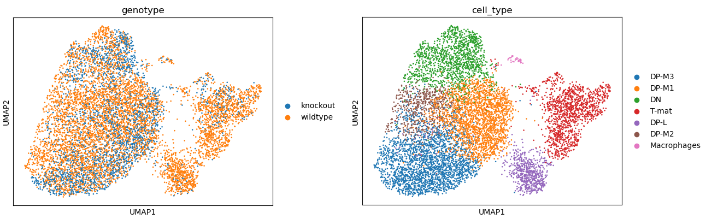
>
> > <solution-title></solution-title>
> >
> > We can see that DP-L, which seems to be extending away from the DP-M bunch, as well as the mature T-cells (or particularly the top half) are missing some knockout cells. Perhaps there is some sort of inhibition here? INTERESTING! What next? We might look further at the transcripts present in both those populations, and perhaps also look at the genotype marker table... So much to investigate! But before we set you off to explore to your heart's delight, let's also look at this a bit more technically.
> >
> {: .solution}
>
{: .question}

## Technical Assessment

Is our analysis real? Is it right? Well, we can assess that a little bit.

> <question-title>Batch effect</question-title>
>
> Is there a batch effect?
>
> 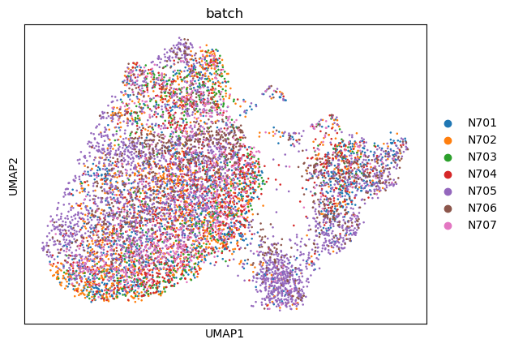
>
> > <solution-title></solution-title>
> >
> > While some shifts are expected and nothing to be concerned about, DP-L looks to be mainly comprised of N705. There might be a bit of batch effect, so you could consider using batch correction on this dataset. However, if we focus our attention on the other cluster - mature T-cells -  where there is batch mixing, we can still assess this biologically even without batch correction.
> > Additionally, we will also look at the confounding effect of sex.
> >
> > 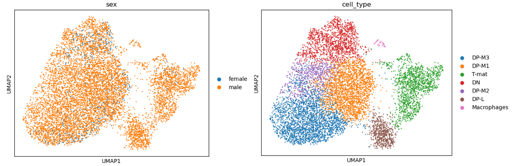
> >
> > We note that the one female sample - unfortunately one of the mere three knockout samples - seems to be distributed in the same areas as the knockout samples at large, so luckily, this doesn't seem to be a confounding factor and we can still learn from our data. Ideally, this experiment would be re-run with either more female samples all around or swapping out this female from the male sample.
> >
> {: .solution}
>
{: .question}

> <question-title>Depth effect</question-title>
>
> Are there any clusters or differences being driven by sequencing depth, a technical and random factor?
>
> 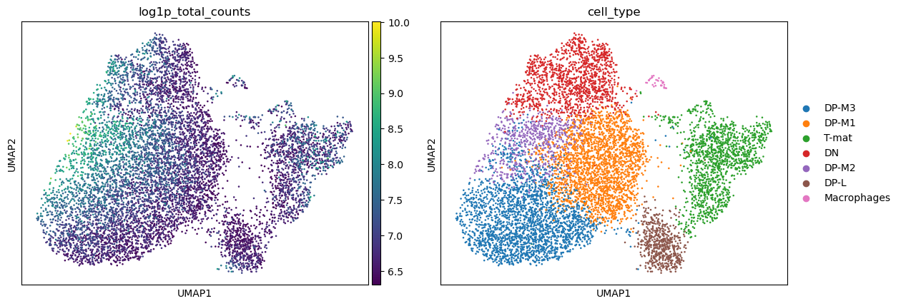
>
> > <solution-title></solution-title>
> >
> > Eureka! This explains the odd DP shift between wildtype and knockout cells - the left side of the DP cells simply have a higher sequencing depth (UMIs/cell) than the ones on the right side. Well, that explains some of the sub-cluster that we're seeing in that splurge. Importantly, we don't see that the DP-L or (mostly) the mature T-cell clusters are similarly affected. So, whilst again, this variable of sequencing depth might be something to regress out somehow, it doesn't seem to be impacting our dataset. The less you can regress/modify your data, in general, the better - you want to stay as true as you can to the raw data, and only use maths to correct your data when you really need to (and not to create insights where there are none!).
> >
> {: .solution}
>
{: .question}

> <question-title>Sample purity</question-title>
>
> Do you think we processed these samples well enough?
>
> 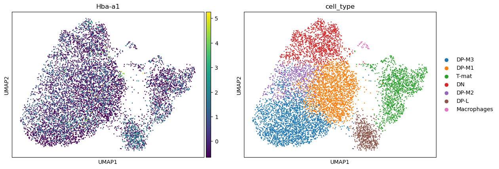
>
> > <solution-title></solution-title>
> >
> > We have seen in the previous images that these clusters are not very tight or distinct, so we could consider stronger filtering. Additionally, hemoglobin - a red blood cell marker that should NOT be found in T-cells - appears throughout the entire sample in low numbers. This suggests some background in the media the cells were in, and we might consider in the wet lab trying to get a purer, happier sample, or in the dry lab, techniques such as SoupX or others to remove this background. Playing with filtering settings (increasing minimum counts/cell, etc.) is often the place to start in these scenarios.
> >
> {: .solution}
>
{: .question}

> <question-title>Clustering resolution</question-title>
>
> Do you think the clustering is appropriate? i.e. are there single clusters that you think should be separate, and multiple clusters that could be combined?
>
> 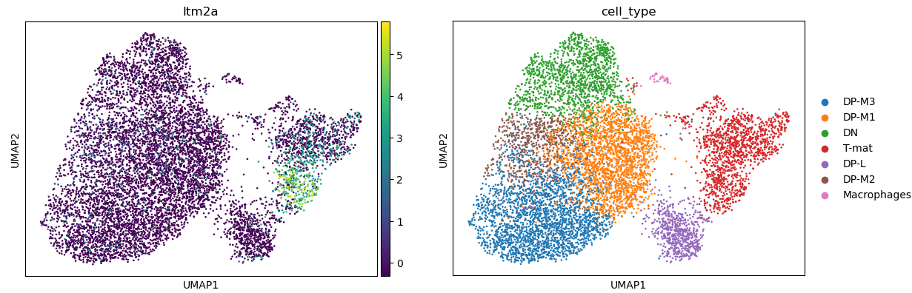
>
> > <solution-title></solution-title>
> >
> > Important to note, lest all bioinformaticians combine forces to attack the biologists: just because a cluster doesn't look like a cluster by eye is NOT enough to say it's not a cluster! But looking at the biology here, we struggled to find marker genes to distinguish the DP population, which we know is also affected by depth of sequencing. That's a reasonable argument that DP-M1, DP-M2, and DP-M3 might not be all that different. Maybe we need more depth of sequencing across all the DP cells, or to compare these explicitly to each other (consider variations on FindMarkers!). However, DP-L is both seemingly leaving the DP cluster and also has fewer knockout cells, so we might go and look at what DP-L is expressing in the marker genes. If we look at T-mat further, we can see that its marker gene - Itm2a - is only expressed in half of the cluster. You might consider sub-clustering this to investigate further, either through changing the resolution or through analysing this cluster alone.
> > If we look at the differences between genotypes alone (so the pseudo-bulk), we can see that most of the genes in that list are actually ribosomal. This might be a housekeeping background, this might be cell cycle related, this might be biological, or all three. You might consider investigating the cycling status of the cells, or even regressing this out (which is what the authors did).
> {: .solution}
>
{: .question}

Ultimately, there are quite a lot ways to analyse the data, both within the confines of this tutorial (the many parameters that could be changed throughout) and outside of it (batch correction, sub-clustering, cell-cycle scoring, inferred trajectories, etc.) Most analyses will still yield the same general output, though: there are fewer knockout cells in the mature T-cell population.

 Congratulations! You have interpreted your plots in several important ways!

# Interactive visualisations

Before we leave you to explore the unknown, you might have noticed that the above interpretations are only a few of the possible options. Plus you might have had fun trying to figure out which sample is which genotype is which sex and flicking back and forth between plots repeatedly. Figuring out which plots will be your *final publishable* plots takes a lot of time and testing. Luckily, there is a helpful interactive viewer  export tool that can help you explore without having to produce new plots over and over!

> <hands-on-title>Cellxgene</hands-on-title>
>
> 1.  with the following parameters:
>    -  *"Concatenate dataset"*: `Annotated_Object`
>    - *"Var field for gene symbols"*: `Symbol`
>    - *"Make specified var field unique"*:  **Yes**
>
> 2. When ready, you will see a message
>    -  *There is an InteractiveTool result view available, click here to display* <---- Click there!
>
> Sometimes this link can aggravate a firewall or something similar. It should be fine to go to the site.
>
> 3. You will be asked to `name your annotation`. Do so, then you can start playing around!
>
> 4. You will need to `STOP` this active environment in Galaxy by going to `User`, `Interactive Tools`, selecting the environment, and selecting `Stop`. You may also want to delete the dataset in the history, because otherwise it continues appearing as if it's processing.
>
{: .hands_on}

Be warned - this visualisation tool is a powerful option for exploring your data, but it takes some time to get used to. Consider exploring it as your own tutorial for another day!


# Conclusion


> <details-title>Working in a group? The finale!</details-title>
> Hopefully, no matter which pathway of analysis you took, you found the same general interpretations. If not, this is a good time to discuss and consider with your group why that might be - what decision was 'wrong' or 'ill-advised', and how would you go about ensuring you correctly interpreted your data in the future? Top tip - trial and error is a good idea, believe it or not, and the more ways you find the same insight, the more confident you can be! But nothing beats experimental validation...
> For those that did not take the 'control' options, please
> 1. **Rename** your history (by clicking on the history title) as `DECISION-Filtering and Plotting Single-cell RNA-seq Data`
> 2. Add a history annotation  that includes which parameters you changed/steps you changed from the *control*
>
>    
>
> 3. Feel free to explore any other similar histories
{: .details}

 Congratulations! You've made it to the end!

You might find the  *Answer Key Histories* helpful to check or compare with:

  - 
      [ {{h.label}} ]( {{h.history}} )
    

You can also run this entire tutorial via a  *Workflow*, after performing the **Get data** step initially.
 - [Tutorial Workflow]()

<iframe title="Galaxy Workflow Embed" style="width: 100%; height: 700px; border: none;" src="https://singlecell.usegalaxy.eu/published/workflow?id=4756053b2596b6cf&embed=true&buttons=true&about=false&heading=false&minimap=true&zoom_controls=true&initialX=0&initialY=-20&zoom=0.33"></iframe>

In this tutorial, you moved from technical processing to biological exploration. By analysing real data - both the exciting and the messy! - you have, hopefully, experienced what it's like to analyse and question a dataset, potentially without clear cut-offs or clear answers. If you were working in a group, you each analysed the data in different ways, and most likely found similar insights. One of the biggest problems in analysing scRNA-seq is the lack of a clearly defined pathway or parameters. You have to make the best call you can as you move through your analysis, and ultimately, when in doubt, try it multiple ways and see what happens!


