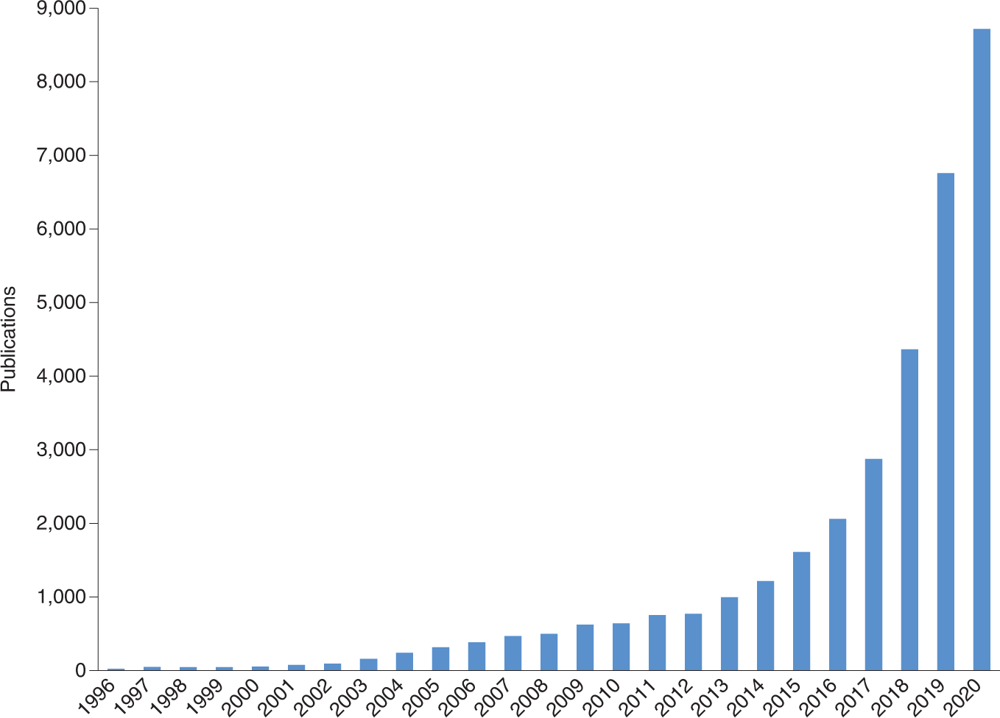

With the significant drop in the cost of many high-throughput technologies, vast amounts of biological data are being generated and made available to researchers. Machine learning (ML) has emerged as a **powerful tool for analyzing data** related to cellular processes, genomics, proteomics, post-translational modifications, metabolism, and drug discovery, offering the potential for transformative medical advancements. 

This trend is evident in the growing number of ML publications:

However, although ML methods should ideally be experimentally validated, this occurs in only a small portion of the studies. 
The time is right for the ML community to **establish standards for reporting ML-based analyses to facilitate critical evaluation and enhance reproducibility** ().

Guidelines or recommendations on the proper construction of machine learning (ML) algorithms can help ensure accurate results and predictions. 
In biomedical research, various communities have established standard guidelines and best practices for managing scientific data () and ensuring the reproducibility of computational tools (, ). 
Similarly, within the ML community, there is a growing need for a unified set of recommendations that address data handling, optimization techniques, model development, and evaluation protocols comprehensively.

A recent commentary () emphasized the need for standards in ML, suggesting that introducing submission checklists () could be a first step toward improving publication practices. 
In response, a **community-driven consensus list of minimal requirements** was proposed, framed as questions for ML implementers (). By adhering to these guidelines, the quality and reliability of reported methods can be more accurately assessed. 

The **focus is on Data, Optimization, Model, and Evaluation (DOME)**, as these four components encompass the **core aspects of most ML implementations**. These recommendations are primarily aimed at supervised learning in biological applications where direct experimental validation is absent, as this is the most commonly used ML approach.

> <comment-title>ML in clinical settings</comment-title>
>
> The use of ML in clinical settings is not addressed, and it remains to be seen whether the DOME recommendations can be applied to other areas of ML, such as unsupervised, semi-supervised, or reinforcement learning.
>
{: .comment}

> <comment-title>Who is behind the DOME recommendations?</comment-title>
>
> The recommendations mentioned above were initially developed by the [ELIXIR Machine Learning Focus Group](https://elixir-europe.org/focus-groups/machine-learning) in response to a  comment advocating for the establishment of standards in ML for biology. 
> This focus group, comprising over 50 experts in the field of ML, held meetings to collaboratively develop and refine the recommendations through broad consensus.
>
{: .comment}

In this tutorial, we will go through the DOME recommendations by addressing a series of key questions that authors should consider when describing supervised machine learning (ML) approaches in their manuscripts. Our goal is to ensure that ML analyses are conducted and reported at a high standard, promoting transparency and reproducibility in research.

To illustrate these recommendations, we will use MobiDB-lite () as an example. MobiDB-lite is a specialized tool designed for the rapid and precise prediction of intrinsically disordered regions within proteins. It operates by integrating multiple disorder prediction methods, which allows it to achieve high specificity and minimize false positives, particularly for long disordered regions. This tool is seamlessly integrated into the broader MobiDB database, enhancing the annotation of protein disorder and supporting large-scale studies in structural bioinformatics.

By following the DOME recommendations and using MobiDB-lite as a case study, we aim to provide clear guidelines on how to effectively report ML methodologies, ensuring that our research is both robust and accessible to the scientific community.

> <agenda-title></agenda-title>
>
> In this tutorial, we will cover:
>
> 1. TOC
> {:toc}
>
{: .agenda}

# Data

ML models analyze experimental biological data by **identifying patterns**, which can then be used to **generate biological insights** from similar, previously unseen data. 
The ability of a model to maintain its performance on new data is referred to as its **generalization power**. 
Achieving strong generalization is a key challenge in developing ML models; without it, trained models cannot be effectively reused. 
Properly preprocessing data and using it in an informed way are essential steps to ensure good generalization.

> <details-title>Further Reading</details-title> 
>
> State-of-the-art **ML models** are often capable of **memorizing** all variations within the **training data**. As a result, when evaluated on data from the training set, they may give the false impression of excelling at the given task. However, their performance tends to diminish when tested on **independent data** (called the **test** or **validation set**), revealing a lower **generalization power**. To address this issue, the original dataset should be randomly split into **non-overlapping parts**. The simplest method involves creating separate **training** and **test sets** (with a possible third **validation set**). Alternatively, more robust techniques like **cross-validation** or **bootstrapping**, which repeatedly create different training/testing splits from the available data, are often preferred.
> 
> Handling overlap between training and test data can be especially challenging in **biology**. For instance, in predicting entire **gene** or **protein sequences**, ensuring **data independence** might require reducing **homologs** in the dataset. In modeling **enhancer–promoter contacts**, a different criterion may be needed, such as ensuring that no endpoint is shared between training and test sets. Similarly, modeling **protein domains** may require splitting **multidomain sequences** into their individual domains before applying **homology reduction**. Each biological field has its own methods for managing overlapping data, making it crucial to consult prior literature when developing an approach.
> 
> Providing details on the **size of the dataset** and the **distribution of data types** helps demonstrate whether the data is well-represented across different sets. Simple **visualizations**, such as **plots** or **tables**, showing the **number of classes** (for classification), a **histogram of binned values** (for regression), and the various types of biological molecules included in the data, are essential for understanding each set. Additionally, for **classification tasks**, methods that account for **imbalanced classes** should be used if the class frequencies suggest a significant imbalance.
> 
> It's also important to note that models trained on one dataset may not perform well on closely related, but distinct, datasets—a phenomenon known as **"covariance shift."** This issue has been observed in several recent studies, such as those predicting **disease risk** from **exome sequencing data**. While covariance shift remains an open problem, potential solutions have been proposed, particularly in the field of **transfer learning**.
>
> Furthermore, building **ML models** that generalize well on **small training datasets** often requires **specialized models and algorithms**. Finally, making **experimental data publicly available** is crucial. **Open access** to datasets, including precise **data splits**, enhances the **reproducibility** of research and improves the overall quality of ML publications. If public repositories are not available, authors should be encouraged to use platforms like **ELIXIR deposition databases** or **Zenodo** to ensure long-term data accessibility.
>
{: .details}

**Be on the lookout for**:
- Inadequate data size & quality
- Inappropriate partitioning, dependence between train and test data
- Class imbalance
- No access to data

**Consequences**:
- Data not representative of domain application
- Unreliable or biased performance evaluation
- Cannot check data credibility

**Recommendation(s)**:
- **Use independent optimization (training) and evaluation (testing) sets**. This is especially important for meta algorithms, where independence of multiple training sets must be shown to be independent of the evaluation (testing) sets
- **Release data, preferably using appropriate long-term repositories, and include exact splits.**
- Offer sufficient evidence of data size & distribution being representative of the domain.

## Provenance

Provenance of data refers to the **origin, history, and lineage of data**—essentially, tracking where the data came from, how it has been processed, and how it has moved through various systems. It’s like a detailed record that traces the data's life cycle from creation to its current state. Understanding data provenance helps ensure **transparency, trustworthiness, and reliability** in data usage.

> <question-title></question-title>
>
> 1. What is the __source__ of the data (database, publication, direct experiment)? 
> 2. If data are in __classes__, how many data points are available in each class—for example, total for the positive (*Npos*) and negative (*Nneg*) cases?
> 3. If __regression__, how many real value points are there? 
> 4. Has the dataset been __previously used__ by other papers and/or is it recognized by the community?
>
> > <solution-title></solution-title>
> > 
> > 1. Protein Data Bank (PDB). X-ray structures missing residues.
> > 2. *Npos* = 339,603 residues.
> > 3. *Nneg* = 6,168,717 residues.
> > 4. Previously used in  as an independent benchmark set.
> {: .solution}
{: .question}

## Dataset Splits

Dataset splits refer to the process of dividing a dataset into distinct subsets for different purposes, mainly in machine learning or data science tasks. The most common splits are:

- **Training Set**: This is the largest subset, used to train the machine learning model. The model "learns" from this data by adjusting its internal parameters to minimize prediction errors.

- **Validation Set**: A separate subset used to fine-tune the model's hyperparameters. The model doesn't learn directly from this data, but it helps monitor the model's performance and avoid overfitting, which is when a model becomes too tailored to the training data and doesn't generalize well.

- **Test Set**: This is the final subset, used to evaluate the model's performance. The test set remains unseen by the model until after training and validation are complete, providing an unbiased estimate of how well the model generalizes to new, unseen data.

In addition to these, there are some variations in dataset splitting strategies:

- **Holdout Split**: A simple division where a fixed percentage of data is reserved for testing (e.g., 80% training, 20% test).

- **Cross-validation**: In this technique, the dataset is split multiple times into training and validation sets, ensuring each data point is used for validation at least once (e.g., 5-fold cross-validation). This provides a more robust evaluation of the model’s performance.

> <question-title></question-title>
>
> 1. How __many data points__ are in the training and test sets?  
> 2. Was a __separate validation__ set used, and if yes, how large was it?  
> 3. Are the __distributions__ of data types (*Npos* and *Nneg*) in the training and test sets different? Are the distributions of data types in both training and test sets plotted?
>
> > <solution-title></solution-title>
> >**From Example Publication**  
> > 1. Training set: N/A. *Npos,test* = 339,603 residues. *Nneg,test* = 6,168,717 residues
> > 2. No validation set.
> > 3. 5.22% positives on the test set.
> {: .solution}
{: .question}   

## Redundancy between data splits

Redundancy between data splits occurs when the **same data points are present in more than one** of the training, validation, or test sets. This is **undesirable** because it can distort model evaluation and lead to **overoptimistic performance metrics** (e.g. eliminating data points more similar than X%). 
This may impact the model by introducing the risk of overfitting and poor generalization rendering the performance metrics as unreliable.

> <question-title></question-title>
>
> 1. How were the sets __split__? 
> 2. Are the training and test sets __independent__? 
> 3. How was this __enforced__ (for example, redundancy reduction to less than X% pairwise identity)?
> 4. How does the distribution compare to __previously published__ ML datasets?
>
> > <solution-title></solution-title>
> >
> > Not applicable.  
> {: .solution}
{: .question}

## Availability of data

Availability of data refers to the **accessibility** and **readiness** of data for use in various applications, such as analysis, machine learning, decision-making, or reporting. It ensures that data can be retrieved and utilized when needed by users or systems.

> <question-title></question-title>
>
> 1. re the data, including the data splits used, __released__ in a public forum? 
> 2. If yes, __where__ (for example, supporting material, URL) and __how__ (license)?
> 
> > <solution-title></solution-title>
> >
> > 1. Yes
> > 2. URL http://protein.bio.unipd.it/mobidblite/. Free use license.
> {: .solution}
{: .question}
 

# Optimization

Optimization, or model training, refers to the **process of adjusting the values** that make up the model (including both parameters and hyperparameters) to **enhance the model's performance** in solving a given problem. In this section, we will focus on challenges that arise from selecting suboptimal optimization strategies.

**Be on the lookout for**:
- Overfitting, underfitting, and illegal parameter tuning
- Imprecise parameters and protocols given

**Consequences**:
- Reported performance is too optimistic or too pessimistic
- The model models noise or misses relevant relationships
- Results are not reproducible

**Recommendation(s)**:
- **Clarify that evaluation sets were not used for feature selection.**
- **Report indicators on training and testing data that can aid in assessing the possibility of under- or overfitting for example, train vs. test error.**
- **Release definitions of all algorithmic hyperparameters, regularization protocols, parameters and optimization protocol.**
- For neural networks, release definitions of training and learning curves
- Include explicit model validation techniques like *N*-fold cross-validation.

> <details-title>Further Reading</details-title>
>
> **Optimization**, or **training**, involves adjusting the values that define a model (such as **parameters** and **hyperparameters**), as well as **preprocessing steps**, to enhance the model’s ability to solve a given problem. Choosing an inappropriate **optimization strategy** can lead to issues like **overfitting** or **underfitting**. **Overfitting** occurs when a model performs exceptionally well on **training data** but fails on **unseen data**, making it ineffective in real-world scenarios. **Underfitting**, on the other hand, happens when overly simplistic models, capable of capturing only basic relationships between features, are applied to more complex data.
> 
> **Feature selection** algorithms can help reduce the risk of overfitting, but they come with their own set of guidelines. A key recommendation is to avoid using **non-training data** for **feature selection** and **preprocessing**. This is especially problematic for **meta-predictors**, as it can lead to an overestimation of the model’s performance. Finally, making files that detail the exact **optimization protocol**, including **parameters** and **hyperparameters**, publicly available is crucial. A lack of proper **documentation** and limited access to these records can hinder the understanding and evaluation of the model’s overall performance.
>
{: .details}	

## Algorithm

Since algorithms take input data and produce output, typically solving a particular problem or achieving a specific objective, it is essential to know which one is implemented in a study. In this way we can have better insights for the results of learning patterns, relationships, or rules that can then be applied to new, unseen data.

There are three major categories of ML classes:

- **Supervised** (i.e. Linear Regression, Logistic Regression, Decision Trees, Support Vector Machines (SVM) and others), 
- **Unsupervised Learning** (i.e. K-Means Clustering, Principal Component Analysis (PCA) and Hierarchical Clustering and others),  
- **Reinforcement Learning** (i.e. Q-Learning, Deep Q-Networks (DQN) and others). 

> <question-title></question-title>
> 
> 1. __What__ is the ML algorithm class used? 
> 2. Is the ML algorithm __new__?
> 3. If yes, why was it __chosen__ over better known alternatives?
>
> > <solution-title></solution-title>
> > 1. Majority-based consensus classification based on 8 primary ML methods and post-processing.
> > 2. 
> {: .solution}
{: .question}

## Meta-predictions

Meta-predictions refer to **predictions made by models that aggregate or utilize the outputs (predictions) of other models**. Essentially, meta-prediction systems combine predictions from multiple models to produce a more robust or accurate final prediction. Meta-predictions are often used in ensemble learning techniques, where the goal is to leverage the strengths of several models to enhance overall performance.

> <question-title></question-title>
>
> 1. Does the model use data from __other__ ML algorithms as input? 
> 2. If yes, which ones?
> 3. Is it clear that training data of initial predictors and meta-predictor are __independent__ of test data for the meta-predictor?
>
> > <solution-title></solution-title>
> >**From Example Publication**  
> > 1. Yes
> > 2. Predictor output is a binary prediction computed from the consensus of other methods
> > 3. Independence of training sets of other methods with test set of meta-predictor was not tested since datasets from other methods were not available.
> {: .solution}
{: .question}

## Data encoding

Data encoding is the process of **transforming data from one format or structure into another**, often to make it easier for ML models or computational systems to process. 
In ML, data often needs to be encoded to ensure that it can be effectively interpreted by algorithms, especially for algorithms that require numerical input (e.g., neural networks, SVMs).

> <question-title></question-title>
> How were the data __encoded__ and __preprocessed__ for the ML algorithm?
>
> > <solution-title></solution-title>
> > Label-wise average of 8 binary predictions.
> >
> {: .solution}
{: .question}

## Parameters

Model parameters are the **internal configurations or variables** that a model learns from the training data. 
These parameters **determine how the model makes predictions and how well** it fits the training data. 
The values of these parameters are adjusted during the training process through algorithms like gradient descent or optimization procedures. 

> <question-title></question-title>
>
> 1. How many __parameters__ ($$p$$) are used in the model? 
> 2. How were $$p$$ selected?
>
> > <solution-title></solution-title>
> >**From Example Publication**  
> > 1. $$p = 3 $$: Consensus score threshold, expansion-erosion window, length threshold
> > 2. No optimization.
> {: .solution}
{: .question}

## Features

In the context of ML, features refer to the **individual measurable properties or characteristics** of the data being used for training a model. 
They play a crucial role in determining the performance of ML models, as they provide the information that the model needs to make predictions or classifications.
Feature Engineering is the process of creating, modifying, or selecting the most relevant features from the raw data to improve model performance by reducing model complexity, improving training time and avoiding overfitting. 

> <question-title></question-title>
>
> 1. How many __features__ (*f*) are used as input? 
> 2. Was __feature selection__ performed? 
> 3. If yes, was it performed using the __training set only__?
>
> > <solution-title></solution-title>
> >
> > Not applicable.
> {: .solution}
{: .question}

## Fitting

Fitting refers to the process of **training a ML model on a dataset by adjusting its parameters to minimize prediction error**. 
The goal is to find a **balance between underfitting and overfitting**, ensuring that the model captures the underlying patterns in the data while still generalizing well to unseen data. 
Proper evaluation, regularization, and tuning of the model during the fitting process are crucial to achieving a good fit.

> <question-title></question-title>
>
> 1. Is *p* much larger than the number of training points and/or is *f* large (for example, in classification is *p >> (Npos + Nneg)* and/or *f > 100*)? 
> 2. If yes, how was __overfitting__ ruled out? 
> 3. Conversely, if the number of training points is much larger than *p* and/or *f* is small (for example, *(Npos + Nneg) >> p*  and/or *f < 5*), how was __underfitting__ ruled out?
>
> > <solution-title></solution-title>
> > 1. Single input ML methods are used with default parameters. 
> > 2. Optimization is a simple majority.
> {: .solution}
{: .question}

## Regularization

Regularization is a **technique used to prevent overfitting** by adding a penalty to the loss function, which discourages the model from becoming too complex. Common regularization techniques include:

- **L1 Regularization (Lasso)**: Adds a penalty proportional to the absolute value of the coefficients. It encourages sparsity, setting some coefficients to zero.
- **L2 Regularization (Ridge)**: Adds a penalty proportional to the square of the coefficients, discouraging large coefficients and thus reducing model complexity.
- **Dropout (in neural networks)**: Randomly drops a percentage of neurons during training, which helps prevent overfitting by forcing the network to generalize.

> <question-title></question-title>
>
> 1. Were any __overfitting prevention techniques__ used (for example, early stopping using a validation set)?
> 2. If yes, __which__ ones?
>
> > <solution-title></solution-title>
> > 1. No. 
> {: .solution}
{: .question}

## Availability of configuration

Availability of configuration refers to the **accessibility and transparency of the settings, parameters, and options** that can be adjusted or customized in a ML model or system. 
These configurations control how the model is trained, how it makes predictions, and how it operates in different environments. 
Ensuring that the configuration is available, flexible, and easy to modify is important for reproducibility, fine-tuning, and deployment of models.

> <question-title></question-title>
>
> 1. Are the hyperparameter configurations, optimization schedule, model files and optimization parameters __reported__?  
> 2. If yes, __where__ (for example, URL) and __how__ (license)?
>
> > <solution-title></solution-title>
> > 1. Not applicable.
> {: .solution}
{: .question}
   

# Model

Good overall performance and the model's ability to generalize well to unseen data are crucial factors that significantly impact the applicability of any proposed ML research. However, several other important aspects related to ML models must also be considered.

**Be on the lookout for**:
- Unclear if black box or interpretable model
- No access to resulting source code, trained models & data
- Execution time impractical

**Consequences**:
- An interpretable model shows no explainable behavior
- Cannot cross compare methods & reproducibility, or check data credibility
- Model takes too much time to produce results

**Recommendation(s)**:
- **Describe the choice of black box or interpretable model. If interpretable, show examples of interpretable output.**
- Release documented source code + models + software containers
- Report execution time averaged across repeats. If computationally tough, compare to similar methods.

> <details-title>Further Reading</details-title> 
> Equally important aspects of **ML models** include their **interpretability** and **reproducibility**. **Interpretable models** can identify **causal relationships** in the data and provide logical explanations for their **predictions**, which is especially valuable in fields like **drug design** and **diagnostics**. In contrast, **black box models**, while often accurate, may not offer understandable insights into the reasons behind their predictions. Both types of models are discussed in more detail elsewhere, and choosing between them involves weighing their respective benefits. The key recommendation is to clearly state whether the model is a **black box** or **interpretable**, and if it is interpretable, to provide clear examples of its **outputs**.
> 
> **Reproducibility** is crucial for ensuring that research outcomes can be effectively utilized and validated by the broader community. Challenges with model reproducibility go beyond merely documenting **parameters**, **hyperparameters**, and **optimization protocols**. Limited access to essential model components (such as **source code**, **model files**, **parameter configurations**, and **executables**) and high **computational demands** for running trained models on new data can severely restrict or even prevent reproducibility.
{: .details}	

## Interpretability

Model interpretability refers to the **extent to which a human can understand the decisions and predictions made by a ML model**. 
Interpretability is crucial for building trust in model outcomes, especially in high-stakes domains such as healthcare and finance, where understanding the rationale behind a model's predictions can have significant implications.
For example neural networks are often criticized for being "black boxes," as their internal workings (like hidden layers) are less transparent, making them more difficult to trust.

There are generally two types of interpretability:

- **Global Interpretability** refers to the ability to understand the overall behavior of the model across all predictions. It involves explaining how the model works as a whole and what features are important in determining predictions. 

- **Local interpretability** focuses on understanding individual predictions made by the model. It aims to explain why a specific input led to a particular output.

> <question-title></question-title>
>
> 1. Is the model __black box__ or __interpretable__? 
> 2. If the model is interpretable, can you give clear __examples__ of this?
>
> > <solution-title></solution-title>
> >**From Example Publication**  
> > 1. Transparent, in so far as meta-prediction is concerned.
> > 2. Consensus and post processing over other methods predictions (which are mostly black boxes). No attempt was made to make the meta-prediction a black box.
> {: .solution}
{: .question}

## Output

The output of a machine learning model refers to the **predictions or classifications made by the model** after processing input data. 
Depending on the type of model and the nature of the problem, the output can vary widely. 

Here's a breakdown of some different types of outputs: 

-  __Regression__ includes continuous values that estimates a quantity based on the input features   
- In __classification__ tasks the output is a category or class label that indicates which class the input belongs to.   
- In __multi-class classification__ the model predicts one class from multiple possible classes.   
- __Multi-label classification__ includes the assignment of multiple classes to a single input.

> <question-title></question-title>
>
> Is the model __classification__ or __regression__?
>
> > <solution-title></solution-title>
> > Classification, i.e. residues thought to be disordered.
> {: .solution}
{: .question}

## Execution time

Execution time in the context of ML refers to the **duration it takes for a model to perform a specific task**, such as training, predicting, or evaluating performance. 
Understanding and measuring execution time is crucial for various reasons, including optimizing model performance, resource management, and user experience.

CPU time of single representative execution on standard hardware (e.g. seconds on desktop PC).

> <question-title></question-title>
>
> How much __time__ does a single representative prediction require on a standard machine (for example, seconds on a desktop PC or high-performance computing cluster)?
>
> > <solution-title></solution-title>
> > Approximately 1 second per representative on a desktop PC.
> {: .solution}
{: .question}

## Availability of software

Availability of software refers to the **accessibility, reliability, and usability of various software tools and libraries that facilitate the development, training, deployment, and evaluation of ML models**. 
This includes both open-source and proprietary software, and it is critical for researchers and practitioners to have the right tools at their disposal to effectively work on tasks.

> <question-title></question-title>
>
> 1. Is the __source code__ released?
> 2. Is a __method to run__ the algorithm (executable, web server, virtual machine or container instance) released? 
> 3. If yes, __where__ (for example github, zenodo or other repository URL) and __how__ (for example MIT license)?
>
> > <solution-title></solution-title>
> > 
> > 1. Yes
> > 2. Yes
> > 3. URL: http://protein.bio.unipd.it/mobidblite/. Bespoke license free for academic use
> {: .solution}
{: .question}  
   

# Evaluation
 
In implementing a robust and trustworthy ML method, providing a comprehensive data description, adhering to a correct optimization protocol, and ensuring that the model is clearly defined and openly accessible are critical first steps. Equally important is employing a valid assessment methodology to evaluate the final model.
  

**Be on the lookout for**:
- Performance measures inadequate 
- No comparisons to baselines or other methods
- Highly variable performance

**Consequences**:

- Biased performance measures reported
- The method is falsely claimed as state-of-the-art
- Unpredictable performance in production

**Recommendation(s)**:

- **Compare with public methods & simple models (baselines).** 
- **Adopt community-validated measures and benchmark datasets for evaluation.** 
- Compare related methods and alternatives on the same dataset 
- Evaluate performance on a final independent held-out set 
- **Use confidence intervals/error intervals and statistical tests to gauge robustness.**

> <details-title>Further Reading</details-title>
> In biological research, there are two main types of evaluation scenarios for **ML models**:
> 
> 1. **Experimental Validation**: This involves validating the **predictions** made by the ML model through laboratory experiments. Although highly desirable, this approach is often beyond the scope of many ML studies.
> 
> 2. **Computational Assessment**: This involves evaluating the model's **performance** using established **metrics**. This section focuses on computational assessment and highlights a few potential risks.
>
> When it comes to **performance metrics**, which are quantifiable indicators of a model's ability to address a specific task, there are numerous metrics available for various ML **classification** and **regression** problems. The wide range of options, along with the **domain-specific knowledge** needed to choose the right metrics, can result in the selection of inappropriate performance measures. It is advisable to use metrics recommended by critical assessment communities relevant to biological ML models, such as the **Critical Assessment of Protein Function Annotation (CAFA)** and the **Critical Assessment of Genome Interpretation (CAGI)**. Once appropriate performance metrics are selected, methods published in the same biological domain should be compared using suitable **statistical tests** (e.g., **Student's t-test**) and **confidence intervals**. Additionally, to avoid releasing ML methods that seem advanced but do not outperform simpler algorithms, it is important to compare these methods against **baseline models** and demonstrate their **statistical superiority** (e.g., comparing **shallow versus deep neural networks**).
> 
{: .details}	

## Evaluation method
 
Evaluation of a ML model is the process of assessing its **performance and effectiveness** in making predictions or classifications based on new, unseen data. 
Proper evaluation is crucial to ensure that the model generalizes well and performs as expected in real-world applications.
  
> <question-title></question-title>
>
>  How was the method __evaluated__ (for example cross-validation, independent dataset, novel experiments)?
>
> > <solution-title></solution-title>
> > Independent dataset
> {: .solution}
{: .question}

## Performance measures

The choice of evaluation metrics depends on the type of problem (regression or classification) and the specific goals of the analysis:

| Regression Metrics   | Classification Metrics	|
|-------|---------|
| Mean Absolute Error (MAE)  | Accuracy|
| Mean Squared Error (MSE)|  Precision |
| Root Mean Squared Error (RMSE)| Recall (Sensitivity)  |
| R-squared (R2) |  F1 Score |

> <question-title></question-title>
>
> 1. Which __performance metrics__ are reported (Accuracy, sensitivity, specificity, etc.)? 
> 2. Is this set __representative__ (for example, compared to the literature)?
>
> > <solution-title></solution-title>
> > 1. Balanced Accuracy, Precision, Sensitivity, Specificity, F1, MCC.
> {: .solution}
{: .question}

## Comparison

Comparison typically refers to the **evaluation of different** models, algorithms, or configurations to **identify which one performs best** for a specific task. 
This process is essential for selecting the most suitable approach for a given problem, optimizing performance, and understanding the strengths and weaknesses of various methods. 
  
> <question-title></question-title>
>
> 1. Was a comparison to __publicly available__ methods performed on benchmark datasets? 
> 2. Was a comparison to __simpler baselines__ performed?
> 
> > <solution-title></solution-title>
> > 1. DisEmbl-465, DisEmbl-HL, ESpritz Disprot, ESpritz NMR, ESpritz Xray, Globplot, IUPred long, IUPred short, VSL2b. Chosen methods are the methods from which the meta prediction is obtained.
> {: .solution}
{: .question}

## Confidence
 
Confidence in the context of ML refers to the **measure of certainty or belief** that a model's prediction is **accurate**. 
It quantifies the model's certainty regarding its output, which is particularly important in classification tasks, where decisions need to be made based on predicted class probabilities.
This can be supported by methods such as confidence intervals and statistical significance.
  
> <question-title> Key Questions </question-title>
>
> 1. Do the performance metrics have __confidence intervals__? 
> 2. Are the results __statistically significant__ to claim that the method is superior to others and baselines?
>
> > <solution-title></solution-title>
> >
> > Not calculated.
> {: .solution}
{: .question}

## Availability of evaluation

Availability of evaluation in ML refers to the **accessibility and readiness of tools, frameworks, datasets, and methodologies used to assess the performance of ML models**. 
This encompasses various aspects, from the datasets used for evaluation to the metrics and software tools that facilitate the evaluation process. 
  
> <question-title> Key Questions </question-title>
>
> 1. Are the __raw evaluation files__ (for example, assignments for comparison and baselines, statistical code, confusion matrices) available? 
> 2. If yes, __where__ (for example, URL) and __how__ (license)?
>
> > <solution-title></solution-title>
> > 1. Not.
> {: .solution}
{: .question}

# Evaluate your model or publication
 
Time to practice on your work or a publication of your choice!
  
> <hands-on-title> Key Questions </hands-on-title>
>
> 1. Select a publication
> 1. Read the publication you have chosen.
> 2. Locate/highlight the areas of interest according to the DOME sections. (how many are covered? which are missing?)
> 3. Fill in this (*some kind of ready table template to be given*) with the information.
> 4. Discuss your results with the rest of the group. (do you see any common trends?)
> 5. Grab a beverage ☕ or a snack 🍩 to celebrate!
{: .hands-on}

# Conclusion

In this tutorial, we have explored the essential regulations and standards for AI using the DOME framework, focusing on key aspects of data management, optimization, model development, and evaluation. By adhering to these guidelines, researchers can ensure that their AI models are robust, transparent, and reproducible, thereby enhancing the credibility and impact of their work.

**Data**: We emphasized the importance of data **provenance**, ensuring that the origins and transformations of datasets are well-documented. Proper **dataset splits** and managing **redundancy** between these splits are crucial for maintaining the integrity of training and testing processes. Additionally, making data **available** to the scientific community fosters collaboration and reproducibility.

**Optimization**: We delved into the intricacies of **algorithm** selection and the challenges associated with **meta-predictions**. Proper **data encoding**, careful selection of **parameters**, and thoughtful **feature** engineering are essential for effective model training. **Fitting** the model while employing appropriate **regularization** techniques helps prevent overfitting and ensures generalization. Ensuring the **availability of configuration** details is vital for transparency and reproducibility.

**Model**: The tutorial highlighted the significance of **interpretability** in AI models, allowing for clearer insights into model decisions. Providing meaningful **output** and documenting **execution time** are important for practical applications. Ensuring the **availability of software** enables others to build upon and validate the model.

**Evaluation**: We discussed the importance of choosing appropriate **evaluation methods** and **performance measures** to accurately assess model effectiveness. **Comparison** with baseline models and ensuring **confidence** in the results through statistical methods are critical steps. Making the **evaluation** process and results available supports transparency and facilitates further advancements in the field.

By following these DOME recommendations, we can develop AI models that are not only technically sound but also ethically robust and scientifically rigorous. This framework encourages a culture of openness and collaboration, ultimately advancing the field of AI and its applications in various domains. As you implement these standards in your model or publication, you contribute to a more reliable and trustworthy AI ecosystem.
  
