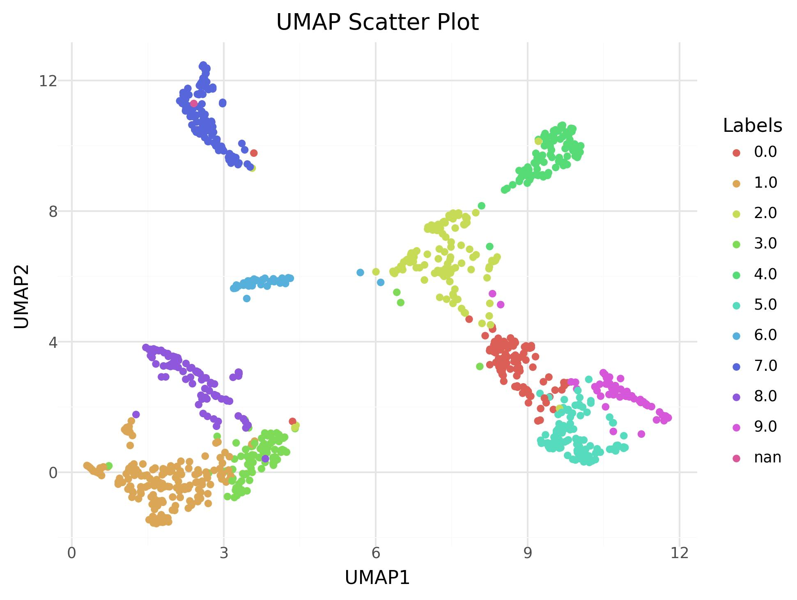
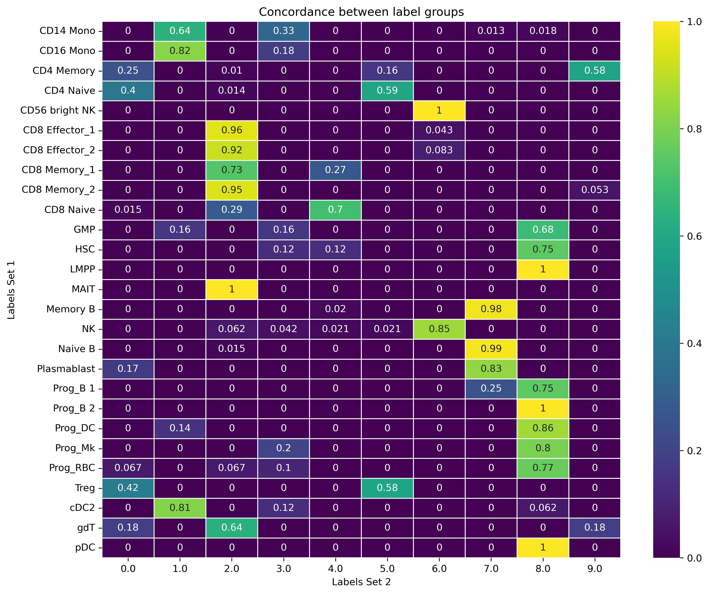

Traditional dimensionality reduction techniques, while useful, often fail to capture the complex non-linear relationships present in high-dimensional data. Deep learning approaches, particularly Variational Autoencoders (VAEs), have emerged as powerful tools for unsupervised analysis of single-cell transcriptomic data (). VAEs combine the representational power of neural networks with probabilistic modeling, enabling them to learn meaningful latent representations while accounting for the inherent uncertainty in biological data.
The key advantage of VAEs lies in their ability to encode high-dimensional gene expression profiles into a lower-dimensional latent space that preserves the most informative biological variation. This latent representation can then be used for various downstream analyses, including clustering, trajectory inference, and data integration.

Flexynesis represents a state-of-the-art deep learning framework specifically designed for multi-modal data integration in biological research (). What sets Flexynesis apart is its comprehensive suite of deep learning architectures, including supervised and unsupervised VAEs, that can handle various data integration scenarios while providing robust feature selection and hyperparameter optimization.

When an outcome variable is not available, or it is desired to do an unsupervised training, the `supervised_vae` model in flexynesis can be utilized. The supervised variational autoencoder class can be trained on the input dataset without a supervisor head. If the user passes no target variables, batch variables, or survival variables, then the class behaves as a plain variational autoencoder.

This training is inspired from the original flexynesis analysis notebook: [unsupervised_analysis_single_cell.ipynb](https://github.com/BIMSBbioinfo/flexynesis/blob/main/examples/tutorials/unsupervised_analysis_single_cell.ipynb).

Here, we demonstrate the capabilities of flexynesis on a Single-cell CITE-Seq dataset of Bone Marrow samples (). The dataset was downloaded and processed using Seurat (v5.1.0) (). 5000 cells were randomly sampled for training and 5000 cells were sampled for testing.

> <warning-title>LICENSE</warning-title>
>
>Flexynesis is only available for NON-COMMERCIAL use. Permission is only granted for academic, research, and educational purposes. Before using, be sure to review, agree, and comply with the license.
>For commercial use, please review the flexynesis license on GitHub and contact the [copyright holders](https://github.com/BIMSBbioinfo/flexynesis)
{: .warning}

<!-- This is a comment. -->

> <agenda-title></agenda-title>
>
> In this tutorial, we will cover:
>
> 1. TOC
> {:toc}
>
{: .agenda}

# Data upload

In the first part of this tutorial we will upload processed CITE-seq data from bone marrow tissue.

All data are in tabular format and they include:

* ADT (Antibody-Derived Tags which indicates the quantification of cell surface proteins) data
* RNA expression data
* Clinical data includes some information about each cell like number of RNAs, genes, ... (In next steps we will use the clustering information "**celltype_l2**")

## Get data

> <hands-on-title> Data Upload </hands-on-title>
>
> 1. Create a new history for this tutorial
>
>    
>
> 2. Import the files from [Zenodo]({{ page.zenodo_link }}):
>
>    ```text
>    {{ page.zenodo_link }}/files/test-ADT_BMscRNAseq.tabular
>    {{ page.zenodo_link }}/files/test-clin_BMscRNAseq.tabular
>    {{ page.zenodo_link }}/files/test-RNA_BMscRNAseq.tabular
>    {{ page.zenodo_link }}/files/train-ADT_BMscRNAseq.tabular
>    {{ page.zenodo_link }}/files/train-clin_BMscRNAseq.tabular
>    {{ page.zenodo_link }}/files/train-RNA_BMscRNAseq.tabular
>    ```
>
>    
>
> 3. Rename the datasets
> 4. Check that the datatype is `tabular`
>
>    
>
> 5. Add to each dataset a representative tag (RNA, ADT, clin)
>
>    
>
{: .hands_on}

# Unsupervised Training of Flexynesis

> <hands-on-title> Train unsupervised model </hands-on-title>
>
> 1.  with the following parameters:
>    - *"I certify that I am not using this tool for commercial purposes."*: `Yes`
>    - *"Type of Analysis"*: `Unsupervised Training`
>        -  *"Training clinical data"*: `train-clin_BMscRNAseq.tabular`
>        -  *"Test clinical data"*: `test-clin_BMscRNAseq.tabular`
>        -  *"Training omics data"*: `train-RNA_BMscRNAseq.tabular`
>        -  *"Test omics data"*: `test-RNA_BMscRNAseq.tabular`
>        - *"What type of assay is your input?"*: `RNA`
>        - In *"Multiple omics layers?"*:
>            -  *"Insert Multiple omics layers?"*
>                -  *"Training omics data"*: `train-ADT_BMscRNAseq.tabular`
>                -  *"Test omics data"*: `test-ADT_BMscRNAseq.tabular`
>                - *"What type of assay is your input?"*: `ADT`
>        - In *"Advanced Options"*:
>            - *"How many epochs to wait when no improvements in validation loss are observed."*: `5`
>            - *"Number of iterations for hyperparameter optimization."*: `1`
>
>    > <comment-title> Advanced options </comment-title>
>    >
>    > In this tutorial, for the sake of time, we are using **1** iteration for hyperparameter optimization. In a real-life analysis you might want to increase this number according to your dataset.
>    {: .comment}
>
{: .hands_on}
> <question-title></question-title>
>
> 1. What are the outputs from Flexynesis?
>
> > <solution-title></solution-title>
> >
> > 1. There are two tabular files for the latent space embeddings and two feature log files for each of the modalities.
> >
> {: .solution}
>
{: .question}

# Clustering and visualisation

Now, we extract the sample embeddings from the test dataset, cluster the cells using Louvain clustering, and visualize the clusters along with known cell type labels.

> <hands-on-title> Extract test embeddings </hands-on-title>
>
> 1.  with the following parameters:
>    -  *"Input List"*: `results` (output of **Flexynesis** )
>    - *"How should a dataset be selected?"*: `The first dataset`
>
{: .hands_on}
> <question-title></question-title>
>
> 1. What are other options to extract datasets from a collection?
>
> > <solution-title></solution-title>
> >
> > 1. It is also possible to use index (here index **0**) or data name (here **job.embeddings_test**) to extract the data. Please always check your collection before extraction.
> >
> {: .solution}
>
{: .question}

## Louvain clustering

> <hands-on-title> Cluster cells by Louvain method </hands-on-title>
>
> 1.  with the following parameters:
>    - *"I certify that I am not using this tool for commercial purposes."*: `Yes`
>    - *"Flexynesis utils"*: `Louvain Clustering`
>        -  *"Matrix"*: `job.embeddings_test` (output of **Extract dataset** )
>        -  *"Predicted labels"*: `test-clin_BMscRNAseq.tabular` (Input dataset)
>        - *"Number of nearest neighbors to connect for each node"*: `15`
>
{: .hands_on}
> <question-title></question-title>
>
> 1. What is the output of this tool?
>
> > <solution-title></solution-title>
> >
> > 1. The output is the `test-clin_BMscRNAseq.tabular` file with a column added containing Louvain clustering values.
> >
> {: .solution}
>
{: .question}

## Get optimal clusters
Now we will use k-means clustering with a varying number of expected clusters and pick the best one based on silhouette scores.

> <hands-on-title> Get optimal clusters </hands-on-title>
>
> 1.  with the following parameters:
>    - *"I certify that I am not using this tool for commercial purposes."*: `Yes`
>    - *"Flexynesis utils"*: `Get Optimal Clusters`
>        -  *"Matrix"*: `job.embeddings_test` (output of **Extract dataset** )
>        -  *"Predicted labels"*: `louvain_clustering` (output of **Flexynesis utils** )
>        - *"Minimum number of clusters to try"*: `5`
>        - *"Maximum number of clusters to try"*: `15`
>
>    > <comment-title> Predicted labels </comment-title>
>    >
>    > Please make sure to use the output of Louvain clustering. We need those values in one table for next steps.
>    {: .comment}
>
> 2. Rename the output to `labels with optimal clusters`
{: .hands_on}

> <question-title></question-title>
>
> 1. What is the output of this tool?
>
> > <solution-title></solution-title>
> >
> > 1. Another column is added to the previous table for k-means clustering values.
> >
> {: .solution}
>
{: .question}

In the next step, we will calculate the concrdance between the known cell types and unsupervised cluster labels using AMI (Adjusted Mutual Information) and ARI (Adjusted Rand Index) indices.

## Compute AMI, ARI

**AMI** (Adjusted Mutual Information) and **ARI** (Adjusted Rand Index) are used to compare clustering results with ground truth labels. They measure concordance (agreement) between two clusterings.
AMI ranges from 0 (no agreement) to 1 (perfect match) and ARI ranges from -1 (complete disagreement) to 1 (perfect agreement).

> <hands-on-title> Louvain vs true labels </hands-on-title>
>
> 1.  with the following parameters:
>    - *"I certify that I am not using this tool for commercial purposes."*: `Yes`
>    - *"Flexynesis utils"*: `Compute AMI and ARI`
>        -  *"Predicted labels"*: `labels with optimal clusters` (output of **Flexynesis utils** )
>        - *"Column name in the labels file to use for the true labels"*: `c10` (celltype_l2)
>        - *"Column name in the labels file to use for the predicted labels"*: `c12` (louvain_cluster)
>
{: .hands_on}

> <hands-on-title> k-means vs true labels </hands-on-title>
>
> 1.  with the following parameters:
>    - *"I certify that I am not using this tool for commercial purposes."*: `Yes`
>    - *"Flexynesis utils"*: `Compute AMI and ARI`
>        -  *"Predicted labels"*: `labels with optimal clusters` (output of **Flexynesis utils** )
>        - *"Column name in the labels file to use for the true labels"*: `c10` (celltype_l2)
>        - *"Column name in the labels file to use for the predicted labels"*: `c13` (optimal_kmeans_cluster)
{: .hands_on}
> <question-title></question-title>
>
> 1. Which of the clusterings has better concordance with the known cell type? Louvain and k-means?
>
> > <solution-title></solution-title>
> >
> > 1. The Louvain has AMI = 0.66 and ARI = 0.49 and k-means has AMI = 0.55 and ARI = 0.43.
> > Louvain Clustering seems to yield better AMI/ARI scores. So, we use them to do more visualizations.
> >
> {: .solution}
>
{: .question}


## UMAP visualisation of true and Louvain lables

> <hands-on-title> Dimension reduction plot </hands-on-title>
>
> 1.  with the following parameters:
>    - *"I certify that I am not using this tool for commercial purposes."*: `Yes`
>    - *"Flexynesis plot"*: `Dimensionality reduction`
>        -  *"Embeddings"*: `job.embeddings_test` (output of **Extract dataset** )
>        -  *"Predicted labels"*: `labels with optimal clusters` (output of **Flexynesis utils** )
>        - *"Column in the labels file to use for coloring the points in the plot"*: `c10` (celltype_l2)
>        - *"Transformation method"*: `UMAP`
{: .hands_on}

> <hands-on-title> Dimension reduction plot </hands-on-title>
>
> 1.  with the following parameters:
>    - *"I certify that I am not using this tool for commercial purposes."*: `Yes`
>    - *"Flexynesis plot"*: `Dimensionality reduction`
>        -  *"Predicted labels"*: `labels with optimal clusters` (output of **Flexynesis utils** )
>        - *"Column in the labels file to use for coloring the points in the plot"*: `c12` (louvain_cluster)
>        - *"Transformation method"*: `UMAP`
{: .hands_on}

> <question-title></question-title>
>
> 1. Compare these two UMAP plots, Is the unsupervised clustering close to the ground truth labels?
>
> > <solution-title></solution-title>
> >
> > 1. We can see that like true labels, each UMAP clusters have unique Louvain clusters assigned. This shows that this clustering based on the latent space is close to the ground truth. However, we still don't know which Louvain cluster, corresponds to which true label.
> >
> >
> >
> >
> {: .solution}
>
{: .question}

To see the real concordance between Louvain clusters and true values, we can observe a tabulation of the concordance between them. (Each row sums up to 1).

> <hands-on-title> Concordance plot </hands-on-title>
>
> 1.  with the following parameters:
>    - *"I certify that I am not using this tool for commercial purposes."*: `Yes`
>    - *"Flexynesis plot"*: `Label concordance heatmap`
>        -  *"Predicted labels"*: `labels with optimal clusters` (output of **Flexynesis utils** )
>        - *"Column in the labels file to use for true labels"*: `c10` (celltype_l2)
>        - *"Column in the labels file to use for predicted labels"*: `c12` (louvain_cluster)
{: .hands_on}

Now it is easier to see which Lovain cluster corresponds to which true value.




# Conclusion

Here we demonstrated the power of Flexynesis for unsupervised analysis of multi-modal single-cell data. We explored how variational autoencoders can capture cellular heterogeneity without requiring labeled training data.