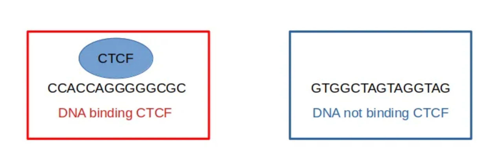

We will use a pretrained LLM from huggingface (https://huggingface.co/RaphaelMourad/Mistral-DNA-v1-17M-hg38) and finetune it for DNA sequence classification. The aim is to classify a DNA sequence depending on whether it binds a protein or not (transcription factor), or if a histone mark is present, or if a promoter is active.

The pretrained model is not designed for classification (nor regression), but it can be finetuned on a classification task, given some labeled DNA sequences. For instance, it can be finetuned for the classification of DNA sequences into two classes: sequences that binds a specific transcription factor, and sequences that don’t bind the transcription factor (figure 2 below).



The key is to tell pytorch to load the pretrain model and to add a classification neuron on the top for finetuning


Script to fine tune the pretrained model "Mixtral-8x7B-v0.1" on labeled data.
Here the aim is to classify a DNA sequence depending on if it binds a protein or not (transcription factor), or if a histone mark is present, or if a promoter is active.


# Prepare resources 

## Install dependencies


```python
!pip install datasets==3.0.1
!pip install torch==2.5.0
!pip install transformers -U
!pip install accelerate==1.1.0
!pip install peft==0.13.2
!pip install bitsandbytes==0.44.1
!pip install flash-attn==2.6.3
!pip install Bio==1.7.1
!pip install orfipy
```

## Import Python libraries

- `torch`
- `flash_attn`
- `numpy`
- `transformers`
  - `AutoTokenizer`
  - `EarlyStoppingCallback`
  - `Trainer`
  - `TrainingArguments`
  - `AutoModelForCausalLM`
  - `AutoConfig`
  - `DataCollatorForLanguageModeling`
- `datasets`
- `accelerate`


```python
# 
# During the class, 
import os

import sys
import time
from os import path
import gc


import flash_attn
import torch
import numpy as np
import pandas as pd
import scipy as sp
import matplotlib.pyplot as plt

import transformers

from transformers import AutoTokenizer
from transformers import EarlyStoppingCallback, Trainer, TrainingArguments
from transformers import AutoModelForCausalLM, AutoConfig
from transformers import DataCollatorForLanguageModeling
from datasets import load_dataset

import accelerate
```

## Check versions

Numpy version > 1.26.4

```python
np.__version__
```

transformers version > 4.47.1

```python
transformers.__version__
```

flash_attn > 2.6.0.post1 and 2.7.0.post2

```python
flash_attn.__version__
```

accelerate > 0.32.1

```python
# Tested with accelerate==0.32.1

accelerate.__version__
```

## Prepare GPU


```python
# CHECK GPU
# We can see how many VRAM is used and how much the GPU is used.
!nvidia-smi
```

    Thu Feb  6 07:59:23 2025       
    +-----------------------------------------------------------------------------------------+
    | NVIDIA-SMI 550.54.15              Driver Version: 550.54.15      CUDA Version: 12.4     |
    |-----------------------------------------+------------------------+----------------------+
    | GPU  Name                 Persistence-M | Bus-Id          Disp.A | Volatile Uncorr. ECC |
    | Fan  Temp   Perf          Pwr:Usage/Cap |           Memory-Usage | GPU-Util  Compute M. |
    |                                         |                        |               MIG M. |
    |=========================================+========================+======================|
    |   0  Tesla T4                       Off |   00000000:00:04.0 Off |                    0 |
    | N/A   36C    P8              9W /   70W |       0MiB /  15360MiB |      0%      Default |
    |                                         |                        |                  N/A |
    +-----------------------------------------+------------------------+----------------------+
                                                                                             
    +-----------------------------------------------------------------------------------------+
    | Processes:                                                                              |
    |  GPU   GI   CI        PID   Type   Process name                              GPU Memory |
    |        ID   ID                                                               Usage      |
    |=========================================================================================|
    |  No running processes found                                                             |
    +-----------------------------------------------------------------------------------------+


```python
# LOOK AT GPU USAGE AND RAM
!nvidia-smi
```

    Thu Feb  6 16:49:41 2025       
    +-----------------------------------------------------------------------------------------+
    | NVIDIA-SMI 550.54.15              Driver Version: 550.54.15      CUDA Version: 12.4     |
    |-----------------------------------------+------------------------+----------------------+
    | GPU  Name                 Persistence-M | Bus-Id          Disp.A | Volatile Uncorr. ECC |
    | Fan  Temp   Perf          Pwr:Usage/Cap |           Memory-Usage | GPU-Util  Compute M. |
    |                                         |                        |               MIG M. |
    |=========================================+========================+======================|
    |   0  Tesla T4                       Off |   00000000:00:04.0 Off |                    0 |
    | N/A   54C    P8             10W /   70W |       2MiB /  15360MiB |      0%      Default |
    |                                         |                        |                  N/A |
    +-----------------------------------------+------------------------+----------------------+
                                                                                             
    +-----------------------------------------------------------------------------------------+
    | Processes:                                                                              |
    |  GPU   GI   CI        PID   Type   Process name                              GPU Memory |
    |        ID   ID                                                               Usage      |
    |=========================================================================================|
    |  No running processes found                                                             |
    +-----------------------------------------------------------------------------------------+


Control the use of ram by CUDA

```python
torch.backends.cudnn.benchmark=True
os.environ["PYTORCH_CUDA_ALLOC_CONF"] = "max_split_size_mb:32 "
```

```python
# Check GPU
import torch
torch.device('cuda' if torch.cuda.is_available() else 'cpu')
```

    device(type='cuda')

# Get the model 

Mistral-DNA-v0.1 was derived from Mixtral-8x7B for the human genome. Mixtral-8x7B was simplified for DNA: the number of layers and the hidden size were reduced. The model was pretrained using the human genome hg38 with 200b DNA sequences.

The model can be downloaded on HuggingFace: https://huggingface.co/RaphaelMourad/Mistral-DNA-v0.1

```python
!git clone https://github.com/raphaelmourad/Mistral-DNA.git
```


```python
!ls
```

    Mistral-DNA  sample_data


```python
# SET DIRECTORY
os.chdir("Mistral-DNA/")
print(os.getcwd())
```

/content/Mistral-DNA


```python
# Uncompress labeled data
!tar -xf Mistral-DNA/data/GUE.tar.xz -C Mistral-DNA/data/
```

## Load extra Python modules

- `accelerate`
- `peft`
- `triton`

```python
from random import randrange
from progressbar import ProgressBar

from torch.utils.data import TensorDataset, DataLoader
from torch.distributed.fsdp.fully_sharded_data_parallel import FullOptimStateDictConfig, FullStateDictConfig
from transformers import AutoModel, EarlyStoppingCallback, set_seed, BitsAndBytesConfig
from accelerate import FullyShardedDataParallelPlugin, Accelerator
from peft import (
    LoraConfig,
    get_peft_model,
    get_peft_model_state_dict,
    prepare_model_for_kbit_training,
)

# Print numpy version for compatibility with spektral
print(np.__version__) # Becareful: numpy should be 1.19 (and not 1.2) for spektral to work!
#print(accelerate.__version__)
#print(triton.__version__)
print(transformers.__version__)
print(torch.cuda.get_device_name(0))
```


```python
### LOAD FUNCTIONS MODULE
sys.path.append("scriptPython/")
from functions import *
```

## Specify parameters

test with different models (from small one to a big one)
Discuss lora

```python
model_name="RaphaelMourad/Mistral-DNA-v1-17M-hg38"
```

Parameters for fine-tuning

```python
# PARAMETERS FOR FINE-TUNING
training_args = transformers.TrainingArguments(
    output_dir="./results",
    evaluation_strategy="epoch",
    save_strategy="epoch",
    learning_rate=1e-5,
    per_device_train_batch_size=16,
    per_device_eval_batch_size=16,
    num_train_epochs=5,
    weight_decay=0.01,
    bf16=True,
    report_to="none",
    load_best_model_at_end = True,
)
```

```
os.environ["WANDB_DISABLED"] = "true"
```

Configurate with 4 bits quantization


```python
bnb_config = BitsAndBytesConfig(
    load_in_4bit=True,
    bnb_4bit_use_double_quant=True,
    bnb_4bit_compute_dtype=torch.bfloat16
)
bnb_config
```

    BitsAndBytesConfig {
      "_load_in_4bit": true,
      "_load_in_8bit": false,
      "bnb_4bit_compute_dtype": "bfloat16",
      "bnb_4bit_quant_storage": "uint8",
      "bnb_4bit_quant_type": "fp4",
      "bnb_4bit_use_double_quant": true,
      "llm_int8_enable_fp32_cpu_offload": false,
      "llm_int8_has_fp16_weight": false,
      "llm_int8_skip_modules": null,
      "llm_int8_threshold": 6.0,
      "load_in_4bit": true,
      "load_in_8bit": false,
      "quant_method": "bitsandbytes"
    }


Config accelerate

```python
fsdp_plugin = FullyShardedDataParallelPlugin(
    state_dict_config=FullStateDictConfig(offload_to_cpu=True, rank0_only=False),
    optim_state_dict_config=FullOptimStateDictConfig(offload_to_cpu=True, rank0_only=False),
)
accelerator = Accelerator(fsdp_plugin=fsdp_plugin)
```

Config lora with parameters

```python
peft_config = LoraConfig(
        r=16,
        lora_alpha=16,
        lora_dropout=0.05,
        bias="none",
        task_type="SEQ_CLS",
        target_modules=["q_proj", "k_proj", "v_proj", "o_proj","gate_proj"]
    )
```

## Create and train model

- the data with the 1st transcription factor (tf0) in mouse from the paper of DNABERT2.
- test with and without LORA
- test with and without quantization
- test with regular attention and with flash attention 2
- test with and with bf16
- change learning rate
- change batch size

```python
expe="tf/0"
data_path="data/GUE/"+expe
training_args.output_dir="results/mixtral-dna/GUE/"+expe+"/"
num_labels=2

if os.path.exists(training_args.output_dir)==False:
  os.makedirs(training_args.output_dir)

# load tokenizer
tokenizer = transformers.AutoTokenizer.from_pretrained(
    model_name,
    model_max_length=200,
    padding_side="right",
    use_fast=True,
    trust_remote_code=True,
)
tokenizer.eos_token='[EOS]'
tokenizer.pad_token = '[PAD]'
```

define datasets and data collator

```python
train_dataset = SupervisedDataset(tokenizer=tokenizer,
                                  data_path=os.path.join(data_path, "train.csv"),
                                  kmer=-1)
val_dataset = SupervisedDataset(tokenizer=tokenizer,
                                 data_path=os.path.join(data_path, "dev.csv"),
                                 kmer=-1)
test_dataset = SupervisedDataset(tokenizer=tokenizer,
                                 data_path=os.path.join(data_path, "test.csv"),
                                 kmer=-1)
data_collator = DataCollatorForSupervisedDataset(tokenizer=tokenizer)
```

load model

```python
model=transformers.AutoModelForSequenceClassification.from_pretrained(
    model_name,
    num_labels=num_labels,
    output_hidden_states=False,
    quantization_config=bnb_config,
    device_map='auto',
    trust_remote_code=True,
)
model.config.pad_token_id = tokenizer.pad_token_id
#model = prepare_model_for_kbit_training(model)
#model = get_peft_model(model, peft_config)
#model = accelerator.prepare_model(model)
```

Setup trainer

```python
trainer = transformers.Trainer(model=model,
                               args=training_args,
                               compute_metrics=compute_metrics,
                               train_dataset=train_dataset,
                               eval_dataset=val_dataset,
                               data_collator=data_collator,
                              callbacks = [EarlyStoppingCallback(early_stopping_patience=3)]
                              )
trainer.local_rank=training_args.local_rank
trainer.train()
```

    WARNING:root:Perform single sequence classification...
    WARNING:root:Perform single sequence classification...
    WARNING:root:Perform single sequence classification...
    Some weights of MixtralForSequenceClassification were not initialized from the model checkpoint at RaphaelMourad/Mistral-DNA-v1-17M-hg38 and are newly initialized: ['score.weight']
    You should probably TRAIN this model on a down-stream task to be able to use it for predictions and inference.

    <div>

      <progress value='57' max='10120' style='width:300px; height:20px; vertical-align: middle;'></progress>
      [   57/10120 00:09 < 30:23, 5.52 it/s, Epoch 0.03/5]
    </div>
    <table border="1" class="dataframe">
  <thead>
 <tr style="text-align: left;">
      <th>Epoch</th>
      <th>Training Loss</th>
      <th>Validation Loss</th>
    </tr>
  </thead>
  <tbody>
  </tbody>
</table><p>

Check metrics on test data
get the evaluation results from trainer

```python
results_path = training_args.output_dir+"/metrics"
results = trainer.evaluate(eval_dataset=test_dataset)
os.makedirs(results_path, exist_ok=True)
with open(os.path.join(results_path, "test_results.json"), "w") as f:
    json.dump(results, f)

file_metric="results/mixtral-dna/GUE/"+expe+"/metrics/test_results.json"
data_expe = pd.read_json(file_metric, typ='series')
print(data_expe)
```


<div>

  <progress value='189' max='63' style='width:300px; height:20px; vertical-align: middle;'></progress>
  [63/63 03:36]
</div>


    eval_loss                      0.424961
    eval_accuracy                  0.804000
    eval_f1                        0.800838
    eval_matthews_correlation      0.628276
    eval_precision                 0.824614
    eval_recall                    0.804000
    eval_runtime                   6.548800
    eval_samples_per_second      152.699000
    eval_steps_per_second          9.620000
    epoch                          3.000000
    dtype: float64
