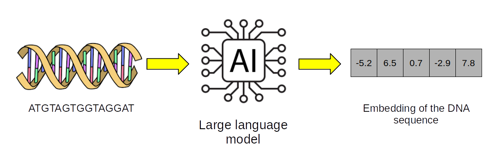
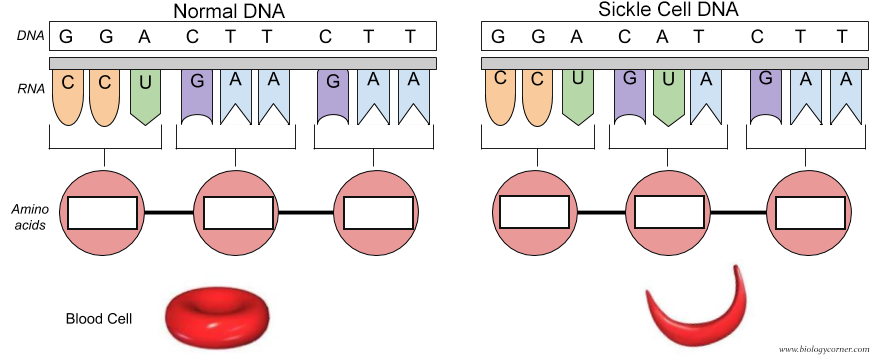

We will pretrain an LLM from scratch (a simplified mistral model, see folder data/models/Mixtral-8x7B-v0.1/) on the 100,000 DNA sequences from the human genome. The LLM is pretrained with causal language modeling using 200b DNA sequences from the human genome hg38 assembly.

To build Mistral-DNA, it needs to be pretrained. It consists in train the model to predict the end of a DNA sequence. For instance, for a sequence ATTTGTTGGT, the model will be trained to predict the suffix TTGGT given the prefix ATTTG. This is called causal language modeling. Mistral-DNA was trained on all sequences from the human genome.

At the end of the pretraining, we obtain Mistral-DNA model which has an internal representation of the DNA sequence grammar. Such pretrained model can then be used for different applications such as finetuning on a classification task or the prediction of mutational effects.

The script script_pretrain_mistral-dna.ipynb to pretrain the model is available on the github repo. Moreover, the script can be ran on Google Colab.

Script to pretrain Mixtral large language model (LLM) for DNA sequences.
The LLM is pretrained with causal language modeling using 200b DNA sequences from the human genome hg38 assembly.

Generative Artificial Intelligence and Large Langage Model introduction



Mistral AI recently launched large language models (LLMs) showing performances superior to Llama2. In particular, Mixtral-8x7B implements Grouped-Query Attention, Sliding-Window Attention and Byte-fallback BPE tokenizer to improve the performance of LLMs.

The human genome can be seen as a very large book with words composed of letters A, T, C and G. Such book encodes numerous instructions for key biological processes in the human cells and organs. Sometimes, mutations in the human genome can lead to genetic diseases, such as in sickle cell anemia. The blood cell has a normal shape when the DNA sequence is normal (GGA CTT CTT). And the blood cell has sickle shape when the DNA sequence is mutated (GGA CAT CTT) (see Figure 1 below). LLMs can be used to analyze the human genome.



In this tutorial for large language models (LLMs) for genomics, we will:
- Pretrain an LLM on DNA sequences
- Finetune of an LLM for DNA sequence classification
- Zeroshot learning prediction of mutation effect
- Synthetic DNA sequence generation
- DNA sequence optimization


Before pretraining Mistral-DNA, we need to build the dataset to feed the model. The human genome (hg38) is split into DNA sequence of 200 bases. To pretrain the model, we will use a file contains 100,000 non-overlapping DNA sequences of 200 bases, corresponding to around 1% of the human genome.


# Prepare resources 

## Install dependencies


```python
!pip install datasets==3.0.1
!pip install torch==2.5.0
!pip install transformers -U
!pip install accelerate==1.1.0
!pip install peft==0.13.2
!pip install bitsandbytes==0.44.1
!pip install flash-attn==2.6.3
!pip install Bio==1.7.1
!pip install orfipy
```

## Import Python libraries

- `torch`
- `flash_attn`
- `numpy`
- `transformers`
  - `AutoTokenizer`
  - `EarlyStoppingCallback`
  - `Trainer`
  - `TrainingArguments`
  - `AutoModelForCausalLM`
  - `AutoConfig`
  - `DataCollatorForLanguageModeling`
- `datasets`
- `accelerate`


```python
# 
# During the class, 
import os

import sys
import time
from os import path
import gc


import flash_attn
import torch
import numpy as np
import pandas as pd
import scipy as sp
import matplotlib.pyplot as plt

import transformers

from transformers import AutoTokenizer
from transformers import EarlyStoppingCallback, Trainer, TrainingArguments
from transformers import AutoModelForCausalLM, AutoConfig
from transformers import DataCollatorForLanguageModeling
from datasets import load_dataset

import accelerate
```

## Check versions

Numpy version > 1.26.4

```python
np.__version__
```

transformers version > 4.47.1

```python
transformers.__version__
```

flash_attn > 2.6.0.post1 and 2.7.0.post2

```python
flash_attn.__version__
```

accelerate > 0.32.1

```python
# Tested with accelerate==0.32.1

accelerate.__version__
```

## Prepare GPU


```python
# CHECK GPU
# We can see how many VRAM is used and how much the GPU is used.
!nvidia-smi
```

    Thu Feb  6 07:59:23 2025       
    +-----------------------------------------------------------------------------------------+
    | NVIDIA-SMI 550.54.15              Driver Version: 550.54.15      CUDA Version: 12.4     |
    |-----------------------------------------+------------------------+----------------------+
    | GPU  Name                 Persistence-M | Bus-Id          Disp.A | Volatile Uncorr. ECC |
    | Fan  Temp   Perf          Pwr:Usage/Cap |           Memory-Usage | GPU-Util  Compute M. |
    |                                         |                        |               MIG M. |
    |=========================================+========================+======================|
    |   0  Tesla T4                       Off |   00000000:00:04.0 Off |                    0 |
    | N/A   36C    P8              9W /   70W |       0MiB /  15360MiB |      0%      Default |
    |                                         |                        |                  N/A |
    +-----------------------------------------+------------------------+----------------------+
                                                                                             
    +-----------------------------------------------------------------------------------------+
    | Processes:                                                                              |
    |  GPU   GI   CI        PID   Type   Process name                              GPU Memory |
    |        ID   ID                                                               Usage      |
    |=========================================================================================|
    |  No running processes found                                                             |
    +-----------------------------------------------------------------------------------------+


```python
# LOOK AT GPU USAGE AND RAM
!nvidia-smi
```

    Thu Feb  6 16:49:41 2025       
    +-----------------------------------------------------------------------------------------+
    | NVIDIA-SMI 550.54.15              Driver Version: 550.54.15      CUDA Version: 12.4     |
    |-----------------------------------------+------------------------+----------------------+
    | GPU  Name                 Persistence-M | Bus-Id          Disp.A | Volatile Uncorr. ECC |
    | Fan  Temp   Perf          Pwr:Usage/Cap |           Memory-Usage | GPU-Util  Compute M. |
    |                                         |                        |               MIG M. |
    |=========================================+========================+======================|
    |   0  Tesla T4                       Off |   00000000:00:04.0 Off |                    0 |
    | N/A   54C    P8             10W /   70W |       2MiB /  15360MiB |      0%      Default |
    |                                         |                        |                  N/A |
    +-----------------------------------------+------------------------+----------------------+
                                                                                             
    +-----------------------------------------------------------------------------------------+
    | Processes:                                                                              |
    |  GPU   GI   CI        PID   Type   Process name                              GPU Memory |
    |        ID   ID                                                               Usage      |
    |=========================================================================================|
    |  No running processes found                                                             |
    +-----------------------------------------------------------------------------------------+


Control the use of ram by CUDA

```python
torch.backends.cudnn.benchmark=True
os.environ["PYTORCH_CUDA_ALLOC_CONF"] = "max_split_size_mb:32 "
```

```python
# Check GPU
import torch
torch.device('cuda' if torch.cuda.is_available() else 'cpu')
```

    device(type='cuda')

# Get the model 

Mistral-DNA-v0.1 was derived from Mixtral-8x7B for the human genome. Mixtral-8x7B was simplified for DNA: the number of layers and the hidden size were reduced. The model was pretrained using the human genome hg38 with 200b DNA sequences.

The model can be downloaded on HuggingFace: https://huggingface.co/RaphaelMourad/Mistral-DNA-v0.1

```python
!git clone https://github.com/raphaelmourad/Mistral-DNA.git
```


```python
!ls
```

    Mistral-DNA  sample_data


```python
# SET DIRECTORY
os.chdir("Mistral-DNA/")
print(os.getcwd())
```

/content/Mistral-DNA


# Choose the LLM architecture

Let's look at the original archicture of Mixtral-8x7B-v0.1, discuss the model


```python
config = AutoConfig.from_pretrained("data/models/Mixtral-8x7B-v0.1") # Mixture of expert
```

Let's change the model architecture by adding or removing transformer blocks, hidden states, number of attention heads, and number of experts

NB: flash attention 2 does not work with T4 GPU

```python
#model = AutoModelForCausalLM.from_config(config,attn_implementation="flash_attention_2")
model = AutoModelForCausalLM.from_config(config,attn_implementation="eager")
model
```


    MixtralForCausalLM(
      (model): MixtralModel(
        (embed_tokens): Embedding(4096, 256)
        (layers): ModuleList(
          (0-7): 8 x MixtralDecoderLayer(
            (self_attn): MixtralAttention(
              (q_proj): Linear(in_features=256, out_features=256, bias=False)
              (k_proj): Linear(in_features=256, out_features=256, bias=False)
              (v_proj): Linear(in_features=256, out_features=256, bias=False)
              (o_proj): Linear(in_features=256, out_features=256, bias=False)
              (rotary_emb): MixtralRotaryEmbedding()
            )
            (block_sparse_moe): MixtralSparseMoeBlock(
              (gate): Linear(in_features=256, out_features=64, bias=False)
              (experts): ModuleList(
                (0-63): 64 x MixtralBlockSparseTop2MLP(
                  (w1): Linear(in_features=256, out_features=256, bias=False)
                  (w2): Linear(in_features=256, out_features=256, bias=False)
                  (w3): Linear(in_features=256, out_features=256, bias=False)
                  (act_fn): SiLU()
                )
              )
            )
            (input_layernorm): MixtralRMSNorm((256,), eps=1e-05)
            (post_attention_layernorm): MixtralRMSNorm((256,), eps=1e-05)
          )
        )
        (norm): MixtralRMSNorm((256,), eps=1e-05)
      )
      (lm_head): Linear(in_features=256, out_features=4096, bias=False)
    )


- test BERT model architecture?

## Load BPE letter tokenizer

what are UNK, CLS, SEP, PAD and MASK??

```python
tokenizer = AutoTokenizer.from_pretrained("zhihan1996/DNABERT-2-117M", trust_remote_code=True)
tokenizer.padding_side  = 'left'
print(tokenizer)
```

    /usr/local/lib/python3.11/dist-packages/huggingface_hub/utils/_auth.py:94: UserWarning: 
    The secret `HF_TOKEN` does not exist in your Colab secrets.
    To authenticate with the Hugging Face Hub, create a token in your settings tab (https://huggingface.co/settings/tokens), set it as secret in your Google Colab and restart your session.
    You will be able to reuse this secret in all of your notebooks.
    Please note that authentication is recommended but still optional to access public models or datasets.
      warnings.warn(


    tokenizer_config.json:   0%|          | 0.00/158 [00:00<?, ?B/s]


    tokenizer.json:   0%|          | 0.00/168k [00:00<?, ?B/s]


    PreTrainedTokenizerFast(name_or_path='zhihan1996/DNABERT-2-117M', vocab_size=4096, model_max_length=1000000000000000019884624838656, is_fast=True, padding_side='left', truncation_side='right', special_tokens={'unk_token': '[UNK]', 'sep_token': '[SEP]', 'pad_token': '[PAD]', 'cls_token': '[CLS]', 'mask_token': '[MASK]'}, clean_up_tokenization_spaces=False, added_tokens_decoder={
    	0: AddedToken("[UNK]", rstrip=False, lstrip=False, single_word=False, normalized=False, special=True),
    	1: AddedToken("[CLS]", rstrip=False, lstrip=False, single_word=False, normalized=False, special=True),
    	2: AddedToken("[SEP]", rstrip=False, lstrip=False, single_word=False, normalized=False, special=True),
    	3: AddedToken("[PAD]", rstrip=False, lstrip=False, single_word=False, normalized=False, special=True),
    	4: AddedToken("[MASK]", rstrip=False, lstrip=False, single_word=False, normalized=False, special=True),
    }
    )

## DNA encodoing

```python
encoding = tokenizer("ATT", padding="longest", truncation=True, return_tensors="pt")
print(encoding)
```


let's change the DNA sequence, max_length, padding, truncation, ... and see what happens.

```python
encoding = tokenizer("ATTGTGGGTCCCCGTAGATGATAGGGGCCCCCC", max_length=5, padding='max_length', truncation=True, return_tensors="pt")
print(encoding)
```

    {'input_ids': tensor([[   1, 2061,    2]]), 'token_type_ids': tensor([[0, 0, 0]]), 'attention_mask': tensor([[1, 1, 1]])}

```python
encoding = tokenizer("ATT", padding="longest", truncation=True, return_tensors="pt")
print(encoding)
```

## Define the number of model parameters

```python
pytorch_total_params = sum(p.numel() for p in model.parameters())
print(f"Model size: {pytorch_total_params/1000**2:.1f}M parameters")
```

    Model size: 105.0M parameters


## Load data

```python
data_collator = DataCollatorForLanguageModeling(tokenizer=tokenizer, mlm=False)

#dataset_text = load_dataset("csv", data_files="data/genome_sequences/hg38/sequences_hg38_200b.csv")
#dataset_text = load_dataset("csv", data_files="data/genome_sequences/hg38/sequences_hg38_200b_small.csv.gz")
dataset_text = load_dataset("csv", data_files="data/genome_sequences/hg38/sequences_hg38_200b_verysmall.csv.gz")
dataset_text['train']['text'][0:5]
```

    Generating train split: 0 examples [00:00, ? examples/s]

    ['TAACCCTAACCCTAACCCTAACCCTAACCCTAACCCTAACCCTAACCCTAACCCTAACCCTAACCCTAACCCTAACCCTAACCCTAACCCTAACCCTAACCCTAACCCAACCCTAACCCTAACCCTAACCCTAACCCTAACCCTAACCCCTAACCCTAACCCTAACCCTAACCCTAACCTAACCCTAACCCTAACCCTAA',
     'CCCTAACCCTAACCCTAACCCTAACCCTAACCCCTAACCCTAACCCTAAACCCTAAACCCTAACCCTAACCCTAACCCTAACCCTAACCCCAACCCCAACCCCAACCCCAACCCCAACCCCAACCCTAACCCCTAACCCTAACCCTAACCCTACCCTAACCCTAACCCTAACCCTAACCCTAACCCTAACCCCTAACCCC',
     'TAACCCTAACCCTAACCCTAACCCTAACCCTAACCCTAACCCCTAACCCTAACCCTAACCCTAACCCTCGCGGTACCCTCAGCCGGCCCGCCCGCCCGGGTCTGACCTGAGGAGAACTGTGCTCCGCCTTCAGAGTACCACCGAAATCTGTGCAGAGGACAACGCAGCTCCGCCCTCGCGGTGCTCTCCGGGTCTGTGCT',
     'GAGGAGAACGCAACTCCGCCGTTGCAAAGGCGCGCCGCGCCGGCGCAGGCGCAGAGAGGCGCGCCGCGCCGGCGCAGGCGCAGAGAGGCGCGCCGCGCCGGCGCAGGCGCAGAGAGGCGCGCCGCGCCGGCGCAGGCGCAGAGAGGCGCGCCGCGCCGGCGCAGGCGCAGAGAGGCGCGCCGCGCCGGCGCAGGCGCAGA',
     'CACATGCTAGCGCGTCGGGGTGGAGGCGTGGCGCAGGCGCAGAGAGGCGCGCCGCGCCGGCGCAGGCGCAGAGACACATGCTACCGCGTCCAGGGGTGGAGGCGTGGCGCAGGCGCAGAGAGGCGCACCGCGCCGGCGCAGGCGCAGAGACACATGCTAGCGCGTCCAGGGGTGGAGGCGTGGCGCAGGCGCAGAGACGC']


## Tokenize data

```python
def tokenize_function(examples):
    return tokenizer(examples['text'], padding="longest", truncation=True, return_tensors="pt")

dataset = dataset_text.map(tokenize_function, batched=True)
print(dataset["train"])
```

    Map:   0%|          | 0/99999 [00:00<?, ? examples/s]

    Dataset({
        features: ['text', 'input_ids', 'token_type_ids', 'attention_mask'],
        num_rows: 99999
    })


```python
train_size = int(0.8 * len(dataset["train"]))
test_size = len(dataset["train"]) - train_size
train_set, val_set = torch.utils.data.random_split(dataset["train"], [train_size, test_size])
```

## Examine the data

What is input ids?
What is attention mask?

```python
train_set[1]
```

    {'text': 'TCTGTTTTTGCCTCATTCTCCAGCGGGGTTGCTTTCAAATGTCATCTCGGTTCTCTGAACTAGGTCTTGACTTTCTCCTCCTAGTCTTCCCAGGGTCTATACTTCAAATACTATGCATACCCAGGCTTACTGTGTACCAGATTTAATTAGATACTCAATTGAGTCCAGTACTAGAATATATTCCACCTAAGACCAGAAGC',
     'input_ids': [3,
      3,
      3,
      3,
      3,
      3,
      3,
      1,
      1679,
      139,
      127,
      3641,
      788,
      60,
      1118,
      22,
      75,
      101,
      1210,
      681,
      47,
      226,
      121,
      561,
      161,
      567,
      2666,
      1372,
      3575,
      104,
      567,
      81,
      3243,
      2556,
      322,
      113,
      1498,
      611,
      240,
      785,
      309,
      34,
      297,
      262,
      25,
      19,
      2],
     'token_type_ids': [0,
      0,
      0,
      0,
      0,
      0,
      0,
      0,
      0,
      0,
      0,
      0,
      0,
      0,
      0,
      0,
      0,
      0,
      0,
      0,
      0,
      0,
      0,
      0,
      0,
      0,
      0,
      0,
      0,
      0,
      0,
      0,
      0,
      0,
      0,
      0,
      0,
      0,
      0,
      0,
      0,
      0,
      0,
      0,
      0,
      0,
      0],
     'attention_mask': [0,
      0,
      0,
      0,
      0,
      0,
      0,
      1,
      1,
      1,
      1,
      1,
      1,
      1,
      1,
      1,
      1,
      1,
      1,
      1,
      1,
      1,
      1,
      1,
      1,
      1,
      1,
      1,
      1,
      1,
      1,
      1,
      1,
      1,
      1,
      1,
      1,
      1,
      1,
      1,
      1,
      1,
      1,
      1,
      1,
      1,
      1]}


```python
len(train_set)
```

    79999


## Define parameters for pretraining

```python
# PARAMETERS FOR PRETRAINING
# During class,

batchsize=32
training_args = TrainingArguments(
        output_dir='./results/models',
        evaluation_strategy='epoch',
        save_strategy='epoch',
        num_train_epochs=50,
        per_device_train_batch_size=batchsize,
        per_device_eval_batch_size=batchsize,
        learning_rate=5e-4,
        weight_decay=0.01,
        logging_dir='./logs',
        load_best_model_at_end=True,
        fp16=True,
        gradient_accumulation_steps=50,
)
import os
os.environ["WANDB_DISABLED"] = "true"

print(training_args)
```

    /usr/local/lib/python3.11/dist-packages/transformers/training_args.py:1575: FutureWarning: `evaluation_strategy` is deprecated and will be removed in version 4.46 of 🤗 Transformers. Use `eval_strategy` instead
      warnings.warn(
    Using the `WANDB_DISABLED` environment variable is deprecated and will be removed in v5. Use the --report_to flag to control the integrations used for logging result (for instance --report_to none).


    TrainingArguments(
    _n_gpu=1,
    accelerator_config={'split_batches': False, 'dispatch_batches': None, 'even_batches': True, 'use_seedable_sampler': True, 'non_blocking': False, 'gradient_accumulation_kwargs': None, 'use_configured_state': False},
    adafactor=False,
    adam_beta1=0.9,
    adam_beta2=0.999,
    adam_epsilon=1e-08,
    auto_find_batch_size=False,
    average_tokens_across_devices=False,
    batch_eval_metrics=False,
    bf16=False,
    bf16_full_eval=False,
    data_seed=None,
    dataloader_drop_last=False,
    dataloader_num_workers=0,
    dataloader_persistent_workers=False,
    dataloader_pin_memory=True,
    dataloader_prefetch_factor=None,
    ddp_backend=None,
    ddp_broadcast_buffers=None,
    ddp_bucket_cap_mb=None,
    ddp_find_unused_parameters=None,
    ddp_timeout=1800,
    debug=[],
    deepspeed=None,
    disable_tqdm=False,
    dispatch_batches=None,
    do_eval=True,
    do_predict=False,
    do_train=False,
    eval_accumulation_steps=None,
    eval_delay=0,
    eval_do_concat_batches=True,
    eval_on_start=False,
    eval_steps=None,
    eval_strategy=IntervalStrategy.EPOCH,
    eval_use_gather_object=False,
    evaluation_strategy=epoch,
    fp16=True,
    fp16_backend=auto,
    fp16_full_eval=False,
    fp16_opt_level=O1,
    fsdp=[],
    fsdp_config={'min_num_params': 0, 'xla': False, 'xla_fsdp_v2': False, 'xla_fsdp_grad_ckpt': False},
    fsdp_min_num_params=0,
    fsdp_transformer_layer_cls_to_wrap=None,
    full_determinism=False,
    gradient_accumulation_steps=50,
    gradient_checkpointing=False,
    gradient_checkpointing_kwargs=None,
    greater_is_better=False,
    group_by_length=False,
    half_precision_backend=auto,
    hub_always_push=False,
    hub_model_id=None,
    hub_private_repo=None,
    hub_strategy=HubStrategy.EVERY_SAVE,
    hub_token=<HUB_TOKEN>,
    ignore_data_skip=False,
    include_for_metrics=[],
    include_inputs_for_metrics=False,
    include_num_input_tokens_seen=False,
    include_tokens_per_second=False,
    jit_mode_eval=False,
    label_names=None,
    label_smoothing_factor=0.0,
    learning_rate=0.0005,
    length_column_name=length,
    load_best_model_at_end=True,
    local_rank=0,
    log_level=passive,
    log_level_replica=warning,
    log_on_each_node=True,
    logging_dir=./logs,
    logging_first_step=False,
    logging_nan_inf_filter=True,
    logging_steps=500,
    logging_strategy=IntervalStrategy.STEPS,
    lr_scheduler_kwargs={},
    lr_scheduler_type=SchedulerType.LINEAR,
    max_grad_norm=1.0,
    max_steps=-1,
    metric_for_best_model=loss,
    mp_parameters=,
    neftune_noise_alpha=None,
    no_cuda=False,
    num_train_epochs=50,
    optim=OptimizerNames.ADAMW_TORCH,
    optim_args=None,
    optim_target_modules=None,
    output_dir=./results/models,
    overwrite_output_dir=False,
    past_index=-1,
    per_device_eval_batch_size=32,
    per_device_train_batch_size=32,
    prediction_loss_only=False,
    push_to_hub=False,
    push_to_hub_model_id=None,
    push_to_hub_organization=None,
    push_to_hub_token=<PUSH_TO_HUB_TOKEN>,
    ray_scope=last,
    remove_unused_columns=True,
    report_to=['tensorboard'],
    restore_callback_states_from_checkpoint=False,
    resume_from_checkpoint=None,
    run_name=./results/models,
    save_on_each_node=False,
    save_only_model=False,
    save_safetensors=True,
    save_steps=500,
    save_strategy=SaveStrategy.EPOCH,
    save_total_limit=None,
    seed=42,
    skip_memory_metrics=True,
    split_batches=None,
    tf32=None,
    torch_compile=False,
    torch_compile_backend=None,
    torch_compile_mode=None,
    torch_empty_cache_steps=None,
    torchdynamo=None,
    tpu_metrics_debug=False,
    tpu_num_cores=None,
    use_cpu=False,
    use_ipex=False,
    use_legacy_prediction_loop=False,
    use_liger_kernel=False,
    use_mps_device=False,
    warmup_ratio=0.0,
    warmup_steps=0,
    weight_decay=0.01,
    )

Let's  modify:
- batchsize
- number of epochs
- learning rate
- weight_decay
- gradient accumulation steps

## Pretrain the model

Look at:
- the use of CPU RAM, GPU RAM
- estimates how long it takes for 1 epoch

Don't train until the end as it takes too much time (20h).
with 105Mb Mixtral model, 110h / 50 epochs (1M sequences) = 2h / epoch


```python
trainer = Trainer(
    model=model,
    args=training_args,
    data_collator=data_collator,
    train_dataset=train_set,
    eval_dataset=val_set,
    callbacks = [EarlyStoppingCallback(early_stopping_patience=3)]
)

print ('Start a trainer...')
# Start training
trainer.train()
```

    Start a trainer...


    <div>

      <progress value='10' max='2500' style='width:300px; height:20px; vertical-align: middle;'></progress>
      [  10/2500 03:52 < 20:04:23, 0.03 it/s, Epoch 0.18/50]
    </div>
    <table border="1" class="dataframe">
  <thead>
 <tr style="text-align: left;">
      <th>Epoch</th>
      <th>Training Loss</th>
      <th>Validation Loss</th>
    </tr>
  </thead>
  <tbody>
  </tbody>
</table><p>


## Load a previously trained mistral model

```python
model = AutoModelForCausalLM.from_pretrained("RaphaelMourad/Mistral-DNA-v1-17M-hg38")
model
```


    config.json:   0%|          | 0.00/793 [00:00<?, ?B/s]


    model.safetensors:   0%|          | 0.00/33.6M [00:00<?, ?B/s]


    generation_config.json:   0%|          | 0.00/111 [00:00<?, ?B/s]


    MixtralForCausalLM(
      (model): MixtralModel(
        (embed_tokens): Embedding(4096, 256)
        (layers): ModuleList(
          (0-7): 8 x MixtralDecoderLayer(
            (self_attn): MixtralSdpaAttention(
              (q_proj): Linear(in_features=256, out_features=256, bias=False)
              (k_proj): Linear(in_features=256, out_features=256, bias=False)
              (v_proj): Linear(in_features=256, out_features=256, bias=False)
              (o_proj): Linear(in_features=256, out_features=256, bias=False)
              (rotary_emb): MixtralRotaryEmbedding()
            )
            (block_sparse_moe): MixtralSparseMoeBlock(
              (gate): Linear(in_features=256, out_features=8, bias=False)
              (experts): ModuleList(
                (0-7): 8 x MixtralBlockSparseTop2MLP(
                  (w1): Linear(in_features=256, out_features=256, bias=False)
                  (w2): Linear(in_features=256, out_features=256, bias=False)
                  (w3): Linear(in_features=256, out_features=256, bias=False)
                  (act_fn): SiLU()
                )
              )
            )
            (input_layernorm): MixtralRMSNorm((256,), eps=1e-05)
            (post_attention_layernorm): MixtralRMSNorm((256,), eps=1e-05)
          )
        )
        (norm): MixtralRMSNorm((256,), eps=1e-05)
      )
      (lm_head): Linear(in_features=256, out_features=4096, bias=False)
    )


## Calculate the embedding of a DNA sequence 

```python
dna = "ACGTAGCATCGGATCTATCTATCGACACTTGGTTATCGATCTACGAGCATCTCGTTAGC"
inputs = tokenizer(dna, return_tensors = 'pt')["input_ids"]
hidden_states = model(inputs)[0] # [1, sequence_length, 4096]
print(hidden_states)
```
    tensor([[[-5.7822, -2.6941,  0.2004,  ..., -0.8346, -0.4331, -2.4413],
             [-5.9302, -3.0826, -1.7779,  ..., -0.4484, -0.2522, -1.7841],
             [-6.4070, -3.5369, -0.8623,  ..., -0.4834, -0.2303, -1.4513],
             ...,
             [-6.7136, -4.0397, -0.2811,  ...,  0.0941,  0.0367, -1.0994],
             [-4.1983, -0.5584,  7.8823,  ..., -1.6618, -5.4440, -4.1521],
             [-6.5815, -4.2742, -0.0318,  ..., -0.2478, -2.5161, -0.3905]]],
           grad_fn=<UnsafeViewBackward0>)


embedding with mean pooling
```python
embedding_mean = torch.mean(hidden_states[0], dim=0)
print(embedding_mean.shape) # expect to be 4096
print(embedding_mean)
```
    torch.Size([4096])
    tensor([-6.1499, -3.4025,  1.3927,  ...,  0.0232, -1.7535, -1.1487],
           grad_fn=<MeanBackward1>)


embedding with max pooling
```python
embedding_max = torch.max(hidden_states[0], dim=0)[0]
print(embedding_max.shape) # expect to be 4096
print(embedding_max)
```


    torch.Size([4096])
    tensor([-3.9172, -0.5584,  7.8823,  ...,  4.9493,  1.1153,  4.1614],
           grad_fn=<MaxBackward0>)
