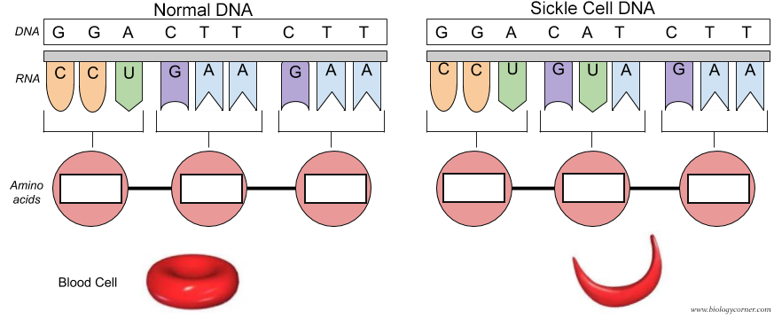

Generative Artificial Intelligence and Large Langage Model introduction


Mistral AI recently launched large language models (LLMs) showing performances superior to Llama2. In particular, Mixtral-8x7B implements Grouped-Query Attention, Sliding-Window Attention and Byte-fallback BPE tokenizer to improve the performance of LLMs.

The human genome can be seen as a very large book with words composed of letters A, T, C and G. Such book encodes numerous instructions for key biological processes in the human cells and organs. Sometimes, mutations in the human genome can lead to genetic diseases, such as in sickle cell anemia. The blood cell has a normal shape when the DNA sequence is normal (GGA CTT CTT). And the blood cell has sickle shape when the DNA sequence is mutated (GGA CAT CTT) (see Figure 1 below). LLMs can be used to analyze the human genome.



In this tutorial for large language models (LLMs) for genomics, we will:
- Pretrain an LLM on DNA sequences
- Finetune of an LLM for DNA sequence classification
- Zeroshot learning prediction of mutation effect
- Synthetic DNA sequence generation
- DNA sequence optimization


Before pretraining Mistral-DNA, we need to build the dataset to feed the model. The human genome (hg38) is split into DNA sequence of 200 bases. To pretrain the model, we will use a file contains 100,000 non-overlapping DNA sequences of 200 bases, corresponding to around 1% of the human genome.


# Prepare resources 

## Install dependencies


```python
!pip install datasets==3.0.1
!pip install torch==2.5.0
!pip install transformers -U
!pip install accelerate==1.1.0
!pip install peft==0.13.2
!pip install bitsandbytes==0.44.1
!pip install flash-attn==2.6.3
!pip install Bio==1.7.1
!pip install orfipy
```

## Import Python libraries

- `torch`
- `flash_attn`
- `numpy`
- `transformers`
  - `AutoTokenizer`
  - `EarlyStoppingCallback`
  - `Trainer`
  - `TrainingArguments`
  - `AutoModelForCausalLM`
  - `AutoConfig`
  - `DataCollatorForLanguageModeling`
- `datasets`
- `accelerate`


```python
# 
# During the class, 
import os

import sys
import time
from os import path
import gc


import flash_attn
import torch
import numpy as np
import pandas as pd
import scipy as sp
import matplotlib.pyplot as plt

import transformers

from transformers import AutoTokenizer
from transformers import EarlyStoppingCallback, Trainer, TrainingArguments
from transformers import AutoModelForCausalLM, AutoConfig
from transformers import DataCollatorForLanguageModeling
from datasets import load_dataset

import accelerate
```

## Check versions

Numpy version > 1.26.4

```python
np.__version__
```

transformers version > 4.47.1

```python
transformers.__version__
```

flash_attn > 2.6.0.post1 and 2.7.0.post2

```python
flash_attn.__version__
```

accelerate > 0.32.1

```python
# Tested with accelerate==0.32.1

accelerate.__version__
```

## Prepare GPU


```python
# CHECK GPU
# We can see how many VRAM is used and how much the GPU is used.
!nvidia-smi
```

    Thu Feb  6 07:59:23 2025       
    +-----------------------------------------------------------------------------------------+
    | NVIDIA-SMI 550.54.15              Driver Version: 550.54.15      CUDA Version: 12.4     |
    |-----------------------------------------+------------------------+----------------------+
    | GPU  Name                 Persistence-M | Bus-Id          Disp.A | Volatile Uncorr. ECC |
    | Fan  Temp   Perf          Pwr:Usage/Cap |           Memory-Usage | GPU-Util  Compute M. |
    |                                         |                        |               MIG M. |
    |=========================================+========================+======================|
    |   0  Tesla T4                       Off |   00000000:00:04.0 Off |                    0 |
    | N/A   36C    P8              9W /   70W |       0MiB /  15360MiB |      0%      Default |
    |                                         |                        |                  N/A |
    +-----------------------------------------+------------------------+----------------------+
                                                                                             
    +-----------------------------------------------------------------------------------------+
    | Processes:                                                                              |
    |  GPU   GI   CI        PID   Type   Process name                              GPU Memory |
    |        ID   ID                                                               Usage      |
    |=========================================================================================|
    |  No running processes found                                                             |
    +-----------------------------------------------------------------------------------------+


```python
# LOOK AT GPU USAGE AND RAM
!nvidia-smi
```

    Thu Feb  6 16:49:41 2025       
    +-----------------------------------------------------------------------------------------+
    | NVIDIA-SMI 550.54.15              Driver Version: 550.54.15      CUDA Version: 12.4     |
    |-----------------------------------------+------------------------+----------------------+
    | GPU  Name                 Persistence-M | Bus-Id          Disp.A | Volatile Uncorr. ECC |
    | Fan  Temp   Perf          Pwr:Usage/Cap |           Memory-Usage | GPU-Util  Compute M. |
    |                                         |                        |               MIG M. |
    |=========================================+========================+======================|
    |   0  Tesla T4                       Off |   00000000:00:04.0 Off |                    0 |
    | N/A   54C    P8             10W /   70W |       2MiB /  15360MiB |      0%      Default |
    |                                         |                        |                  N/A |
    +-----------------------------------------+------------------------+----------------------+
                                                                                             
    +-----------------------------------------------------------------------------------------+
    | Processes:                                                                              |
    |  GPU   GI   CI        PID   Type   Process name                              GPU Memory |
    |        ID   ID                                                               Usage      |
    |=========================================================================================|
    |  No running processes found                                                             |
    +-----------------------------------------------------------------------------------------+


Control the use of ram by CUDA

```python
torch.backends.cudnn.benchmark=True
os.environ["PYTORCH_CUDA_ALLOC_CONF"] = "max_split_size_mb:32 "
```

```python
# Check GPU
import torch
torch.device('cuda' if torch.cuda.is_available() else 'cpu')
```

    device(type='cuda')

# Get the model 

Mistral-DNA-v0.1 was derived from Mixtral-8x7B for the human genome. Mixtral-8x7B was simplified for DNA: the number of layers and the hidden size were reduced. The model was pretrained using the human genome hg38 with 200b DNA sequences.

The model can be downloaded on HuggingFace: https://huggingface.co/RaphaelMourad/Mistral-DNA-v0.1

```python
!git clone https://github.com/raphaelmourad/Mistral-DNA.git
```


```python
!ls
```

    Mistral-DNA  sample_data


```python
# SET DIRECTORY
os.chdir("Mistral-DNA/")
print(os.getcwd())
```

/content/Mistral-DNA

# Pretrain an LLM on DNA sequences

We will pretrain an LLM from scratch (a simplified mistral model, see folder data/models/Mixtral-8x7B-v0.1/) on the 100,000 DNA sequences from the human genome. The LLM is pretrained with causal language modeling using 200b DNA sequences from the human genome hg38 assembly.

To build Mistral-DNA, it needs to be pretrained. It consists in train the model to predict the end of a DNA sequence. For instance, for a sequence ATTTGTTGGT, the model will be trained to predict the suffix TTGGT given the prefix ATTTG. This is called causal language modeling. Mistral-DNA was trained on all sequences from the human genome.

At the end of the pretraining, we obtain Mistral-DNA model which has an internal representation of the DNA sequence grammar. Such pretrained model can then be used for different applications such as finetuning on a classification task or the prediction of mutational effects.

The script script_pretrain_mistral-dna.ipynb to pretrain the model is available on the github repo. Moreover, the script can be ran on Google Colab.

Script to pretrain Mixtral large language model (LLM) for DNA sequences.
The LLM is pretrained with causal language modeling using 200b DNA sequences from the human genome hg38 assembly.

## Choose the LLM architecture

Let's look at the original archicture of Mixtral-8x7B-v0.1, discuss the model


```python
config = AutoConfig.from_pretrained("data/models/Mixtral-8x7B-v0.1") # Mixture of expert
```

Let's change the model architecture by adding or removing transformer blocks, hidden states, number of attention heads, and number of experts

NB: flash attention 2 does not work with T4 GPU

```python
#model = AutoModelForCausalLM.from_config(config,attn_implementation="flash_attention_2")
model = AutoModelForCausalLM.from_config(config,attn_implementation="eager")
model
```


    MixtralForCausalLM(
      (model): MixtralModel(
        (embed_tokens): Embedding(4096, 256)
        (layers): ModuleList(
          (0-7): 8 x MixtralDecoderLayer(
            (self_attn): MixtralAttention(
              (q_proj): Linear(in_features=256, out_features=256, bias=False)
              (k_proj): Linear(in_features=256, out_features=256, bias=False)
              (v_proj): Linear(in_features=256, out_features=256, bias=False)
              (o_proj): Linear(in_features=256, out_features=256, bias=False)
              (rotary_emb): MixtralRotaryEmbedding()
            )
            (block_sparse_moe): MixtralSparseMoeBlock(
              (gate): Linear(in_features=256, out_features=64, bias=False)
              (experts): ModuleList(
                (0-63): 64 x MixtralBlockSparseTop2MLP(
                  (w1): Linear(in_features=256, out_features=256, bias=False)
                  (w2): Linear(in_features=256, out_features=256, bias=False)
                  (w3): Linear(in_features=256, out_features=256, bias=False)
                  (act_fn): SiLU()
                )
              )
            )
            (input_layernorm): MixtralRMSNorm((256,), eps=1e-05)
            (post_attention_layernorm): MixtralRMSNorm((256,), eps=1e-05)
          )
        )
        (norm): MixtralRMSNorm((256,), eps=1e-05)
      )
      (lm_head): Linear(in_features=256, out_features=4096, bias=False)
    )


- test BERT model architecture?

## Load BPE letter tokenizer

what are UNK, CLS, SEP, PAD and MASK??

```python
tokenizer = AutoTokenizer.from_pretrained("zhihan1996/DNABERT-2-117M", trust_remote_code=True)
tokenizer.padding_side  = 'left'
print(tokenizer)
```

    /usr/local/lib/python3.11/dist-packages/huggingface_hub/utils/_auth.py:94: UserWarning: 
    The secret `HF_TOKEN` does not exist in your Colab secrets.
    To authenticate with the Hugging Face Hub, create a token in your settings tab (https://huggingface.co/settings/tokens), set it as secret in your Google Colab and restart your session.
    You will be able to reuse this secret in all of your notebooks.
    Please note that authentication is recommended but still optional to access public models or datasets.
      warnings.warn(


    tokenizer_config.json:   0%|          | 0.00/158 [00:00<?, ?B/s]


    tokenizer.json:   0%|          | 0.00/168k [00:00<?, ?B/s]


    PreTrainedTokenizerFast(name_or_path='zhihan1996/DNABERT-2-117M', vocab_size=4096, model_max_length=1000000000000000019884624838656, is_fast=True, padding_side='left', truncation_side='right', special_tokens={'unk_token': '[UNK]', 'sep_token': '[SEP]', 'pad_token': '[PAD]', 'cls_token': '[CLS]', 'mask_token': '[MASK]'}, clean_up_tokenization_spaces=False, added_tokens_decoder={
    	0: AddedToken("[UNK]", rstrip=False, lstrip=False, single_word=False, normalized=False, special=True),
    	1: AddedToken("[CLS]", rstrip=False, lstrip=False, single_word=False, normalized=False, special=True),
    	2: AddedToken("[SEP]", rstrip=False, lstrip=False, single_word=False, normalized=False, special=True),
    	3: AddedToken("[PAD]", rstrip=False, lstrip=False, single_word=False, normalized=False, special=True),
    	4: AddedToken("[MASK]", rstrip=False, lstrip=False, single_word=False, normalized=False, special=True),
    }
    )

## DNA encodoing

```python
encoding = tokenizer("ATT", padding="longest", truncation=True, return_tensors="pt")
print(encoding)
```


let's change the DNA sequence, max_length, padding, truncation, ... and see what happens.

```python
encoding = tokenizer("ATTGTGGGTCCCCGTAGATGATAGGGGCCCCCC", max_length=5, padding='max_length', truncation=True, return_tensors="pt")
print(encoding)
```

    {'input_ids': tensor([[   1, 2061,    2]]), 'token_type_ids': tensor([[0, 0, 0]]), 'attention_mask': tensor([[1, 1, 1]])}

```python
encoding = tokenizer("ATT", padding="longest", truncation=True, return_tensors="pt")
print(encoding)
```

## Define the number of model parameters

```python
pytorch_total_params = sum(p.numel() for p in model.parameters())
print(f"Model size: {pytorch_total_params/1000**2:.1f}M parameters")
```

    Model size: 105.0M parameters


## Load data

```python
data_collator = DataCollatorForLanguageModeling(tokenizer=tokenizer, mlm=False)

#dataset_text = load_dataset("csv", data_files="data/genome_sequences/hg38/sequences_hg38_200b.csv")
#dataset_text = load_dataset("csv", data_files="data/genome_sequences/hg38/sequences_hg38_200b_small.csv.gz")
dataset_text = load_dataset("csv", data_files="data/genome_sequences/hg38/sequences_hg38_200b_verysmall.csv.gz")
dataset_text['train']['text'][0:5]
```

    Generating train split: 0 examples [00:00, ? examples/s]

    ['TAACCCTAACCCTAACCCTAACCCTAACCCTAACCCTAACCCTAACCCTAACCCTAACCCTAACCCTAACCCTAACCCTAACCCTAACCCTAACCCTAACCCTAACCCAACCCTAACCCTAACCCTAACCCTAACCCTAACCCTAACCCCTAACCCTAACCCTAACCCTAACCCTAACCTAACCCTAACCCTAACCCTAA',
     'CCCTAACCCTAACCCTAACCCTAACCCTAACCCCTAACCCTAACCCTAAACCCTAAACCCTAACCCTAACCCTAACCCTAACCCTAACCCCAACCCCAACCCCAACCCCAACCCCAACCCCAACCCTAACCCCTAACCCTAACCCTAACCCTACCCTAACCCTAACCCTAACCCTAACCCTAACCCTAACCCCTAACCCC',
     'TAACCCTAACCCTAACCCTAACCCTAACCCTAACCCTAACCCCTAACCCTAACCCTAACCCTAACCCTCGCGGTACCCTCAGCCGGCCCGCCCGCCCGGGTCTGACCTGAGGAGAACTGTGCTCCGCCTTCAGAGTACCACCGAAATCTGTGCAGAGGACAACGCAGCTCCGCCCTCGCGGTGCTCTCCGGGTCTGTGCT',
     'GAGGAGAACGCAACTCCGCCGTTGCAAAGGCGCGCCGCGCCGGCGCAGGCGCAGAGAGGCGCGCCGCGCCGGCGCAGGCGCAGAGAGGCGCGCCGCGCCGGCGCAGGCGCAGAGAGGCGCGCCGCGCCGGCGCAGGCGCAGAGAGGCGCGCCGCGCCGGCGCAGGCGCAGAGAGGCGCGCCGCGCCGGCGCAGGCGCAGA',
     'CACATGCTAGCGCGTCGGGGTGGAGGCGTGGCGCAGGCGCAGAGAGGCGCGCCGCGCCGGCGCAGGCGCAGAGACACATGCTACCGCGTCCAGGGGTGGAGGCGTGGCGCAGGCGCAGAGAGGCGCACCGCGCCGGCGCAGGCGCAGAGACACATGCTAGCGCGTCCAGGGGTGGAGGCGTGGCGCAGGCGCAGAGACGC']


## Tokenize data

```python
def tokenize_function(examples):
    return tokenizer(examples['text'], padding="longest", truncation=True, return_tensors="pt")

dataset = dataset_text.map(tokenize_function, batched=True)
print(dataset["train"])
```

    Map:   0%|          | 0/99999 [00:00<?, ? examples/s]

    Dataset({
        features: ['text', 'input_ids', 'token_type_ids', 'attention_mask'],
        num_rows: 99999
    })


```python
train_size = int(0.8 * len(dataset["train"]))
test_size = len(dataset["train"]) - train_size
train_set, val_set = torch.utils.data.random_split(dataset["train"], [train_size, test_size])
```

## Examine the data

What is input ids?
What is attention mask?

```python
train_set[1]
```

    {'text': 'TCTGTTTTTGCCTCATTCTCCAGCGGGGTTGCTTTCAAATGTCATCTCGGTTCTCTGAACTAGGTCTTGACTTTCTCCTCCTAGTCTTCCCAGGGTCTATACTTCAAATACTATGCATACCCAGGCTTACTGTGTACCAGATTTAATTAGATACTCAATTGAGTCCAGTACTAGAATATATTCCACCTAAGACCAGAAGC',
     'input_ids': [3,
      3,
      3,
      3,
      3,
      3,
      3,
      1,
      1679,
      139,
      127,
      3641,
      788,
      60,
      1118,
      22,
      75,
      101,
      1210,
      681,
      47,
      226,
      121,
      561,
      161,
      567,
      2666,
      1372,
      3575,
      104,
      567,
      81,
      3243,
      2556,
      322,
      113,
      1498,
      611,
      240,
      785,
      309,
      34,
      297,
      262,
      25,
      19,
      2],
     'token_type_ids': [0,
      0,
      0,
      0,
      0,
      0,
      0,
      0,
      0,
      0,
      0,
      0,
      0,
      0,
      0,
      0,
      0,
      0,
      0,
      0,
      0,
      0,
      0,
      0,
      0,
      0,
      0,
      0,
      0,
      0,
      0,
      0,
      0,
      0,
      0,
      0,
      0,
      0,
      0,
      0,
      0,
      0,
      0,
      0,
      0,
      0,
      0],
     'attention_mask': [0,
      0,
      0,
      0,
      0,
      0,
      0,
      1,
      1,
      1,
      1,
      1,
      1,
      1,
      1,
      1,
      1,
      1,
      1,
      1,
      1,
      1,
      1,
      1,
      1,
      1,
      1,
      1,
      1,
      1,
      1,
      1,
      1,
      1,
      1,
      1,
      1,
      1,
      1,
      1,
      1,
      1,
      1,
      1,
      1,
      1,
      1]}


```python
len(train_set)
```

    79999


## Define parameters for pretraining

```python
# PARAMETERS FOR PRETRAINING
# During class,

batchsize=32
training_args = TrainingArguments(
        output_dir='./results/models',
        evaluation_strategy='epoch',
        save_strategy='epoch',
        num_train_epochs=50,
        per_device_train_batch_size=batchsize,
        per_device_eval_batch_size=batchsize,
        learning_rate=5e-4,
        weight_decay=0.01,
        logging_dir='./logs',
        load_best_model_at_end=True,
        fp16=True,
        gradient_accumulation_steps=50,
)
import os
os.environ["WANDB_DISABLED"] = "true"

print(training_args)
```

    /usr/local/lib/python3.11/dist-packages/transformers/training_args.py:1575: FutureWarning: `evaluation_strategy` is deprecated and will be removed in version 4.46 of 🤗 Transformers. Use `eval_strategy` instead
      warnings.warn(
    Using the `WANDB_DISABLED` environment variable is deprecated and will be removed in v5. Use the --report_to flag to control the integrations used for logging result (for instance --report_to none).


    TrainingArguments(
    _n_gpu=1,
    accelerator_config={'split_batches': False, 'dispatch_batches': None, 'even_batches': True, 'use_seedable_sampler': True, 'non_blocking': False, 'gradient_accumulation_kwargs': None, 'use_configured_state': False},
    adafactor=False,
    adam_beta1=0.9,
    adam_beta2=0.999,
    adam_epsilon=1e-08,
    auto_find_batch_size=False,
    average_tokens_across_devices=False,
    batch_eval_metrics=False,
    bf16=False,
    bf16_full_eval=False,
    data_seed=None,
    dataloader_drop_last=False,
    dataloader_num_workers=0,
    dataloader_persistent_workers=False,
    dataloader_pin_memory=True,
    dataloader_prefetch_factor=None,
    ddp_backend=None,
    ddp_broadcast_buffers=None,
    ddp_bucket_cap_mb=None,
    ddp_find_unused_parameters=None,
    ddp_timeout=1800,
    debug=[],
    deepspeed=None,
    disable_tqdm=False,
    dispatch_batches=None,
    do_eval=True,
    do_predict=False,
    do_train=False,
    eval_accumulation_steps=None,
    eval_delay=0,
    eval_do_concat_batches=True,
    eval_on_start=False,
    eval_steps=None,
    eval_strategy=IntervalStrategy.EPOCH,
    eval_use_gather_object=False,
    evaluation_strategy=epoch,
    fp16=True,
    fp16_backend=auto,
    fp16_full_eval=False,
    fp16_opt_level=O1,
    fsdp=[],
    fsdp_config={'min_num_params': 0, 'xla': False, 'xla_fsdp_v2': False, 'xla_fsdp_grad_ckpt': False},
    fsdp_min_num_params=0,
    fsdp_transformer_layer_cls_to_wrap=None,
    full_determinism=False,
    gradient_accumulation_steps=50,
    gradient_checkpointing=False,
    gradient_checkpointing_kwargs=None,
    greater_is_better=False,
    group_by_length=False,
    half_precision_backend=auto,
    hub_always_push=False,
    hub_model_id=None,
    hub_private_repo=None,
    hub_strategy=HubStrategy.EVERY_SAVE,
    hub_token=<HUB_TOKEN>,
    ignore_data_skip=False,
    include_for_metrics=[],
    include_inputs_for_metrics=False,
    include_num_input_tokens_seen=False,
    include_tokens_per_second=False,
    jit_mode_eval=False,
    label_names=None,
    label_smoothing_factor=0.0,
    learning_rate=0.0005,
    length_column_name=length,
    load_best_model_at_end=True,
    local_rank=0,
    log_level=passive,
    log_level_replica=warning,
    log_on_each_node=True,
    logging_dir=./logs,
    logging_first_step=False,
    logging_nan_inf_filter=True,
    logging_steps=500,
    logging_strategy=IntervalStrategy.STEPS,
    lr_scheduler_kwargs={},
    lr_scheduler_type=SchedulerType.LINEAR,
    max_grad_norm=1.0,
    max_steps=-1,
    metric_for_best_model=loss,
    mp_parameters=,
    neftune_noise_alpha=None,
    no_cuda=False,
    num_train_epochs=50,
    optim=OptimizerNames.ADAMW_TORCH,
    optim_args=None,
    optim_target_modules=None,
    output_dir=./results/models,
    overwrite_output_dir=False,
    past_index=-1,
    per_device_eval_batch_size=32,
    per_device_train_batch_size=32,
    prediction_loss_only=False,
    push_to_hub=False,
    push_to_hub_model_id=None,
    push_to_hub_organization=None,
    push_to_hub_token=<PUSH_TO_HUB_TOKEN>,
    ray_scope=last,
    remove_unused_columns=True,
    report_to=['tensorboard'],
    restore_callback_states_from_checkpoint=False,
    resume_from_checkpoint=None,
    run_name=./results/models,
    save_on_each_node=False,
    save_only_model=False,
    save_safetensors=True,
    save_steps=500,
    save_strategy=SaveStrategy.EPOCH,
    save_total_limit=None,
    seed=42,
    skip_memory_metrics=True,
    split_batches=None,
    tf32=None,
    torch_compile=False,
    torch_compile_backend=None,
    torch_compile_mode=None,
    torch_empty_cache_steps=None,
    torchdynamo=None,
    tpu_metrics_debug=False,
    tpu_num_cores=None,
    use_cpu=False,
    use_ipex=False,
    use_legacy_prediction_loop=False,
    use_liger_kernel=False,
    use_mps_device=False,
    warmup_ratio=0.0,
    warmup_steps=0,
    weight_decay=0.01,
    )

Let's  modify:
- batchsize
- number of epochs
- learning rate
- weight_decay
- gradient accumulation steps

## Pretrain the model

Look at:
- the use of CPU RAM, GPU RAM
- estimates how long it takes for 1 epoch

Don't train until the end as it takes too much time (20h).
with 105Mb Mixtral model, 110h / 50 epochs (1M sequences) = 2h / epoch


```python
trainer = Trainer(
    model=model,
    args=training_args,
    data_collator=data_collator,
    train_dataset=train_set,
    eval_dataset=val_set,
    callbacks = [EarlyStoppingCallback(early_stopping_patience=3)]
)

print ('Start a trainer...')
# Start training
trainer.train()
```

    Start a trainer...


    <div>

      <progress value='10' max='2500' style='width:300px; height:20px; vertical-align: middle;'></progress>
      [  10/2500 03:52 < 20:04:23, 0.03 it/s, Epoch 0.18/50]
    </div>
    <table border="1" class="dataframe">
  <thead>
 <tr style="text-align: left;">
      <th>Epoch</th>
      <th>Training Loss</th>
      <th>Validation Loss</th>
    </tr>
  </thead>
  <tbody>
  </tbody>
</table><p>


## Load a previously trained mistral model

```python
model = AutoModelForCausalLM.from_pretrained("RaphaelMourad/Mistral-DNA-v1-17M-hg38")
model
```


    config.json:   0%|          | 0.00/793 [00:00<?, ?B/s]


    model.safetensors:   0%|          | 0.00/33.6M [00:00<?, ?B/s]


    generation_config.json:   0%|          | 0.00/111 [00:00<?, ?B/s]


    MixtralForCausalLM(
      (model): MixtralModel(
        (embed_tokens): Embedding(4096, 256)
        (layers): ModuleList(
          (0-7): 8 x MixtralDecoderLayer(
            (self_attn): MixtralSdpaAttention(
              (q_proj): Linear(in_features=256, out_features=256, bias=False)
              (k_proj): Linear(in_features=256, out_features=256, bias=False)
              (v_proj): Linear(in_features=256, out_features=256, bias=False)
              (o_proj): Linear(in_features=256, out_features=256, bias=False)
              (rotary_emb): MixtralRotaryEmbedding()
            )
            (block_sparse_moe): MixtralSparseMoeBlock(
              (gate): Linear(in_features=256, out_features=8, bias=False)
              (experts): ModuleList(
                (0-7): 8 x MixtralBlockSparseTop2MLP(
                  (w1): Linear(in_features=256, out_features=256, bias=False)
                  (w2): Linear(in_features=256, out_features=256, bias=False)
                  (w3): Linear(in_features=256, out_features=256, bias=False)
                  (act_fn): SiLU()
                )
              )
            )
            (input_layernorm): MixtralRMSNorm((256,), eps=1e-05)
            (post_attention_layernorm): MixtralRMSNorm((256,), eps=1e-05)
          )
        )
        (norm): MixtralRMSNorm((256,), eps=1e-05)
      )
      (lm_head): Linear(in_features=256, out_features=4096, bias=False)
    )


## Calculate the embedding of a DNA sequence 

```python
dna = "ACGTAGCATCGGATCTATCTATCGACACTTGGTTATCGATCTACGAGCATCTCGTTAGC"
inputs = tokenizer(dna, return_tensors = 'pt')["input_ids"]
hidden_states = model(inputs)[0] # [1, sequence_length, 4096]
print(hidden_states)
```
    tensor([[[-5.7822, -2.6941,  0.2004,  ..., -0.8346, -0.4331, -2.4413],
             [-5.9302, -3.0826, -1.7779,  ..., -0.4484, -0.2522, -1.7841],
             [-6.4070, -3.5369, -0.8623,  ..., -0.4834, -0.2303, -1.4513],
             ...,
             [-6.7136, -4.0397, -0.2811,  ...,  0.0941,  0.0367, -1.0994],
             [-4.1983, -0.5584,  7.8823,  ..., -1.6618, -5.4440, -4.1521],
             [-6.5815, -4.2742, -0.0318,  ..., -0.2478, -2.5161, -0.3905]]],
           grad_fn=<UnsafeViewBackward0>)


embedding with mean pooling
```python
embedding_mean = torch.mean(hidden_states[0], dim=0)
print(embedding_mean.shape) # expect to be 4096
print(embedding_mean)
```
    torch.Size([4096])
    tensor([-6.1499, -3.4025,  1.3927,  ...,  0.0232, -1.7535, -1.1487],
           grad_fn=<MeanBackward1>)


embedding with max pooling
```python
embedding_max = torch.max(hidden_states[0], dim=0)[0]
print(embedding_max.shape) # expect to be 4096
print(embedding_max)
```


    torch.Size([4096])
    tensor([-3.9172, -0.5584,  7.8823,  ...,  4.9493,  1.1153,  4.1614],
           grad_fn=<MaxBackward0>)


# Finetune an LLM for DNA sequence classification

We will use a pretrained LLM from huggingface (https://huggingface.co/RaphaelMourad/Mistral-DNA-v1-17M-hg38) and finetune it for DNA sequence classification. The aim is to classify a DNA sequence depending on whether it binds a protein or not (transcription factor), or if a histone mark is present, or if a promoter is active.

The pretrained model is not designed for classification (nor regression), but it can be finetuned on a classification task, given some labeled DNA sequences. For instance, it can be finetuned for the classification of DNA sequences into two classes: sequences that binds a specific transcription factor, and sequences that don’t bind the transcription factor (figure 2 below).


The key is to tell pytorch to load the pretrain model and to add a classification neuron on the top for finetuning


Script to fine tune the pretrained model "Mixtral-8x7B-v0.1" on labeled data.
Here the aim is to classify a DNA sequence depending on if it binds a protein or not (transcription factor), or if a histone mark is present, or if a promoter is active.


```python
# Uncompress labeled data
!tar -xf Mistral-DNA/data/GUE.tar.xz -C Mistral-DNA/data/
```

## Load extra Python modules

- `accelerate`
- `peft`
- `triton`

```python
from random import randrange
from progressbar import ProgressBar

from torch.utils.data import TensorDataset, DataLoader
from torch.distributed.fsdp.fully_sharded_data_parallel import FullOptimStateDictConfig, FullStateDictConfig
from transformers import AutoModel, EarlyStoppingCallback, set_seed, BitsAndBytesConfig
from accelerate import FullyShardedDataParallelPlugin, Accelerator
from peft import (
    LoraConfig,
    get_peft_model,
    get_peft_model_state_dict,
    prepare_model_for_kbit_training,
)

# Print numpy version for compatibility with spektral
print(np.__version__) # Becareful: numpy should be 1.19 (and not 1.2) for spektral to work!
#print(accelerate.__version__)
#print(triton.__version__)
print(transformers.__version__)
print(torch.cuda.get_device_name(0))
```


```python
### LOAD FUNCTIONS MODULE
sys.path.append("scriptPython/")
from functions import *
```

## Specify parameters

test with different models (from small one to a big one)
Discuss lora

```python
model_name="RaphaelMourad/Mistral-DNA-v1-17M-hg38"
```

Parameters for fine-tuning

```python
# PARAMETERS FOR FINE-TUNING
training_args = transformers.TrainingArguments(
    output_dir="./results",
    evaluation_strategy="epoch",
    save_strategy="epoch",
    learning_rate=1e-5,
    per_device_train_batch_size=16,
    per_device_eval_batch_size=16,
    num_train_epochs=5,
    weight_decay=0.01,
    bf16=True,
    report_to="none",
    load_best_model_at_end = True,
)
```

```
os.environ["WANDB_DISABLED"] = "true"
```

Configurate with 4 bits quantization


```python
bnb_config = BitsAndBytesConfig(
    load_in_4bit=True,
    bnb_4bit_use_double_quant=True,
    bnb_4bit_compute_dtype=torch.bfloat16
)
bnb_config
```

    BitsAndBytesConfig {
      "_load_in_4bit": true,
      "_load_in_8bit": false,
      "bnb_4bit_compute_dtype": "bfloat16",
      "bnb_4bit_quant_storage": "uint8",
      "bnb_4bit_quant_type": "fp4",
      "bnb_4bit_use_double_quant": true,
      "llm_int8_enable_fp32_cpu_offload": false,
      "llm_int8_has_fp16_weight": false,
      "llm_int8_skip_modules": null,
      "llm_int8_threshold": 6.0,
      "load_in_4bit": true,
      "load_in_8bit": false,
      "quant_method": "bitsandbytes"
    }


Config accelerate

```python
fsdp_plugin = FullyShardedDataParallelPlugin(
    state_dict_config=FullStateDictConfig(offload_to_cpu=True, rank0_only=False),
    optim_state_dict_config=FullOptimStateDictConfig(offload_to_cpu=True, rank0_only=False),
)
accelerator = Accelerator(fsdp_plugin=fsdp_plugin)
```

Config lora with parameters

```python
peft_config = LoraConfig(
        r=16,
        lora_alpha=16,
        lora_dropout=0.05,
        bias="none",
        task_type="SEQ_CLS",
        target_modules=["q_proj", "k_proj", "v_proj", "o_proj","gate_proj"]
    )
```

## Create and train model

- the data with the 1st transcription factor (tf0) in mouse from the paper of DNABERT2.
- test with and without LORA
- test with and without quantization
- test with regular attention and with flash attention 2
- test with and with bf16
- change learning rate
- change batch size

```python
expe="tf/0"
data_path="data/GUE/"+expe
training_args.output_dir="results/mixtral-dna/GUE/"+expe+"/"
num_labels=2

if os.path.exists(training_args.output_dir)==False:
  os.makedirs(training_args.output_dir)

# load tokenizer
tokenizer = transformers.AutoTokenizer.from_pretrained(
    model_name,
    model_max_length=200,
    padding_side="right",
    use_fast=True,
    trust_remote_code=True,
)
tokenizer.eos_token='[EOS]'
tokenizer.pad_token = '[PAD]'
```

define datasets and data collator

```python
train_dataset = SupervisedDataset(tokenizer=tokenizer,
                                  data_path=os.path.join(data_path, "train.csv"),
                                  kmer=-1)
val_dataset = SupervisedDataset(tokenizer=tokenizer,
                                 data_path=os.path.join(data_path, "dev.csv"),
                                 kmer=-1)
test_dataset = SupervisedDataset(tokenizer=tokenizer,
                                 data_path=os.path.join(data_path, "test.csv"),
                                 kmer=-1)
data_collator = DataCollatorForSupervisedDataset(tokenizer=tokenizer)
```

load model

```python
model=transformers.AutoModelForSequenceClassification.from_pretrained(
    model_name,
    num_labels=num_labels,
    output_hidden_states=False,
    quantization_config=bnb_config,
    device_map='auto',
    trust_remote_code=True,
)
model.config.pad_token_id = tokenizer.pad_token_id
#model = prepare_model_for_kbit_training(model)
#model = get_peft_model(model, peft_config)
#model = accelerator.prepare_model(model)
```

Setup trainer

```python
trainer = transformers.Trainer(model=model,
                               args=training_args,
                               compute_metrics=compute_metrics,
                               train_dataset=train_dataset,
                               eval_dataset=val_dataset,
                               data_collator=data_collator,
                              callbacks = [EarlyStoppingCallback(early_stopping_patience=3)]
                              )
trainer.local_rank=training_args.local_rank
trainer.train()
```

    WARNING:root:Perform single sequence classification...
    WARNING:root:Perform single sequence classification...
    WARNING:root:Perform single sequence classification...
    Some weights of MixtralForSequenceClassification were not initialized from the model checkpoint at RaphaelMourad/Mistral-DNA-v1-17M-hg38 and are newly initialized: ['score.weight']
    You should probably TRAIN this model on a down-stream task to be able to use it for predictions and inference.

    <div>

      <progress value='57' max='10120' style='width:300px; height:20px; vertical-align: middle;'></progress>
      [   57/10120 00:09 < 30:23, 5.52 it/s, Epoch 0.03/5]
    </div>
    <table border="1" class="dataframe">
  <thead>
 <tr style="text-align: left;">
      <th>Epoch</th>
      <th>Training Loss</th>
      <th>Validation Loss</th>
    </tr>
  </thead>
  <tbody>
  </tbody>
</table><p>

Check metrics on test data
get the evaluation results from trainer

```python
results_path = training_args.output_dir+"/metrics"
results = trainer.evaluate(eval_dataset=test_dataset)
os.makedirs(results_path, exist_ok=True)
with open(os.path.join(results_path, "test_results.json"), "w") as f:
    json.dump(results, f)

file_metric="results/mixtral-dna/GUE/"+expe+"/metrics/test_results.json"
data_expe = pd.read_json(file_metric, typ='series')
print(data_expe)
```


<div>

  <progress value='189' max='63' style='width:300px; height:20px; vertical-align: middle;'></progress>
  [63/63 03:36]
</div>


    eval_loss                      0.424961
    eval_accuracy                  0.804000
    eval_f1                        0.800838
    eval_matthews_correlation      0.628276
    eval_precision                 0.824614
    eval_recall                    0.804000
    eval_runtime                   6.548800
    eval_samples_per_second      152.699000
    eval_steps_per_second          9.620000
    epoch                          3.000000
    dtype: float64


# Zeroshot learning prediction of mutation effect

We will use a pretrained LLM from huggingface (https://huggingface.co/RaphaelMourad/Mistral-DNA-v1-17M-hg38) to predict the impact of mutations with zeroshot learning (directly using the pretrained model for DNA sequences). Here, we compute the embedding of the wild type sequence and compare it to the embedding of the mutated sequence, and then compute a L2 distance between the two embeddings. We expect that the higher the distance, the larger the mutation effect.

Script to predict the impact of mutations with zeroshot learning (directly using the pretrained model for DNA sequences).
Here, we compute the embedding of the wild type sequence and compare it to the embedding of the mutated sequence and then compute a L2 distance between the two embeddings.
We expect that the higher the distance, the larger the mutation effect.


## Load extra Python modules


```python
import tensorflow as tf

import gzip
from Bio import SeqIO
```


Function to read fasta

```python
def readRegularFastaFile(fasta_file):
  seql_list=[]
  with gzip.open(fasta_file, "rt") as handle:
      for record in SeqIO.parse(handle, "fasta"):
          seqj=str(record.seq)
          seql_list.append(seqj)

  return seql_list
```

## Prepare model

Model

```python
#model_name="RaphaelMourad/Mistral-DNA-v1-422M-hg38"
#model_name="RaphaelMourad/Mistral-DNA-v1-138M-hg38"
model_name="RaphaelMourad/Mistral-DNA-v1-17M-hg38"
#model_name="RaphaelMourad/Mistral-DNA-v1-1M-hg38"
#model_name="RaphaelMourad/ModernBert-DNA-v1-37M-hg38"
```

Load tokenizer


```python
tokenizer = transformers.AutoTokenizer.from_pretrained(
    model_name,
    #padding_side="left",
    use_fast=True,
    trust_remote_code=True,
)
#tokenizer.eos_token='[EOS]'
#tokenizer.pad_token = '[PAD]'
```


    tokenizer_config.json:   0%|          | 0.00/158 [00:00<?, ?B/s]

    tokenizer.json:   0%|          | 0.00/168k [00:00<?, ?B/s]

Load model

```python
model=transformers.AutoModelForCausalLM.from_pretrained(
    model_name,
)
model.config.pad_token_id = tokenizer.pad_token_id
model
```


    config.json:   0%|          | 0.00/793 [00:00<?, ?B/s]


    model.safetensors:   0%|          | 0.00/33.6M [00:00<?, ?B/s]


    generation_config.json:   0%|          | 0.00/111 [00:00<?, ?B/s]


    MixtralForCausalLM(
      (model): MixtralModel(
        (embed_tokens): Embedding(4096, 256)
        (layers): ModuleList(
          (0-7): 8 x MixtralDecoderLayer(
            (self_attn): MixtralAttention(
              (q_proj): Linear(in_features=256, out_features=256, bias=False)
              (k_proj): Linear(in_features=256, out_features=256, bias=False)
              (v_proj): Linear(in_features=256, out_features=256, bias=False)
              (o_proj): Linear(in_features=256, out_features=256, bias=False)
            )
            (block_sparse_moe): MixtralSparseMoeBlock(
              (gate): Linear(in_features=256, out_features=8, bias=False)
              (experts): ModuleList(
                (0-7): 8 x MixtralBlockSparseTop2MLP(
                  (w1): Linear(in_features=256, out_features=256, bias=False)
                  (w2): Linear(in_features=256, out_features=256, bias=False)
                  (w3): Linear(in_features=256, out_features=256, bias=False)
                  (act_fn): SiLU()
                )
              )
            )
            (input_layernorm): MixtralRMSNorm((256,), eps=1e-05)
            (post_attention_layernorm): MixtralRMSNorm((256,), eps=1e-05)
          )
        )
        (norm): MixtralRMSNorm((256,), eps=1e-05)
        (rotary_emb): MixtralRotaryEmbedding()
      )
      (lm_head): Linear(in_features=256, out_features=4096, bias=False)
    )


Number of model parameters

```python
pytorch_total_params = sum(p.numel() for p in model.parameters())
print(f"Model size: {pytorch_total_params/1000**2:.1f}M parameters")
```

    Model size: 16.8M parameters

## Compute sequence embedding

- discuss the need to use detach() to delete the gradient which is taking a lot of memory
- look at the embedding (hidden_states)
- discuss the mean / max pooling

```python
dna = "ACGTAGCATCGGATCTATCTATCGACACTTGGTTATCGATCTACGAGCATCTCGTTAGC"
inputs = tokenizer(dna, return_tensors = 'pt')["input_ids"]
hidden_states = model(inputs)[0].detach() # [1, sequence_length, 768]
print(hidden_states)
```

embedding with mean pooling

```python
embedding_mean = torch.mean(hidden_states[0], dim=0)
print(embedding_mean.shape) # expect to be 768
```

embedding with max pooling

```python
embedding_max = torch.max(hidden_states[0], dim=0)[0]
print(embedding_max.shape) # expect to be 768

```

    tensor([[[-5.7822, -2.6941,  0.2004,  ..., -0.8346, -0.4331, -2.4413],
             [-5.9302, -3.0826, -1.7779,  ..., -0.4484, -0.2522, -1.7841],
             [-6.4070, -3.5369, -0.8623,  ..., -0.4834, -0.2303, -1.4513],
             ...,
             [-6.7136, -4.0397, -0.2811,  ...,  0.0941,  0.0367, -1.0994],
             [-4.1983, -0.5584,  7.8823,  ..., -1.6618, -5.4440, -4.1521],
             [-6.5815, -4.2742, -0.0318,  ..., -0.2478, -2.5161, -0.3905]]])
    torch.Size([4096])
    torch.Size([4096])


```python
embedding_mean
```


    tensor([-6.1499, -3.4025,  1.3927,  ...,  0.0232, -1.7535, -1.1487])


## Compute Cystic fibrosis mutation effect (Gene CFTR)

```python
dna_wt= "ATTAAAGAAAATATCATCTTTGGTGTTTCCTAT"
dna_mut="ATTAAAGAAAATATCATTGGTGTTTCCTAT"

inputs_seqs = tokenizer([dna_wt,dna_mut], return_tensors = 'pt', padding=True)["input_ids"]
hidden_states_seqs = model(inputs_seqs)[0].detach() # [1, sequence_length, 768]
```

```python
embedding_max = torch.max(hidden_states_seqs, dim=1)[0]
print(embedding_max)
```

    tensor([[-5.6724, -2.3842,  5.1578,  ...,  1.9340,  1.4729,  3.9054],
            [-2.0535,  0.7848,  4.8104,  ...,  0.7478,  0.9392,  1.6499]])
          
```python
distL2=torch.norm(embedding_max[0]-embedding_max[1])
print(distL2) # Mutation effect (unnormalized)
```

    tensor(145.7797)


## Compare with a mutation that does not impact the CFTR protein sequence

```python
dna_wt= "ATTAAAGAAAATATCATCTTTGGTGTTTCCTAT" # ATT = Isoleucine
dna_mut="ATAAAAGAAAATATCATCTTTGGTGTTTCCTAT" # ATA = Isoleucine

inputs_seqs = tokenizer([dna_wt,dna_mut], return_tensors = 'pt', padding=True)["input_ids"]
hidden_states_seqs = model(inputs_seqs)[0].detach() # [1, sequence_length, 768]
```

```python
embedding_max = torch.max(hidden_states_seqs, dim=1)[0]
print(embedding_max)
```
    tensor([[-5.6724, -2.3842,  5.1578,  ...,  1.9340,  1.4729,  3.9054],
            [-5.5415, -2.3247,  5.0079,  ...,  1.9292,  1.7426,  3.8457]])

```python
distL2=torch.norm(embedding_max[0]-embedding_max[1])
print(distL2) # Mutation effect (unnormalized)
```

    tensor(27.4657)


```python
ls Mistral-DNA/data/SNP
```

     SNPexon_alt_201b.fasta.gz     SNPintron_ref_201b.fasta.gz  'SNPprot_R->K.fasta.gz'
     SNPexon_ref_201b.fasta.gz    'SNPprot_I->L.fasta.gz'
     SNPintron_alt_201b.fasta.gz   SNPprot_ref.fasta.gz


## Load SNPs at exons and SNPs at introns

```python
win=201
file_SNPexon_ref="Mistral-DNA/data/SNP/SNPexon_ref_"+str(win)+"b.fasta.gz"
file_SNPexon_alt="Mistral-DNA/data/SNP/SNPexon_alt_"+str(win)+"b.fasta.gz"
file_SNPintron_ref="Mistral-DNA/data/SNP/SNPintron_ref_"+str(win)+"b.fasta.gz"
file_SNPintron_alt="Mistral-DNA/data/SNP/SNPintron_alt_"+str(win)+"b.fasta.gz"

kseq=100
exon_ref_seq=readRegularFastaFile(file_SNPexon_ref)[0:kseq]
exon_alt_seq=readRegularFastaFile(file_SNPexon_alt)[0:kseq]
intron_ref_seq=readRegularFastaFile(file_SNPintron_ref)[0:kseq]
intron_alt_seq=readRegularFastaFile(file_SNPintron_alt)[0:kseq]
```

```python
print(len(exon_ref_seq))
```

    100


```python
exon_ref_seq[0:5]
```

    ['AAGGAAATTTCTCAAGGCACTGGGGTGATTTTGTGTTTCTTTAGCATGAGTTACCGGAAAGCTTCCTGTGTTTTCTTTACTATCTTTAGGTGGTGGTTCCCAGCATCAAAAAACAGCAAAAACAGCAGCAAGCAAAGGCGCTGATACTCTGAAAAGTTATGTTGAAAACACATGGTTTAGGTACAGAATGGCTTCCCCGTT',
     'AACTGTACAACTCAAGCTGTGAGAGCTCACCATCTCGAGACATCCCTACGGCAAGGCATTTCTGTAATCGACAGTGTTGGCAGCGGTTTCTACTGGTTCGATCAATCAAACAGTTCTTCTGACGAGGACAGGAGTAGGTGGCATTGCTTTGCTGACTTCTCCTGAAAAAGCCCTGTGATATGGTTATAAAATATAAAACAG',
     'AAGTAATAAAGAAAAGAAAAAGCCTTACCAATAAGGTACTAGAAAAGATTTCTTTAAAATGGAACATTACCTCTTCACATTTCTTTCTTGTGTGCTCCATGAATACAGCAGACTATAGCTTGTGCATTCTTGAAATGTCTGAATTATTTCTCAGCCATTGGCCCCCATCTCTACTCAGTATGTGTTTTGTTTGATCTACCA',
     'TCCCCTCAGCAAGTTCCTTTTCTATTTATCCCCTGTGCCATAGATTCTGGATTTTGGGCTGGCGCGACATGCAGACGCCGAGATGACTGGCTACGTGGTGACCCGCTGGTACCGAGCCCCCGAGGTGATCCTCAGCTGGATGCACTACAACCAGACAGGTCAGTGGTCAATGCCTGAGAGGGCGGTCCTGGGGCCATCTGG',
     'CCCAGTGCAACAGCACGGGCGGCGACTGCTTTTACCGAGGCTACACGTCAGGCGTGGCGGCTGTCCAGGACTGGTACCACTTCCACTATGTGGATATCCTGGCCCTGCTGCCCGCGGCATGGGAGGACAGCCACGGGAGCCAGGACGGCCACTTCGTCCTCTCCTGCAGTTACGATGGCCTGGACTGCCAGGCCCGGTGAG']


## Compute effect of SNPs at exons and SNPs at introns

Function to compute embdedding of DNA sequences

```python
def compEmbed(seq_list):
  inputs_seqs = tokenizer(seq_list, return_tensors = 'pt', padding=True)["input_ids"]
  hidden_states_seqs = model(inputs_seqs)[0].detach().cpu().numpy() # [1, sequence_length, 768]

  embedding_max = np.max(hidden_states_seqs, axis=1)
  return embedding_max
```

Function to compute the mutation effect


```python
def compMutEffect(seq_ref_list,seq_alt_list):
  embedding_ref = compEmbed(seq_ref_list)
  embedding_alt = compEmbed(seq_alt_list)

  distL2=np.linalg.norm(embedding_alt-embedding_ref,axis=1,ord=2)
  return distL2
```

Compute effect of SNPs:

```python
distL2_exonSNPs=compMutEffect(exon_ref_seq,exon_alt_seq)
distL2_intronSNPs=compMutEffect(intron_ref_seq,intron_alt_seq)
print(distL2_exonSNPs)
```

    [63.03533  31.044062 39.03304  18.192963 49.824776 42.6142   52.09813
     32.992977 38.43193  58.492188 42.631645 25.4937   47.488388 42.742947
     31.181976 47.507042 51.119743 63.313705 62.88535  47.90212  50.48273
     35.023632 28.446203 28.12215  44.225407 28.844336 36.26753  40.782993
     40.14231  17.92508  36.52797  51.53251  45.59117  48.17041  39.370457
     34.84904  44.72748  43.82959  42.151596 32.28389  61.660637 20.260353
     38.978493 39.021168 27.663502 54.135887 63.96045  68.519394 52.40091
     46.57779  34.09115  40.967434 69.61329  34.248413 43.132214 44.491436
     42.415916 35.666916 40.655163 60.04139  47.282223 50.254944 20.797426
     26.721064 29.771858 49.376625 28.954895 66.75657  28.626053 20.787262
     46.005753 83.693375 59.110897 55.72293  57.147964 27.528046 36.52566
     31.78258  37.451008 57.891357 27.69302  52.93007  47.42123  42.52999
      6.284218 27.65697  26.294455 38.709187 34.24312  47.073757 44.79574
     68.08153  18.459845 52.39343  63.923344 36.26927  38.631157 43.43258
     52.406296 26.43025 ]


Boxplot of predicted SNP effects

```python
distL2SNPs = {'exonSNPs': distL2_exonSNPs, 'intronSNPs': distL2_intronSNPs}

fig, ax = plt.subplots()
ax.boxplot(distL2SNPs.values())
ax.set_xticklabels(distL2SNPs.keys())
```

We see that the L2 distance is higher for SNPs that are expected to have a stronger effect (SNPs in exons) as compared to SNPs in introns


    
Test if the difference is significant


```python
print(sp.stats.ttest_ind(distL2_exonSNPs,distL2_intronSNPs))
print(sp.stats.wilcoxon(distL2_exonSNPs,distL2_intronSNPs))
```

    TtestResult(statistic=5.110050602329565, pvalue=7.558007031764205e-07, df=198.0)
    WilcoxonResult(statistic=1164.0, pvalue=2.874910625498527e-06)


# Synthetic DNA sequence generation

We will use a pretrained LLM from huggingface (https://huggingface.co/RaphaelMourad/Mistral-DNA-v1-138M-yeast) to generate artificial yeast DNA sequences.

Script to generate artificial sequences (using directly a model pretrained on 1000 yeast genomes, see https://huggingface.co/RaphaelMourad/Mistral-DNA-v1-138M-yeast).

## Load extra Python modules


```python
# IMPORT LIBRARIES
import torch

from transformers import pipeline

from Bio import SeqIO

import itertools
from collections import defaultdict
from sklearn.decomposition import PCA
```


```python
torch.backends.cudnn.benchmark=True
```

## Specify parameters

look at pipeline function
Mistral-DNA-v1-138M-yeast is a model pretrained on 1000 yeast genomes from https://www.nature.com/articles/s41586-018-0030-5.
The model and its tokenizer is downloaded from huggingface https://huggingface.co/RaphaelMourad.

```python
model_name="RaphaelMourad/Mistral-DNA-v1-138M-yeast"
#model_name="RaphaelMourad/Mistral-DNA-v1-138M-hg38"
generator = pipeline(model=model_name)
generator
```

    Device set to use cuda:0

    <transformers.pipelines.text_generation.TextGenerationPipeline at 0x7d09992dad50>

## Generate random sequences


```python
synthetic_dna=generator(
  "",
  max_length=30,
  do_sample=True,
  top_k=50,
  temperature=0.1,
  repetition_penalty=1.2,
  num_return_sequences=100,
  eos_token_id=0
)
```
look at all parameters, understand them and play with them.
              
print sequences

```python
artificial_sequences=[]
for seq in synthetic_dna:
        artificial_sequences.append(seq['generated_text'].replace(" ", ""))

artificial_sequences[0:5]
```

    ['CCTTGAATACCCGATGACGAAAAAAGTTCGTTCAACAGAAGAAAGATTTCAAGGAATGAAGACGAAACTATCGAGAAGAGGCAAAGAAAACTGGCGAATT',
     'TCTTCGACTATCGATGATTAGCAAGTAGCGTAAACGGGTTCAAAACTTCGTTCAATATCATTTTTCAATTTAAAAATCACGCTAACGAAGAATAATTTGA',
     'GTACGATAGAACGTTGTTGCTACAAGAATTGGCAATTTCAATTTGCTTTCGTCAATAACGAAAAAATTAATGAGCGTAAATTACCAATCTTCGGTATT',
     'CTTTCGTTGTACGATCTTCCAACGGTTTTTGAAGATTCCGATACTAACTTACAAAGAACGTTTCATCATTAAAATATTGGTTTGACGAATTATCTGTAAA',
     'TCAAGAATCTATACGATACGCATTTATCATATAATTTTTGATTATTGTATATTATTAATAACTTATGCAATAATAATAATATATTTATTAATTATAATTTATATTATAAATATAAA']

these are 5 artificial yeast DNA sequences


length of the first 5 sequences

```python
for i in range(4):
  print(len(artificial_sequences[i]))
```

    111
    112
    111
    111

go to BLAST and check that the generated sequence is novel.


get real sequences from yeast genome to compare to artificial yeast sequence

```python
# S
if os.path.isfile("sacCer3.fa")==False:
  !wget http://hgdownload.soe.ucsc.edu/goldenPath/sacCer3/bigZips/sacCer3.fa.gz
  !gunzip sacCer3.fa.gz

# Function to extract random sequences of a given length from the genome
def extract_random_sequences(genome_file, seq_length=100, num_seqs=100):
    # Load genome sequences from the FASTA file
    genome = []
    for record in SeqIO.parse(genome_file, "fasta"):
        genome.append(str(record.seq))

    # Join all chromosomes or scaffolds into one large sequence
    genome_seq = ''.join(genome)

    # List to store extracted sequences
    extracted_seqs = []

    genome_size = len(genome_seq)

    # Extract random sequences
    for _ in range(num_seqs):
        start_pos = random.randint(0, genome_size - seq_length)  # Random start position
        sequence = genome_seq[start_pos:start_pos + seq_length]  # Extract sequence
        extracted_seqs.append(sequence)

    return extracted_seqs

# EXTRACT RANDOM YEAST SEQUENCES
genome_file = "sacCer3.fa"  # Path to the yeast genome FASTA file
yeast_sequences = extract_random_sequences(genome_file, seq_length=100, num_seqs=1000)

# THESE ARE 5 REAL YEAST DNA SEQUENCES
yeast_sequences[0:5]
```

    ['GGGATATATAGGCACTTGATGTTTTATTTTCTTGTTCTTATCATATATCCGATGGAATAAAATGTTCTATTTTGCTGGCTTTTTCCAAAAATATTGTTTA',
     'TTTTTCAGTTTTTTGTCAAGCGAAAAACTACAGTTTCTACAGAAAAACACGTCAAGCTACAGTATAAGAACGGATTGTGAAGAACTCGGTGGAGAACATA',
     'TTGCACCGTTGGACTCATTTCCATTGCTGCTCTTGCTTCTTTTCATTGGATTGCCACCTAGAGATTTTAGAAGGTGACCACCTTTCTTTAAACCACCAGT',
     'CCATTATCAATCACAATGGGTGGTGTTTCCATAGTTTAAATTATCTTGTCCACGATTCTGCGCTTCTTCTCCTTTGGTCTTGCATTAATTCTCTTGTTCT',
     'CAAGGTTAATTCATCGACAGTGCCCAAACTTTGGCCTGATAATACGTTCATGTTTCTACTTGCTCCTTTTTTTCATCATGGAATGGGCCACGTTTCTAAG']


here we will use kmer counts as a way to numerically describe dna sequences.
It will allow to compare sequences assuming that sequences that very similar have similar kmer counts
kmers can be seen as DNA words. If two dna sequences (=two paragraphs) are similar, then they are expected to share many words.


code to compute kmer counts from a dna sequence

```python
# Function to generate all possible k-mers of a given length
def generate_all_kmers(k):
    return [''.join(p) for p in itertools.product('ACGT', repeat=k)]

# Function to compute k-mer counts for a list of sequences
def kmer_counts_matrix(sequences, k=6):
    all_kmers = generate_all_kmers(k)
    kmer_index = {kmer: idx for idx, kmer in enumerate(all_kmers)}  # Map k-mers to column indices
    matrix = np.zeros((len(sequences), len(all_kmers)), dtype=int)  # Initialize count matrix

    for seq_idx, seq in enumerate(sequences):
        kmer_dict = defaultdict(int)
        for i in range(len(seq) - k + 1):
            kmer = seq[i:i+k]
            kmer_dict[kmer] += 1

        # Fill in the matrix for this sequence
        for kmer, count in kmer_dict.items():
            if kmer in kmer_index:
                matrix[seq_idx, kmer_index[kmer]] = count

    return matrix, all_kmers
```

count kmers from both types of sequences
As written above, kmer counts will be used to describre a DNA sequence

```python
k=4
kmer_counts_artifseq, kmers = kmer_counts_matrix(artificial_sequences, k=k)
print(kmer_counts_artifseq)
```
    [[0 1 0 ... 2 1 1]
     [0 1 0 ... 2 1 1]
     [0 1 0 ... 2 1 1]
     ...
     [0 1 0 ... 2 1 1]
     [0 1 0 ... 2 1 1]
     [0 1 0 ... 2 1 1]]

```python
kmer_counts_yeastseq, kmers = kmer_counts_matrix(yeast_sequences, k=k)
print(kmer_counts_yeastseq)
```

    [[3 0 0 ... 2 1 5]
     [4 2 0 ... 2 1 5]
     [0 1 0 ... 3 0 2]
     ...
     [1 0 1 ... 1 4 1]
     [0 1 1 ... 2 0 8]
     [4 1 0 ... 0 0 0]]


PCA

```python
# kmer counts
set1 = kmer_counts_yeastseq
set2 = kmer_counts_artifseq

# Fit PCA on set1 only
pca = PCA(n_components=2)
pca.fit(set1)  # Fit using only set1

# Project both set1 and set2 into the PCA space
pca_set1 = pca.transform(set1)  # Projection of set1
pca_set2 = pca.transform(set2)  # Projection of set2

# Plot the first two principal components
plt.figure(figsize=(8, 6))
plt.scatter(pca_set1[:, 0], pca_set1[:, 1], color='blue', label='Real sequences', alpha=0.7)
plt.scatter(pca_set2[:, 0], pca_set2[:, 1], color='red', label='Artificial sequences', alpha=0.7)

# Add labels and legend
plt.xlabel('Principal Component 1')
plt.ylabel('Principal Component 2')
plt.title('PCA Projection of Set1 and Set2 (PCA built from Set1)')
plt.legend()

# Show the plot
plt.show()
```

    
<!---->
    
change temperature and check variance between sequences
for a temp=1, i obtained a mean var=0.374619
for a temp=0.001, i obtained a mean var=0.025463
here we see that the higher the temperature, the higher the variance (=the higher the variability)

```python
np.mean(np.var(kmer_counts_artifseq,axis=0))
```

    0.025463671874999993


generate random sequences from a sequence seed
Here let's generate a DNA sequence starting by TATA

```python
synthetic_dna=generator("TATA", max_length=30, do_sample=True, top_k=50, temperature=0.4,
                            repetition_penalty=1.2, num_return_sequences=100, eos_token_id=0)

# PRINT SEQUENCES
artificial_sequences=[]
for seq in synthetic_dna:
        artificial_sequences.append(seq['generated_text'].replace(" ", ""))

# THESE ARE 5 ARTIFICIAL YEAST DNA SEQUENCES
artificial_sequences[0:5]
```

    ['TATACTATCCAACTTATAACGAATTTTTGAAGTTAGTAGCGCTAAGCCGAAACCGAAAAGTGGACCGAGATGACGTTGTAACAAAGATTCACGAAATAAAAGTC',
     'TATATCCGTGGTATACACTTCATTATCAACCGAATTTGAATCTATCTTCCAATAAATGTGCAGACGACAAACTCGTCTAAAATTCATTACAAAACGGTACCAAA',
     'TATACTACTTTTTGAAGTTATATTGCGAAGAATCACAGCGGAATCTTTCTACGATCGGAAAGATTGGGTCTTCTTTCCAAGTATCCACTTAGTCATAAAGCTATCC',
     'TATATCCTTAATCATATAAAGTCGTAACGACATTGGAATACCATTCGCTTTTGCGGAAAGGAGTTTTCTATGCCTACATCAATTCATATTGAAAATAACATCGATT',
     'TATAGGACACCACCTTGCTTCGACCAATGAAGCAACTTCATTAGCATAGAGCCTCCAACCGGAAAGGGCGGCAACGAAGAACTTGAACAAAGACGTCACAAAATA']


make synthetic genes (here we generate longer sequences)

```python
synthetic_dna=generator("", max_length=100, do_sample=True, top_k=50, temperature=0.4,
                            repetition_penalty=1.2, num_return_sequences=100, eos_token_id=0)

# PRINT SEQUENCES
artificial_sequences=[]
for seq in synthetic_dna:
        artificial_sequences.append(seq['generated_text'].replace(" ", ""))

print(artificial_sequences[0:5])
```

    ['CCTTTTTTTTCGGCGATGAATCTGGCCGCTGGTACAATTTCTTCTCATTAATCAAAAATTGCATAGTTGTGGTGAATTTATCACTTAACTTGGAAACCAAGAGATCCCGAATTTGGCTTCGTTGGGTATTCAAATCGTCTTGTTGTTTGGATTGGTTCTACTTCTTCAACATCGGTGATGTACTTTTCCTTTCTTCCATCGAAGACACTGATTTATTCTCGAAACAGCTTCATCCAAATATTCATTTCCTAAACCTAGTTTGTTCATCACCTGCAATATTCACACTTTGAAAATATCATGTTGTTACCGCTGCCACAACCTGGGTAGGTGCTAAGCAATACCACCTTCTTAGTAATGGATTACGTCTTCATGACACCTGTGTCATGATATATCCATAATTGAATACCGTTTTGGCACCATTGGAA', 'GTACGACAAAGCTTCGGTATTCTCCGGATATCGCACGTTTCATCGAGAATTTTCTCGGTGGCAACGCTAAACACAACTTTGATTGCCGTCATGTTGATTTGGACATTTAACATCATTACATAGTCTTCTATAGTTCAGACTGATGTGTTTATCTTTCAAGGAACCGAGCGAAGCCAAAGTAATGAGCTACCAATTTGCAACATTAGATAGTTGCGGGAATACGTTCTTTTCTCACATCAAAATATGTCCCAAAATATATCCAGTGAGAGGTTCACCAAATGGAAACGGATAGATGAAGGTTCTAACGTGTTAACGAATAAAACTGGAATTGGGTATTGTTTTGACGTTATGCGCATTAAAGCCATACGCCAAAGAGACCA', 'GTTCTAACTTAGTGCCGGTATAATCGTCAATATTGGATAAAATCTTCGATGAAGATGGTAGCGGTAAATAATTTGATATTAGCTTGCACTTTTTTTACTCTAGTTTCAATGTTTGTACTTCGAATTATCTGTAATATCATTATTATAGCTAATTTGGCCCAATTCTAGCCAGTAACAAACCAATTAAGGTTCTGCGCTATGTCCAAATTCCTTGTCGTCATTCAGTGTGTTCTAATTGGGACCATTTTTTTCCATAATAATTGCAATACCTTTTCTTTGGGAACGGCGTAGATTGAAAGTTTGTATGGAATATCATCTAGTAAACAATAGAAGAAGTCAAAATATATTGAATTGATCTTTTTTTTACTTTATCTTACATTAAATGAAAAGAAAAGAGATAGAGCTA', 'TCTTCGTAGATTTCCGATGGTTATGTTGTCGCTTGTTTGCCCGATGACGAACTGCCTATATTGGTTGGATACACCAACTTCTTGGCTCATCATCTTTTCAAAGACATATGTCTGCTAATCAATTTGCTATCATTGATACCTTGGCACCATATTTTCTTTTTTAATGTATCGTCTTCAACGTTGTGCTCTTTGTGTAAATACTAGCACCATTGTATAATTGCCTTTTTGCCATAATCGCCATTACGCTAATCTCTAGATCCATCTGGGTCAATTTGAATTGTGATGCACCTTATGGAAACATCTCCAATTTGAACTGAGGTATCTAGGTAATAGAAGTTTTCAGTTAAACTTAGCGTATTGGTGTTTTCTCCATCATAGCCTTTATATCCTT', 'GTCGATACAAACCGGTACTAACGATAAACAGATCTGGATTTGTTCCATTTTGTTACAAGAGTTGGATAGGGTTTAGTTTGACGTTCATATCACGCTAACGTATCAAGTCATTTGCCAAGCCGAATACCTTAGAAAAGGAAGATGGTGGCAAAGTATATTACTTCTGAACTGAAAATTTCCCAAAATATGGGTTCGAATTTATTATTGAAATTCAGCATGTGCAAGATTGCAGAGAACTCCACCATGAAACATAAACGGGCAATATTGCCACCAAATGAAAAGGCTCAATACAAAGACTTGTAACTGATAGATTATGAAAAAAATTGATATTTGGTGATACTAAAATCGATTACTTATCCAGAGATGATGGCTTCTCATGACATATATATGAAGAGGATTAA']

these are 5 artificial yeast dna sequences

```python
len(artificial_sequences[0])
```

    425


detect orfs (ie genes inside the generated sequences)

```python
import orfipy_core
seq=artificial_sequences[0] # Look at ORFs in first DNA sequence
start_l=[]
stop_l=[]
for start,stop,strand,description in orfipy_core.orfs(seq,minlen=100,maxlen=1000):
  start_l.append(start)
  stop_l.append(stop)
  print(start,stop,strand,description)
```

    89 287 + ID=Seq_ORF.1;ORF_type=complete;ORF_len=198;ORF_frame=3;Start:TTG;Stop:TGA
    168 276 - ID=Seq_ORF.2;ORF_type=complete;ORF_len=108;ORF_frame=-3;Start:TTG;Stop:TGA


get first orf

```python
ORFseq=seq[start_l[0]:stop_l[0]]
print(ORFseq)
```

    TTGGAAACCAAGAGATCCCGAATTTGGCTTCGTTGGGTATTCAAATCGTCTTGTTGTTTGGATTGGTTCTACTTCTTCAACATCGGTGATGTACTTTTCCTTTCTTCCATCGAAGACACTGATTTATTCTCGAAACAGCTTCATCCAAATATTCATTTCCTAAACCTAGTTTGTTCATCACCTGCAATATTCACACTT


convert to peptide sequence (here it is a peptide as the amino acid sequence is small)

```python
from Bio.Seq import Seq
protein_seq = str(Seq(ORFseq).translate())
protein_seq
```

    'LETKRSRIWLRWVFKSSCCLDWFYFFNIGDVLFLSSIEDTDLFSKQLHPNIHFLNLVCSSPAIFTL'


# DNA sequence optimization

We will use a finetuned LLM for promoter or transcription factor binding.