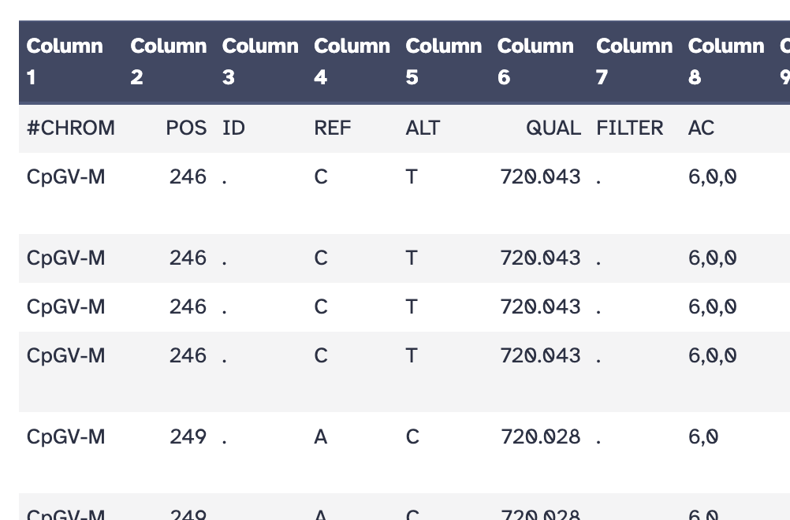
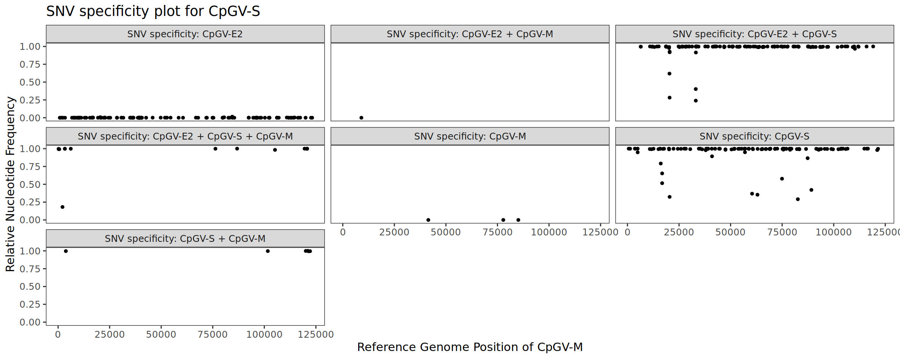
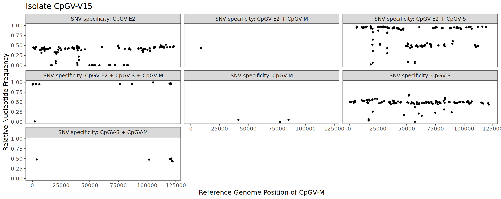

Baculoviruses of the family *Baculoviridae* () are among the most intensively 
studied viruses, not only because of their widespread application in biotechnology as protein expression 
systems, medicine, and as biological insecticides (, 
, , , ). 
Like all members of the class *Naldaviricetes*, 
baculoviruses have large circular dsDNA genomes that, in the family *Baculoviridae*, 
range from 90 to 180 kbp and can encode up to 180 open reading frames (ORFs). 
A detailed description of the biology of the Baculoviridae family can be found in the
official report of the International Committee on Taxonomy of Viruses (ICTV) (). A detailed summary can also be found on the [website of the ICTV](https://ictv.global/).

> <comment-title> A Baculovirus Genome </comment-title>
>
> The genome of the isolate Autographa californica multiple nucleopolyhedrovirus isolate C6 (AcMNPV-C6)
> (family *Baculoviridae*, genus *Alphabaculovirus*, species *Alphabaculovirus aucalifornicae*) is one of the 
> best-studied baculovirus genomes and is 133,894 bp long (). 
> It is the first fully sequenced genome of baculoviruses and today hundreds of genomes are fully sequenced
> and publically available at NCBI Genbank. The genome of AcMNPV-C6 encodes for 154 open reading frames (ORF)
> in both forward and reverse orientation (see figure). 
> So far, 38 ORFs were identified, which are encoded by all baculoviruses sequenced to date and are 
> called baculovirus core genes. In addition to the core genes, genes were found 
> that are encoded by baculoviruses from the genera *Alphabaculovirus* and *Betabaculovirus*. 
> 
> ")
>
{: .comment}

The genome size makes it difficult to study genetic variation within a baculovirus isolate, 
especially since the most commonly used sequencing technique (Illumina sequencing) 
generates only short reads and requires genome assembly. 
Since an isolate represents a population of viruses and their genomes that differ genetically from one another, 
the complexity of the analysis is further increased. 
Typically, genome assemblies are performed that lead to the generation of a consensus sequence, 
which usually reflects the majority of the sequenced virus population and intends to represent the entire isolate.
The problem is that the consensus sequence can mask genetic variability.
Tools for haplotype-sensitive assembly are available but so far have been established for viruses 
with a relatively short genome but not for baculoviruses or other large dsDNA viruses. 
Using Nanopore sequencing, it is possible to sequence significiant fragments of baculovirus genomes 
to determine major haplotypes (). 

SNVs have been proven as a powerful tool for analyzing the genetic variability of sequenced baculovirus isolates ().
SNVs are particularly useful for the analysis of intra-isolate specific
variation, as many bioinformatic workflows and tools are established for SNV determination 
and processing. For the identification of SNVs, Illumina sequencing data is mostly used, 
as this sequencing technique provides highly accurate reads with a very low probability 
of sequencing error. The data is usually provided and stored in FASTQ format.

When a baculovirus isolate is sequenced, a dataset of sequence reads is 
obtained that consists of a multitude of fragmented genomes and the exact reconstruction 
of individual whole genomes is no longer possible. However, variable SNV positions can 
be used as markers to count the frequency of the nucleotides that occur in the SNV positions. 
The determination of the nucleotides is only possible because not one but many genomes 
were sequenced. Therefore, the SNVs reflect the genetic variability of the isolate itself. 
Although deletions and insertions can also occur, these are not covered in this tutorial.

When multiple baculovirus isolates have been sequenced, SNV positions can be determined 
that are specific to only certain isolates. These specific SNV markers can then be used 
to identify an isolate based on sequencing data only, even when the isolate is present 
in a mixture with other isolates. To enable this identification of baculovirus isolates, 
SNV positions must be determined across multiple isolates using a common reference sequence. 
This reference serves as an anchor for the detected SNV positions and must be chosen with care. 
Based on the reference and the SNVs, SNV specificities can be determined for individual isolates.

The tutorial presented here aims to explain...
- the criteria for a suitable reference genome,
- a workflow that can be used to call SNVs across multiple sequenced baculovirus isolates,
- what is meant by SNV specificities and
- how to determine the composition of an isolate based on other previously sequenced baculovirus isolates.

The workflow is based on sequencing data from the Cydia pomonella granulovirus (CpGV) 
(family *Baculoviridae*, genus *Betabaculovirus*). CpGV is used commercially in agriculture 
for the biological control of larvae of the codling moth (*Cydia pomonella*), which cause 
significant losses to fruit crops, such as apples and pears.

> <agenda-title></agenda-title>
>
> In this tutorial, we will cover:
>
> 1. TOC
> {:toc}
>
{: .agenda}

# Dataset Preparation

Let's start at the very beginning with a new history and a detailed description 
of the sequencing datasets as well as the reference sequence. 
We will also have a closer look at the Illumina sequencing datasets, what we 
know so far about them and what we can expect from the analysis. By doing this, 
we will work our way towards our goal step by step.

> <hands-on-title>Prepare the Galaxy history</hands-on-title>
>
> 1. Create a new history for this analysis
>
>    
>
> 2. Rename the history
>
>    
>
{: .hands_on}

## Reference Genome from NCBI Genbank

Selecting the right or most suitable reference sequence is important if not critical for the entire analysis. The reference genome used in this tutorial is the Cydia pomonella granulovirus (Mexican isolate, CpGV-M). The function of the reference is to act as an anchor point to link detected SNV positions in all sequenced and analyzed isolates. Selecting a correct reference genome is critical because it must be as closely related as possible to the sequenced isolates. Therefore, it is best to use a reference from the same species that has been well analyzed by previous studies or the scientific community.  The following step will download the NCBI Accession Number `KM217575`, which corresponds to the `Cydia pomonella granulovirus isolate CpGV-M, complete genome`. It will later serve as the reference genome for the detection of SNV positions.  


> <hands-on-title> Reference genome download </hands-on-title>
>
> 1.  with the following parameters:
>    - *"Select source for IDs"*: `Direct Entry`
>        - *"ID List"*: `KM217575`
>    - *"Molecule Type"*: `Nucleotide`
>    - *"File Format"*: `FASTA` 
>    - Click Run Tool
>
>    > <warning-title>Use a single reference genome only!</warning-title>  
>    > **The NCBI Accession Download** tool accepts multiple NCBI accession numbers as input, which should be avoided, otherwise the workflow will fail. If you still want to use multiple reference genomes, then I recommend to run the entire workflow for each reference genome separately.
>    {: .warning}
>
> 2.  with the following parameters:
>    -  *"Collection of files to collapse into single dataset"*: `NCBI Accession Download on: Downloaded files` (output of **NCBI Accession Download** )
>    - Click Run Tool
>
>    > <comment-title> Collapse Genbank files </comment-title>
>    > **NCBI Accession Download** accepts multiple accession numbers and creates a list as output. 
>    > Therefore, its output can contain multiple records. For this analysis just one reference genome
>    > is required and the list needs to be converted into a single file.
>    {: .comment}
>
> 3.  with the following parameters:
>    -  *"File to process"*: the collapsed collection containing the single reference genome; output of **Collapse Collection** 
>    - In *"Replacement"*:
>         - *"Find pattern"*: `^>.*$`
>         - *"Replace with:"*: `>CpGV-M `
>    - Click Run Tool
>
>    > <comment-title> What the tool does... </comment-title>
>    > The find pattern `^>.*$` searches for the `>` and all characters that follow.
>    > Then everything (the entire line) is replaced by `>CpGV-M`. 
>    {: .comment}
>
>    > <comment-title> Why we change the name... </comment-title>
>    > The reference genome is stored in a single file in FASTA format. After downloading from NCBI, the name of the reference is `>KM217575.1 Cydia pomonella granulovirus isolate CpGV-M, complete genome`. The name is very long and can cause issues during later analysis (in R or Python). Therefore, I recommend to replace the name with the **Replace text in entire line** tool.
>    {: .comment}
>
{: .hands_on}

## Paired-end Sequencing Data from NCBI SRA

The tutorial is based on Illumina data sets from several isolates of the Cydia pomonella granulovirus (CpGV). 
The CpGV is one of the most well-studied baculoviruses because many isolates have been sequenced and sequence 
data sets are available at NCBI Genbank and NCBI SRA. We will use four CpGV isolates to decipher their 
intra-isolate specific variation and try to draw conclusions about the isolate's homogeneity or heterogeneity. 
We will also encounter a mixed isolate (a more or less clean mixture of other previously sequenced CpGV isolates) 
and learn how to recognize it. In addition, we will learn how to determine the composition 
of this mixed isolate based on other sequenced CpGV isolates.

> <comment-title> Detailed CpGV Isolate Information </comment-title>
>
> For those who want to delve deeper into the data sets, I have provided a table with links to NCBI SRA and related publications.
>
> | Isolate | NCBI Genbank | NCBI SRA | Reference |
> |:------------------:|:------------------:|:------------------:|:------------------:|
> | CpGV-M | KM217575 | [SRR31589148](https://trace.ncbi.nlm.nih.gov/Traces?run=SRR31589148) | 
> | CpGV-S | KM217573 | [SRR31589147](https://trace.ncbi.nlm.nih.gov/Traces?run=SRR31589147) |  |
> | CpGV-E2 | KM217577 | [SRR31589146](https://trace.ncbi.nlm.nih.gov/Traces?run=SRR31589146) |  |
> | CpGV-V15 | No assembly available | [SRR31679023](https://www.ncbi.nlm.nih.gov/sra/SRX27041396) |  |
{: .comment}

Follow the steps below to download the four Illumina datasets published at NCBI SRA.

> <hands-on-title>NCBI SRA Data Download</hands-on-title>
>
>    Run  with the following parameters:
>
>    - *"Select input type"*: `SRR accession`
>    - *Accession*: `SRR31589146, SRR31589147, SRR31589148, SRR31679023`
>    - *Select output format*: `gzip compressed fastq`
>    - Click Run Tool
>
>    > <comment-title> Take a cup of coffee </comment-title>
>    > Downloading the data from NCBI SRA may take a while.
>    > It is a good opportunity to have a cup of coffee or tea.
>    {: .comment}
>
{: .hands_on}

# Read Preprocessing and Quality Control

After the reference genome and the paired-end Illumina reads are loaded in the history, 
it is time to start the analysis. First, the reads need to be adapter trimmed and
quality filtered. 

> <tip-title>Learn more about quality of reads!</tip-title>
> Before and after trimming, it is usually a good idea to check the quality of the reads using FASTQC. 
> However, we will omit this step here. 
> If you are interested in learning more about read quality, I recommend the check the [Galaxy Training Quality Control](  ) tutorial.
{: .tip}


> <hands-on-title> Task description </hands-on-title>
>
> 1.  with the following parameters:
>    - *"Is this library paired- or single-end?"*: `Paired Collection`
>        -  *"Select a paired collection"*: `Paired-end data (fastq-dump)` (output of **Download and Extract Reads in FASTQ format from NCBI SRA** )
>    - *"Advanced settings"*: `Full parameter list`
>        - *"Trim low-quality ends from reads in addition to adapter removal (Enter phred quality score threshold)"*: `30`
>        - *"Discard reads that became shorter than length N"*: `50`
>        - *"specify if you would like to retain unpaired reads"*: `Do not output unpaired reads`
>    - *"RRBS specific settings"*: `Use defaults (no RRBS)`
>    - *"Trimming settings"*: `Use defaults`
>    - Click Run Tool
>
{: .hands_on}


# Mapping of Reads to the Reference Genome

Now the filtered reads of the individual isolates are mapped independently against the CpGV-M reference. 
The key is that each isolate is mapped separately against the identical reference genome, so that in the end we get a Binary Alignment Mapping (BAM) file for each isolate.
After that, everything we do with the sequence data is linked to the common reference.

> <hands-on-title> Read mapping using bcftools </hands-on-title>
>
> 1.  with the following parameters:
>    - *"Will you select a reference genome from your history or use a built-in index?"*: `Use a genome from history and build index`
>        -  *"Use the following dataset as the reference sequence"*: the renamed reference genome in FASTA format, output of **Replace Text in entire line** 
>    - *"Single or Paired-end reads"*: `Paired Collection`
>        -  *"Select a paired collection"*: the trimmed paired read collection, generated as output of **Trim Galore!** 
>    - *"Set read groups information?"*: `Set read groups (Picard style)`
>        - *"Auto-assign"*: `Yes`
>        - *"Auto-assign"*: `Yes`
>        - *"Auto-assign"*: `Yes`
>    - *"Select analysis mode"*: `1.Simple Illumina mode`
>    - Click Run Tool
>
{: .hands_on}


# SNP Calling and Variant Detection

The key part of the analysis is the determination of variable SNV positions, which is carried out in the following step. 
Insertions/Deletions (indels) are deliberately omitted because they are not relevant for this analysis.

> <hands-on-title> Variable SNV positions </hands-on-title>
>
> 1.  with the following parameters:
>    - *"Alignment Inputs"*: `Multiple BAM/CRAMs`
>        -  *"Input BAM/CRAMs"*: the BAM file collection; output of **Map with BWA-MEM** 
>    - *"Choose the source for the reference genome"*: `History`
>        -  *"Genome Reference"*: the renamed reference genome in FASTA format, output of **Replace Text in entire line** 
>    - In *"Indel Calling"*:
>        - *"Perform INDEL calling"*: `Do not perform INDEL calling`
>    - In *"Input Filtering Options"*:
>        - *"Max reads per BAM"*: `1024`
>        - *"Set filter by flags"*: `Do not filter`
>        - *"Quality Options"*: `defaults`
>        - *"Select read groups to include or exclude"*: `use defaults`
>    - In *"Restrict to"*:
>        - *"Regions"*: `Do not restrict to Regions`
>        - *"Targets"*: `Do not restrict to Targets`
>    - In *"Output options"*:
>        - *"Optional tags to output"*: `DP (Number of high-quality bases)`
>        - *"Optional tags to output"*: `DPR (Number of high-quality bases for each observed allele)`
>    - *"Output type"*: `uncompressed VCF`
>    - Click Run Tool
>
>    > <comment-title> What bcftools mpileup does... </comment-title>
>    > bcftools mpileup calculates the nucleotide coverage for each position in the reference genome based on the input BAM files. It enables preparation for variant analysis. 
>    {: .comment}
>
> 2.  with the following parameters:
>    -  *"VCF/BCF Data"*: the uncompressed VCF file; output of **bcftools mpileup** 
>    - In *"Restrict to"*:
>        - *"Regions"*: `Do not restrict to Regions`
>    - In *"Consensus/variant calling Options"*:
>        - *"Calling method"*: `Multiallelic and rare-variant caller`
>            - *"Constrain"*: `Do not constrain`
>                - *"Targets"*: `Do not restrict to Targets`
>    - In *"File format Options"*:
>        - *"Regions"*: `Do not restrict to Regions`
>    - In *"Input/output Options"*:
>        - *"Keep alts"*: `Yes`
>        - *"Output variant sites only"*: `Yes`
>    - *"Output type"*: `uncompressed VCF`
>    - Click Run Tool
>
>    > <comment-title> What bcftools call does... </comment-title>
>    > bcftools call performs the actual variant detection. It removes non variant and keeps variant sites only.
>    {: .comment}
>
{: .hands_on}

What you get is a file in Variant Call Format (VCF), which can be difficult to understand at first glance. It is important to note that the file begins with a large header, lines that begin with two hashtags (##), which contain details of the analysis and the data set. After the header, there is a table with a line that contains the column names. This line begins with just one hashtag (#). After that, the results are displayed in a tab-separated format. In our VCF example, some columns have the following abbreviations and meanings (I just selected a few that are important to us in this tutorial):

| Fixed fields  | Description  |
|---:|:---|
|**CHROM**  |Chromosome (name of the reference, in our case CpGV-M)  |
|**POS**  |Position (position in the reference genome)   |
|**REF**  |Nucleotide of the Referance at the corresponding position (POS)   |
|**ALT**   |Alternative nucleotides detected at this position in the sequencing data.   |
|**FORMAT**   |Describes the content of the *sample column* reported in the VCF file. In our case GT:PL:DP:DPR.           |
|**SRR31589146**   |1st isolate: The results for the sequence data SRR31589146 in the format specified in FORMAT.   |
|**SRR31589147**   |2nd isolate: The results for the sequence data SRR31589147 in the format specified in FORMAT.   |
|**SRR31589148**   |3rd isolate: The results for the sequence data SRR31589148 in the format specified in FORMAT.   |
|**SRR31679023**   |4th isolate: The results for the sequence data SRR31679023 in the format specified in FORMAT.   |


To understand how the data is stored, we have to look at FORMAT in detail. This is where two values are of great importance: DP and DPR.

|Genotype&nbsp;field|Description   |
|---:|:---|
|**DP**   |Read depth (number of nucleotides) at this position for this isolate.   |
|**DPR**   |The read depth for each allele. Here, the first value corresponds to the reference nucleotide (REF), the second to the first possible allele (ALT1), the second to the second possible allele (ALT2) and the third value to the last possible allele (ALT3).

> <comment-title>DPR functional, but deprecated</comment-title>
> If you start **bcftools mpileup** with the *Optional tags to output* `DPR (Number of high-quality bases for each observed allele)` option, you will see a warning in the information panel of the VCF file: `[warning] tag DPR functional but deprecated. Please switch to AD in future.` At the time of writing this tutorial, I was using DPR. It works the same way with *Optional tags to output* option `AD` (instead of DPR), but you will need to adjust something later in the workflow. The tutorial will be switched to AD in the near future. For now, we stick with DPR.
{: .comment}

> <tip-title>Learn more about variant analysis on diploid and non-diploid data!</tip-title>
> Also take a look at other tutorials that deal with non-diploid (but also diploid) data sets to perform a variant analysis. Broadening your horizons is always important. I recommend the check the tutorials on ... 
> * [Calling variants in diploid systems](  ) and.
> * [Calling variants in non-diploid systems](  ).
> 
> Maybe later? Then let's continue.
{: .tip}

# VCF to Table Transformation

Now we come to an exciting part, because we have all the information we need to analyse the genetic variation within the sequenced virus isolates. The data is only hidden in the VCF file and is difficult for the beginner in bioinformatics to see. We have the positions (`POS`), which were detected as variable in the virus isolates. In addition, we know the number of all reads (and thus also nucleotides) in these positions (represented by `DP`). By using `DPR`, we obtain information on how often the alleles (the four possible nucleotides) occur at a particular position. To analyse `DP` and `DPR`, we first have to access it because the information is hidden in each *sample column* in the `FORMAT` genotype data. If we look at the first position `POS = 246` in sample column `SRR31589146`, the following data is visible:     
`1/1:255,134,0,255,255,255,255,255,255,255:886:107,773,6,0`.  
The information provided by the FORMAT field explains the division of the data by colons: `GT:PL:DP:DPR`.

We can break it down like this...

| FORMAT genotype field  | Value                                 |
|-----------------------:|:--------------------------------------|
|GT                      |1/1                                    |
|PL                      |255,134,0,255,255,255,255,255,255,255  |
|DP                      |886                                    |
|DPR                     |107,773,6,0                            |

GT = Genotype information, which cannot be used with virus isolates!  
PL = Phred-scaled genotype likelihood (also not useable for us, because we do not have a diploid organism!)

DPR can be broken down even further, since the individual values, which are separated by commas this time, can be assigned to the reference or the alternative nucleotides. In a virus isolate, four nucleotides (A, T, G and C) can theoretically occur at each position. One nucleotide defines the reference, leaving three alternatives: first (`ALT1`), second (`ALT2`) and third (`ALT3`) alternative. 


|CHROM   |POS   |DP   |DPR           | ALT1  |ALT2    |ALT3  |  
|:------:|:----:|:---:|:------------:|:-----:|:------:|:----:|
|CpGV-M  |246   |886  |107,773,6,0   |773    |6       |0     |

If we now divide the absolute frequencies of `ALT1 = 773`, `ALT2 = 6` and `ALT3 = 0` by `DP = 886`, we get the relative frequencies (`REL.ALT`):

|ALLELE     |REL.ALT     |
|:---------:|:----------:|
|ALT1       |0.87246     |
|ALT2       |0.00677201  |
|ALT3       |0           |


> <hands-on-title> Transfrom VCF to tab-delimited table </hands-on-title>
>
> 1.  with the following parameters:
>    -  *"Select VCF dataset to convert"*: the filtered VCF file; output of **bcftools call** 
>    - *"Fill empty fields with"*: `NULL`
>    - Click Run Tool
>
>    > <comment-title> An easier-to-read table </comment-title>
>    > This tool creates a table from the VCF file. The columns are tab-delimited. Take a look at the table and see if it is now easier to read. It can also be imported to R/RStudio/Excel more easily.
>    {: .comment}
>
> 2.  with the following parameters:
>    -  *"File to process"*: the tab-delimited VCF table; output of **VCFtoTab-delimited** 
>    - *"AWK Program"*: *Paste the code from the code box below.*
> > <code-in-title>awk</code-in-title>
> > ```
> > BEGIN { FS="\t"; OFS="\t" }
> > NR == 1 {
> > 
> >     # Rename "SAMPLE" to "ISOLATE" in the header
> >     for (i = 1; i <= NF; i++) {
> >         if ($i == "SAMPLE") $i = "ISOLATE";
> >     }
> >     # Identify column indices based on header names
> >     for (i = 1; i <= NF; i++) {
> >         if ($i == "POS") pos_col = i;
> >         if ($i == "ISOLATE") isolate_col = i;
> >         if ($i == "DP") dp_col = i;
> >         if ($i == "DPR") dpr_col = i;
> >     }
> >     # Check if all required columns are found
> >     if (!(pos_col && isolate_col && dp_col && dpr_col)) {
> >         print "Error: One or more required columns (POS, ISOLATE, DP, DPR) are missing." > "/dev/stderr";
> >         exit 1;
> >     }
> >     # Print the new header
> >     print $0, "ALLELE", "DPR.ALLELE", "REL.ALT", "REL.ALT.0.05";
> >     next;
> > }
> > {
> >     # Create a unique key for position and isolate
> >     pos_isolate_key = $(pos_col) "_" $(isolate_col);
> > 
> >     if (last_pos != $(pos_col)) {  # When a new position starts
> >         delete isolate_count;      # Reset the isolate counter
> >         last_pos = $(pos_col);     # Update the current position
> >     }
> > 
> >     # Split the DPR column into values
> >     split($(dpr_col), dpr_values, ",");
> > 
> >     # Count occurrences of each isolate per position
> >     isolate_count[$(isolate_col)]++;
> >     dpr_index = isolate_count[$(isolate_col)] + 1;  # Index for the alternate allele (starting at 2)
> > 
> >     # Check if the index is valid
> >     if (dpr_index <= length(dpr_values)) {
> >         allele = "ALT" (dpr_index - 1);            # Determine the allele
> >         dpr_value = dpr_values[dpr_index];         # Get the corresponding DPR value
> >         rel_alt = (dpr_value / $(dp_col));         # Calculate REL.ALT (DPR.ALLELE / DP)
> >         rel_alt_filtered = (rel_alt >= 0.05) ? rel_alt : 0;  # Filter REL.ALT values < 0.05
> >         print $0, allele, dpr_value, rel_alt, rel_alt_filtered;  # Output with new columns
> >     }
> > }
> > ```
> {: .code-in}
>
>    - Click Run Tool
> 
>    > <comment-title> Create ALLELE and REL.ALT columns </comment-title> 
>    > The **Text reformatting with awk** tool allows the use of AWK code. AWK is for text processing and to performing complex tasks on data sets (such as tab-delimited files). We will come across AWK scripts again later. Here is a brief summary of what it does: 
>    > * Splitting `DPR` data into separate allele counts.   
>    > * Calculating the relative allele frequencies (`REL.ALT`) for each allele.  
>    > * Filtering out relative frequencies below a threshold of 0.05 and storing the result in `REL.ALT.0.05`.  
>    {: .comment}
>
{: .hands_on}


The output table is complex and shows the relative frequency (`REL.ALT`) for each of the three alternative alleles/nucleotides (`ALT1`, `ALT2` and `ALT3`) in each position (`POS`) and sequenced CpGV isolate (`ISOLATE`). In column `REL.ALT.0.05`, values of the `REL.ALT < 0.05` were set to 0 to set a threshold. We will see later why this is sometimes important.

Below is the table with selected relevant columns only. `REL` and `ALT` show the reference and alternative nucleotide, respectively.    

| CHROM  | POS | REF | ALT | ISOLATE     | DP  | DPR         | ALLELE | DPR.ALLELE | REL.ALT    | REL.ALT.0.05 |
|--------|-----|-----|-----|-------------|-----|-------------|--------|------------|------------|--------------|
| CpGV-M | 246 | C   | T   | SRR31589146 | 886 | 107,773,6,0 | ALT1   | 773        | 0.87246    | 0.873446     |
| CpGV-M | 246 | C   | G   | SRR31589146 | 886 | 107,773,6,0 | ALT2   | 6          | 0.00677201 | 0            |
| CpGV-M | 246 | C   | A   | SRR31589146 | 886 | 107,773,6,0 | ALT3   | 0          | 0          | 0            |
| CpGV-M | 246 | C   | T   | SRR31589147 | 881 | 5,875,1,0   | ALT1   | 875        | 0.99319    | 0.994305     |
| CpGV-M | 246 | C   | G   | SRR31589147 | 881 | 5,875,1,0   | ALT2   | 1          | 0.00113507 | 0            |
| CpGV-M | 246 | C   | A   | SRR31589147 | 881 | 5,875,1,0   | ALT3   | 0          | 0          | 0            |
| CpGV-M | 246 | C   | T   | SRR31589148 | 935 | 800,133,1,1 | ALT1   | 133        | 0.142246   | 0.142398     |
| CpGV-M | 246 | C   | G   | SRR31589148 | 935 | 800,133,1,1 | ALT2   | 1          | 0.00106952 | 0            |
| CpGV-M | 246 | C   | A   | SRR31589148 | 935 | 800,133,1,1 | ALT3   | 1          | 0.00106952 | 0            |
| CpGV-M | 246 | C   | T   | SRR31679023 | 839 | 42,797,0,0  | ALT1   | 797        | 0.94994    | 0.950296     |
| CpGV-M | 246 | C   | G   | SRR31679023 | 839 | 42,797,0,0  | ALT2   | 0          | 0          | 0            |
| CpGV-M | 246 | C   | A   | SRR31679023 | 839 | 42,797,0,0  | ALT3   | 0          | 0          | 0            |


## Replace SRA Names with Virus Abbreviations

One thing that stands out are the NCBI SRA numbers in the ISOLATE column, which have been automatically extracted from the NCBI SRA datasets. Since it is difficult to remember which virus isolate is behind which number, we can replace these accession numbers with proper names, e.g. virus isolate abbreviations. This makes the table even easier to read and later we can use the information directly to display the SNV positions. 

> <hands-on-title> Replace SRA accession numbers by virus isolate abbreviations </hands-on-title>
>
> 1.  with the following parameters:
>    -  *"File to process"*: the reformatted VCF table; output of **Text reformatting with awk:** 
>    - In *"Replacement"*:
>        -  *"Insert Replacement"*
>            - *"in column"*: `c25`
>            - *"Find pattern"*: `SRR31589148`
>            - *"Replace with"*: `CpGV-M`
>        -  *"Insert Replacement"*
>            - *"in column"*: `c25`
>            - *"Find pattern"*: `SRR31589147`
>            - *"Replace with"*: `CpGV-S`
>        -  *"Insert Replacement"*
>            - *"in column"*: `c25`
>            - *"Find pattern"*: `SRR31589146`
>            - *"Replace with"*: `CpGV-E2`
>        -  *"Insert Replacement"*
>            - *"in column"*: `c25`
>            - *"Find pattern"*: `SRR31679023`
>            - *"Replace with"*: `CpGV-V15`
>    - Click Run Tool
>
>    > <question-title>What is replaced by what?</question-title>
>    > 1. Can you say which SRA number was replaced by which isolate abbreviation?
>    >    > <solution-title></solution-title>
>    >    > * SRR31589148 was replaced by CpGV-M  
>    >    > * SRR31589147 was replaced by CpGV-S  
>    >    > * SRR31589146 was replaced by CpGV-E2  
>    >    > * SRR31679023 was replaced by CpGV-V15  
>    >    {: .solution}
>    {: .question}
>
{: .hands_on}

## Reduce Complexity of SNV Table to First Alternative

Based on the SNV table, we can see that three possible nucleotides (alleles) occur in most positions. After filtering with a minimum threshold of REL.ALT > 0.05, many relative frequencies of ALT2 and ALT3 are set to zero. At least it is visible that in the vast majority of positions only the first alternative has a value of > 0.05. Thus, two nucleotides usually occur in the detected SNV positions: the reference nucleotide (REF) and the nucleotide of the first alternative (ALT1). We want to reduce the complexity of the data set and only consider ALT1 in the further course of this tutorial.

> <hands-on-title>Keep only ALT1 and remove ALT2 and ALT3</hands-on-title>
>
> 1.  with the following parameters:
>    -  *"Filter"*: the VCF table with the replaced isolate abbreviations; output of **Replace Text in a specific column** 
>    - *"With following condition"*: `c30=='ALT1'`
>    - *"Numbers of header ines to skip"*: `1`
>    - Click Run Tool
>
>    > <question-title>How can you check whether only two nucleotides occur (mostly) per SNV position?</question-title>
>    > Think about an option how the occurance of one, two, three or four nucleotides per SNV position can be analyzed.
>    >    > <solution-title></solution-title>
>    >    > When looking only at a table with several columns and numbers, it is difficult to understand that mainly a reference and one alternative nucleotide were detected in the SNV positions. 
>    >    > One way to examine the frequency of a second or third alternative nucleotide is to filter the table with `c30=='ALT2'` or `c30=='ALT3'` instead of `c30=='ALT1'`.
>    >    > The resulting table can be used to create a distribution over the `REL.ALT` values in column 32 (`c32`).
>    >    >
>    >    > You can perform this analysis by using the following tools: **Filter data on any column using simple expressions** , **Cut columns from a table**  to extract column 32 (`c32`), which corresponds to `REL.ALT`
>    >    > and **Histogram with ggplot2** .
>    >    >
>    >    > This task is left to you as a small challenge, if you like. It is up to you to familiarise yourself with the individual tools,
>    >    > but it could be worth it, as it could help you understand why we do not consider ALT2 and ALT3 further in the next steps.
>    >    {: .solution}
>    {: .question}
>
>    > <warning-title>Be careful when removing data!</warning-title>  
>    > The data sets used here have already been analysed extensively and for this tutorial only the first alternative nucleotide (allele) is sufficient to explain the further workflow. Always be sure what you are doing when you remove data! Always ask yourself if you are allowed to do it and what the consequences might be. 
>    {: .warning}
>
{: .hands_on}

# Visualizing SNV Variability Across Isolates

The final table should be much easier to read and contain all the information we need to perform an analysis of the intra-isolate specific variability. Here is a short overview of the final table (selected columns) and its first three SNV positions:  

| CHROM  | POS | REF | ALT | ISOLATE  | DP  | DPR         | ALLELE | DPR.ALLELE | REL.ALT  | REL.ALT.0.05 |
|--------|-----|-----|-----|----------|-----|-------------|--------|------------|----------|--------------|
| CpGV-M | 246 | C   | T   | CpGV-E2  | 886 | 107,773,6,0 | ALT1   | 773        | 0.87246  | 0.87246      |
| CpGV-M | 246 | C   | T   | CpGV-S   | 881 | 5,875,1,0   | ALT1   | 875        | 0.99319  | 0.99319      |
| CpGV-M | 246 | C   | T   | CpGV-M   | 935 | 800,133,1,1 | ALT1   | 133        | 0.142246 | 0.142246     |
| CpGV-M | 246 | C   | T   | CpGV-V15 | 839 | 42,797,0,0  | ALT1   | 797        | 0.94994  | 0.94994      |
| CpGV-M | 249 | A   | C   | CpGV-E2  | 888 | 106,780,1   | ALT1   | 780        | 0.878378 | 0.878378     |
| CpGV-M | 249 | A   | C   | CpGV-S   | 881 | 2,879,0     | ALT1   | 879        | 0.99773  | 0.99773      |
| CpGV-M | 249 | A   | C   | CpGV-M   | 938 | 799,139,0   | ALT1   | 139        | 0.148188 | 0.148188     |
| CpGV-M | 249 | A   | C   | CpGV-V15 | 843 | 48,793,2    | ALT1   | 793        | 0.940688 | 0.940688     |
| CpGV-M | 564 | T   | C   | CpGV-E2  | 964 | 98,856,9,1  | ALT1   | 856        | 0.887967 | 0.887967     |
| CpGV-M | 564 | T   | C   | CpGV-S   | 947 | 1,940,6,0   | ALT1   | 940        | 0.992608 | 0.992608     |
| CpGV-M | 564 | T   | C   | CpGV-M   | 976 | 821,154,1,0 | ALT1   | 154        | 0.157787 | 0.157787     |
| CpGV-M | 564 | T   | C   | CpGV-V15 | 880 | 33,846,1,0  | ALT1   | 846        | 0.961364 | 0.961364     |

We can now start the first visualisation and create a plot for each CpGV isolate (`ISOLATE`), plotting the position of the SNV (`POS`) against the relative frequency of the alternative nucleotide (`REL.ALT`). Note that we are not using the REL.ALT threshold values because we want to look at the unfiltered data.

> <hands-on-title>SNV plot</hands-on-title>
>
> 1.  with the following parameters:
>    -  *"Input in tabular format"*: the ALT1-filtered VCF table; output of **Filter data on any column using simple expressions** 
>    - *"Column to plot on x-axis"*: `2`
>    - *"Column to plot on y-axis"*: `32`
>    - *"Plot title"*: `SNV plot`
>    - *"Label for x axis"*: `Reference Genome Position of CpGV-M`
>    - *"Label for y axis"*: `Relative Nucleotide Frequency `
>    - In *"Advanced options"*:
>        - *"Type of plot"*: `Points only (default)`
>            - *"Data point options"*: `Default`
>        - *"Plotting multiple groups"*: `Plot multiple groups of data on individual plots`
>            - *"column differentiating the different groups"*: `25`
>        - *"Axis title options"*: `Default`
>        - *"Axis text options"*: `Default`
>        - *"Plot title options"*: `Default`
>        - *"Grid lines"*: `Hide major and minor grid lines`
>        - *"Axis scaling"*: `Automatic axis scaling`
>    - In *"Output Options"*:
>        - *"Unit of output dimensions"*: `Centimeters (cm)`
>        - *"width of output"*: `20.0`
>        - *"height of output"*: `12.0`
>        - *"dpi of output"*: `200.0`
>    - Click Run Tool
>
>    > <comment-title> Column names and numbers </comment-title>
>    > To provide ggplot2 with the data for the X- and Y-axis, column numbers must be passed to the function. You have to check which column numbers the columns `POS` and `REL.ALT` have. In addition, ggplot2 offers the option of splitting the data according to `ISOLATE`, to obtain a separate plot for each value in ISOLATE. 
>    > * `POS` = column 2  
>    > * `REL.ALT` = column 32  
>    > * `ISOLATE` = column 25  
>    > 
>    {: .comment}
>
{: .hands_on}

As a result, we get a SNV plot that shows the relative frequency of the first alternative nucleotide in all variable SNV positions. Before we have a closer look at the data, we have to remember that all the sequencing data (= the reads) were mapped during this workflow against the reference genome of CpGV-M. For that reason, all isolates are compared to the genome of CpGV-M. We see that CpGV-E2 has a heterogeneous SNV pattern. CpGV-M appears homogeneous but with relatively few genetic variation – but keep in mind that the sequence data of CpGV-M was mapped against its own reference, which is why one might assume less variability. For CpGV-S, the variability is also homogeneous, but many SNV positions have a nucleotide frequency close to one. This could indicate that the isolate is homogeneous but different from the reference CpGV-M. For isolate CpGV-V15, a SNV cloud occurs at approximately 0.5 (50%), which could indicate a mixed isolate. By “mixed”, it is meant that two or more (homogenous) isolates occur in a certain ratio in this isolate.

 plot of all variable positions in the sequenced CpGV isolates CpGV-E2 (top left), CpGV-M (top right), CpGV-S (bottom left) and CpGV-V15 (bottom right). Each point represents the relative frequency of the first alternative nucleotide (allele).")

# SNV Specificity Determination

Now we come to the last but most complex section of this tutorial - determining SNV specificities. We have seen that CpGV-V15 is a mixed isolate. Now we want to find out which isolates were mixed and how this SNV pattern can be explained. In the next step, we will consider  SNV positions as markers and look for SNV positions that are only variable for one or more sequenced isolates of CpGV. If a SNV position is only variable for CpGV-S (i.e. the relative frequency is greater than 0; `REL.ALT > 0`) but is equal to zero for the other isolates, then this position is a marker for CpGV-S, or specific for CpGV-S. Since we cannot perform this determination by hand for all positions, I have written a small program implemented in the **Text reformatting with awk** tool that does the work for us. 

Before we get started, I would like to explain specificity in more detail using an example. First, we decide that we want to determine the specificities for the SNV positions for the following isolates:
* CpGV-M
* CpGV-S
* CpGV-E2.  

Isolate CpGV-V15 is not included in the analysis of SNV specificity determination because we want to explain its composition later with the other data sets.  

The principle behind SNV specificities and how they are determined can be explained by the table below. In the first position 249, all isolates (CpGV-E2, CpGV-S and CpGV-M) have a relative nucleotide frequency > 0. This means that all three sequenced isolates have an alternative nucleotide at this position, with frequencies of 14.7%, 88% and >99% for CpGV-M, CpGV-E2 and CpGV-S, respectively. The remaining percentages are the reference nucleotide. Note that I am using the `REL.ALT.0.05` values, which are based on the threshold of 0.05 (values < 0.05 were set to zero). By this, the tutorial is simplified. Position 249 is thus variable for all three sequenced isolates and therefore specific for `CpGV-E2 + CpGV-S + CpGV-M`.
In the second position 603, only CpGV-E2 has an alternative nucleotide, its `REL.ALT.0.05 > 0`. The isolates of CpGV-S and CpGV-M show no variability in position 603 and are therefore identical to the reference. Thus, `position 603 is specific for CpGV-E2`. If we apply the same logic to positions 1278 and 6393, we can see that `position 1278 is specific for CpGV-S` and `position 6393 is specific for CpGV-E2 and CpGV-S`.  
If we now wanted to detect specifically isolate CpGV-S and CpGV-E2 in a mixture, positions 603 and 1278 could serve as markers.    

|  POS   | REL.ALT0.05 (CpGV-E2) | REL.ALT0.05 (CpGV-S)  | REL.ALT0.05 (CpGV-M)  | SNV Specificity               |  
|--------|-----------------------|-----------------------|-----------------------|-------------------------------|
|249     | 0.878378              | 0.99773               | 0.148188              | CpGV-E2 + CpGV-S + CpGV-M     |
|603     | 1                     | 0                     | 0                     | CpGV-E2                       |
|1278    | 0                     | 0.998963              | 0                     | CpGV-S                        |
|6393    | 0.98847               | 0.997783              | 0                     | CpGV-E2 + CpGV-S              |

Let us run the tool below to determine the SNV specificities of our dataset.  

> <hands-on-title> SNV specificity determination </hands-on-title>
>
> 1.  with the following parameters:
>    -  *"File to process"*: the ALT1-filtered VCF table; output of **Filter data on any column using simple expressions** 
>    - *"AWK Program"*: *Paste the code from the code box below.*
> > <code-in-title>awk</code-in-title>
> > ```
> > BEGIN { FS="\t"; OFS="\t" }
> > NR == 1 {
> >     # Dynamically find column indices based on header names
> >     for (i = 1; i <= NF; i++) {
> >         if ($i == "POS") pos_col = i;
> >         if ($i == "ALLELE") allele_col = i;
> >         if ($i == "ISOLATE") isolate_col = i;
> >         if ($i == "REL.ALT.0.05") rel_alt_col = i;
> >     }
> > 
> >     # Check if all required columns were found
> >     if (!(pos_col && allele_col && isolate_col && rel_alt_col)) {
> >         print "Error: Required columns (POS, ALLELE, ISOLATE, REL.ALT.0.05) are missing." > "/dev/stderr";
> >         exit 1;
> >     }
> > 
> >     # Print the header and add the new SPEC column
> >     print $0, "SPEC";
> >     next;
> > }
> > 
> > {
> >     # When reaching a new position, prepare the specificity
> >     if ($(pos_col) != current_pos) {
> >         # Assign the calculated specificity to all rows of the current position
> >         for (i in pos_lines) {
> >             # Add "SNV specificity: " before the specificity value
> >             final_spec = (specificity == "" ? "0" : "SNV specificity: " specificity);
> >             print pos_lines[i], final_spec;
> >         }
> >         # Reset variables for the new position
> >         delete pos_lines;
> >         specificity = "";
> >         current_pos = $(pos_col);
> >     }
> > 
> >     # Save the current row for later
> >     pos_lines[NR] = $0;
> > 
> >     # Conditions for calculating specificity
> >     if ($(allele_col) == "ALT1" && 
> >         ($(isolate_col) == "CpGV-E2" || $(isolate_col) == "CpGV-S" || $(isolate_col) == "CpGV-M") && 
> >         $(rel_alt_col) > 0) {
> >         # Concatenate isolate names with " + " if REL.ALT.0.05 > 0
> >         specificity = (specificity == "" ? $(isolate_col) : specificity " + " $(isolate_col));
> >     }
> > }
> > 
> > END {
> >     # Assign the specificity to the last position
> >     for (i in pos_lines) {
> >         # Add "SNV specificity: " before the specificity value
> >         final_spec = (specificity == "" ? "0" : "SNV specificity: " specificity);
> >         print pos_lines[i], final_spec;
> >     }
> > }
> > ```
> {: .code-in}
>
>    - Click Run Tool
> 
>
{: .hands_on}

# Visualization of Variable SNV Positions by Specificity

Now, the VCF table has an additional column called `SPEC`, which indicates the SNV specificity for each position. This allows us to create a special SNV plot for each isolate. The special thing about this is that a separate plot is created for each isolate and each specificity. Since we can only look at each isolate individually, we first have to filter out the data for one isolate, we start with CpGV-S. After that, a plot is created for each SNV specificity for the CpGV-S isolate.  

> <hands-on-title> Extract data for one isolate only </hands-on-title>
>
> 1.  with the following parameters:
>    -  *"Filter"*: the VCF table with determined SNV specificities; output of **Text reformatting with awk** 
>    - *"With following condition"*: `c25=='CpGV-S'`
>    - *"Number of header lines to skip"*: `1`
>    - Click Run Tool
>
>    > <comment-title> Filtering the CpGV-S data </comment-title>
>    >
>    > The VCF SNV table is reduced to the data of CpGV-S. This is done by filtering on column 25 (ISOLATE).
>    {: .comment}
>
>
> 2.  with the following parameters:
>    -  *"Input in tabular format"*: the VCF table for CpGV-S; output of **Filter data on any column using simple expressions** 
>    - *"Column to plot on x-axis"*: `2`
>    - *"Column to plot on y-axis"*: `32`
>    - *"Plot title"*: `Isolate CpGV-S`
>    - *"Label for x axis"*: `Reference Genome Position of CpGV-M`
>    - *"Label for y axis"*: `Relative Nucleotide Frequency`
>    - In *"Advanced options"*:
>        - *"Type of plot"*: `Points only (default)`
>            - *"Data point options"*: `Default`
>        - *"Plotting multiple groups"*: `Plot multiple groups of data on individual plots`
>            - *"column differentiating the different groups"*: `34`
>        - *"Axis title options"*: `Default`
>        - *"Axis text options"*: `Default`
>        - *"Plot title options"*: `Default`
>        - *"Grid lines"*: `Hide major and minor grid lines`
>        - *"Axis scaling"*: `Automatic axis scaling`
>    - In *"Output Options"*:
>        - *"Unit of output dimensions"*: `Centimeters (cm)`
>        - *"width of output"*: `30.0`
>        - *"height of output"*: `12.0`
>        - *"dpi of output"*: `200.0`
>    - Click Run Tool
>
{: .hands_on}

Let us now look at the result for isolate CpGV-S. We can see that all CpGV-E2 specific SNV positions have a frequency equal or close to zero. This makes sense, since we are looking at the isolate CpGV-S and the CpGV-E2 specific SNV markers should not indicate the presence of CpGV-E2. The situation is different for the SNV positions that are solely or in combination with another isolate specific for CpGV-S: here the frequency is close to 1. This also makes sense, since these markers indicate the presence of CpGV-S, which is the case. The few SNV positions that are specific for CpGV-M also do not indicate the presence of CpGV-M.  


> <question-title>Can you run the same analysis for CpGV-E2?</question-title>
>
> Extract the data subset for CpGv-E2 and create the SNV specificity plot. Can you interpret and understand the result?
>
> > <solution-title></solution-title>
> >
> >  ><hands-on-title> Extract data for CpGV-E2 </hands-on-title>
> > >
> > > 1.  with the following parameters:
> > >    -  *"Filter"*: the VCF table with determined SNV specificities; output of **Text reformatting with awk** 
> > >    - *"With following condition"*: `c25=='CpGV-E2'`
> > >    - *"Number of header lines to skip"*: `1`
> > >    - Click Run Tool
> > >
> > > 2.  with the following parameters:
> > >    -  *"Input in tabular format"*: the VCF table for CpGV-E2; output of **Filter data on any column using simple expressions** 
> > >    - *"Column to plot on x-axis"*: `2`
> > >    - *"Column to plot on y-axis"*: `32`
> > >    - *"Plot title"*: `Isolate CpGV-E2`
> > >    - *"Label for x axis"*: `Reference Genome Position of CpGV-M`
> > >    - *"Label for y axis"*: `Relative Nucleotide Frequency`
> > >    - In *"Advanced options"*:
> > >        - *"Type of plot"*: `Points only (default)`
> > >            - *"Data point options"*: `Default`
> > >        - *"Plotting multiple groups"*: `Plot multiple groups of data on individual plots`
> > >            - *"column differentiating the different groups"*: `34`
> > >        - *"Axis title options"*: `Default`
> > >        - *"Axis text options"*: `Default`
> > >        - *"Plot title options"*: `Default`
> > >        - *"Grid lines"*: `Hide major and minor grid lines`
> > >        - *"Axis scaling"*: `Automatic axis scaling`
> > >    - In *"Output Options"*:
> > >        - *"Unit of output dimensions"*: `Centimeters (cm)`
> > >        - *"width of output"*: `30.0`
> > >        - *"height of output"*: `12.0`
> > >        - *"dpi of output"*: `200.0`
> > >    - Click Run Tool
> > >
> > {: .hands_on}
> {: .solution}
{: .question}

## Determining the Potential Components of a Mixed Isolate

To create an SNV specificity plot for the isolate CpGV-V15, we proceed in exactly the same way as described above. Unfold the tip box if you are unsure how to create the SNV plot for CpGV-V15.  

> <tip-title> Creating CpGV-V15 SNV specificity plot </tip-title>
>
> 1.  with the following parameters:
>    -  *"Filter"*: the VCF table with determined SNV specificities; output of **Text reformatting with awk** 
>    - *"With following condition"*: `c25=='CpGV-V15'`
>    - *"Number of header lines to skip"*: `1`
>    - Click Run Tool
>
> 2.  with the following parameters:
>    -  *"Input in tabular format"*: the VCF table for CpGV-V15; output of **Filter data on any column using simple expressions** 
>    - *"Column to plot on x-axis"*: `2`
>    - *"Column to plot on y-axis"*: `32`
>    - *"Plot title"*: `Isolate CpGV-V15`
>    - *"Label for x axis"*: `Reference Genome Position of CpGV-M`
>    - *"Label for y axis"*: `Relative Nucleotide Frequency`
>    - In *"Advanced options"*:
>        - *"Type of plot"*: `Points only (default)`
>            - *"Data point options"*: `Default`
>        - *"Plotting multiple groups"*: `Plot multiple groups of data on individual plots`
>            - *"column differentiating the different groups"*: `34`
>        - *"Axis title options"*: `Default`
>        - *"Axis text options"*: `Default`
>        - *"Plot title options"*: `Default`
>        - *"Grid lines"*: `Hide major and minor grid lines`
>        - *"Axis scaling"*: `Automatic axis scaling`
>    - In *"Output Options"*:
>        - *"Unit of output dimensions"*: `Centimeters (cm)`
>        - *"width of output"*: `30.0`
>        - *"height of output"*: `12.0`
>        - *"dpi of output"*: `200.0`
>    - Click Run Tool
>
{: .tip}

Although we have determined the SNV specificities using CpGV-M, CpGV-S and CpGV-E2, we can transfer this information to CpGV-V15 because all isolates were mapped against the common reference of CpGV-M. Because of this, we can look at the relative abundance of the CpGV-E2 and CpGV-S markers (= SNV positions) in the CpGV-V15 isolate. Let's look at the result for CpGV-V15 (Fig. 5).   



Most of the SNV positions specific for CpGV-E2 have a frequency of around 0.5 (50%) (Fig. 5, SNV specificity: CpGV-E2). Looking at the positions specific to CpGV-S, we also see a SNV cloud at around 0.5 (50 %) (Fig. 5, SNV specificity: CpGV-S). From these two observations, we can conclude that CpGV-E2 and CpGV-S occur at a ratio of 50% each. As a control, we look at the markers (SNV positions) that are specific for both CpGV-E2 and CpGV-S (Fig. 5, SNV specificity: CpGV-E2 + CpGV-S). Here we see that most SNV positions have a relative frequency of ~1 (100%). This also makes sense, because if CpGV-V15 is a mixture of CpGV-E2 and CpGV-S, then the markers that indicate both isolates should be at 100%, which is the case. Based on the SNV analysis, it can be concluded that CpGV-V15 is mainly a mixture of CpGV-S and CpGV-E2.  

The same analysis was carried out in more detail with significantly more isolates and it was concluded that CpGV-V15 is a mixture of CpGV-S (49%), CpGV-E2 (42%) and CpGV-M (7%) ().  

The analysis presented in this tutorial is a simplification of the experiment from the publication  and  and is intended to help explain the procedure.  

# Conclusion

Four Illumina sequencing data sets from isolates of a large dsDNA virus (Cydia pomonella granulovirus, family *Baculoviridae*) were used to demonstrate how insight can be gained into intra-isolate specific genetic variability. SNVs were identified as markers to assess the homogeneity and heterogeneity of these sequenced CpGV isolates. The relative frequency with which alternative nucleotides occur at each variable SNV position was also used to assign SNV specificities, i.e. to identify them as markers for one or a combination of isolates. The markers were used to decipher the composition of a mixed isolate and to estimate its composition.  
This tutorial provides a basis for understanding the complexity behind isolates, which represent virus populations, and how consensus sequences, often generated by sequencing and genome assembly, can mask genetic variability. The tutorial also includes a complete Galaxy workflow that includes all the steps described above. It is intended to help you create your own workflow for your own data.  

Please leave me a comment if you liked the workflow or have any questions. I would love to hear your feedback.  

Have fun analysing your own data and good luck with your research.
